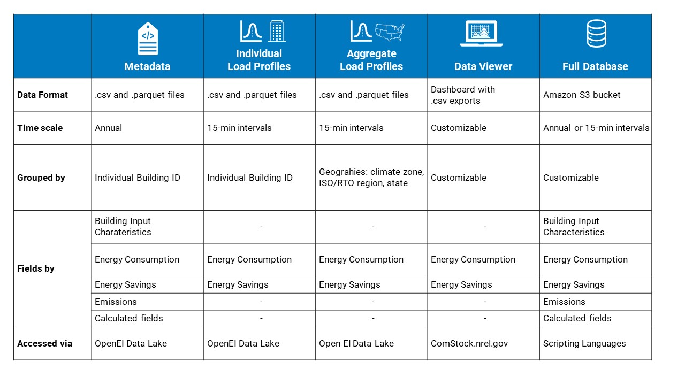
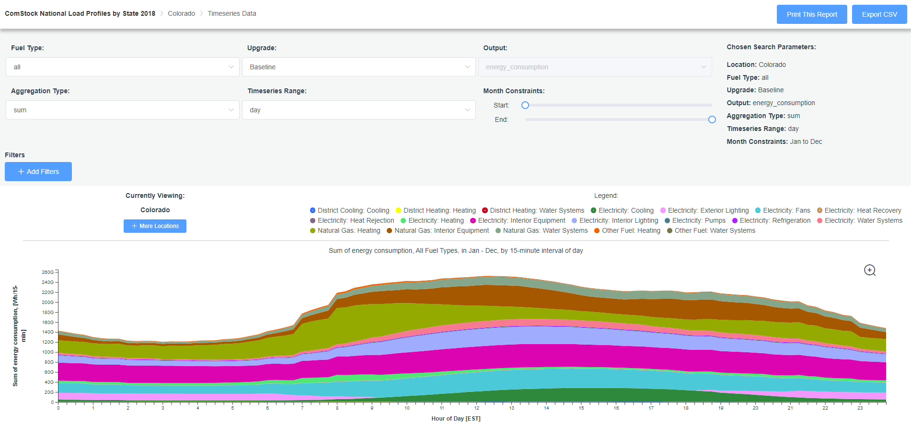
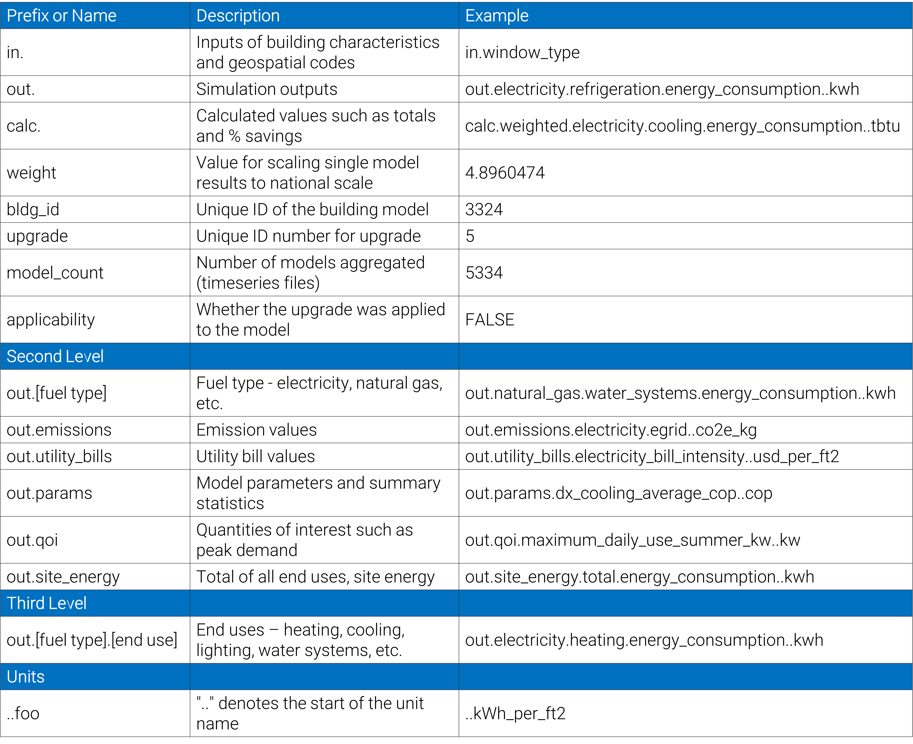

# Data
{: .fw-500 }

Given the complexity of the ComStock software workflow, and the big-data skill set and computing hardware required, the pathway for professionals and researchers to use ComStock successfully is to interact with the pre-created results, rather than running the ComStock modeling tool. This section provides information about accessing ComStock data, and a list of published datasets.

[Data Access Platforms, Structure and Contents](#data-access-platforms-structure-and-contents){: .btn .btn-uo .white-text}

## Published Datasets
These datasets describe the timeseries energy consumption of the U.S. commercial building stock at the end-use level. For details on how it was created and validated, please see the project’s [final report](https://www.nrel.gov/buildings/end-use-load-profiles.html). See the [Data Access Platforms, Structure and Contents](#data-access-platforms-structure-and-contents) section for more details about the data.

Each End Use Savings Shape dataset release is introduced with a webinar presentation. Access the webinar recordings and slides, below:
- [2024 Release 1 Webinar Recording](https://www.youtube.com/watch?v=ffybn3Xzk0E)
- [2023 Release 1 Webinar Recording](https://www.youtube.com/watch?v=7BHQfk6kvso&t=9s)
- [2023 Release 1 Webinar Slides](https://www.nrel.gov/docs/fy23osti/85853.pdf)
- [2023 Release 2 Webinar Recording](https://www.youtube.com/watch?v=uA8bThraO_E)
- [2023 Release 2 Webinar Slides](https://www.nrel.gov/docs/fy24osti/87746.pdf)

ComStock dataset releases are summarized in the following table with links for accessing the aggregate results.

|      | **ComStock End Use Savings Shape 2024 Release 1 - 2018 Weather**  |**ComStock End Use Savings Shape 2023 Release 2 - 2018 Weather** |   **ComStock End Use Savings Shape 2023 Release 1 - 2018 Weather**   |   **ComStock End Use Load Profiles - 2018 Weather**   |   **ComStock End Use Load Profiles - Typical Weather**   |
|   **OEDI Name**   | 2024/comstock_amy2018_release_1   |   2023/comstock_amy2018_release_2   |   2023/comstock_amy2018_release_1   |   2021/comstock_amy2018_release_1   |   2021/comstock_tmy3_release_1   |
|---------|---------|--------|--------|--------|--------|
|	**Data Viewer Links<br>Annual and Timeseries Energy**	| [by_state]( https://comstock.nrel.gov/dataviewer/?datasetName=vizstock_comstock_amy2018_r1_2024_by_state_vu){: .table_link_text }	| [by_state]( https://comstock.nrel.gov/dataviewer/?datasetName=vizstock_comstock_amy2018_r2_2023_by_state_vu){: .table_link_text }|	[by_state](https://comstock.nrel.gov/dataviewer/?datasetName=vizstock_comstock_amy2018_r1_2023_by_state_vu){: .table_link_text } |	[by_state](https://comstock.nrel.gov/dataviewer?datasetName=vizstock_comstock_amy2018_release_1_by_state_vu){: .table_link_text },<br>[by_puma_northeast](https://comstock.nrel.gov/dataviewer?datasetName=vizstock_comstock_amy2018_release_1_by_puma_northeast_vu){: .table_link_text },<br>[by_puma_midwest](https://comstock.nrel.gov/dataviewer?datasetName=vizstock_comstock_amy2018_release_1_by_puma_midwest_vu){: .table_link_text },<br>[by_puma_south](https://comstock.nrel.gov/dataviewer?datasetName=vizstock_comstock_amy2018_release_1_by_puma_south_vu){: .table_link_text },<br>[by_puma_west](https://comstock.nrel.gov/dataviewer?datasetName=vizstock_comstock_amy2018_release_1_by_puma_west_vu){: .table_link_text }	|	[by_state](https://comstock.nrel.gov/dataviewer?datasetName=vizstock_comstock_tmy3_release_1_by_state_vu){: .table_link_text },<br>[by_puma_northeast](https://comstock.nrel.gov/dataviewer?datasetName=vizstock_comstock_tmy3_release_1_by_puma_northeast_vu){: .table_link_text },<br>[by_puma_midwest](https://comstock.nrel.gov/dataviewer?datasetName=vizstock_comstock_tmy3_release_1_by_puma_midwest_vu){: .table_link_text },<br>[by_puma_south](https://comstock.nrel.gov/dataviewer?datasetName=vizstock_comstock_tmy3_release_1_by_puma_south_vu){: .table_link_text },<br>[by_puma_west](https://comstock.nrel.gov/dataviewer?datasetName=vizstock_comstock_tmy3_release_1_by_puma_west_vu){: .table_link_text }	|
|	**Data Table with<br>Characteristics and<br>Annual Energy Use**	| [metadata](https://data.openei.org/s3_viewer?bucket=oedi-data-lake&prefix=nrel-pds-building-stock%2Fend-use-load-profiles-for-us-building-stock%2F2024%2Fcomstock_amy2018_release_1%2F){: .table_link_text }	|[metadata](https://data.openei.org/s3_viewer?bucket=oedi-data-lake&prefix=nrel-pds-building-stock%2Fend-use-load-profiles-for-us-building-stock%2F2023%2Fcomstock_amy2018_release_2%2F){: .table_link_text }	|	[metadata](https://data.openei.org/s3_viewer?bucket=oedi-data-lake&prefix=nrel-pds-building-stock%2Fend-use-load-profiles-for-us-building-stock%2F2023%2Fcomstock_amy2018_release_1%2F){: .table_link_text }	| [metadata](https://data.openei.org/s3_viewer?bucket=oedi-data-lake&prefix=nrel-pds-building-stock%2Fend-use-load-profiles-for-us-building-stock%2F2021%2Fcomstock_amy2018_release_1%2Ftimeseries_aggregates_metadata%2F){: .table_link_text }	|	[metadata](https://data.openei.org/s3_viewer?bucket=oedi-data-lake&prefix=nrel-pds-building-stock%2Fend-use-load-profiles-for-us-building-stock%2F2021%2Fcomstock_tmy3_release_1%2Ftimeseries_aggregates_metadata%2F){: .table_link_text }	|
|	**OpenEI Data Lake**	| [suppl_data_dict](https://data.openei.org/s3_viewer?bucket=oedi-data-lake&prefix=nrel-pds-building-stock%2Fend-use-load-profiles-for-us-building-stock%2F2024%2Fcomstock_amy2018_release_1%2F){: .table_link_text } |	[suppl_data_dict](https://data.openei.org/s3_viewer?bucket=oedi-data-lake&prefix=nrel-pds-building-stock%2Fend-use-load-profiles-for-us-building-stock%2F2023%2Fcomstock_amy2018_release_2%2F){: .table_link_text }	|	[suppl_data_dict](https://data.openei.org/s3_viewer?bucket=oedi-data-lake&prefix=nrel-pds-building-stock%2Fend-use-load-profiles-for-us-building-stock%2F2023%2Fcomstock_amy2018_release_1%2F){: .table_link_text }	|	[suppl_data_dict](https://data.openei.org/s3_viewer?bucket=oedi-data-lake&prefix=nrel-pds-building-stock%2Fend-use-load-profiles-for-us-building-stock%2F2021%2Fcomstock_amy2018_release_1%2F){: .table_link_text }	|	[suppl_data_dict](https://data.openei.org/s3_viewer?bucket=oedi-data-lake&prefix=nrel-pds-building-stock%2Fend-use-load-profiles-for-us-building-stock%2F2021%2Fcomstock_tmy3_release_1%2F){: .table_link_text }	|
|	**Publication Date**	| March-24  |   Sept-23|   March-23  |	Oct-21	|	Oct-21	|
|	**Release #**	| 2024_1	|2023_2  |	2023_1	|	2021_1	|	2021_1	|
|	**Building Stock<br>Represented**	|	U.S. commercial sector circa 2018 |	U.S. commercial sector circa 2018	|	U.S. commercial sector circa 2018	|	U.S. commercial sector circa 2018	|	U.S. commercial sector circa 2018	|
|	**Upgrades Available**	| 1. Variable Speed HP RTU, Electric Backup<br>2. Variable Speed HP RTU, Original Heating Fuel Backup<br>3. Variable Speed HP RTU, Electric Backup, Energy Recovery<br>5. VRF with DOAS<br>6. VRF with 25pct Upsizing Allowance<br>7.	DOAS HP Minisplits<br>8.	HP Boiler, Electric Backup<br>9.	HP Boiler, Gas Backup<br>10.	Air Side Economizers for AHUs<br>11.	Demand Control Ventilation<br>12.	Energy Recovery for AHUs<br>13.	Advanced RTU Controls<br>14.	Unoccupied AHU Control<br>15.	Hydronic Water-to-Water Geothermal Heat Pump<br>16.	Packaged Water-to-Air Geothermal Heat Pump<br>17.	Console Water-to-Air Geothermal Heat Pump<br>18.	Comprehensive Geothermal Heat Pump Package, Hydronic GHP, Packaged GHP, or Console GHP<br>19.	Demand Flexibility, Thermostat Control, Load Shed<br>20.	Demand Flexibility, Thermostat Control, Load Shift<br>21.	LED Lighting<br>22.	Electric Kitchen Equipment<br>23.	Wall Insulation<br>24.	Roof Insulation<br>25.	Secondary Windows<br>26.	Window Film<br>27.	New Windows<br>28.	Package 1, Wall & Roof Insulation + New Windows<br>29.	Package 2, LED Lighting + Variable Speed HP RTU or HP Boilers<br>31.	Package 4, Package 1 + Package 2<br>32.	Package 5, Variable Speed HP RTU or HP Boilers + Economizer + DCV + Energy Recovery<br> |	1. HP RTU, Electric Backup;<br>2. HP RTU, Original Heating Fuel Backup;<br>3. VRF with DOAS;<br>4. DOAS HP Minisplits;<br>5. HP Boiler, Electric Backup;<br>6. HP Boiler, Gas Backup;<br>8. Demand Control Ventilation;<br>9. Energy Recovery;<br>10. LED Lighting;<br>11. Wall Insulation;<br>12. Roof Insulation;<br>13. Secondary Windows;<br>14. Window Film;<br>15. New Windows;<br>16. Package 1, Wall & Roof Insulation + New Windows;<br>17. Package 2, LED Lighting + HP RTU or HP Boilers;<br>18. Package 3, Package 1 + Package 2	|	1. HP-RTU<br>2. DOAS HP Minisplits<br>3. Heat Pump Boiler<br>5. LED Lighting<br>6. Exterior Wall Insulation<br>7. Roof Insulation<br>8. Secondary Windows<br>9.Window Film<br>10. New Windows	|	None	|	None	|
|	**Weather Year**	| [amy2018](https://data.openei.org/s3_viewer?bucket=oedi-data-lake&prefix=nrel-pds-building-stock%2Fend-use-load-profiles-for-us-building-stock%2F2024%2Fcomstock_amy2018_release_1%2Fweather%2F){: .table_link_text } |   [amy2018](https://data.openei.org/s3_viewer?bucket=oedi-data-lake&prefix=nrel-pds-building-stock%2Fend-use-load-profiles-for-us-building-stock%2F2023%2Fcomstock_amy2018_release_2%2Fweather%2F){: .table_link_text }	|   [amy2018](https://data.openei.org/s3_viewer?bucket=oedi-data-lake&prefix=nrel-pds-building-stock%2Fend-use-load-profiles-for-us-building-stock%2F2023%2Fcomstock_amy2018_release_1%2Fweather%2F){: .table_link_text }	|	[amy2018](https://data.openei.org/s3_viewer?bucket=oedi-data-lake&prefix=nrel-pds-building-stock%2Fend-use-load-profiles-for-us-building-stock%2F2021%2Fcomstock_amy2018_release_1%2Fweather%2F){: .table_link_text }	|	[tmy3](https://data.openei.org/s3_viewer?bucket=oedi-data-lake&prefix=nrel-pds-building-stock%2Fend-use-load-profiles-for-us-building-stock%2F2021%2Fcomstock_tmy3_release_1%2Fweather%2F){: .table_link_text }	|


## Data Access Platforms, Structure and Contents
At the most fundamental level, the ComStock dataset is a collection of end-use load profiles of approximately 350,000 building energy models. The output of each building energy model is 1 year of energy consumption in 15-minute intervals, separated into end-use categories.

Accessing national ComStock building load profiles in the full dataset requires big-data skills that make the full dataset inaccessible for most users. To support many use cases, aggregate load profiles for the following geographic resolutions are published for ComStock releases:

- 16 ASHRAE/International Energy Conservation Code climate zones
- 5 U.S. Department of Energy Building America climate zones
- 8 Electric System independent system operator and regional transmission organization regions
- 2,400+ U.S. Census Public Use Microdata Areas
- 3,000+ U.S. counties.

### Data Access Platforms
The following table summarizes the various ways to access and use ComStock data.


The dataset has been formatted to be accessible in four main ways to meet the needs of many different users and use cases.

  **Metadata**: Files of individual model characteristics together with annual results, commonly referred to as the “metadata” file

  **Load Profiles**: Timeseries load profiles (individual building and pre-aggregated) in downloadable spreadsheets

   **Data Viewer**: A web-based data viewer, customizable time scales and aggregations

  **Full Database**: A detailed format that can be queried with big data tools

Aggregate ComStock datasets can be accessed via the [Open Energy Initiative (OpenEI) Data Lake](https://data.openei.org/s3_viewer?bucket=oedi-data-lake&prefix=nrel-pds-building-stock%2F) and the [ComStock data viewer](https://comstock.nrel.gov/). There are two versions of the datasets published with each release: one with actual weather data (AMY), and another with typical weather data (TMY3). Note: The TMY3 15-minute energy data should not be used for larger geographies because weather events are not regionally aligned.

For information on how to query the full ComStock dataset, please refer to this [documentation](https://github.com/openEDI/documentation/blob/main/NREL_Building_Stock/Query_ComStock_Athena.md).

Please note, there are separate public datasets available for residential and commercial building stocks. 

### Open Energy Initiative (OEDI) Data Lake
OpenEI is an energy information portal, and is developed and maintained by the National Renewable Energy Laboratory with funding and support from the U.S. Department of Energy and a network of International Partners & Sponsors. The OpenEI data lake contains comprehensive aggregate data for ComStock releases. This includes metadata and timeseries energy consumption results (baseline and upgrades, if applicable), individual building energy models, weather files, geographic information, and data dictionaries. 

The ComStock release directory structure of the data lake is summarized in the table, below. For more detailed information about the contents of the ComStock OpenEI data lake, visit the [README](https://oedi-data-lake.s3.amazonaws.com/nrel-pds-building-stock/end-use-load-profiles-for-us-building-stock/README.md).

### ComStock Data Viewer
The ComStock data viewer exists to quickly filter, slice, combine, visualize, and download the results in custom ways. This platform is available at [comstock.nrel.gov](https://comstock.nrel.gov). Multiple geographic views of the datasets on the data viewer have been created: by state, and by Census region by PUMA.



### OEDI Directory Structure and Contents

| **Name**                          | **Contents**|
|-----------------------------------|--------|
|building_energy_models             | Building energy models, in [OpenStudio](https://www.openstudio.net/) format, that were run to create the dataset.|
|geographic_information             | Information on various geographies used in the dataset provided for convenience. Includes map files showing the shapes of the geographies (states, PUMAs) used for partitioning and a lookup table mapping between census tracts and various other geographies. |
|metadata                           | Building characteristics (age, area, HVAC system type, etc.) for each of the building energy models run to create the timeseries data and annual energy results. Descriptions of the characteristics are included in `data_dictionary.tsv`, `enumeration_dictionary.tsv`, and `upgrade_dictionary.tsv`.|
|timeseries_aggregates              | Aggregate end-use load profiles by building type and geography that can be opened and analyzed in Excel, python, or other common data analysis tools.|
|timeseries_aggregates_metadata     | Building characteristics for `timeseries_aggregates` building energy models. Follows the same format at `metadata`.|
|timeseries_individual_buildings    | The raw individual building timeseries data.  **This is a large number of individual files!**|
|weather                            | Key weather data used as an input to run the building energy models to create the dataset.|
|citation.txt                       | Citation to use when referencing this work.|
|data_dictionary.tsv                | Describes the column names found in the metadata and timeseries data files.|
|enumeration_dictionary.tsv         | Expands the definitions of the enumerations used in the metadata files.|
|upgrade_dictionary.tsv             | Expands the definitions of the upgrades. |

### Dataset Naming Convention
ComStock releases on OpenEI data lake and the data viewer use the following naming convention.
```
         <dataset type>_<weather data>_<year of publication>_release_<release number>
 example:   comstock   _   amy2018    _         2021        _release_       1
  result:   comstock_amy2018_2021_release_1
```
  - dataset type
    - resstock = residential buildings stock
    - comstock = commercial building stock
  - weather data
    - amy2018 = actual meteorological year 2018 (2018 weather data from NOAA ISD, NSRDB, and MesoWest)
    - tmy3 = typical weather from 1991-2005 (see [this publication](https://www.nrel.gov/docs/fy08osti/43156.pdf) for details)
  - year of publication
    - 2021 = dataset was published in 2021
    - 2022 = dataset was published in 2022
    - etc.
  - release
    - release_1 = first release of the dataset during the year of publication
    - release_2 = second release of the dataset during the year of publication
    - etc.

### Field Naming Convention

The field naming convention is fairly simple. At the highest level there is – “in.” for inputs, “out.” for outputs, “calc.” for calculated fields, then a handful of columns that provide simulation information.

For the "out." prefix there is a second level that includes – fuel type, emissions, model parameter and statistic fields, and site energy. The "in." prefix does not have a second level.

The third level of “out.” is where you’ll find the end uses.

Finally, units are denoted by a “..” with the unit following.

