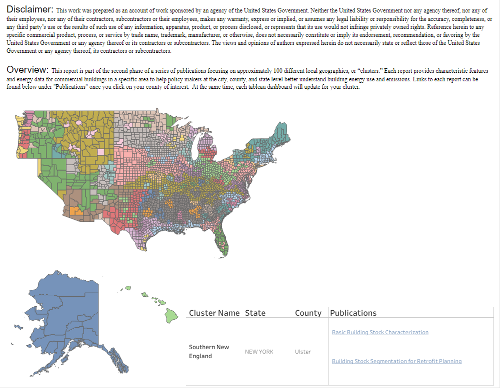

# Building Segmentation Analysis
{: .fw-500 }

## Understanding Commercial Buildings in the U.S.
The U.S. Department of Energy has developed a series of reports that provide commercial and multifamily building characteristic and energy data for 88 local geographies, with the intention of helping policymakers at the city, county and state levels better understand commercial and multifamily building energy use. 

The reports break down the building stock for each geographic cluster by  

- building type,  
- size, 
- energy consumption, and 
- emissions.

The series has four planned topics: 

1.	Commercial Building Stock Characterization (published)
2.	Commercial Building Stock Segmentation for Retrofit Planning (published)
3.	Multifamily Building Stock Segmentation for Retrofit Planning (published)
4.	Common Retrofit Solution Data for the Retrofit Segments (in progress)

Find the reports that are relevant to your specific geography by clicking on your county using the map available on [this dashboard](https://public.tableau.com/app/profile/comstock.nrel/viz/BuildingStockSegmentationforRetrofitPlanning/USMap), or searching by your county in the [this file][1].

## How Was the Segmentation for Retrofit Planning Developed?
The goal of segmentation for retrofit planning is to identify commonalities in the commercial building stock that align with retrofit strategies. Segments were created by analyzing building type, vintage, and floor area, as similar buildings often share traits like operating schedules and ownership structures. Refer to the [technical documentation](https://www.nrel.gov/docs/fy24osti/88947.pdf) for detailed segment descriptions.

## How Were the Geographic Clusters Developed?
The geographic clusters are formed on a county basis and depend on building type, age, and climate. Adjacent counties with similar commercial densities, types, and age distributions form a cluster. Clusters form regional groups if they belong to the same American Society of Heating, Refrigerating and Air-Conditioning Engineers (ASHRAE) climate zone. See the [technical reference documentation](https://www.nrel.gov/docs/fy23osti/84648.pdf) for more detail on the clustering method.

## Notes
- Topic 1 reports for California are by [California Energy Commission’s (CEC) climate zones](https://www.energy.ca.gov/programs-and-topics/programs/building-energy-efficiency-standards/climate-zone-tool-maps-and).
- Topic 2 California reports were not published due to a [known issue]({{    site.baseurl   }}) in the dataset. This issue is in progress of being resolved and does not affect multifamily buildings. 

[1]:../../assets/files/building_segmentation_analysis_report_links.csv