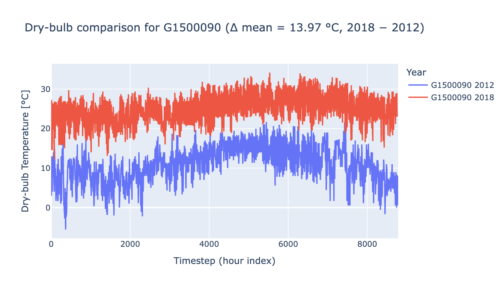
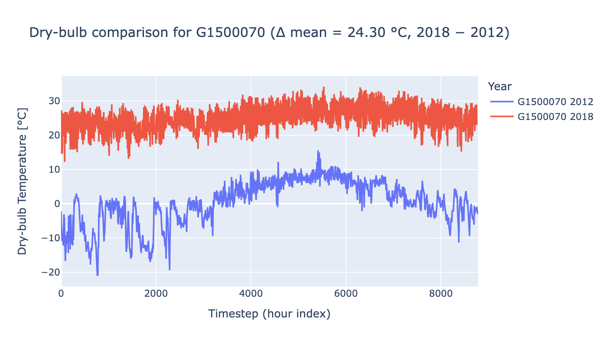

# Issue Report: Hawaii AMY2012 Weather Files in ComStock 2025 Release 2

## Summary of Issue
In ComStock 2025 Release 2 - 2012 Weather, all weather files for the state of Hawaii appear incorrect. We do not recommend using this release for analysis in Hawaii.

## Status
Impacts all models in the state of Hawaii in ComStock 2025 Release 2 - 2012 Weather. We are working to address this issue in future AMY2012 dataset releases.

## Details
The weather files used for Hawaii models in ComStock 2025 Release 2 - 2012 Weather, appear incorrect. As shown below, the temperatures in these weather files drop below 0°C (32°F), which is unrealistic for Hawaii’s climate. These weather files resulted in approximately 25% higher heating energy in the state compared to 2018 Weather ComStock releases.

Unfortunately, the weather file issue was discovered after the simulations were run and the dataset was released, and the Hawaii models cannot be rerun with corrected weather files.

{:refdef: style="text-align: center;"}

{:refdef}

## Recommendations
We do not recommend using the 2025 Release 2 - 2012 Weather dataset for analyses in Hawaii.
