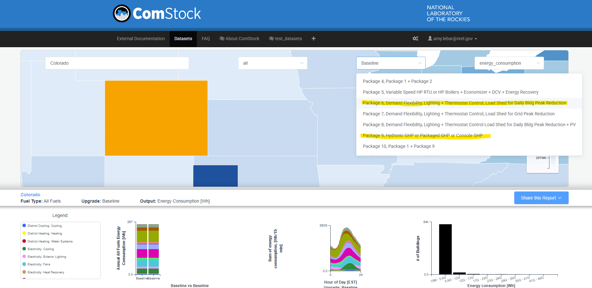

# Issue Report: Geothermal Heat Pump and Demand Flexibility Package Naming in ComStock 2025 Release 2

## Summary of Issue
In ComStock 2025 Release 2, the results and upgrade names for upgrade packages "Package 6, Demand Flexibility, Lighting + Thermostat Control, Load Shed for Daily Bldg Peak Reduction" and "Package 9, Hydronic GHP or Packaged GHP or Console GHP" are reversed. This mixup has been addressed in the OEDI `upgrades_lookup.json` and `measure_name_crosswalk.csv` files, but the mislabeling remains in the metadata and annual results files on OEDI, and on the Data Viewer.

## Status
Impacts ComStock 2025 Release 2, weather years AMY2012 and AMY2018, only. It has been resolved in ComStock 2025 Release 3.

## Details
A known issue in ComStock 2025 Release 2 (both AMY2012 and AMY2018 weather years) affects the following upgrade packages:

| Measure ID    | Incorrect Upgrade ID  | Correct Upgrade ID    | Package Name                                              |
|:--------------|:----------------------|:----------------------|:----------------------------------------------------------|
| pkg_0006      | 58                    | 55                    | Package 9, Hydronic GHP or Packaged GHP or Console GHP    |
| pkg_0009      | 55                    | 58                    | Package 6, Demand Flexibility, Lighting + Thermostat Control, Load Shed for Daily Bldg Peak Reduction |

The results for these two packages were mislabeled, with the data labeled as pkg_0006 actually reflecting the results of applying pkg_0009 to the building stock, and vice versa. The following sections summarize the impacts on the Open Energy Data Initiative (OEDI) files and Data Viewer for these two dataset releases.

### OEDI Impacts
The `upgrades_lookup.json` and `measure_name_crosswalk.csv` files have been corrected and now reflect that pkg_0006 data is found under Upgrade ID 55 and pkg_0009 results under 58. However, the incorrect names are still present in the metadata and annual results files on OEDI. In the files in the OEDI directories, below, the column "in.upgrade_name" for files under Upgrade ID 55 contains "Package 6, Demand Flexibility, Lighting + Thermostat Control, Load Shed for Daily Bldg Peak Reduction," and for Upgrade ID 58, the column contains "Package 9, Hydronic GHP or Packaged GHP or Console GHP." These labels are **INCORRECT** and should not be used to identify the upgrade package applied to the building stock in these files.

OEDI directories affected
- metadata_and_annual_results
- metadata_and_annual_results_aggregates

### Data Viewer Impacts
{:refdef: style="text-align: center;"}

{:refdef}

In the dropdown to select which upgrade scenario you are viewing (shown above), selecting “Package 6, Demand Flexibility, Lighting + Thermostat Control, Load Shed for Daily Bldg Peak Reduction” will display the results from applying pkg_0006, and “Package 9, Hydronic GHP or Packaged GHP or Console GHP” will show results from pkg_0009.
All Data Viewer views (listed below) are impacted for both AMY2012 and AMY2018 releases.
- by_state
- by_puma_northeast
- by_puma_midwest 
- by_puma_south
- by_puma_west

## Recommendations
This issue has been resolved in 2025 Release 3. For AMY2018 weather year data, please use 2025 Release 3.

AMY2012 weather year data was not released in 2025 Release 3. For AMY2012 data in 2025 Release 2 on OEDI, use the `upgrades_lookup.json` and `measure_name_crosswalk.csv` to identify which upgrade package corresponds to each upgrade ID. Note that the "in.upgrade_name" field in the metadata and annual results files cannot be fixed and remains incorrect.

For AMY2012 data in 2025 Release 2 on the Data Viewer, note that upgrades "Package 6, Demand Flexibility, Lighting + Thermostat Control, Load Shed for Daily Bldg Peak Reduction" and "Package 9, Hydronic GHP or Packaged GHP or Console GHP" are reversed. To view, filter, or download data for these packages in the Data Viewer, you will need to select the opposite package name from the dropdown.
