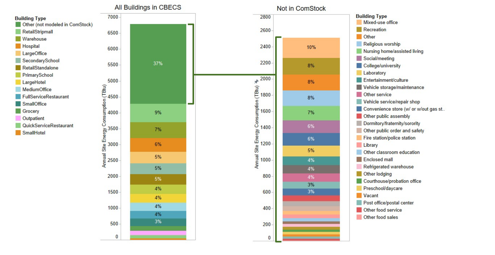

# Building Types Not Included in ComStock

Compared to the Commercial Building Energy Consumption Survey (CBECS) estimation, the ComStock™ data set accounts for 64% of the energy use and 62% of the floor area of commercial buildings in the United States. The remaining 36% of energy use not represented is due to several CBECS building types that are not yet included in ComStock, such as grocery stores and religious worship.

Figure 1 below shows the building types not represented in the ComStock model in green, on a CBECS Principal Building Activity Plus basis, and their relative contribution to commercial building energy use in the United States. As can be seen in the figure, college/universities represent the largest un-modeled building classification by energy use, followed by religious institutions, mixed-use offices, grocery stores, nursing homes, and recreational buildings.

The U.S. Department of Energy prototype building type is used to represent a significant amount of the U.S. building stock, but it is also not used in many cases due to concerns regarding its accurate representation of specific building subtypes. Please see the Building Type Assignments section in the [ComStock Reference Documentation](https://www.nrel.gov/docs/fy23osti/83819.pdf) for further discussion on each building type. It includes what buildings each type does and does not represent, as understood by ComStock's developers.

{:refdef: style="text-align: center;"}

{:refdef}

{:refdef: style="text-align: center;"}
Figure 1. Overview of building types modeled and not modeled in ComStock, and comparison to CBECS annual site energy consumption.
{:refdef}

*Other includes other public order and safety, convenience store with gas station, other classroom education, vacant, fire station/police station, courthouse/probation office, vehicle dealership/showroom, other lodging, preschool/daycare, repair shop, post office/postal center, other food service, and other food sales.

## Analysis Recommendations
ComStock represents 62% of the U.S. commercial building floor area as reported by the CBECS dataset. As a result, analyses based on ComStock data will underrepresent the energy use of the U.S. commercial building stock.

A gap model is being developed, which will represent the load profile of the remaining 38% of floor area. However, this gap model does not use physics-based building energy modeling and thus cannot estimate energy savings from upgrade measures. We do not recommend extrapolating measure energy savings from the ComStock dataset to the gap load profile. There are significant differences between buildings in ComStock and buildings in the gap model, and measure applicability and energy savings are different.

If you publish an analysis using ComStock data, we recommend citing our reference documentation and clearly stating that the model represents 62% of U.S. commercial building floor area.

<u>Suggested citation</u>:  
Parker, Andrew, et al. 2023. ComStock Reference Documentation. Golden, CO: National Renewable Energy Laboratory. NREL/TP-5500-83819. [https://www.nrel.gov/docs/fy23osti/83819.pdf](https://www.nrel.gov/docs/fy23osti/83819.pdf) 