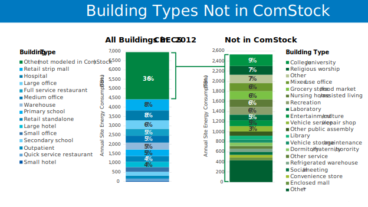

# Building Types Not Included in ComStock

*This resource incorporates updates in ComStock 2025 Release 3, including the addition of a new building type, and applies to all subsequent releases.*

Compared to the Commercial Building Energy Consumption Survey (CBECS) 2018 estimation, the ComStock™ data set accounts for 63% of both the energy use and  floor area of commercial buildings in the United States. The remaining 37% of energy use not represented is due to several CBECS building types that are not yet included in ComStock, such as colleges/universities and religious worship.

Figure 1 below shows the building types not represented in the ComStock model, on a CBECS Principal Building Activity Plus basis, and their relative contribution to commercial building energy use in the United States. As can be seen in the figure, mixed-use offices represent the largest un-modeled building classification by energy use, followed by recreation, other, religious worship, and nursing homes/assisted living buildings. 

The U.S. Department of Energy prototype building type is used to represent a significant amount of the U.S. building stock, but it is also not used in many cases due to concerns regarding its accurate representation of specific building subtypes. Please see the Building Type Assignments section in the [ComStock Reference Documentation]({{site.baseurl}}#references) for further discussion on each building type. It includes what buildings each type does and does not represent, as understood by ComStock's developers.

{:refdef: style="text-align: center;"}

{:refdef}

{:refdef: style="text-align: center;"}
Figure 1. Overview of building types modeled and not modeled in ComStock, and comparison to CBECS 2018 annual site energy consumption.
{:refdef}

*Other includes other public order and safety, convenience store with gas station, other classroom education, vacant, fire station/police station, courthouse/probation office, vehicle dealership/showroom, other lodging, preschool/daycare, repair shop, post office/postal center, other food service, and other food sales.

## Analysis Recommendations
ComStock represents 63% of the U.S. commercial building floor area as reported by the CBECS 2018 dataset. As a result, analyses based on ComStock data will underrepresent the energy use of the U.S. commercial building stock.

A gap model has been developed,[^1] which will represent the load profile of the remaining 37% of floor area. However, this gap model does not use physics-based building energy modeling and thus cannot estimate energy savings from upgrade measures. We do not recommend extrapolating measure energy savings from the ComStock dataset to the gap load profile. There are significant differences between buildings in ComStock and buildings in the gap model, and measure applicability and energy savings are different. 

If you publish an analysis using ComStock data, we recommend citing our reference documentation and clearly stating that the model represents 63% of U.S. commercial building floor area.

<u>Suggested citation</u>:  
Parker, Andrew, et al. 2023. ComStock Reference Documentation. Golden, CO: National Renewable Energy Laboratory. NREL/TP-5500-83819. [https://www.nrel.gov/docs/fy23osti/83819.pdf](https://www.nrel.gov/docs/fy23osti/83819.pdf)

## Adding Building Types to ComStock
ComStock originally modeled 14 building types, and grocery stores were added in the 2025 Release 3 update. The addition of new building types to the ComStock model is determined by both user needs and the availability of sufficient data. Decisions regarding which building types will be added to the model are influenced by research priorities set by the U.S. Department of Energy (DOE). These priorities are driven by user input and DOE’s current program goals. 

A critical factor in whether a building type can be added to ComStock is the availability of robust, space type-level data. Historically, the lack of such detailed data has been a limiting factor in expanding the range of building types represented in ComStock. To effectively add a new building type, the ComStock team requires comprehensive information, including details about how the total building floor area is distributed across various space types, what equipment is present in each space, and the energy usage specific to those spaces. 

For building type requests or to share data that could support the addition of a building type to ComStock, please email us at <ComStock@nrel.gov>.

[^1]: The commercial gap model estimates the county-level, hourly electricity consumption of Commercial-sector (building and non-building, e.g. street lighting) uses not modeled in ComStock – the “commercial gap” – and is available on the Open Energy Data Initiative (OEDI) data lake, beginning with 2025 Release 1.