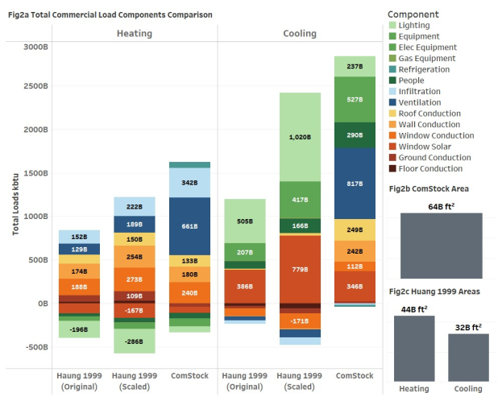

# Commercial Building Load Components Data and Analysis

## What are Building Loads and Load Components?

Heating and cooling systems are essential for maintaining comfortable indoor temperatures and proper ventilation in commercial buildings. These systems work by adding or removing heat from the indoor air, depending on the need. The amount of heating or cooling needed to keep indoor temperatures within a comfortable range is called the thermal load, or simply "load." *Heating load* is the energy required to keep temperatures above a set level, while *cooling load* is the energy removal needed maintain temperatures below a set level.

Thermal load is influenced by various factors, or "load components," that work together to impact a building's heating and cooling needs. Heat can transfer through roofs, walls, windows, and floors; sunlight entering through windows adds heat; and internal sources like people, lighting, and equipment also add heat. Outdoor air entering through leaks or ventilation systems can affect indoor temperatures, and ventilation air often requires heating or cooling for comfort. These factors interact in complex ways, depending on the building’s design, location, and utilization. Comprehensive energy modeling is commonly used to evaluate the load components.

## Load Components Study
Researchers at the National Laboratory of the Rockies (NLR) conducted a detailed analysis to better understand the load components driving heating and cooling needs across U.S. commercial buildings using the ComStock model. This study builds on earlier research from the 1990s (Huang and Franconi 1999) but makes improvements by incorporating greater variation in building types, heating and cooling systems, locations, and construction years, as well as updating the data to reflect buildings as they were around 2018. The results also offer a more detailed look at heating and cooling patterns on an hourly basis.

This research is important because understanding what contributes to heating and cooling energy use in buildings helps identify the best opportunities to improve energy efficiency and reduce overall energy consumption. The U.S. Department of Energy uses this type of data to guide decisions on technology investments and policies for making buildings more efficient. It also plays a key role in national energy studies, like those conducted by the Energy Information Administration (e.g., Commercial Building Energy Consumption Survey [CBECS]), to determine end use energy breakdowns. By updating outdated data and filling gaps in existing studies, this work provides a clearer picture of how commercial buildings use energy.

## Load Components Study Results
Figure 1 shows a comparison between total commercial building load components from ComStock and the previous 1990s load components study (Huang and Franconi 1999). Lighting technology is a notable difference: The 1990s study primarily features older T12 fluorescent lighting, whereas ComStock incorporates technologies like LEDs, T5s, and T8s. Another key variation lies in cooling gains, with the 1990s study attributing more to solar gain through windows compared to other building envelope components.
For more results from this study and discussion, refer to the published technical report (publication expected soon).

{:refdef: style="text-align: center;"}

Figure 1. Total Commercial Load Components Comparison between ComStock and (Huang and Franconi 1999).
{:refdef}

## Load Component Use Cases
The results of this load components analysis offer insights at the building stock level, providing information that can benefit a variety of ComStock users. Load components are meant for efficiency identification and ideation and should not be used to calculate savings. Energy and cost savings can be calculated directly from energy efficiency upgrade measures in ComStock standard dataset releases. Below are examples of how different users might leverage the component loads analysis.

**Building Owners and Operators:** Understand causes of heating and cooling energy usage in commercial buildings to identify opportunities for improving efficiency and reducing costs.

**Policymakers:** Use data to support energy-related decisions, develop targeted programs, and improve energy efficiency incentives.

**Utilities:** Understand regional load component trends, and design programs encouraging energy saving, especially during high-demand periods.

**Manufacturers:** Develop technologies that target load components for energy and cost savings.

## Accessing Load Components Study Results
Annual, baseline component loads results and plots are available in ComStock 2025 Release 3 (released in November 2025) on the [Open Energy Data Initiative (OEDI) data lake](https://data.openei.org/s3_viewer?bucket=oedi-data-lake&prefix=nrel-pds-building-stock%2Fend-use-load-profiles-for-us-building-stock%2F2025%2Fcomstock_amy2018_release_3%2F) in the “component_loads/” directory.

The results are also available in an [interactive Tableau dashboard](https://public.tableau.com/app/profile/comstock.nrel/viz/CommercialBuildingLoadComponents/Introduction).

For more information about the study, including its background, methods, and results, refer to the published technical report (publication expected soon).
