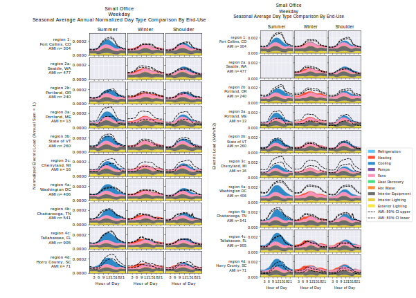
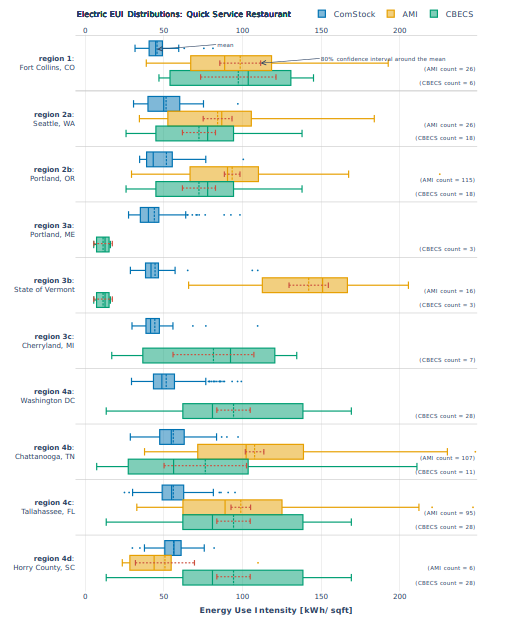

# Considerations for ComStock Calibration, Validation, and Uncertainty

A common question is whether ComStock™ is appropriately calibrated for a specific use case. The answer is highly interpretive based on many factors, including the robustness of relevant model inputs, the type of data needed (15-minute time series, annual averages, etc.), the stock segment of interest (e.g., building type, location), and the user’s tolerance for uncertainty. This document discusses the resources available to approach this question for a specific use case with examples.

ComStock has been calibrated and validated as part of the three-year End-Use Load Profiles (EULP) project. This includes using 15-minute advanced metering infrastructure (AMI) time series data from 10 regions at the building type level to improve/validate load profiles. Moreover, annual comparisons were made to the AMI data as well as the Commercial Building Energy Consumption Survey (CBECS). Beyond EULP, the ComStock tool is continuously improved as data and resources become available. Note, however, the EULP project focused on electricity calibration and therefore did not attempt to calibrate natural gas. ComStock is known to underestimate natural gas consumption, and there are ongoing efforts to resolve this issue.

There are two primary resources to help understand the calibration state and relevant model inputs of ComStock for a given use case:
1. The [EULP Final Report](https://www.nrel.gov/docs/fy22osti/80889.pdf) provides a detailed description of the ComStock calibration/validation process and results. 
- Describes the 10 regional AMI data sources used (p. 36–37)
- Load profile comparisons to AMI data sources, normalized and raw, per region and building type (p. 210–292)
- Comparisons of annual energy use intensity (EUI) distributions to CBECS and AMI by region and building type (p. 210–292).

2. [ComStock Documentation](https://nrel.github.io/ComStock.github.io/docs/resources/resources.html#references) provides the methods, assumptions, and data sources used in ComStock.
- Describes assumptions and data sources for each model feature (e.g., How are HVAC system types assigned to models? How are lighting types determined? How are data centers accounted for in offices?)
- Describes model outputs
- General reference guide for users.

Determining if ComStock is appropriate for a given use case is ultimately a judgement call for the user with the combined help of these resources. The EULP Final Report should be referenced to understand how well ComStock aligns to other available data sources, both annually and subhourly. ComStock Documentation should be engaged to understand the data sources and assumptions used to build the models. 
It is important to note that there is limited data available similar to that produced by ComStock, and therefore it is difficult to confidently validate the tool. Furthermore, the data sources that are available often have errors and discrepancies of their own. This poses further challenges when validating the model. For all intents and purposes, there is no “truth” data to determine how well ComStock matches reality. Rather, there are data sources that we can compare to increase or reduce our confidence in an aspect of the model. When one or multiple data sources align with each other and ComStock, confidence in that aspect of the model is increased. When multiple data sources do not align well with each other and/or ComStock, it becomes difficult to determine the calibration status of the tool. Users should compare their own data with ComStock, such as city benchmark data, whenever possible. They should ultimately rely on their own judgment, with the resources available, to decide if ComStock is suitable for their use case.

## Examples
This section describes example scenarios for using the discussed resources to determine if ComStock is suitable for a given use case.

### Scenario 1: Small Office Load Profiles in Florida
<u>Description:</u> A user wants to analyze the winter versus summer electricity load shape differences of small offices in Florida. They want to understand if ComStock is appropriate for this analysis.

<u>Possible Decision Pathway:</u> The [EULP Final Report](https://www.nrel.gov/docs/fy22osti/80889.pdf) compares the load profiles of ComStock small offices (and all other building types) versus regional AMI data sources. Pages 215 and 216 show the normalized and non-normalized comparisons, respectively (Figure 1).

{:refdef: style="text-align: center;"}

{:refdef}

{:refdef: style="text-align: center;"}
Figure 1. Normalized (left) and non-normalized (right) weekday seasonal average load profiles for small offices. Images are from page 215 and 216 of the EULP Final Report, with similar images for all building types.
{:refdef}

The normalized plot shows reasonable alignment between ComStock and the Tallahassee, Florida, AMI data for summer, winter, and the shoulder season, although the shoulder season does show a higher morning winter peak than ComStock. This difference in morning peak load shape should be considered. It is also helpful to consider the sample count. In this example, there are 905 buildings informing the AMI load profile, which leads to narrow confidence intervals and therefore higher confidence in the AMI load profile. Other regions, such as Portland, Maine, have far fewer samples, which would reduce confidence in the AMI load shape and should be considered if that is the region of interest. The non-normalized plot also shows close alignment in load shape but with some differences in load scale, with the AMI profiles showing higher usage. The EULP report explains that non-normalized AMI profiles create more uncertainty because they depend on knowing the floor area served by buildings in the AMI data set for fair comparisons with ComStock. In contrast, normalized plots eliminate this uncertainty by focusing solely on comparing load shape.

<u>Conclusion:</u> There is reasonable evidence to suggest that ComStock is representing small office load profiles in Florida well. Furthermore, there is little evidence to suggest that ComStock may not be representing these profiles well. The final decision depends on the level of confidence required for the application, but in many cases, ComStock should be appropriate for this use case. 

### Scenario 2: Small Office Load Profiles in Chicago
<u>Description:</u> A user wants to analyze the winter versus summer electricity load shape differences of small offices in Chicago. They want to understand if ComStock is appropriate for this analysis.

<u>Possible Decision Pathway:</u> Similar to Scenario 1, the EULP report compares the load profiles of ComStock small offices (and all other building types) versus regional AMI data sources. Pages 215 and 216 show the normalized and non-normalized comparisons, respectively (Figure 1).

In this example, neither Chicago nor any other major Midwest city is represented by the available AMI calibration regions. This should be considered first and foremost. However, the plots show reasonable alignment between ComStock and AMI load profiles across all regions, including colder areas such as Fort Collins, Colorado; the state of Vermont; Portland, Maine; and Cherryland, Michigan. This provides confidence that ComStock translates well across regions for small offices, and therefore it may represent Chicago well, too. This is of course an extrapolation, which should be considered. However, the EULP report explains that the purpose of the AMI calibration regions is to provide comparisons across multiple region types, where data exists to build confidence in ComStock’s ability to translate across regions where data was not available.

<u>Conclusion:</u> Though there is no direct AMI comparison to Chicago in the EULP report, the agreement between ComStock and the available AMI data across multiple regions provides evidence that ComStock may be appropriate for representing small office load profiles in Chicago. The conclusion is therefore similar to Scenario 1.

### Scenario 3: EUI Benchmarking for Quick-Service Restaurants
<u>Description:</u> A user wants to understand reasonable electric EUI targets for quick-service restaurants across the United States.

<u>Possible Decision Pathway:</u> Page 264 of the EULP Final Report compares electric EUI distributions for quick-service restaurants among ComStock, AMI data, and CBECS. Samples counts for AMI and CBECS are shown on the right (Figure 2). 

{:refdef: style="text-align: center;"}

{:refdef}

{:refdef: style="text-align: center;"}
Figure 2. Electric EUI distribution comparison among ComStock, AMI, and CBECS for quick-service restaurants.
{:refdef}

Observing Figure 2, there are many instances where the distributions do not align well among data sources. In some cases, this may be due to low sample counts. For example, regions 3a and 3b show very different EUIs for CBECS compared to CBECS in other regions. However, these regions only have three samples of data, which makes the suggested distribution less reliable to draw conclusions from. Regardless, it adds uncertainty. In general, the ComStock EUI distributions are much narrower than CBECS or the AMI in all cases. This should be considered if understanding the full range of the distribution is important for the given analysis. There are some regions where the CBECS data and AMI data distributions align well, such as region 2 and region 4c. Agreement among comparative data sources adds confidence to their credibility. However, the ComStock distribution is almost always considerably less than the other data sources, suggesting that ComStock may be underestimating electric EUI in quick-service restaurants. Of course, it is difficult to know what the “truth” is actually based on limited data, but two data sources suggesting something different from ComStock reduces certainty in the ComStock results for this segment. There are also instances where CBECS, ComStock, and the AMI all disagree, further adding to uncertainty.

<u>Conclusion:</u> Based on the available data, it is difficult to conclude that ComStock is reliably representing the electric EUI distribution of quick-service restaurants. Further, disagreements between the AMI and CBECS in some instances add further uncertainty in our understanding of reality for this metric. The final decision is still based on user judgment for an intended use case, but for many applications, ComStock may not be appropriate for this particular use case.

### Scenario 4: Stock Characterization of LED Lighting
<u>Description:</u> A user wants to understand where there is still potential for LED lighting replacement across the United States. 

<u>Possible Decision Pathway:</u> Section 4.5.1 in the ComStock Reference Documentation discusses the methodology and data sources behind the lighting model in ComStock. A user could leverage this documentation to understand how the lighting model works, and ultimately make a judgment call for their intended use case. The documentation describes ComStock as using a distribution of lighting technology types informed by various data sources and assumptions. Additionally, it compares features of the ComStock lighting model to other available studies, noting that some of these studies are over five years old at this point, which should be considered for rapidly evolving technologies such as LED lighting. These resources enable the user to determine if the prevalence of LED lighting in ComStock is suitable for their application. 

Note, however, that several of the assumptions and comparisons made in ComStock’s lighting model are informed at the state or national level. Therefore, it is essential for users to carefully assess the level of detail required for their specific research. For instance, if your goal is to analyze the potential of LED lighting in urban versus rural counties within a state, it is worth noting that the data sources and methodologies used in the ComStock model might lack some features and granularity to fully investigate this scenario. For example, the ComStock lighting model does not have a separate set of assumptions and rules for rural versus urban counties, so a user would have to determine if ComStock is appropriate for their use case.

<u>Conclusion:</u> According to the ComStock Reference Documentation, the ComStock lighting model is fairly robust and compares reasonably well to other available data sources. Therefore, a user could find ComStock to be appropriate for many use cases regarding LED lighting potential in commercial buildings. However, there are limitations in the detail of the lighting model that should also be considered for specific use cases.

### Scenario 5: HVAC System Type
<u>Description:</u> A user wants to understand which HVAC system types should be prioritized for retrofit. To do this, they want to understand which HVAC systems are most prevalent in commercial buildings.

<u>Possible Decision Pathway:</u> Section 4.8 in the ComStock Documentation discusses the methodology and data sources behind the HVAC model in ComStock. Because the user is interested in HVAC system prevalence, they would look to sections 4.8.1 and 4.8.2 for understanding the heating fuel type and HVAC system type methodologies in ComStock. These sections explain that ComStock primarily leverages CBECS for determining the prevalence of various HVAC system types in commercial buildings. Heating fuel type is dependent on building type and census division, but also leverages county-level data from NREL’s ResStock™ tool to inform county-level differences. HVAC system type prevalence is dependent on heating fuel type, building type, and census division.

However, the documentation also suggests some possible limitations with ComStock’s HVAC prevalence. For instance, determining a comprehensive HVAC system type from CBECS microdata is non-trivial and often requires engineering judgment and interpretation. Additionally, CBECS has limited sample size, which can increase uncertainty. 

<u>Conclusion:</u> Overall, the prevalence of HVAC system and heating fuel types in ComStock is informed by reputable data sources. This would likely make ComStock appropriate for many use cases regarding HVAC system type prevalence in commercial buildings. However, there are also limitations. ComStock uses residential heating fuel data to inform county-level differences in heating fuel type. There may be some error in this approach. CBECS HVAC system type data has limited sample size for some combination of building type and census division, which may increase uncertainty beyond what is appropriate for a use case.

## Other Notes
- Always consider sample size (see [Sample Size Considerations]({{site.baseurl}})).
- Consider the granularity of input data for a given aspect of the model when assessing ComStock for your use case.
- ComStock has received minimal natural gas calibration at this point, but there are ongoing efforts to improve this aspect of the model (see [Gas Consumption Underrepresented]({{site.baseurl}})).