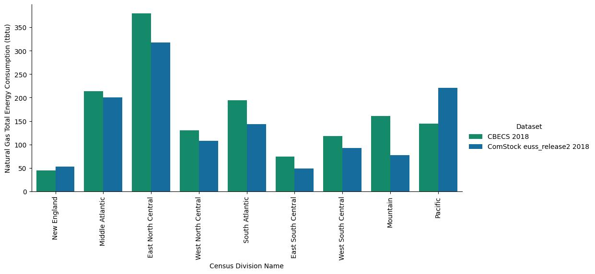

# ComStock Limitation: Gas Consumption Underrepresented

### ComStock’s annual gas consumption results are about 30% lower nationally as compared to the Commercial Building Energy Consumption Survey. 

ComStock™ has been calibrated and validated as part of the three-year End-Use Load Profiles (EULP) project. Beyond EULP, the ComStock tool is continuously improved as data and resources become available. Note, however, the EULP project focused on electricity calibration, and therefore did not attempt to calibrate natural gas. ComStock is known to underestimate natural gas consumption, and there are ongoing efforts to resolve this issue.

{:refdef: style="text-align: center;"}

{:refdef}

## Recommendations
Using the latest release of ComStock will ensure you have the best available data. Improvements to the baseline model are incorporated before each release. For the latest documentation on recent changes, please visit [ComStock’s public repository](https://github.com/NREL/ComStock) on GitHub. A summary change log can also be found in the release notes. 

In the meantime, users could consider applying a correction factor to the gas consumption results. The recommended approach to this is:
- Sum the floor area and energy data for the region you care about.
- Compare to known floor area and energy data.
    - Some users may have locally provided private data.
    - Energy Information Administration [Form 861](https://www.eia.gov/electricity/data/eia861/) (electricity) and [Form 176](https://www.eia.gov/naturalgas/ngqs/#?year1=2019&year2=2022&company=Name) (gas) are useful for this exercise. Be aware that these sources report any consumption considered “commercial” by utilities, which may include light industrial facilities, street lighting, etc.
    - Use [Commercial Building Energy Consumption Survey](https://www.eia.gov/consumption/commercial/) data, such as Table B20. “Energy sources, floorspace” is another option that is available at the Census region level.   
- Scale the ComStock data to match the known floor area. If possible, corrections should be done by building type, vintage, etc.
- Scale the gas consumption of the ComStock results to match the area-weighted gas energy consumption intensity in the known data.
