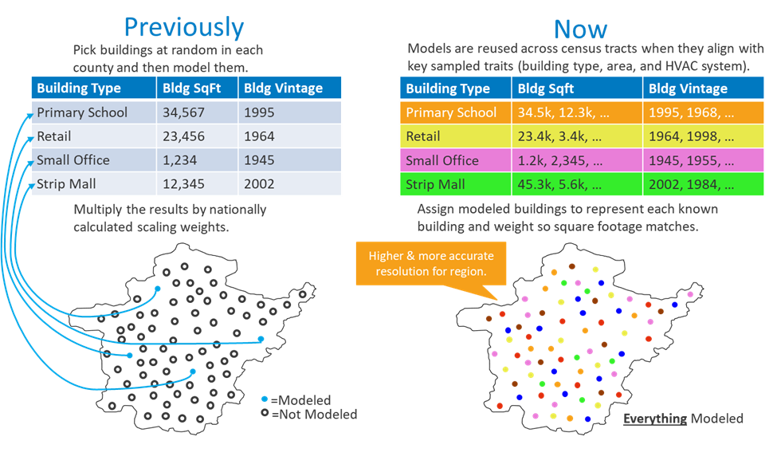
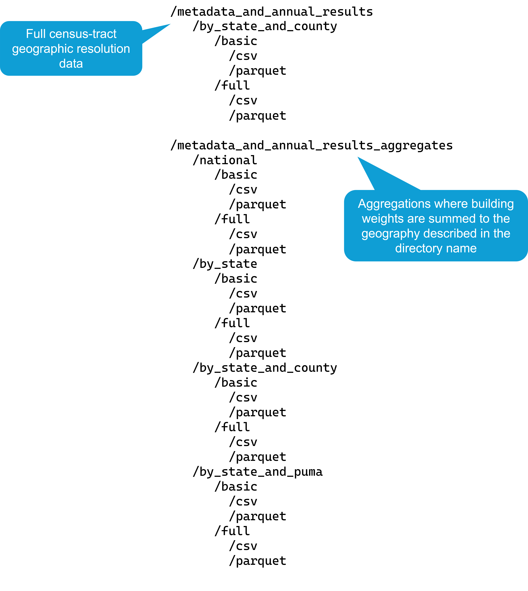

# New ComStock Sampling Method
ComStock uses statistical sampling methods to generate building energy models that represent the U.S. commercial building stock.

Beginning with standard dataset release (SDR) 2024 Release 2, ComStock datasets use an improved sampling methodology. The update delivers several improvements that enhance ComStock’s usability and expand its applicability. One key advancement is the higher spatial granularity, which allows for more accurate representation of smaller geographies, such as cities and towns. This improvement enables users to conduct more detailed analyses at the city or community level, supporting use cases like localized energy planning and building stock assessments.

These updates also streamline analyses by reducing the need to manually reweight samples for smaller geographic regions. This change reduces user workload while improving the reliability of results. Additionally, the dataset now includes better representation of rural areas, addressing a gap in previous dataset releases and ensuring more comprehensive insights across diverse geographies.

To learn more about the ComStock sampling and weighting process at a high level, please visit the [Sampling and Weighting in ComStock]({{  site.baseurl  }}) explanation.

## What is the new sampling?
In ComStock’s new sampling methodology, a single energy model may be used to represent similar buildings across distinct but comparable geographies (Census tracts). For example, an office building in one census tract with similar characteristics to an office building in another can be modeled using a single building energy model. A model will be reused across census tracts, with different weights, when they align with key sampled traits, namely building type, floor area and HVAC system type. The locations also need to be close enough in proximity to use the same weather file. Like the previous sampling method, weights are calculated and assigned to each model to scale the model to the actual building floor area it represents (across multiple actual buildings). In the new sampling method, weights for each instance of the model are based on the floor area of the actual building the model instance represents.

This approach maintains accuracy while reducing the computational burden of generating unique energy models when a single model can accurately represent multiple buildings across geographies.

{:refdef: style="text-align: center;"}

{:refdef}

## How to use the new sampling
ComStock dataset releases continue to be available on the [existing platforms](https://nrel.github.io/ComStock.github.io/docs/data.html#data-access-platforms-structure-and-contents), namely the Open Energy Data Initiative (OEDI) and data viewer. The following sections discuss differences in the platforms with the new sampling method.

### Open Energy Data Initiative (OEDI)
Due to the increased geographic granularity available in ComStock, the amount of data in each dataset release has increased. To keep file sizes manageable for most users, the metadata and annual results file structure on OEDI has been modified. Users can now choose between low-resolution and high-resolution files, depending on their specific needs. High-resolution files provide metadata and annual results at Census-tract resolution. Low-resolution, aggregate files are available at various geographic levels to provide smaller, more manageable file sizes.

The low-resolution and high-resolution files differ in two key ways: (1) How they handle duplicate building energy models, and (2) available attributes. In the high-resolution files, the same building ID may appear multiple times, representing instances of the building model reused across different Census tracts. This repetition reflects the increased geospatial resolution, enabling more granular analyses of specific regions. Each high-resolution file retains all columns, including attributes with Census tract granularity, such as Cambium grid region, ISO / RTO region, and CEJST designation, to provide comprehensive data for detailed analysis.

In contrast, the low-resolution aggregate files consolidate data by combining duplicate models in the geography. Each building ID appears only once, with an associated weight representing the sum of the weights of all instances of the building ID in the geography. However, some columns—such as Cambium grid region, CEJST designation, and other attributes that cannot be meaningfully aggregated from the tract level—are omitted from the low-resolution files. This streamlined structure prioritizes manageability, making the aggregate files more suitable for broader, less detailed analyses.

These complementary approaches allow users to choose the resolution that best suits the needs of the analysis. High-resolution files are ideal primarily for sub-county level analyses. 

The figure below shows the new OEDI file structure. Note that dataset releases prior to 2024 Release 2 will retain their original file structure on OEDI.

{:refdef: style="text-align: center;"}

{:refdef}

The high-resolution files are available in the “metadata_and_annual_results” directory and organized by state and county to manage file size. For each geography, there are “basic” and “full” file options. Basic files have fewer attributes and smaller file size. Full files contain all attributes and therefore have a larger file size. Additionally, files are available in .csv and .parquet file types. .csv files are generally compatible with Microsoft Excel and are a larger size. .parquet files are more compact but require programming to use and access.

Low-resolution aggregate files have much smaller sizes and are suitable for most use cases. As discussed above, aggregate means that weights for building IDs that appear more than once in a given geography are summed so that each building ID only appears once in the aggregate file. Low-resolution aggregate files can be found in the “metadata_and_annual_results_aggregates” directory. Aggregate files are available at several geographic levels to meet many user needs. With the exception of the “national” level, the highest resolution available in each file matches the name of the directory. For example, the files in “by_state_and_county” are aggregated by county and therefore county-level resolution is the highest available. The “national” file is only exception, where the highest resolution is state-level to provide useful analysis capability while maintaining a reasonable file size. As with the high-resolution files, all files are available as “full” or “basic” in either .csv or .parquet file type.

Timeseries data on OEDI will maintain the same structure, with both individual and aggregate load profile files available.

**Note:** Training resources, like tutorials and example scripts, showing how to use the new OEDI file structure are coming soon…

### Data Viewer
The web data viewer interface maintains the same resolution as before but now includes a higher number of samples at the county and tract levels. This means that county- and tract-level analyses will benefit from increased sample count.