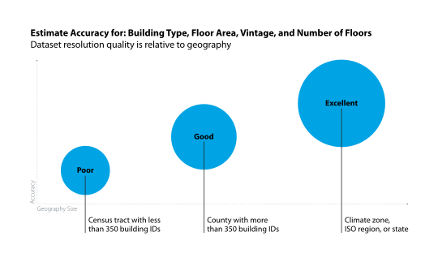

# ComStock Limitation: Sample Size Considerations

## The ComStock team recommends a minimum of 350 building ID samples and at least 1 building from all 14 building types when filtering or down-selecting the data set.

A frequently asked question is, “How granular or accurate are ComStock™ data sets?” The answer, unfortunately, is not simple. It depends on which part of the data set you are using and the question(s) you are trying to answer. The appropriate geography (county, PUMA, or tract) to use for your analysis depends on several factors, including but not limited to:

- Sample count
- If you are using “post-processed geographies”
- A given building characteristic’s probability distribution assignment conditions.

## Sample Count
Any estimate of the energy consumption of the U.S. commercial building stock relies heavily on an estimate of how much floor area of each type of building exists in each part of the country. ComStock uses multiple data sources to create probabilistic distributions used in its stock estimation process. 

The plot on this chart provides users with a general idea of how you can think about the data relative to geography. For example, if your problem statement is, “I want to understand the annual energy use by building type for the city of Richmond, California,” the data set can provide good resolution assuming the geography you selected has more than 350 building samples or building IDs in the data set.

{:refdef: style="text-align: center;"}

{:refdef}

## Post-Processed Geographies
Using the PUMA and Tract geographic fields presents several complications for certain analyses. 

Census PUMA and Tract are assigned to ComStock models after sampling based on building type and building floor area distributions. There are many Tracts within a single county, as is the case with some PUMAs, especially in densely populated areas. Building characteristics and energy results analyzed at these geographic levels therefore have lower confidence. There are relatively few ComStock models in single counties, and separating the models further can lead to unrealistic results. For example, consider a single county with around 300 building models in it representing 14 building types and 80+ other building characteristics included in ComStock. When ComStock places these models into PUMAs or Tracts, the size of the building and the type of the building are considered, but nothing else. This can have unintended consequences when using this data at a PUMA or Tract level.

## Building Characteristic Probability Distribution Assignment Conditions
The probability distributions for the building characteristic fields are described in Table 2 of the [ComStock Reference Documentation](https://www.nrel.gov/docs/fy23osti/83819.pdf). Many of the fields in the Commercial Building Energy Consumption Survey (CBECS) data source are only resolved to the census division level, while data sources such as CoStar, Lightbox, and others are resolved to the census tract and below. To determine how good a probability distribution is, one must understand the data source and then make a judgement call.  For example, the data source for the HVAC system type fields is CBECS. So, the data set is probably not excellent at anything finer than census division, while CoStar is the source for the fields building type, size (square feet), vintage, and number of stories, and is likely good as long as the geography selected has more than 350 building IDs.
