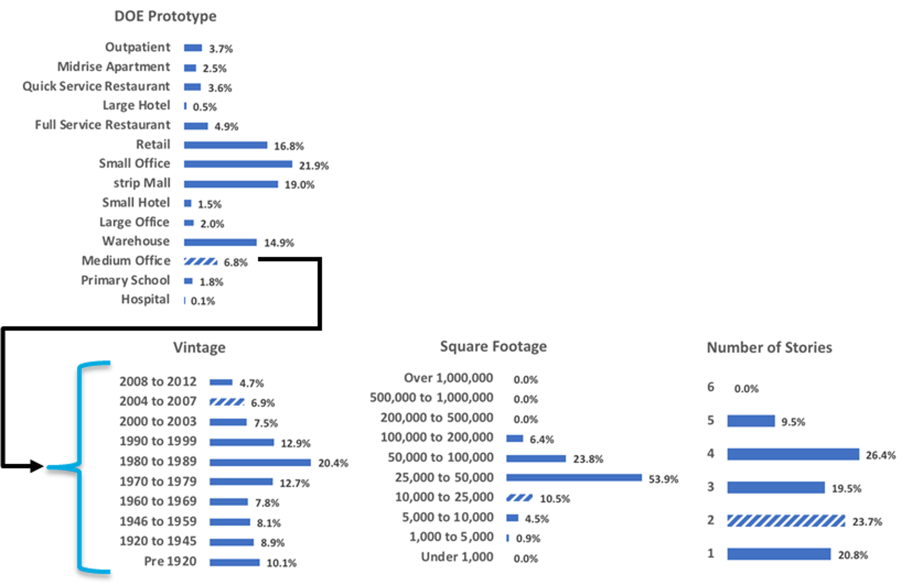
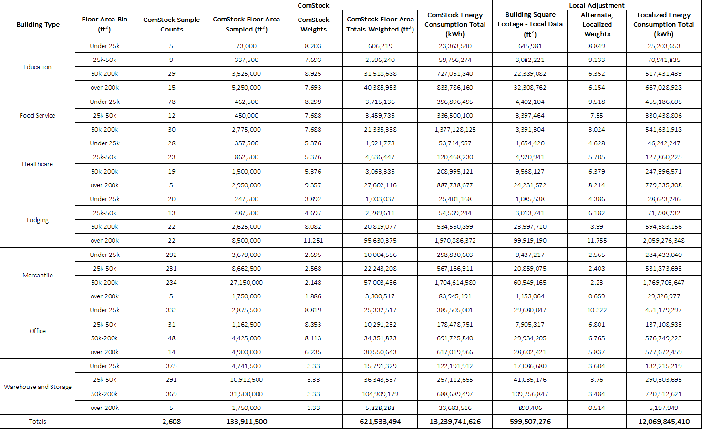

# Sampling and Weighting in ComStock

Within ComStock, U.S. commercial building characteristics are sampled such that each building energy model (BEM) represents not a real individual building at a specific address, but instead, a small representative portion of the overall stock. In this explanation, we overview how these building samples are generated, what the weights of each sample represent, and how weights can be used to customize results. This explanation condenses information from the more detailed technical explanation found in the [ComStock Reference Documentation](https://nrel.github.io/ComStock.github.io/docs/resources/resources.html#references).

## Summary of Sampling and Weighting Approach

ComStock simulates energy in representative sampled buildings that, when weighted and added together, equals energy consumption in the U.S. for the targeted building types. Before the energy simulation can occur, the building stock counts and characteristics must be described. ComStock develops a multidimensional probability space of key variables on the commercial building stock and then samples from that space to create BEMs. This probability space covers both stock characteristics such as building size, age, types, and location as well as features of the buildings themselves such as occupancy/use schedules, fuel types, equipment type/age, and building code used for original construction and retrofits. The sampling process can be summarized in three steps: 1. stock estimation, 2. characteristic estimation, and 3. sampling.

Stock estimation probabilistically describes building size, age, type, and location throughout the U.S. by combining three key data sources: CoStar – a commercial real estate database, the Homeland Infrastructure Foundation-Level Data – a Department of Homeland Security database on critical infrastructure, and the Commercial Building Energy Consumption Survey (CBECS) – an Energy Information Administration survey focused on commercial building energy use. Data quality and coverage vary by building type relative to the dataset’s main intended use, so all three of these databases are mapped with conflicts resolved to create a single amalgamated database for the U.S. CBECS serves as the “ground-truth” estimation of floor area. With the combined database, a probability distribution was first created by converting the individual datapoints by climate zone into probability distributions (i.e., the likelihood of a building existing in each of the ASHRAE 90.1 climate zones in the U.S.). Next, within each climate zone, a probability is calculated of a building being in an individual county. We next apply building type distributions within each county. Floor area, vintage, and number of stories are next assigned as independent distributions for each building type within a county.

{:refdef: style="text-align: center;"}

{:refdef}

Once the commercial building stock is characterized, additional characteristics on energy influential variables are added to the probability distribution network. There are many characteristics captured in ComStock, but they can be binned into four major categories: 1. occupancy and use schedules, 2. equipment type, 3. equipment age, and 4. building code. Occupancy and use schedules vary greatly between building types (e.g., schools versus hospitals) with variation depending on day of the week and sometimes season. Even within a building type there exists differences within schedules just based upon individual building operations. Equipment characteristics captures a broad range of information on building equipment such as equipment presence, fuel use, and efficiency levels. These characteristics are especially important for the characterization of HVAC in the commercial building stock. Equipment age is similarly influential for HVAC, but also for a range of other systems. The equipment age might match the vintage of the building, however, in commercial buildings, some subsystems are replaced on a more frequent schedule and the efficiency of these more modern replacements impacts the building’s energy consumption. Finally, building code influences many of the thermal properties and efficiency of installed equipment in the building. Building codes set the minimum required efficiency, but code adoption is not uniform throughout the U.S.

Once the multidimensional probability distributions are created from the source data, we draw samples for each of the individual BEMs in ComStock. ComStock uses [Sobol Sequences](https://people.sc.fsu.edu/~jburkardt/py_src/sobol/sobol.html) for sampling with the goal of this approach being to accurately capture the full extent of the probability distributions with limited samples on a non-biased basis. As of 2024 Release 1, a normal national scale run of ComStock would draw 350,000 samples and create and run a BEM for each. A new sampling method[^1] was implemented starting in ComStock 2024 Release 2 that reduces sample size while preserving model representativeness via a reallocation process. Now, a typical national scale ComStock run will draw 150,000 samples and run a BEM for each. Weights are applied to each model based on the actual building floor area it represents in the U.S. commercial building stock.

## Applying Weights

For each sample building in published ComStock data, the appropriate weight is provided under the label “weights”. Each weight is a measure of how many real buildings a ComStock sample should represent. For example, a small office with a weight of 8.8, means that that individual building energy model represents 8.8 real small offices in that geography. Adding up all the weights within a building type will give the ComStock total building counts meant to be represented by the model. These weights can also be applied to move from modeled floor area to represented floor area. This is pre-calculated as a the output “calc.weighted.sqft”. To move any ComStock energy output from individual BEM to real-world representation, it needs to be multiplied by the weight of the model. Some energy and emissions outputs already have the weight applied; these fields will have the term “weighted” included in the name.

For some applications, particularly when a user might want to analyze a smaller geography, the represented building count and floor area might have discrepancies with other ground truth data sources.  This is because the accuracy of building count and floor area estimates in ComStock decrease with increasing geographic resolution. In the case of a discrepancy, a user can customize the weights to be more representative of their geography or segment of interest. In the Resources section, there is a detailed How-to in [analyzing the annual energy use of a city]({{site.baseurl}}) that provides information on downloading, locating, and analyzing weights and sample counts for different building types.  Additionally, there is a Tutorial on [blending ComStock and local data]({{site.baseurl}}) that discusses incorporation of local floor area estimates to improve representation of ComStock data at specific geographic resolutions.

## Hypothetical Re-weighting Example

From the more detailed tutorial and how-to guide (linked above), we can draw a hypothetical example of how weights can be adjusted. In this example, we are comparing ComStock weighted floor area by building type and size to weighted floor area by building type and size from a local data source. The local source could, for example, be from a tax assessors database. On the left side of the table, we show the ComStock sample counts, weights, and weighted floor area and energy consumption by building type and size for a hypothetical geography. The right side shows the total floor area from the local data source for the same geography, organized by the same building type and size categories. Looking at the “ComStock Floor Area Totals Weighted” and “Building Square Footage - Local Data” columns for the first row (Education buildings Under 25k ft2), we see that the two do not align (~6% difference). To adjust the ComStock results to more closely reflect the local stock, we calculate an alternate weight by dividing the floor area from the local data source by the ComStock sampled floor area. This would result in an alternate, localized weight of 8.849 (645,981 ft2 / 73,000 ft2 = 8.849) compared to a ComStock weight of 8.203. This new weight can be used to adjust annual energy consumption (as shown in the “Localized Energy Consumption Total”), but also can be applied to all ComStock energy and emissions outputs to adjust segment and localized totals for all the ComStock models within the given building type and size bin.

{:refdef: style="text-align: center;"}

{:refdef}

[^1]: Read the [New ComStock Sampling Method]({{site.baseurl}}) explanation for more details about the new sampling approach.