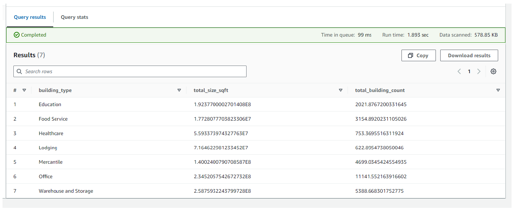
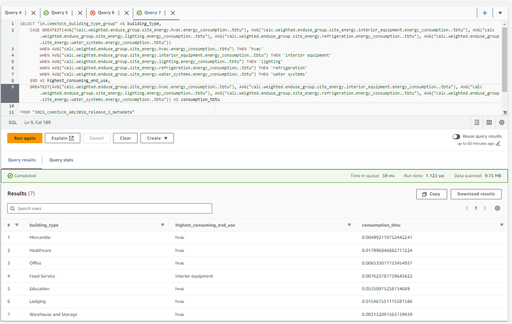

# Amazon Web Services (AWS) Athena Queries
The following queries were run on a table created from this Amazon S3 bucket: <https://data.openei.org/s3_viewer?bucket=oedi-data-lake&prefix=nrel-pds-building-stock%2Fend-use-load-profiles-for-us-building-stock%2F2023%2Fcomstock_amy2018_release_2%2Fmetadata%2F>

<details markdown="block" class="level1-collapse-section" open>
<summary class="pub-header">Prompt 1: How many buildings exist in the county of Denver, by type and size?</summary>

<b>Query</b>
```
SELECT
  "in.comstock_building_type_group" AS building_type,
  SUM("calc.weighted.sqft") AS total_size_sqft,
  SUM("weight") AS total_building_count
FROM
  "2023_2_metadata"
WHERE
  "in.state_name" = 'Colorado'and "upgrade" = 0
GROUP BY
  "in.comstock_building_type_group"
ORDER BY
  "in.comstock_building_type_group";
```
<b>Results</b><br>
{:refdef: style="text-align: center;"}
[](../../../assets/images/aws_athena_query_1.png)
{:refdef}
<b>Notes</b><br>
<ul>
    <li>There are two different options that can be used as building type: 1) "in.comstock_building_type_group" and 2) "in.comstock_building_type".</li>
    <li>There are also different options for the sqft column. You could choose “calc.weighted.sqft” or “in.sqft". Because we say "in Colorado," we recommend selecting the weighted column.</li>
</ul>
</details>


<details markdown="block" class="level1-collapse-section">
<summary class="pub-header">Prompt 2: In Colorado, which buildings are responsible for the most emissions today, by building type and by size such as small, medium, and large?</summary>

**Query**
```
WITH CategorizedBuildings AS (
    SELECT
        "in.comstock_building_type" AS building_type,
        CASE
            WHEN "in.sqft" <= 25000 THEN 'Small'
            WHEN "in.sqft" > 25000 AND "in.sqft" <= 50000 THEN 'Medium'
            WHEN "in.sqft" > 50000 AND "in.sqft" <= 200000 THEN 'Large'
            ELSE 'Very Large'
        End AS BuildingSize,
        "calc.weighted.emissions.total_with_egrid..co2e_mmt"
    FROM
        "2023_2_metadata"
WHERE
  "in.state_name" = 'Colorado' and "upgrade" = 0
)
SELECT
building_type,
    BuildingSize,
   SUM("calc.weighted.emissions.total_with_egrid..co2e_mmt") as TotalEmissions
FROM
    CategorizedBuildings
GROUP BY
    building_type,
    BuildingSize
ORDER BY
    BuildingSize,
    TotalEmissions DESC

```
**Results**
{:refdef: style="text-align: center;"}
[](../../../assets/images/aws_athena_query_2.png)
{:refdef}

**Notes**

There are 8 weighted emissions columns you can choose from:
- calc.weighted.emissions.electricity.egrid_2021_subregion..co2e_mmt
- calc.weighted.emissions.electricity.lrmer_high_re_cost_15_2023_start..co2e_mmt
- calc.weighted.emissions.electricity.lrmer_low_re_cost_15_2023_start..co2e_mmt
- calc.weighted.emissions.fuel_oil..co2e_mmt
- calc.weighted.emissions.natural_gas..co2e_mmt
- calc.weighted.emissions.propane..co2e_mmt
- calc.weighted.emissions.total_with_cambium_mid_case_15y..co2e_mmt
- calc.weighted.emissions.total_with_egrid..co2e_mmt
</details>


<details markdown="block" class="level1-collapse-section">
<summary class="pub-header">Prompt 3: Rank the end uses by average highest energy consumption for each building type in Michigan.</summary>

**Query**
```
SELECT "in.comstock_building_type_group" AS building_type,
CASE GREATEST(AVG("calc.weighted.enduse_group.site_energy.hvac.energy_consumption..tbtu"), AVG("calc.weighted.enduse_group.site_energy.interior_equipment.energy_consumption..tbtu"), AVG("calc.weighted.enduse_group.site_energy.lighting.energy_consumption..tbtu"), AVG("calc.weighted.enduse_group.site_energy.refrigeration.energy_consumption..tbtu"), AVG("calc.weighted.enduse_group.site_energy.water_systems.energy_consumption..tbtu"))
        WHEN AVG("calc.weighted.enduse_group.site_energy.hvac.energy_consumption..tbtu") THEN 'hvac'
        WHEN AVG("calc.weighted.enduse_group.site_energy.interior_equipment.energy_consumption..tbtu") THEN 'interior equipment'
        WHEN AVG("calc.weighted.enduse_group.site_energy.lighting.energy_consumption..tbtu") THEN 'lighting'
        WHEN AVG("calc.weighted.enduse_group.site_energy.refrigeration.energy_consumption..tbtu") THEN 'refrigeration'
        WHEN AVG("calc.weighted.enduse_group.site_energy.water_systems.energy_consumption..tbtu") THEN 'water systems'
    END AS highest_consuming_end_use,
    GREATEST(AVG("calc.weighted.enduse_group.site_energy.hvac.energy_consumption..tbtu"), AVG("calc.weighted.enduse_group.site_energy.interior_equipment.energy_consumption..tbtu"), AVG("calc.weighted.enduse_group.site_energy.lighting.energy_consumption..tbtu"), AVG("calc.weighted.enduse_group.site_energy.refrigeration.energy_consumption..tbtu"), AVG("calc.weighted.enduse_group.site_energy.water_systems.energy_consumption..tbtu")) AS consumption_tbtu
FROM "2023_2_metadata "
WHERE "in.state_name"='Michigan' and "upgrade"=0
GROUP BY "in.comstock_building_type_group"
```

**Results**
{:refdef: style="text-align: center;"}
[](../../../assets/images/aws_athena_query_3.png)
{:refdef}
</details>


<details markdown="block" class="level1-collapse-section">
<summary class="pub-header">Prompt 4: How much energy could schools in Colorado save by installing heat pumps?</summary>
**Query**
```
SELECT SUM("calc.weighted.savings.site_energy.total.energy_consumption..tbtu") AS total_energy_savings
FROM "2023_2_metadata"
WHERE
"in.state_name" = 'Colorado' and "upgrade" = 2 and "in.comstock_building_type_group" = 'Education'
```
**Results**
{:refdef: style="text-align: center;"}
[](../../../assets/images/aws_athena_query_4.png)
{:refdef}
</details>
