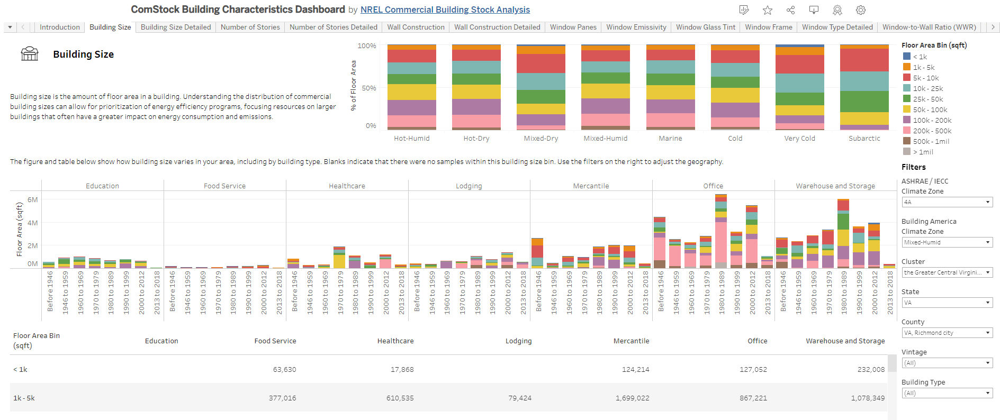

# How-to: Filter the Building Characteristics Dashboard to View Data for a County

The following provides instructions for accessing modeled building characteristic distributions for Richmond, Virgina, via the public “ComStock Building Characteristics Dashboard.” For information about ComStock modeling methodology and assumptions, see the [ComStock reference documentation]({{site.baseurl}}#references).

## Instructions
1. Visit the [ComStock Building Characteristics Dashboard](https://public.tableau.com/app/profile/comstock.nrel/viz/ComStockBuildingCharacteristicsDashboard/Introduction) on the [ComStock Tableau public](https://public.tableau.com/app/profile/comstock.nrel/vizzes) page.
2. On the "Introduction" tab, use the "County" filter to select "VA, Richmond city." This will apply the filter to the whole dashboard.
3. Use the tabs at the top of the dashboard to view modeled distributions of various building characteristics for Richmond, including building size, geometry, envelope construction, HVAC system, heating and water heating fuels, and interior lighting type.

## Dashboard Details
The dashboard has the following characteristics available:

- Building size
- Number of stories
- Wall construction
- Window panes
- Window emissivity
- Window glass tint
- Window frame
- Window-to-wall ratio
- Heating Fuel
- HVAC category
- Heat pumps
- Heating type
- Cooling type
- Ventilation type
- Heating intensity
- Cooling intensity
- Water heating fuel
- Interior lighting type

Each characteristic has two dashboard views: one "detailed" and one non-detailed. The non-detailed view (example in Figure 1) shows the distribution of the characteristic across Building America climate zones[^1] in the upper right to demonstrate the characteristic’s variability across the U.S. building stock. The lower figure and table provide the characteristic distribution for Richmond City by building type group. Use the filters on the right to adjust the geography or other key characteristics, like vintage or building type.

The detailed tab (example in Figure 2) provides a more detailed view of the distribution by building type and vintage. Note that the building type used in the detailed tab is more specific than in the non-detailed. Filters on the right allow you to adjust the geography.

In both views, results are presented on a building floor area basis because it provides a more representative weighting of commercial building stock energy use, ensuring that results reflect the relative impact of larger buildings rather than being skewed by the sheer number of smaller buildings. Blank entries indicate that there were no samples in the ComStock dataset for specific characteristic and building type combinations.

{:refdef: style="text-align: center;"}

{:refdef}

{:refdef: style="text-align: center;"}
Figure 1. Example non-detailed dashboard view for Building Size
{:refdef}

{:refdef: style="text-align: center;"}

{:refdef}

{:refdef: style="text-align: center;"}
Figure 2. Example detailed dashboard view for Building Size
{:refdef}

[^1]: See this technical report for more detail about Building America climate zones: <https://www.osti.gov/servlets/purl/1893981/>