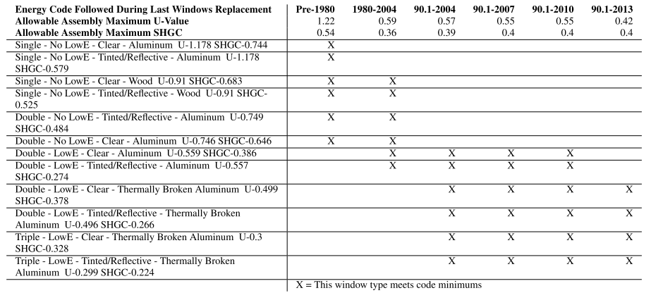
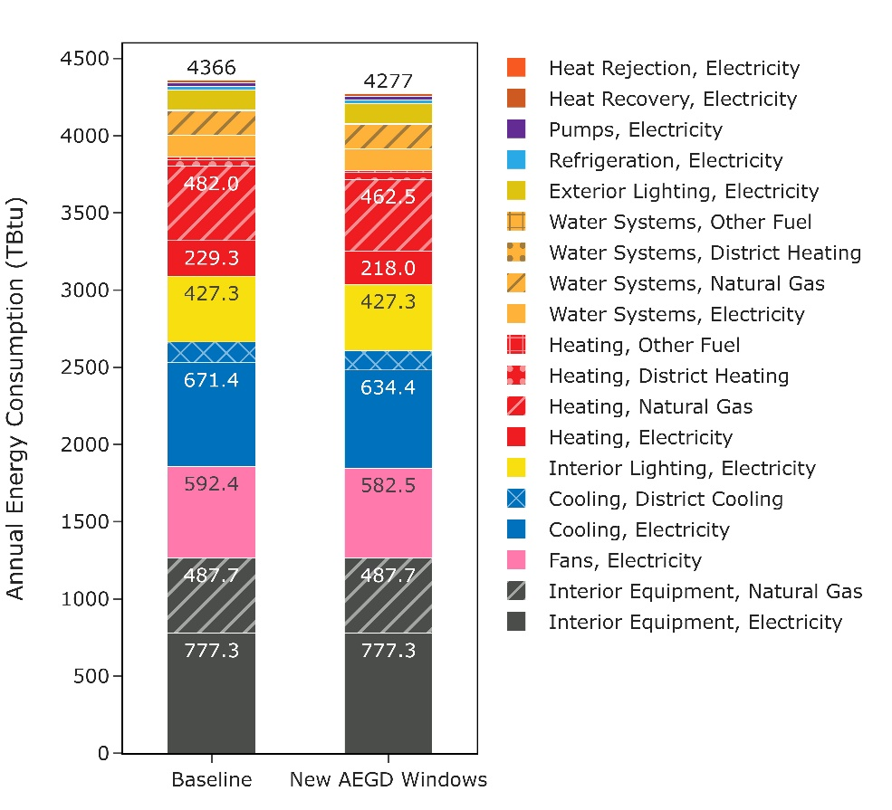
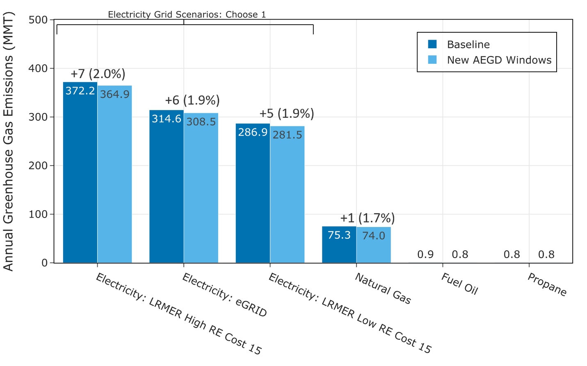
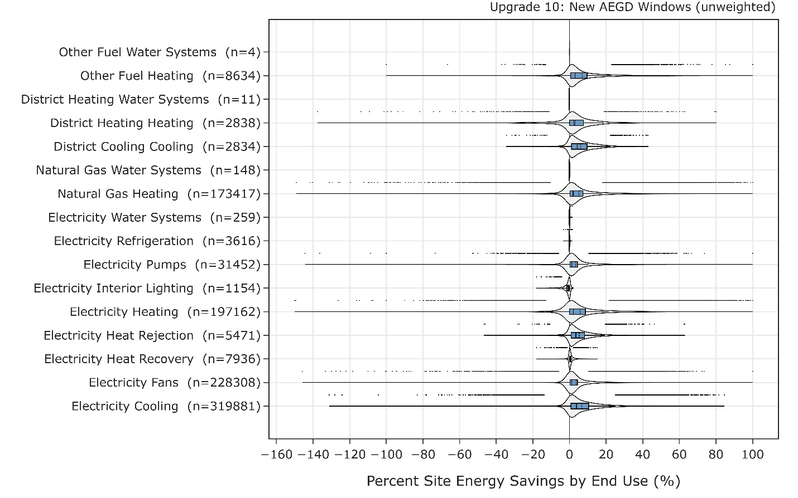
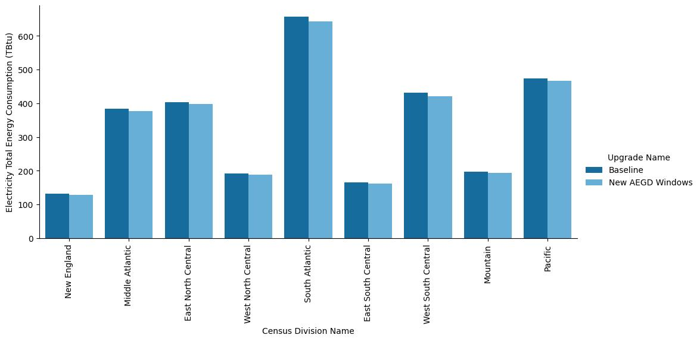
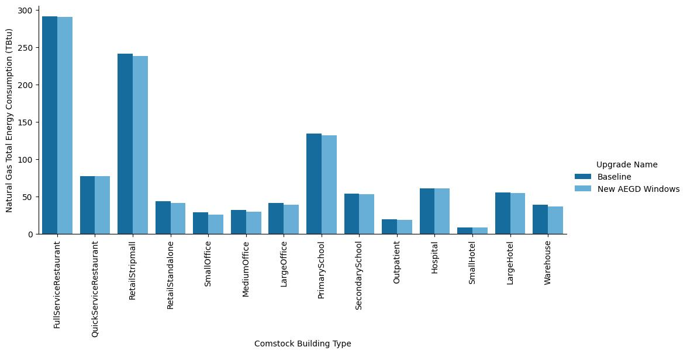
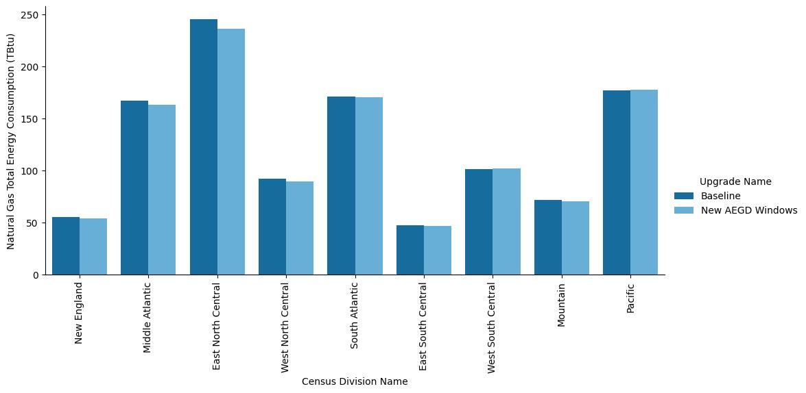

#  Executive Summary

Building on the successfully completed effort to calibrate and validate the U.S. Department of Energy's ResStock™ and ComStock™ models over the past three years, the objective of this work is to produce national data sets that empower analysts working for federal, state, utility, city, and manufacturer stakeholders to answer a broad range of analysis questions.

The goal of this work is to develop energy efficiency, electrification, and demand flexibility end-use load shapes (electricity, gas, propane, or fuel oil) that cover a majority of the high-impact, market-ready (or nearly market-ready) measures. "Measures" refers to energy efficiency variables that can be applied to buildings during modeling.

An *end-use savings shape* is the difference in energy consumption between a baseline building and a building with an energy efficiency, electrification, or demand flexibility measure applied. It results in a timeseries profile that is broken down by end use and fuel (electricity or on-site gas, propane, or fuel oil use) at each timestep.

ComStock is a highly granular, bottom-up model that uses multiple data sources, statistical sampling methods, and advanced building energy simulations to estimate the annual subhourly energy consumption of the commercial building stock across the United States. The baseline model intends to represent the U.S. commercial building stock as it existed in 2018. The methodology and results of the baseline model are discussed in the final technical report of the [End-Use Load Profiles](https://www.nrel.gov/buildings/end-use-load-profiles.html) project.

This documentation focuses on a single end-use savings shape measure---window replacement. This measure replaces windows in the baseline building stock with windows that have properties aligning with ASHRAE's *Advanced Energy Design Guide* (AEDG). The measure is applicable to all windows in the ComStock baseline that are not triple pane, as these are already very high-performing widows. Altogether, the measure is applicable to over \>99% of the ComStock floor area, representing over 350 million m^2^ of window area replaced. Results show \~2% aggregate stock site energy savings (89 TBtu), primarily from heating, cooling, and fan end uses. Results also show greenhouse gas emission savings between 6 MMT and 8 MMT, depending on the electricity grid emission scenario considered.

# 1.  Introduction

This documentation covers window replacement upgrade methodology and briefly discusses key results. Results can be accessed on the ComStock™ data lake at "[end-use-load-profiles-for-us-building-stock](https://data.openei.org/s3_viewer?bucket=oedi-data-lake&prefix=nrel-pds-building-stock%2Fend-use-load-profiles-for-us-building-stock%2F)" or via the Data Viewer at [comstock.nrel.gov](https://comstock.nrel.gov/).

| **Measure Title** | Window Replacement |
| **Measure Definition** | This measure replaces existing windows with new windows that align with the properties proposed in the Advanced Energy Design Guide (AEDG) for each climate zone. |
| **Applicability** | The measure is applicable to all windows with assembly U-values greater than those proposed in the AEDG, and all windows with solar heat gain coefficients (SHGCs) greater than those proposed in the AEDG. This includes most commercial buildings.  |
| **Not Applicable** | The measure is not applicable to windows that already exceed the properties proposed in the AEDG, for each climate zone.  |
| **Release** | 2023 Release 1 |

# 2.  Technology Summary

Many commercial buildings use older window systems \[1\]. These are often single pane, clear glass, and in a minimally insulated aluminum frame. These characteristics create a system with a low insulation value (R-value), which can increase heating and cooling loads, and high solar gains, which can increase cooling loads. Beyond energy considerations, thermal and visual comfort can also be reduced for building occupants.

Newer window systems improve on old designs with features such as the addition of thermal breaking in the frame to increase insulation values, double or triple pane glass to increase insulation values, and coatings to reduce glare and heat gain in the space \[2\]. This measure models the replacement of older, lower-performing windows in the stock with higher-performing windows. The ideal choice of window will vary based on climate zone and perhaps other building characteristics, such as orientation. Generally, colder climates require higher insulation values to reduce space conditioning loads, whereas warmer climates require lower solar heat gain coefficients (SHGCs) to reduce cooling loads and often to improve visual comfort.

# 3.  ComStock Baseline Approach

The ComStock baseline uses a mix of wood-framed and aluminum-framed windows with or without a thermal break. They range from single pane to triple pane, and can be clear/tinted or low-emissivity (low-e). The properties were informed by a variety of data sources, described in the ComStock documentation and shown in Table 1 \[1\].

Table 1. ComStock Baseline Window Properties

| **Number of Panes** | **Glazing Type** | **Frame Material** | **Low-E Coating** | **Assembly U-Factor IP (Btu/h-ft2-F)** | **SHGC** | **VLT*** |
|---|---|---|---|---|---|---|
| Single | Clear | Aluminum | No | 1.178 | 0.744 | 0.754 |
| Single | Tinted/Reflective | Aluminum | No | 1.178 | 0.579 | 0.455 |
| Single | Clear | Wood | No | 0.910 | 0.683 | 0.723 |
| Single | Tinted/Reflective | Wood | No | 0.910 | 0.525 | 0.436 |
| Double | Clear | Aluminum | No | 0.746 | 0.646 | 0.671 |
| Double | Tinted/Reflective | Aluminum | No | 0.749 | 0.484 | 0.411 |
| Double | Clear | Aluminum | Yes | 0.559 | 0.386 | 0.591 |
| Double | Clear | Aluminum With Thermal Break | Yes | 0.499 | 0.378 | 0.591 |
| Double | Tinted/Reflective | Aluminum | Yes | 0.557 | 0.274 | 0.359 |
| Double | Tinted/Reflective | Aluminum | Yes | 0.496 | 0.266 | 0.359 |
| Triple | Clear | Aluminum | Yes | 0.300 | 0.328 | 0.527 |
| Triple | Tinted/Reflective | Aluminum | Yes | 0.299 | 0.224 | 0.320 |

\*VLT stands for visible light transmission

Each ComStock model is assigned a window type from Table 1 through a sampling process. Each window type has a probability for which it will be assigned to a model. These probabilities are primarily informed by the National Fenestration Rating Council (NFRC) Commercial Fenestration Market Study, which was conducted by Guidehouse in collaboration with NFRC, with input from various other sources \[1\]. Triple pane windows will not be considered for replacement in this measure because they are already high-performing. An example of the available window options for a model in climate zone 4 for various energy codes is shown in Table 2.

Table 2. Example of Available Window Assignment Options for Climate Zone 4 Based on the Energy Code Followed During the Last Window Replacement

Table from \[1\]

{:refdef: style="text-align: center;"}

{:refdef}

 
 

{:refdef: style="text-align: center;"}

{:refdef}

{:refdef: style="text-align: center;"}
Figure 1*.* Percentage of stock floor area assigned to each window type in the ComStock baseline
{:refdef}

# 4.  Modeling Approach

This measure replaces the windows of a model with new windows with thermal and tinting properties that align with the properties specified in the AEDG. The measure will first identify the existing window properties for each ComStock baseline model. In cases where the U-value (thermal transmittance) and SHGC underperform those specified in the AEDG, the windows will be replaced with AEDG-compliant windows.

## 4.1  Applicability

This measure is applicable to models of all building types with existing windows. Triple pane windows are excluded from this analysis because they are already high-performing. However, triple pane windows are a very low percentage of windows in the commercial building stock. This measure effectively replaces windows in over 99% of ComStock baseline models.

## 4.2  Applied Window Performance

Performance characteristics of windows vary based on the frame construction, the number of glass panes, the gas fill between the panes, and the prevalence of glass coatings. Commercial window frames are most commonly aluminum due to the material strength, low maintenance, low cost, and flexibility. However, aluminum windows are more conductive than alternative materials such as wood and fiberglass, resulting in a high assembly U-value.

A thermal break is often used to insulate the frame and reduce the U-value. The glazing in commercial windows can be single, double, or triple pane, with each generally increasing the U-value of the window \[2\]. Single pane is very prevalent in the actual stock as well as the ComStock baseline, but this type of glazing has a higher U-value and is not usually permissible in modern energy codes. Double pane glazing is usually a good option for most climate zones, as it provides a good balance of U-value (\~0.35 assembly) and cost \[2\]. Triple pane has the lowest U-value; however, the added cost makes it very expensive. Therefore, it is generally only considered in cold climates or in cases where thermal performance is a priority. The glazing fill can also contribute to the realized assembly U-value, with options generally being air, argon, or vacuum. Vacuum is used to achieve very low U-values \[2\]. For SHGC, many glazing products offer various tints to reasonably achieve the desired SHGC of any energy code. Lower SHGC and visual light transmittance (VLT) products will protect against heat gain to the space and glare to some degree. If the SHGC is too low, however, it can block beneficial heat gain in the winter months, which could reduce heating energy. SHGC is therefore recommended by climate zone to balance cooling and heating benefits.

All upgrade scenarios will be assigned an aluminum frame. They will then be assigned properties that align with those shown in the ASHRAE *AEDG for Small/Medium Offices* \[2\]. These properties are summarized in Table 3, along with some informal window characteristics that may achieve these properties.

Table 3*.* Target Properties for Window Replacements from AEDG for medium/large offices \[2\]

{:refdef: style="text-align: center;"}

{:refdef}

## 4.3  Greenhouse Gas Emissions

Three electricity grid scenarios are presented to compare the emissions of the ComStock baseline and the window replacement scenario. The choice of grid scenario will impact the grid emissions factors used in the simulation, which determine the corresponding emissions produced per kWh. Two scenarios---Long-Run Marginal Emissions Rate (LRMER) High Renewable Energy (RE) Cost 15-Year and LRMER Low RE Cost 15-Year---use the Cambium data set, and the last uses the eGrid data set \[3\], \[4\]. All three scenarios vary the emissions factors geospatially to reflect the variation in grid resources used to produce electricity across the United States. The Cambium data sets also vary emissions factors seasonally and by time of day. This study does not imply a preference for any particular grid emission scenario, but other analysis suggests that the choice of grid emission scenario can impact results \[5\]. Emissions due to on-site combustion of fossil fuels use the emissions factors shown in Table 4, which are from Table 7.1.2(1) of draft American National Standards Institute (ANSI)/Residential Energy Services Network (RESNET)/International Code Council (ICC) 301 \[6\]. To compare total emissions due to both on-site fossil fuel consumption and grid electricity generation, the emissions from a single electricity grid scenario should be combined with all three on-site fossil fuel emissions.

Table 4. On-Site Fossil Fuel Emissions Factors

|---|---|
| **Natural gas** | 147.3 lb/MMbtu (228.0 kg/MWh) |
| **Propane** | 177.8 lb/MMbtu (182.3 kg/MWh) |
| **Fuel oil** | 195.9 lb/MMbtu (303.2 kg/MWh) |

## 4.4  Limitations and Concerns

Window assembly U-value is often a function of the ratio of frame area to glass area. ComStock currently uses the simple glazing object, which accepts a constant U-value input regardless of window size and therefore does not capture U-value differences with window size. Furthermore, ComStock does not differentiate between punched windows, curtainwall, storefront, etc., which can have different performance characteristics. Neither of these limitations are expected to impact stock-level analysis in a substantial way.

# 5.  Output Variables

Table 5 includes a list of window-related output variables that are calculated in ComStock. These variables are important in terms of understanding the differences between buildings with and without the window measure applied. These output variables can also be used to understand the economics of the upgrade (e.g., return on investment) if cost information (i.e., material, labor, and maintenance costs for technology implementation) is available.

Table 5*.* Window-Related Property Output Variables From ComStock Simulations

| **Variable Name** | **Description** |
|---|---|
| Window to Wall Ratio | Ratio of window area to exterior wall area for the building model. |
| Window Type | Name of window type, as described in Table 1. |
| Average Window SHGC | Average solar heat gain coefficient of all the windows in the building model. |
| Average Window U-Value (Btu/h-ft2-F) | Average thermal conductance of all the windows in the building model. |

# 6.  Results

## 6.1  Stock Energy Impacts

Replacing existing windows with those that align with AEDG properties demonstrates 2% (89 TBtu) annual stock energy savings for commercial buildings. This includes 5% electricity heating savings (11 TBtu), 4% natural gas heating savings (20 TBtu), 6% electricity cooling savings (44 TBtu), and 2% fan energy savings. Heating, cooling, and fan energy savings can be partially attributed to the decreased thermal conductance (U-value) of the replacement AEDG windows, which generally reduces heating and cooling loads. This reduces the energy requirement of the heating and cooling system, but can also decrease the number of times heating, ventilating, and air conditioning (HVAC) fans need to cycle on (for systems that include cycling operation), which explains the energy savings in that category. Similarly, a lower SHGC reduces solar gains to the building, which can reduce also reduce cooling load, but it some cases may increase heating load due to reduced heat gain when the building is actively heating. Heating penalties are mitigated by using higher SHGCs in colder climates. This is reflected in the AEDG target window properties shown in Table 3. Minimal differences in energy consumption between the baseline and upgrade scenario are observed for non-HVAC end uses, which is expected.

{:refdef: style="text-align: center;"}

{:refdef}

{:refdef: style="text-align: center;"}
Figure 2*.* Comparison of annual site energy consumption between the ComStock baseline and the window replacement scenario. Energy consumption is categorized by both fuel type and end use.
{:refdef}

Table 6 provides a stock assessment of the ComStock results to ensure the measure was applied properly to all models. The intended target U-values (informed by the AEDG; see Table 3) and the actual applied U-values are presented by climate zone, where the applied values always align with the intended targets. The average baseline U-values and the average change in U-value due to the window replacement are also presented, along with the average percent energy savings. Percent energy savings are generally highest in the coldest climate zones, followed by the warmest climate zones, and lastly the more temperate climate zones. This aligns with expectations, as envelope heating and cooling loads are also highest in the more extreme climates.

Table 6. Stock Assessment of the Intended Target Window U-Values vs. the Actual Applied Table Also Shows Average Baseline U-Value, Average U-Value Change, and the Average Percent Total Site Energy Savings by Climate Zone.

| **Climate Zone** | **Applied U-Value ** | **Intended Target U-Value ** | **Average Baseline U-Value ** | **Average U-Value Change** | **Average Building % Energy Savings** |
|---|---|---|---|---|---|
| 1A | 0.48 | 0.48 | 0.89 | −0.41 | 4% |
| 2A | 0.43 | 0.43 | 0.86 | −0.43 | 3% |
| 2B | 0.43 | 0.43 | 0.87 | −0.44 | 3% |
| 3A | 0.40 | 0.40 | 0.80 | −0.40 | 2% |
| 3B | 0.40 | 0.40 | 0.82 | −0.42 | 2% |
| 3C | 0.40 | 0.40 | 0.82 | −0.42 | 1% |
| 4A | 0.34 | 0.34 | 0.81 | −0.47 | 2% |
| 4B | 0.34 | 0.34 | 0.78 | −0.44 | 2% |
| 4C | 0.34 | 0.34 | 0.81 | −0.47 | 2% |
| 5A | 0.34 | 0.34 | 0.81 | −0.47 | 3% |
| 5B | 0.34 | 0.34 | 0.80 | −0.46 | 2% |
| 6A | 0.32 | 0.32 | 0.81 | −0.49 | 3% |
| 6B | 0.32 | 0.32 | 0.81 | −0.49 | 3% |
| 7 | 0.28 | 0.28 | 0.78 | −0.50 | 5% |
| 7A | 0.28 | 0.28 | 0.81 | −0.53 | 4% |
| 7B | 0.28 | 0.28 | 0.79 | −0.51 | 3% |
| 8 | 0.25 | 0.25 | 0.78 | −0.53 | 6% |

## 6.2  Stock Greenhouse Gas Emissions Impact

Annual greenhouse gas emissions savings are realized at the stock level for all three electricity grid scenarios and all on-site fossil fuel combustion types (Figure 3). When combined with the fossil fuel emissions, all three grid scenarios show stock emissions savings of approximately 1.9%. Grid scenarios show similar total percent emissions savings due to electricity consumption (1.9% to 2.0%), but the scenarios with higher emissions in the ComStock baseline show higher total emissions savings because there are more emissions associated with each electricity kWh (5 MMT to 7 MMT).

{:refdef: style="text-align: center;"}

{:refdef}

{:refdef: style="text-align: center;"}
Figure 3*.* Comparison of greenhouse gas emissions for the ComStock baseline and the window replacement scenario. Three electricity grid scenarios are presented: Cambium LRMER High RE Cost 15-Year, Cambium LRMER Low RE Cost 15-Year, and eGrid.
{:refdef}

## 6.3  Energy Savings Distributions

Figure 4 shows the distribution of annual energy percent savings for the ComStock baseline compared to the window replacement scenario. The majority of the distributions show site energy savings between roughly 2% and 8% for the 25^th^ and 75^th^ percentiles (as indicated by the boxplots), respectively. The distributions extend fairly wide, but much of this range is covered by outliers outside of the standard 1.5 times the interquartile range calculation. Outliers are indicated by dots above the distribution, and they represent a relatively small portion of models. Some models in the distributions show negative energy savings for a given fuel type. This is expected to some degree with this type of window strategy, as reducing the SHGC can increase heating load.

{:refdef: style="text-align: center;"}

{:refdef}

{:refdef: style="text-align: center;"}
Figure 4. Percent savings distribution of ComStock models by fuel type. The data points that appear above some of the distributions indicate the location of data points considered to be outliers in the distribution, meaning they fall outside 1.5 times the interquartile range. The value for n indicates the number of ComStock models that were applicable for energy savings for the fuel type category.
{:refdef}

Figure 5 shows the percent savings distribution for each end use and fuel type combination between the baseline ComStock model and the corresponding upgrade model. Models are included in these distributions only if they experienced savings (or a penalty) for the specific distribution. The model count for the distributions is indicated in each distribution title. Many end uses demonstrated a wide range of savings.

The heating end use (for the various fuel types) generally shows energy savings above the 25^th^ percentile of the distribution. Heating savings are expected when decreasing the window U-value due to the increased insulative properties. However, some models experienced heating penalties. This is often due to the increased SHGC of the replacement windows, which is intended to decrease cooling energy consumption. However, this can also block some beneficial solar heat gain, which can cause an increased heating load. Whether or not annual heating savings are realized depends on a combination of factors, including the window to wall area, window orientation, thermostat set points, HVAC system, outdoor air temperatures, and amount of solar radiation affecting the window surface. Heating-only HVAC system types can be especially prone to energy penalties from lower SHGC because there is no cooling system to save energy from the decreased solar gains, although this does not reflect other potential such as thermal comfort or glare control. Also, in some cases, HVAC systems that use multiple fuel types may experience heating savings for one of the fuel types and a heating penalty for the other due to nuanced load changes that shift load within the system.

{:refdef: style="text-align: center;"}

{:refdef}

{:refdef: style="text-align: center;"}
Figure 5*.* Percent savings distribution of ComStock models by end use and fuel type. The data points that appear above some of the distributions indicate the location of data points considered to be outliers in the distribution, meaning they fall outside 1.5 times the interquartile range. The value for n indicates the number of ComStock models that were applicable for energy savings for the fuel type category.
{:refdef}

## References 

\[1\] Parker, A. et al. 2022. *ComStock Documentation*. Golden, CO: National Renewable Energy Laboratory. <https://www.nrel.gov/docs/fy23osti/83819.pdf>

\[2\] ASHRAE. 2014. *Advanced Energy Design Guide for Small to Medium Office Buildings 50%*.

\[3\] NREL. "Cambium." Accessed September 2, 2022. https://www.nrel.gov/analysis/cambium.html.

\[4\] U.S. EPA. "Emissions & Generation Resource Integrated Database (eGRID)." Accessed September 2, 2022. https://www.epa.gov/egrid.

\[5\] Present, Elaina, Pieter Gagnon, Eric J.H. Wilson, Noel Merket, Philip R. White, and Scott Horowitz. 2022. "Choosing the Best Carbon Factor for the Job: Exploring Available Carbon Emissions Factors and the Impact of Factor Selection.". <https://aceee2022.conferencespot.org/event-data/pdf/catalyst_activity_32485/catalyst_activity_paper_20220810190542996_ca9a88a9_04f7_48dc_88c1_2ba530e44474>

\[6\] Vijayakumar, G. et al. 2022. "ANSI/RESNET/ICC 301-2022 - Standard for the Calculation and Labeling of the Energy Performance of Dwelling and Sleeping Units using an Energy Rating Index." Oceanside, CA.

##  Appendix A

{:refdef: style="text-align: center;"}

{:refdef}

{:refdef: style="text-align: center;"}
Figure A-1. Site annual electricity consumption of the ComStock baseline and the window replacement scenario by building type
{:refdef}

{:refdef: style="text-align: center;"}

{:refdef}

{:refdef: style="text-align: center;"}
Figure A-2. Site annual electricity consumption of the ComStock baseline and the window replacement scenario by census division
{:refdef}

{:refdef: style="text-align: center;"}

{:refdef}

{:refdef: style="text-align: center;"}
Figure A-3. Site annual natural gas consumption of the ComStock baseline and the window replacement scenario by building type
{:refdef}

{:refdef: style="text-align: center;"}

{:refdef}

{:refdef: style="text-align: center;"}
Figure A-4. Site annual natural gas consumption of the ComStock baseline and the window replacement scenario by census division
{:refdef}
