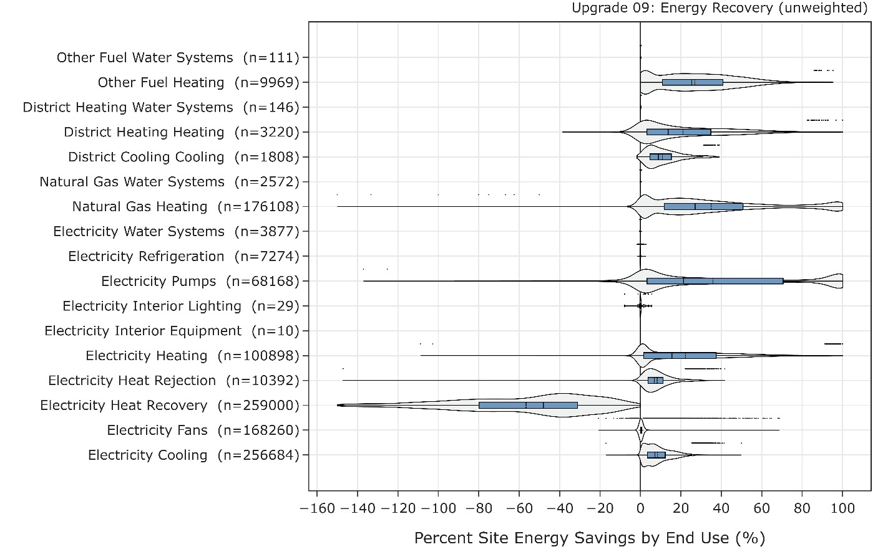

# Add Exhaust Air Heat/Energy Recovery
{: .fw-500 }
Author: Chris CaraDonna

# Executive Summary 

Building on the successfully completed effort to calibrate and validate the U.S. Department of Energy's ResStock™ and ComStock™ models over the past 3 years, the objective of this work is to produce national data sets that empower analysts working for federal, state, utility, city, and manufacturer stakeholders to answer a broad range of analysis questions.

The goal of this work is to develop energy efficiency, electrification, and demand flexibility end-use load shapes (electricity, gas, propane, or fuel oil) that cover a majority of the high-impact, market-ready (or nearly market-ready) measures. "Measures" refers to energy efficiency variables that can be applied to buildings during modeling.

An *end-use savings shape* is the difference in energy consumption between a baseline building and a building with an energy efficiency, electrification, or demand flexibility measure applied. It results in a time-series profile that is broken down by end use and fuel (electricity or on-site gas, propane, or fuel oil use) at each time step.

ComStock is a highly granular, bottom-up model that uses multiple data sources, statistical sampling methods, and advanced building energy simulations to estimate the annual subhourly energy consumption of the commercial building stock across the United States. The baseline model intends to represent the U.S. commercial building stock as it existed in 2018. The methodology and results of the baseline model are discussed in the final technical report of the [End-Use Load Profiles](https://www.nrel.gov/buildings/end-use-load-profiles.html) project.

This documentation focuses on a single end-use savings shape measure---adding exhaust air heat/energy recovery. This measure adds exhaust air energy recovery or heat recovery to existing air handling units (AHUs) with outdoor air. Systems that already have energy/heat recovery are not modified. Food service building types are also not modified by this measure due to the added complication of integrating cooking hood exhaust, which could cause heat exchanger fouling. In total, this measure is applicable to airloops serving \~70% of the floor area in ComStock. In practice, energy/heat recovery systems can be retrofitted to existing air delivery systems by including them as separate systems that provide outdoor air to the AHUs or by directly integrating them into an AHU; the modeling approach used in this study is agnostic of the energy recovery implementation method and simply accounts for recovery effectiveness, added static pressure, and other controls, which are described further in this document. Energy recovery with sensible and latent exchange gets added in humid climate zones, whereas heat recovery with sensible-only exchange gets added in drier climate zones. Energy recovery is modeled as a fixed membrane plate counterflow heat exchanger, and heat recovery is modeled as a sensible-only fixed aluminum plate counterflow heat exchanger. Both systems include a bypass (for temperature control and economizer lockout) and an electric resistance preheat coil for frost prevention.

The heat/energy recovery measure demonstrates 7% total site energy savings (304 trillion British thermal units \[TBtu\]) for the U.S. commercial building stock modeled in ComStock. The savings are primarily attributed to:

-   **23%** stock **heating** savings (268 TBtu)

-   **10%** stock **cooling** savings (82 TBtu)

-   **−8%** stock combined **fan** and **heat recovery** savings (−46 TBtu)

    -   Note that the heat recovery end use includes the additional fan energy associated with the static pressure increase of the new energy recovery systems, plus the fan energy and motor power associated with the energy recovery systems and enthalpy wheels in the existing building stock.

        Comprehensive greenhouse gas emissions avoided (one electricity grid scenario plus all on-site combustion fuels) range between 5% (21.4 million metric tons \[MMT\] CO2 equivalent \[CO2e\]; eGRID 2021) and 7% (17.7 MMT CO2e; Cambium Low Renewable Energy Cost 15 year), depending on the grid scenario chosen. The emissions avoided are due to reduced electricity consumption from the cooling and heating end uses, but also include the increase in electricity from the heat recovery (added fan power) end use.

Future work can include adding heat/energy recovery solutions specifically for kitchen spaces, which were not included in this work.

# Acknowledgments 

The authors would like to acknowledge the valuable guidance and input provided by the ComStock team, Matthew Dahlhausen, and Shanti Pless (National Renewable Energy Laboratory). 

# 1. Introduction 

This documentation covers the "Add Exhaust Air Energy/Heat Recovery" upgrade methodology and briefly discusses key results. Results can be accessed on the ComStock™ data lake at "[end-use-load-profiles-for-us-building-stock](https://data.openei.org/s3_viewer?bucket=oedi-data-lake&prefix=nrel-pds-building-stock%2Fend-use-load-profiles-for-us-building-stock%2F)" or via the Data Viewer at [comstock.nrel.gov](https://comstock.nrel.gov/).

| **Measure Title**      | Add Exhaust Air Energy/Heat Recovery                                                                                                                                                                                                                                                                          |
| **Measure Definition** | Adds airside energy recovery (humid climates) or heat recovery (other climates) to air handling units that do not already include either of these features. Fan power is increased to overcome the additional static pressure from the recovery systems. Assumes 90% of return air is available for recovery. |
| **Applicability**      | Applicable to air handling units with outdoor air that do not already have an energy/heat recovery system, including single-zone packaged rooftop units, dedicated outdoor air systems, and multi-zone variable air volume systems. This represents 70%   of ComStock floor area.                             |
| **Not Applicable**     | Not applicable to systems that are not airloops with outdoor air, or systems that already have energy/heat recovery. Additionally, this measure is not applicable to food service building types.                                                                                                             |
| **Release**            | 2023 Release 2: 2023/comstock_amy2018_release_2/                                                                                                                                                                                                                                                              |

# 2. Technology Summary 

Air-to-air energy/heat recovery systems exchange heat and/or moisture between conditioned exhaust air and incoming outdoor ventilation air for air handling units (AHUs) with outdoor air \[1\]. They are intended to precondition outdoor ventilation air using exhaust air before heating/cooling coils are used, which can reduce ventilation loads by up to 80% \[1\]. Energy recovery systems provide sensible and latent energy exchange, generally through motor-controlled enthalpy wheels or counterflow fixed plate membrane heat exchangers. Heat recovery systems, on the other hand, provide sensible heat exchange through aluminum fixed plate heat exchangers or heat pipes \[2\].

Energy/heat recovery is required by some energy code standards for certain applications, but many existing AHUs are not currently using these systems, either because they are not required by code (code exemptions for system size, climate zone, etc.) or because they were installed following older energy codes. Heat/energy recovery code requirements are predominately based on design outdoor air ventilation rates and climate zone combinations that are more favorable to energy savings from exhaust air energy recovery \[3\].

Existing AHUs can often be retrofitted to include energy/heat recovery systems \[4\]. Retrofit options include directly adding heat/energy recovery to the existing AHU or integrating a unitary heat/energy recovery system into the supply and exhaust of an AHU to provide the energy exchange. The preferred option for a specific project typically comes down to cost, space constraints, and maintenance. The difference in energy impact between retrofit options is expected to be minimal, as performance is primarily driven by heat exchanger effectiveness (perhaps with small fan static pressure differences based on how heat/energy recovery systems are integrated into existing AHUs). In some cases, it may be more financially favorable to replace older rooftop units (RTUs) with new high-efficiency units that include energy/heat recovery, although this is not included in this measure study \[4\].

Energy/heat recovery is often rated by the effectiveness of the heat exchange between the supply and exhaust airstreams. The effectiveness determines the fraction of latent, sensible, or total energy exchanged between the airstreams. The American Society of Heating, Refrigerating and Air-Conditioning Engineers (ASHRAE) Standard 90.1-2019 requires an enthalpy recovery ratio of at least 50% for applicable climates \[3\], whereas the Advanced Energy Design Guide (AEDG) recommends a total effectiveness of 72%--75% for humid climate zones or a sensible effectiveness of 72%--75% for dry climate zones \[2\]. The Northwest Energy Efficiency Alliance (NEEA) defines the heat recovery portion of a very high efficiency dedicated outdoor air system (VHE DOAS) as having a sensible effectiveness over 82% \[5\]. An example product sheet for the Ventacity VS1000 RT energy/heat recovery system is shown in Figure 2. This figure/product sheet illustrates the range of effectiveness values between heating and cooling as well as the sensible and latent energy for different airflow ranges \[6\].

Heat/energy recovery systems add static pressure to the air delivery system to overcome the additional pressure drop of the heat exchanger. Furthermore, energy recovery systems that use motor-operated enthalpy wheels require electricity to spin the wheel. A study of energy recovery systems in Minnesota showed they use between 0.11 and 0.36 W/cfm (cubic feet per minute) to push air through the system and operate any wheel motors \[1\]. Plate heat exchangers generally have lower pressure drops compared to enthalpy wheel systems and have no moving parts that require power \[1\]. ASHRAE-90.1 2019 allows fan power pressure drop adjustments to the allowable fan power calculation to account for the added pressure drop shown in Equation 1. The AEDG recommends that the additional pressure drop not exceed 0.85 in. w.c. (inches of water column) and 0.65 in. w.c. for the supply fan and exhaust fan, respectively \[2\]. A Pacific Northwest National Laboratory (PNNL) report specifies an additional 0.65 in. w.c. on both the supply and exhaust fans plus an additional 0.2 in. w.c. on the exhaust (which ultimately aligns with the AEDG values) \[7\]. NEEA's VHE DOAS system specifies 1.3 cfm/watt at 0.5 in. w.c. \[8\]. The ASHRAE Handbook for Heating, Ventilating, and Air Conditioning (HVAC) Systems and Equipment shows typical membrane heat exchangers yielding pressure drops between 0.1 in. w.c. and 1.1 in. w.c., increasing linearly with airflow rate \[9\]. Lastly, the Ventacity DOAS-H/ERV (heat or energy recovery ventilator) systems show between 0 in. w.c. and 2 in. w.c. of added static pressure, depending on the operating conditions, which falls within range of the PNNL and AEDG values \[6\]. Plate heat exchangers often include a bypass to circumvent the static pressure drop when the HRV is not needed. However, some ERV enthalpy wheel systems do not include bypass systems and retain the static pressure drop during operation, whereas ERVs that use a membrane plate heat exchanger, such as the Ventacity system, do include a bypass \[10\]\[6\].

{:refdef: style="text-align: center;"}
{:width="700"}
{:refdef}

{:refdef: style="text-align: center;"}
{:width="700"}
{:refdef}

{:refdef: style="text-align: center;"}
Figure 1. Variation in pressure drop and effectiveness with airflow rates for membrane plate heat exchanger. Image from \[11\].
{:refdef}

The value of heat/energy recovery systems can be limited by configurations that discharge part of the exhaust air separately from the recovery system \[5\]. Heat/energy recovery systems are unable to recapture any heating or cooling benefit from exhaust air that uses dedicated exhaust fans. This can occur with bathroom or kitchen exhaust fans, for example. However, it is beneficial to route as much exhaust air through the heat/energy recovery system as reasonable to maximize the energy recovery potential. One study of over 400 ERVs across 134 buildings in Minnesota found that it is common for only a fraction of the ventilation air to pass through heat/energy recovery systems, although the study does not specify how much \[1\]. For a U.S. Department of Energy (DOE) prototype model study, PNNL specified using 90% of outdoor airflow for heat/energy recovery systems to account for leakage and zone exhaust \[7\].

Some building types, such as food service buildings, may be less suitable for adding energy/heat recovery retrofits because most of the building exhaust tends to occur through bathroom and kitchen exhaust hoods. A PNNL technical document for reducing energy usage in quick-service restaurants recommends using runaround energy recovery coil to utilize the large amount of heat available in kitchen exhaust air \[12\]. However, the study does not discuss the practicality of such a measure given the quality of kitchen exhaust. The ASHRAE HVAC Handbook describes kitchen cooking hoods as being a source of odors, causing potential plugging and corrosion of heat exchangers \[13\]. The prevalence of fouling of heat exchanger surfaces from smoke and grease in kitchens requires regular maintenance \[13\]. The ASHRAE HVAC Handbook therefore advises energy/heat recovery only in light-duty cooking applications with minimal grease production \[13\]. However, an assessment from Frontier Energy and Fischer-Nickel suggests that energy recovery can be applied to kitchens, although this setup may require additional measure for maintaining grease filters and addressing heat exchanger fouling \[14\].

Another study done by NREL noted that it is unclear whether there is sufficient exhaust air for a heat/energy recovery strategy in grocery stores, considering the large amounts of cooking/bathroom exhaust and the high infiltration from entrance doors being open much of the day \[15\]. Some of this could be extrapolated to retail building types that also have large entrance doors open for much of the day.

{:refdef: style="text-align: center;"}
{:width="700"}
{:refdef}

{:refdef: style="text-align: center;"}
Figure 2. Product data from Ventacity heat/energy recovery system. Image from \[6\].
{:refdef}

The AEDG suggests that energy/heat recovery systems should not limit airside economizing. The systems should be able to turn off, either through a bypass or by stopping the enthalpy wheel, to allow economizer operation. Furthermore, the energy/heat recovery system should have the means to reduce recovery to prevent overheating \[2\]. Options for temperature control include modulating ERV wheel speed or using a bypass \[1\], \[8\]. These controls allow the system to ramp up to a desired supply air temperature \[2\].

Heat/energy recovery systems require a means for defrosting under certain climate conditions to avoid ice buildup \[8\]. Ice formation occurs on the exhaust side of the heat exchanger during cold winter months, when the exhaust air temperature is below the dewpoint temperature of the ambient air. The most common type of defrost for energy/heat recovery systems uses an electric heating element to preheat the outdoor air entering the heat exchanger \[16\]. This ensures the exhaust air is warm enough that it does not form ice. Another method is to use a supply air bypass to allow warmer exhaust air temperatures for defrost. This method does not directly consume additional energy like with the heating coil option, but it does temporarily reduce the effectiveness of the heat exchanger during periods of defrost.

# 3. ComStock Baseline Approach 

The ComStock baseline includes energy recovery in air handling units only when required by the governing energy code standard. The fraction of floor area conditioned by energy/heat recovery in ComStock is summarized in Table 2 by building type and energy code year. Note that older code years do not include heat/energy recovery, as they were not required by these energy codes. Also note that California models generally do not include heat/energy recovery because these models follow California Title 24 energy codes, which do not have heat/energy recovery requirements. The operation and performance of heat/energy recovery systems in the ComStock baseline are not discussed in this work because existing heat/energy recovery systems are not affected by this measure. More information about the ComStock baseline heat/energy recovery systems can be found in the ComStock documentation \[17\].

The prevalence of heat/energy recovery in the ComStock baseline directly impacts the results of this analysis, as the measure will only be applied to AHUs that do not already include heat/energy recovery. Note that ComStock adds heat/energy recovery to models on an AHU-by-AHU basis, meaning a ComStock baseline model may have some AHUs with heat/energy recovery and some without, based on the code requirements. This measure is also applied on an AHU basis, so it may be partially applicable to some ComStock models. The ComStock code-driven approach for applying heat/energy recovery is reasonable but difficult to validate. The most prominent commercial building stock assessment, the Commercial Buildings Energy Consumption Survey (CBECS), does not include prevalence of heat/energy recovery systems \[18\]. Because heat/energy recovery code requirements often depend on system size, ComStock\'s estimates may either overstate or underestimate the prevalence of existing systems with heat/energy recovery due to zoning assumptions. This, in turn, affects the number of systems that this measure upgrades and subsequently impacts the overall energy-saving potential of the technology in building stock.

The benefits of heat/energy recovery systems depend on routing exhaust air through the heat exchanger. As discussed, some portion of the exhaust air in buildings may not be routed back to the central exhaust or heat exchanger, either due to duct leakage or separate exhaust fans. ComStock includes exhaust fans in some space types, summarized in Table 1. Note that some prominent building types, such as small/medium/large office, warehouse, and retail, do not currently include any zone exhaust, so all exhaust air is assumed to return to the AHUs and become available for heat/energy recovery benefits, when applicable. Furthermore, ComStock models do not currently include duct leakage. These factors may overestimate the amount of exhaust air available for heat/energy recovery in ComStock models.

Table 1. Building and Space Types in ComStock Modeled With Zone Exhaust Fans

| Building Type            | Space Type                        |
|--------------------------|-----------------------------------|
| Full-Service Restaurant  | Kitchen                           |
| Hospital                 | Kitchen                           |
| Large Hotel              | Kitchen                           |
| Outpatient               | Anesthesia                        |
| Outpatient               | MRI                               |
| Outpatient               | MRI Control                       |
| Outpatient               | Soil Work                         |
| Outpatient               | Toilet                            |
| Primary School           | Restroom                          |
| Primary School           | Kitchen                           |
| Primary School           | Kitchen                           |
| Quick-Service Restaurant | Kitchen                           |
| Secondary School         | Restroom                          |
| Secondary School         | Kitchen                           |
| Small Hotel              | Public Restroom                   |
| Retail                   | None                              |
| Retail Strip Mall        | None (except those with kitchens) |
| Small Office             | None                              |
| Medium Office            | None                              |
| Large Office             | None                              |
| Warehouse                | None                              |

Table 2. Fraction of ComStock Floor Area Conditioned by Systems With Heat/Energy Recovery by Building Type and Code Year. DEER stands for the Database of Energy Efficiency Resources, which is used to implement Title 24 energy codes in ComStock California models.

{:refdef: style="text-align: center;"}
{:width="700"}
{:refdef}

# 4. Modeling Approach 

## 4.1. Applicability 

The measure is applicable to all air handling units in the ComStock baseline that do not already include heat/energy recovery, excluding food service applications. Although there is evidence to suggest that exhaust air recovery can be applied to kitchen exhaust hoods, there are additional considerations that need to be factored in to meaningfully model the application, and these are beyond the scope of this study. As discussed, heat/energy recovery in the ComStock baseline are added if required by the governing energy code (Table 2). Note that some models may include a mix of applicable and nonapplicable AHUs. The measure is applied on a per-AHU basis, and therefore may be partially applicable to some ComStock models based on the prevalence of heat/energy recovery in the existing AHUs. AHUs for this study include variable air volume (VAV) systems, packaged RTUs, and dedicated outdoor air systems (DOASs). The prevalence of these systems is shown in Figure 3 for ComStock floor area with (left) and without (right) heat/energy recovery. The applicable ComStock floor area served by AHU-based systems that do not already have heat/energy recovery is about 70% (Figure 4).

{:refdef: style="text-align: center;"}
{:width="700"}
{:refdef}

{:refdef: style="text-align: center;"}
Figure 3. Weighted area of ComStock baseline by HVAC system type grouping for systems with existing ERV/HRV (not applicable to measure) and without heat/energy recovery (applicable to measure).
{:refdef}

{:refdef: style="text-align: center;"}
{:width="700"}
{:refdef}

{:refdef: style="text-align: center;"}
Figure 4. Summary of heat/energy recovery measure applicability for each building type. Existing HR/ER: Floor area with current heat/energy recovery systems. NA HR/ER: Floor area without energy/heat recovery, not upgradeable with this measure. Added HR/ER: Floor area served by systems upgraded with heat/energy recovery as part of this measure.
{:refdef}

## 4.2. Technology Specifics 

### 4.2.1. Exhaust Air Recovery Type 

The measure applies heat recovery to applicable AHUs in drier climate zones (ASHRAE climate zones 3B, 3C, 4B, 4C, 5B, 5C, and 6B) where addressing latent energy loads is of lesser concern. The heat recovery is modeled as aluminum counterflow plate heat exchangers and includes a bypass for temperature control and economizer lockout where applicable. Note that this measure does not modify the prevalence or operation of economizers in the existing AHUs; these properties are retained from the baseline ComStock model.

The measure applies energy recovery to applicable AHUs in humid climate zones where addressing latent loads with energy recovery would be beneficial. The energy recovery systems are modeled as membrane counterflow heat exchangers and include a bypass for temperature control and economizer lockout where applicable.

### 4.2.2. Heat/Energy Recovery Effectiveness 

Both the energy recovery and heat recovery systems are modeled using the effectiveness performance of the Ventacity systems shown in Figure 2 \[6\]. EnergyPlus allows latent and sensible effectiveness to be set to 100% and 75% airflow, respectively, for both heating and cooling, which can be determined from Ventacity performance curves. Because the heat recovery system is only suitable for sensible energy recovery, the latent effectiveness is modeled as 0% for all cases. The modeled inputs for effectiveness are shown in Table 3. Note that the Ventacity system is an ERV or HRV with heat or energy recovery included. For a retrofit application, the type of heat/energy recovery appropriate for the use case may warrant a different type of system, which could impact the effectiveness assumptions.

Table 3. Modeled Effectiveness Inputs for Energy and Heat Recovery Based on Ventacity Systems Shown in Figure 2

|| ER                    || HR      |
|-|-----------------------|-|---------|
|                       | Heating | Cooling | Heating | Cooling |
| Sensible 100% Airflow | 75%     | 75%     | 84%     | 83%     |
| Sensible 75% Airflow  | 78%     | 78%     | 86%     | 84%     |
| Latent 100% Airflow   | 61%     | 55%     | 0%      | 0%      |
| Latent 75% Airflow    | 68%     | 60%     | 0%      | 0%      |

### 4.2.3. Added Fan Power 

Adding heat exchangers to the airstream for heat/energy recovery creates additional pressure drops that the supply and exhaust fans need to overcome. The pressure drops are modeled as an additional 0.85 in. w.c. and 0.65 in. w.c. for the supply fan and exhaust fan, respectively. These values align with both the AEDG and PNNL values \[2\], \[7\].

The static pressure values for the fan objects in EnergyPlus are not informed by the bypass status of the heat exchanger objects. This ignores the reduced static pressure that occurs when bypassing the heat exchanger. To account for this, the additional fan power is added directly to the heat exchanger objects in the form of motor energy for the enthalpy wheel. This is preferred because the power for the wheel object does modulate based on heat exchanger bypass status, so the additional static pressure due to the heat exchanger will be removed when the system is bypassing the heat exchanger. Note that additional fan power will therefore be reflected in the "Energy Recovery" end use rather than the "Fans" end use as a result of this workaround.

### 4.2.4. Defrost Operation 

Defrost is modeled by controlling the exhaust temperature of air leaving the E/HR systems. This ensures the exhaust air from the outlet of the heat exchanger is above the temperature that permits frost formation. For this modeling, the default EnergyPlus value of 35°F was chosen as the minimum exhaust temperature. When the temperature is at or below this point, the system redirects some of the incoming air around the recovery system (bypass). This reduces heat transfer between air streams which maintains the exhaust air temperature above the minimum setpoint.

## 4.3. Greenhouse Gas Emissions 

Three electricity grid scenarios are presented to compare the emissions of the ComStock baseline and the heat/energy recovery upgrade scenario. The choice of grid scenario will impact the grid emissions factors used in the simulation, which determine the corresponding emissions produced per kilowatt-hour. Two scenarios---Long-Run Marginal Emissions Rate (LRMER) High Renewable Energy (RE) Cost 15-Year and LRMER Low RE Cost 15-Year---use the Cambium data set, and the last uses the Emissions & Generation Resource Integrated Database (eGRID) data set \[19\], \[20\]. All three scenarios vary the emissions factors geospatially to reflect the variation in grid resources used to produce electricity across the United States. The Cambium data sets also vary emissions factors seasonally and by time of day. This study does not imply a preference for any particular grid emissions scenario, but other analysis suggests that the choice of grid emissions scenario can impact results \[21\]. Emissions due to on-site combustion of fossil fuels use the emissions factors shown in Table 4, which are from Table 7.1.2(1) of draft American National Standards Institute/Residential Energy Services Network/International Code Council 301 \[22\]. To compare total emissions due to both on-site fossil fuel consumption and grid electricity generation, the emissions from a single electricity grid scenario should be combined with all three on-site fossil fuel emissions.

 Table 4. On-Site Fossil Fuel Emissions Factors 

| **Natural gas** | 147.3 lb/MMBtu (228.0 kg/MWh)a  |
| **Propane**     | 177.8 lb/MMBtu (182.3 kg/MWh)   |
| **Fuel oil**    | 195.9 lb/MMBtu (303.2 kg/MWh)   |

a lb = pound; MMBtu = million British thermal units; kg = kilogram; MWh = megawatt-hour

## 4.4. Limitations and Concerns 

The most prominent limitation of this study is a lack of data on the prevalence of once-through air delivery systems that do not exhaust air at the AHU, but rather through a dedicated exhaust fan. This complicates adding a heat/energy recovery system because the exhaust air and outdoor ventilation air need to pass through the same heat exchanger to achieve energy recovery benefits. If air is exhausted across multiple separate locations, additional work may be required to route the airstreams to the same location. Otherwise, the portion of exhaust air not passing through the heat/energy recovery system will not be utilized for energy recovery, which can limit the effectiveness of the system.

ComStock does account for zone exhaust fans in some building types, but not in offices, retail buildings, or warehouses, which are prominent building types. Furthermore, ComStock does not currently account for duct leakage. A PNNL study using the DOE prototype models assumes that 90% of exhaust air is available for energy recovery to account for both zone exhaust and duct losses \[7\]. To account for this, the energy/heat recovery measure assumes that 90% of return air is available for recovery. However, it is unclear how realistic this assumption is, and how it might vary between buildings, which can impact the savings of this measure. Overestimating the return air fraction would increase the savings suggested by this measure.

Lastly, the prevalence of heat/energy recovery in ComStock baseline AHUs is based on code requirements for the HVAC code year of each model. However, no data sources were found to validate the fraction of floor area of the building stock against what ComStock assumes using the code-baseline methodology. Heat/energy recovery prevalence impacts the measure savings, as heat/energy recovery prevalence in existing AHUs is inversely proportional to the number of applicable AHUs for the measure and therefore the stock-level savings achieved from the measure. Moreover, heat and energy recovery code requirements frequently depend on the size of the system. ComStock relies on assumptions about zoning to determine system size, but inaccuracies in these assumptions can result in inaccuracies in estimating the potential applicability of adding heat/energy recovery to systems that do not already include it.

# 5. Output Variables 

Table 5 includes a list of output variables that are calculated in ComStock. These variables are important in terms of understanding the differences between buildings with and without the energy/heat recovery measure applied. These output variables can also be used for understanding the economics of the upgrade (e.g., return on investment) if cost information (i.e., material, labor, and maintenance costs for technology implementation) is available.

Table 5. Output Variables Calculated From the Measure Application

| Variable Name                         | Description                                                             |
|---------------------------------------|-------------------------------------------------------------------------|
| stat.area_fraction_with_heat_recovery | Fraction of model floor area served by an AHU with heat/energy recovery |
| stat.num_air_loops_heat_recovery      | Number of airloops with heat/energy recovery in model (unweighted)      |
| stat.num_air_loops                    | Number of airloops in model (unweighted)                                |

# 6. Results 

In this section, results are presented both at the stock level and for individual buildings through savings distributions. Stock-level results include the combined impact of all the analyzed buildings in ComStock, including buildings that are not applicable to this measure.

Total site energy savings are also presented in this section. Total site energy savings can be a useful metric, especially for quality assurance/quality control, but this metric on its own can have limitations for drawing conclusions. Further context should be considered, as site energy savings alone do not necessarily translate proportionally to savings for a particular fuel type (e.g., gas or electricity), source energy savings, cost savings, or greenhouse gas savings. This is especially important when a measure impacts multiple fuel types or causes decreased consumption of one fuel type and increased consumption of another. Many factors should be considered when analyzing the impact of an energy efficiency or electrification strategy, depending on the use case.

## 6.1. Single Building Example 

In this section, we describe the operation behavior of a small office building in Golden, Colorado. The model uses packaged RTUs with direct expansion (DX) cooling and gas furnace heating. Outdoor ventilation air is provided directly through the RTUs. The baseline model starts with no energy recovery. When the upgrade is applied, an ERV is added to all RTUs.

Figure 5 shows the operation of the heat/energy recovery on a sample winter day. The area of interest falls within the hours where the RTU has outdoor airflow (light green line). During this period, the RTU is targeting a mixed air temperature of between 70°F and 75°F, while the outdoor air temperature is between 35°F and 40°F (blue line). The ERV recovers energy from the exhaust airstream, which raises the outdoor air temperature to around 60°F. This value still falls below the mixed air temperature set point, which means the remaining gap must be addressed by the heating coil, noting that return air may also cover some of this gap. The heat/energy recovery increases the outdoor air temperature to reduce load on the main heating coil. Similarly, Figure 5 demonstrates this behavior during a sample summer day, where the heat/energy recovery reduces the outdoor air temperature, therefore reducing load on the cooling coil.

Figure 7 demonstrates the frost prevention functionality of heat/energy recovery in the sample model. When the heat/energy recovery outlet air temperature (blue line) reaches the specified minimum exhaust temperature for frost prevention of 35°F, the sensible and latent effectiveness (pink and yellow lines, respectively) of the ERV are reduced. This occurs due to the heat/energy recovery initializing a bypass of the inlet air to keep the exhaust air temperature above 35°F, which prevents frost buildup.

Table 6 compares the energy consumption of the baseline sample model to the upgrade model with the heat/energy recovery measure applied. Adding energy recovery to the RTUs shows 14% whole building energy savings. The heating and cooling end uses show 45% and 14% annual site energy savings, respectively, due to the preconditioning of outdoor ventilation air that the energy recovery offers. The upgrade model shows additional E/HR energy that represents the additional fan power needed to overcome the static pressure added by the energy recovery heat exchanger.

{:refdef: style="text-align: center;"}
{:width="700"}
{:refdef}

{:refdef: style="text-align: center;"}
Figure 5. Example heat/energy recovery operation for winter day.
{:refdef}

{:refdef: style="text-align: center;"}
{:width="700"}
{:refdef}

{:refdef: style="text-align: center;"}
Figure 6. Example heat/energy recovery operation for summer day.
{:refdef}

{:refdef: style="text-align: center;"}
{:width="700"}
{:refdef}

{:refdef: style="text-align: center;"}
Figure 7. Heat/energy recovery sample defrost operation.
{:refdef}

Table 6. Annual Energy Consumption Comparison of Baseline and Upgrade for Sample Model

|| Baseline (GJ) | Upgrade (GJ) | % Savings |
|-|---------------|--------------|-----------|
| Total         | 1818         | 1557      | 14% |
| Heating       | 629          | 345       | 45% |
| Cooling       | 175          | 162       | 7%  |
| Fans          | 280          | 280       | 0%  |
| Heat Recovery | 0            | 35        | -   |
| Other         | 734          | 734       | 0%  |

## 6.2. Stock Energy Impacts 

The heat/energy recovery measure demonstrates 7% total site energy savings (304 trillion British thermal units \[TBtu\]) for the U.S. commercial building stock modeled in ComStock (Figure 7). The savings are primarily attributed to:

-   **23%** stock **heating** savings (268 TBtu)

-   **10%** stock **cooling** savings (82 TBtu)

-   **−8%** stock combined **fan** and **heat recovery** savings (**−**46 TBtu)

    -   Note that the heat recovery end use includes the additional fan energy associated with the static pressure increase of the new energy recovery systems, plus the fan energy and motor power associated with the energy recovery systems and enthalpy wheels in the existing building stock.

{:refdef: style="text-align: center;"}
{:width="700"}
{:refdef}

{:refdef: style="text-align: center;"}
Figure 8. Comparison of annual site energy consumption between the ComStock baseline and the heat/energy recovery measure scenario. Energy consumption is categorized by both fuel type and end use.
{:refdef}

The heating and cooling savings are from the energy recovery system preconditioning the outdoor ventilation air. This reduces or removes the load on the HVAC heating and cooling coils, saving energy. The heating end use shows savings for both gas and electricity, although there are considerably more natural gas heating savings, as the building stock uses more natural gas for heating.

The fan end use shows negligible savings (\<1%), likely from a combination of reduced cycling times for systems and reduced fan flow fraction in VAV systems. However, the increase in the energy recovery end use reflects added fan power due to the energy recovery system. So, this measure demonstrates a net addition of fan energy compared to the existing baseline building stock.

## 6.3. Stock Greenhouse Gas Emissions Impact 

The ComStock simulation results show greenhouse gas emissions avoided across all electricity grid scenarios and on-site combustion fuel types (Figure 8). For the combined impact across all fuel sources, a single electricity grid scenario should be chosen and combined with all three on-site combustion fuel scenarios. Comprehensive greenhouse gas emissions avoided (one electricity grid scenario plus all on-site combustion fuels) range between 5% (21.4 MMT CO2e; eGRID 2021) and 7% (17.7 MMT CO2e; Cambium Low RE Cost 15 year), depending on the grid scenario chosen. The emissions avoided are due to reduced electricity consumption from the cooling and heating end uses, but also include the increase in electricity from the heat recovery (added fan power) end use.

{:refdef: style="text-align: center;"}
{:width="700"}
{:refdef}

{:refdef: style="text-align: center;"}
Figure 9. Greenhouse gas emissions comparison of the ComStock baseline and the heat/energy recovery scenario. Three electricity grid scenarios are presented: Cambium Long-Run Marginal Emissions Rate (LRMER) High Renewable Energy (RE) Cost 15-Year, Cambium LRMER Low RE Cost 15-Year, and eGRID. MMT stands for million metric tons.
{:refdef}

## 6.4. Site Energy Savings Distributions 

Figure 10 compares the distribution of energy savings by fuel type for baseline models representing the building stock of today to the same models with the heat/energy recovery measure applied. Nonapplicable buildings are not represented in this plot. Site energy, representing all end uses, shows the median applicable building saving approximately 7% annual energy consumption, with a small number of outliers exceeding 40%. A small fraction of buildings show negative energy savings; these are primarily buildings in temperate climate zones where the added fan energy outweighs the minimal potential for energy recovery savings for the building. Natural gas also shows some penalties. These buildings primarily use mixed fuel HVAC systems where the energy recovery shifts some energy between electricity and natural gas. However, most of these cases have very low natural gas usage in the baseline. Thus, a small increase in energy consumption yields a large percent increase, but often still shows a net heating savings across all fuel sources.

{:refdef: style="text-align: center;"}
{:width="700"}
{:refdef}

{:refdef: style="text-align: center;"}
Figure 10. Percent site energy savings distribution for ComStock models with the applied energy/heat recovery measure by fuel type. Savings for each data point are relative to the corresponding ComStock baseline model.
{:refdef}

The dots appearing above some distributions indicate the location of data points considered to be outliers in the distribution, meaning they fall outside 1.5 times the interquartile range. The value for n indicates the number of ComStock models that were applicable for energy savings for the fuel type category.

Figure 10 shows the distribution of energy savings by end use and fuel type, comparing baseline models representing the building stock of today to the same models with the energy recovery measure applied. The median building exhibits heating savings of approximately 15%--25%, depending on the heating fuel type, due to the preconditioning of ventilation loads by the recovery systems. The median building shows cooling of around 10%, similarly caused by reduced outdoor air ventilation loads.

The negative percent savings distribution in the heat recovery end use is primarily due to buildings that initially had some heat recovery in their baseline configuration and subsequently had additional heat recovery incorporated through the upgrade model. This augmentation contributes to higher totals for the heat recovery end use. Nevertheless, it is important to note that the heat recovery end use typically constitutes a small portion of a building\'s overall energy consumption. Therefore, in the majority of cases, the increase in this end use is justified by the resulting heating and cooling savings.

{:refdef: style="text-align: center;"}
{:width="700"}
{:refdef}

{:refdef: style="text-align: center;"}
Figure 11. Percent site energy savings distribution for ComStock models with the applied energy/heat recovery measure by end use and fuel type. Savings for each data point are relative to the corresponding ComStock baseline model.
{:refdef}

The dots appearing above some distributions indicate the location of data points considered to be outliers in the distribution, meaning they fall outside 1.5 times the interquartile range. The value for n indicates the number of ComStock models that were applicable for energy savings for the fuel type category.

## 6.5. Other Observations 

Figure 12 compares the noncoindcident peak electricity demand intensity for the median building between the ComStock baseline and the heat/energy recovery scenario. Results are presented by Building America climate zone. The highest peak reductions occur during the summer. This is because summer peak demand is influenced primarily by the cooling end use, which largely uses electricity, except for the small set of buildings using district cooling. Larger reductions are observed in warmer climates. Comparatively, the winter peak demand yields smaller reductions, and sometimes causes peak demand increases. There are a few considerations here. First, the added fan power for the heat/energy recovery will increase electricity consumption and therefore electricity peak demand. In cases where the building uses electric heating, the ventilation load reduction can reduce electric heating consumption during the seasonal peak, often resulting in a net peak increase. However, if the building uses nonelectric heating, the energy savings will be for the heating fuel type rather than electricity, which can result in a net increase in electricity due to the added fan energy. This is not as much of a concern for the summer peak because, as mentioned, most buildings use electricity for cooling, which outweighs the electricity fan penalty.

{:refdef: style="text-align: center;"}
{:width="700"}
{:refdef}

{:refdef: style="text-align: center;"}
Figure 12. Normalized median peak electric demand comparison between ComStock baseline models and the models with the heat/energy recovery measure applied.
{:refdef}

Figure 13 and Figure 14 show the median heating energy savings intensity by state from applying the heat/energy recovery measure. As expected, the heating plot shows higher savings in the colder states of the Midwest and Northeast, where there are higher heating loads. The warmer states show lower savings because they generally have lower heating loads.

{:refdef: style="text-align: center;"}
{:width="700"}
{:refdef}

{:refdef: style="text-align: center;"}
Figure 13. Annual median heating energy savings intensity (kWh/sf/yr). Plot only shows buildings that are applicable to the measure.
{:refdef}

{:refdef: style="text-align: center;"}
{:width="700"}
{:refdef}

{:refdef: style="text-align: center;"}
Figure 14. Annual median cooling energy savings intensity (kWh/sf/yr). Plot only shows buildings that are applicable to the measure.
{:refdef}

# References  

\[1\] Quinnell, J. et al. 2013. *Energy Recovery in Minnesota Commercial and Institutional Buildings: Expectations and Performance Conservation Applied Research & Development (CARD) FINAL REPORT Prepared for: Minnesota Department of Commerce Division of Energy Resources Prepared by: Cent*.

\[2\] I. E. Society and U. S. G. B. Council. n.d. *Advanced Energy Design Guide for Small to Medium Office Buildings ACHIEVING Zero Energy*.

\[3\] ANSI/ASHRAE/IES. 2019. "ANSI/ASHRAE/IES Standard 90.1-2019: Energy Standard Residential Buildings Except Low-Rise for Buildings (I-P Edition)."

\[4\] N. Resources Canada. n.d. "Major Energy Retrofit Guidelines for Commercial and Institutional Buildings NON-FOOD RETAIL."

\[5\] R. C. Analytics. 2021. "Energy Efficiency Analysis of DX-DOAS in the Pacific Northwest."

\[6\] Ventacity. 2019. "VS1000 RT Installation and Operation Manual."

\[7\] Thorton, B., M. Rosenberg, and EE Richman. 2011. "Achieving the 30% Goal: Energy and Cost Savings Analysis of ASHRAE Standard 90.1-2010."

\[8\] 2022. "Very High Efficiency Dedicated Outside Air System: Equipment and Design Best Practices for Optimal Energy Efficiency."

\[9\] ASHRAE. 2020. *2020 Ashrae Handbook: HVAC Systems and Equipment*. Atlanta, GA.

\[10\] U.S. Department of Energy. 2013. "Advanced Energy Retrofit Guide - Healthcare Facilities."

\[11\] Goldwasser, D., B. Ball, A. Farthing, S. Frank, and P. Im. n.d. "Advances in Calibration of Building Energy Models to Time Series Data."

\[12\] Zhang, J. et al. 2010. "Technical Support Document: 50% Energy Savings for Quick-Service Restaurants."

\[13\] ASHRAE. 2015. *2015 Ashrae Handbook HVAC applications*.

\[14\] Swierczyna, R. 2018. "Applying State of the Art Commercial Kitchen Ventilation Technologies for Comfort and Performance."

\[15\] Clark, J. 2015. "Energy-Efficient Supermarket Heating, Ventilation, and Air Conditioning in Humid Climates in the United States."

\[16\] Rigotti, J. and N. Bulger. 2023. "Energy Modeling Guide for Very High Efficiency DOAS Final Report."

\[17\] Parker, A. et al. 2023. *ComStock Reference Documentation: Version 1*. Golden, CO: National Renewable Energy Laboratory. NREL/TP-5500-83819. https://www.nrel.gov/docs/fy23osti/83819.pdf.

\[18\] EIA. 2022. *2018 Commercial Buildings Energy Consumption Survey (CBECS) Data*. Washington, D.C.: U.S. Energy Information Administration (EIA). https://www.eia.gov/consumption/commercial/data/2018/index.php?view=consumption#e1-e11.

\[19\] NREL. n.d. "Cambium \| Energy Analysis \| NREL." \[Online\]. Available: https://www.nrel.gov/analysis/cambium.html. \[Accessed: 02-Sep-2022\].

\[20\] U.S. EPA. n.d. "Emissions & Generation Resource Integrated Database (eGRID) \| US EPA." \[Online\]. Available: https://www.epa.gov/egrid. \[Accessed: 02-Sep-2022\].

\[21\] Present, E., Pieter Gagnon, Eric J.H. Wilson, Noel Merket, Philip R. White, and Scott Horowitz. 2022. "Choosing the Best Carbon Factor for the Job: Exploring Available Carbon Emissions Factors and the Impact of Factor Selection."

\[22\] Vijayakumar, G. et al. 2022. "ANSI/RESNET/ICC 301-2022 - Standard for the Calculation and Labeling of the Energy Performance of Dwelling and Sleeping Units using an Energy Rating Index." Oceanside, CA.

# Appendix A  

{:refdef: style="text-align: center;"}
{:width="700"}
{:refdef}

{:refdef: style="text-align: center;"}
Figure A-1. Site annual natural gas consumption of the ComStock baseline and the measure scenario by census division.
{:refdef}

{:refdef: style="text-align: center;"}
{:width="700"}
{:refdef}

{:refdef: style="text-align: center;"}
Figure A-2. Site annual natural gas consumption of the ComStock baseline and the measure scenario by building type.
{:refdef}

{:refdef: style="text-align: center;"}
{:width="700"}
{:refdef}

{:refdef: style="text-align: center;"}
Figure A-3. Site annual electricity consumption of the ComStock baseline and the measure scenario by census division.
{:refdef}

{:refdef: style="text-align: center;"}
{:width="700"}
{:refdef}

{:refdef: style="text-align: center;"}
Figure A-4. Site annual electricity consumption of the ComStock baseline and the measure scenario by building type.
{:refdef}
