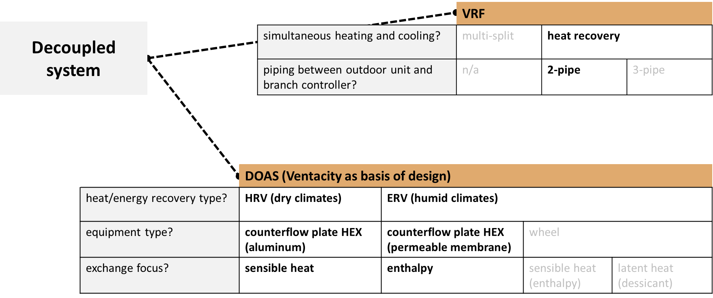

# Variable Refrigerant Flow with Heat Recovery and Dedicated Outdoor Air System
{: .fw-500 }
Authors: Janghyun Kim, Chris CaraDonna, Andrew Parker

# Executive Summary 

Building on the successfully completed effort to calibrate and validate the U.S. Department of Energy's ResStock™ and ComStock™ models over the past 3 years, the objective of this work is to produce national data sets that empower analysts working for federal, state, utility, city, and manufacturer stakeholders to answer a broad range of analysis questions.

The goal of this work is to develop energy efficiency, electrification, and demand flexibility end-use load shapes (electricity, gas, propane, or fuel oil) that cover a majority of the high-impact, market-ready (or nearly market-ready) measures. "Measures" refers to energy efficiency variables that can be applied to buildings during modeling.

An *end-use savings shape* is the difference in energy consumption between a baseline building and a building with an energy efficiency, electrification, or demand flexibility measure applied. It results in a time-series profile that is broken down by end use and fuel (electricity or on-site gas, propane, or fuel oil use) at each time step.

ComStock is a highly granular, bottom-up model that uses multiple data sources, statistical sampling methods, and advanced building energy simulations to estimate the annual subhourly energy consumption of the commercial building stock across the United States. The baseline model intends to represent the U.S. commercial building stock as it existed in 2018. The methodology and results of the baseline model are discussed in the final technical report of the [End-Use Load Profiles](https://www.nrel.gov/buildings/end-use-load-profiles.html) project.

This documentation focuses on a single heating, ventilation, and air-conditioning (HVAC) end-use savings shape measure---a variable refrigerant flow with heat recovery (VRF HR) heating and cooling system coupled with a dedicated outdoor air system (DOAS) for ventilation.

This measure replaces existing multizone variable air volume (VAV) systems or single-zone rooftop units (RTU) with a VRF HR system coupled with a DOAS that includes an energy/heat recovery ventilator (E/HRV). The measure covers 53% of the existing building stock's floor area and is not applicable to HVAC system types using district heating or cooling, or buildings/spaces that include high-ventilation spaces such as kitchens where the amount of exhaust air is large.

A DOAS with an E/HRV is used to provide required outdoor ventilation air to spaces since ventilation air is generally not supplied by a VRF HR system. An exhaust air energy recovery ventilator (ERV) with sensible and latent heat exchange is added to humid climate zones, while a heat recovery ventilator (HRV) with sensible-only exchange is added to drier climate zones. The ERV is modeled as a fixed membrane plate counterflow heat exchanger, and the HRV is modeled as a sensible-only fixed aluminum plate counterflow heat exchanger. Both systems include a bypass (for temperature control and economizer lockout) and minimum exhaust temperature control for frost prevention.

The VRF (HR) with DOAS measure demonstrates 16% total site energy savings (729 trillion British thermal units \[TBtu\]) for the U.S. commercial building stock modeled in ComStock (Figure 14). The savings are primarily attributed to:

-   **18%** stock **cooling electricity** savings (128 TBtu)

-   **53%** stock **heating natural gas** savings (438 TBtu)

-   **30%** stock **fan electricity** savings (178 TBtu)

-   **-24%** stock **heating electricity** savings (-48 TBtu).

The VRF (HR) with DOAS measure demonstrates between 8 and 23 million metric tons (MMT) of greenhouse gas emissions avoided for the three grid electricity scenarios presented, as well as 29 MMT of greenhouse gas emissions avoided for on-site natural gas consumption.

# Acknowledgments 

The authors would like to acknowledge the valuable guidance and input provided by Eric Bonnema, Jeff Munk, and Eric Ringold at National Renewable Energy Laboratory and Kaiyu Sun and Tianzhen Hong at Lawrence Berkeley National Laboratory.

# 1. Introduction 

This documentation covers the "VRF (HR) with DOAS" upgrade methodology and briefly discusses key results. Results can be accessed on the ComStock data lake at "[end-use-load-profiles-for-us-building-stock](https://data.openei.org/s3_viewer?bucket=oedi-data-lake&prefix=nrel-pds-building-stock%2Fend-use-load-profiles-for-us-building-stock%2F)" or via the Data Viewer at [comstock.nrel.gov.](https://comstock.nrel.gov/)

| **Measure Title**      | VRF(HR)+DOAS|
| **Measure Definition** | Replace VAV or RTU systems with VRF(HR) and E/HRV.        |
| **Applicability**      | Applicable to all spaces served by VAV and RTU systems that are not served by district heating or cooling. May apply to part of the building. Buildings that are too large (>200,000 ft2) or have large exhaust air are excluded as well. Total number of indoor units per an outdoor unit is also limited to 41. Applicable to 53% of total floor area of existing commercial building stock. |
| **Not Applicable**     | Not applicable to spaces (kitchen or dining) where a VRF (HR) with DOAS may be less appropriate.      |
| **Release**            | 2023 Release 2: 2023/comstock_amy2018_release_2/  |

## 2. Technology Summary 

## 2.1. VRF Technology Details 

The upgrade described in this document is about replacing the existing heating, ventilation, and air-conditioning (HVAC) system. The upgraded system decouples ventilation from space conditioning, with ventilation being handled by the dedicated outdoor air system (DOAS), and remaining space conditioning handled by an air-source variable refrigerant flow (VRF) system.

Figure 1 shows the highlights of the VRF system considered in this modeling work. VRF heat pump systems use direct expansion (DX) to transfer heat between indoor and outdoor air for use in both heating and cooling operation. Thermodynamically, VRFs have many of the same components as (common) heat pumps such as compressors, expansion devices, and heat exchangers. VRF systems transfer heat between one or, more commonly, several indoor units, often called "heads" or "terminal units," with a shared common outdoor unit. Some features that differentiate VRF systems from other types of heat pump systems are the scalability (several indoor units can be served by one outdoor unit), prevalence of variable speed compressors, distributed control of the refrigerant network, and in some cases the ability to utilize simultaneous heating and cooling between heads of the same system. According to the 2020 ASHRAE Handbook of HVAC Systems and Equipment \[1\], a VRF system requires the ability to vary the system capacity by three or more steps with one or multiple indoor units individually controlled through an interconnected piping and communication network.

{:refdef: style="text-align: center;"}
{:width="700"}
{:refdef}

{:refdef: style="text-align: center;"}
Figure 1. Highlights of VRF heat pump system with heat recovery \[2\]
{:refdef}

There are two distinctive types of VRFs: (1) a multisplit VRF without simultaneous heating and cooling, and (2) a VRF with heat recovery (HR) capable of simultaneous heating and cooling. As shown in Figure 1, the VRF HR system that allows a single outdoor unit connected to multiple indoor units can provide heating and cooling simultaneously between different zones depending on their needs. This simultaneous heating and cooling capability is made possible by (1) managing and controlling the refrigerant flow differently between different indoor units and against the outdoor unit, and (2) recovering heat from cooling zones and repurposing the energy for heating zones. This is advantageous in buildings with varying space conditions that have different heating and cooling requirements. For example, a conference room located in the core of a building may require year-round cooling while perimeter offices may require heating in the winter and cooling in the summer.

Within the category of a VRF HR, the system can be designed as either a two-pipe or three-pipe system, and manufacturers tend to select one option for their model lineup. The selection depends more on the layout of the floor plan and budget than on system heating and cooling demands. The main difference between the two systems is the number of pipes used for the connection between the outdoor unit and the branch controller (two pipes vs. three). Depending on whether the system is a two- or three-pipe system, the design of piping layout can vary significantly, resulting in difference in total piping length, which impacts the performance of the VRF system as shown in Figure 2. Additionally, while the three-pipe system requires a special Y branch copper pipe fitting (also known as refnet fitting), that is not required for the two-pipe system. The three-pipe system is known to provide better heating capacity at lower temperatures (compared to two-pipe system) through less refrigerant line losses when designed properly \[3\].

{:refdef: style="text-align: center;"}
{:width="700"}
{:refdef}

{:refdef: style="text-align: center;"}
Figure 2. Different piping layouts between two- and three-pipe systems on the same building design \[3\]
{:refdef}

VRF systems are highly versatile and scalable. Typical capacities range from 1.5 to 63 tons for outdoor units and 0.4 to 10 tons for indoor units \[1\]. And even multiple outdoor units can be connected together to serve larger demand. Some (not all manufacturers' outdoor units) VRF systems allow more than 60 indoor units to be connected to a single outdoor unit, which allows them to be applied to many building designs. Table 1 includes specifications of some VRF (with heat recovery) products in the market.

Table 1. Specifications of Available VRF (HR) Systems on the Market

{:refdef: style="text-align: center;"}
{:width="700"}
{:refdef}

VRF systems, like many heat pumps, have multiple options for sizing. They can be sized such that the available heat pump capacity at the design heating temperature matches the design heating load, accounting for the decreased heat pump capacity at lower temperatures. This avoids the need for any supplemental heating system and can maximize efficiency, but may require "upsizing" to a larger VRF system, which adds cost \[4\]. This approach has some limitations. Trane recommends limiting VRF oversizing to no more than 125% of the design cooling load so that the system does not end up being too oversized for the cooling load \[5\]. Daikin has similar recommendations for limiting oversizing with concerns that oversized equipment can lead to control issues. This suggests that it may not be possible to size for the full heating load at the heating design temperature in some climates. Furthermore, the compressor lockout temperature, which specifies the minimum operating temperature for the heat pump, needs to be considered. If the design heating conditions are below this temperature, then a supplemental heating source will be needed to meet the entire design heating load.

Another sizing option is to size the system to meet the design cooling load. If the associated heating capacity for that equipment cannot meet the full design heating load, supplemental heating is then used to address any unmet load from the VRF system. Supplemental heat can be sourced from various options, including an existing system, electric resistance baseboards, or electric resistance elements integrated within ducted systems \[4\]. This option may be attractive in very cold climates to avoid oversized equipment for the cooling load and to limit additional upfront costs from upsizing to larger VRF systems.

## 2.2. DOAS Technology Details 

VRF systems typically do not provide their own outdoor ventilation air. Therefore, outdoor air must be provided by a separate system, most often using a DOAS. A DOAS can provide preconditioned ventilation air directly to the spaces, which is known as a "decoupled" system, or can be integrated into the return air path of the VRF indoor terminal head directly, which is known as a "coupled" system. The decoupled system provides the added benefit of allowing the airflow in the VRF indoor terminal head to modulate fully off when there is no need for heating or cooling, which has been shown to be more efficient than coupled configurations \[6\]. However, because the outdoor ventilation is supplied directly to the space, it is recommended that the DOAS supply fully conditioned air to avoid zone discomfort and to allow the VRF system to address sensible zone loads only \[6\].

DOAS ventilation air can be conditioned in multiple ways. The first option considered should be exhaust air energy or heat recovery, which uses exhaust air to precondition incoming outdoor air using a heat exchanger. Compared to traditional heating and cooling methods, energy/heat recovery can reduce ventilation loads by up to 80% \[7\]. Energy recovery systems generally provide sensible and latent energy exchange through motor-controlled enthalpy wheels or through counterflow fixed-plate membrane heat exchangers. Alternatively, heat recovery systems provide sensible heat exchange through aluminum fixed-plate heat exchangers or heat pipes \[8\]. Energy recovery is often used in humid climate zones where transferring latent energy is beneficial, while heat recovery is usually considered in drier climate zones where transferring sensible energy is beneficial.

Energy/heat recovery is often rated by the effectiveness of the heat exchange between the supply and exhaust airstreams. The effectiveness determines the fraction of latent, sensible, or total energy exchanged between the air streams. ASHRAE Standard 90.1-2019 requires an enthalpy recovery ratio of at least 50% for applicable climates, while the ASHRAE Advanced Energy Design Guide recommends a total effectiveness of 72%--75% for humid climate zones or 72%--75% sensible effectiveness for dry climate zones \[8\]. The Northwest Energy Efficiency Association (NEEA) defines the heat recovery portion of a "very high efficiency" DOAS as having a sensible effectiveness over 82% \[6\]. An example product sheet for the Ventacity VS1000RT Energy/Heat recovery system is shown in Figure 3, which illustrates the range of effectiveness values between heating and cooling as well as sensible and latent energy for different airflow ranges \[9\]. The Ventacity system uses an aluminum plate heat exchanger for heat recovery or a membrane plate heat exchanger for energy recovery (the Ventacity system does not use a motor-powered enthalpy wheel).

{:refdef: style="text-align: center;"}
{:width="700"}
{:refdef}

{:refdef: style="text-align: center;"}
Figure 3. Product data from Ventacity Energy/Heat Recovery System
{:refdef}

Figure from \[9\]. Note that NREL does not endorse any commercial system or product; this is shown as an instructional example only.

A DOAS most often will require additional heating/cooling capacity beyond the capability of the energy/heat recovery system. Especially cold conditions may require a heating coil to ensure the discharge air temperature is hot enough, while especially warm or humid conditions may require a cooling coil to ensure the discharge air temperature is cold/dry enough. The ASHRAE DOAS Design Guide recommends a linear outdoor air float scheme controlled to discharge 52°F when outdoor temperatures are above 52°F, and 67°F when temperatures are below 45°F, floating linearly in between (illustrated in Figure 4) \[8\]. Note that energy/heat recovery systems can include bypass systems to ensure the air is not overheated prior to being supplied to the zone.

{:refdef: style="text-align: center;"}
{:width="500"}
{:refdef}

{:refdef: style="text-align: center;"}
Figure 4. DOAS temperature control scheme recommendation from ASHRAE DOAS Design Guide
{:refdef}

# 3. Additional Background Details for VRF 

## 3.1. VRF Research/Modeling Trends 

There have been several literature reviews on VRF systems between 2019 and the publication of this report \[10\]--\[12\]. These studies review past studies of VRF systems in terms of system design, experiment, control (including defrost), modeling, fault detection and diagnostics, and indoor air quality. Analyses on better integrated system architecture and alternate refrigerants are topics related to the system design, while experimental studies include both laboratory and field testing. Control of the VRF system is an important topic because the overall efficiency of a decoupled system, including VRF and DOAS, depends heavily on the control---especially in regards to efficiently recovering heat from cooling zones and repurposing to heating zones, as well as efficiently meeting the overall load between a VRF and DOAS.

There are many approaches to modeling a VRF system that fall in the spectrum between white-box and black-box modeling. The choice of method (e.g., grey-box regression model) depends on the use case (e.g., annual energy consumption of building with VRF system) where the model is being used (e.g., building energy simulation). Faults typically found in vapor compression systems also occur in VRFs because the basis of the system is the same. However, refrigerant charge faults are known to be more prevalent in VRF systems because of the more complicated and extensive refrigerant piping lines of a VRF system that might cover indoor thermal zones with many indoor units. Typical faults include refrigerant under/overcharge, the presence of noncondensables in the refrigerant system, heat exchanger fouling, and incorrect or biased sensor readings. Many of the previous studies covered by the literature reviews include impacts (e.g., 20% system efficiency reduction) of faults of a certain type (e.g., 20% refrigerant undercharge). We believe these are useful metrics in terms of understanding certain applications of the VRF system. However, these fault impacts cannot be scaled to all VRF systems as the design, commissioning, and control of the system will vary by application.

## 3.2. VRF Anecdotes 

There is an anecdotal perception that VRF systems may not perform to the level that manufacturers claim; a 2021 Slipstream report provides several reasons behind the perception \[13\]. During interviews, several manufacturers and contractors (in the Midwest) mentioned that the poor performance stems from the quality of install. One contractor specifically mentioned that the most common reason they found in the field was poor purging of refrigerant lines, plus other installation issues. To overcome this barrier, major manufacturers (Daikin, Mitsubishi, LG, and Fujitsu) interviewed in the report are providing additional training to contractors on this topic.

Another reason is related to the recent (5 years before the report \[13\] was published in 2021) advancement of cold climate VRF leveraging inverter-driven compressors with vapor injection. Before the advancement, the lowest ambient air temperature that VRF operates for heating was -13°F (-25°C), however, cold climate products in the market nowadays operate down to -22°F (-30°C) with the cold climate technology. Thus, some of the older field studies highlighting very low (e.g., COP between 1 to 2) heating COP under relatively mild ambient air temperature range (5°F--60°F) might not be representing 2023 technology. Additionally, manufacturer representatives stated that there were no (at the time in 2021) field studies that showed the performance of latest technologies at the time.

## 3.3. VRF Field Studies 

As mentioned previously, there are some known concerns over the realized performance of VRF systems. Notably, there are very few case studies on 2023 cold climate VRF technologies. However, it is still important to discuss our understanding of such concerns with field study results.

Some case studies have shown VRF systems to perform less efficiently than advertised. One such study from the Environmental Security Technology Certification Program on a Department of Defense facility in Michigan found the VRF system to save cost, peak demand, energy, and improve thermal comfort versus compared to the baseline electric VAV system \[14\]. However, they also reported periods where the system was unable to meet loads, despite being oversized, as well as decreased performance due to part-load cycling. The oversizing of the system was believed to have caused increased cycling, especially for cooling where the system operated at very low part loads (15%--25%) \[14\]. The system was also found to perform below manufacturer-advertised coefficients of performance (COPs). The authors did not state the suspected cause of the lower efficiencies but did mention component issues during the study period. Also note that the cold climate VRF used in this study was only rated to operate down to -4°F, which is not as cold as the current cold climate VRF technologies that can operate down to -22°F. Furthermore, the ASHRAE design temperature in this study is -5°F, below the minimum for the equipment used, while temperatures down to -23°F were reported during this study due to the 2019 Polar Vortex.

A report by the Minnesota Conservation Applied Research and Development (CARD) program examines VRF systems and their applicability for cold climates such as Minnesota \[7\]. The report analyzed five sites in Minnesota with VRF installations and concluded that VRF technology can be applicable to cold climates and that the systems can be cost-effective. The report does discuss some initial challenges including cost, refrigerant piping design, compliance with refrigerant standards, personnel training, and professional support. However, these installations took place pre-2010 using older VRF technology and therefore employed backup heating systems to address unmet loads at low temperatures. VRF technology has advanced considerably since then.

Another case study from the Northeast Energy Efficiency Partnerships found successful implementation of VRF cold climate heat pumps at a college in Vermont \[15\]. The average COPs were found to be 3.4 and 2.2 for 47°F and 17°F, respectively, which is close to rated performance for many VRF units. The college also reported lower operational costs and high levels of occupant satisfaction compared to the original HVAC system.

According to a report from Focus on Energy, VRF systems have historically faced challenges in meeting heating loads in cold climates \[16\]. However, the latest VRF technology introduced around 2017 has been designed to operate effectively even in extremely cold temperatures, with a rating down to -22°F. This advancement has made VRF systems a viable option for locations like Wisconsin. The report further states that all five sites that implemented VRF installations in Wisconsin expressed satisfaction with their systems and would consider them again. Although there were some initial issues that needed to be addressed, the overall feedback indicates a positive experience with VRF technology in cold climate applications.

An older Focus on Energy study from 2014 analyzed three sites with VRF systems installed (two offices, one warehouse) \[16\]. The study found simple paybacks of 7--9 years, but like the MN CARD study, the systems were unable to provide adequate heating below 0°F and therefore required backup heating. However, this is once again representative of older VRF technology.

Lastly, the Slipstream report mentioned in Section 2.2 also discusses successful field demonstrations of VRF installations in colder climates and their ability to maintain setpoints \[13\]. The VRF systems (without a backup heating source) in two hotels were monitored for more than 12 months and were able to maintain room setpoints throughout the year under even the coldest hours in ASHRAE climate zones 5 and 6. As a result, these VRF systems saved approximately 48%--52% of HVAC energy and 0.2--0.6 \$/ft2 of energy costs over traditional HVAC systems (e.g., packaged terminal air conditioners with resistance heating, and water-source heat pumps with gas-fired boilers) with estimated emissions reductions in both cases. Both sites reported satisfaction with guest comfort, with one of the sites stating that setpoints were maintained even on the coldest days. System COPs were also analyzed and were found to be generally above 2 even at very cold conditions (down to -15°F).

The Slipstream report also discusses interviews with contractors, owners, and manufacturers regarding VRF challenges and recommendations. Two contractors stated they have installed VRF systems in hospitals, churches, schools, hotels, and hospitals, and that most owners are happy with their VRF systems. They both stressed the importance of extensive training, which manufactures offer for their systems. As noted previously, one contractor stated that most VRF issues are due to poor installations, with the most common issue being poor purging of refrigerant lines.

## 3.4. VRF Recommendations 

This section discusses some strategies to overcome prior challenges with VRF systems and to realize the intent of the modeled VRF system performance from this report.

-   **Proper Designing:** VRF systems need to be properly sized to both heating and cooling loads in accordance to manufacture guidance for the chosen product. Supplemental heating should be implemented as needed. Oversizing VRF systems to meet design heating loads can remove the need for supplemental heating, but doing so can cause cycling and control issues for the commensurate cooling load. A Trane white paper recommends limiting oversizing to 125% relative to the design cooling load \[5\]. A Daikin white paper further emphasizes the need to "right size" equipment to avoid overconditioning spaces and excessive cycling \[4\]. The Slipstream report also mentions how improper sizing of VRF systems can create challenges for efficiency, cost, and comfort.

-   **Refrigerant line testing:** Leak testing and a deep vacuum should be performed on all VRF installations to ensure the system holds the proper refrigerant charge for occupant health and system performance. Leak testing is recommended by all manufacturers interviewed for the Slipstream report (Daikin, Mitsubishi, LG, and Fujitsu). Leak testing is typically done by the installing contractor with input from the VRF manufacturer sales representative. Systems are leak tested at 400 psi for 600 hours \[13\].

# 4. ComStock Baseline Approach 

The state (e.g., type, efficiency, configuration) of the existing HVAC systems in ComStock is based on a combination of the year a building was built and how the equipment has been updated over time. Equipment performance is assumed to meet the energy code requirements at the time and location of installation. Other energy efficiency features such as demand control ventilation, energy recovery, and economizer control are only applied to baseline HVAC system if required by the energy code for the particular model. The ComStock workflow checks the necessary characteristics of each HVAC system to determine if a feature is required. Similarly, heating, cooling, and fan efficiencies are set based on the presiding code year.

Figure 5 shows the distribution of different HVAC system types in these baseline models. Packaged single zone (PSZ) units cover a large amount of floor area and consume a large amount of site energy. Variable air volume (VAV) systems, either packaged VAV (PVAV in Figure 5) or built-up VAV (VAV in Figure 5), are the next most prevalent system type in the building stock. More details around HVAC system distribution and modeling are included in the ComStock Reference Documentation \[17\].

{:refdef: style="text-align: center;"}
{:width="700"}
{:refdef}

{:refdef: style="text-align: center;"}
Figure 5. Distribution of different HVAC system types in baseline models
{:refdef}

As shown in Figure 5, VRF DOAS systems exist in a very small portion of the baseline models. As mentioned previously, the distribution of baseline buildings with VRF DOAS is based on the HVAC system type distribution estimated from CBECS 2012. Also, the specification and performance of the VRF DOAS in the baseline models reflect requirements based on the energy code in force during the most recent HVAC update. Some of these specifications are also highlighted in Figure 5.

One of the outcomes of this upgrade implementation is to determine reasonable buildings and HVAC systems that could be retrofitted with a VRF DOAS; therefore, understanding the distribution of potential HVAC systems is important. More details regarding the applicability criteria for the upgrade can be found in Section 4.1.

# 5.  Modeling Approach 

## 5.1. Applicability 

In the 2021 Slipstream report \[13\] discussed in the previous section, representatives from the major manufacturers (Daikin, Mitsubishi, LG, and Fujitsu) shared thoughts on favorable candidates for VRF retrofit projects based on their experiences: old buildings with tight spaces, buildings using a significant amount of electric heating, and buildings no larger than 200,000 ft2 of floor area. For the larger buildings, because the VRF system is a modular system, the implementation cost increases linearly with increasing floor area. Since the unit cost (per ton) of traditional systems (including boilers and chillers) decreases with increasing floor area, the report mentions that it usually makes VRF system less attractive for larger buildings in terms of economics. Additionally, if an existing building has a VAV system with ductwork, piping, wiring, etc. already in place, it is often more economical to upgrade the existing system rather than switching to a VRF DOAS. Buildings that have high ventilation rates (either high outdoor air or high exhaust air rates) were also not considered good candidates by manufacturer representatives. If a building brings in a large amount of outdoor air (e.g., a hospital), more mechanical air-conditioning effort will be geared toward the DOAS. This means that the higher-COP VRF will be used less, decreasing the return on investment.

The applicability of the upgrade for this modeling implementation includes criteria for building/space type, total floor area, and HVAC system type; (1) buildings (restaurants and hospitals) or spaces (kitchen or dining) that have relatively large amount of natural or forced exhaust air or large ventilation air are excluded, (2) buildings that have total floor area larger than 200,000 ft2 are excluded, (3) only RTUs or VAV systems that do not use district heating or cooling are included, and (4) VRF indoor unit count is limited to 41 based on manufacturer's data sheet \[26\]. The HVAC system type criteria is mostly for repurposing the existing air duct system for the DOAS, which is why residential systems, packaged terminal units, and existing systems with DOAS are not included. The building and space type criteria exclude buildings and spaces that minimize the effectiveness of the DOAS. Several building types have relatively large amounts of exhaust air based on the nature of the building operation. Restaurants using exhaust fans to push air from the kitchen to the outdoors is one example. The loss of air through these other channels reduces the amount of exhaust air that goes to the DOAS, resulting in less effectiveness of heat or energy recovery. Hospitals are excluded as well due to large ventilation air. Because of the space type criteria, there are buildings (after the upgrade) where existing HVAC systems (e.g., VAV, chiller, and cooling tower) can still serve a portion of the entire building. The floor area criteria are based on the cost-prohibitive nature that was mentioned previously (i.e., it is cheaper to retrofit with boilers and chillers).

Figure 6 shows the coverage of applicable buildings for this upgrade in terms of percent total floor area. Applicable buildings for this upgrade cover 53% of the total floor area. While RTUs and VAV systems are applicable system types, RTUs and VAV systems marked as "not applicable" in the figure represent such systems using district heating or cooling. System types that are not applicable to the upgrade are also highlighted in the figure as well as building types that include relatively large amounts of exhaust air or buildings with relatively large floor area.

{:refdef: style="text-align: center;"}
{:width="700"}
{:refdef}

{:refdef: style="text-align: center;"}
Figure 6. Coverage of applicable buildings for the upgrade
{:refdef}

## 5.2. Technology Specifics, Such as Sizing, Performance, and Configuration 

Figure 7 shows a high-level configuration that represents the VRF DOAS "model" considered in this upgrade implementation. Details of each decoupled system are described in the following subsections.

{:refdef: style="text-align: center;"}
{:width="700"}
{:refdef}

{:refdef: style="text-align: center;"}
Figure 7. VRF DOAS configuration represented in this upgrade
{:refdef}

### 5.2.1. VRF System Model 

##### Clear Definitions of COP Metrics 

COP is a well-known metric within the HVAC industry; however, it can often have different definitions, and calculation methods can be different. We use and differentiate between three COP metrics to clearly convey the right definitions beyond this section. The three COP metrics shown below are used throughout this document:

-   **COPcomp&fan,design** refers to a COP that only includes power consumed by the compressor and outdoor unit fan, which is useful for comparing against the manufacturer\'s performance map. The operating conditions (indoor/outdoor temperature, part-load ratio, etc.) for calculating this COP are mostly fixed to the design conditions.

-   **COPcomp&fan,operating** refers to a COP that only includes power consumed by the compressor and outdoor unit fan, which is useful for comparing against the manufacturer's performance map. The operating conditions (indoor/outdoor temperature, part-load ratio, etc.) for calculating this COP reflect actual/varying operating conditions.

-   **COPsystem,operating** is the overall system COP including not only compressor and outdoor unit fan powers but also electricity used for backup/supplemental heating when VRF heating capacity cannot meet the heating demand. Compressor power in this metric also includes electricity used for reverse cycling for defrosting operation, and miscellaneous power such as crankcase and basin heater powers are also included in this metric. The fan power used in indoor unit fans are not included in this metric, and operating conditions (indoor/outdoor temperature, part-load ratio, etc.) for calculating this COP reflect actual/varying operating conditions.

##### Reviewing Existing Performance Maps (Directly Compatible with EnergyPlus®) for Outdoor Units 

There are two approaches of modeling VRF in EnergyPlus; using the "older" (system curve based) EnergyPlus object \[18\], or using the "newer" (physics based) EnergyPlus object \[19\]. These two approaches differ significantly in terms of input requirements for modeling, and one of the major inputs to both approaches is the performance maps (designed differently between the two approaches) that determine the operating behavior (e.g., available heating/cooling capacity, COP) of VRF under various operating conditions (e.g., outdoor air temperature, operating mode, combination ratio). We have investigated both options during this exercise with many performance maps to understand performance variations especially under colder outdoor air conditions.

The latest, as of this publication, VRF technology in any applications (including one in cold climates) includes several key features such as vapor injection technology, heat recovery capability, and a three-pipe system. There are many publicly available performance maps that are directly compatible with EnergyPlus, and we selected four different maps (three maps applicable to older object \[20\]--\[22\] and one map applicable to newer object) for initial investigation. Table 2 shows the differences between two different approaches with four different performance maps, highlighting what they represent against 2023 technology available in the market.

Table 2. Performance Indicators Between Four Different VRF Modeling Options

{:refdef: style="text-align: center;"}
{:width="700"}
{:refdef}

As shown in Table 2, there are performance maps published by three manufacturers for the older VRF EnergyPlus object. One of the main concerns with these maps for the older object is that they do not have published references for validating the performance map against real measurements. While the manufacturers may have gone through rigorous steps for developing these maps, not knowing the specifics (e.g., how well the map fits to real measurements) dissuades us from using these for our implementation. Another concern with these maps for the older object is that they might not represent the behavior of 2023 technology. For instance, two of them (Daikin and LG) were published long enough ago that they likely do not capture 2023 technology advancements (e.g., better heating capacity under lower outdoor air temperature).

The heat pump in heating mode needs to work harder to extract heat (through the outdoor unit's heat exchanger) from the ambient air when outdoor air temperature decreases, often causing decreased capacity and efficiency (COP) under colder conditions. One of the concerns when looking into performance maps in detail was a reverse trend where the heating COP increased with lower outdoor air temperature when using the "dual curve" approach. The dual curve approach defines two different sets of performance curves for low and high temperature ranges and where the distinction between low and high temperature is defined by another curve (called a boundary curve) \[23\].

Figure 8 shows heating performance of VRF from building energy simulation (applied with one of the maps in Table 2) highlighting the comparison between single curve approach (shown as AllTemp in Figure 8) and dual curve approach (shown as LowTemp and HighTemp in Figure 8). Both COPcomp&fan,operating (common context for the industry) and energy input ratio (EIR, inverse of COP and actual input to EnergyPlus) modifiers are presented. For consistency, AllTemp, LowTemp, and HighTemp curves reflected in this simulation results are all from one of the manufacturers shown in Table 2. The dual curve approach is meant to capture a performance change when the heat pump can operate under a wide range of outdoor air temperature but has relatively impactful performance shift within that range. However, all the low temperature performance curves for the older object shown in Table 2 showed the reverse trend like the LowTemp datapoint trend (orange square markers) in Figure 8. Because there are no reference publications providing context for the reverse trend, and because it conflicts with expected heat pump behavior, we did not implement the dual curve approach for either heating or cooling performances.

{:refdef: style="text-align: center;"}
{:width="700"}
{:refdef}

{:refdef: style="text-align: center;"}
Figure 8. Single curve approach versus dual curve approach (COP based on compressor and outdoor unit fan power only)
{:refdef}

Lawrence Berkeley National Laboratory (LBNL) has developed newer VRF objects in EnergyPlus that reflect a more physics-based modeling approach compared to the older approach \[24\], \[25\]. The development work is well documented in terms of validating the modeling approach as well as performance maps (generated by the manufacturer) by comparing EnergyPlus simulation results against field or test chamber measurements. Because the performance maps used in this work reflect generalized performances of Daikin's model lineup at the time of the project period, they are not tied to any specific product in the market. However, there is an ongoing project (led by LBNL) for further improving the accuracy of VRF modeling in EnergyPlus by leveraging 2023 products in the market, which will be reflected in future EnergyPlus updates.

One goal for this analysis is to explore and capture VRF performance in colder climates. For that reason, we would like to capture 2023 cold climate technology (i.e., top of the line products) available in the market. Based on the goal and concerns described previously, it is difficult to implement 2023 technology with publicly available EnergyPlus VRF performance maps. Thus, we have made the determination to use the older VRF EnergyPlus object, create new performance maps for capacity/EIR modifiers (for both heating and cooling), and reuse existing performance data for the other remaining performance curves.

##### Creating New Performance Maps for Outdoor Units 

Figure 9 and Figure 10 show heating and cooling performance, respectively, for two VRF manufacturers' outdoor units in terms of available capacity and COPcomp&fan,design \[26\], \[27\]. In these figures, capacity "modifier" represents a ratio that is multiplied to the rated capacity defined in the model under varying conditions (e.g., indoor dry-bulb and outdoor wet-bulb temperatures), and COPcomp&fan,design calculation is based on accounting compressor and outdoor unit fan powers at design conditions. These products represent 2023 technology in the market including application in cold climates where the heat pump can operate down to -22°F (-30°C) outdoor air temperature (wet-bulb). To note, these performances represent standard conditions such as 100% combination ratio (i.e., outdoor unit capacity matches with the sum of indoor unit capacity) and without degradation due to longer piping length and height. As shown in Figure 9, these products maintain constant heating capacity down to a low outdoor air temperature and still achieve a COPcomp&fan,design higher than one---i.e., higher efficiency than 100% efficient electric resistance heating---in the lower temperature region.

{:refdef: style="text-align: center;"}
{:width="700"}
{:refdef}

{:refdef: style="text-align: center;"}
Figure 9. VRF outdoor unit performance comparisons: heating capacity and COPcomp&fan,design
{:refdef}

{:refdef: style="text-align: center;"}
{:width="700"}
{:refdef}

{:refdef: style="text-align: center;"}
Figure 10. VRF outdoor unit performance comparisons: cooling capacity and COPcomp&fan,design
{:refdef}

Another modification we made during the testing phase is on the EIR (function of part-load ratio) curve for cooling used in the EnergyPlus VRF object. The performance---available capacity and COP, mainly---of VRF in EnergyPlus when using the older VRF object heavily depends on the combined effect of many things. For example, the power used by the compressor and outdoor unit fan is calculated in every simulation timestep with six different terms: rated capacity, rated COP, capacity modifier function of temperatures, EIR modifier function of temperatures, EIR modifier function of part-load ratio, and runtime fraction. If all these curves are not created consistently with each other, the output (e.g., compressor and outdoor unit fan power) of the model can easily be inaccurate. After making updates (to reflect the latest technology) to curves shown in Figure 9 and Figure 10, we also noticed the operating COP of VRF system is sensitive on the EIR (function of part load ratio) curve. To provide a more common context, Figure 11 shows the cooling EIR and COPcomp&fan,design applied in this work and compares this against the existing curves. The EIR curve is only used in actual simulations, and two changes---discussed below---were made in the new curve.

{:refdef: style="text-align: center;"}
{:width="700"}
{:refdef}

{:refdef: style="text-align: center;"}
Figure 11. Cooling EIR (or COP) curve derivation and validation
{:refdef}

Note that EIR is the function of part-load ratio.

One of the two changes is to reflect the part-load performance of VRF based on the manufacturer's data sheet \[28\]. The approach---using COPcomp&fan,design variation against varying combination ratio---described in \[29\] is used for extracting/estimating COPcomp&fan,design in part-load conditions. Because the manufacturer data sheet only includes combination ratio (in this case equivalent to part-load ratio) down to 0.7, a slight shift was applied to the new curve where the difference against existing curves is reflected between part-load ratio of 0.7 and 1 in Figure 11. The second change, which is more of a guess due to limited evidence data, is on the EIR/COP when part-load ratio is very low. As shown in Figure 11, two existing curves' COP multipliers differ between 3 and 5 at part-load ratio of 0.25. This means if the Daikin curve is used and when the VRF system is at a part-load ratio of 0.25, five times more than the rated COP is applied as the system performance. It was difficult to find relevant references to decide on what is more realistic, thus, we have made an engineering judgement to reflect the performance in between two existing curves as shown in Figure 11 for the lower part-load ratio region. The heating EIR (function of part load ratio) curve did not show concerns as much as the cooling curve, thus, existing Daikin curve was used for all simulations.

While several performance data were newly created as described above, the older EnergyPlus VRF object requires significantly more curves for fully implementing all inputs required for VRF modeling: combination ratio correction (for both heating and cooling), part-load fraction correction (for both heating and cooling), piping correction factor, and EIR modifier for defrosting. Many of these other curves cannot be derived from publicly available data sheets. Thus, we decided to combine two sources into one complete performance curves set.

Table 3 shows the source of all curves required for the older VRF object; "Source 1" represents the Daikin product shown in Figure 9 and Figure 10, "Source 2" represents the Daikin product shown in Table 2, "Unused" curves are unnecessary inputs for the single curve approach mentioned earlier, and "New" mainly reflects the new cooling EIR curve shown in Figure 11. The main idea for this merging is to reflect 2023 capacity and COPcomp&fan,design (inverse of EIR) performance while filling missing data with existing information. The only reason for selecting one of the two manufacturers shown in Figure 9 and Figure 10 is to capture the capacity variance depending on indoor conditions. Curves from Source 1 are all implemented with a lookup table (with two independent variables) object in EnergyPlus instead of a biquadratic equation because we noticed limitations, such as overfitting, in biquadratic curve fitting results during this exercise.

Table 3. Configuration of All Curves Used in VRF Object

{:refdef: style="text-align: center;"}
{:width="700"}
{:refdef}

##### Indoor Unit Performance 

The VRF objects in EnergyPlus also requires specification of indoor/terminal units which is basically configuring a heat exchanger: rated capacity, rated sensible heat ratio, rated air flow rate, and capacity modifier performance curves. All specifications for indoor units follow the workflow defined in Openstudio Standards \[30\] where capacity of the indoor unit is based on zone sizing calculation and the other configurations (including performance curves) are following the EnergyPlus default parameters and, when applicable, overridden by energy code as describe in the ComStock documentation \[17\].

##### Sizing 

VRF systems have similar sizing considerations to other heat pump systems. Because the heating and cooling system share the same hardware, the building designer must choose how to size the system (indoor and outdoor units for VRF) to satisfy both needs. Supplemental heating is a common addition to heat pump systems, but supplemental cooling is not. Therefore, the system must be sized to at least meet the cooling requirements at design conditions. The designer could choose to size the system just based on the cooling load and use supplemental heating to address any additional loads. Many forms of supplemental heating can be used, including electric resistance coils in the ducts or electric baseboards, noting that VRF terminal units do not necessarily come with integrated supplemental heat.

If a designer wants to reduce or eliminate the need for supplemental heating, they can upsize the equipment to meet design heating loads, but doing so can cause cycling and control issues for the commensurate cooling load. As noted in Section 2.4, a Trane white paper recommends limiting sizing to 125% of the design cooling load \[5\]. A Daikin white paper further emphasizes the need to "right size" equipment to avoid overconditioning spaces and excessive cycling \[4\]. The Slipstream report also mentions how improper sizing of VRF systems can create challenges for efficiency, cost, and comfort \[13\].

This measure currently uses the least-aggressive sizing approach by sizing the system to the design cooling load and using supplemental heating to address any additional loads. Future iterations of this measure may look to sizing up to 125% of the design cooling load as needed to reduce the need for supplemental heating. Additionally, future work could explore the impact of using the DOAS for supplemental heating.

##### Other Configurations 

Rated COPs for heating and cooling are specified based on linear regressions of actual products' specifications \[31\] as shown in Figure 12. When capacity determined by the sizing algorithm passes beyond the capacity range shown in the figure, minimum or maximum COP datapoints shown in the figure are used. Pipe configurations such as piping length are also necessary as inputs to the VRF object.

{:refdef: style="text-align: center;"}
{:width="700"}
{:refdef}

{:refdef: style="text-align: center;"}
Figure 12. Rated COP derivation based on sized capacities
{:refdef}

In order to provide adequate variations between VRF systems installed in different building configurations, an approximation algorithm based on building geometry is used \[32\]. This algorithm first selects the outdoor unit location based on the availability of an attic: place the outdoor unit on the center of the roof if the building does not have an attic, and place it outdoors next to the lowest floor if there is an attic. Then the algorithm finds thermal zones with VRF indoor units to get Cartesian coordinates of each zone's centroid (i.e., representing indoor unit location). These coordinates of all thermal zones as well as the centroid of the outdoor unit location are used to calculate the farthest piping length and highest/lowest vertical piping length between indoor and outdoor units. To provide early context regarding the location of the outdoor unit, all the VRF systems' outdoor units are located on the roof in our analysis (but with varying piping lengths and heights).

The waste heat recovery is enabled in EnergyPlus to simulate VRF with simultaneous heating and cooling capability. In EnergyPlus, modifiers are applied to the operating capacity and EIR when the VRF system is in heat recovery mode to reflect degraded performance as well as some level of time delay. And depending on the operating mode of the outdoor unit (e.g., heating mode when heating is more dominant across all indoor units), the electric power of the compressor is added to either heating or cooling electricity consumption in the final result. More details on simultaneous heating and cooling operation can be found in EnergyPlus documentation \[18\]. Additionally, The defrost strategy is configured with reverse cycling.

### 5.2.2. DOAS Model 

Outdoor ventilation air is supplied through a DOAS. A single DOAS is added per floor. The DOAS is modeled with heat or energy recovery based on climate zone. The details of the DOAS modeling are described further in this section.

##### Exhaust Air Recovery Type 

The measure applies HRVs in drier/milder climate zones (ASHRAE climate zones 3B, 3C, 4B, 4C, 5B, 5C, and 6B) where addressing latent energy loads is of lesser concern. The HRVs are modeled as aluminum counterflow plate heat exchangers and include a bypass for temperature control and economizer lockout where applicable. The measure applies ERVs to applicable air-handling units in humid climate zones, where addressing latent loads with the ERV would be beneficial. The ERVs are modeled as membrane counterflow heat exchangers and also include a bypass for temperature control and economizer lockout where applicable.

##### ERV/HRV Effectiveness 

Both the ERV and HRV systems are modeled using the effectiveness performance of the Ventacity systems (that comply NEEA's very high efficiency DOAS) shown in Figure 3 \[9\]. EnergyPlus allows the specification of latent and sensible effectiveness at 100% and 75% airflow for both heating and cooling, which can be determined from Ventacity performance curves. Because the HRV system is only suitable for sensible energy recovery, the latent effectiveness is modeled as 0% for all cases. The modeled inputs for effectiveness are shown in Table 4.

Table 4. Modeled Effectiveness Inputs for ERV and HRV Based on Ventacity Systems Shown in Figure 3

|| ERV                   || HRV     |
|-|-----------------------|-|---------|
|                       | Heating | Cooling | Heating | Cooling |
| Sensible 100% Airflow | 75%     | 75%     | 84%     | 83%     |
| Sensible 75% Airflow  | 78%     | 78%     | 86%     | 84%     |
| Latent 100% Airflow   | 61%     | 55%     | 0%      | 0%      |
| Latent 75% Airflow    | 68%     | 60%     | 0%      | 0%      |

##### DOAS Fan Power 

The DOAS requires a fan system to provide outdoor ventilation air to the building, including overcoming the heat/energy recovery heat exchanger. The pressure drop is modeled as 3.6 inches of total static pressure for the supply and exhaust fan together. This is an assumption to meet the "very high efficiency" DOAS requirement for units having a fan of 60% efficiency and 92% motor efficiency \[33\]. The formula for calculating fan power is shown below.

Fan Power [watts] = (746 \* total static pressure \* airflow cfm) / (6345 \* fan efficiency \* fan motor efficiency)

{:refdef: style="text-align: center;"}
{:width="200"}
{:refdef}

The static pressure values for the fan objects in EnergyPlus are not informed by the bypass status of heat exchanger objects. This ignores the reduced static pressure that occurs when bypassing the heat exchanger. To account for this, the additional fan power is added directly to the heat exchanger objects in the form of motor energy for the enthalpy wheel. This is preferred since the power for the wheel object does modulate based on heat exchanger bypass status, so the additional static pressure due to the heat exchanger will be removed when the system is bypassing the heat exchanger. Note that additional fan power will therefore be reflected in the "energy recovery" end use rather than the "fans" end use because of this workaround.

##### ERV/HRV Frost Prevention 

Frost prevention is modeled using an electric resistance heating element preheater on the inlet of outdoor air intake of the air-handling unit before the ERV/HRV heat exchanger. Electric preheaters are included in Ventacity ERV/HRV systems for frost prevention \[9\]. The heating element is controlled to ensure the exhaust air from the outlet of the heat exchanger is above 35°F.

##### DOAS Temperature Control 

The DOAS units will be controlled using a linear outdoor air reset scheme. ERV DOAS, which are modeled in climate zones with higher humidity concerns, will be controlled to discharge 55°F when outdoor temperatures are above 55°F, and 67°F when temperatures are below 45°F, floating linearly in between. This is like what is recommended in the ASHRAE DOAS Design Guide (illustrated in Figure 10), apart from the lower temperature being set to 55°F as opposed to 52°F. This is to provide a fair comparison, because RTUs in the ComStock baseline are set to discharge 55°F. HRV DOAS in drier climates are modeled the same, except for the lower discharge air temperature being set to 60°F. This may not always be required, as described in \[6\], but it is being modeled for all HRVs in this study to ensure reasonable discharge air conditions across the wide variety of models in the ComStock baseline.

To ensure that the DOAS temperature control set points are met, all systems will be modeled with an electric resistance heating coil and a DX cooling coil. A heat pump DOAS could also be used and may be considered for future studies. The heating coil is modeled with a COP of 1, whereas the DX cooling coil is modeled to align with ASHRAE Standard 90.1-2016.

{:refdef: style="text-align: center;"}
{:width="500"}
{:refdef}

{:refdef: style="text-align: center;"}
Figure 13. DOAS temperature set point recommendations form ASHRAE DOAS Design Guide
{:refdef}

## 5.3. Greenhouse Gas Emissions 

Three electricity grid scenarios are presented to compare the emissions of the ComStock baseline and the VRF DOAS replacement scenario. The choice of grid scenario will impact the grid emissions factors used in the simulation, which determines the corresponding emissions produced per kilowatt-hour. Two scenarios---Long-Run Marginal Emissions Rate (LRMER) High Renewable Energy (RE) Cost 15-Year and LRMER Low RE Cost 15-Year---use the Cambium data set, and the last uses the eGrid data set \[34\], \[35\]. All three scenarios vary the emissions factors geospatially to reflect the variation in grid resources used to produce electricity across the United States. The Cambium data sets also vary emissions factors seasonally and by time of day. This study does not imply a preference for any particular grid emissions scenario, but other analysis suggests that the choice of grid emissions scenario can impact results \[36\]. Emissions due to on-site combustion of fossil fuels use the emissions factors shown in Table 5, which are from Table 7.1.2(1) of draft American National Standards Institute/Residential Energy Services Network/International Code Council 301 \[37\]. To compare total emissions due to both on-site fossil fuel consumption and grid electricity generation, the emissions from a single electricity grid scenario should be combined with all three on-site fossil fuel emissions.

Table 5. On-Site Fossil Fuel Emissions Factors 

| **Natural gas**  | 147.3 lb/MMBtu (228.0 kg/MWh)a  |
| **Propane**      | 177.8 lb/MMBtu (182.3 kg/MWh)   |
| **Fuel oil**     | 195.9 lb/MMBtu (303.2 kg/MWh)   |

a lb = pound; MMBtu = million British thermal units; kg = kilogram; MWh = megawatt-hour

## 5.4. Limitations and Concerns 

There are several limitations that are not captured in this analysis, and which could result in unrealistic representation of some portion of buildings. Below are those limitations, which can be further improved in future analysis:

-   There are many criteria applied for determining the applicability of the upgrade as described in Section 4.1. However, while the total number of indoor units of 41 per outdoor unit is applied as one of the applicability criteria, a more specific limit on refrigerant configuration such as maximum piping length between indoor to indoor/outdoor unit and maximum vertical piping height between indoor to outdoor unit are not applied as the applicability criteria. Total counts of indoor/outdoor units per building as well as maximum piping length and maximum vertical height are all included in the data set.

-   In this analysis, one universal sizing method (i.e., sizing to the design cooling load as described in Section 4.2.1) is applied regardless of where the building is located. However, a VRF DOAS in a building located in a colder climate can be sized based on heating demand (i.e., sole source sizing for heating) without causing too many issues with part-load conditions for cooling \[38\]. Due to the universal sizing method applied in this analysis, some of the results could be underestimated (e.g., operating COP) or overestimated (e.g., fraction of supplemental heating).

-   Out of the entire building stock models, buildings covering 4% of total floor area and 1% of total building count resulted in worse thermal conditions (i.e., some zone temperatures below heating setpoint) after VRF DOAS upgrade. This is because the maximum outdoor air operating temperature for heating was incorrectly configured. VRF heat pump and back up heating turns off when the outdoor air temperature is higher than this limit and even though zone temperatures tend to rise with rising outdoor air temperature and increased internal heat gain, few zones (e.g., restroom) with less internal gain experienced zone temperatures well below the heating setpoint. While 61°F (16°C) was implemented in this work, future VRF analysis will be applied with manufacturer specifications around 86-95°F (30-35°C).

-   A retail strip mall that has multiple tenants (e.g., retail, restaurant) with separate meters may not be a good candidate for a VRF DOAS to cover the space heating/cooling needs for all businesses in the strip mall. However, while these building types could be more suitable for minisplit heat pump as an upgrade option, we have applied VRF DOAS to these building types and applicable space types (i.e., excluding restaurants in strip malls) in this work to understand the energy impact when this building type leverages heat pump systems. As shown in Figure 6, strip malls applicable for the upgrade cover 7% of the entire building stock floor area and will be removed from the applicable building types in the future VRF analyses.

# 6. Output Variables 

Table 6 includes a list of output variables that are calculated in ComStock. These variables are important in terms of understanding the differences between buildings with and without the VRF DOAS measure applied. These output variables can also be used for understanding the economics of the upgrade (e.g., return on investment) if cost information (i.e., material, labor, and maintenance costs for technology implementation) is available. Output variables specific to DOAS are included in the [heat recovery measure documentation](https://nrel.github.io/ComStock.github.io/docs/resources/references/upgrade_measures/hvac_hrv_erv.html).

Table 6. Output Variables Calculated from the Measure Application

| Name                                          | Description/Notes                                                                                                                                       |
|-----------------------------------------------|---------------------------------------------------------------------------------------------------------------------------------------------------------|
| vrf_indoor_unit_count                         | number of VRF indoor units                                                                                                                              |
| vrf_outdoor_unit_count                        | number of VRF outdoor units                                                                                                                             |
| vrf_average_num_compressors                   | average number of compressors per outdoor unit, weighted by area served                                                                                 |
| vrf_average_line_length                       | Maximum piping length of VRF systems weighted by area served                                                                                            |
| vrf_average_line_height                       | Maximum piping vertical height of VRF systems weighted by area served                                                                                   |
| vrf_total_indoor_unit_cooling_capacity        | combined cooling capacity of VRF indoor units                                                                                                           |
| vrf_total_indoor_unit_heating_capacity        | combined heating capacity of VRF indoor units                                                                                                           |
| vrf_area_average_indoor_unit_cooling_capacity | average cooling capacity of VRF indoor units weighted by area served                                                                                    |
| vrf_area_average_indoor_unit_heating_capacity | average heating capacity of VRF indoor units, weighted by area served                                                                                   |
| vrf_total_outdoor_unit_cooling_capacity       | combined cooling capacity of VRF outdoor units                                                                                                          |
| vrf_total_outdoor_unit_heating_capacity       | combined heating capacity of VRF outdoor units                                                                                                          |
| vrf_average_outdoor_unit_cooling_capacity     | average cooling capacity of VRF outdoor units weighted by area served                                                                                   |
| vrf_average_outdoor_unit_heating_capacity     | average heating capacity of VRF outdoor units weighted by area served                                                                                   |
| vrf_total_cooling_load                        | total cooling load served by VRF equipment                                                                                                              |
| vrf_total_heating_load                        | total heating load served by VRF equipment                                                                                                              |
| vrf_total_heat_recovery                       | total heat recovery of VRF equipment                                                                                                                    |
| vrf_heating_fraction_supplemental             | fraction of total heating load supplied by VRF supplemental/backup/auxiliary heating coils against total heating load supplied by VRF heat pump heating |
| vrf_heating_total_supplemental_load           | total heating load supplied by VRF supplemental/backup/auxiliary heating coils                                                                          |
| vrf_heating_total_supplemental_load_electric  | total heating load supplied by VRF supplemental/backup/auxiliary heating electric coils                                                                 |
| vrf_heating_total_supplemental_load_gas       | total heating load supplied by VRF supplemental/backup/auxiliary heating gas coils                                                                      |
| vrf_heating_total_supplemental_electric       | total VRF supplemental/backup/auxiliary heating coil electric use                                                                                       |
| vrf_heating_total_supplemental_gas            | total VRF supplemental/backup/auxiliary heating coil gas use                                                                                            |
| vrf_cooling_average_cop                       | annual average COP of VRF cooling equipment weighted by load                                                                                            |
| vrf_heating_average_cop                       | annual average COP of VRF heating equipment weighted by load                                                                                            |
| vrf_heating_average_total_cop                 | annual average COP of VRF heating equipment including defrost energy and crankcase heating weighted by total VRF heating load                           |
| vrf_cooling_design_cop                        | design COP of VRF cooling equipment weighted by load                                                                                                    |
| vrf_cooling_design_cop_35f                    | design COP of VRF cooling equipment at 35°F weighted by load                                                                                            |
| vrf_cooling_design_cop_60f                    | design COP of VRF cooling equipment at 60°F weighted by load                                                                                            |
| vrf_cooling_design_cop_85f                    | design COP of VRF cooling equipment at 185°F weighted by load                                                                                           |
| vrf_cooling_design_cop_110f                   | design COP of VRF cooling equipment at 110°F weighted by load                                                                                           |
| vrf_heating_design_cop                        | design COP of VRF heating equipment weighted by load                                                                                                    |
| vrf_heating_design_cop_0f                     | design COP of VRF heating equipment at 0°F weighted by load                                                                                             |
| vrf_heating_design_cop_20f                    | design COP of VRF heating equipment at 20°F weighted by load                                                                                            |
| vrf_heating_design_cop_40f                    | design COP of VRF heating equipment at 40°F weighted by load                                                                                            |
| vrf_temperature_type                          | outdoor temperature type used for VRF heating EIR performance curves, either drybulb or wetbulb                                                         |

# 7. Results 

In this section, results are presented both at the stock level and for individual buildings through savings distributions. Stock-level results include the combined impact of all the analyzed buildings in ComStock, including buildings that are not applicable to this measure. Therefore, they do not necessarily represent the energy savings of a particular or average building. Stock-level results should not be interpreted as the savings that a building might realize by implementing the upgrade measure.

Total site energy savings are also presented in this section. Total site energy savings can be a useful metric, especially for quality assurance/quality control, but this metric on its own can have limitations for drawing conclusions. Further context should be considered, as site energy savings alone do not necessarily translate proportionally to savings for a particular fuel type (e.g., gas or electricity), source energy savings, cost savings, or greenhouse gas savings. This is especially important when a measure impacts multiple fuel types or causes decreased consumption of one fuel type and increased consumption of another. Many factors should be considered when analyzing the impact of an energy efficiency or electrification strategy, depending on the use case.

Figures in this section including distributions that highlight the entire stock model datapoints are visualized to highlight most of the stock (i.e., mostly the interquartile range of the entire models), meaning the outliers (i.e., models with less impact on energy) might not have been included in the scales applied in figures.

## 7.1. Single Building Example 

### 7.1.1. Example Building in a Cooling-Dominant Climate 

Table 7 shows an example building in a cooling-dominated region before and after the upgrade. The baseline building uses electricity for space cooling and natural gas furnace for space heating. Leveraging the higher cooling COP of the VRF system reduces electricity used for cooling. Replacing gas furnace heating with VRF heating removes gas usage but adds electricity used for heating. Decoupling ventilation with a DOAS reduced fan energy with indoor unit fans only operating based on sensible cooling needs. Annual electricity peak demand decreases as the efficient cooling with VRF drives the peak demand. In this table, the DX unit (this is a cooling only DX unit) shown in the table does not get completely removed because the space type served by that system is not applicable for VRF upgrade. It is also shown in the table how VRF systems are configured. Even though this building is in hot and humid region, a very small percentage (0.6%) of VRF supplemental/backup heating (with electric resistance heating) supported the heating demand.

Table 7. Single Building Example Results: Cooling Dominant Climate

| Parameter                                             | Baseline Results     | Upgrade Results |
|-------------------------------------------------------|----------------------|-----------------|
| ASHRAE IECC climate zone 2006                         | 3A                   | 3A              |
| Building America climate zone                         | Hot-Humid            | Hot-Humid       |
| ComStock building type                                | Outpatient           | Outpatient      |
| HVAC system type                                      | PSZ-AC with gas coil | VRF DOAS        |
| floor area [ft2]                                      | 17,500               | 17,500          |
| state name                                            | Texas                | Texas           |
| electricity cooling energy consumption [kWh]          | 108,992              | 84,203          |
| electricity fans energy consumption [kWh]             | 68,778               | 45,486          |
| electricity heat recovery energy consumption [kWh]    | 0                    | 7,553           |
| electricity heating energy consumption [kWh]          | 0                    | 30,256          |
| electricity total energy consumption [kWh]            | 350,992              | 340,719         |
| electricity total peak demand [kW]                    | 142                  | 113             |
| natural gas heating energy consumption [kWh]/[therms] | 33,453/1,142         | 0               |
| area fraction with heat recovery                      | 0.00                 | 0.88            |
| area fraction with motorized outdoor air damper       | 1.00                 | 0.00            |
| boiler capacity [kBtu/hr]                             | 0                    | 0               |
| DX cooling capacity tons [tons]                       | 74                   | 12              |
| furnace capacity [kBtu/hr]                            | 1,911                | 0               |
| hours cooling setpoint not met [hr]                   | 705                  | 12              |
| hours heating setpoint not met [hr]                   | 31                   | 77              |
| num air loops                                         | 33                   | 1               |
| VRF weighted/maximum vertical piping height [m]       | 0.00                 | -4.57           |
| VRF weighted/maximum piping length [m]                | 0.00                 | 26.34           |
| VRF cooling design cop                                | 0.00                 | 4.05            |
| VRF heating design cop                                | 0.00                 | 4.21            |
| VRF heating fraction supplemental                     | 0.000                | 0.006           |
| VRF indoor unit count                                 | 0                    | 33              |
| VRF outdoor unit count                                | 0                    | 3               |
| VRF total cooling load [J]                            | 0                    | 642,348,791,242 |
| VRF total heat recovery [J]                           | 0                    | 2,437,127,218   |
| VRF total heating load [J]                            | 0                    | 67,586,808,164  |
| VRF total outdoor unit cooling capacity [W]           | 0                    | 231,668         |
| site energy total energy consumption [kWh]            | 415,769              | 372,044         |

### 7.1.2. Example Building in a Moderate Climate 

Table 8 shows an example building in a moderate climate region before and after the upgrade. Similar trends are shown compared to the cooling-dominant example, however in this case, heating with a gas boiler in the baseline model is replaced with VRF. Additionally, because simultaneous heating and cooling is more frequent in this building, the heat recovery (i.e., extract heat from cooling zones and utilize recovered heat to heating zones) supports a large portion of heating demand resulting in reduced electricity used for VRF heating. Additionally, three air loops in a packaged VAV system is replaced with a single DOAS and the fraction of VRF backup heating against heat pump heating is small (1%).

Table 8. Single Building Example Results: Moderate Climate

| Parameter                                             | Baseline Results            | Upgrade Results |
|-------------------------------------------------------|-----------------------------|-----------------|
| ASHRAE IECC climate zone 2006                         | 3C                          | 3C              |
| Building America climate zone                         | Marine                      | Marine          |
| ComStock building type                                | MediumOffice                | MediumOffice    |
| HVAC system type                                      | PVAV with gas boiler reheat | VRF DOAS        |
| floor area [ft2]                                      | 75,000                      | 75,000          |
| state name                                            | California                  | California      |
| electricity cooling energy consumption [kWh]          | 141,042                     | 65,289          |
| electricity fans energy consumption [kWh]             | 266,914                     | 68,717          |
| electricity heat recovery energy consumption [kWh]    | 0                           | 16,283          |
| electricity heating energy consumption [kWh]          | 0                           | 75              |
| electricity total energy consumption [kWh]            | 959,517                     | 700,972         |
| electricity total peak demand [kW]                    | 189                         | 161             |
| natural gas heating energy consumption [kWh]/[therms] | 166,914/5,697               | 0               |
| area fraction with heat recovery                      | 0.00                        | 1.00            |
| area fraction with motorized outdoor air damper       | 1.00                        | 0.00            |
| boiler capacity [kBtu/hr]                             | 773                         | 0               |
| DX cooling capacity tons [tons]                       | 116                         | 47              |
| furnace capacity [kBtu/hr]                            | 0                           | 0               |
| hours cooling setpoint not met [hr]                   | 0                           | 21              |
| hours heating setpoint not met [hr]                   | 0                           | 0               |
| num air loops                                         | 3                           | 1               |
| VRF weighted/maximum vertical piping height [m]       | 0.00                        | -5.49           |
| VRF weighted/maximum piping length [m]                | 0.00                        | 61.16           |
| VRF cooling design cop                                | 0.00                        | 3.97            |
| VRF heating design cop                                | 0.00                        | 4.14            |
| VRF heating fraction supplemental                     | 0.000                       | 0.011           |
| VRF indoor unit count                                 | 0                           | 36              |
| VRF outdoor unit count                                | 0                           | 3               |
| VRF total cooling load [J]                            | 0                           | 877,025,378,395 |
| VRF total heat recovery [J]                           | 0                           | 408,701,408     |
| VRF total heating load [J]                            | 0                           | 470,196,158     |
| VRF total outdoor unit cooling capacity [W]           | 0                           | 270,507         |
| site energy total energy consumption [kWh]            | 1,163,686                   | 738,233         |

### 7.1.3. Example Building in a Heating-Dominant Climate 

Table 9 shows an example building in a heating-dominant region before and after the upgrade. Unlike the previous two examples and as can be expected, the overall electricity peak demand increases with replacing the gas boiler heating with VRF heating. VRF backup heating is more frequently triggered supporting 13% of the heat pump heating. Because this example represents a school building with a wider footprint compared to previous examples, the maximum piping length for this building is 136 meters. For buildings with multiple outdoor units, the maximum piping length and maximum vertical height are reported with floor area weighted values covered by each outdoor unit.

Table 9. Single Building Example Results: Heating Dominant Climate

| Parameter                                             | Baseline Results                        | Upgrade Results   |
|-------------------------------------------------------|-----------------------------------------|-------------------|
| ASHRAE IECC climate zone 2006                         | 8                                       | 8                 |
| Building America climate zone                         | Subarctic                               | Subarctic         |
| ComStock building type                                | SecondarySchool                         | SecondarySchool   |
| HVAC system type                                      | PVAV with gas heat with electric reheat | VRF DOAS          |
| floor area [ft2]                                      | 7,500                                   | 7,500             |
| state name                                            | Alaska                                  | Alaska            |
| electricity cooling energy consumption [kWh]          | 4,525                                   | 2,964             |
| electricity fans energy consumption [kWh]             | 21,378                                  | 33,911            |
| electricity heat recovery energy consumption [kWh]    | 0                                       | 2,325             |
| electricity heating energy consumption [kWh]          | 599,789                                 | 366,631           |
| electricity total energy consumption [kWh]            | 685,019                                 | 467,142           |
| electricity total peak demand [kW]                    | 244                                     | 552               |
| natural gas heating energy consumption [kWh]/[therms] | 25,036/854                              | 0                 |
| area fraction with heat recovery                      | 0.00                                    | 0.99              |
| area fraction with motorized outdoor air damper       | 1.00                                    | 0.01              |
| boiler capacity [kBtu/hr]                             | 247                                     | 0                 |
| DX cooling capacity tons [tons]                       | 50                                      | 10                |
| furnace capacity [kBtu/hr]                            | 0                                       | 0                 |
| hours cooling setpoint not met [hr]                   | 106                                     | 0                 |
| hours heating setpoint not met [hr]                   | 7,445                                   | 170               |
| num air loops                                         | 1                                       | 2                 |
| VRF weighted/maximum vertical piping height [m]       | 0.00                                    | -2.83             |
| VRF weighted/maximum piping length [m]                | 0.00                                    | 136.15            |
| VRF cooling design cop                                | 0.00                                    | 3.97              |
| VRF heating design cop                                | 0.00                                    | 4.08              |
| VRF heating fraction supplemental                     | 0.000                                   | 0.130             |
| VRF indoor unit count                                 | 0                                       | 13                |
| VRF outdoor unit count                                | 0                                       | 1                 |
| VRF total cooling load [J]                            | 0                                       | 46,223,937,183    |
| VRF total heat recovery [J]                           | 0                                       | 4,678,692,781     |
| VRF total heating load [J]                            | 0                                       | 2,320,855,551,675 |
| VRF total outdoor unit cooling capacity [W]           | 0                                       | 275,620           |
| site energy total energy consumption [kWh]            | 710,056                                 | 467,142           |

## 7.2. Stock Energy Impacts 

The VRF DOAS measure demonstrates 16% total site energy savings (729 trillion British thermal units \[TBtu\]) for the U.S. commercial building stock modeled in ComStock (Figure 14). The savings are primarily attributed to:

-   **18%** stock **cooling electricity** savings (128 TBtu)

-   **53%** stock **heating natural gas** savings (438 TBtu)

-   **30%** stock **fan electricity** savings (178 TBtu)

-   **-24%** stock **heating electricity** savings (-48 TBtu).

{:refdef: style="text-align: center;"}
{:width="700"}
{:refdef}

{:refdef: style="text-align: center;"}
Figure 14. Comparison of annual site energy consumption between the ComStock baseline and the upgrade scenario
{:refdef}

In terms of site energy, major energy savings come from converting natural gas-fired heating to electric heat pump heating, and cooling electricity savings are from the higher efficiency (compared to the existing building stock) COP performance of VRF system. The electricity heating end use shows a net increase. Electric heating is reduced from this upgrade by swapping electric resistance air-handling units with higher-efficiency VRF E/HRV DOAS systems. However, electricity heating is increased by electrifying air-handling units that were previously natural gas and from fan energy savings. Removing fans from the central air system and replacing those with VRF indoor unit fans and DOAS fans save energy by decoupling ventilation and space conditioning. Overall, electricity heating energy increases. Not as significant as savings described above, but 1.3 TBtu (17% decrease) of electric energy ("Heat Rejection, Electricity" in the figure) is saved by removing existing cooling towers, and 19.1 TBtu (329% increase) of electric energy ("Heat Recovery, Electricity" in the figure) is additionally used by adding more DOAS (increased power with increased static pressure) to the building stock.

## 7.3. Stock Greenhouse Gas Emissions Impact 

ComStock simulation results show greenhouse gas emissions avoided across all electricity grid scenarios and on-site combustion fuel types (Figure 15). For the combined impact across all sources, a single electricity grid scenario should be chosen and combined with all three on-site combustion fuel scenarios. Greenhouse gas emissions avoided from the electricity grid range between 5% and 7%, depending on the scenario chosen. This is due to reduced electricity consumption from the fans and cooling end use, but also includes the increase in electricity from electrifying gas heating systems. The emissions avoided from on-site combustion fuels (35%) are attributable to electrifying some of these combustion-based heating systems. Overall, the VRF HR with DOAS measure demonstrates between 8 and 23 million metric tons (MMT) of greenhouse gas emissions avoided for the three grid electricity scenarios presented, as well as 29 MMT of greenhouse gas emissions avoided for on-site natural gas consumption.

{:refdef: style="text-align: center;"}
{:width="700"}
{:refdef}

{:refdef: style="text-align: center;"}
Figure 15. Greenhouse gas emissions comparison of the ComStock baseline and the upgrade scenario
{:refdef}

Three electricity grid scenarios are presented: Cambium Long-Run Marginal Emissions Rate (LRMER) High Renewable Energy (RE) Cost 15-Year, Cambium LRMER Low RE Cost 15-Year, and eGrid. MMT stands for million metric tons.

## 7.4. Site Energy Savings Distributions 

This section discusses site energy consumption for quality assurance/quality control purposes. Note that site energy savings can be useful for these purposes, but other factors should be considered when drawing conclusions, as these do not necessarily translate proportionally to source energy savings, greenhouse gas emissions avoided, or energy cost. Figure 16 and Figure 17 show the percent and site end-use intensity (EUI) savings distributions, respectively, of the baseline ComStock models versus the upgrade scenario by end use and fuel type for applicable models. Percent savings provide relative impact of the measure against each end use and fuel type while site EUI savings provide absolute scale of impact.

{:refdef: style="text-align: center;"}
{:width="700"}
{:refdef}

{:refdef: style="text-align: center;"}
Figure 16. Percent site energy savings distribution for ComStock models with the upgrade measure applied by end use and fuel type
{:refdef}

{:refdef: style="text-align: center;"}
{:width="700"}
{:refdef}

{:refdef: style="text-align: center;"}
Figure 17. Site EUI savings distribution for ComStock models with the upgrade measure applied by end use and fuel type
{:refdef}

Highlights of the savings reflected in Figure 16 and Figure 17 include the following:

-   Electrification of combustion fuel-based heating:

    -   Up to 100% savings on combustion fuel used for heating.

-   Conversion of electric resistance heating to VRF heating:

    -   Positive savings on electricity used for heating.

-   Higher cooling COP of VRF:

    -   Positive savings on electricity used for cooling.

-   Converting hydronic system (e.g., chiller) to VRF:

    -   Positive savings on electricity used for pumps.

    -   Positive savings on electricity used for heat rejection (i.e., removal of cooling towers). Not always 100% savings because the applicability criteria with space type can result in buildings (after the upgrade) with existing HVAC system (e.g., VAV, chiller, and cooling tower) still serving a portion of the building.

-   Decoupling of ventilation with DOAS:

    -   Positive savings on electricity used for fans due to VRF indoor fans only operating on sensible cooling needs.

-   DOAS with HRV/ERV:

    -   Negative savings on electricity used for heat recovery with more fans in DOAS and higher static pressure, causing more fan energy.

-   Others:

    -   The change in electricity used for refrigeration is due to a new HVAC system affecting the space condition (e.g., temperature/humidity) that affects the refrigeration system's performance. The absolute impact is small as shown in Figure 17.

    -   Datapoints showing extreme (e.g., -120% natural gas heating savings) positive/negative savings are (1) buildings either in very hot or very cold climates, (2) where absolute heating or cooling demand is small, and (3) even small change (due to upgrade) in heating or cooling demand (e.g., MWh) resulting in large relative (e.g., %) savings. The absolute impact of these datapoints is small as shown in Figure 17.

    -   Relative percent savings shown for electricity used for interior lighting is due to a small bug in ComStock, but the absolute impact of these datapoints is small, as shown in Figure 17, and overall impact is negligible, as shown in Figure 14.

    -   More detailed findings related to DOAS with H/ERV can be found in the measure documentation of H/ERV upgrade \[ \].

Figure 18 shows the comparison of the ComStock baseline and the upgrade scenario in terms of the peak demand and timing changes. As shown in the figure, the winter peak demand (in kilowatts per building floor area) increases in the colder regions with this electrification measure, and the peak timings of the heating demand shift to earlier in the day due to morning heating demands (covered by the VRF electric heating) in winter season. On the other hand, as electricity is being more used for heating in hotter regions, converting electric resistance heating to more efficient VRF heat pump heating reduces winter peak demand. The peak demand for cooling is reduced across all regions due to higher cooling COP used in VRF and the peak timing remained similar.

{:refdef: style="text-align: center;"}
{:width="700"}
{:refdef}

{:refdef: style="text-align: center;"}
Figure 18. Comparison of the ComStock baseline and the upgrade scenario in terms of peak demand change
{:refdef}

## 7.5. More Detailed Findings 

Figure 9 and Figure 10 in Section 4.2.1 highlight design condition COPcomp&fan,design (definitions of different COPs included in Section 4.2.1) for certain VRF products. Because we use a normalized EIR modifier that gets applied to the rated COP of each outdoor unit, the actual design condition COPcomp&fan,design also varies slightly with varying rated COPs depending on the size of the outdoor unit (shown in Figure 12). Figure 19 shows COPcomp&fan,design in different outdoor air conditions (i.e., everything else is held at design conditions other than the outdoor air temperature) as well as in rated conditions applied to the models applicable for the upgrade. This figure is to provide a quick reference on what design condition VRF COPcomp&fan,design range we are modeling compared to manufacturers' performance maps on both heating and cooling.

{:refdef: style="text-align: center;"}
{:width="700"}
{:refdef}

{:refdef: style="text-align: center;"}
Figure 19. Distribution of VRF rated and design COPcomp&fan,design
{:refdef}

Figure 20 shows the distribution of annual operating and average COPcomp&fan,operating only for buildings that received the VRF DOAS upgrade. Unlike from "design" condition COPs shown in Figure 19, COPs shown in this figure reflect various operating conditions (e.g., change in indoor/outdoor temperatures) as well as piping losses through refrigerant lines. And again, COPcomp&fan,operating only accounts for power used by the compressor and outdoor unit fan. While median cooling COP~comp&fan.operating~ varies between 4 and 6 between hot and cold regions, median heating operating COPcomp&fan,operating varies between 2.5 and 4.5. Heating COPcomp&fan,operating datapoints shown in the figure also reflect the impact of waste heat recovery of the VRF system where the heat extracted from zones in cooling mode is transferred to zones in heating mode (i.e., principle of simulataneous heating and cooling), thus, heating COPs shown in the figure can go beyond the claimed heating COPcomp&fan,design shown in Figure 9.

{:refdef: style="text-align: center;"}
{:width="700"}
{:refdef}

{:refdef: style="text-align: center;"}
Figure 20. Distribution of VRF annual average COPcomp&fan,operating
{:refdef}

Figure 21 shows the distribution of supplemental heating fraction against VRF heating only for buildings that received the VRF DOAS upgrade. As shown in the figure, the median fraction of supplemental heating is between 0.03 (3%) and 0.06 (6%) in colder regions (climate zone of subarctic, very cold, and cold), while the maximum fraction goes up to 0.25 (25%). Because (1) the sizing of the VRF system (and DOAS) can be geared differently between hotter and colder regions and (2) the sizing applied in this modeling work applied the same sizing method for all climatic regions, the results shown in this figure might overestimate the prevelance of supplemental heating in extremely cold climates. To provide additional support with further data, a field study reported the VRF system applied in climate region of 5 and 6 maintained proper indoor conditions without a supplemental backup heating system \[13\].

{:refdef: style="text-align: center;"}
{:width="700"}
{:refdef}

{:refdef: style="text-align: center;"}
Figure 21. Distribution of fraction of VRF supplemental heating with electric resistance heating
{:refdef}

Figure 22 shows distributions of COPsystem,operating as well as the difference between two COP metrics (COPcomp&fan,operating and COPsystem,operating) for buildings that received the VRF DOAS upgrade. The difference between the two COP metrics mostly comes from accounting COPsystem,operating and not accounting COPcomp&fan,operating supplemental heating. As can be expected with an increased fraction of supplemental heating shown in Figure 22 in colder climates, the relative difference between two metrics is also higher in colder climates.

{:refdef: style="text-align: center;"}
{:width="700"}
{:refdef}

{:refdef: style="text-align: center;"}
Figure 22. Distribution of annual average heating COPsystem,operating
{:refdef}

It is also necessary to provide context around the indoor conditions (i.e., if room conditions were maintained properly) to properly justify the energy savings. Figure 23 shows the distribution of total hours in a year where space temperature did not meet the setpoint. The increased unmet hours for heating with VRF DOAS upgrade is due to the limitations described in Section 4.4.

{:refdef: style="text-align: center;"}
{:width="700"}
{:refdef}

{:refdef: style="text-align: center;"}
Figure 23. Distribution of unmet hours to heating and cooling setpoints
{:refdef}

Figure 24 shows the distribution and variations of piping configurations (averaged per building) for buildings that received the VRF DOAS upgrade. Maximum vertical piping height is the farthest vertical distance between the outdoor unit and corresponding indoor unit, and negative value represents when the outdoor unit is located in a higher position (i.e., roof) compared to the indoor unit. To note, all the VRF systems' outdoor units are located on the roof in our analysis as shown in Figure 24. Maximum equivalent piping length is the farthest piping distance between the outdoor unit and the indoor unit. The maximum piping length and height can be limitations on VRF system implementation, where maximum equivalent piping length can have a limit of 500 feet (152 meters) and maximum vertial piping height can have a limit of 130 feet (40 meters) to 160 feet (49 meters) \[13\]. While our modeling has applicability criteria regarding building size and total number of indoor units (described in Section 4.1) for determining if the upgrade is eligible and feasible, the piping length and height limits are not applied in the applicability criteria resulting in buildings with piping lengths and heights above those limits as shown in Figure 24. However, most of the building stock within the interquartile range shown in Figure 24 falls within the limits.

{:width="700"}
{:refdef}

{:refdef: style="text-align: center;"}
Figure 24. Distribution of VRF piping configurations
{:refdef}

Figure 25 shows the count of indoor and outdoor units (per building) only for buildings that received the VRF DOAS upgrade. The counts of indoor and outdoor units as well as capacities of these units could be used to estimate a rough investment cost. Indoor unit counts shown in the figure represent the total counts in the buildings, meaning indoor unit counts per outdoor unit can be gleaned from both indoor and outdoor unit counts.

{:refdef: style="text-align: center;"}
{:width="700"}
{:refdef}

{:refdef: style="text-align: center;"}
Figure 25. Distribution of VRF indoor and outdoor unit counts
{:refdef}

# References  

\[1\] ASHRAE, *2020 Ashrae Handbook: HVAC Systems and Equipment*. Atlanta, GA, 2020.

\[2\] Consortium for Energy Efficiency, "High Efficiency Commercial Air Conditioning and Heat Pumps Initiative," 2018.

\[3\] Insight Partners HVAC TV, *VRF Heat Recovery 2 Pipe vs 3 Pipe?*, (2020). Accessed: Jun. 06, 2023. \[Online Video\]. Available: https://www.youtube.com/watch?v=JsYtHBQXL-0

\[4\] "VRV Applications in Extreme Cold Climates," Daikin, 2017. \[Online\]. Available: https://www.daikinac.com/content/assets/DOC/White-papers-/BPG-EXTAMB.pdf

\[5\] Trane, "APPLYING VRF SYSTEMS IN COLD-CLIMATE," 2020.

\[6\] R. C. Analytics, "Energy Efficiency Analysis of DX-DOAS in the Pacific Northwest," 2021.

\[7\] G. Swanson and C. Carlson, "Performance and Energy Savings of Variable Refrigerant Technology in Cold Weather Climates," Energy Management Solutions, Inc., OES-04042011-37612, 2015.

\[8\] "ACHIEVING ZERO ENERGY: Advanced Energy Design Guide for Small to Medium Office Buildings," ASHRAE, 2019. \[Online\]. Available: https://www.ashrae.org/technical-resources/aedgs/zero-energy-aedg-free-download

\[9\] Ventacity, "VS1000 RT Installation and Operation Manual," 2019.

\[10\] H. Wan, T. Cao, Y. Hwang, and S. Oh, "A review of recent advancements of variable refrigerant flow air-conditioning systems," *Applied Thermal Engineering*, vol. 169, p. 114893, Mar. 2020, doi: 10.1016/j.applthermaleng.2019.114893.

\[11\] G. Zhang *et al.*, "Review on recent developments of variable refrigerant flow systems since 2015," *Energy and Buildings*, vol. 198, pp. 444--466, Sep. 2019, doi: 10.1016/j.enbuild.2019.06.032.

\[12\] N. Enteria, O. Cuartero-Enteria, and T. Sawachi, "Review of the advances and applications of variable refrigerant flow heating, ventilating, and air-conditioning systems for improving indoor thermal comfort and air quality," *Int J Energy Environ Eng*, vol. 11, no. 4, pp. 459--483, Dec. 2020, doi: 10.1007/s40095-020-00346-0.

\[13\] "MECA Air Source Variable Refrigerant Flow Field Study," Slipstream, 2021. Accessed: Jun. 07, 2023. \[Online\]. Available: https://slipstreaminc.org/publications/meca-air-source-variable-refrigerant-flow-field-study

\[14\] P. F. Rowley, A. Fridlyand, D. J. Schroeder, and S. Scott, "Cold Climate Field Demonstration of Variable Refrigerant Flow (VRF) Heat Pump and Variable-Air-Volume (VAV) System," 2023.

\[15\] "VRF Case Study, Dickinson Science Center, Bennington College Case Study," Northeast Energy Efficiency Partnerships (NEEP).

\[16\] "Focus on Energy Cold Climate Variable Refrigerant Flow Program Study," Slipstream, 2021. \[Online\]. Available: https://s3.us-east-1.amazonaws.com/focusonenergy/staging/inline-files/2021/EERD_VRF_Study-Final_Report.pdf

\[17\] A. Parker *et al.*, "ComStock Reference Documentation: Version 1," National Renewable Energy Laboratory, Golden, CO, NREL/TP-5500-83819. \[Online\]. Available: https://www.nrel.gov/docs/fy23osti/83819.pdf

\[18\] "Variable Refrigerant Flow Heat Pumps: Engineering Reference --- EnergyPlus 23.1 - system curve based." https://bigladdersoftware.com/epx/docs/23-1/engineering-reference/variable-refrigerant-flow-heat-pumps.html#variable-refrigerant-flow-heat-pump-model-system-curve-based-model (accessed Jul. 10, 2023).

\[19\] "Variable Refrigerant Flow Heat Pumps: Engineering Reference --- EnergyPlus 23.1 - physics based." https://bigladdersoftware.com/epx/docs/23-1/engineering-reference/variable-refrigerant-flow-heat-pumps.html#VRF-FluidTCtrl-HP (accessed Jul. 10, 2023).

\[20\] "Building Component Library: Daikin-REYQ72T." https://bcl.nrel.gov/api/download?uids=1bbd0aa3-ea78-4045-a5cc-ca970035eac1

\[21\] "Building Component Library: LG Electronics USA ARUB072BTE4." https://bcl.nrel.gov/api/download?uids=9d27e880-c6e1-0133-1e11-0242ac110019

\[22\] "Openstudio-Standards: NECB standards - ECMS - data - curves.json," Jun. 07, 2023. https://github.com/NREL/openstudio-standards/blob/master/lib/openstudio-standards/standards/necb/ECMS/data/curves.json (accessed Jul. 13, 2023).

\[23\] "Variable Refrigerant Flow Heat Pumps: Engineering Reference --- EnergyPlus 23.1 - dual performance curves." https://bigladdersoftware.com/epx/docs/23-1/engineering-reference/variable-refrigerant-flow-heat-pumps.html#application-of-dual-performance-curves (accessed Jul. 10, 2023).

\[24\] T. Hong, K. Sun, R. Zhang, R. Hinokuma, S. Kasahara, and Y. Yura, "Development and validation of a new variable refrigerant flow system model in EnergyPlus," *Energy and Buildings*, vol. 117, pp. 399--411, Apr. 2016, doi: 10.1016/j.enbuild.2015.09.023.

\[25\] R. Zhang, K. Sun, T. Hong, Y. Yura, and R. Hinokuma, "A novel Variable Refrigerant Flow (VRF) heat recovery system model: Development and validation," *Energy and Buildings*, vol. 168, pp. 399--412, Jun. 2018, doi: 10.1016/j.enbuild.2018.03.028.

\[26\] "Daikin Engineering Data: Design Manual," Daikin, 2020. \[Online\]. Available: https://backend.daikincomfort.com/docs/default-source/product-documents/commercial/manual/engineering-manuals/em-relq_ta-(edus371705d-d).pdf

\[27\] "Mitsubishi Electric Air conditioning systems CITY MULTI: data book," Mitsubishi Electric, 2022. \[Online\]. Available: http://mylinkdrive.com/viewPdf?srcUrl=http://s3.amazonaws.com/enter.mehvac.com/DAMRoot/Original/10006\\M_PURY-HP_T_Y(S)NU-A_DATA_BOOK_MEES21K112_AP22.pdf

\[28\] "Daikin Engineering Data: Capacity Table," Daikin, 2020. \[Online\]. Available: https://backend.daikincomfort.com/docs/default-source/product-documents/commercial/manual/engineering-manuals/em-relq_tatja_yda_yca-(edus371705c-c).pdf

\[29\] B. Nigusse and R. Raustad, "Verification of a VRF Heat Pump Computer Model in EnergyPlus," Univ. of Central Florida, Orlando, FL (United States), DOEEE0003848-DE-13--010, Jun. 2013. Accessed: May 23, 2023. \[Online\]. Available: https://www.osti.gov/biblio/1093843

\[30\] "NREL/openstudio-standards." https://github.com/NREL/openstudio-standards (accessed Jul. 13, 2023).

\[31\] "VRV Heat Recovery Outdoor Units On Daikin North America LLC," *Daikin North America LLC*. https://bim.daikincity.com/category/vrv-heat-recovery-outdoor-units (accessed Jul. 13, 2023).

\[32\] "Openstudio-Standards: NECB standards - ECMS - hvac_systems.rb." https://github.com/NREL/openstudio-standards/blob/12bbfabf3962af05b8c267c1da54b8e3a89217a0/lib/openstudio-standards/standards/necb/ECMS/hvac_systems.rb#L218

\[33\] B. Neil, "Energy Modeling Guide for Very High Efficiency DOAS," Red Car Analytics, 2023. \[Online\]. Available: https://betterbricks.com/uploads/resources/NEEA-VHE-DOAS-Modeling-Guide_Final.pdf

\[34\] "Cambium \| Energy Analysis \| NREL." https://www.nrel.gov/analysis/cambium.html (accessed Sep. 02, 2022).

\[35\] "Emissions & Generation Resource Integrated Database (eGRID) \| US EPA." https://www.epa.gov/egrid (accessed Sep. 02, 2022).

\[36\] E. Present, Pieter Gagnon, Eric J.H. Wilson, Noel Merket, Philip R. White, and Scott Horowitz, "Choosing the Best Carbon Factor for the Job: Exploring Available Carbon Emissions Factors and the Impact of Factor Selection," 2022.

\[37\] G. Vijayakumar *et al.*, "ANSI/RESNET/ICC 301-2022 - Standard for the Calculation and Labeling of the Energy Performance of Dwelling and Sleeping Units using an Energy Rating Index," Oceanside, CA, 2022.

\[38\] Midwest Energy Efficiency Alliance (MEEA), *Cold Climate VRF: Best Practices*. Accessed: Sep. 14, 2023. \[Online Video\]. Available: https://us06web.zoom.us/rec/share/EgTFo5Wfjn08BX0hm9smP1rdxpICpRElujN91AWsLRvA5o5fvUGoUKNcwcGCIyaa.zTDa1uvt9NFwNuWd?startTime=1694615955000

# Appendix A  

{:refdef: style="text-align: center;"}
{:width="700"}
{:refdef}

{:refdef: style="text-align: center;"}
Figure A-1. Site annual natural gas consumption of the ComStock baseline and the measure scenario by census division
{:refdef}

{:refdef: style="text-align: center;"}
{:width="700"}
{:refdef}

{:refdef: style="text-align: center;"}
Figure A-2. Site annual natural gas consumption of the ComStock baseline and the measure scenario by building type
{:refdef}

{:refdef: style="text-align: center;"}
{:width="700"}
{:refdef}

{:refdef: style="text-align: center;"}
Figure A-3. Site annual electricity consumption of the ComStock baseline and the measure scenario by building type
{:refdef}

{:refdef: style="text-align: center;"}
{:width="700"}
{:refdef}

{:refdef: style="text-align: center;"}
Figure A-4. Site annual electricity consumption of the ComStock baseline and the measure scenario by census division
{:refdef}
