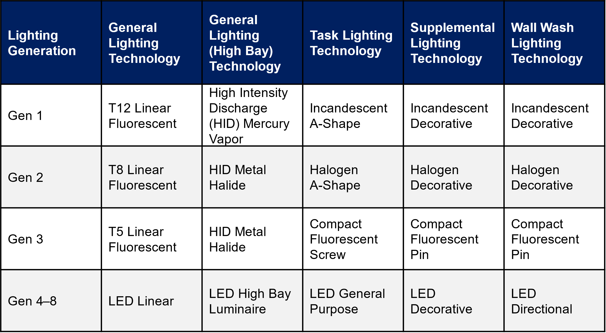

# LED Lighting + HP-RTU + ASHP-Boiler
{: .fw-500 }

Authors: Amy LeBar and Marley Praprost

#  Executive Summary

Building on the successfully completed effort to calibrate and validate the U.S. Department of Energy's ResStock™ and ComStock™ models over the past 3 years, the objective of this work is to produce national data sets that empower analysts working for federal, state, utility, city, and manufacturer stakeholders to answer a broad range of analysis questions.

The goal of this work is to develop energy efficiency, electrification, and demand flexibility end-use load shapes (electricity, gas, propane, or fuel oil) that cover a majority of the high-impact, market-ready (or nearly market-ready) upgrade measures, or upgrades. "Measures" refers to energy efficiency variables that can be applied to buildings during modeling.

An *end-use savings shape* is the difference in energy consumption between a baseline building and a building with an energy efficiency, electrification, or demand flexibility upgrade applied. It results in a time-series profile that is broken down by end use and fuel (electricity or on-site gas, propane, or fuel oil use) at each time step.

ComStock is a highly granular, bottom-up model that uses multiple data sources, statistical sampling methods, and advanced building energy simulations to estimate the annual subhourly energy consumption of the commercial building stock across the United States. The baseline model intends to represent the U.S. commercial building stock as it existed in 2018. The methodology and results of the baseline model are discussed in the final technical report of the [End-Use Load Profiles](https://www.nrel.gov/buildings/end-use-load-profiles.html) project.

An upgrade package applies one or more End-Use Savings Shapes upgrades to a single building model simulation. Since ComStock is a bottom-up physics-based model, an upgrade package will go beyond aggregating or summing the individual upgrade results and produce novel results by simulating interactions between the upgrades. For example, pairing an envelope upgrade with an electrification upgrade would likely result in higher savings results than the sum of these upgrades individually, and the size of the heating, ventilating, and air conditioning (HVAC) equipment may be reduced if the envelope upgrade reduces the loads significantly.

This documentation focuses on an upgrade package of three End-Use Savings Shapes upgrades--- [Light Emitting Diode (LED) Lighting](https://nrel.github.io/ComStock.github.io/docs/resources/references/upgrade_measures/lighting_led_lighting.html), [Heat Pump Rooftop Unit (HP-RTU)](https://nrel.github.io/ComStock.github.io/docs/resources/references/upgrade_measures/hvac_hp_rtu.html), and [Air-Source Heat Pump (ASHP) Boiler](https://nrel.github.io/ComStock.github.io/docs/resources/references/upgrade_measures/hvac_ashp_boiler.html), which we will refer to collectively as the "Interior Lighting and Heat Pump" package. HP-RTUs are applied to buildings with gas or electric RTUs, while the HP Boiler measure is applied to buildings with existing boilers systems. They are not applied together in this study. More details on the individual upgrades can be found on the [ComStock Measures Documentation](https://nrel.github.io/ComStock.github.io/docs/resources/references/upgrade_measures/upgrade_measures.html) page. This combination of measures was selected to model together because both LEDs and HPs are commercially available products and common energy efficiency and electrification measures.

The LED Lighting, HP-RTU and HP Boiler measures were applicable to 65%, 36%, and 33% of the stock floor area, respectively, resulting in the Interior Lighting and Heat Pump package being applicable to 89% of the total stock floor area. This package demonstrates 19.9% total site energy savings (922 trillion British thermal units \[TBtu\]) for the U.S. commercial building stock modeled in ComStock (Figure 3). The savings are primarily attributed to:

-   **94.2%** stock **heating gas** savings (778.5 TBtu)

-   **-132%** stock **heating electricity** savings (-260.7 TBtu).

-   **36.5%** stock **interior lighting electricity** savings (164.9 TBtu)

-   **20.1%** stock **fan electricity** savings (118.8 TBtu)

-   **14.3%** stock **cooling electricity** savings (104 TBtu).

The Interior Lighting and Heat Pump package demonstrates between -1.9 and 10.7 million metric tons (MMT CO2e) of greenhouse gas emissions avoided for the three grid electricity scenarios presented, as well as 52.1 MMT CO2e of greenhouse gas emissions avoided for on-site natural gas consumption.

# Acknowledgments

The authors would like to acknowledge the authors of the original measures in the Interior Lighting and Heat Pump package, Chris CaraDonna, Amy LeBar, Ryan Meyer, Andrew Parker, and Korbaga Woldekidan. Thank you to the reviewers of this package, Matt Dahlhausen and Shanti Pless. 

# 1. Introduction

This documentation covers "Interior Lighting and Heat Pump" upgrade methodology and briefly discusses key results. Results can be accessed via the ComStock™ [Published Datasets](https://nrel.github.io/ComStock.github.io/docs/data/published_datasets.html) page.

| **Package Title**      | Interior Lighting and Heat Pump                                                                                                                                   |
| **Package Definition** | This package upgrades interior lighting to LEDs and replaces RTUs and boilers with HPs in applicable models. It is a combination of three upgrades released in 2023 Release 1: LED Lighting, HP-RTU, and ASHP Boiler.        |
| **Applicability**      | This package is applicable to 89% of the stock floor area. For a package to be applicable, the model must meet the applicability criteria of one or more of the measures. **LED Lighting**: Models without LED lighting installed. This measure is applicable to 65% of the stock floor area. **HP-RTU**: Models that contain gas-fired or electric resistance RTUs. This measure is applicable to 36% of the stock floor area. **ASHP Boiler**: Models with a natural gas boiler for space heating. This measure is applicable to 33% of the stock floor area.     |
| **Not Applicable**     | **LED Lighting**: Models with LED lighting already installed. **HP-RTU**: Models that do not contain gas-fired or electric resistance RTUs. Not applicable to kitchen spaces. **ASHP Boiler**: Models not using a natural gas boiler for space heating such as those with a furnace or district heat source.         |                                                                                                                      
| **Release**            | 2023 Release 2: 2023/comstock_amy2018_release_2/   

# 2. Technology Summary

Many technologies are used to provide space heating in commercial building HVAC systems. Packaged rooftop units (RTUs) are currently used to heat 37% of commercial buildings in the United States (representing 50% of the total commercial floor space) \[1\]. Heat pumps currently provide space heating for only approximately 11% of commercial buildings (representing 15% of the total floor area) \[1\]. Heat pumps offer a high-performance electric option for commercial building space heating. Their use of electricity for heating enables pathways toward decarbonization, as they deliver space heating 2--4 times more efficiently than electric resistance options.

Natural gas used by boilers and furnaces accounts for 73% of space heating end-use energy consumption in the United States \[1\]. Retrofitting natural gas boilers with air-source heat pump (ASHP) boilers offers a decarbonization solution for this equipment.

This upgrade package pairs these two heat pump technologies with light-emitting diodes (LEDs) for interior lighting. The upgrade package applies the LED Lighting, HP-RTU, and/or ASHP Boiler upgrades based on the applicability criteria of each individual upgrade. A model will have all, some or none of the upgrades applied depending on how the model's characteristics align with each upgrade's applicability criteria.

For details about each of the three technologies, reference their individual upgrade documentation: [LED Lighting](https://nrel.github.io/ComStock.github.io/docs/resources/references/upgrade_measures/lighting_led_lighting.html), [HP-RTU](https://nrel.github.io/ComStock.github.io/docs/resources/references/upgrade_measures/hvac_hp_rtu.html), [ASHP-Boiler](https://nrel.github.io/ComStock.github.io/docs/resources/references/upgrade_measures/hvac_ashp_boiler.html).

# 3. ComStock Baseline Approach

The following sections provide high-level summaries of the ComStock baseline approach for interior lighting, RTUs, and boilers. For more detail about how these systems are modeled in the ComStock baseline, including data sources, reference the ComStock Documentation \[2\].

## 3.1. Interior Lighting

ComStock interior lighting is determined using a lighting generation approach, with each generation representing a collection of lighting technologies typically installed during a given time period. ComStock assumes four categories of lighting: General (overhead lighting), Task (lights focused on specific areas), Supplemental (supplemental lighting), and Wall Wash (illuminates vertical surfaces). The lighting technologies used in each category across the ComStock lighting generations are listed in Table 1. Generations 4--8 represent varying efficacy levels of LEDs, with Generation 4 being the first LED technology to market, and Generation 8 being the estimated technology level in 2035.

Table 1. Lighting Generations and Associated Technologies for Each Category

{:refdef: style="text-align: center;"}
{:width="650"}
{:refdef}

ComStock uses a similar approach to the ASHRAE 90.1 Lighting Subcommittee for determining the lighting power density (LPD) allowance for a given space type. Table 2 provides the average installed building-level LPDs in ComStock by building type and lighting generation.

Table 2. Average Building-Level Lighting Power Densities (W/ft2) by Lighting Generation and Building Type

  |**building type**          |**gen1**   |**gen2**   |**gen3**   |**gen4**   |**gen5**|
  |-------------------------- |---------- |---------- |---------- |---------- |--------|
  |full_service_restaurant    |1.51       |0.96       |0.45       |0.43       |0.39 |
  |hospital                   |1.59       |1.07       |0.63       |0.58       |0.52 |
  |large_hotel                |1.31       |0.80       |0.29       |0.23       |0.21 |
  |large_office               |1.18       |0.80       |0.50       |0.53       |0.47 |
  |medium_office              |1.18       |0.80       |0.50       |0.53       |0.47 |
  |outpatient                 |1.27       |0.85       |0.53       |0.52       |0.47 |
  |primary_school             |0.73       |0.56       |0.48       |0.47       |0.42 |
  |quick_service_restaurant   |1.73       |1.11       |0.56       |0.52       |0.47 |
  |retail                     |1.17       |0.75       |0.54       |0.47       |0.42 |
  |secondary_school           |0.88       |0.58       |0.48       |0.45       |0.40 |
  |small_hotel                |1.08       |0.63       |0.28       |0.25       |0.22 |
  |small_office               |1.18       |0.79       |0.50       |0.52       |0.47 |
  |strip_mall                 |1.59       |1.07       |0.65       |0.64       |0.59 |
  |warehouse                  |0.83       |0.40       |0.39       |0.30       |0.27 |

## 3.2. Rooftop Units

The state of the existing RTUs in ComStock™ is based on a combination of when the buildings were built and how the equipment has been updated over time, described in detail in the "ComStock Documentation" report by the National Renewable Energy Laboratory \[2\]. Equipment performance is assumed to meet the energy code requirements in force at the time and place of installation. For this reason, most of the existing RTUs are modeled as constant air volume with single-speed compressors. This is influential to the results in this analysis because energy savings will be calculated by comparing the energy performance of the ComStock baseline models to an updated version of the ComStock models that use the proposed HP-RTUs.

The in-force energy code for the ComStock baseline is shown as a percentage of applicable floor area in Figure 1. Applicable floor area for this analysis includes ComStock buildings with "PSZ-AC with gas coil" and "PSZ-AC with electric coil" HVAC system types (where PSZ-AC stands for packaged single-zone air conditioner). Most ComStock baseline RTUs follow energy code requirements from the early 2000s. Other energy efficiency features such as demand control ventilation, energy recovery, and economizer control are only applied to baseline ComStock RTUs if required by the in-force energy code for the particular model. The ComStock workflow checks the necessary characteristics of each RTU to determine if the feature is required. Similarly, heating, cooling, and fan efficiencies are set based on the in-force code year. For models with the "PSZ-AC with electric coil" HVAC system type, the ComStock baseline will use electric resistance coils with a coefficient of performance (COP) of 1. For models with the "PSZ-AC with gas coil" HVAC system type, the ComStock baseline will use a gas furnace efficiency of generally around 80%.

{:refdef: style="text-align: center;"}

{:refdef}

{:refdef: style="text-align: center;"}
Figure 1. ComStock baseline in-force energy code followed as a percentage of applicable floor area. Applicable floor area includes ComStock buildings with "PSZ-AC with gas coil" and "PSZ-AC with electric coil" HVAC system types.
{:refdef}

## 3.3. Boilers

The current version of boilers in ComStock are gas-fired, noncondensing boilers. The efficiencies of the boilers are assigned based on the U.S. Department of Energy's reference buildings templates and capacities; Table 3 summarizes the values \[2\]. As indicated in Table 3, three different performance curves were used to adjust the efficiency of the boiler based on part load ratio. All ComStock boilers have a heating set point of 180°F with a capacity to modulate flow.

Table 3. Boiler Efficiency and Performance Curve Assignment

{:refdef: style="text-align: center;"}

{:refdef}

# 4.  Modeling Approach

The following sections summarize the modeling approach and applicability for the Interior Lighting and Heat Pump upgrades included in this upgrade package. For more detailed descriptions, reference the individual upgrade documentations.

## 4.1. Interior Lighting

The [Interior Lighting upgrade](https://nrel.github.io/ComStock.github.io/docs/resources/references/upgrade_measures/lighting_led_lighting.html) replaces model interior lighting with Generation 5 LED lighting, where applicable. The upgrade will first identify whether the upgrade is applicable to the model. If applicable, it will cycle through each of the spaces in the model, changing the lighting to the appropriate technology based on the space type's lighting category (as defined in the resource files).

### 4.1.1. Applicability

The purpose of this upgrade is to model the energy impact of 100% LEDs in the commercial building stock. To capture this, in all models without LEDs (Generation 1--3), all interior lighting categories will be retrofitted with Generation 5 lighting. Models with Generation 4 will remain unchanged, as there is not a significant change in efficacy (12%) between Generations 4 and 5. Additionally, LEDs have long lifespans (10+ years), and it is not realistic to replace Generation 4 LEDs with a newer technology if the lamps still have many years of usable life left. Models with Generation 5 will also remain unchanged.

This upgrade is applicable to 65% of the ComStock floor area.

## 4.2. Heat Pump Rooftop Unit

The [Heat Pump Rooftop Unit upgrade](https://nrel.github.io/ComStock.github.io/docs/resources/references/upgrade_measures/hvac_hp_rtu.html) replaces RTUs with HP-RTUs where applicable. The HP-RTUs are modeled using the EnergyPlus® "AirloopHVAC:UnitarySystem" object \[3\], \[4\]. An OpenStudio® upgrade is used in conjunction with the ComStock workflow to modify/remove any applicable RTUs in the ComStock baseline models ("PSZ-AC with gas coil" and "PSZ-AC with electric coil") and articulate the appropriate HP-RTU objects and settings. Nonapplicable systems are not affected, nor are core operational parameters of systems such as schedules, thermostat set points, unoccupied operation behavior, and design outdoor airflow rates. Furthermore, energy-saving features found in applicable baseline RTUs such as airside heat/energy recovery, economizers, or demand control ventilation are preserved as-is for the new HP-RTU systems. This enables comparability, noting that these features are feasible and available in HP-RTU systems. The modeling details of the HP-RTU system are described further in the individual upgrade documentation.

Heat pumps in colder climates usually require a source of supplemental heat, which today is often sized to meet the entirety of the heating load. This is because heat pump capacity is reduced as outdoor ambient temperatures decrease, which generally corresponds to the highest heating loads for the building. The supplemental heat source is often electric resistance, which has an effective site COP of 1, whereas the heat pump system will often demonstrate a site COP much higher than this even at temperatures down to −17.8°C. Sizing heat pump systems to address more of the heating load is sometimes suggested because the heat pump heating is more efficient than electric resistance, so long as the sizing of the heat pump system still enables effective operation for both heating and cooling \[5\], \[6\]. However, this analysis simply sizes the heat pumps based on cooling load, and reserves studying the impact of other sizing approaches for future analyses.

### 4.2.1. Applicability

The HP-RTU upgrade is applicable to ComStock models with either gas furnace RTUs ("PSZ-AC with gas coil") or electric resistance RTUs ("PSZ-AC with electric coil"). ComStock HVAC distributions are informed by the 2012 Commercial Building Energy Consumption Survey (CBECS). The methodology for interpreting CBECS data to create HVAC probability distributions for ComStock is discussed in the ComStock documentation \[2\]. The upgrade is also not applicable to space types that directly serve kitchens, spaces that are unconditioned, or RTUs with outdoor air ratios above 65% (due to an EnergyPlus® bug with cycling operation).

This upgrade is applicable to about 36% of the ComStock floor area.

## 4.3. Air-Source Heat Pump Boiler

The [Air-Source Heat Pump Boiler upgrade](https://nrel.github.io/ComStock.github.io/docs/resources/references/upgrade_measures/hvac_ashp_boiler.html) replaces natural gas boilers for space heating with ASHP boilers. Outputs from the simulation runs could be used to quantify the carbon reduction and energy impact of the electrification.

The upgrade provides multiple options for the natural gas boiler replacement. Table 4 summarizes the upgrade inputs and their default values used in the simulation run.

Table 4. Upgrade Input Summary

| **Measure Inputs** | **Unit/Value** | **Description**                                                                                                                               | **Default Value**          |
|--------------------|----------------|-----------------------------------------------------------------------------------------------------------------------------------------------|----------------------------|
| Keep_setpoint      | True/False     | Provides an option to keep the original hot water set point.                                                                                  | False                      |
| hw_setpoint        | °F             | Provides a new hot water set point if user chooses to change the original value.                                                              | 140                        |
| autosize_hc        | True/False     | Provides an opportunity to auto-size heating coils when a user provides a new hot water set point.                                            | True                       |
| Sizing_method      |     --           | Provides an option for sizing the heat pump. The two options are sizing based on “percentage of peak load” and on “outdoor air temperature.”  | Outdoor air temperature    |
| hp_sizing_temp     | °F             | Provides the outdoor air temperature on which to base ASHP sizing if user chooses the sizing method as “outdoor air temperature.”             | 17                         |
| hp_sizing_per      | %              | Provides the percentage of the peak heating load on which to base the sizing if user chooses the sizing method as “percentage of peak load.”  | 70                         |
| hp_des_cap         | kW             | Maximum design heat pump heating capacity per unit. If the model requires a higher capacity, multiple units will be added in the loop.        | 40                         |
| bu_type            |   --             | Provides two options for backup heater: keeping the existing boiler or adding an electric resistance heater.                                  | Electric resistance heater |
| hpwh_cutoff_Temp   | °F             | Provides the cutoff temperature for the heat pump boiler.                                                                                     | −5                         |
| hpwh_Design_OAT    | °F             | Provides design outdoor air temperature for the heat pump boiler.                                                                             | 47                         |
| COP                |                | Provides the design coefficient of performance (COP) at the design outdoor air temperature.                                                   | 2.85                       |

### 4.3.1. Applicability

This upgrade is applicable to the ComStock OpenStudio models with the following HVAC system types: dedicated outdoor air system (DOAS) with fan coil air-cooled chiller with boiler, DOAS with fan coil chiller with boiler, DOAS with fan coil district chilled water with boiler, DOAS with water-source heat pump cooling tower with boiler, packaged single zone air conditioner (PSZ-AC) with gas boiler, packaged variable air volume (PVAV) with gas boiler, PVAV with gas heat with electric reheat, variable air volume (VAV) air-cooled chiller with gas boiler reheat, VAV chiller with gas boiler reheat, and VAV district chilled water with gas boiler reheat.

This upgrade is applicable to about 33% of the ComStock floor area.

## 4.4. Greenhouse Gas Emissions

Three electricity grid scenarios are presented to compare the emissions of the ComStock baseline and the window replacement scenario. The choice of grid scenario will impact the grid emissions factors used in the simulation, which determines the corresponding emissions produced per kilowatt-hour. Two scenarios---Long-Run Marginal Emissions Rate (LRMER) High Renewable Energy (RE) Cost 15-Year and LRMER Low RE Cost 15-Year---use the Cambium data set, and the last uses the eGrid data set \[7\], \[8\]. All three scenarios vary the emissions factors geospatially to reflect the variation in grid resources used to produce electricity across the United States. The Cambium data sets also vary emissions factors seasonally and by time of day. This study does not imply a preference for any particular grid emissions scenario, but other analysis suggests that the choice of grid emissions scenario can impact results \[9\]. Emissions due to on-site combustion of fossil fuels use the emissions factors shown in Table 5, which are from Table 7.1.2(1) of the draft American National Standards Institute/Residential Energy Services Network/International Code Council 301 \[10\]. To compare total emissions due to both on-site fossil fuel consumption and grid electricity generation, the emissions from a single electricity grid scenario should be combined with all three on-site fossil fuel emissions.

Table 5. On-Site Fossil Fuel Emissions Factors 

| **Natural gas **                                                                         |   147.3 lb/MMBtu (228.0 kg/MWh)a |
| **Propane **                                                                             |   177.8 lb/MMBtu (182.3 kg/MWh)    |
| **Fuel oil **                                                                            |   195.9 lb/MMBtu (303.2 kg/MWh)    |

a lb = pound; MMBtu = million British thermal units; kg = kilogram; MWh = megawatt-hour     

## 4.5. Limitations and Concerns

In general, real buildings may have limitations beyond what has been included in the upgrades' applicability criteria that could affect the upgrade results. The following subsections detail the limitations and concerns for the two heat pump upgrades.

### 4.5.1. Heat Pump Rooftop Unit

Limited comprehensive heat pump performance maps exist, which are required for detailed energy modeling. Consequently, understanding of heat pump performance and operation in this work is also limited. Heat pump modeling is sensitive to performance assumptions due to the strong relationship between efficiency and capacity with outdoor air temperature. This impacts both annual energy consumption and peak demand. This work attempts to use the most informative data available and makes documented assumptions about heat pump operation and performance. These will notably impact results. Please consider these assumptions.

Stock savings are sensitive to ComStock baseline assumptions. Compared to CBECS 2012, which is another prominent data source for commercial building stock energy usage, ComStock currently shows lower gas heating consumption and higher electric heating consumption \[11\]. This can affect the net impact of converting both gas furnace and electric resistance RTUs to HP-RTUs.

Lastly, there is a known EnergyPlus bug regarding cycling operation for multispeed coil objects. This can cause the modeled HP-RTU systems to cycle at higher part load fractions than the baseline single-speed RTU systems. Many units are only minimally impacted by this since the HP-RTU systems are variable speed and can turn down to lower part load fractions.

### 4.5.2. Air-Source Heat Pump Boiler

Some of the boilers in the baseline ComStock models do not have minimum load turndown control. This allows a small flow with insignificant heating in the hot water loop. This had a negative impact during the application of this upgrade, as the upgrade introduces a heat pump loop that is triggered by a nonzero flow in the hot water loop. The small flow in the hot water loop forces the heat pump to cycle frequently and eventually affects the expected savings from the application of this upgrade. This issue should be addressed in the next version of the ComStock models.

Another limitation is the current version of the heat pump object used in this upgrade, the plant loop energy input ratio (EIR) heating heat pump. This object is a constant flow model that requests full design flow from the plant. This limits the ability to model variable speed heat pumps and forces the heat pump to cycle more. This upgrade should be updated in the future once the updated version of the heat pump object with a variable speed option is available.

# 5. Output Variables

Table 6 includes a list of output variables that are calculated in ComStock by the upgrades included in this upgrade package. These variables are important in terms of understanding the differences between buildings with and without the Interior Lighting and Heat Pump upgrade package applied. These output variables can also be used for understanding the economics of the upgrades (e.g., return on investment) if cost information (i.e., material, labor, and maintenance costs for technology implementation) is available.

Table 6. Output Variables Calculated From the Upgrade Applications

| **Upgrade** | **Variable Name**         | **Description**                                                                                |
|-------------|---------------------------|------------------------------------------------------------------------------------------------|
| LED Lighting| Initial Lighting Power    | Initial power by lighting technology (W)                                                       |
|             | Initial LPD               | Average building LPD (W/ft2)                                                                   |
|             | Final Lighting Generation | Lighting generation after measure is applied (should be Generation 5 if measure is applicable) |
|             | Final Lighting Power      | Final lighting power by technology (W)                                                         |
|             | Final LPD                 | Average building LPD (W/ft2)                                                                   |
| HP-RTU      |stat.hvac\_count\_dx\_cooling\_XX\_to\_XX\_kbtuh|Total number of DX cooling units within a size bin.|
|             |stat.hvac\_count\_dx\_heating\_XX\_to\_XX\_kbtuh|Total number of DX heating units within a size bin.|
|             |stat.hvac\_count\_heat\_pumps\_XX\_to\_XX\_kbtuh|Total number of heat pump units within a size bin.|
|             |stat.dx\_cooling\_average\_cop..COP|Average operational COP (compressor only) of DX cooling models during simulation.|
|             |stat.dx\_cooling\_capacity\_tons..tons|Total tons of DX cooling modeled.|
|             |stat.dx\_cooling\_design\_cop..COP|Average rated (compressor only) COP of DX cooling units at rated conditions.|
|             |stat.dx\_heating\_average\_cop..COP|Average operational COP (compressor only) of DX cooling models during simulation.|
|             |stat.dx\_heating\_average\_minimum\_operating\_temperature..C|Average compressor minimum heating lockout temperature, below which the heat pump heating will be disabled.|
|             |stat.dx\_heating\_average\_total\_cop..COP|Average effective COP of DX heating. This includes energy from the defrost cycle and any supplemental heating.|
|             |stat.dx\_heating\_capacity\_at\_XXF..kBtu\_per\_hr|Average available heat pump capacity at a given temperature.|
|             |stat.dx\_heating\_capacity\_at\_rated..kBtu\_per\_hr|Average available heat pump capacity at rated temperature (47°F).|
|             |stat.dx\_heating\_design\_cop..COP|Average design COP of heat pumps.|
|             |stat.dx\_heating\_design\_cop\_XXf..COP|Heat pump COP at given temperature, or rated conditions (47°F).|
|             |stat.dx\_heating\_fraction\_electric\_defrost|Fraction of heat pump electric defrost energy to DX heating energy.|
|             |stat.dx\_heating\_fraction\_electric\_supplemental|Fraction of heat pump electric supplemental heating energy to DX heating energy.|
|             |stat.dx\_heating\_supplemental\_capacity\_electric..kBtu\_per\_hr|Electric coil supplemental heating capacity.|
|             |stat.dx\_heating\_supplemental\_capacity\_gas..kBtu\_per\_hr|Gas coil supplemental heating capacity.|
|             |stat.dx\_heating\_supplemental\_capacity..kBtu\_per\_hr|Total (gas or electric) supplemental heating capacity.|
|             |stat.dx\_heating\_fraction\_supplemental|Fraction of heat pump heating energy from supplemental heating.|
|             |stat.dx\_heating\_total\_dx\_electric..J|Total heat pump heating electric load.|
|             |stat.dx\_heating\_total\_dx\_load..J|Total heat pump heating load.|
|             |stat.dx\_heating\_total\_load..J|Total heat pump system heating load.|
|             |stat.dx\_heating\_total\_supplemental\_load\_gas..J|Total heating output energy from gas supplemental coil.|
|             |stat.dx\_heating\_total\_supplemental\_load\_electric..J|Total heating output energy from electric supplemental coil.|
|             |stat.dx\_heating\_defrost\_energy..kBtu|Total heat pump electricity energy for defrost.|
|             |stat.dx\_heating\_ratio\_defrost|Ratio of heat pump defrost electricity to heat pump heating energy.|
|             |stat.hours\_below\_XXF..hr|Number of hours below given outdoor air temperature during simulation.|
| ASHP Boiler | Heat pump capacity weighted design COP | COP of the heat pump at the rated design conditions         |
|             | Heat pump average COP                  | Average heat pump COP                                       |
|             | Heat pump total load                   | Total heating provided by heat pump                         |
|             | Boiler total load                      | Total heating provided by boiler                            |
|             | Heat pump total electricity            | Total electricity consumption by heat pump                  |
|             | Boiler total electricity               | Total electricity consumption by boiler                     |
|             | Heat pump capacity kbtuh               | Heat pump capacity                                          |
|             | Count heat pumps                       | Count of heat pumps                                         |
|             | Count heat pumps 0-300 kbtuh           | Count of heat pumps in the range of 0–300 kbtuh capacity    |
|             | Count heat pumps 300-2500 kbtuh        | Count of heat pumps in the range of 300–2500 kbtuh capacity |
|             | Count heat pumps 2500 plus kbtuh       | Count of heat pumps with more than 2500 kbtuh capacity      |
|             | Hot water loop total load              | Total heating load in the hot water loop                    |
|             | Hot water loop boiler fraction         | Fraction of heating load provided by boiler                 |
|             | Hot water loop heat pump fraction      | Fraction of heating load provided by heat pump              |

# 6. Results

In this section, results are presented both at the stock level and for individual buildings through savings distributions. Stock-level results include the combined impact of all the analyzed buildings in ComStock, including buildings that are not applicable to this upgrade. Therefore they do not necessarily represent the energy savings of a particular or average building. Stock-level results should not be interpreted as the savings that a building might realize by implementing the Interior Lighting and Heat Pump upgrade package.

Total site energy savings are also presented in this section. Total site energy savings can be a useful metric, especially for quality assurance/quality control, but this metric on its own can have limitations for drawing conclusions. Further context should be considered, as site energy savings alone do not necessarily translate proportionally to savings for a particular fuel type (e.g., gas or electricity), source energy savings, cost savings, or greenhouse gas savings. This is especially important when an upgrade impacts multiple fuel types or causes decreased consumption of one fuel type and increased consumption of another. Many factors should be considered when analyzing the impact of an energy efficiency or electrification strategy, depending on the use case.

## 6.1. Realized Applicability

Figure 2 provides a breakdown of the applicability of the Interior Lighting and Heat Pump package by individual measure. The individual component measures were applicable to between 33% and 65% of the stock floor area, and the package was applicable to 89% of the stock floor area.

{:refdef: style="text-align: center;"}

{:refdef}

{:refdef: style="text-align: center;"}
Figure 2. Applicability for the Interior Lighting and Heat Pump package and by individual measure.
{:refdef}

## 6.2. Stock Energy Impacts

The Interior Lighting and Heat Pump package demonstrates 19.9% total site energy savings (922 trillion British thermal units \[TBtu\]) for the U.S. commercial building stock modeled in ComStock (Figure 3). The savings are primarily attributed to electrification of gas-furnace and boiler systems, and LED installation:

-   **94.2%** stock **heating gas** savings (778.5 TBtu)

-   **-132%** stock **heating electricity** savings (-260.7 TBtu)

-   **36.5%** stock **interior lighting electricity** savings (164.9 TBtu)

-   **20.1%** stock **fan electricity** savings (118.8 TBtu)

-   **14.3%** stock **cooling electricity** savings (104 TBtu).

{:refdef: style="text-align: center;"}

{:refdef}

{:refdef: style="text-align: center;"}
Figure 3. Comparison of annual site energy consumption between the ComStock baseline and the Interior Lighting and Heat Pump scenario. Energy consumption is categorized both by fuel type and end use.
{:refdef}

## 6.3. Stock Greenhouse Gas Emissions Impact

ComStock simulation results show greenhouse gas emissions avoided across all electricity grid scenarios, except LRMER Low RE Cost 15, and for all on-site combustion fuel types (Figure 4). For the combined impact across all sources, a single electricity grid scenario should be chosen and combined with all three on-site combustion fuel scenarios. Greenhouse gas emissions avoided from the electricity grid are between -1.2% and 3.2%, depending on the scenario chosen. This is due to reduced electricity consumption from the interior lighting, but also includes the increase in electricity from electrifying gas-furnace and boiler systems and the decrease in electricity from reduced interior lighting electricity, and improved cooling and fan systems with the HP-RTU measure. The 62.3%, 10.4%, and 5.0% emissions avoided from on-site combustion of natural gas, fuel oil and propane, respectively, are attributable to electrifying some of these combustion-based heating systems.

{:refdef: style="text-align: center;"}

{:refdef}

{:refdef: style="text-align: center;"}
Figure 4. Greenhouse gas emissions comparison of the ComStock baseline and the Interior Lighting and Heat Pump scenario
{:refdef}

{:refdef: style="text-align: center;"}
Three electricity grid scenarios are presented: Cambium Long-Run Marginal Emissions Rate (LRMER) High Renewable Energy (RE) Cost 15-Year, Cambium LRMER Low RE Cost 15-Year, and eGrid. MMT stands for million metric tons.
{:refdef}

## 6.4. Site Energy Savings Distributions

This section discusses site energy consumption for quality assurance/quality control purposes. Note that site energy savings can be useful for these purposes, but other factors should be considered when drawing conclusions, as these do not necessarily translate proportionally to source energy savings, greenhouse gas emissions avoided, or energy cost.

Figure 5 shows the percent savings distributions of the baseline ComStock models versus the Interior Lighting and Heat Pump scenario by end use and fuel type for applicable models. Minimal differences are observed for water systems and refrigeration, which see small changes in the baseline due only to minor changes in ambient air temperature that affect the operation of these systems. Most of the savings for the "Other Fuel Heating" and "Natural Gas Heating" categories are at 100% owing to replacing the combustion fuel-based system in the baseline with an all-electric heat pump system in the Interior Lighting and Heat Pump scenario. A number of models unexpectedly show "Natural Gas Heating" and "Other Fuel" heating penalties. Closer investigation shows that these models (1) only have the LED lighting measure applicable and are therefore losing the internal load provided by pre-LED lighting technologies that was beneficial for heating, and (2) have low heating loads, in general, because they are located in warm climates and therefore any small change between the baseline and upgrade model will result in high percent change. When considering the site energy use intensity (EUI) savings rather than percent savings, this second point is evident (Figure 6).

{:refdef: style="text-align: center;"}

{:refdef}

{:refdef: style="text-align: center;"}
Figure 5. Percent site energy savings distribution for ComStock models with the Interior Lighting and Heat Pump package applied by end use and fuel type
{:refdef}

{:refdef: style="text-align: center;"}
The data points that appear above some of the distributions indicate outliers in the distribution, meaning they fall outside 1.5 times the interquartile range. The value for n indicates the number of ComStock models that were applicable for energy savings for the fuel type category.
{:refdef}

Pump electricity increased between the baseline and upgrade scenario, as expected, due to the addition of heat pump boilers to the models which adds equipment to the loop and operates at a lower supply temperature than the existing gas boilers they are replacing.

A number of models saw heating electricity savings due to higher efficiency performance of HP-RTUs compared with traditional RTUs. Some models also saw heating electricity penalties. This can be attributed to the conversion of combustion-based heating to electricity-based.

Some models show negative heat recovery savings, noting that the heat recovery end use is for electricity used to operate enthalpy wheels. The negative energy savings are due to increased prevalence of wheel operation caused by increased cycling operation with the HP-RTUs compared to the baseline RTUs. In other words, increased runtime for the air handler can cause increased run time for the enthalpy wheel. This is in part due to an EnergyPlus bug that causes longer cycling operation with the multispeed coil objects used for modeling the HP-RTU. However, the heat recovery end use makes up a very small portion of building stock energy usage, so negative percentage savings in this end use has minimal impact.

Eight models show greater than 100% energy savings for the cooling end use. This is a [documented issue](https://github.com/NREL/comstock-internal/issues/240) in the HP-RTU upgrade for these models. The DX cooling coil in a fraction of zones that the HP-RTU measure are applied to incur a negative EIR at certain times throughout the year. This issue will be resolved in the next cycle of EUSS upgrade measures, likely by applying curve bounds. This affects a very small subset of the models and has minimal impact on the results.

{:refdef: style="text-align: center;"}

{:refdef}

{:refdef: style="text-align: center;"}
Figure 6. Site EUI energy savings distribution for ComStock models with the Interior Lighting and Heat Pump package applied by end use and fuel type
{:refdef}

{:refdef: style="text-align: center;"}
The data points that appear above some of the distributions indicate outliers in the distribution, meaning they fall outside 1.5 times the interquartile range. The value for n indicates the number of ComStock models that were applicable for energy savings for the fuel type category.
{:refdef}

Figure 7 shows the site energy savings distributions between the ComStock baseline and the Interior Lighting and Heat Pump scenario by fuel type and total site energy. The total site energy savings distribution shows savings values generally between 10% and 35% for the 25th and 75th percentiles, respectively. Combined site energy savings alone is not a comprehensive assessment of electrification measures, so other considerations should be made as well.

The site electricity distribution shows some energy penalties. These are mostly buildings that changed from gas heat to electric heat, so the penalties are expected. Some of this electricity penalty is reduced or mitigated through savings for cooling, fans, and heat recovery, depending on the building and its climate zone. Many of the buildings, however, show electricity savings. Many of these models had their interior lighting replaced with LEDs. Others are buildings that had electric heating in the baseline; in these cases, the higher-efficiency HP-RTU system reduces electricity usage across multiple end uses.

The "Natural Gas" and "Other Fuel" end uses show many models with near 100% savings. These are buildings that are completely electrified from the HP-RTU or ASHP Boiler measures and where gas is not used for other end uses. Models with less than 100% gas or other fuel savings generally have some nonapplicable gas HVAC system type in the baseline, or other end uses, such as water heating, that are not electrified through the HP-RTU or ASHP Boiler measures. Several models show negative natural gas site savings. These are primarily models that either only had the LED lighting measure applicable and therefore had higher heating requirements, or have low heating loads that show a misleadingly high percent change in heating consumption, as previously discussed. This is the case for district heating negative savings, as well.

{:refdef: style="text-align: center;"}

{:refdef}

{:refdef: style="text-align: center;"}
Figure 7. Percent site energy savings distribution for ComStock models with the applied Interior Lighting and Heat Pump package by fuel type
{:refdef}

The data points that appear above some of the distributions indicate outliers in the distribution, meaning they fall outside 1.5 times the interquartile range. The value for n indicates the number of ComStock models that were applicable for energy savings for the fuel type category.

## 6.5. Peak Impacts

Figure 8 shows the impact of the Interior Lighting and Heat Pump package on seasonal peak hours. The winter peak is shifted earlier in the day by several hours, and morning electric heating is now driving the peak in the winter. Summer and shoulder peak distributions remained relatively similar between the two cases but show minor reductions likely due to LED lighting and cooling/fan reductions from the HP-RTU measure.

{:refdef: style="text-align: center;"}

{:refdef}

{:refdef: style="text-align: center;"}
Figure 8. Maximum daily peak timing by season between the baseline and Interior Lighting and Heat Pump scenario
{:refdef}

Figure 9 shows the impact of the Interior Lighting and Heat Pump package on seasonal peak magnitude. There is minimal impact on seasonal peak magnitude.

{:refdef: style="text-align: center;"}

{:refdef}

{:refdef: style="text-align: center;"}
Figure 9. Maximum daily peak timing by season between the baseline and Interior Lighting and Heat Pump scenario
{:refdef}

## 6.6. Building Type Impacts

Figure 10 shows the impacts of the Interior Lighting and Heat Pump upgrade package on natural gas consumption across the building types in the stock. Offices, schools, retail standalone, hospitals, and warehouses benefitted most from electrification of heating. This is a result of the breakdown of existing HVAC systems in these building types. The majority have PSZ-AC systems or boilers. The building types that still show substantial gas usage generally use gas for other end uses not impacted by this measure like water heating (food service, hotels), cooking (food service, strip malls with food service) and other gas process loads, or have a high prevalence of HVAC system types not applicable to this package (e.g., PTACs in hotels).

{:refdef: style="text-align: center;"}

{:refdef}

{:refdef: style="text-align: center;"}
Figure 10. Annual stock natural gas energy consumption by building type before and after the Interior Lighting and Heat Pump package was applied
{:refdef}

# References
\[1\] \"2018 COMMERICAL BUILDINGS ENERGY CONSUMPTION SURVEY (CBECS),\" \[Online\]. Available: https://www.eia.gov/consumption/commercial. \[Accessed 14 November 2022\].

\[2\] A. Parker, H. Horsey, M. Dahlhausen, M. Praprost, C. CaraDonna, A. LeBar and L. Klun, \"ComStock Reference Documentation: Version 1,\" National Renewable Energy Laboratory, Golden, CO, 2022.

\[3\] \"EnergyPlus Version 22.1.0 Documentation Engineering Reference,\" 2022. \[Online\]. Available: https://energyplus.net/documentation.

\[4\] \"EnergyPlus Version 22.1.0 Documentation Input Output Reference,\" 2022. \[Online\]. Available: https://energyplus.net/documentation.

\[5\] ASHRAE, 2015 ASHRAE Handbook HVAC Applications, 2015.

\[6\] Natural Resources Canada, \"AIR-SOURCE HEAT PUMP SIZING AND SELECTION GUIDE,\" 2020. \[Online\]. Available: https://natural-resources.canada.ca/sites/nrcan/files/canmetenergy/pdf/ASHP%20Sizing%20and%20Selection%20Guide%20(EN).pdf.

\[7\] \"Cambium \| Energy Analysis \| NREL,\" \[Online\]. Available: https://www.nrel.gov/analysis/cambium.html. \[Accessed 02 September 2022\].

\[8\] \"Emissions & Generation Resource Integrated Database (eGRID) \| US EPA,\" \[Online\]. Available: https://www.epa.gov/egrid. \[Accessed 02 September 2022\].

\[9\] E. Present, P. Gagnon, E. J. H. Wilson, N. Merket, P. R. White and S. Horowitz, \"Choosing the Best Carbon Factor for the Job: Exploring Available Carbon Emissions Factors and the Impact of Factor Selection,\" in *2022 ACEEE Summer Study on Energy Efficiency in Buildings*, Pacific Grove, CA, 2022.

\[10\] G. Vijayakumar, *ANSI/RESNET/ICC 301-2022 - Standard for the Calculation and Labeling of the Energy Performance of Dwelling and Sleeping Units using an Energy Rating Index,* Oceanside, CA, 2022.

\[11\] \"Commerical Buildings Energy Consumption Survey (CBECS),\" 2012. \[Online\]. Available: https://www.eia.gov/consumption/commercial/data/2012. \[Accessed 15 November 2022\].

# Appendix A.  
{:refdef: style="text-align: center;"}

{:refdef}

{:refdef: style="text-align: center;"}
Figure A-1. Site annual natural gas consumption of the ComStock baseline and the measure scenario by census division
{:refdef}

{:refdef: style="text-align: center;"}

{:refdef}

{:refdef: style="text-align: center;"}
Figure A-2. Site annual natural gas consumption of the ComStock baseline and the measure scenario by building type
{:refdef}

{:refdef: style="text-align: center;"}

{:refdef}

{:refdef: style="text-align: center;"}
Figure A-3. Site annual electricity consumption of the ComStock baseline and the measure scenario by census division
{:refdef}

{:refdef: style="text-align: center;"}

{:refdef}

{:refdef: style="text-align: center;"}
Figure A-4. Site annual electricity consumption of the ComStock baseline and the measure scenario by building type
{:refdef}