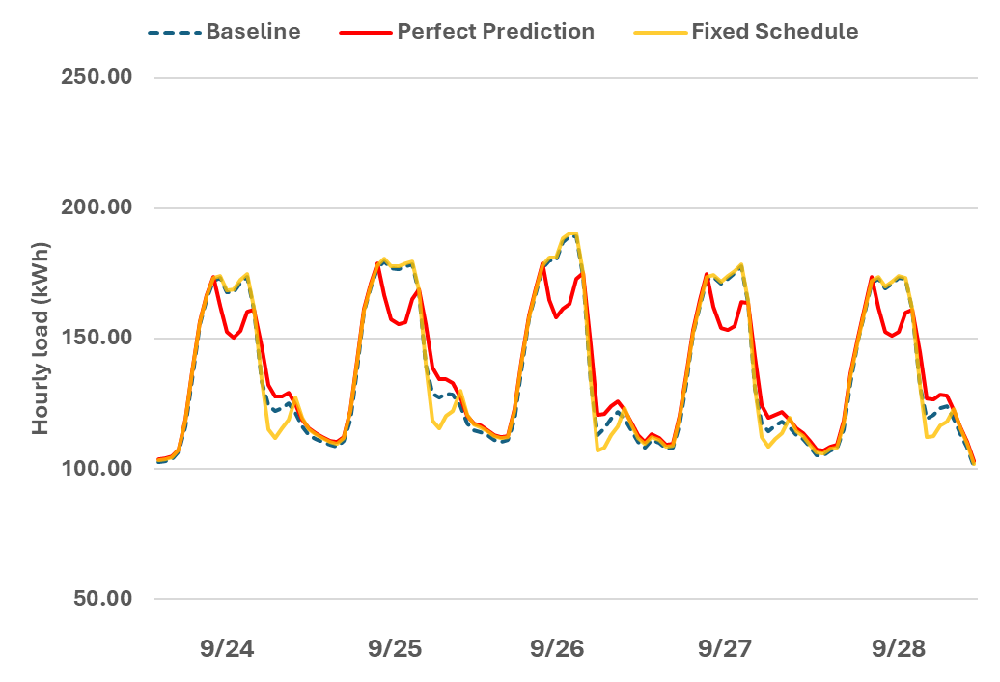

# Dispatch Schedule Generation for Demand Flexibility Measures
{: .fw-500 }

Author: Jie Xiong and Janghyun Kim

## Executive Summary

Building on the successfully completed effort to calibrate and validate the U.S. Department of Energy's ResStock™ and ComStock™ models over the past several years, the objective of this work is to produce national data sets that empower analysts working for federal, state, utility, city, and manufacturer stakeholders to answer a broad range of analysis questions.

The goal of this work is to develop energy efficiency, electrification, and demand flexibility end-use load shapes (electricity, gas, propane, or fuel oil) that cover a majority of the high-impact, market-ready (or nearly market-ready) measures. "Measures" refers to energy efficiency, electrification, and demand flexibility variables that can be applied to buildings during modeling.

An *end-use savings shape* is the difference in energy consumption between a baseline building and a building with an energy efficiency, electrification, or demand flexibility measure applied. It results in a time-series profile that is broken down by end use and fuel (electricity or on-site gas, propane, or fuel oil use) at each time step.

ComStock is a highly granular, bottom-up model that uses multiple data sources, statistical sampling methods, and advanced building energy simulations to estimate the annual subhourly energy consumption of the commercial building stock across the United States. The baseline model intends to represent the U.S. commercial building stock as it existed in 2018. The methodology and results of the baseline model are discussed in the final technical report of the [End-Use Load Profiles](https://www.nrel.gov/buildings/end-use-load-profiles.html) project.

This supplemental document describes the methodology used for determining the dispatch timing of various End-Use Savings Shape demand flexibility measures. Demand flexibility measures are designed to reduce/dispatch electricity demand in buildings during especially beneficial/critical times. The method used in this work utilizes predictions of building loads to generate a schedule that reflects the periods when the building's daily peak load occurs to support decision-making in demand flexibility measures. This method is also designed in a way to change the goal of the dispatch timing (i.e., finding daily peak) to another goal (e.g., maximum carbon emission factor) when provided with relevant input data (e.g., time varying carbon signals).

The dispatch schedule generation method described in this document creates hourly schedule (i.e. 8760 values for the whole year) that includes a (load) dispatch (peak) window for each day based on load prediction, with options using different methods: perfect prediction, bin-sampling, fixed schedule, and outdoor air temperature (OAT)-based prediction.

The perfect prediction method performs a simulation to obtain the annual load profile as predicted load, representing the scenario of perfect load prediction. The bin-sampling method (1) categorizes days into representative bins by temperature characteristics, (2) performs simulations on sample days from each of those bins to create representative (or predicted) load, and (3) assigns representative loads for all days in a year based on the bin categorization. The fixed schedule method defines uniform start and end time of peak window with assumed fixed daily peak time, for all days in a season or a year. The OAT-based prediction method uses the statistics of OAT (minimum and maximum) as the indicators of peak load, with specified delay response time from building loads to temperature. The fixed schedule and OAT-based prediction methods have been widely used in existing demand flexibility research, and serve as comparable references in this documentation that represent the prevalence choice of previous work (with shown downside) and help demonstrating the effectiveness of the perfect prediction and bin-sampling methods (that outperform the fixed schedule and OAT-based prediction methods).

Given the load prediction, daily peak periods are determined as a time window with specified length in each day that include the predicted daily peak load and with a secondary rule such as maximizing energy saving potential.

The dispatch schedule generation method is not a standalone measure and is intended to be combined with other demand flexibility measures that could leverage the peak schedule and apply demand controls on specific systems or devices for demand response, such as Thermostat Control for Load Shedding and Thermostat Control for Load Shifting listed on the ComStock [webpage](https://nrel.github.io/ComStock.github.io/docs/upgrade_measures/upgrade_measures.html).

## 1. Introduction

This documentation covers the "Dispatch Schedule Generation for Demand Flexibility Measures" methodology that is leveraged in End-Use Savings Shape demand flexibility measures.

| **Title**  | **Dispatch Schedule Generation for Demand Flexibility Measures**                 |
| Measure Definition |  This method generates schedule input for various demand flexibility measures by creating schedule (i.e. 8760 hourly values for the whole year) that determines when to dispatch demand flexibility for certain objective (e.g. daily peak load reduction), based on different load prediction methods: perfect prediction, bin-sampling, fixed schedule, and outdoor air temperature (OAT)-based prediction. Depending on the load prediction, daily peak periods are determined as a time window with specified length in each day that include the predicted daily peak load and with a secondary rule such as maximizing energy saving potential. |
| Applicability      | This method is applicable to be used in conjunction with other ComStock Demand Flexibility measures, e.g. "Thermostat Control for Load Shedding" and "Thermostat Control for Load Shifting." Refer to the documentation of those specific measures to understand where they are applied. |
| Release            | 2024 Release 1: 2024/comstock_amy2018_release_1/   |

### 1.1 Grid-Interactive Efficient Buildings With Demand Flexibility

Electricity consumers across the residential, commercial, and industrial sectors are increasingly interested in opportunities to reduce their electricity bills and carbon footprint. Simultaneously, utilities, system operators, and state decision makers are aiming to reduce costs, more effectively utilize existing grid assets, maintain power system reliability, and reach carbon reduction targets. At the intersection of the customer and utility perspectives, buildings and their associated loads offer opportunities to align the interests of consumers, system operators, and policy decision makers. Interactivity between buildings and the broader electricity system expand these opportunities, and is enabled by advancements in building control technologies, data availability, advanced metering, new tariff designs, and improved analytics for energy management. Collectively, these smart technologies for energy management are often referred to as grid-interactive efficient buildings (GEBs). GEBs utilize high-efficiency components to reduce electricity demand and increase the flexibility of specific building loads, responding to real-time signals or advanced calls for demand response. By shedding and shifting building load, these GEBs can reduce electricity bills, the cost of operating the grid, and emissions, all with minimum impact on occupant comfort. The methods for achieving these GEB objectives are called energy efficiency and demand flexibility measures. Specifically, demand flexibility measures focus on adjusting building loads (shedding and shifting) across different time scales.

There are many resources for GEB research and demand flexibility strategies, from state to national scales. The U.S. Department of Energy (DOE) *National Roadmap for Grid-Interactive Efficient Buildings* (2021) \[1\] and Langevin et. al (2021) \[2\] both introduce GEB opportunities at a national scale. DOE has also published a technical report series \[3\] highlighting the state of the art for specific GEB technologies. The General Services Administration (GSA) has taken early action to identify potential and implement GEBs in the federal building stock with a set of GSA reports \[4\] highlighting the opportunities, demonstration projects, and lessons learned, among which the case studies \[5\] are directed to policy makers and utilities aiming to incentivize GEB deployment. While federal decision makers oversee GEB and demand flexibility strategies at a high level, many studies have focused on single building operations or even individual system control strategies for demand flexibility \[6\], \[7\], \[8\], \[9\], \[10\].

### 1.2 Importance of Load Prediction for Demand Flexibility

Based on the above resources, existing GEB demand flexibility measures targeting major building systems (e.g., HVAC system, lighting system) focus on load shed and shift strategies to flatten net system loads by reducing peak period load (e.g., through dimming the lights or a thermostat setbacks) and moving load off-peak (e.g., to the hours before and/or after the peak window).

Utilities and grid operators are generally more concerned about aggregated grid electricity demand rather than the individual load profile of any particular building. However, understanding the shape of the building load and learning when the peak demand for the building happens is essential for providing demand flexibility and is beneficial to building owners/managers/operators from the perspective of the individual building. Targeting demand reduction of a specific building load may be infeasible on the grid/utility side, but it achieves demand flexibility and optimized demand dispatch, and thus maximizes energy cost savings for single buildings. However, most of the existing modeling studies of demand flexibility measures (as summarized in \[11\]) simplify demand flexibility timing by assuming a uniform window aligning with the most common or averaged peak price schedule of time-of-use (TOU) rates for specific regions (e.g., weekdays between 2pm and 4pm for one of the Energy Information Administration's \[EIA\] National Energy Modeling System Electricity Market Module regions \[12\]). Aligning the demand response control on building load favorably with a fixed schedule may lead to electricity energy and demand bill savings if the schedule agrees with the utility's TOU rate structure (e.g., reducing load for peak pricing periods), but it does not guarantee true peak demand reductions if the actual building load profile is not aligned with the fixed window of peak pricing, which is inferred from the system load shapes drawn from EIA Electricity Market Module outputs representing the "average" peak timing in the region. Figure 1 illustrates an example scenario where a thermostat setback strategy based on assumed fixed peak fails to align the control with the actual load variations to reduce peak load.

{:refdef: style="text-align: center;"}

{:refdef}

{:refdef: style="text-align: center;"}
Figure 1. Example demand flexibility control with fixed peak schedule
{:refdef}

DF = demand flexibility

On the other hand, while TOU rates are the most common reference to infer a demand response schedule when targeting bill cost savings, it's either not accurate to select a single representative TOU rate for numerous buildings or it requires extensive efforts to map all applicable TOU rates to buildings across regions when it comes to aggregation in a high level (e.g., state level). For example, the Demand Response Research Center at Lawrence Berkeley National Laboratory published a set of reports for the California Demand Response Potential Study \[13, p. 3\], \[14\], and used TOU rates consistently to indicate the peak demand events for shed-type and shift-type demand response analysis. However, one of the reports (for phase 3) also pointed out that TOU pricing has limited flexibility, and dynamic prices should be explored. Nevertheless, TOU rates or other fixed peak window schedules are helpful for understanding the overall building load peak, or regulating the aggregated grid demand in the region level, but they cannot represent the timing of a single building's peak load due to the diversity of building loads. Therefore, to better align demand flexibility dispatch with building loads, a more generic approach to determine peak schedule for individual building is needed to account for uncertainties and/or potentials in building load.

In addition, advanced demand response controls require more flexible demand dispatch strategies for demand reduction on a daily basis. Understanding the daily load profile of a building and designing demand response controls based on it grants individual buildings the ability to achieve bill savings when participating in advanced demand response programs that utilities have begun to provide in the past decade. This has proven to be one of the most effective solutions to load shifting and/or reduction for grid demand flexibility \[15\]. Typically, the driving force of a demand response program is the designed incentive that utility companies provide to customers (individual buildings or facilities, or energy aggregators/utility agencies) to motivate reduced energy consumption during peak demand periods, and customers can react to demand response events with flexibility and initiative based on the incentive structure. There are four main types of demand response programs with respect to program objectives: direct load reduction, customer self-regulated load reduction, enrolled/contracted/bidding capacity, and dispatched capacity. Table 1 summarizes typical demand response program types and example programs provided by representative utility companies.

Table 1. Typical Demand Response Program Types and Example Utility Programs \[16\], \[17\], \[18\], \[19\]

{:refdef: style="text-align: center;"}

{:refdef}

The latter two categories of demand response programs summarized above are load capacity related programs, and are usually more complicated. They require the customers (owners or managers of individual facility or building) to gain extensive knowledge of the building load profile and align the control with the predicted peak load (either in the system or building level depending on specific application) and the corresponding demand response program structure in order to dispatch demand at the proper time to maximize bill savings. With sufficient advance notice of demand response calls (e.g., received from advanced demand response programs via the OpenADR protocol \[21\]) and/or the ability to predict dispatch needs, buildings can use pre-determined logics or more sophisticated control algorithms such as model predictive control to provide advanced demand flexibility with minimal occupant impacts \[22\], \[23\]. Model predictive control has been deployed by several companies for load regulation in buildings, such as QCoefficient \[24\] and Enbala \[25\]. The QCoefficient's EMeister model predictive control is a supervisory controller that communicates with existing building automation systems, aiming at day-ahead load/bill prediction based on weather and pricing inputs to override controls for demand reduction, and it was implemented in several large commercial buildings/campuses with proven performance of reduced peak demand and energy savings. Enbala's Concerto software, on the other hand, serves as a management platform for large-scale aggregated distributed energy resources (e.g. buildings) to predict dispatchable demand capacity to the grid in real time and optimize the operations of a mixed-asset ecosystem for enrolled bidding capacity to the utility program (the enrolled/contracted/bidding capacity program type in Table 1).

## 2. Demand Flexibility in ComStock

The current ComStock workflow does not include any demand flexibility in the baseline. This is likely sufficient for this study since demand response measures are not yet deployed at scale, so their impact at the stock level is likely minimal at this time. The existing baseline schedules (e.g., thermostat setpoint schedules) in ComStock are based on a building automation data from three industry-provided private data sources with over 3,700 buildings, described in detail in the "ComStock Documentation" report \[26\]. The output schedule from the dispatch schedule generation method described in this document will serve as the input for specific demand flexibility measures applied to certain systems, and the detailed baseline descriptions will be provided in the corresponding measure documents on the ComStock [webpage](https://nrel.github.io/ComStock.github.io/docs/upgrade_measures/upgrade_measures.html)---Thermostat Control for Load Shedding and Thermostat Control for Load Shifting.

## 3. Modeling Approach

### 3.1 Dispatch Schedule Generation

The dispatch schedule generation method creates a schedule (i.e., 8760 hourly values for the whole year) with hourly indicators of when to dispatch demand flexibility for a certain objective (e.g., daily peak load reductions), with options using different load prediction methods: perfect prediction, bin-sampling, fixed schedule, and outdoor air temperature (OAT)-based prediction. High-level descriptions of each prediction method are as follows:

1.  **The perfect prediction method** performs a full annual baseline (without demand flexibility measure) simulation to obtain the annual load profile as predicted load, representing the scenario of perfect load prediction.

2.  **The bin-sampling method** categorizes days into bins by temperature characteristics and performs simulations on selected sample days from bins as the representative "predicted" load, and then assigns the sample prediction for all days based on the bin categorization.

3.  **The fixed schedule method** defines uniform start and end times of a peak window with an assumed fixed daily peak time, for all days in a season or a year.

4.  **The OAT-based prediction method** uses OAT statistics (minimum and maximum) as the indicators of peak load, with specified delay response time from building loads to temperature.

There are various methods that could be applied in order to understand building load, as complex as using digital twin modeling approaches or machine learning prediction models (data-driven gray-box or black-box models such as in \[27\], \[28\], \[29\]), or as straightforward as reading in baseline (for simulation) or historical (for actual) building load data and adjusting the data for prediction. In a dynamic dispatch scenario, the control system is expected to decide what data could be leveraged to determine optimized dispatch. The practical application of demand flexibility dispatch measures would require extensive input data and complex model structure (such as the neural network model developed in \[30\]) for load prediction. Detailed definitions and explanations are provided for the options selected/developed in the following sections.

#### 3.1.1 Perfect Load Prediction Through Full Baseline Simulation

The perfect prediction method performs a full baseline simulation to obtain the annual load profile as predicted load, representing the ideal scenario that the load profile could be---perfectly predicted without any uncertainty, assuming that the baseline simulation results are the truth. The daily peak load and timing (and other associated characteristics) can be obtained directly from the annual simulation results. Although such data might not be available in real-world scenarios, the perfect prediction option represents the best scenario of load prediction that could support discovering the maximum potential of applied demand flexibility measures, or contribute to quantifying the upper limit of achievable demand savings or peak reductions.

#### 3.1.2 Load Prediction Through Bin-Sampling

The objective of utilizing bin-sampling techniques in this measure is to generate predicted load profiles that carry sufficient insight to the timing, shape, and magnitude of the building's daily peak demand. This method bins 365 days in a year (e.g., Jan 1st = bin A, Jan 2nd = bin B, Jan 3rd = bin A, ..., Dec 31st = bin Q) using weather data based on the assumption that for an individual building with consistent schedules (lighting schedule, plug load schedule, occupancy schedule, etc.), similar weather conditions lead to similar load profiles. The binning criterion is based on weather parameters that have the most impact on the target load variations. Specifically, for cooling load prediction, this measure uses two variables for binning---daily maximum outdoor air temperature (OATmax), and hour of daily maximum outdoor air temperature (OATmaxhour). The daily maximum outdoor air temperature is selected to characterize the seasonal weather variations, and the time of the maximum outdoor air temperature is selected to characterize the daily weather variations and to capture the relationship between maximum temperature and hour of peak load. For heating load prediction, on the other hand, the daily minimum outdoor air temperature (OATmin) should be selected instead of OATmax, and correspondingly the hour of daily minimum outdoor air temperature (OATminhour) would take the place of OATmaxhour. The binning criteria could be flexible for different scenarios. In the example scenario, bins are determined to distribute number of days in bins as evenly or normally as possible to make bins mathematically representative while considering the practical applications; from prior knowledge, more discretization is needed for the noon to afternoon period where most cooling peaks take place, for cooling load prediction specifically.

The following table summarizes the chosen bins in detail for a specific example weather input.

Table 2. Example Bins and Number of Days in Bins

{:refdef: style="text-align: center;"}

{:refdef}

Given appropriate binning results, the measure draws sample days from the bins. The samples are randomly selected, and the number of samples increases as the number of candidates in a bin increases to account for representativeness of drawn samples. The numbers of samples drawn from each bin depending on the bin size are summarized in the following table, showing the computational efficiency and potential number of bins.

Table 3. Number of Samples Versus Number of Days in Bins

{:refdef: style="text-align: center;"}

{:refdef}

After drawing samples, simulations are run on the sample days and the load profile is extracted (using hourly time intervals) from the simulation results as sample loads. If multiple single-day samples are drawn for a given bin, the sampled load profiles are averaged to generate the representative single-day load profile for the bin. Then the representative load profile will be replicated for all the days in the bin as their predicted load. A full year load prediction is thus constructed by populating representative daily load profiles for all days based on their bins. Figure 2 shows the daily load profiles (green) corresponding to the bins in Table 2, the drawn samples (red-dashed), and the representative load profiles (orange) derived from the samples for every bin.

{:refdef: style="text-align: center;"}

{:refdef}

{:refdef: style="text-align: center;"}
Figure 2. Example daily load profiles (green) in bins, the samples drawn (red-dashed), and the representative load profiles (orange) derived from the samples
{:refdef}

The green load profiles represent daily simulation results throughout the year corresponding to the bin. Note that the green profiles are for illustration only, and only a few of them will be obtained (red-dashed) through simulation in the method. The red-dashed load profiles are randomly selected samples from the green profiles in each bin (the number of samples depends on the number of green profiles in the bin as described in Table 3). The orange profiles are the representative load profiles derived from averaging the selected samples (red-dashed) and will be the predictive load profiles representing the days (green) in the same bins, respectively. As can be seen in Figure 2, most of the representative load profiles (orange) can capture the daily load shape and peak with acceptable deviations (error of predicted peak time is less than 2 hours).

This method is used as a proxy to characterize the mean/median performance of any applicable control systems providing demand flexibility, intended to represent actual predictions that could be made using historical measured data, with introduced uncertainty.

#### 3.1.3 Determining Daily Peak Window

With the full year load data generated by the above two options and the user input of peak period length (default 4 hours to be aligned with the most common length of demand response events \[15\]), this measure determines daily peak windows by following two rules:

1.  First rule: the daily peak window will include the time of the predicted daily peak demand

2.  Second rule with three options:

    a.  The total energy consumption of the selected peak window is maximized among the candidates that meet the first condition (including the peak), to excavate as much energy saving potential as possible while reducing the peak load

    b.  Start the peak window at the time of the predicted daily peak demand

    c.  Center the peak window on the time of the predicted daily peak demand.

#### 3.1.4 Fixed Schedule Peak Window

The fixed schedule option represents the most used demand flexibility strategy currently (discussed in Section 1.2) and is implemented as a comparative reference. We integrated the existing GEB measure in the OpenStudio GEB measure gem \[31\] to generate a daily schedule of the peak window by specifying peak window start and end time for summer and winter. The assumed peak window specifications are summarized in Table 4, which are derived from assumed peak windows by Electricity Market Module regions from EIA documentation \[12\]. Although the fixed schedule method has been widely used as the default control strategy in existing demand flexibility research, it has evident drawbacks when applying for daily dispatch providing the natural conflict of "fixed" and "flexibility", which will be shown in Section 4.

Table 4. Assumed Fixed Peak Window by Climate Zones

{:refdef: style="text-align: center;"}

{:refdef}

#### 3.1.5 Outdoor Air Temperature-Based Load Prediction

The OAT-based prediction option uses the statistics of OAT (minimum and maximum) as the indicators of peak load, based on the assumption that daily maximum temperature will lead to daily peak cooling load in summer and daily minimum temperature will lead to daily peak heating load in winter, both with some time delay (corresponding to the response time of building loads to change in outdoor conditions). This is true for building loads that are most sensitive to OAT and have minimal disturbances from other factors such as internal load or other weather characteristics. This method takes the OAT profile as input to infer the daily cooling and heating peaks with specified delay time and creates the corresponding peak schedules.

### 3.2 Limitations and Concerns

Below are limitations and concerns of utilizing this measure:

-   Our current approach represents demand flexibility delivered every day of the year, which represents something closer to full technical potential rather than a realistic potential based on anticipated dispatch of, or requests for, demand response based on grid conditions for specific days. For example, we are currently aiming to generate a dispatch schedule in the model for all possible days in a year for all large office buildings. However, in reality, some buildings are less capable of daily dispatching and the dispatch might occur during emergency periods; some other building types are also highly engaged in the demand market or are good candidates as GEBs. The actual needs in the near term are likely well below full response from all buildings for every day. On some days, even more response than is modeled might be needed, but on many days, far less will be needed. Nevertheless, individual buildings (owner/manager/operator) could benefit from the opportunity of cost savings via daily load reduction. Also, the approaches employed to define the peak window could still end up missing the actual peak period and thus the actual hour(s) when flexibility is most needed on the grid. DOE's Energy Efficiency and Demand Flexibility State-Level Potential project team is planning to engage with stakeholders (e.g., state energy officials, utility commissioners, implementers) in 2024 to reflect the most important aspects in the field in terms of applicability and practical feasibility and significance to the modeling environment. This load prediction methods and strategy to generate peak window from prediction might be revised depending on the feedback from stakeholders.

-   For the ComStock workflow, the bin-sampling method had been initially adopted as a compromise between the computational effort and the prediction accuracy with respect to capturing seasonal and daily load variations. However, the performance of bin-sampling method in the ComStock workflow is not as good as expected for test implementation, with respect to computational efficiency, which will be discussed in the Results section. At the current state, the bin-sampling option would not be the prioritized option for load prediction, and needs further improvement on computational efficiency.

-   The bin-sampling method being developed is exploratory and designed for ComStock scenarios. It is aimed to represent the average performance of similar load prediction methods in the building stock, but not necessarily representative of any commercially available product.

-   The current approach described in this document targets peak energy savings only. However, there are other performance metrics that can be targeted such as minimizing grid operating cost or minimizing carbon emissions. These different metrics might not align with the same approach described in this document, and this is a limitation that this method is currently facing. The stakeholder engagement described above is also anticipated to get feedback on this aspect.

-   The current approach described in this document is designed based on targeting two demand flexibility measures: load shed with thermostat setback and load shift with pre-cooling.

## 4. Test Results

### 4.1 Uncertainty in Peak Prediction and Impact on Load Shed Strategy

Figure 3 shows load profiles from five consecutive days comparing the same single building model with the baseline scenario and with the load shedding measure applied with either the perfect prediction or bin-sampling method for load prediction. The perfect and bin-sampling methods show accordance in the first three days, but the bin-sampling method mis-predicts the time of peak load (much earlier than the actual peak in the baseline) and thus fails to shed peak load in the last two days. This is because the load profiles bin assignment by the bin-sampling method for the last two days are not representative of the true load profiles due to conditions that are not captured in the method (i.e., conditions other than outdoor temperature). The influence of these other conditions on load shape binning is generally trivial during summer and winter seasons when outdoor temperature characteristics are monotonous and their impact on building load dominates other weather factors such as solar radiation and cloud cover. However, the importance of other conditions increases during shoulder seasons when weather conditions are more random or fluctuating and are affected by multiple factors.

{:refdef: style="text-align: center;"}

{:refdef}

{:refdef: style="text-align: center;"}
Figure 3. Load profile comparison for baseline and load shedding with the perfect prediction and bin-sampling options
{:refdef}

Figure 4 and Figure 5 show load profiles for five consecutive days comparing the load shedding measure applied with the fixed schedule and OAT-based prediction options, respectively. Neither option is capable of capturing the load peak for the days shown. The assumed peak window (6PM--10PM for the example model in climate zone 3A) in the fixed schedule option completely misses the actual peak period, which means the universal peak times derived for representative buildings are inconsistent with the actual building load profiles. The OAT-based option fails to predict the time of peak load except for the 4th day (9/27), indicating a high failure ratio for predicting peak time correctly, possibly due to non-negligible factors other than OAT affecting building load.

{:refdef: style="text-align: center;"}

{:refdef}

{:refdef: style="text-align: center;"}
Figure 4. Load profile comparison for baseline and load shedding with the perfect prediction and fixed schedule options
{:refdef}

{:refdef: style="text-align: center;"}

{:refdef}

{:refdef: style="text-align: center;"}
Figure 5. Load profile comparison for baseline and load shedding with perfect prediction and OAT-based prediction approaches
{:refdef}

### 4.2 Computational Efficiency of the Bin-Sampling Method

The bin-sampling method was proposed as a compromise between computational effort and prediction accuracy within the constraints of the ComStock workflow, based on the intuitive assumption that simulations on a small number of days (samples) would be computationally lighter compared to a full annual simulation, and thus should take less computational time for load prediction than the perfect load prediction method. However, the bin-sampling method underperformed in test implementation regarding computational time (much longer time consumed) when applied with the demand flexibility measure of load shedding in a ComStock run with 90 applicable building models (large offices with electric HVAC systems). The test run results are summarized in Table 5.

Table 5. Consumed Run Time With the Load Shedding Measure With Different Dispatch Schedule Generation Options

{:refdef: style="text-align: center;"}

{:refdef}

The reason for the unexpected extra time used by the bin-sampling method is the repeated pre-simulation steps for EnergyPlus/OpenStudio simulation (warm-up and sizing) for each sample daily simulation. This issue has not been resolved at the time of release and future work is needed to make the bin-sampling method more feasible in terms of computational time.

### 4.3 Test Run Results Comparison

A ComStock test run (with 10,000 building models and 90 applicable large offices) was performed to compare the effectiveness of the thermostat control for the load shedding measure applied with different dispatch schedule generation options: perfect load prediction, OAT-based prediction, and fixed schedules (the bin-sampling method is excluded in this test due to the computational issue). The test run includes 90 large office models that are applicable for applying the demand flexibility measure. Because the major objective of the demand flexibility measure in this analysis is to achieve peak load reductions (on a daily basis), we use the distribution of median daily peak load reduction percentages by month throughout the stock as the metric to illustrate and compare the performance (more explanation in the demand flexibility measure documentation Section 5.5). Figure 6 shows that the perfect prediction option outperforms the fixed schedule option and the OAT-based prediction option, which is consistent with the single building comparison results shown in Section 4.1. In addition, the fixed schedule option has the largest negative peak savings (Q1-Q3 boxes all located on the negative side), which indicates new higher peak loads are generated with the fixed schedule option for most of the applicable buildings for most of the time.

{:refdef: style="text-align: center;"}

{:refdef}

{:refdef: style="text-align: center;"}
Figure 6. Distribution of median daily peak load reduction percentage by month compared to the baseline model for load shedding measure with perfect prediction, fixed schedule, and OAT-based prediction options
{:refdef}

## References

\[1\] A. Satchwell *et al.*, "A National Roadmap for Grid-Interactive Efficient Buildings," None, 1784302, ark:/13030/qt78k303s5, May 2021. doi: 10.2172/1784302.

\[2\] J. Langevin *et al.*, "US building energy efficiency and flexibility as an electric grid resource," *Joule*, vol. 5, no. 8, pp. 2102--2128, Aug. 2021, doi: 10.1016/j.joule.2021.06.002.

\[3\] DOE, "GEB Technical Reports," Energy.gov. Accessed: Mar. 18, 2024. \[Online\]. Available: https://www.energy.gov/eere/buildings/geb-technical-reports

\[4\] GSA, "Grid-Interactive Efficient Buildings - GSA Sustainable Facilities Tool." Accessed: Mar. 18, 2024. \[Online\]. Available: https://sftool.gov/learn/about/638/grid-interactive-efficient-buildings

\[5\] GSA, "Grid-Interactive Efficient Building Case Studies In the Federal Portfolio," 2021.

\[6\] D. Zhang, S. Li, M. Sun, and Z. O'Neill, "An Optimal and Learning-Based Demand Response and Home Energy Management System," *IEEE Trans. Smart Grid*, vol. 7, no. 4, pp. 1790--1801, Jul. 2016, doi: 10.1109/TSG.2016.2552169.

\[7\] E. M. Burger and S. J. Moura, "Generation following with thermostatically controlled loads via alternating direction method of multipliers sharing algorithm," *Electric Power Systems Research*, vol. 146, pp. 141--160, May 2017, doi: 10.1016/j.epsr.2016.12.001.

\[8\] M. Olama, T. Kuruganti, J. Nutaro, and J. Dong, "Coordination and Control of Building HVAC Systems to Provide Frequency Regulation to the Electric Grid," *Energies*, vol. 11, no. 7, p. 1852, Jul. 2018, doi: 10.3390/en11071852.

\[9\] H. Wang, S. Wang, and K. Shan, "Experimental study on the dynamics, quality and impacts of using variable-speed pumps in buildings for frequency regulation of smart power grids," *Energy*, vol. 199, p. 117406, May 2020, doi: 10.1016/j.energy.2020.117406.

\[10\] K. Wang, R. Yin, L. Yao, J. Yao, T. Yong, and N. Deforest, "A Two-Layer Framework for Quantifying Demand Response Flexibility at Bulk Supply Points," *IEEE Trans. Smart Grid*, vol. 9, no. 4, pp. 3616--3627, Jul. 2018, doi: 10.1109/TSG.2016.2636873.

\[11\] J. McLaren, T. Bowen, and C. Harris, "Efficiency and Demand Flexibility in Large Office Buildings: The Potential for Cost Savings and CO~2~ Reductions from Lighting and Cooling Measures," NREL/TP\--7A40-83552, 1989231, MainId:84325, Jul. 2023. doi: 10.2172/1989231.

\[12\] EIA, "Electricity Market Module of the National Energy Modeling System: Model Documentation 2022," 2022.

\[13\] B. F. Gerke *et al.*, "The California Demand Response Potential Study, Phase 3: Final Report on the Shift Resource through 2030," 2020, doi: 10.20357/B7MS40.

\[14\] B. F. Gerke *et al.*, "Overview of Phase 4 of the California Demand Response Potential Study".

\[15\] A. T. F. for B. Decarbonization and K. Carbonnier, *Grid-interactive Buildings for Decarbonization: Design and Operation Resource Guide*. ASHRAE, 2023. \[Online\]. Available: https://books.google.com/books?id=Je0m0AEACAAJ

\[16\] "Heating & Cooling \| Xcel Energy." Accessed: Mar. 16, 2024. \[Online\]. Available: https://co.my.xcelenergy.com/s/residential/heating-cooling

\[17\] "Demand response (DR) programs \| PG&E." Accessed: Mar. 16, 2024. \[Online\]. Available: https://www.pge.com/en/save-energy-and-money/energy-saving-programs/demand-response-programs.html

\[18\] "Demand Response Programs for Homes \| SCE." Accessed: Mar. 16, 2024. \[Online\]. Available: https://www.sce.com/residential/demand-response

\[19\] "Demand Response Programs for Business \| SCE." Accessed: Mar. 16, 2024. \[Online\]. Available: https://www.sce.com/business/demand-response

\[20\] "Peak Partner Rewards Program \| Xcel Energy." Accessed: Mar. 16, 2024. \[Online\]. Available: https://www.xcelenergy.com/staticfiles/xe-responsive/Programs%20and%20Rebates/Business/CO-Peak-Partner-Rewards-info-sheet.pdf

\[21\] "OpenADR Specifications." Accessed: Mar. 16, 2024. \[Online\]. Available: https://www.sce.com/business/demand-response

\[22\] T. Borsche, F. Oldewurtel, and G. Andersson, "Scenario-based MPC for Energy Schedule Compliance with Demand Response," *IFAC Proceedings Volumes*, vol. 47, no. 3, pp. 10299--10304, 2014, doi: 10.3182/20140824-6-ZA-1003.01284.

\[23\] T. T. Gorecki, L. Fabietti, F. A. Qureshi, and C. N. Jones, "Experimental demonstration of buildings providing frequency regulation services in the Swiss market," *Energy and Buildings*, vol. 144, pp. 229--240, Jun. 2017, doi: 10.1016/j.enbuild.2017.02.050.

\[24\] "QCoefficient." Accessed: Mar. 16, 2024. \[Online\]. Available: https://www.buildingsasbatteries.com/

\[25\] "Enbala." Accessed: Mar. 16, 2024. \[Online\]. Available: https://www.generacgs.com/

\[26\] A. Parker *et al.*, "ComStock Reference Documentation (V.1)," NREL/TP\--5500-83819, 1967948, MainId:84592, Mar. 2023. doi: 10.2172/1967948.

\[27\] S. C. Bengea, A. D. Kelman, F. Borrelli, R. Taylor, and S. Narayanan, "Implementation of model predictive control for an HVAC system in a mid-size commercial building," *HVAC&R Research*, vol. 20, no. 1, pp. 121--135, Jan. 2014, doi: 10.1080/10789669.2013.834781.

\[28\] P. Li, D. Li, D. Vrabie, S. Bengea, and S. Mijanovic, "Experimental Demonstration of Model Predictive Control in a Medium-Sized Commercial Building," 2014.

\[29\] S. T. Taylor, "Resetting setpoints using trim & respond logic," *Ashrae Journal*, vol. 57, no. 11, pp. 52--57, 2015.

\[30\] T. Wei, Y. Wang, and Q. Zhu, "Deep Reinforcement Learning for Building HVAC Control," in *Proceedings of the 54th Annual Design Automation Conference 2017*, Austin TX USA: ACM, Jun. 2017, pp. 1--6. doi: 10.1145/3061639.3062224.

\[31\] "LBNL-ETA/Openstudio-GEB-gem," GitHub. Accessed: Mar. 19, 2024. \[Online\]. Available: https://github.com/LBNL-ETA/Openstudio-GEB-gem
