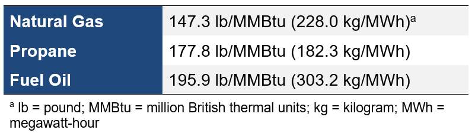
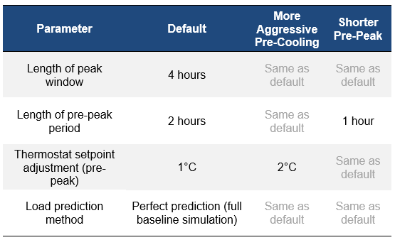

# Thermostat Control for Load Shifting in Large Offices
{: .fw-500 }

Authors:  Jie Xiong and Janghyun Kim

# Executive Summary

Building on the successfully completed effort to calibrate and validate the U.S. Department of Energy's ResStock™ and ComStock™ models over the past several years, the objective of this work is to produce national data sets that empower analysts working for federal, state, utility, city, and manufacturer stakeholders to answer a broad range of analysis questions.

The goal of this work is to develop energy efficiency, electrification, and demand flexibility end-use load shapes (electricity, gas, propane, or fuel oil) that cover a majority of the high-impact, market-ready (or nearly market-ready) measures. "Measures" refers to energy efficiency, electrification, and demand flexibility variables that can be applied to buildings during modeling.

An *end-use savings shape* is the difference in energy consumption between a baseline building and a building with an energy efficiency, electrification, or demand flexibility measure applied. It results in a time-series profile that is broken down by end use and fuel (electricity or on-site gas, propane, or fuel oil use) at each time step.

ComStock is a highly granular, bottom-up model that uses multiple data sources, statistical sampling methods, and advanced building energy simulations to estimate the annual subhourly energy consumption of the commercial building stock across the United States. The baseline model intends to represent the U.S. commercial building stock as it existed in 2018. The methodology and results of the baseline model are discussed in the final technical report of the [End-Use Load Profiles] project.

This documentation focuses on a single end-use savings shape measure---thermostat control for load shifting.

The thermostat control for load shifting measure applies heating and cooling temperature setpoint adjustment for pre-conditioning before the peak window. The measure takes daily peak load schedule inputs generated by the method "Dispatch Schedule Generation" described in the "Supplemental Documentation: Dispatch Schedule Generation for Demand Flexibility Measures" to determine the start time of the peak window, and then adjusts the thermostat cooling or heating setpoints by a specified offset value from original schedules to precool or preheat the space for a specified length of time before the start of peak window, and thus shifts load in the peak window to the pre-conditioning period. The measure is flexible and allows users to adjust the heating and cooling offset values and length of pre-conditioning period, but for this study, the load shifting strategy is applied as pre-cooling only (adjusting only cooling setpoints). The default adjustment for cooling setpoints is set to -1°C, and the default duration of pre-cooling is 1 hour. This measure is applicable to large offices equipped with an electric HVAC system, which accounts for approximately 9.72% of the ComStock floor area. 

The thermostat control for load shifting measure demonstrates around 1% daily peak demand reduction (Figure 4 and Figure 5). It shows negligible total site energy savings (around 0.0 trillion British thermal units \[TBtu\]) for the U.S. commercial building stock modeled in ComStock (Figure 7), which are expected to be close to zero or slightly negative, as the objective of the measure is to provide demand flexibility by shifting peak load to pre-peak periods on a daily basis instead of improving energy efficiency, and so is the corresponding emission reduction.

On the other hand, the annual bill cost analysis also demonstrates negligible annual bill cost savings. The cost savings are mainly attributed to cost reduction from time-of-use rates or peak-demand-charge portion of utility rates, which are applicable to only small amount of buildings, but are balanced out by the cost increase from increased energy consumption resulting from load shift strategy. Therefore, future analysis needs closer look by limiting to comparing buildings with peak-demand-charges/time-of-use rates, and distinguishing between cost from energy use and cost savings from demand reduction, to understand savings potentials for those impactful buildings. Also, combining this load shift measure with energy storage techniques or envelope retrofit would represent more realistic application and result in greater bill cost saving opportunities.

In addition, providing the potential of switching to other objectives for the dispatch schedule, future work includes extending the scope of this measure to applying for carbon emission reduction, for more comprehensive analysis (refer to the "Supplemental Documentation: Dispatch Schedule Generation for Demand Flexibility Measures" for more details).

# Acknowledgments
The authors would like to acknowledge the valuable guidance and input provided by Matt Leach and Chioke Harris at the National Renewable Energy Laboratory.

# 1. Introduction

This documentation covers "Thermostat Control for Load Shifting" upgrade methodology and briefly discusses key results. Results can be accessed on the ComStock™ data lake at "[end-use-load-profiles-for-us-building-stock]" or via the Data Viewer at [comstock.nrel.gov].

| **Measure Title**      | Thermostat Control for Load Shifting in Large Offices                                                                                                                                                                                  |
| **Measure Definition** | The thermostat control for load shifting measure applies heating and cooling temperature setpoint adjustment for pre-conditioning before the peak window. The measure takes daily peak load schedule inputs generated by the method “Dispatch Schedule Generation” described in the “Supplemental Documentation: Dispatch Schedule Generation for Demand Flexibility Measures” to determine the start time of the peak window, and then adjusts the thermostat cooling or heating setpoints by a specified offset value from original schedules to precool or preheat the space for a specified length of time before the start of peak window, and thus shifts load in the peak window to the pre-conditioning period. The measure is flexible and allows users to adjust the heating and cooling offset values and length of pre-conditioning period, but for this study, the load shifting strategy is applied as pre-cooling only (adjusting only cooling setpoints). The default adjustment for cooling setpoints is set to -1°C, and the default duration of pre-cooling is 1 hour. |
| **Applicability**      | Large offices  with electric HVAC systems (either electric cooling only or both electric heating and cooling), accounting for about 9.72% of the floor area modeled in ComStock.                                                                     |
| **Not Applicable**     | Buildings that are not large offices or have no electric HVAC component.                                                                                           |
| **Release**            | 2024 Release 1: 2024/comstock_amy2018_release_1/  

# 2. Technology Summary

## 2.1. Grid-Interactive Efficient Buildings With Demand Flexibility on HVAC

Electricity consumers across the residential, commercial, and industrial sectors are increasingly interested in opportunities to reduce their electricity bills and carbon footprint. Simultaneously, utilities, system operators, and state decision makers are aiming to reduce costs, more effectively utilize existing grid assets, maintain power system reliability, and reach carbon reduction targets. At the intersection of the customer and utility perspectives, buildings and their associated loads offer opportunities to align the interests of consumers, system operators, and policy decision makers. Interactivity between buildings and the broader electricity system expands these opportunities, and is enabled by advancements in building control technologies, data availability, advanced metering, new tariff designs, and improved analytics for energy management. Collectively, these smart technologies for energy management are often referred to as grid-interactive efficient buildings (GEBs). GEBs utilize high-efficiency components to reduce electricity demand and increase the flexibility of specific building loads, responding to real-time signals or advanced calls for demand response, or targeting bill savings associated demand regulations such as time-of-use rates and rates with demand charges. By shedding and shifting building load, these GEBs can reduce electricity bills, the cost of operating the grid, and emissions, all while maintaining the comfort of building occupants. 

Many recent studies have been devoted to building control for grid services \[1\], \[2\], \[3\], \[4\], \[5\], \[6\], \[7\], \[8\], \[9\], \[10\]. There are five technical interventions or measures used in a building's demand profile modification in the literature \[11\], \[12\], \[13\], \[14\], \[15\], \[16\], \[17\]. The first, energy efficiency, refers to the techniques that help reduce the net demand during both on-peak and off-peak periods. The second technique is called peak shaving or load shedding, which indicates reducing the on-peak demand, i.e., when the demand in the power grid is high. The third method is load shifting, which means altering the demand profile to meet certain performance criteria, usually involving a reduction in on-peak demand and an offset by a load increase at a different time. The fourth method is renewable energy, which utilizes distributed energy resources to coincidently reduce on-peak demand. The last is modulation, which provides rapid adjustments to regulate frequency and voltage and ensure power quality. The existing methods that fall within these five categories can help reduce demand charges directly or indirectly. 

HVAC systems have an inherent ability to provide short-term energy flexibility without requiring massive changes and new investment. Temperature setbacks, pre-cooling, and pre-heating are efficient methods to improve building energy flexibility. In addition to the temperature dead band (the range of temperatures centered around the setpoint at which the thermostat does not alter its operation status), other building characteristics such as thermal mass and internal load are significant, as are climates. Meanwhile, flexibility approaches must balance the savings (e.g., bill savings) from peak load reduction and the risk of occupant discomfort. Temperature setbacks, precooling, and preheating are usually employed as the methods provide short-term peak load reduction, while thermal storage techniques (e.g., ice or water storage tanks) enable HVAC systems to serve as a longer-term temperature cushion.

## 2.2. Thermostat Control Strategies for Demand Flexibility

Zone temperature setpoint setback/setup and precooling/preheating, often using a "smart" internet-connected thermostat, are two common strategies used in HVAC systems to realize energy efficiency and demand flexibility strategies \[18\]. The U.S. Energy Information Administration reported that 11.7% of U.S. residential buildings had smart or internet-connected thermostats as of 2020 \[19\], and Chen \[20\] estimates that 28% of U.S. households deployed smart thermostats as of 2023. For temperature setpoint offset, peak period loads can be reduced if the thermal zone is a few degrees hotter in summer or cooler in winter than its normal thermostat setpoint. Precooling or preheating can help maintain comfortable conditions through the peak period when the setpoint is adjusted. The response time of electricity use reduction might not be consistently aligned with the setpoint change depending on the specific hardware logic of the HVAC equipment, but an ideal instant response is assumed in this study.

The *Grid-Interactive Efficient Buildings Technical Report Series* \[21\] rated smart thermostat technologies as high potential for GEBs, as they provide both load shedding and shifting capability, including management of complex scheduling and day-ahead service requests while optimizing operations to minimize impacts on customer comfort. The U.S. Department of Energy estimates about 10% utility bill savings with smart thermostats controlling most types of heating and cooling systems \[22\]. ENERGY STAR® smart thermostats save 8% of heating and cooling bills on average, accounting for both energy usage costs and demand charges \[23\], \[24\]. And applications of smart thermostat in low-income multifamily residential buildings have proven similar bill savings around 8% \[25\]. Various smart thermostat brands are in the market (Nest, Amazon, ecobee, etc.) for both commercial and residential customers, and ecobee reported up to 26% bill savings for their users in North America in 2021 \[26\].

HVAC control rules are specified in various standards, such as ASHRAE Standards 90.1, 189.1, and IECC Chapter 4. Advanced rule-based controllers that optimize energy efficiency have been described in ASHRAE Guideline 36 and ASHRAE RP-1455 \[27\]. Rule-based controllers are characterized by many tuning parameters that must be selected for each system and building and are often reset during seasonal transitions. More advanced controls such as model-predictive control for thermostat have shown 10% to 35% peak power reduction capability in commercial buildings \[28\]. A test of a model-predictive controlled chiller by Yang et al. \[29\] found energy savings as 2%, 17.1% and 17.3% for cooling, heating, and transition seasons, respectively.

Most of the thermostat control strategies in studies and reports focus on energy efficiency performance analysis, but the nature of achieving demand flexibility requires similar thermostat control, but with more considerations on load shape.

Utility companies and grid service providers are more engaged with thermostat control for demand flexibility through demand response programs. Smart thermostats are adopted as one of the major devices for direct-load controls, where utilities incentivize customers to yield control of their enrolled thermostats for notified peak periods predicted for the grid needs on a daily basis. There are various demand response programs managed by different utility companies across the United States, but the programs share similar strategies as taking control of the enrolled thermostats for setpoint setback by 4°F \[30\] during demand response events (also suggested by ASHRAE GEB Guide \[18\]), which usually last from two to four hours per event per day, with a certain upper limit number for a month or a season.

Several case studies or program reports from the utility market were summarized in a report from the National Rural Electric Cooperative Association \[31\]; the case studies are mostly for the residential building market but are still illustrative as relevant reference for quantifying the potential for commercial buildings. For example, Midstate Electric reported shedding 300 to 400 kilowatts of load per event on average in their pilot Peak Hour Rewards Program in 2017. There were 191 thermostats across Central Oregon enrolled in this program, and it determined 3-5 peak events for each month with a 2-hour peak window in the morning. Kansas City Power & Light (currently Evergy) has partnered with Nest to start the Rush Hour Rewards program in 2016, which achieved 29 megawatt deemed demand savings and 9.7 GWh of deemed energy savings over a three-year period via 23,000 Nest Learning Thermostats. The program allows a maximum of one event per day, four hours per event, three events per week, and 15 events throughout the summer season. Kansas City Power & Light estimates that customers participating in the program have attained 1.2 kW reduction on average per thermostat, which equates to 15% savings on cooling bills, 10%--12% savings on heating bills, and an average annual savings of \$131 to \$145 on their utility bill that is associated with a time-of-use rate.

In this measure, we do not limit the number of days (events) and fix the daily dispatch window for thermostat demand control, as we are targeting daily peak load reduction from the perspective of individual buildings, which is beneficial to building owners/managers/operators, and could provide insight of achievable demand flexibility in accord with grid needs from the end use (building) point of view.

# 3. ComStock Baseline Approach

This measure modifies the existing model thermostat setpoint schedules during daily peak demand windows (specifically pre-peak periods) only. For times outside of the event, the existing thermostat schedules in the model are unchanged. The details of the thermostat schedule in the existing ComStock models can be found in Section 4.2 "Hours of Operation and Occupancy," which determines building hours of operation, and Section 4.8.7 "Thermostat Set Points," which describes how thermostat setpoints/setbacks are applied to the schedule, in the ComStock Reference Documentation \[32\].

# 4. Modeling Approach

## 4.1. Applicability

This measure is likely applicable to most commercial building types as it targets thermostat (schedule) control regardless of the details of HVAC system operations. Although in this study we narrow down the applicability to large office buildings only, we plan to expand the applicability in the future.

There were two reasons behind the decision of making large office the target building type. First is the initial feedback and decisions we got from stakeholders in the early phase of the Energy Efficiency and Demand Flexibility State Level Potential project. An informal survey of a state-level working group and the initial engagement of stakeholders both found that large offices are a building type of interest to state-level energy policy and incentive program staff seeking to support the implementation of measures and enable GEBs in their jurisdictions. Second is to secure some time for correcting/improving dispatch window generation method instead of planning time on testing/applying/debugging the measure on many more building types.

This measure is applicable to buildings with electric HVAC systems (either electric heating, electric cooling, or both), as demand flexibility control is applicable to buildings and/or equipment associated with the electric grid. Correspondingly, this measure will only affect electric HVAC equipment present in a building---e.g., it will not apply changes to the heating setpoints of the thermostat if the building does not have electric heating equipment (e.g., if the building's heat is provided by a natural gas furnace).

Figure 1 shows the area percentage of large office buildings among all the commercial building types in ComStock and the floor area percentage of applicable buildings with electric HVAC systems (cooling only or both heating and cooling) for each building type. All large office buildings are applicable to this measure; 33.3% of large office floor area has both electric heating and cooling systems and the remaining 66.7% of the floor area has only electric cooling. In terms of building counts, this applicability corresponds to 3158 large office building model samples which then extend to 19212 large office buildings (with weighting factors applied) for representing the counts in national level.

Figure 1. Prevalence of building types and applicability for each building type

## 4.2. Technology Specifics

### 4.2.1. Thermostat Setpoint Schedule Generation

By applying the method "Dispatch Schedule Generation" described in the "Supplemental Documentation: Dispatch Schedule Generation for Demand Flexibility Measures" on the ComStock [webpage], a daily peak load schedule will be generated and used as the input for this measure. This measure will clone the existing schedules that are used for cooling and heating (if applicable with electric heating) setpoints for thermal zones. Then the schedules are adjusted by the specified setpoint adjustment values for the specified number of hours (pre-peak length) before the peak windows, which are determined by the input peak load schedule.

Compared to the baseline, the HVAC load is increased for the pre-conditioning period with adjusted setpoints, and decreased in peak window with pre-conditioned (initial) thermal conditions, and thus the load is shifted from the peak window to the pre-peak period.

The measure is flexible and allows users to adjust the heating and cooling offset values, as well as the length of pre-conditioning before the peak period, but for this study, the load shifting strategy is applied as pre-cooling only (adjusting only cooling setpoints), in order to avoid the conflict between decreased cooling setpoint and increased heating setpoint that causes a reverse deadband error for the thermostat (cooling setpoint lower than heating setpoint for the same thermostat). The default adjustment for cooling setpoints is set to -1°C, and the default duration of pre-cooling is 1 hour.

## 4.3. Greenhouse Gas Emissions

Three electricity grid scenarios are presented to compare the emissions of the ComStock baseline and the default thermostat control for the load shifting scenario. The choice of grid scenario will impact the grid emissions factors used in the simulation, which determines the corresponding emissions produced per kilowatt-hour. Two scenarios---Long-Run Marginal Emissions Rate (LRMER) High Renewable Energy (RE) Cost 15-Year and LRMER Low RE Cost 15-Year---use the Cambium data set, and the last uses the eGrid data set \[33\], \[34\]. All three scenarios vary the emissions factors geospatially to reflect the variation in grid resources used to produce electricity across the United States. The Cambium data sets also vary emissions factors seasonally and by time of day. This study does not imply a preference for any particular grid emissions scenario, but other analysis suggests that the choice of grid emissions scenario can impact results \[35\]. Emissions due to on-site combustion of fossil fuels use the emissions factors shown in Table 1, which are from Table 7.1.2(1) of draft American National Standards Institute/Residential Energy Services Network/International Code Council 301 \[36\]. To compare total emissions due to both on-site fossil fuel consumption and grid electricity generation, the emissions from a single electricity grid scenario should be combined with all three on-site fossil fuel emissions.

 Table 1. On-Site Fossil Fuel Emissions Factors 

## 4.4. Limitations and Concerns

There are many limitations and concerns for this measure that have been identified to date.

-   This measure is not similar to other upgrade measures where the upgrade implementation (hiring contractor, purchasing/installing equipment, etc.) is readily available in the market; our modeling is theoretical due to novelty in methodology rather than being grounded in a specific product type, although the barrier of implementation of the proposed method is low. In addition, the measure changes the operation of buildings but has limited impact on the hardware components or physical properties (assuming switching to smart thermostat has negligible impact on the existing HVAC system).

-   This measure relies on user-provided inputs of dispatch schedule, for which several options are developed and provided in the "Dispatch Schedule Generation" method. Different options yield to distinctive dispatch time windows: perfect match to daily peak load (perfect prediction), a mimic of advanced application with uncertainty (bin-sampling), representative of simple logic (outdoor air temperature-based prediction), or fixed dispatch schedules by season and region (fixed schedule). The differences in performance of different options, as well as the limitations and concerns of the dispatch window generation method described in the "Supplemental Documentation: Dispatch Schedule Generation for Demand Flexibility Measures" on the ComStock [webpage] also apply to the implementation of this measure. For example, the objective function of generating daily dispatch window could vary depending on measure, such as emission reduction or utility cost savings, but it (currently) is peak demand reduction (peak load savings). The input parameters of a selected dispatch schedule generation methods also play a significant role in the performance, such as temperature offset value and length of peak window, and the impact may vary depending on building properties and weather conditions. We applied simple parametric analysis on the input parameters to justify the selection of default values, but detailed fine tuning is needed for determination of best parameter set(s).

-   The measure is currently only applied for pre-cooling to avoid causing reverse setpoint deadband error for thermostats. To enable pre-cooling and pre-heating at the same time, an extra step is needed to compromise the setpoint adjustments when cooling and heating setpoints intersect, which will be realized in the future.

-   The current scope in terms of which building type we want to apply this measure to is limited to large offices, as discussed in Section 3.1. Different building types can have different operating hours, space temperature setpoints, and/or internal gains. We want to test and validate the new method rigorously before applying it to many other building types.

-   In this measure, we do not limit the number of days (events) and fix the duration of daily dispatch window for thermostat demand control, as we are targeting daily peak load reduction from the prospective of individual building instead of grid demand needs.

# 5. Output Variables

Table 2 includes a list of output variables that are calculated in ComStock. These variables are important in terms of understanding the differences between buildings with and without the thermostat control for load shifting measure applied.

Table 2. Output Variables Calculated from the Measure Application

| Variable Name                                         | Description                                                                          |
|-------------------------------------------------------|--------------------------------------------------------------------------------------|
| minimum_daily_peak_jan_kw                             | Minimum of daily electric peak loads (in kW) in January                              |
| minimum_daily_peak_feb_kw                             | Minimum of daily electric peak loads (in kW) in February                             |
| minimum_daily_peak_mar_kw                             | Minimum of daily electric peak loads (in kW) in March                                |
| minimum_daily_peak_apr_kw                             | Minimum of daily electric peak loads (in kW) in April                                |
| minimum_daily_peak_may_kw                             | Minimum of daily electric peak loads (in kW) in May                                  |
| minimum_daily_peak_jun_kw                             | Minimum of daily electric peak loads (in kW) in June                                 |
| minimum_daily_peak_jul_kw                             | Minimum of daily electric peak loads (in kW) in July                                 |
| minimum_daily_peak_aug_kw                             | Minimum of daily electric peak loads (in kW) in August                               |
| minimum_daily_peak_sep_kw                             | Minimum of daily electric peak loads (in kW) in September                            |
| minimum_daily_peak_oct_kw                             | Minimum of daily electric peak loads (in kW) in October                              |
| minimum_daily_peak_nov_kw                             | Minimum of daily electric peak loads (in kW) in November                             |
| minimum_daily_peak_dec_kw                             | Minimum of daily electric peak loads (in kW) in December                             |
| maximum_daily_peak_jan_kw                             | Maximum of daily electric peak loads (in kW) in January                              |
| maximum_daily_peak_feb_kw                             | Maximum of daily electric peak loads (in kW) in February                             |
| maximum_daily_peak_mar_kw                             | Maximum of daily electric peak loads (in kW) in March                                |
| maximum_daily_peak_apr_kw                             | Maximum of daily electric peak loads (in kW) in April                                |
| maximum_daily_peak_may_kw                             | Maximum of daily electric peak loads (in kW) in May                                  |
| maximum_daily_peak_jun_kw                             | Maximum of daily electric peak loads (in kW) in June                                 |
| maximum_daily_peak_jul_kw                             | Maximum of daily electric peak loads (in kW) in July                                 |
| maximum_daily_peak_aug_kw                             | Maximum of daily electric peak loads (in kW) in August                               |
| maximum_daily_peak_sep_kw                             | Maximum of daily electric peak loads (in kW) in September                            |
| maximum_daily_peak_oct_kw                             | Maximum of daily electric peak loads (in kW) in October                              |
| maximum_daily_peak_nov_kw                             | Maximum of daily electric peak loads (in kW) in November                             |
| maximum_daily_peak_dec_kw                             | Maximum of daily electric peak loads (in kW) in December                             |
| median_daily_peak_jan_kw                              | Median of daily electric peak loads (in kW) in January                               |
| median_daily_peak_feb_kw                              | Median of daily electric peak loads (in kW) in February                              |
| median_daily_peak_mar_kw                              | Median of daily electric peak loads (in kW) in March                                 |
| median_daily_peak_apr_kw                              | Median of daily electric peak loads (in kW) in April                                 |
| median_daily_peak_may_kw                              | Median of daily electric peak loads (in kW) in May                                   |
| median_daily_peak_jun_kw                              | Median of daily electric peak loads (in kW) in June                                  |
| median_daily_peak_jul_kw                              | Median of daily electric peak loads (in kW) in July                                  |
| median_daily_peak_aug_kw                              | Median of daily electric peak loads (in kW) in August                                |
| median_daily_peak_sep_kw                              | Median of daily electric peak loads (in kW) in September                             |
| median_daily_peak_oct_kw                              | Median of daily electric peak loads (in kW) in October                               |
| median_daily_peak_nov_kw                              | Median of daily electric peak loads (in kW) in November                              |
| median_daily_peak_dec_kw                              | Median of daily electric peak loads (in kW) in December                              |
| q_1_daily_peak_jan_kw                                 | First quartile of daily electric peak loads (in kW) in January                       |
| q_1_daily_peak_feb_kw                                 | First quartile of daily electric peak loads (in kW) in February                      |
| q_1_daily_peak_mar_kw                                 | First quartile of daily electric peak loads (in kW) in March                         |
| q_1_daily_peak_apr_kw                                 | First quartile of daily electric peak loads (in kW) in April                         |
| q_1_daily_peak_may_kw                                 | First quartile of daily electric peak loads (in kW) in May                           |
| q_1_daily_peak_jun_kw                                 | First quartile of daily electric peak loads (in kW) in June                          |
| q_1_daily_peak_jul_kw                                 | First quartile of daily electric peak loads (in kW) in July                          |
| q_1_daily_peak_aug_kw                                 | First quartile of daily electric peak loads (in kW) in August                        |
| q_1_daily_peak_sep_kw                                 | First quartile of daily electric peak loads (in kW) in September                     |
| q_1_daily_peak_oct_kw                                 | First quartile of daily electric peak loads (in kW) in October                       |
| q_1_daily_peak_nov_kw                                 | First quartile of daily electric peak loads (in kW) in November                      |
| q_1_daily_peak_dec_kw                                 | First quartile of daily electric peak loads (in kW) in December                      |
| q_3_daily_peak_jan_kw                                 | Third quartile of daily electric peak loads (in kW) in January                       |
| q_3_daily_peak_feb_kw                                 | Third quartile of daily electric peak loads (in kW) in February                      |
| q_3_daily_peak_mar_kw                                 | Third quartile of daily electric peak loads (in kW) in March                         |
| q_3_daily_peak_apr_kw                                 | Third quartile of daily electric peak loads (in kW) in April                         |
| q_3_daily_peak_may_kw                                 | Third quartile of daily electric peak loads (in kW) in May                           |
| q_3_daily_peak_jun_kw                                 | Third quartile of daily electric peak loads (in kW) in June                          |
| q_3_daily_peak_jul_kw                                 | Third quartile of daily electric peak loads (in kW) in July                          |
| q_3_daily_peak_aug_kw                                 | Third quartile of daily electric peak loads (in kW) in August                        |
| q_3_daily_peak_sep_kw                                 | Third quartile of daily electric peak loads (in kW) in September                     |
| q_3_daily_peak_oct_kw                                 | Third quartile of daily electric peak loads (in kW) in October                       |
| q_3_daily_peak_nov_kw                                 | Third quartile of daily electric peak loads (in kW) in November                      |
| q_3_daily_peak_dec_kw                                 | Third quartile of daily electric peak loads (in kW) in December                      |
| median_daily_peak_timing_jan_hour                     | Median hour of daily electric peak loads in January                                  |
| median_daily_peak_timing_feb_hour                     | Median hour of daily electric peak loads in February                                 |
| median_daily_peak_timing_mar_hour                     | Median hour of daily electric peak loads in March                                    |
| median_daily_peak_timing_apr_hour                     | Median hour of daily electric peak loads in April                                    |
| median_daily_peak_timing_may_hour                     | Median hour of daily electric peak loads in May                                      |
| median_daily_peak_timing_jun_hour                     | Median hour of daily electric peak loads in June                                     |
| median_daily_peak_timing_jul_hour                     | Median hour of daily electric peak loads in July                                     |
| median_daily_peak_timing_aug_hour                     | Median hour of daily electric peak loads in August                                   |
| median_daily_peak_timing_sep_hour                     | Median hour of daily electric peak loads in September                                |
| median_daily_peak_timing_oct_hour                     | Median hour of daily electric peak loads in October                                  |
| median_daily_peak_timing_nov_hour                     | Median hour of daily electric peak loads in November                                 |
| median_daily_peak_timing_dec_hour                     | Median hour of daily electric peak loads in December                                 |
| total_electricity_use_jan_kwh                         | Total electricity energy consumption in January                                      |
| total_electricity_use_feb_kwh                         | Total electricity energy consumption in February                                     |
| total_electricity_use_mar_kwh                         | Total electricity energy consumption in March                                        |
| total_electricity_use_apr_kwh                         | Total electricity energy consumption in April                                        |
| total_electricity_use_may_kwh                         | Total electricity energy consumption in May                                          |
| total_electricity_use_jun_kwh                         | Total electricity energy consumption in June                                         |
| total_electricity_use_jul_kwh                         | Total electricity energy consumption in July                                         |
| total_electricity_use_aug_kwh                         | Total electricity energy consumption in August                                       |
| total_electricity_use_sep_kwh                         | Total electricity energy consumption in September                                    |
| total_electricity_use_oct_kwh                         | Total electricity energy consumption in October                                      |
| total_electricity_use_nov_kwh                         | Total electricity energy consumption in November                                     |
| total_electricity_use_dec_kwh                         | Total electricity energy consumption in December                                     |
| average_of_top_ten_highest_peaks_timing_shoulder_hour | Average hour of top 10 highest daily electric peak loads during shoulder season      |
| average_of_top_ten_highest_peaks_timing_summer_hour   | Average hour from top 10 highest daily electric peak loads during summer season      |
| average_of_top_ten_highest_peaks_timing_winter_hour   | Average hour from top 10 highest daily electric peak loads during winter season      |
| average_of_top_ten_highest_peaks_use_shoulder_kw      | Average peak load of top 10 highest daily electric peak loads during shoulder season |
| average_of_top_ten_highest_peaks_use_summer_kw        | Average peak load of top 10 highest daily electric peak loads during summer season   |
| average_of_top_ten_highest_peaks_use_winter_kw        | Average peak load of top 10 highest daily electric peak loads during winter season   |
| annual_peak_electric_demand_kw                        | Building annual peak electric demand                                                 |

# 6. Results

In this section, results are presented both at the stock level and for individual buildings through savings distributions. Stock-level results include the combined impact of all the analyzed buildings in ComStock, including buildings that are not applicable to this measure. Therefore they do not necessarily represent the energy savings of a particular or average building. Stock-level results should not be interpreted as the savings that a building might realize by implementing the measure.

Total site energy savings are also presented in this section. Total site energy savings can be a useful metric, especially for quality assurance/quality control, but this metric on its own can have limitations for drawing conclusions. Further context should be considered, as site energy savings alone do not necessarily translate proportionally to savings for a particular fuel type (e.g., gas or electricity), source energy savings, cost savings, or greenhouse gas savings. This is especially important when a measure impacts multiple fuel types or causes decreased consumption of one fuel type and increased consumption of another. Many factors should be considered when analyzing the impact of an energy efficiency or electrification strategy, depending on the use case.

## 6.1. Single Building Measure Tests

Several single building measure tests are performed to demonstrate the implementation of the developed measure, as shown in the following sections. Specifically, a large office building model with electric cooling HVAC systems is applied as the baseline sample model, with multiple weather files that represent different climate characteristics to evaluate performances.

The default and alternative sets of input parameters are summarized in Table 3. Parametric analysis is performed using these input parameter sets (scenarios) to investigate the impact of thermostat setpoint adjustment magnitude and pre-peak window length on peak load reduction performance.

Table 3. Default and Compared Options for Measure Parameters

Figure 2 shows the load profiles for three consecutive days (8/7--8/9) from several simulations corresponding to different scenarios for comparison. Comparison between the baseline profile and the load shift events (appearing as peaks followed by valleys) in the default load shift profile illustrate the timing of the pre-peak period and the peak window each day. Figure 2 shows that even with the default parameter set, there is still a chance of generating a new higher peak load in the pre-cooling period (shown on 8/8), and this chance increases with the more aggressive pre-cooling scenario. The shorter pre-peak scenario could yield a higher chance of creating a new peak because the pre-cooling starts closer to the original peak, when the initial cooling load is higher, compared to the default scenario.

Figure 2. Daily load profile comparison for baseline and different scenarios

## 6.2. Demand Flexibility Performance

This section includes additional and more detailed findings specific to the demand flexibility measure that are not covered in the previous sections. As the measure aims to reduce daily building peak load, we extract the daily peak load data from the simulation results. More specifically, 3158 large office building models (i.e., 19212 buildings with weighting factor applied) applicable to this measure record 365 daily peaks across the simulation year. For each month (e.g., January), there are certain number of daily peaks (e.g., 31 daily peak values) available to investigate. To balance the granularity of daily peak data and the visualization level of performance analysis, five quartile statistics (minimum, 25th percentile, median, 75th percentile, and maximum) of daily peak values in each month are calculated for all applicable models to represent the monthly performance of the applied upgrade. These statistics are further illustrated in a boxplot distribution for stock-level summary.

### 6.2.1. Justification of Default Parameters

Figure 3 shows the distribution of median daily peak load reduction percentages in each month compared to the baseline model for different scenarios (Table 3), to investigate the impact of shorter pre-peak window length and larger thermostat setpoint adjustment. The results are derived from a ComStock test run with 10,000 building model samples (among which 90 large offices are applicable), due to the limitation of computational resources required for full sample run (350,000 samples). From the figure we can conclude that:

-   Different parameter sets outperform others or perform similarly for any given month, depending on the compatibility of weather characteristics and the parameter set.

-   The aggressive pre-cooling parameter set generally leads to larger variance in peak reduction performance with more load shift potential but also higher risk of new increased daily peak load.

-   Shorter pre-peak increases the risk of new increased daily peak load.

Figure 3. Distribution of reduction percentage of median daily peak load compared to the baseline model by month for measure with default and comparative scenarios

Based on the comparison, the performance of default setting of the measure is determined to be the overall best in terms of peak reduction potential and performance robustness.

### 6.2.2. Monthly Quartile Statistics Distribution of Daily Peak Reduction

Figure 4 and Figure 5 show the percentage distributions of median and maximum daily peak load reductions, respectively, by month for the default scenario compared to the baseline model.

Figure 4. Distribution of the percentage of median daily peak load reduction by month compared to the baseline model for the default scenario

Figure 5. Distribution of the percentage of maximum daily peak load reduction by month compared to the baseline model for the default scenario

Both distributions of the statistics share a similar trend that a daily peak load reduction is not guaranteed with the upgrade, but there is an overall positive monthly reduction especially for cooling seasons. The non-negligible portion of the stock with negative peak reductions is mainly due to the variability in peak load increases from pre-cooling. Building loads that are sensitive to setpoint change for pre-conditioning would require smaller setpoint adjustments and longer pre-conditioning lengths to avoid generating higher peak load in the pre-peak period than the original (unshifted) peak. Therefore, load shifting parameters need to be tuned for specific building models.

There is no obvious correlation between heating system (fuel) type (electric or non-electric heating) and the measure performance.

### 6.2.3. Annual Bill Savings

Figure 6 shows the distribution of annual bill savings for the default upgrade with respect to the maximum, mean, and median bill cost among all the considered utility rate structures (for more information related to bill costs, refer to the utility bills section in Section 5 of the ComStock Reference Documentation \[37\]). To provide high level context of the bill calculation, each building model with locational information is used to find all utility rate structures (from Utility Rate Database \[38\]) applicable/available for the building. After calculating annual utility bill costs for all applicable utility rates, we report statistics (min, mean, median, and max) of all utility bill costs for each of the building model. All the comparisons show negative bill savings of around 0% (less than 1%). Unlike the load shedding measure, this load shifting measure will likely have zero net energy savings or increased energy consumption (explained in Section 5.3), so there is no or negative potential for bill savings from energy use reductions. Any bill savings are primarily from:

1)  Time-of-use rates that have matched time of peak prices with the peak windows on a monthly average (there could be negative savings for time-of-use rates that have peak prices outside of the daily peak window identified by this measure).

2)  Applicable monthly or seasonal demand charge reduction.

These savings are compromised by the increased cost due to increased energy consumption and thus show overall close to zero savings. However, these savings underestimate the benefits from a measure targeting daily peak load reduction, as most rate structures consider peak demand charge on a monthly or seasonal basis, while demand response programs or rate structures including demand response incentives that favor daily demand flexibility control are currently not able to be directly integrated into ComStock analysis workflow.

Figure 6. Distribution of annual bill savings compared to the baseline model for mean, and median bill, separated by buildings with electric and non-electric heating

## 6.3. Stock Energy Impacts

The thermostat control for load shedding measure with perfect load prediction method that is applicable to large offices---9.72% of the total building stock floor area---demonstrates -0.023% total site energy savings (-1 trillion British thermal units \[TBtu\]) for the U.S. commercial building stock modeled in ComStock, as shown in Figure 7.

Figure 7. Comparison of annual site energy consumption between the ComStock baseline and the thermostat control for load shedding measure default scenario, for the whole stock (left) and applicable large offices only (right)

The savings are primarily attributed to:

-   **-0.01%** stock **natural gas heating** savings (-0.1 TBtu)

-   **-0.03%** stock **cooling electricity** savings (-0.2 TBtu)

-   **-0.05%** stock **fan** savings (-0.3 TBtu).

    The measure focuses on load shift for electric HVAC systems in large offices only, so energy savings are not expected at the stock level. As described in Section 3, the load shifting strategy adds load in the pre-peak period and decreases load in the peak window, and the difference between the increase and decrease is uncertain and dependent on various conditions (e.g., weather, building, and HVAC system characteristics, and disturbances from internal loads). The ideal scenario of applying a load shift strategy is to achieve an even balance between load increase and decrease. The objective of the measure is to provide demand flexibility by shifting load to mitigate daily peak demand instead of improving energy efficiency, so the negligible change in energy use meets expectations. However, the developed load shifting measure is not exclusive of other energy efficiency measures; it could be integrated with them to provide demand flexibility while saving energy.

## 6.4. Stock Greenhouse Gas Emissions Impact

Figure 8 shows the annual stock-level impact of the measure on greenhouse gas emissions and presents approximately 0% emission reductions for all the three grid electricity scenarios. This is as expected due to the small energy savings.

Figure 8. Greenhouse gas emissions comparison of the ComStock baseline and the thermostat control for load shedding measure default scenario

## 6.5. Site Energy Savings Distributions

Figure 9 and Figure 10 show the percent site energy and end-use intensity (EUI) savings distributions by end use and climate zones, respectively. Percent savings provide relative impact of the measure at the individual building level while site EUI savings provide absolute (or aggregated) scale of impact. Also, the data points that appear above some of the distributions indicate outliers in the distribution, meaning they fall outside 1.5 times the interquartile range. The value for n indicates the number of ComStock models that were applicable for energy savings for the fuel type category.

Figure 9. Percent site energy (left) and EUI (right) savings distribution for ComStock models with the thermostat control for load shedding upgrade by end use

Figure 10. Percent site energy (left) and EUI (right) savings distribution for ComStock models with the thermostat control for load shedding upgrade by ASHRAE climate zone

Similar to the stock-level energy savings findings in Section 5.3, most of the savings are neutral or slightly negative for both energy and EUI. Highlights of savings presented in the figures include:

-   Both figures show relatively larger energy impact compared to the EUI savings (Figure 3), indicating that the measure plays a more significant role in energy performance at the building level, but the savings are not significant once adjusted for building floor area.

-   Hotter climates (smaller climate zone number) yield increased energy use (more negative savings), indicating higher potential of generating new peak load in pre-cooling period with higher outdoor temperatures.

# 7. References

\[1\] H. Wang, S. Wang, and K. Shan, "Experimental study on the dynamics, quality and impacts of using variable-speed pumps in buildings for frequency regulation of smart power grids," *Energy*, vol. 199, p. 117406, May 2020, doi: 10.1016/j.energy.2020.117406.

\[2\] E. M. Burger and S. J. Moura, "Generation following with thermostatically controlled loads via alternating direction method of multipliers sharing algorithm," *Electric Power Systems Research*, vol. 146, pp. 141--160, May 2017, doi: 10.1016/j.epsr.2016.12.001.

\[3\] D. Wu, J. Lian, Y. Sun, T. Yang, and J. Hansen, "Hierarchical control framework for integrated coordination between distributed energy resources and demand response," *Electric Power Systems Research*, vol. 150, pp. 45--54, Sep. 2017, doi: 10.1016/j.epsr.2017.05.002.

\[4\] M. Olama, T. Kuruganti, J. Nutaro, and J. Dong, "Coordination and Control of Building HVAC Systems to Provide Frequency Regulation to the Electric Grid," *Energies*, vol. 11, no. 7, p. 1852, Jul. 2018, doi: 10.3390/en11071852.

\[5\] K. Wang, R. Yin, L. Yao, J. Yao, T. Yong, and N. Deforest, "A Two-Layer Framework for Quantifying Demand Response Flexibility at Bulk Supply Points," *IEEE Trans. Smart Grid*, vol. 9, no. 4, pp. 3616--3627, Jul. 2018, doi: 10.1109/TSG.2016.2636873.

\[6\] H. Hao, B. M. Sanandaji, K. Poolla, and T. L. Vincent, "Aggregate Flexibility of Thermostatically Controlled Loads," *IEEE Trans. Power Syst.*, vol. 30, no. 1, pp. 189--198, Jan. 2015, doi: 10.1109/TPWRS.2014.2328865.

\[7\] W. Zhang, J. Lian, C.-Y. Chang, and K. Kalsi, "Aggregated Modeling and Control of Air Conditioning Loads for Demand Response," *IEEE Trans. Power Syst.*, vol. 28, no. 4, pp. 4655--4664, Nov. 2013, doi: 10.1109/TPWRS.2013.2266121.

\[8\] D. Zhang, S. Li, M. Sun, and Z. O'Neill, "An Optimal and Learning-Based Demand Response and Home Energy Management System," *IEEE Trans. Smart Grid*, vol. 7, no. 4, pp. 1790--1801, Jul. 2016, doi: 10.1109/TSG.2016.2552169.

\[9\] H. Hao, D. Wu, J. Lian, and T. Yang, "Optimal Coordination of Building Loads and Energy Storage for Power Grid and End User Services," *IEEE Trans. Smart Grid*, vol. 9, no. 5, pp. 4335--4345, Sep. 2018, doi: 10.1109/TSG.2017.2655083.

\[10\] M. Liu and Y. Shi, "Model Predictive Control of Aggregated Heterogeneous Second-Order Thermostatically Controlled Loads for Ancillary Services," *IEEE Trans. Power Syst.*, vol. 31, no. 3, pp. 1963--1971, May 2016, doi: 10.1109/TPWRS.2015.2457428.

\[11\] M. Di Somma *et al.*, "Multi-objective design optimization of distributed energy systems through cost and exergy assessments," *Applied Energy*, vol. 204, pp. 1299--1316, Oct. 2017, doi: 10.1016/j.apenergy.2017.03.105.

\[12\] J. Neubauer and M. Simpson, "Deployment of Behind-The-Meter Energy Storage for Demand Charge Reduction," NREL/TP\--5400-63162, 1168774, Jan. 2015. doi: 10.2172/1168774.

\[13\] K. Klein, S. Herkel, H.-M. Henning, and C. Felsmann, "Load shifting using the heating and cooling system of an office building: Quantitative potential evaluation for different flexibility and storage options," *Applied Energy*, vol. 203, pp. 917--937, Oct. 2017, doi: 10.1016/j.apenergy.2017.06.073.

\[14\] S. H. Kim, "Building demand-side control using thermal energy storage under uncertainty: An adaptive Multiple Model-based Predictive Control (MMPC) approach," *Building and Environment*, vol. 67, pp. 111--128, Sep. 2013, doi: 10.1016/j.buildenv.2013.05.005.

\[15\] S. B. Sadineni and R. F. Boehm, "Measurements and simulations for peak electrical load reduction in cooling dominated climate," *Energy*, vol. 37, no. 1, pp. 689--697, Jan. 2012, doi: 10.1016/j.energy.2011.10.026.

\[16\] M. Di Somma, G. Graditi, E. Heydarian-Forushani, M. Shafie-khah, and P. Siano, "Stochastic optimal scheduling of distributed energy resources with renewables considering economic and environmental aspects," *Renewable Energy*, vol. 116, pp. 272--287, Feb. 2018, doi: 10.1016/j.renene.2017.09.074.

\[17\] J. Yao, X. Liu, W. He, and A. Rahman, "Dynamic Control of Electricity Cost with Power Demand Smoothing and Peak Shaving for Distributed Internet Data Centers," in *2012 IEEE 32nd International Conference on Distributed Computing Systems*, Macau, China: IEEE, Jun. 2012, pp. 416--424. doi: 10.1109/ICDCS.2012.67.

\[18\] A. T. F. for B. Decarbonization and K. Carbonnier, *Grid-interactive Buildings for Decarbonization: Design and Operation Resource Guide*. ASHRAE, 2023. \[Online\]. Available: https://books.google.com/books?id=Je0m0AEACAAJ

\[19\] U.S. Energy Information Administration, "2020 Residential Energy Consumption Survey (RECS)." \[Online\]. Available: https://www.eia.gov/consumption/residential/

\[20\] O. Chen, "Connected Devices Are Driving a More Grid-Responsive Home." Accessed: Mar. 17, 2024. \[Online\]. Available: https://www.greentechmedia.com/articles/read/connected-devices-driving-a-more-grid-responsive-home

\[21\] B. Goetzler, M. Guernsey, and T. Kassuga, "Grid-interactive Efficient Buildings Technical Report Series: Heating, Ventilation, and Air Conditioning (HVAC); Water Heating; Appliances; and Refrigeration".

\[22\] "Programmable Thermostats \| Energy Saver." Accessed: Mar. 16, 2024. \[Online\]. Available: https://www.energy.gov/energysaver/programmable-thermostats

\[23\] "Smart Thermostats Key Product Criteria \| ENERGY STAR." Accessed: Mar. 16, 2024. \[Online\]. Available: https://www.energystar.gov/products/smart_thermostats/key_product_criteria

\[24\] "ENERGY EFFICIENCY PROGRAM SPONSOR FREQUENTLY ASKED QUESTIONS ABOUT ENERGY STAR SMART THERMOSTATS".

\[25\] J. Berger, "Thermostat Behavior and Responses to Smart Thermostat Installation," presented at the The Behavior, Energy & Climate Change (BECC) conference, 2020. \[Online\]. Available: https://beccconference.org/wp-content/uploads/2020/11/Berger-Thermostat-Behavior-and-Responses-to-Smart-Thermostat-Installation\_\_notes.pdf

\[26\] "Energy Savings \| Ecobee." Accessed: Mar. 16, 2024. \[Online\]. Available: https://www.ecobee.com/en-us/savings/

\[27\] S. T. Taylor, "Resetting setpoints using trim & respond logic," *Ashrae Journal*, vol. 57, no. 11, pp. 52--57, 2015.

\[28\] S. C. Bengea, A. D. Kelman, F. Borrelli, R. Taylor, and S. Narayanan, "Implementation of model predictive control for an HVAC system in a mid-size commercial building," *HVAC&R Research*, vol. 20, no. 1, pp. 121--135, Jan. 2014, doi: 10.1080/10789669.2013.834781.

\[29\] L. Yang, Y. Kuang, Y. Yuan, J. Ding, and Y. Zhu, "Integrated Platform for Whole Building HVAC System Automation and Simulation," 2018.

\[30\] Office of ENERGY EFFICIENCY & RENEWABLE ENERGY (EERE), "Residential Demand Response." 2021. \[Online\]. Available: https://www.energycodes.gov/sites/default/files/2021-10/Residential_Demand_Response.pdf

\[31\] A. Wirtshafter and J. Peters, "Do Smart Thermostats Make for Smart Demand Response Programs?," 2018.

\[32\] A. Parker *et al.*, "ComStock Reference Documentation (V.1)," NREL/TP\--5500-83819, 1967948, MainId:84592, Mar. 2023. doi: 10.2172/1967948.

\[33\] NREL, "Cambium \| Energy Analysis." \[Online\]. Available: https://www.nrel.gov/analysis/cambium.html

\[34\] US EPA, "Emissions & Generation Resource Integrated Database (eGRID)." \[Online\]. Available: https://www.epa.gov/egrid

\[35\] E. Present, P. Gagnon, E. J. H. Wilson, N. Merket, P. R. White, and S. Horowitz, "Choosing the Best Carbon Factor for the Job: Exploring Available Carbon Emissions Factors and the Impact of Factor Selection," Aug. 2022, \[Online\]. Available: https://www.osti.gov/biblio/1891472

\[36\] G. Vijayakumar and others, "ANSI/RESNET/ICC 301-2022-Standard for the Calculation and Labeling of the Energy Performance of Dwelling and Sleeping Units using an Energy Rating Index," *Oceanside, CA*, 2022.

\[37\] *ComStock Reference Documentation \| Utility Bills*. \[Online\]. Available: https://github.com/NREL/ComStock/blob/main/documentation/reference_doc/5_outputs.tex\#L70-L108

\[38\] D. Zimny-Schmitt and J. Huggins, "Utility Rate Database (URDB)." National Renewable Energy Laboratory (NREL), Jun. 01, 2010. \[Online\]. Available: https://data.openei.org/submissions/

# A.  Additional Figures

Figure A-1. Site annual natural gas consumption of the ComStock baseline and the measure scenario by census division

Figure A-2. Site annual natural gas consumption of the ComStock baseline and the measure scenario by building type

Figure A-3. Site annual electricity consumption of the ComStock baseline and the measure scenario by building type

Figure A-4. Site annual electricity consumption of the ComStock baseline and the measure scenario by census division

  [End-Use Load Profiles]: https://www.nrel.gov/buildings/end-use-load-profiles.html
  [end-use-load-profiles-for-us-building-stock]: https://data.openei.org/s3_viewer?bucket=oedi-data-lake&prefix=nrel-pds-building-stock%2Fend-use-load-profiles-for-us-building-stock%2F2023%2F
  [comstock.nrel.gov]: https://comstock.nrel.gov/
  [A picture containing table Description automatically generated]: images\media\image1.png {width="6.5in" height="2.1798611111111112in"}
  [webpage]: https://nrel.github.io/ComStock.github.io/docs/upgrade_measures/upgrade_measures.html
