# Secondary Window System
{: .fw-500 }
Authors: Andrew Parker and Amy LeBar

# Executive Summary

Building on the successfully completed effort to calibrate and validate the U.S. Department of Energy's ResStock™ and ComStock™ models over the past three years, the objective of this work is to produce national data sets that empower analysts working for federal, state, utility, city, and manufacturer stakeholders to answer a broad range of analysis questions.

The goal of this work is to develop energy efficiency and demand flexibility end-use load shapes (electricity, gas, propane, or fuel oil) that cover a majority of the high-impact, market-ready (or nearly market-ready) measures. "Measures" refers to energy efficiency variables that can be applied to buildings during modeling.

An *end-use savings shape* is the difference in energy consumption between a baseline building and a building with an energy efficiency or demand flexibility measure applied. It results in a timeseries profile that is broken down by end use and fuel (electricity or on-site gas, propane, or fuel oil use) at each timestep.

ComStock is a highly granular, bottom-up model that uses multiple data sources, statistical sampling methods, and advanced building energy simulations to estimate the annual subhourly energy consumption of the commercial building stock across the United States. The baseline model intends to represent the U.S. commercial building stock as it existed in 2018. The methodology and results of the baseline model are discussed in the final technical report of the [End-Use Load Profiles](https://www.nrel.gov/buildings/end-use-load-profiles.html) project.

This documentation focuses on a single end-use savings shape measure---secondary window systems. This measure adds secondary windows to the inside of existing windows, decreasing the U-value, solar heat gain coefficient (SHGC), and visual light transmittance (VLT) by a specified amount. The measure is applicable to all windows in the ComStock baseline that are not triple pane, as these are already very high-performing windows. Altogether, the measure is applicable to over \>99% of the ComStock floor area, representing over 350 million m2 of window area replaced. Results show \~1% aggregate stock site energy savings (60 TBtu), primarily from heating, cooling, and fan end uses. <!-- Results also show greenhouse gas emission savings between 3 MMT and 4 MMT, depending on the electricity grid emission scenario considered.-->

# Acknowledgments

The authors would like to acknowledge the valuable guidance and input provided by the Lawrence Berkeley National Laboratory WINDOW software team.

# 1.  Introduction

This documentation covers secondary window systems upgrade methodology and briefly discusses key results. Results can be accessed on the ComStock data lake "[end-use-load-profiles-for-us-building-stock](https://data.openei.org/s3_viewer?bucket=oedi-data-lake&prefix=nrel-pds-building-stock%2Fend-use-load-profiles-for-us-building-stock%2F)" or via the Data Viewer at [comstock.nrel.gov](https://comstock.nrel.gov).

| **Measure Title**  | Secondary Window System                                                                                                            |
| **Measure Definition** | This measure adds secondary windows to the inside of existing windows, decreasing the U-value, SHGC, and VLT by a specified amount. |
| **Applicability**      | The measure is applicable to all single- and double-pane windows.                                                                   |
| **Not Applicable**     | The measure is not applicable to triple-pane windows.                                                                               |
| **Release**            | EUSS 2023 Release 1                                                                                                                 |

# 2.  Technology Summary

Secondary windows, also referred to as interior windows, storm windows, glazing retrofit systems, and by various manufacturer-specific names, are "retrofit products that enhance the performance of an existing window without a full replacement or reglazing. They can be added to existing windows with poor energy performance to mitigate air infiltration, energy loss, or unwanted solar gain, while also offering non-energy benefits to building occupants, thereby offering a lower cost alternative to window replacement." \[1\]

There are roughly 20 manufacturers who advertise secondary windows for commercial applications in the United States \[1\]. Manufacturer terminology varies, but a review of the publicly available information from all 20 manufacturers shows that the products come in several general configurations:

-   **Frame-within-frame or reveal** are windows with aluminum or vinyl frames that are attached to the existing window frame, with either exterior or interior (most common) application. In some cases, such as where the existing window frame is too shallow, the secondary window may be installed in the existing window reveal instead of inside the frame. Glass may be glass or acrylic, single- or double-pane, may have various coatings and gas fills (for double-pane), and may or may not have a thermal break in the frame. Secondary frames may be permanently attached or removable. This configuration has the most manufacturers.

-   **Glued to existing glass** are systems where the secondary glass is attached to spacers that are glued to the existing glass. They may have various coatings, and some products are designed for interior application while others are designed for exterior application. This approach appears to generally be targeted toward curtainwall applications, which are found on many newer buildings with a high window-to-wall ratio.

-   **Attached to existing frame** are systems where the secondary glass is in a thin frame that is attached to the existing window frame with glue or mechanical fasteners. Either exterior or interior (most common) application are possible. Glass may be glass or acrylic with various coatings.

These configurations are illustrated in Figure 1. One important note about this technology is that with most of the installation configurations, any thermal bridge through the existing frame is still present after installation. An exception is the frame-within-reveal configuration, which may include an air gap or spacer between the secondary and existing window frame. The most common configurations across manufacturers appear to be the frame-within-frame and frame-within-reveal configurations, which can often be covered by the same product.

{:refdef: style="text-align: center;"}
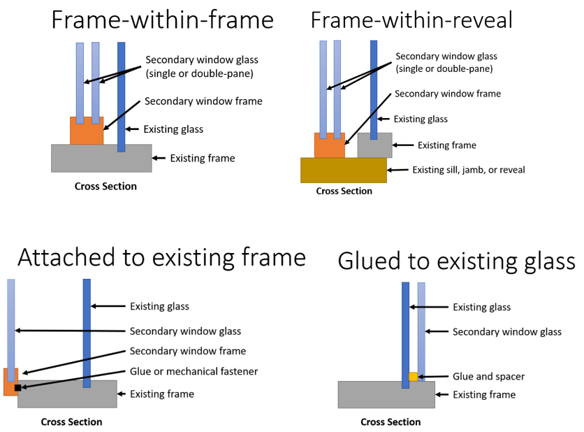
{:refdef}

{:refdef: style="text-align: center;"}
Figure 1. Secondary window system types
{:refdef}

## 2.1  Lab Testing and Field Studies

At least three independent field studies of this technology from three different manufacturers have been performed in a frame-within-reveal or frame-within-frame configuration. A 2013 General Services Administration (GSA) Green Proving Ground study installed the technology in a small office building in Provo, UT \[2\], a 2013 DOE-funded project installed the technology in part of a multi-story office building in Philadelphia, PA \[3\], and a 2021 GSA Green Proving Ground study installed the technology in an office subsection of a larger mixed-used office building in Denver, CO \[4\]. None of the field studies included whole-building, full-year measurement. In all three studies the technology generally performed as intended, lowering heating and cooling losses and increasing thermal comfort near the windows.

## 2.2  Performance Characteristics

Secondary windows are available from multiple manufacturers, many of whom can produce single- or double-pane products with different gas fills and optical coatings. In the two GSA field studies, modeling of the combined primary window plus the added secondary window assembly was performed using Lawrence Berkeley National Laboratory's (LBNL's) WINDOW and THERM software. Both studies showed good agreement between the modeled window performance and the data measured using a combination of infrared thermography and thermocouples. Table 1 summarizes the performance levels modeled in these studies. Note that because both studies used the frame-within-reveal configuration, the thermal bridging through the existing framing was less significant than it would be in frame-within-frame applications.

Table 1. Overall Assembly Performance Characteristics from Field Studies

|                         | **Provo, UT** | **Denver, CO (double-pane)** |
|-------------------------|---------------|----------------|
| **U-factor (Btu/h-ft2-°F)** | 0.27          | 0.23           |
| **SHGC**                    | 0.24          | 0.42           |
| **VT**                      | not stated    | 0.58           |

# 3.  ComStock Baseline Approach

## 3.1  Window Construction Type

Data from the National Fenestration Rating Council (NFRC) Commercial Fenestration Market Study was used to develop the modeling approach for windows in ComStock. This study, conducted by Guidehouse in collaboration with NFRC, characterized the national commercial window stock through data collection and analysis. Six primary data sources representing all regions of the United States were used in the study---a 2020 Guidehouse survey, Northwest Energy Efficiency Alliance (NEEA) commercial building stock assessment (CBSA), DOE Code Study, California End Use Survey (CAEUS), Commercial Buildings Energy Consumption Survey (CBECS), and Residential Energy Consumption Survey (RECS). A variety of window properties were collected, including the window-to-wall ratio, number of panes, frame material, glazing type, low-E coating, gas fill, SHGC, U-factor, and many others. In total, the database contained approximately 16,000 samples, each with an appropriate weighting factor based on the coverage, completeness, and fidelity of each data source. The window-to-wall ratio data was already incorporated into the ComStock baseline during the End-Use Load Profiles project. Some of the other key window properties, such as thermal performance, were then used to create the new baseline window constructions and distributions discussed later in this section. A summary of the data sources and their associated information is shown in Table 2.

Table 2. Window Property Data Sources

{:refdef: style="text-align: center;"}
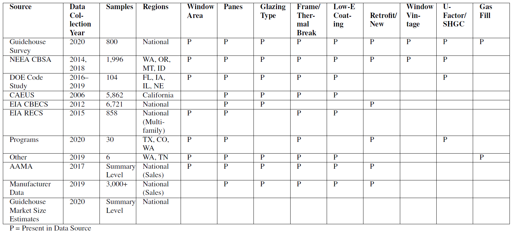
{:refdef}

{:refdef: style="text-align: center;"}
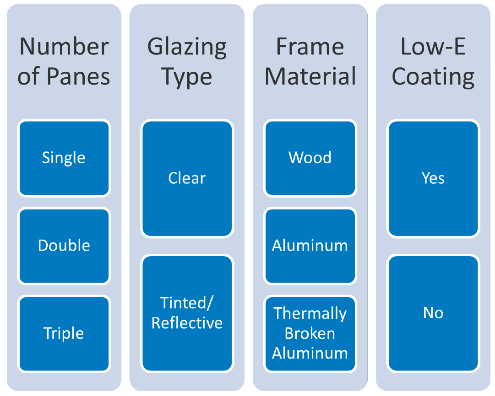{:width="500"}
{:refdef}

{:refdef: style="text-align: center;"}
Figure 2. Window characteristics
{:refdef}

Four window properties---number of panes, glazing type, frame material, and low-E coating---were used to create the baseline window configurations. These four parameters were selected based on which characteristics have the most impact on window performance, which have the most data available from the various data sources, and which inputs we trust from the average building owner or survey recipient. The options for each property are shown in Figure 2.

Modeling every combination of these four properties would result in 36 different window configurations, which would add significant complexity to the sampling process. Instead, we selected 12 combinations to be modeled, based on which combinations are most common and most realistic. There are four single-pane, six double-pane, and two triple-pane configurations. The unrealistic/uncommon combinations that were eliminated include:

-   Single pane with thermally broken aluminum frame

-   Single pane with low-E coating

-   Double pane with wood frame

-   Triple pane with no low-E coating

-   Triple pane without thermally broken aluminum frame

-   Thermally broken double or triple pane without low-E coating.

The 12 remaining window configurations are shown in Table 3.

Table 3. Window Configurations

| **Number of Panes** | **Glazing Type**  | **Frame Material**          | **Low-E Coating** |
|---------------------|-------------------|-----------------------------|-------------------|
| Single              | Clear             | Aluminum                    | No                |
| Single              | Tinted/Reflective | Aluminum                    | No                |
| Single              | Clear             | Wood                        | No                |
| Single              | Tinted/Reflective | Wood                        | No                |
| Double              | Clear             | Aluminum                    | No                |
| Double              | Tinted/Reflective | Aluminum                    | No                |
| Double              | Clear             | Aluminum                    | Yes               |
| Double              | Clear             | Aluminum With Thermal Break | Yes               |
| Double              | Tinted/Reflective | Aluminum                    | Yes               |
| Double              | Tinted/Reflective | Aluminum With Thermal Break | Yes               |
| Triple              | Clear             | Aluminum With Thermal Break | Yes               |
| Triple              | Tinted/Reflective | Aluminum With Thermal Break | Yes               |

We created a sampling distribution for the new window constructions for the entire country using the initial data set. Overall, single-pane windows make up approximately 54% of the stock, double-pane windows make up 46%, and triple-pane windows make up \<1%. Initially, we created distributions based on census division to incorporate geographic location into the sampling. Upon further analysis, we found that it was also necessary to incorporate the energy codes into distributions to prevent scenarios where a single-pane window was sampled for a certain location, but, according to the energy code for that location, a double-pane window was required. For this reason, we modified the sampling distribution to include two dependencies---climate_zone and energy_code_followed_during_last_window_replacement.

To generate these sampling distributions, we used the maximum U-values specified for each climate zone in each version of ASHRAE 90.1. For each combination of climate zone and energy code, the 12 window configurations were evaluated to determine which were both realistic and met code (i.e., had a U-value lower than the code maximum U-value). For the older energy codes, we made several assumptions about technology adoption to determine which window configurations were realistic:

-   Low-E coating---not adopted until DOE Ref 1980--2004

-   Thermally broken aluminum frame---not adopted until 90.1-2004

-   Triple pane---not adopted until 90.1-2004.

Each combination of climate zone and energy code included 2--12 window configurations that met the criteria. After limiting the distributions to these configurations, we renormalized the percentages from the national distribution to 100%. This kept the percentages from the national distribution while also incorporating intelligent assumptions based on climate zone and energy code. Table 4 provides an example of the window configurations that were sampled for each code year in climate zone 4A.

Table 4. Window Distribution Assumptions Example From Climate Zone 4A

{:refdef: style="text-align: center;"}
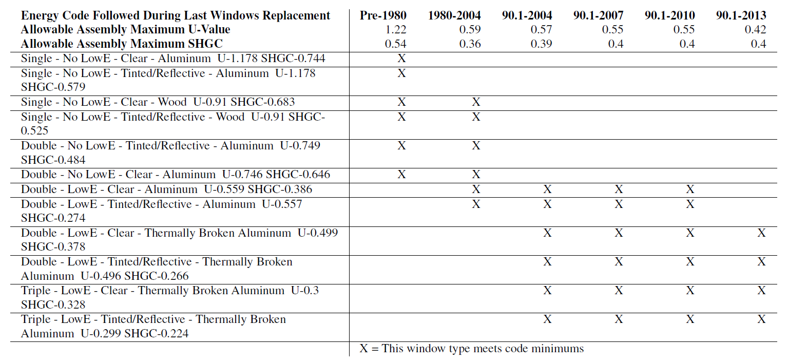
{:refdef}

As can be seen in Table 4, for DOE Ref Pre-1980, the only windows that met code and are realistic are single-pane or double-pane windows with no low-E coating. For DOE Ref 1980--2004, the maximum U-value dropped significantly, such that single-pane aluminum windows no longer met code. However, double-pane low-E windows became available on the market at that time. For 90.1-2004 through 90.1-2010, code required a U-value equivalent to double-pane low-E or better, and in 90.1-2013, the code improved again, meaning that double-pane low-E with a thermal break or better was required. This type of logic was applied to all combinations of climate zone and energy code. Then, we converted the data into the distributions used in sampling.

A small adjustment was made to the final distributions because some states and localities do not follow or enforce energy codes strictly. Following the code exactly would likely overestimate window performance. Therefore, in scenarios where single-pane windows were technically below code, we assumed that 5% of all windows in the stock would still have the worst-performing single-pane windows installed. The distributions were adjusted accordingly by subtracting 5% total from the double-pane configurations and adding to the single-pane aluminum configurations. After making this manual adjustment, the new distributions had the same overall breakdown as the national distribution generated from the Guidehouse data---54% single-pane and 46% double-pane.

## 3.2  Window Thermal Performance

Once the 12 new window constructions were determined, a team from LBNL's Windows and Daylighting Group used the WINDOW program to assign thermal performance properties to each construction. SimpleGlazing objects in EnergyPlus™ were chosen to represent windows to reduce complexity. This choice also simplifies the process of applying upgrades, because all fenestration objects in the baseline models use the same object type. The inputs for the SimpleGlazing object are U-factor, SHGC, and VLT. For each window configuration, LBNL assigned a frame ID and window ID from the WINDOW database. They also filled in the respective U-factors, SHGCs, and VLTs, which are shown in Table 5.

Table 5. Window Thermal Performance

{:refdef: style="text-align: center;"}

{:refdef}

The U-factors originally ranged from U-1.18 (Btu/hr-ft2-°F) for the worst-performing single-pane window to U-0.30 (Btu/hr-ft2-°F) for the best-performing triple-pane window. As mentioned earlier in this section, the maximum U-factor that EnergyPlus can model with a simple glazing object is U-1.02 (Btu/hr-ft2-°F), which is governed by the limitations of a 2D heat transfer model when interior and exterior air films are included. Therefore, we adjusted the U-factor for the first two single-pane windows to be U-1.02 (Btu/hr-ft2-°F) rather than U-1.18 (Btu/hr-ft2-°F). This allowed these windows to be modeled in ComStock. This results in a slight overestimate of the thermal performance of single-pane windows.

# 4.  Modeling Approach

There are many different window configurations available from manufacturers, and multiple performance levels have been observed in the field. Therefore, it is possible to achieve a range of thermal and optical characteristics for the glazing portion of the window assembly. Because of the differences in climate across the United States, it is not desirable to have a single performance value; warmer climates with lower heating requirements may want lower SHGC to avoid overheating, while higher SHGC may be preferable to allow beneficial solar gain in colder climates. In practice, building orientation, local shading, visual comfort, and external appearance may drive decisions to use windows with different performance characteristics on different parts of a single building.

The achievable thermal performance of the overall assembly is a different matter, as it is limited in most configurations by the thermal performance of the existing framing. Even in the frame-within-reveal configuration, the thermal conductivity of the existing sill/jamb/reveal material is important. Based on our understanding of the commercial building window stock, the frame-within-frame configuration would be the most common retrofit application. The major downside to this configuration, also discussed in some of the case studies, is that any thermal bridge through the existing window frame significantly impacts the overall assembly performance.

As starting point for target assembly performance, the values from the ASHRAE *Achieving Zero Energy---Advanced Energy Design Guide (AEDG) for Small to Medium Office Buildings* \[5\] were reviewed, as shown in Table 6. The biggest challenge in achieving these performance criteria using secondary windows would likely be the thermal bridging through the existing frame.

Table 6. Overall Assembly Performance Characteristics by Climate Zone

|                         | **0** | **1** | **2** | **3** | **4** | **5** | **6** | **7** | **8** |
|-------------------------|-------|-------|-------|-------|-------|-------|-------|-------|-------|
|**U-factor (Btu/h-ft2-°F)** | 0.48  | 0.48  | 0.43  | 0.40  | 0.34  | 0.34  | 0.32  | 0.28  | 0.25  |
| **SHGC**                    | 0.21  | 0.22  | 0.24  | 0.24  | 0.34  | 0.36  | 0.36  | 0.38  | 0.38  |
| **VT/SHGC**                 | 1.10  | 1.10  | 1.10  | 1.10  | 1.10  | 1.10  | 1.10  | 1.10  | 1.10  |

To understand the expected performance of the total assembly, a range of combinations of existing window and secondary windows was modeled using the LBNL WINDOW software. As illustrated in Figure 3, a modeling simplification was made to exclude the effects of the secondary window frame, because in the frame-within-frame configuration, heat transfer would likely be dominated by the existing frame.

{:refdef: style="text-align: center;"}
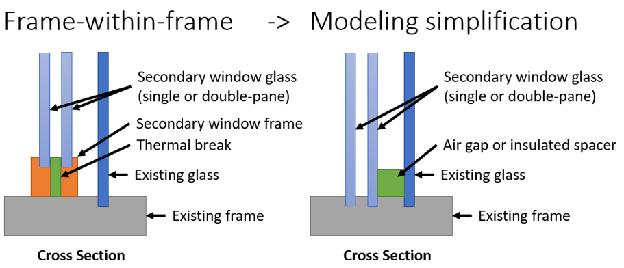
{:refdef}

{:refdef: style="text-align: center;"}
Figure 3. Modeling simplification for frame-within-frame secondary window systems
{:refdef}

Adding double-pane secondary windows to existing single-pane windows achieved a significant improvement in thermal and optical performance. Adding double-pane secondary windows to existing double-pane windows had diminishing returns over adding single-pane secondary windows because the achievable assembly performance was limited by the thermal bridging in the window frames. Ultimately, the combinations of existing windows and secondary windows shown in Table 7 is proposed. As expected, a comparison of the achieved performance values to the AEDG recommendations (see Table 8) shows that the overall thermal performance levels are still below the recommended values, largely driven by the limited performance of the existing window frame.

Table 7. Proposed Combinations for Performance of Existing Window Plus Secondary Window Combinations by Climate Zone

{:refdef: style="text-align: center;"}
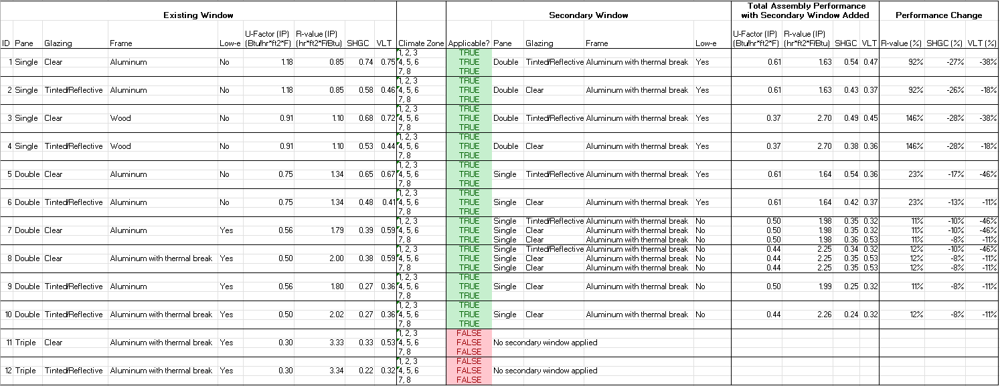
{:refdef}

Table 8. Comparison of Existing Window Plus Secondary Window Combinations to ASHRAE *Small and Medium Office Zero Energy AEDG* Performance Targets by Climate Zone

{:refdef: style="text-align: center;"}
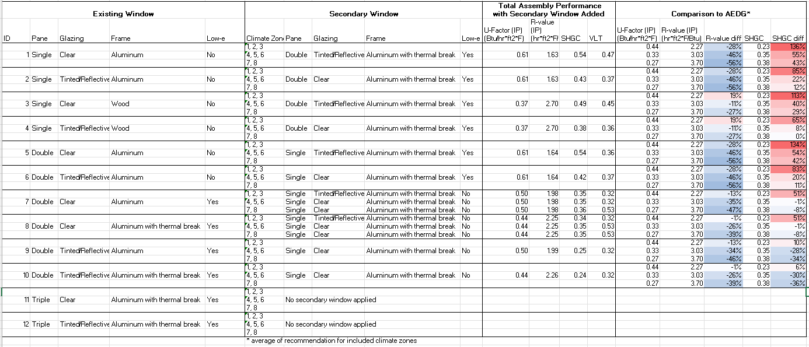
{:refdef}

# 5.  Applicability

The current stock has 12 different window configurations. Figure 4 shows the breakdown of windows by total floor area. In total, single-pane windows represent about 53% of the floor area, double-pane 47%, and triple pane \<1%.

{:refdef: style="text-align: center;"}
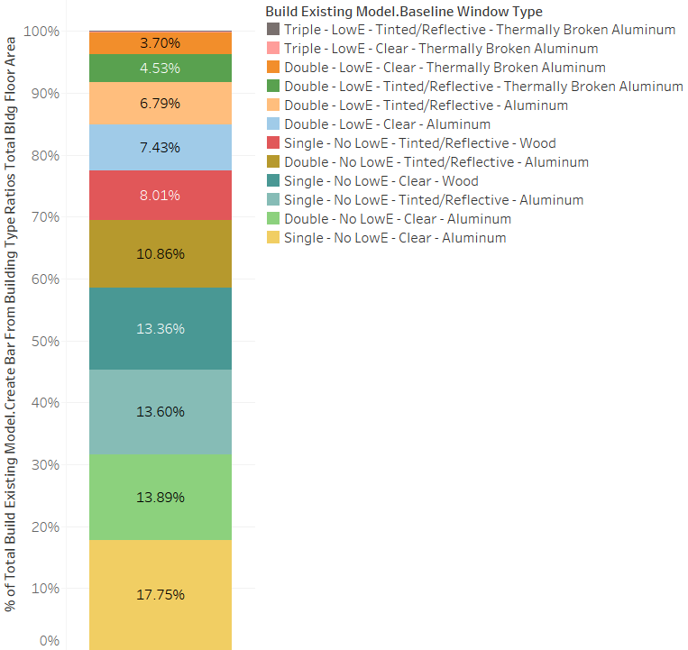{:width="600"}
{:refdef}

{:refdef: style="text-align: center;"}
Figure 4. Percent stock floor area by window type
{:refdef}

The secondary window measure is applicable to all buildings that currently have single- or double-pane windows, which is nearly 100% of the stock. The very small fraction of buildings that already have triple-pane windows will not receive this upgrade.

# 6.  Output Variables

Table 9 includes the output variable that is calculated in ComStock. This variable is important in terms of understanding the differences between buildings with and without the secondary window system measure applied. Additionally, this output variable can be used for understanding the economics (e.g., return of investment) of the upgrade if cost information (i.e., material, labor, and maintenance cost for technology implementation) is available.

Table 9. Output Variables Calculated From the Measure Application

| **Variable Name**               | **Description**                                                          |
|---------------------------------|--------------------------------------------------------------------------|
| Area of secondary windows added | Area of windows in the model to which secondary windows were added (ft2) |

# 7.  Results

## 7.1  Single Building Example

The percent changes in U-value, SHGC, and VLT were determined from the WINDOW model and assigned to each building in ComStock based on the existing window construction and the climate zone. Table 10 shows the U-value and SHGCs for each window configuration before and after the secondary window upgrade was applied. As expected, the U-value and SHGC percent decreases align with the performance changes in Table 7. VLT is not currently an output variable, but we assume that the VLT decrease was also applied properly because it was applied in the exact same manner as the U-value and SHGC performance changes.

Table 10. U-Value and SHGC Comparison Before and After the Measure Was Applied

{:refdef: style="text-align: center;"}
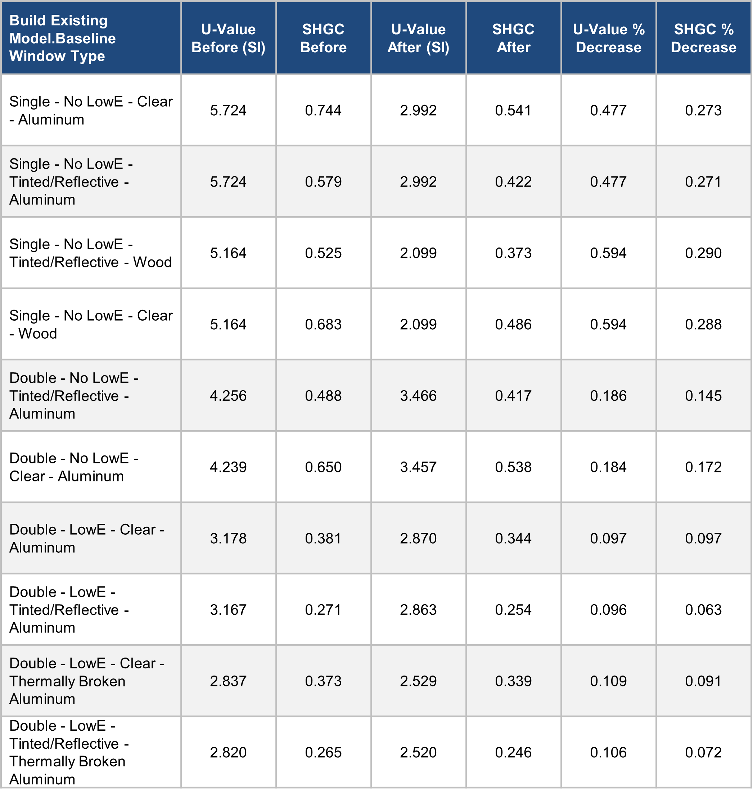
{:refdef}

## 7.2  Non-Energy Impacts

In the case studies, the evaluators found that the installation of secondary windows increased thermal and visual comfort for occupants near the windows. While these benefits likely have financial value, these impacts are not being quantified in the modeling of this technology.

## 7.3  Stock Energy Impacts

Installing secondary windows demonstrates 1% (60 TBtu) annual stock energy savings for commercial buildings (Figure 5). This includes 3% electricity heating savings (8 TBtu), 3% natural gas heating savings (12 TBtu), 3% electricity cooling savings (19 TBtu), and 1% fan energy savings. Heating, cooling, and fan energy savings can be partially attributed to the decreased thermal conductance (U-value) of the secondary windows, which generally reduces heating and cooling loads. This reduces the energy requirement of the heating and cooling system, but can also decrease the number of times heating, ventilating, and air conditioning (HVAC) fans need to cycle on (for systems that include cycling operation), which explains the energy savings in that category. Minimal differences in energy consumption between the baseline and upgrade scenario are observed for non-HVAC end uses, which is expected.

{:refdef: style="text-align: center;"}
{:width="600"}
{:refdef}

{:refdef: style="text-align: center;"}
Figure 5. Comparison of annual site energy consumption between the ComStock baseline and the window replacement scenario. Energy consumption is categorized by both fuel type and end use.
{:refdef}

<!--
## 7.4  Stock Greenhouse Gas Emissions Impact

Annual greenhouse gas emissions savings are realized at the stock level for all three electricity grid scenarios and all on-site fossil fuel combustion types (Figure 6). When combined with the fossil fuel emissions, all three grid scenarios show stock emissions savings of approximately 1.2%. Grid scenarios show similar total percent emissions savings due to electricity consumption (1.0% to 1.1%), but the scenarios with higher emissions in the ComStock baseline show higher total emissions savings because there are more emissions associated with each electricity kWh (3 MMT to 4 MMT).

{:refdef: style="text-align: center;"}
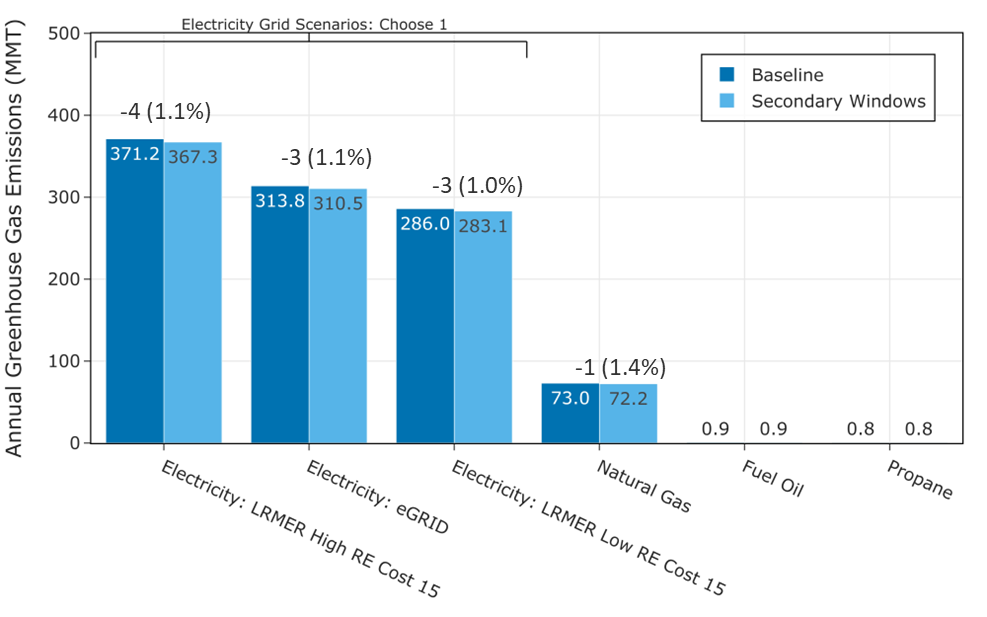
{:refdef}

{:refdef: style="text-align: center;"}
Figure 6. Comparison of greenhouse gas emissions for the ComStock baseline and the secondary window scenario. Three 
electricity grid scenarios are presented: Cambium Long-Run Marginal Emissions Rate (LRMER) High Renewable Energy (RE) Cost 15-Year, Cambium LRMER Low RE Cost 15-Year, and eGrid.
{:refdef}
-->
## 7.4  Energy Savings Distributions

Figure 7 shows the distribution of annual energy percent savings for the ComStock baseline compared to the window 
replacement scenario. The majority of the distributions show site energy savings between roughly 2% and 5% for the 25th and 75th percentiles (as indicated by the boxplots), respectively. The distributions extend fairly wide, but much of this range is covered by outliers outside of the standard 1.5 times the interquartile range calculation. Outliers are indicated by dots above the distribution, and they represent a relatively small portion of models. Some models in the distributions show negative energy savings for a given fuel type. This is expected to some degree with this type of window strategy, as reducing the SHGC can increase heating load.

{:refdef: style="text-align: center;"}
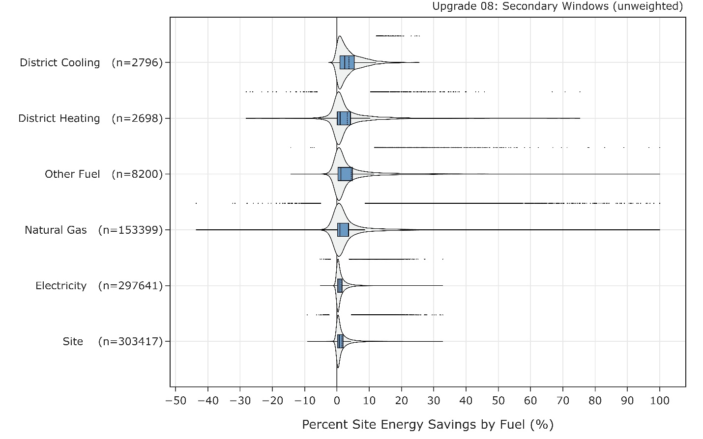
{:refdef}

{:refdef: style="text-align: center;"}
Figure 7. Percent savings distribution of ComStock models by fuel type
{:refdef}

Figure 8 shows the percent savings distribution for each end use and fuel type combination between the baseline 
ComStock model and the corresponding upgrade model. Models are included in these distributions only if they experienced savings (or a penalty) for the specific distribution. The model count for the distributions is indicated in each distribution title. Many end uses demonstrated a wide range of savings.

The heating end use (for the various fuel types) generally shows energy savings above the 25th percentile of the distribution. Heating savings are expected when decreasing the window U-value due to the increased insulative properties. However, some models experienced heating penalties. This is often due to the increased SHGC of the replacement windows, which is intended to decrease cooling energy consumption. However, this can also block some beneficial solar heat gain, which can cause an increased heating load. Whether or not annual heating savings are realized depends on a combination of factors, including the window to wall area, window orientation, thermostat set points, HVAC system, outdoor air temperatures, and amount of solar radiation affecting the window surface. Heating-only HVAC system types can be especially prone to energy penalties from lower SHGC because there is no cooling system to save energy from the decreased solar gains, although this does not reflect other potential benefits such as thermal comfort or glare control. Also, in some cases, HVAC systems that use multiple fuel types may experience heating savings for one of the fuel types and a heating penalty for the other due to nuanced load changes that shift load within the system.

{:refdef: style="text-align: center;"}
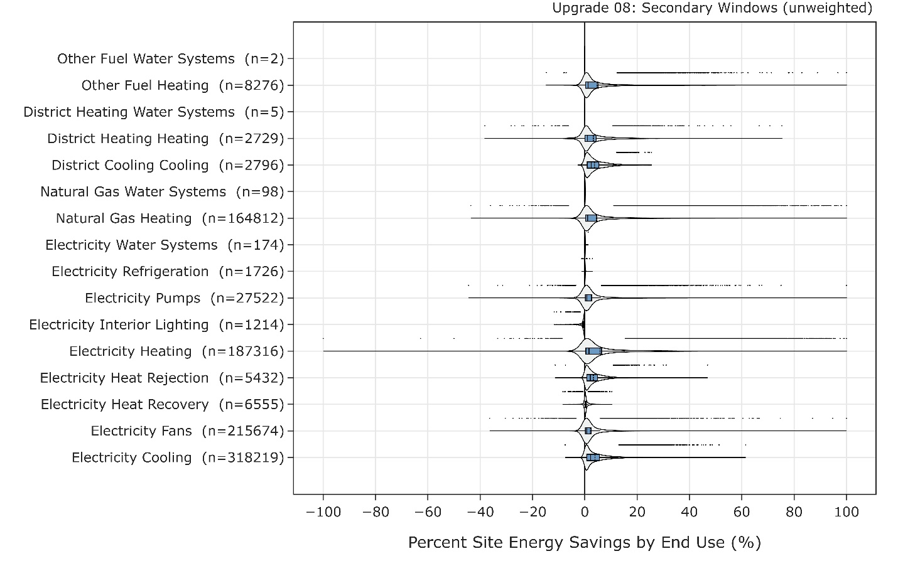
{:refdef}

{:refdef: style="text-align: center;"}
Figure 8. Percent savings distribution of ComStock models by end use and fuel type
{:refdef}

## References

\[1\] I. Bensch, R. Donaldson and L. Shimazu, \"Commercial Window Attachments: Secondary Window Market Characterization,\" NEEA, 2020.

\[2\] C. Curcija, H. Goudey, R. Mitchell and E. Dickerhoff, \"Highly Insulating Window Panel Attachment Retrofit,\" GSA, 2013.

\[3\] Home Innovation Research Labs, \"Performance Comparison of a Low-e Retrofit Window in a Philadelphia Office Building,\" 2013.

\[4\] K. Kiatreungwattana and L. Simpson, \"Demonstration and Evaluation of Lightweight High Performance Secondary Windows,\" NREL, 2021.

\[5\] ASHRAE, \" Achieving Zero Energy - Advanced Energy Design Guide for Small to Medium Office Buildings,\" ASHRAE, 2019.
