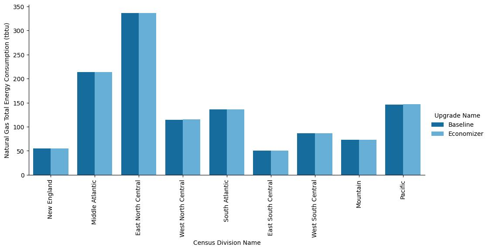

# Air-side Economizers
{: .fw-500 }
Author: Janghyun Kim, Chris CaraDonna, and Andrew Parker

# Executive Summary

Building on the successfully completed effort to calibrate and validate the U.S. Department of Energy's ResStock™ and ComStock™ models over the past several years, the objective of this work is to produce national data sets that empower analysts working for federal, state, utility, city, and manufacturer stakeholders to answer a broad range of analysis questions.

The goal of this work is to develop energy efficiency, electrification, and demand flexibility end-use load shapes (electricity, gas, propane, or fuel oil) that cover most of the high-impact, market-ready (or nearly market-ready) measures. "Measures" refers to energy efficiency variables that can be applied to buildings during modeling.

An *end-use savings shape* is the difference in energy consumption between a baseline building and a building with an energy efficiency, electrification, or demand flexibility measure applied. It results in a time-series profile that is broken down by end use and fuel (electricity or on-site gas, propane, or fuel oil use) at each time step.

ComStock is a highly granular, bottom-up model that uses multiple data sources, statistical sampling methods, and advanced building energy simulations to estimate the annual subhourly energy consumption of the commercial building stock across the United States. The baseline model intends to represent the U.S. commercial building stock as it existed in 2018. The methodology and results of the baseline model are discussed in the final technical report of the [End-Use Load Profiles](https://www.nrel.gov/buildings/end-use-load-profiles.html) project.

This documentation focuses on a single end-use savings shape measure---air-side economizers. Economizers increase outdoor ventilation at times when the system requests cooling and the controls determine that the outdoor air is cold or dry enough to be beneficial. The measure adds economizer controls to air handling units (AHUs) that do not already have this functionality. The prevalence of economizers in ComStock baseline AHUs is based on the governing energy code (based on the vintage and age of the building) for each specific model. The type of economizer control added is based on the guidelines of ASHRAE 90.1. Furthermore, a common fault that is prevalent in economizers (i.e., a fully closed outdoor air damper ) is added with certain prevalence to reflect findings from a previous study \[1\]: less than 35% of randomly selected buildings with economizers have a malfunction that persists for one month.

The economizer measure applies to buildings that cover 66% of the total building stock floor area and shows 0.3% total site energy savings (14 trillion British thermal units \[TBtu\]) for the U.S. commercial building stock modeled in ComStock (Figure 10). The economizer measure shows that 1 million metric tons (MMT) of greenhouse gas emissions are avoided; a reduction of 0.2%--0.4% depending on the three grid electricity scenarios presented (Figure 11). The savings are mainly due to the following factors:

-   **2.0%** stock **cooling electricity** savings (13.6 TBtu)

-   **1.5%** stock **district cooling** savings (1.4 TBtu)

-   **0.9%** stock **pump electricity** savings (0.4 TBtu)

-   **−0.1%** stock **fan electricity** savings (−0.7 TBtu)

-   **−0.1%** stock **heating gas** savings (−0.7 TBtu).

As shown in the results sections, the savings potential of the economizer upgrade at the stock level is relatively low compared to [other upgrades](https://nrel.github.io/ComStock.github.io/docs/upgrade_measures/upgrade_measures.html) we have analyzed. Since the amount of savings depends not only on the weather but also on the cooling demand of the building, the outdoor air requirement, the heat gain in the return air stream, and the configuration of the economizer, the savings will also vary for many buildings with different configurations and conditions. Additionally, economizer requirements have long been included in energy codes in many climates, limiting the opportunity and extent of savings from buildings that are not eligible for this upgrade because they already have economizers. However, since the economizer can be a simple upgrade (to an existing infrastructure) with a relatively low investment cost, the overall impact including the return on investment (or simple payback period) should be derived with the cost information.

# Acknowledgments

# 1. Introduction

This documentation covers the economizer upgrade methodology and briefly discusses key results. Results can be accessed on the ComStock™ data lake at "[end-use-load-profiles-for-us-building-stock](https://data.openei.org/s3_viewer?bucket=oedi-data-lake&prefix=nrel-pds-building-stock%2Fend-use-load-profiles-for-us-building-stock%2F)" or via the Data Viewer at [comstock.nrel.gov.](https://comstock.nrel.gov/datasets)

| **Measure Title**  | Economizer                 |
| **Measure Definition** | Adding economizer to air systems (e.g., VAVs and RTUs) where economizers are not utilized in the existing building stock. Economizer configuration is based on ASHRAE 90.1. A common economizer fault (outdoor air damper fully closed fault) is also applied with certain prevalence: less than 35% of random buildings with economizers get faulted and the fault remains for a month randomly chosen. |
| **Applicability**      | Buildings including air systems with ventilation that do not have economizers. Applicable buildings cover 66% of total building stock floor area. |
| **Not Applicable**     | Buildings that do have economizers or without ventilation systems. |
| **Release**            | 2024 Release 1: 2024/comstock_amy2018_release_1/   |           

# 2. Technology Summary

An air-side economizer (hereafter economizer) has the capability of introducing and controlling favorable (i.e., relatively cold and dry) outdoor air into the air-conditioning system to reduce the mechanical cooling energy used by the HVAC system when spaces require cooling. Figure 1 shows the components of an economizer. Typical controllers shown in the figure can implement one of multiple control schemes by leveraging different inputs with different types of sensors.

{:refdef: style="text-align: center;"}

{:refdef}

{:refdef: style="text-align: center;"}
Figure 1. Economizer components
{:refdef}

There are many types of controls on the market including fixed dry-bulb, fixed enthalpy, differential dry-bulb, differential enthalpy, electronic enthalpy, combinations of controls, and more. "Fixed" controls typically set a constant limit for certain property (e.g., dry-bulb temperature, enthalpy) for setting the high operating condition so that the economizer is disabled when the reading is above the high limit. "Differential" controls compare the property (e.g., dry-bulb temperature or enthalpy) between return air and outdoor air and disable economizing when the return air property (e.g., dry-bulb temperature) is lower than the outdoor air property.

In typical (and ideal) situations, there are certain control types and limits depending on weather and return air condition (e.g., level of heat gain in return air duct) that can maximize the efficiency (i.e., cooling energy savings) of an economizer. Building energy codes such as ASHRAE 90.1 and Title 24 provide preferrable choices of economizer control types and limits depending on climate zones. However, there are more factors that affect the efficiency of an economizer.

Most of the economizer control types leverage temperature and humidity measurements, and these sensors come with errors (i.e., uncertainty). For enthalpy-based control types, measurement of enthalpy includes uncertainty propagation of both temperature and humidity sensors. Taylor and Cheng \[2\] highlighted the realistic efficiencies of economizers with different control types via building energy simulation and concluded that, in most cases, the conventional and simple fixed dry-bulb control will perform the best in terms of both energy savings and initial investment. More details including economizer controls and limits are also described in Taylor and Cheng \[2\].

In summary, economizers leverage simple concepts (i.e., bring in outdoor air when favorable) with an impact on the system efficiency depending on weather, a building's outdoor air requirement, heat gain level in the return air stream, control algorithm, and reliability of the economizer.

# 3. ComStock Baseline Approach

ComStock baseline building models include HVAC systems with or without economizers, and configurations (e.g., control type and high limit) of economizers vary depending on different building parameters (e.g., climate zone). These decisions related to economizer configurations are determined by the requirements of the energy code that was in force when the HVAC system was last updated.

Figure 2 shows the prevalence of economizers (in terms of floor area coverage and contribution to cooling energy) for different subcategories (building type and ventilation system type) of the existing building stock. To note, the percentage of floor area shown as True for the "economizer availability" represents the total building area if there is at least one economizer available in the building, thus it does not mean the actual floor area coverage by the economizers. While there are buildings that already include economizers in variable air volume (VAV) systems and rooftop units (RTU) covering 40% of the total floor area and 28% of total electricity used for cooling, the remaining portion of buildings for those system types does not leverage economizers at all in the baseline models. HVAC system types such as packaged terminal units and residential systems without ventilation and dedicated outdoor air systems (DOAS) are not the target of this upgrade. More detailed information on the upgrade applicability is described in Section 4.1.

{:refdef: style="text-align: center;"}

{:refdef}

{:refdef: style="text-align: center;"}
Figure 2. Contribution of ventilation system types on energy
{:refdef}

Figure 3 shows the comparison of economizer coverage with respect to building floor area between ComStock and estimation from the Commercial Buildings Energy Consumption Survey (CBECS, 2018). Again, because of how data is structured in CBECS, the floor area coverage shown in these figures is representing the entire floor area of the building if any economizer is present in any of the HVAC systems in the building rather than actual floor area coverage by HVAC systems with economizers. Because CBECS data only shows total building area instead of total area covered by economizers, this comparison is mostly to understand the ballpark estimation of economizer coverage.

{:refdef: style="text-align: center;"}

{:refdef}

{:refdef: style="text-align: center;"}
Figure 3. Economizer floor area coverage between ComStock and CBECS (2018)
{:refdef}

# 4. Modeling Approach

## 4.1 Applicability

The applicability criterion of the economizer upgrade is simple; economizers will be installed in buildings including air systems with ventilation (i.e., AHUs and RTUs) that do not have economizers. Figure 4 shows the coverage of baseline buildings in terms of economizer availability and control type and how they contribute toward total building stock floor area and electricity usage for cooling. The applicable buildings for the economizer upgrade cover 66% of the total building stock floor area; however, this floor area also includes a building's total floor area when there are multiple air systems and if any of those air systems does not include an economizer. Thus, the actual impact of the economizer upgrade on the floor area will be less than 66%. Also, the amount of savings will be determined by the weather, a building's outdoor air requirement, heat gain level in the return air stream, and configuration of the economizer.

{:refdef: style="text-align: center;"}

{:refdef}

{:refdef: style="text-align: center;"}
Figure 4. Upgrade applicability on building stock floor area and electricity usage for cooling
{:refdef}

## 4.2 Configuration of Economizers

Specifics of a newly added economizer through an upgrade are applied in the same way as in models that already have economizers. In other words, configurations (e.g., control type and limit setting) are guided by the requirements of the energy code that was in force when the HVAC system was last updated. Each version of energy code (i.e., ASHRAE 90.1 or Title 24) includes best practices for leveraging economizers (depending on HVAC system size) as well as configuring economizers (depending on the climate zone). For example, ASHRAE 90.1-2010 includes information on preferrable control types, prohibited control types, and high limits for fixed control types, as shown in Figure 5. While some details vary between versions, these suggestions largely reflect physical reasonings such as considering temperature as well as humidity (i.e., prohibiting dry-bulb controls) measurements when the building is in humid regions (e.g., 1a, 2a, 3a, or 4a). More details on ComStock's economizer implementations are described in the ComStock Reference Documentation \[3\].

{:refdef: style="text-align: center;"}

{:refdef}

{:refdef: style="text-align: center;"}
Figure 5. Economizer configuration suggestions in ASHRAE 90.1-2010
{:refdef}

## 4.3 Greenhouse Gas Emissions

Three electricity grid scenarios are presented to compare the emissions of the ComStock baseline and the window replacement scenario. The choice of grid scenario will impact the grid emissions factors used in the simulation, which determines the corresponding emissions produced per kilowatt-hour. Two scenarios---Long-Run Marginal Emissions Rate (LRMER) High Renewable Energy (RE) Cost 15-Year and LRMER Low RE Cost 15-Year---use the Cambium data set, and the latter uses the eGrid data set \[4\], \[5\]. All three scenarios vary the emissions factors geospatially to reflect the variation in grid resources used to produce electricity across the United States. The Cambium data sets also vary emissions factors seasonally and by time of day. This study does not imply a preference for any particular grid emissions scenario, but other analysis suggests that the choice of grid emissions scenario can impact results \[6\]. Emissions due to on-site combustion of fossil fuels use the emissions factors shown in Table 1, which are from Table 7.1.2(1) of draft American National Standards Institute/Residential Energy Services Network/International Code Council 301 \[7\]. To compare total emissions due to both on-site fossil fuel consumption and grid electricity generation, the emissions from a single electricity grid scenario should be combined with all three on-site fosssil fuel emissions.

 Table 1. On-Site Fossil Fuel Emissions Factors 

{:refdef: style="text-align: center;"}

{:refdef}

## 4.4 Limitations and Concerns

In the current version of ComStock, two faults related to the economizers are implemented in the "baseline" simulations: incorrect changeover (high limit) temperature fault for fixed dry-bulb control and damper fully closed fault for any economizers. Assumptions (detailed in the ComStock Reference Documentation \[3\]) such as fault prevalence, fault incidence, fault intensity, etc., are made to reflect differences between different faults. While these two faults are reflected in the baseline simulations, we made a judgement to include damper fully closed fault in upgrade simulations as well. We are assuming that the incorrect changeover temperature fault that is mostly caused by poor commissioning is minimized (i.e., not included in upgrade simulations) by best practices conducted in the latest market. However, the fully damper closed fault that is initially and automatically triggered by malfunctioning or broken damper linkage is considered an inherent probabilistic issue even with the new economizer upgrade. This assumption can be updated as new information about economizer fault prevalence is found. The fault implementation in ComStock's baseline and upgrade scenarios is still in its early stages and economizer faults implementation was the first trial. This necessitated thorough consideration and refinement of the implementation approach, drawing from the existing pool of information. As we have verified a standardized approach for implementing faults in ComStock, we will have future opportunities to implement more faults if fault data (e.g., fault prevalence, fault incidence, fault intensity) is available for highly impactful faults.

Although a fault (i.e., damper fully closed fault) is implemented with fixed prevalence (35%), the actual percentage of economizers being faulted (among applicable economizers) is less than the defined prevalence due to current implementation limitation. For example, 35% of randomly selected buildings that include certain HVAC system types (that are categorized as the air system) are assigned to have the damper fully closed fault. However, there are cases where these air systems assigned to have an economizer fault do not even qualify to have an economizer when the cooling capacity is below a certain threshold (defined by the energy code). In other words, the current limitation is that the random selection of faulted economizers is not fully aligned with buildings that actually have economizers. In this case, we are losing a sample that is selected by 35% prevalence, resulting in decreased representation of fault prevalence in final building stock.

In reality, California's Title 24 energy code requires fault detection and diagnostics (FDD) for economizers, which prevents and quickly mitigates---not all but some---faults that can occur in economizers. However, the current version of ComStock does not reflect the preventative or quickly resolving FDD methodologies, thus possibly overestimating the degraded impact of faults in buildings in California.

While the representation of faults in this upgrade is underestimated due to the limitation described above, it should be noted that the savings shown in the results still reflect the impact of faults. For example, a newly added economizer through an upgrade has a chance (less than 35%) of having damper closed fault for a month in a year. If the outdoor air conditions were favorable (or unfavorable) for economizing during the faulted period, then the fault causes negative (or positive) impacts on energy savings through the upgrade. Note that the fully closed damper fault impacts the energy consumption both negatively and positively, while the positive energy savings by not introducing (hotter) outside air cause indoor air quality issues.

As not all buildings are configured in the same way and in the optimal way, our building models include variability between models. For one example, depending on the HVAC system and building type, we have air handling units that either (a) run fans along with ventilation over the entire night, (b) only cycle fans overnight with ventilation based on thermostat settings, or (c) only cycle fans overnight without ventilation based on thermostat settings. During this implementation of nighttime operation variability, we found that the EnergyPlus economizer does not operate in the same way an economizer typically does.

In short, one of the requirements of economizing controllers in the real world is the call (or electric/current signal) for cooling, but the EnergyPlus economizer economizes only based on favorable outdoor air condition and if the fan is running. Thus, during late night, if temperature drops and minimum ventilation is required, as in option (a) above, then the economizer will open the damper (even when there is no cooling need) to meet the supply air temperature set point, which can increase heating loads. This is depicted on the left side of Figure 6. While the economizer upgrade measure made a fix to this issue, our baseline models' economizers do not yet reflect this change. Thus, as shown on the right side of Figure 6, our new economizer measure "can" correct this issue in the upgraded simulations. However, to quantify the impact of a proper economizer more fairly, we decided not to change/correct the economizers with the issue during the upgrade implementation and only apply (the good) economizers based on the applicability criteria shown in Section 4.1. This baseline issue has an implication of overcooled spaces for (1) buildings with economizers and (2) buildings where nighttime ventilation is always on. Because this issue is not considered a common practice in the field, an [EnergyPlus issue](https://github.com/NREL/EnergyPlus/issues/10285) has been created.

{:refdef: style="text-align: center;"}

{:refdef}

{:refdef: style="text-align: center;"}
Figure 6. Issue in EnergyPlus economizer operation along with nighttime variability implementation in ComStock
{:refdef}

Within our stock models, we have buildings where relatively large amounts of fresh air (i.e., ventilation) are necessary for certain building operation types. For example, outpatient buildings that include medical examining areas can have dedicated zone-level exhaust fans to push out existing air and draw in new fresh air through the air handling unit. The left side of Figure 7 shows an example of an outpatient building where the introduction of outdoor air cycles overnight based on the air exhaust needs required in anesthesia room, MRI room, and soil work area. On the right side of the same figure, the same variables are plotted when an economizer is added to the same air handling unit. Adding an economizer completely disables the nighttime ventilation because (1) this specific model is representing a building without nighttime ventilation and (2) there is no cooling need during those times. For this specific example, we want to represent an outpatient building that strictly follows the operation hours (in this case, 5 a.m. to 6 p.m.), thus not using any of the examining spaces outside of (i.e., during nighttime) the operation hours. Because the behavior shown in the baseline model in Figure 7 is not aligning with that expectation, this issue will be explored and corrected in future analyses. The implication of having this behavior in the baseline runs mostly results in positive (during winter) heating savings with economizer upgrade because the economizer removes the need for heating that was caused by the introduction of colder air into the space, as shown.

{:refdef: style="text-align: center;"}

{:refdef}

{:refdef: style="text-align: center;"}
Figure 7. Issue in zone exhaust fan operation in an outpatient building, along with economizers in ComStock
{:refdef}

Figure 8 shows another example of a restaurant in a strip mall that has another issue related to the zone-level exhaust fan operation. Kitchen spaces use exhaust fans to ventilate particles that are created during cooking and, in this example model, the kitchen exhaust fan operates from 5 a.m. to midnight. Because the air is flowing out from an indoor space to the ambient, the air handling unit introduces make-up (outdoor) air to the kitchen in the baseline simulation. However, in the economizer upgrade scenario in the figures on the right side, the outdoor air varies in two levels throughout the simulation period (i.e., airflow rate changing between 0.115 kg/s and 0.13 kg/s). This is currently a limitation of the economizer upgrade modeling not properly accounting for buildings where there is zone mixing. For example, restaurants with open kitchens can have a wide opening between the kitchen and dining area, and the air from the dining area can be drawn into the kitchen (i.e., zone air mixing) when the kitchen exhaust fan operates. This kind of zone air mixing creates a relatively more complicated air balance between the exhaust fan and air handling unit in the simulation, resulting in different levels of outdoor airflow rate. The outdoor airflow rate of 0.115 kg/s shown in both the baseline and upgrade simulations represents the rebalanced outdoor airflow rate accounting for the zone mixing, while the 0.13 kg/s represents the original outdoor airflow rate without considering the zone mixing. This issue has an implication of drawing more outdoor air regardless of the condition (i.e., favorable or unfavorable in terms of energy) and will be analyzed and corrected in future analysis.

{:refdef: style="text-align: center;"}

{:refdef}

{:refdef: style="text-align: center;"}
Figure 8. Issue in zone exhaust fan operation in a strip mall with restaurant, along with economizers in ComStock
{:refdef}

# 5. Output Variables

Table 2 includes a list of output variables that are calculated in ComStock. These variables are important in terms of understanding the differences between buildings with and without the economizer measure applied. These output variables can also be used for understanding the economics of the upgrade (e.g., return on investment) if cost information (i.e., material, labor, and maintenance costs for technology implementation) is available.

Table 2. Output Variables Calculated from the Measure Application

{:refdef: style="text-align: center;"}

{:refdef}

# 6. Results

In this section, results are presented both at the stock level and for individual buildings through savings distributions. Stock-level results include the combined impact of all the analyzed buildings in ComStock, including buildings that are not applicable to this measure. Therefore, they do not necessarily represent the energy savings of a particular or average building. Stock-level results should not be interpreted as the savings that a building might realize by implementing the upgrade measure.

Total site energy savings are also presented in this section. Total site energy savings can be a useful metric, especially for quality assurance/quality control, but this metric on its own can have limitations for drawing conclusions. Further context should be considered, as site energy savings alone do not necessarily translate proportionally to savings for a particular fuel type (e.g., gas or electricity), source energy savings, cost savings, or greenhouse gas savings.

## 6.1 Single Building Example

Figure 9 shows a simulation example of an economizer installed in a building that previously did not have an economizer. In this example, outdoor air temperature varies between 32°F/0°C and 95°F/35°C throughout the year. Annual mechanical cooling energy savings were 2.6% for this example model (Figure 9 (a)) by leveraging free cooling during the times when outdoor air temperatures were below 50°F/10°C, as shown in Figure 9 (b) and (c). To note, savings potential of the economizer implementation heavily depends on the local climate, cooling needs, building's outdoor air requirement, heat gain level in the return air stream, and configuration of the economizer. From Figure 9 (c), it is easy to notice the relatively small-time window within three days where savings occur. These small-time windows disappear even more when weather is not favorable, the building does not need cooling, or the building already requires a high ventilation rate.

{:refdef: style="text-align: center;"}

{:refdef}

{:refdef: style="text-align: center;"}
Figure 9. Simulation example of economizer implementation
{:refdef}

It must be noted that other factors such as return on investment should also be considered to comprehensively assess the impact of this upgrade.

## 6.2 Stock Energy Impacts

Figure 10 and Figure 11 show the comparison of annual site energy consumption between the baseline and the upgrade scenario for the entire building stock and buildings that are only applicable to the upgrade, respectively. The economizer measure with fault (described in section 3.3) reflected in the stock models demonstrates 0.3% total site energy savings (14 trillion British thermal units \[TBtu\]) for the U.S. commercial building stock modeled in ComStock. The savings are primarily attributed to:

-   **2.0%** stock **cooling electricity** savings (13.6 TBtu)

-   **1.5%** stock **district cooling** savings (1.4 TBtu)

-   **0.9%** stock **pump electricity** savings (0.4 TBtu)

-   **−0.1%** stock **fan electricity** savings (−0.7 TBtu)

-   **−0.1%** stock **heating gas** savings (−0.7 TBtu).

{:refdef: style="text-align: center;"}

{:refdef}

{:refdef: style="text-align: center;"}
Figure 10. Comparison of annual site energy consumption between the ComStock baseline and the upgrade scenario for the entire building stock
{:refdef}

{:refdef: style="text-align: center;"}

{:refdef}

{:refdef: style="text-align: center;"}
Figure 11. Comparison of annual site energy consumption between the ComStock baseline and the upgrade scenario for only applicable buildings to the upgrade
{:refdef}

Electricity savings for cooling comes from leveraging colder outdoor air when spaces need cooling, which is highlighted in detail in Figure 9. Economizer requirements have been in the energy code in many climates for a long time, thus the opportunity and magnitude of the savings are limited by buildings that are not applicable to this upgrade because they already have economizers. More detailed findings are described in the following sections.

## 6.3 Stock Greenhouse Gas Emissions Impact

ComStock simulation results show greenhouse gas emissions avoided across all electricity grid scenarios and on-site combustion fuel types (Figure 11). Greenhouse gas emissions avoided from the electricity grid with the economizer upgrade are 0.2%--0.4% depending on three grid scenarios.

{:refdef: style="text-align: center;"}

{:refdef}

{:refdef: style="text-align: center;"}
Figure 12. Greenhouse gas emissions comparison of the ComStock baseline and the upgrade scenario. Three electricity grid scenarios are presented: Cambium Long-Run Marginal Emissions Rate (LRMER) High Renewable Energy (RE) Cost 15-Year, Cambium LRMER Low RE Cost 15-Year, and eGrid. MMT stands for million metric tons.
{:refdef}

## 6.4 Site Energy Savings Distributions

This section discusses site energy consumption for quality assurance and quality control purposes. Note that site energy savings can be useful for these purposes, but other factors should be considered when drawing conclusions, as these do not necessarily translate proportionally to source/primary energy savings, greenhouse gas emissions avoided, or energy cost.

Figure 12 through Figure 15 show the percent savings or site energy use intensity (EUI) savings distributions of the baseline ComStock models versus the upgrade scenario for applicable models with different classifications (e.g., end use, climate zone, building type). Percent savings provide the relative impact of the measure at the individual building level while site EUI savings provide the absolute (or aggregated) scale of impact. Also, the data points that appear above some of the distributions indicate outliers in the distribution, meaning they fall outside 1.5 times the interquartile range. The value for *n* indicates the number of ComStock models that were applicable for energy savings. Below are contexts to highlights that are reflected in these figures:

{:refdef: style="text-align: center;"}

{:refdef}

{:refdef: style="text-align: center;"}
Figure 13. Percent site energy savings distribution for ComStock models with the upgrade measure applied by end use and fuel type
{:refdef}

{:refdef: style="text-align: center;"}

{:refdef}

{:refdef: style="text-align: center;"}
Figure 14. Site EUI savings distribution for ComStock models with the upgrade measure applied by end use and fuel type
{:refdef}

{:refdef: style="text-align: center;"}

{:refdef}

{:refdef: style="text-align: center;"}
Figure 15. Percent site energy savings distribution for ComStock models with the upgrade measure applied by climate zone
{:refdef}

-   Positive savings in cooling-related end uses are the typical benefit of leveraging favorable outdoor air with economizing when a space requires cooling. As shown in Figure 12 and Figure 13, this has the most impact for this upgrade.

-   Positive savings in electricity used for heat recovery are shown in Figure 12. This is the power consumed by the heat/energy recovery wheels and the additional fan pressure of the wheel. When the outdoor air conditions are favorable for economizing, the heat recovery is bypassed during the economizing operation. Thus, the power used for the heat/energy recovery wheel and the static pressure from bypassing the coil are reduced during economizing. However, the overall impact is small, as shown in Figure 13.

-   Because the savings potential with the economizer is heavily influenced by the climate and cooling needs in the building, the savings distributions are also distinct in between different climate zones, as shown in Figure 14. Because extremely hot climates have relatively less opportunity for economizing and extremely cold climates have relatively less need for space cooling, savings are mostly less in those very hot or very cold regions compared to other in between climate zones. And it is also shown that drier climates (e.g., 3B or 3C) can save relatively more cooling energy compared to humid climates (e.g., 3A) when leveraging economizers.

-   Positive gas savings, shown in Figure 12, are attributed to one of the limitations described in Section 4.4. This is related to buildings with a larger ventilation requirement, which includes zone-level exhaust fans that are currently not aligned with the nighttime ventilation scheme that is being modeled. As shown in Figure 13, the stock-level impact due to this issue is small compared to the savings realized from electric cooling energy usage. This issue will be revised in future analysis.

-   Negative heating savings, shown in Figure 12, are attributed to one of the limitations described in Section 4.4. This is related to buildings with zone-level exhaust fans and including zone mixing (e.g., air from dining area to kitchen area). As shown in Figure 13, the stock-level impact due to this issue is small compared to the savings realized from electric cooling energy usage. This issue will be revised in future analysis.

-   Additionally, some of the data points showing extreme savings in percent savings figures are (1) buildings either in very hot or very cold climates, (2) where absolute heating or cooling demand is small, and (3) even small change (due to upgrade) in heating or cooling demand (e.g., MWh) resulting in large relative (e.g., percent) savings. The stock-level or aggregate impact is well-reflected in the site EUI savings figures.

## 6.5 Other Interesting Findings Related to Upgrade

Figure 15 shows the impact of economizers on floor area, electricity used for cooling, and total site energy in both baseline and upgrade simulations. Below are highlights from the figure:

-   There are many cases where the baseline building has multiple air handling units, but not all air handling units have economizers. The upgrade adds more economizers to these buildings. Thus, in Figure 15, a building that has one economizer (with fixed dry-bulb control) out of 10 air handling units will be reported as FixedDryBulb.

-   Almost all RTUs and VAVs that initially did not have an economizer now have economizers installed.

-   Newly installed economizers in the upgrade scenario are mostly configured with differential enthalpy control followed by differential dry-bulb control, as the new economizer requirements are following the latest ASHRAE 90.1 standard from 2019.

-   If a building includes many economizers (in many air handling units), only one representative economizer control type is reported per building based on the floor area coverage. There are many buildings with fixed dry-bulb control as the representative control type in the baseline model. Additionally, if the economizer upgrade installed many more economizers with differential enthalpy control within the same building, the representative economizer control type can change from fixed dry-bulb control (in the baseline model) to differential enthalpy control (in the upgrade model), as shown in the figure.

{:refdef: style="text-align: center;"}

{:refdef}

{:refdef: style="text-align: center;"}
Figure 16. Economizer impact on floor area, electricity used for cooling, and total site energy
{:refdef}

Figure 16 presents the coverage of buildings with faulted economizers in terms of stock floor area. In both baseline and upgrade scenarios, two economizer faults are added to buildings based on random building selection with certain prevalences; 30% prevalence is used for the economizer high-limit/changeover temperature fault (for fixed dry-bulb control economizers) and 35% prevalence is used for the damper fully closed fault. In Figure 16, portion labeled as "with economizer fault(s)" represents building stock area covered by the faulted economizer(s) where the fault status is either high-limit temperature fault only, damper fully closed fault only, or both faults present. And the slight increase of faulted economizers in the upgrade scenario is due to the new economizer with the upgrade being faulted with the damper fully closed fault. As mentioned previously, the prevalence of actual faulted economizers shown in the figure (13% in baseline scenario and 15% in upgrade scenario) is less than the original prevalence (30%‒35%). More details on the fault implementation in the baseline simulation can be found from the ComStock Reference Documentation \[3\].

{:refdef: style="text-align: center;"}

{:refdef}

{:refdef: style="text-align: center;"}
Figure 17. Total stock floor area of buildings with economizer faults
{:refdef}

{:refdef: style="text-align: center;"}

{:refdef}

{:refdef: style="text-align: center;"}
Figure 18. Median electricity savings for cooling across contiguous U.S. states
{:refdef}

As shown in previous results, the stock-level savings potential of the economizer upgrade is relatively small compared to [other upgrades](https://nrel.github.io/ComStock.github.io/docs/upgrade_measures/upgrade_measures.html) we have analyzed. Because the amount of savings is determined not only by the weather but also a building's cooling requirement, outdoor air requirement, heat gain level in the return air stream, and configuration of the economizer, the savings will also vary across many buildings with varying configurations and conditions. Additionally, economizer requirements have been in the energy code in many climates for a long time, thus the opportunity and magnitude of the savings are limited by buildings that are not applicable to this upgrade because they already have economizers. Figure 17 illustrates the median savings percentage of electricity used for cooling, which varies between 1% and 12 % across different states in the contiguous United States.

# References

\[1\] J. Kim *et al.*, "Research challenges and directions in HVAC fault prevalence," *Science and Technology for the Built Environment*, vol. 27, no. 5, pp. 624--640, May 2021, doi: 10.1080/23744731.2021.1898243.

\[2\] S. Taylor and H. Cheng, "Economizer High Limit Controls and Why Enthalpy Economizers Don't Work," *ASHRAE Journal*, vol. 52, no. 11, 2010, Accessed: May 29, 2023. \[Online\]. Available: https://www.proquest.com/openview/22130ec043823a40fc7ae0770962a00a/1.pdf?pq-origsite=gscholar&cbl=41118

\[3\] A. Parker *et al.*, "ComStock Reference Documentation: Version 1," National Renewable Energy Laboratory, Golden, CO, NREL/TP-5500-83819. \[Online\]. Available: https://www.nrel.gov/docs/fy23osti/83819.pdf

\[4\] "Cambium \| Energy Analysis \| NREL." Accessed: Sep. 02, 2022. \[Online\]. Available: https://www.nrel.gov/analysis/cambium.html

\[5\] "Emissions & Generation Resource Integrated Database (eGRID) \| US EPA." Accessed: Sep. 02, 2022. \[Online\]. Available: https://www.epa.gov/egrid

\[6\] E. Present, Pieter Gagnon, Eric J.H. Wilson, Noel Merket, Philip R. White, and Scott Horowitz, "Choosing the Best Carbon Factor for the Job: Exploring Available Carbon Emissions Factors and the Impact of Factor Selection," 2022.

\[7\] G. Vijayakumar *et al.*, "ANSI/RESNET/ICC 301-2022 - Standard for the Calculation and Labeling of the Energy Performance of Dwelling and Sleeping Units using an Energy Rating Index," Oceanside, CA, 2022.

A.  Additional Figures

{:refdef: style="text-align: center;"}

{:refdef}

{:refdef: style="text-align: center;"}
Figure A-1. Site annual natural gas consumption of the ComStock baseline and the measure scenario by census division
{:refdef}

{:refdef: style="text-align: center;"}

{:refdef}

{:refdef: style="text-align: center;"}
Figure A-2. Site annual natural gas consumption of the ComStock baseline and the measure scenario by building type
{:refdef}

{:refdef: style="text-align: center;"}

{:refdef}

{:refdef: style="text-align: center;"}
Figure A-3. Site annual electricity consumption of the ComStock baseline and the measure scenario by census division
{:refdef}

{:refdef: style="text-align: center;"}

{:refdef}

{:refdef: style="text-align: center;"}
Figure A-4. Site annual electricity consumption of the ComStock baseline and the measure scenario by building type
{:refdef}
