# Air-Source Heat Pump Boiler and Natural Gas Boiler Backup
{: .fw-500 }
Author: Korbaga Woldekidan

# Executive Summary
Building on the successfully completed effort to calibrate and validate the U.S. Department of Energy's ResStock™ and ComStock™ models over the past three years, the objective of this work is to produce national data sets that empower analysts working for federal, state, utility, city, and manufacturer stakeholders to answer a broad range of analysis questions.

The goal of this work is to develop energy efficiency, electrification, and demand flexibility end-use load shapes (electricity, gas, propane, or fuel oil) that cover most of the high-impact, market-ready (or nearly market-ready) measures. "Measures" refers to energy efficiency variables that can be applied to buildings during modeling.

An *end-use savings shape* is the difference in energy consumption between a baseline building and a building with an energy efficiency, electrification, or demand flexibility measure applied. It results in a time-series profile that is broken down by end use and fuel (electricity or on-site gas, propane, or fuel oil use) at each timestep.

ComStock is a highly granular, bottom-up model that uses multiple data sources, statistical sampling methods, and advanced building energy simulations to estimate the annual subhourly energy consumption of the commercial building stock across the United States. The baseline model intends to represent the U.S. commercial building stock as it existed in 2018. The methodology and results of the baseline model are discussed in the final technical report of the [End-Use Load Profiles](https://www.nrel.gov/buildings/end-use-load-profiles.html) project.

This document focuses on a single end-use savings shape measure---a natural gas-fired boiler replaced with an air-source heat pump boiler. When the operating outdoor air temperature is below the cut-off temperature of the heat pump boiler, a natural gas boiler was used as a backup. Application of this measure helps to quantify the decarbonization as well as the energy savings potential from the replacement.

This measure is applicable for 33% of the U.S. commercial building stock modeled in ComStock, and the following key observations were made:

-   **7.5%** total site energy savings (345 TBtu)

-   **61.8%** heating natural gas savings (512 TBtu)

-   **83.2%** increase in heating electricity (164.4 TBtu).

# Acknowledgments

The authors would like to acknowledge the valuable guidance and input provided by Shanti Pless, Eric Bonnema and the NLR ComStock team, particularly Andrew Parker and Christopher CaraDonna. The author would also like to thank Bart Ransom from Colmac for providing heat pump performance data.

# 1. Introduction

This documentation covers the "Replace Boiler with Air-Source Heat Pump Boiler" upgrade methodology and briefly discusses key results. Results can be accessed via the ComStock™ [Published Datasets]({{site.baseurl}}) page.

|**Measure Title**  |  Replace Boiler with Air-Source Heat Pump Boiler (replace_boiler_with_heatpump)|
|**Measure Definition** |  This measure replaces natural gas boilers used for space heating with an air-source heat pump. The air-source heat pump will be the primary source of heat, and the natural gas boiler will be used as a backup.|
|**Applicability**    |    Buildings that use natural gas boilers for space heating and reheating after dehumidification during cooling operations.|
|**Not Applicable**    |   Buildings that do not use natural gas boilers for space heating, such as those with furnaces, electric heaters, or district heat sources. Boilers used for domestic hot water heating will not be changed in this measure.|
|**Release**       |       2023 Release 2: 2023/comstock_amy2018_release_2/|

# 2. Technology Summary

Air-source heat pump (ASHP) boilers are one of several candidate technologies for boiler electrification. This technology uses electricity to move heat from the surrounding air and transfer it at a higher temperature for space-heating applications. As indicated in Figure 1, ASHP boilers work as "refrigeration in reverse" and are usually two to three times more efficient than electric resistance boilers. Because the surrounding air serves as a heat source, the performance of ASHPs depends on the heat content (temperature) of the outdoor air. With current technology, heat pump capacity and performance generally decrease at lower outdoor air temperature. Heat pump equipment is often controlled to disable operation below a specified outdoor air temperature, often called the cutoff temperature or compressor lockout temperature. The specific value can vary by equipment type and manufacturer, and sometimes user is able to specify a value between a range limit. For operation below the cutoff temperature, backup boilers are used. Similar to heat pump performance and capacity retention, the compressor lockout temperature can improve with technology development.

{:refdef: style="text-align: center;"}
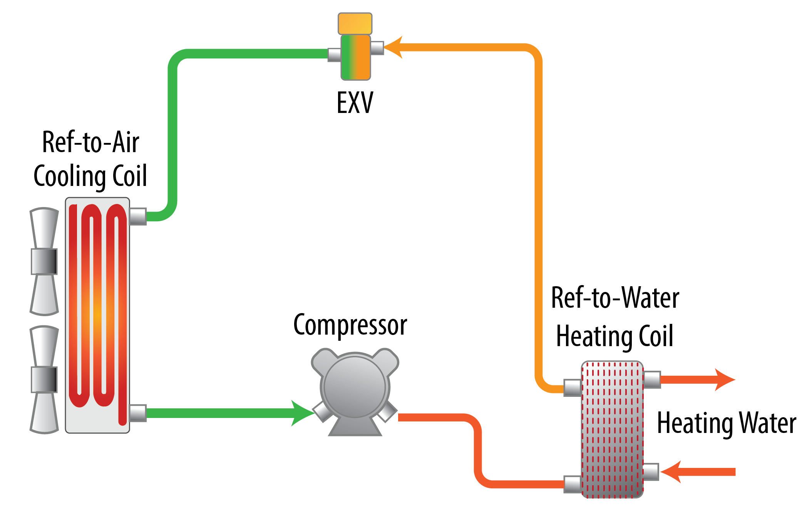{:width="600"}
{:refdef}

{:refdef: style="text-align: center;"}
Figure 1. ASHP boiler operation
{:refdef}

{:refdef: style="text-align: center;"}
All figures by NLR unless otherwise noted.
{:refdef}

# 3. ComStock Baseline Approach

The current version of the boilers in ComStock are gas-fired, noncondensing boilers. Their efficiencies are determined using the U.S. Department of Energy's reference buildings templates and capacities. The values are summarized in Table 1 \[3\]. To adjust the boiler efficiency, three different cubic performance curves are utilized based on the part load ratio (PLR) as shown in Table 2. Figure 2 shows a graphical representation of the curves' output. All ComStock boilers have a heating set point of 180°F with a capacity to modulate flow based on the heating load.

Table 1. Boiler Efficiency and Performance Curve Assignment
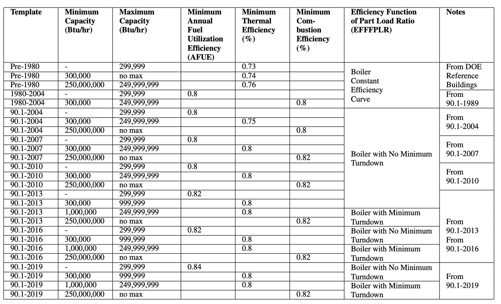{:width="700"}

Table 2. Boiler Performance Curves
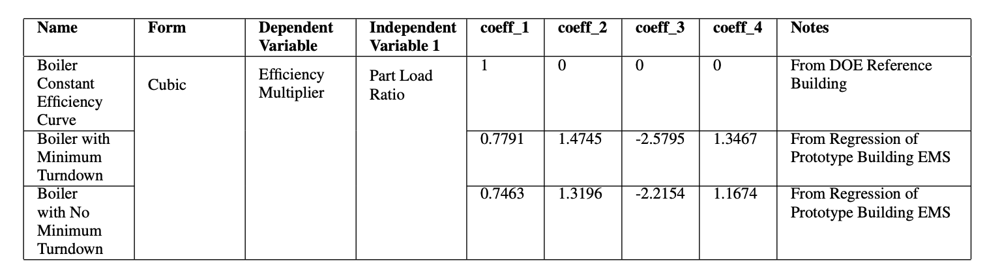{:width="700"}

{:refdef: style="text-align: center;"}
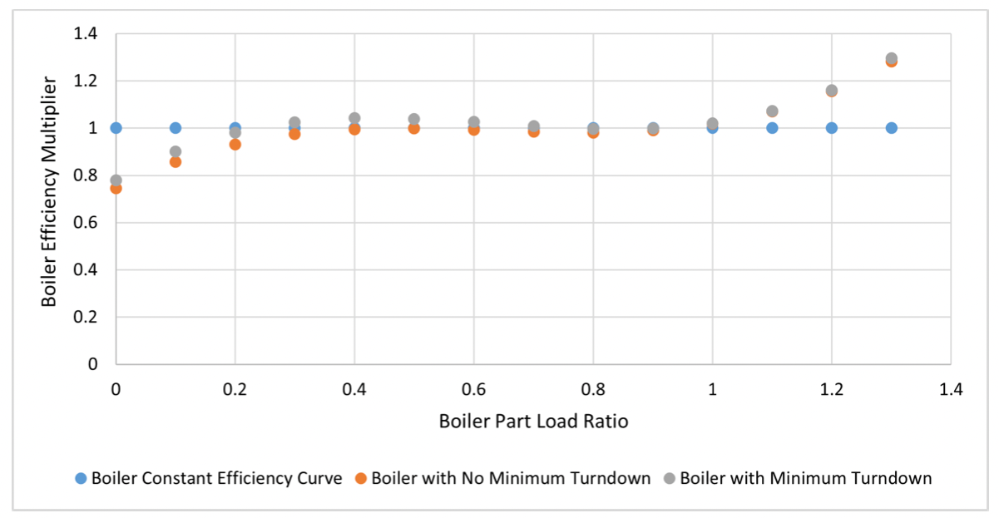{:width="700"}
{:refdef}

{:refdef: style="text-align: center;"}
Figure 2. Boiler performance curves
{:refdef}

# 4. Modeling Approach

According to the Commercial Buildings Energy Consumption Survey (CBECS), natural gas used by boilers and furnaces accounts for 73% of space-heating energy consumption in U.S. commercial buildings \[4\]. This measure replaces natural gas boilers used for HVAC applications with heat pump boilers. Outputs from the simulations could be used to estimate the carbon reduction and energy impact from electrification of these boilers.

The measure provides multiple options for natural gas boiler replacement. Table 1 summarizes the measure inputs and their default values used in the simulation run.

Table 3. Measure Input Summary

| Measure Inputs   | Description                                                                                                                                   | Default Value           | Units      |
|------------------|-----------------------------------------------------------------------------------------------------------------------------------------------|-------------------------|------------|
| Keep_setpoint    | Provides an option to keep the original hot water set point.                                                                                  | False                   | True/False |
| hw_setpoint      | Provides a new hot water set point if user chooses to change the original value.                                                              | 140                     | °F         |
| autosize_hc      | Provides an opportunity to auto-size heating coils when a user provides a new hot water set point.                                            | True                    | True/False |
| Sizing_method    | Provides an option for sizing the heat pump. The two options are sizing based on “percentage of peak load” and on “outdoor air temperature.”  | Outdoor air temperature | -          |
| hp_sizing_temp   | Provides the outdoor air temperature on which to base ASHP sizing if user chooses the sizing method as “outdoor air temperature.”             | 17                      | °F         |
| hp_sizing_per    | Provides the percentage of the peak heating load on which to base the sizing if user chooses the sizing method as “percentage of peak load.”  | 70                      | %          |
| hp_des_cap       | Maximum design heat pump heating capacity per unit. If the model requires a higher capacity, multiple units will be added in the loop.        | 40                      | kW         |
| bu_type          | Provides two options for backup heater: keeping the existing boiler or adding an electric resistance boiler.                                  | Natural gas boiler      | -          |
| hpwh_cutoff_Temp | Provides the cutoff temperature for the heat pump boiler.                                                                                     | −5                      | °F         |
| hpwh_Design_OAT  | Provides design outdoor air temperature for the heat pump boiler.                                                                             | 47                      | °F         |
| COP              | Provides the design coefficient of performance (COP) at the design outdoor air temperature.                                                   | 2.85                    | -          |

## 4.1. Applicability

Figure 3 shows the heating type distribution among the ComStock buildings. shows the heating type distribution among the ComStock buildings. This measure is applicable for buildings that use gas boiler as a heating source, which accounts for 33 % of the ComStock baseline total floor area. The orange bar in the figure indicates portions for the applicable buildings. Out of the buildings with boiler, this measure is applicable for 94% of them , the rest being boilers used for supplemental heating for heat pump applications.

{:refdef: style="text-align: center;"}
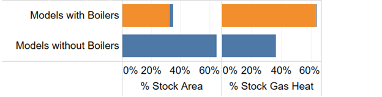{:width="600"}
{:refdef}

{:refdef: style="text-align: center;"}
Figure 3. Measure applicability
{:refdef}

This measure is applicable to the ComStock OpenStudio® models with the following heating, ventilating, and air conditioning (HVAC) system types (Table 4):

Table 4. Applicable HVAC System Types

| |Applicable HVAC System Types |
|-|------------------------------|
| 1                            | Dedicated outdoor air system (DOAS) with fan coil air-cooled chiller and boiler  |
| 2                            | DOAS with fan coil chiller and boiler                                            |
| 3                            | DOAS with fan coil district chilled water and boiler                             |
| 4                            | DOAS with water-source heat pump cooling tower and boiler                        |
| 5                            | Packaged single zone air conditioner (PSZ-AC) with gas boiler                    |
| 6                            | Packaged variable air volume (PVAV) with gas boiler                              |
| 7                            | PVAV with gas heat with electric reheat                                          |
| 8                            | Variable air volume air-cooled chiller with gas boiler reheat                    |
| 9                            | Variable air volume chiller with gas boiler reheat                               |
| 10                           | Variable air volume district chilled water with gas boiler reheat                |

## 4.2. ASHP Sizing

Heat pump sizing is a critical step that must be addressed when retrofitting a boiler with an ASHP boiler. The sizing process requires consideration of several factors, such as: \[2\]

-   Design heating water supply temperature

-   Design heating outdoor air temperature

-   Equipment cost

-   Operating cost

-   Electrical infrastructure cost to support the higher peak demand from switching to an electric heating source from a gas-fired heating source

-   Carbon emission reduction.

Optimal sizing is a balance of the above factors and should be aligned with the priorities of the building owner. Most of the commercially available ASHP boilers are relatively small and require cascading for higher capacities. Apart from requiring more area for installation, cascading provides flexibility, improves efficiency during part load operation, and enhances system redundancy and resiliency.

For this measure, two ASHP sizing methods are provided. The first method involves sizing the ASHP based on the percentage of the peak load, where the target ASHP capacity is determined as a percentage of the design heating load (DHL) on the heating load line as indicated in Figure 4. The heat load line is defined as the line connecting the zero-heating load at the heat enabling outdoor air temperature, assumed to be 60°F, and the DHL at the winter heating design day outdoor air temperature, while the DHL is assumed to be the same as the heating capacity of the existing boiler.

The second method involves sizing based on a specified outdoor air temperature. In this method, the target ASHP capacity is determined by selecting a point on a heating load line that corresponds to the outdoor air temperature.

{:refdef: style="text-align: center;"}
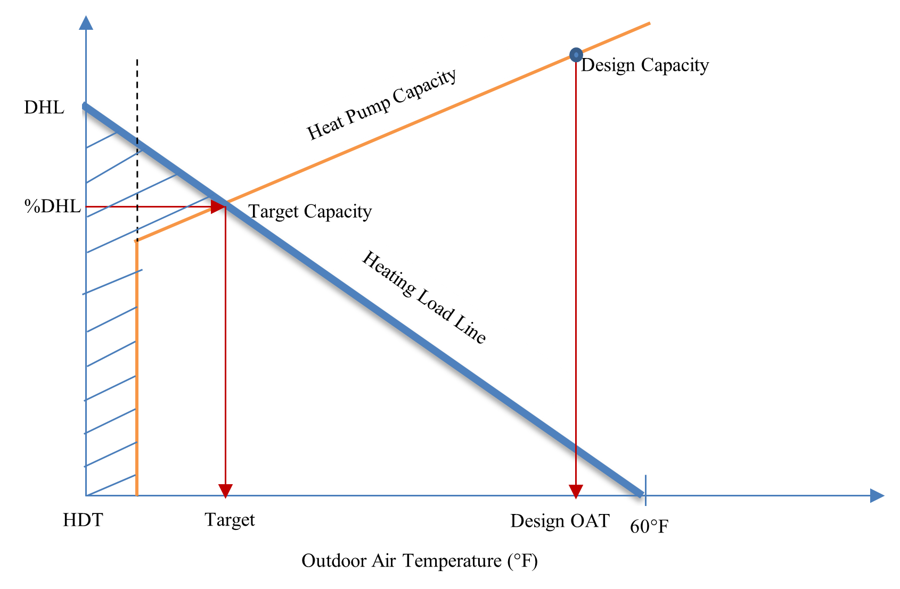{:width="700"}
{:refdef}

{:refdef: style="text-align: center;"}
Figure 4. Heat pump sizing approach
{:refdef}

Note that with current technology, heat pump capacity changes with outdoor air temperature, and most heat pump manufacturers provide the heat pump rated capacity at a specific condition, usually at an outdoor air temperature of 47°F. Thus, the target capacity estimated using either of the two methods needs to be converted to the required capacity at the design condition. To estimate the required rated capacity of the heat pump at the design outdoor air temperature, we used a performance curve called CapFT \[9\] that captures the variation of a heat pump's capacity with outdoor air temperature and hot water set point. The target capacity at the design outdoor air temperature (Target Capacity @ Design OAT) is estimated as:

{:refdef: style="text-align: center;"}
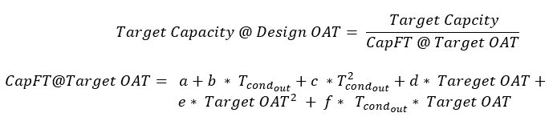{:width="700"}
{:refdef}

where a, b, c, d, e, and f are CapFT performance curve coefficients, and Tcondout is the hot water temperature at the condenser outlet of the heat pump (which is equivalent to the hot water heating set point).

For more detail information on sizing, readers are encouraged to refer the measure documentation for [boiler replacement with air source heat pump boiler and electric boiler backup]({{site.baseurl}}) from Commercial EUSS 2023 Release 1.

## 4.3. Modeling ASHP Boilers in OpenStudio

A plant loop heat pump energy efficiency ratio (EIR) heating model is used for modeling the ASHP boiler. However, the current version of this model does not support flow modulation and requires full design flow from the plant \[9\]. Consequently, it cannot be directly integrated into a hot water loop with a variable speed pump. To overcome this limitation and establish the necessary separation between the hot water loop and the heat pump, we have introduced a heat pump loop to the existing building model (refer to Figure 6). The heat pump loop consists of a heat pump on the supply side and a fluid-to-fluid heat exchanger on the demand side. This heat exchanger, connected in series to the existing boiler, serves as the primary heating source, while the boiler handles the remaining load.

To handle multiple heat pumps in the heat pump loop, we implemented a \"sequentialLoad\" control scheme, where heat pumps are activated in sequence until the heating load is satisfied. To maintain system efficiency despite the presence of a heat exchanger, we employed an \"ideal\" heat exchanger assumption, considering its effectiveness to be 1. Additionally, we utilized an \"UncontrolledOn\" control scheme for the heat exchanger, enabling it to operate whenever there is nonzero flow in the main hot water loop.\
\
Furthermore, it is worth noting that this heat pump model lacks a cutoff temperature. To address this, we incorporated an \"AvailabilityManagerLowTemperatureTurnOff\" in the heat pump loop. This feature disables the loop when the outdoor air temperature falls below the specified cutoff temperature.

{:refdef: style="text-align: center;"}
{:width="600"}
{:refdef}

{:refdef: style="text-align: center;"}
Figure 6. Configuration of heat pump and hot water loops
{:refdef}

The plant loop heat pump EIR heating model uses three performance curves---CapFTemp, EIRFTemp, and EIRPLR---to capture the impact of operating conditions on capacity and performance.

CapFTemp modifies the capacity of the heat pump based on the outdoor air and heat pump condenser outlet temperatures:

CapFTemp = a1 + b1 (Tcond,out) + c1 (Tcond,out)2 + d1 (Tair,in) + e1 (Tair,in)2 + f1 (Tair,in) (Tcond,out)

EIRFTemp modifies the EIR, which is the inverse of the coefficient of performance (COP), of the heat pump based on outdoor and heat pump condenser outlet temperatures:

EIRFTemp = a2 + b2 (Tcond,out) + c2 (Tcond,out)2 + d2 (Tair,in) + e2(Tair,in)2 + f2 (Tair,in) (Tcond,out)

EIRPLR modifies the EIR of the heat pump based on the part load ratio (PLR) and captures efficiency loss from compressor cycling:

EIRPLR = a3 + b3 PLR + c3 PLR2

We used data provided by Colmac \[13\] to generate the CapFTemp and EIRFTemp performance curves. During the measure development, we were not able to find performance data for EIRPLR. Thus, we assumed a linear variation between EIR and PLR that resulted in a 0% reduction in EIR at 1 PLR and a 25% reduction in EIR for a PLR close to zero. More details about the performance curves are given in Appendix A.

Figure 7 and Figure 8 show how the CAPFT and EIRFT curve output values change with outdoor air temperature and hot water leaving temperature. As shown in Figure 7, the CAPFT value increases as the outdoor air temperature and condenser leaving water temperature increase. The EIRFT curve shown in Figure 8 shows a decrease in EIR (improvement in COP) as the outdoor temperature increases and the condenser leaving water temperature decreases.

{:refdef: style="text-align: center;"}
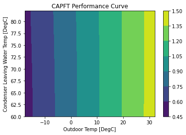{:width="500"}
{:refdef}

{:refdef: style="text-align: center;"}
Figure 7. CAPFT performance curve output
{:refdef}

{:refdef: style="text-align: center;"}
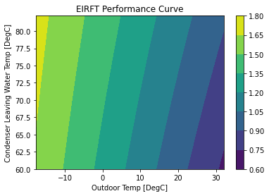{:width="500"}
{:refdef}

{:refdef: style="text-align: center;"}
Figure 8. EIRFT performance curve output
{:refdef}

## 4.4. Limitations and Concerns

As indicated in Section 3, some of the boilers in the baseline ComStock models don't have minimum load turndown control. This allows small flow with insignificant heating in the hot water loop. This had a negative impact during the application of this measure, as the measure introduces a heat pump loop that is triggered by a nonzero flow in the hot water loop. The small flow in the hot water loop forces the heat pump to cycle frequently and eventually affects the expected savings from the application of this measure. But this issue is only for a very small portion of buildings in hot climates and the impact on the overall savings is very minimal. This issue should be addressed in the next version of the ComStock models.

The heat pump object used in this measure---the plant loop EIR heating heat pump---is a constant flow model that requires full design flow from the plant. This model assumption imposes limitations on modeling variable speed heat pumps and introduces frequent cycling of the heat pump, leading to inefficiencies to the system. This measure could be updated in the future once the updated version of the heat pump object with a variable speed option is available.

To account for a relatively lower hot water supply temperatures by heat pump boilers, the measure provides an option to auto size the heating coils and associated systems. Even if the overall impact is minimal, in some buildings the autosizing provides a design outdoor air flow rate that is much slower than the baseline cases, resulting savings in cooling energy consumptions. This is due to differences in how design outdoor airflow rate is calculated and controlled when the baseline model is created, and how the autosizing re-sizes and controls the ventilation. This issue will be addressed in the future.

# 5. Output Variables

Table 5 includes a list of output variables that are calculated in ComStock. These variables are important in terms of understanding the differences between buildings with and without the replace_boiler_by_heatpump measure applied. These output variables can also be used for understanding the economics of the upgrade (e.g., return on investment) if cost information (i.e., material, labor, and maintenance costs for technology implementation) is available.

Table 5. Output Variables Calculated from the Measure Application

| Variable Name                          | Description                                                  |
|----------------------------------------|--------------------------------------------------------------|
| Heat pump capacity weighted design COP | COP of the heat pump at the rated design conditions          |
| Heat pump average COP                  | Average heat pump COP                                        |
| Heat pump total load                   | Total heating provided by heat pump                          |
| Boiler total load                      | Total heating provided by boiler                             |
| Heat pump total electricity            | Total electricity consumption by heat pump                   |
| Boiler total electricity               | Total electricity consumption by boiler                      |
| Heat pump capacity kbtuh               | Heat pump capacity                                           |
| Count heat pumps                       | Count of heat pumps                                          |
| Count heat pumps 0–300 kbtuh           | Count of heat pumps in the range of 0–300 kbtuh capacity     |
| Count heat pumps 300–2,500 kbtuh       | Count of heat pumps in the range of 300–2,500 kbtuh capacity |
| Count heat pumps 2,500+ kbtuh          | Count of heat pumps with more than 2500 kbtuh capacity       |
| Hot water loop total load              | Total heating load in the hot water loop                     |
| Hot water loop boiler fraction         | Fraction of heating load provided by boiler                  |
| Hot water loop heat pump fraction      | Fraction of heating load provided by heat pump               |

# 6. Results

## 6.1. Single Building Model Example

Table 6 shows an end-use energy consumption comparison for a 37,491 square-foot large office building model in Denver, CO, before and after application of the default measure inputs. The two energy end-use categories that are significantly affected by this measure are heating and cooling energy. For the same heating load, the total heating energy consumption drops by \~24% from 532 GJ to 403 GJ. Note that the natural gas consumption for the updated case is the one used by the backup natural gas boiler. Overall, the electric consumption increases by \~5% while natural gas consumption drops by \~48%.

Table 6. End-Use Energy Consumption Comparison

| End Use            | Baseline         || Updated          ||
|--------------------|------------------|-|------------------|-|
|                    | Electricity [GJ] | Natural Gas [GJ] | Electricity [GJ] | Natural Gas [GJ] |
| Heating            | 99               | 433              | 176              | 227              |
| Cooling            | 291              | 0                | 296              | 0                |
| Interior Lighting  | 551              | 0                | 551              | 0                |
| Exterior Lighting  | 75               | 0                | 75               | 0                |
| Interior Equipment | 380              | 0                | 380              | 0                |
| Exterior Equipment | 0                | 0                | 0                | 0                |
| Fans               | 204              | 0                | 204              | 0                |
| Pumps              | 59               | 0                | 59               | 0                |
| Heat Rejection     | 15               | 0                | 15               | 0                |
| Humidification     | 0                | 0                | 0                | 0                |
| Heat Recovery      | 0                | 0                | 0                | 0                |
| Water Systems      | 15               | 0                | 15               | 0                |
| Refrigeration      | 0                | 0                | 0                | 0                |
| Generators         | 0                | 0                | 0                | 0                |
| Total End Uses     | 1689.09          | 433.03           | 1770.93          | 226.92           |

{:refdef: style="text-align: center;"}
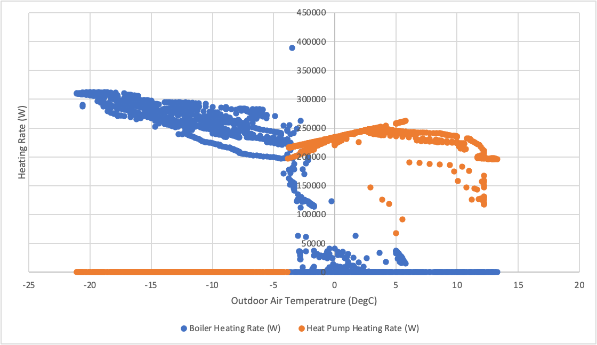{:width="700"}
{:refdef}

{:refdef: style="text-align: center;"}
Figure 9. Sequencing between ASHP and boiler
{:refdef}

We checked the sequencing between the heat pump and the boiler during low-temperature operation using an example cutoff temperature of 25°F (−4°C). Figure 9 shows the operation pattern. As expected, the heat pump handled most of the load at a higher temperature. The boiler starts supplementing the ASHP as the temperatures drops and takes over all heating when the temperature is below the cutoff temperature.

## 6.2. Stock Energy Impact

As noted previously, this measure is applicable for buildings that use natural gas boilers for HVAC systems, which accounts for 33% of the floor area of the U.S. commercial building stock modeled in ComStock. The following key observation are made from application of the measure.

-   7.5% total site energy savings (345 TBtu)

-   41% total natural gas energy savings (512 TBtu)

-   5.3% increase in total electricity (164.4 TBtu)

-   61.8% heating natural gas savings

-   83.2% increase in heating electricity.

As indicated in Figure 10, this measure has negligible impacts in most of the end-use categories, except heating electricity, heating natural gas, and pump electricity. The remaining gas heating in applicable buildings comes from backup heating, and a small subset of non-applicable systems (e.g., boilers that serve condenser water loops).

{:refdef: style="text-align: center;"}
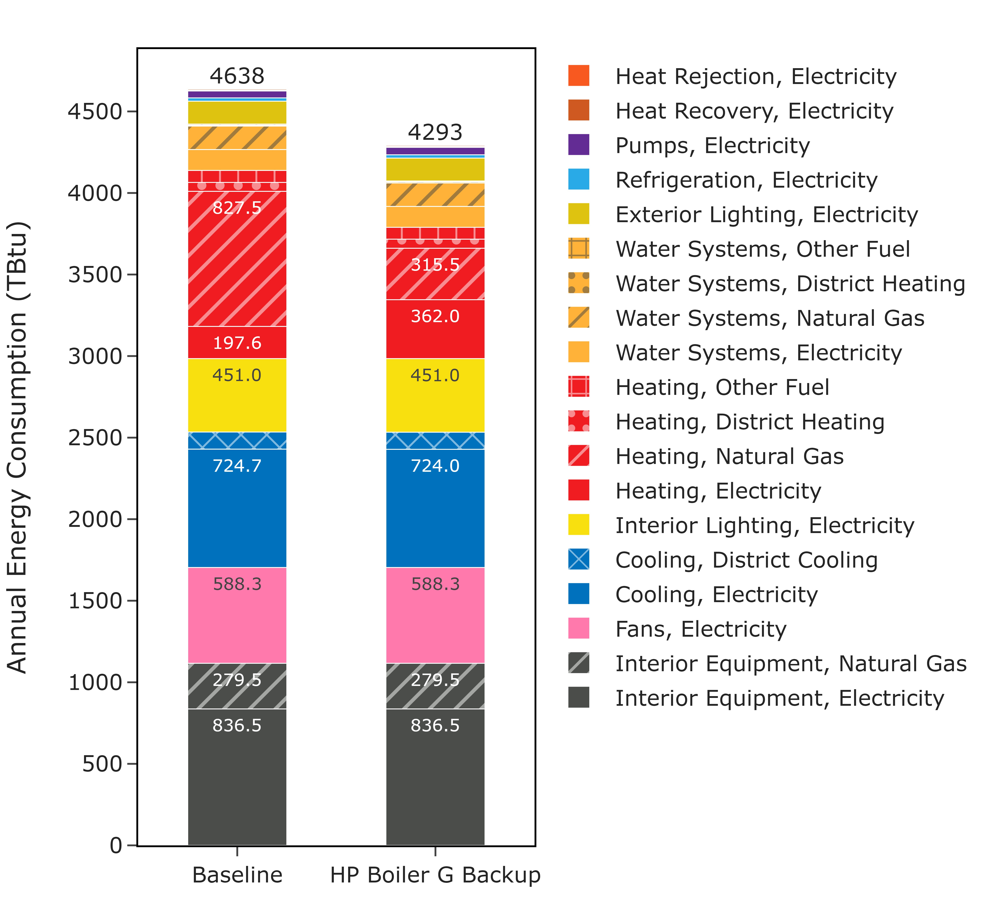{:width="700"} 
{:refdef}

{:refdef: style="text-align: center;"}
(a)
{:refdef}

{:refdef: style="text-align: center;"}
{:width="700"}
{:refdef}

{:refdef: style="text-align: center;"}
(b)
{:refdef}

{:refdef: style="text-align: center;"}
Figure 10. End-use energy consumption comparison for (a) ComStock Buildings and (b) applicable buildings
{:refdef}

## 6.3. Stock Peak Impacts

Figure 11 shows the impact of the upgrade on the average daily maximum peak demand per square foot across the ComStock building models. There was no increase during summer, whereas 0.5% and 5% increases are observed during the shoulder and winter seasons. This is expected, as the heat pump boiler mainly operates during the winter and sometimes during shoulder season. Heat pump peak demand is dependent on many factors including the climate, cutoff temperature, heat pump capacity, heat pump type (constant speed, variable speed), backup heating fuel type and capacity, unit efficiency and operating characteristics (e.g., thermostat schedule).

{:refdef: style="text-align: center;"}
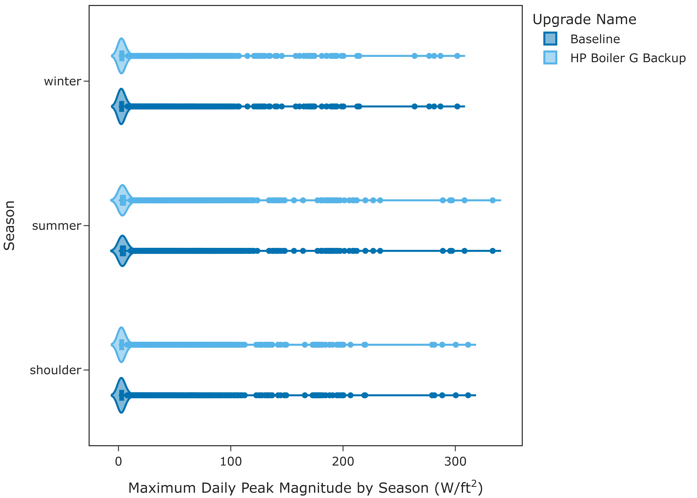{:width="700"}
{:refdef}

{:refdef: style="text-align: center;"}
Figure 11. Average daily maximum peak demand comparison
{:refdef}

## 6.4. Measure Impact by HVAC System Type 

Figure 12 shows the percent site energy savings by different types of HVAC system. DOAS with water-source heat pump cooling tower with boiler and PVAV with gas heat with electric reheat exhibited the least savings. The primary reason for the limited savings observed in the DOAS with water-source heat pump cooling tower with boiler system is that heat pumps predominantly fulfill the heating load while the boiler solely provides heating for the DOAS units. Also, this measure only replaces boilers in the hot water loop and doesn't replace supplemental boilers in the condenser loop for heat pump applications. In the case of the PVAV with gas heat and an electric reheat system, the reduced savings are attributed to the presence of electric reheat coils in the VAVs, which handle majority of the heating. On the other hand, the VAV systems with boiler reheat demonstrate higher savings. This is mainly due to the relatively higher floor areas they serve, makes them well suited for application of this measure.

{:refdef: style="text-align: center;"}
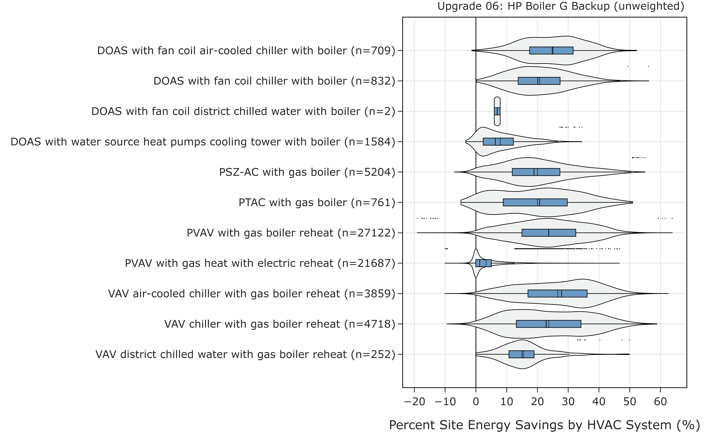{:width="700"}
{:refdef}

{:refdef: style="text-align: center;"}
Figure 12. Percent site energy savings by HVAC system type
{:refdef}

In each category, a few buildings exhibited negative savings due to their very small heating loads. In the baseline case, these loads were managed by modulating the boiler. However, in the updated case, the small nonzero flow in the hot water loop triggered the heat exchanger to request flow in the heat pump loop. However, the heat pump model used only supports constant flow, leading to frequent cycling of the heat pumps, as depicted in Figure 13. Consequently, this resulted in higher energy usage compared to the baseline. Only a very small fraction of the total buildings demonstrated this behavior, rendering its impact on the overall result to be minimal, and the absolute energy impact was small.

{:refdef: style="text-align: center;"}
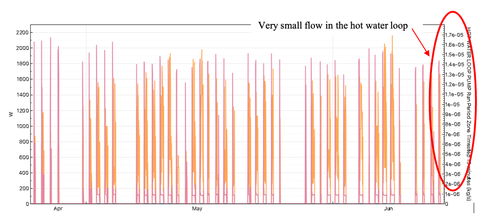{:width="700"}
{:refdef}

{:refdef: style="text-align: center;"}
Figure 13. Flow in the hot water loop that triggers heat pump operation
{:refdef}

## 6.5. Measure Impact by End Use

The impact of the measure on end-use energy consumption is indicated in Figure 14. As expected, the end uses that are affected most are natural gas heating, pump electricity, and heating electricity. Most of the natural gas consumption (except for backup heating) is replaced with electricity. The increase in electricity consumption due to the heat pump boiler addition is indicated by a negative percent savings for electricity heating. The electricity consumption for pumps is increased due to addition of a circulation pump in the heat pump loop. A very small subset of buildings exhibited an unexpected natural gas consumption increase and a reduction in pump electricity use. These buildings are buildings in a hot climate using VAVs with electric reheat where most of the heating is handled by the electric reheat coils and the boiler rarely runs. The observed increase in natural gas consumption is not an actual increase, instead it is caused by solution convergence difference. Similarly, the unexpected saving from pump electricity consumption in some buildings is due to presence of significantly low heating load in the hot water loop that is prohibiting the heat exchanger in the loop from activating. This causes both the hot water loop and heat pump loop pumps not to run, and resulted in pump energy savings. In these buildings, the electric reheat coils are operating in the absence of a heat source from the hot water loop to maintain the required zone temperature and no increase in unmet hours was observed. The minor changes in the other end uses are due to the change in the hot water set point from 180°F for the baseline to 140°F.

{:refdef: style="text-align: center;"}
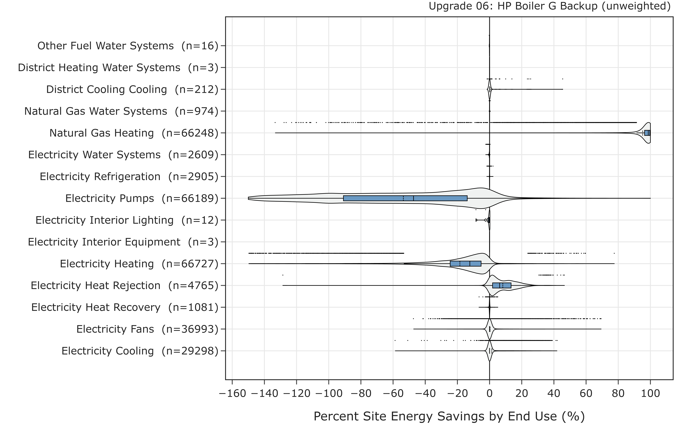{:width="700"}
{:refdef}

{:refdef: style="text-align: center;"}
Figure 14. Percent savings by end use
{:refdef}

## 6.6. Measure Impact by Building Type 

Figure 15 shows the impact of the measure by building type. Hospitals, primary schools, and secondary schools are the three building types with the most site energy savings, whereas quick-service restaurants exhibit the least. The higher savings in these three buildings are attributed to their HVAC system type as well as their relatively higher heating loads. Only \~1% of the ComStock quick-service restaurant buildings use a boiler, which resulted in lower savings from application of this measure. In contrast, 63% of hospitals, primary schools, and secondary schools use a boiler, which attributed to the observed higher site energy savings.

{:refdef: style="text-align: center;"}
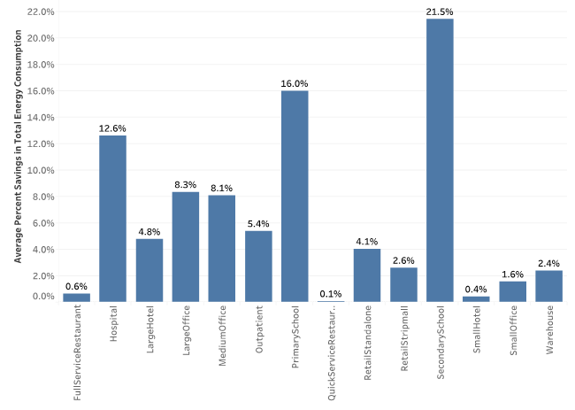{:width="700"}
{:refdef}

{:refdef: style="text-align: center;"}
Figure 15. Stock-wide total site energy savings by building type
{:refdef}

## 6.7. Measure Impact by State

Figure 16 and Figure 17 show a state-by-state average percentage of natural gas and electricity savings distributions across the entire building stock. As expected, cold regions exhibited higher savings in natural gas consumption and a higher increase in electricity energy use. The state-level average increase in electricity consumptions is indicated by negative savings. Please note that the savings are also influenced by buildings type distribution and total floor area across the states. Besides the need for more electricity because of the heat pump boilers in the colder regions, the high electricity demand is also in part due to the lower efficiency of the heat pump boilers in these regions. The unexpected electricity saving observed in Florida is due to cooling energy savings in some buildings due to the model autosizing limitation discussed in section 4.4. As indicated in Figure 10, no significant stock level cooling electricity energy consumption difference is observed due to the upgrade, confirming only very few buildings exhibited cooling energy savings and the impact is negligible..

Figure 18 shows the COP variations across the states. In general, heat pump boilers operate at a higher efficiency in hot climates compared to cold ones.

{:refdef: style="text-align: center;"}
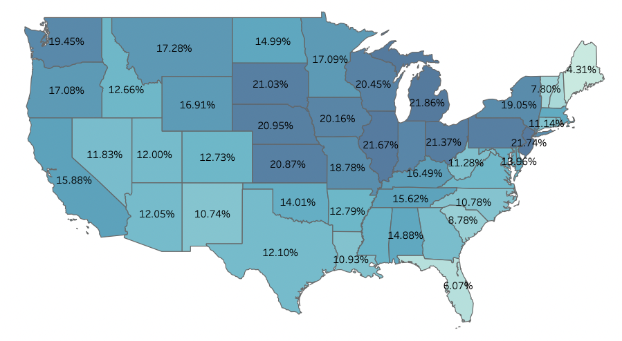{:width="700"}
{:refdef}

{:refdef: style="text-align: center;"}
Figure 16. percentage savings in natural gas
{:refdef}

{:refdef: style="text-align: center;"}
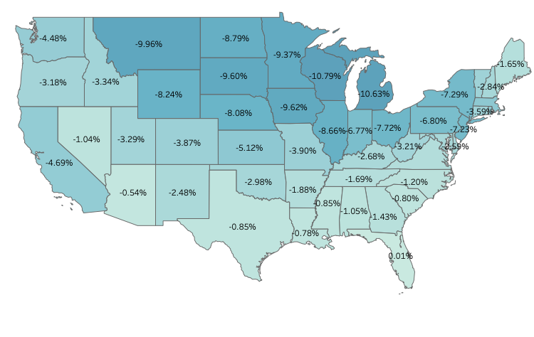{:width="700"}
{:refdef}

{:refdef: style="text-align: center;"}
Figure 17. Percentage savings in electricity consumption
{:refdef}

{:refdef: style="text-align: center;"}
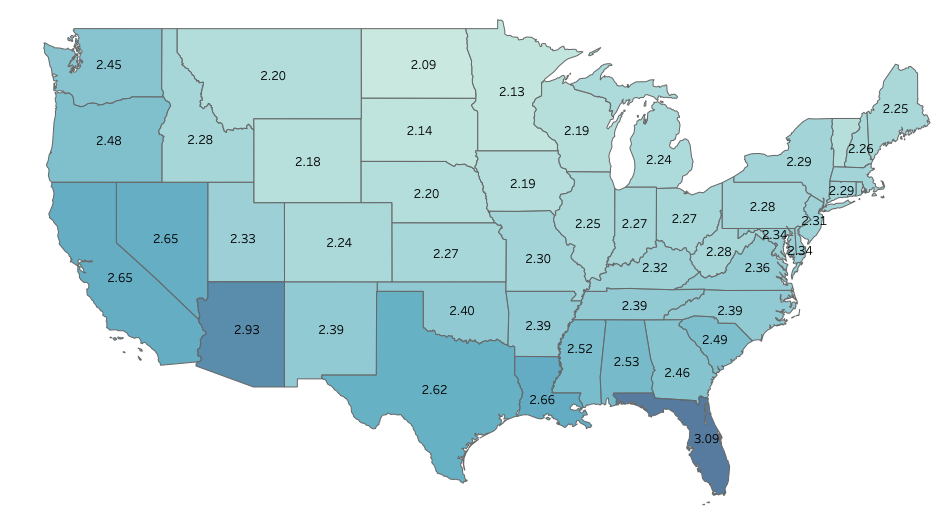{:width="700"}
{:refdef}

{:refdef: style="text-align: center;"}
Figure 18. Heat pump average COP
{:refdef}

## 6.8. Measure Impact on Greenhouse Gas Emissions

Figure 19 illustrates the annual greenhouse gas emissions comparison between the baseline and the upgrade. As expected, emissions from natural gas decreased while emissions from electricity increased. The overall reduction in greenhouse gas emissions depends on the emission source. Three sources of electricity are considered for comparison: Cambium Long-Run Marginal Emissions Rate (LRMER) High Renewable Energy (RE) Cost 15-Year, Cambium LRMER Low RE Cost 15-Year, and emission and generation resource integrated database (eGRID). The percentage values in the figure indicate percentage increase or decrease in emissions compared to the baseline. All upgrade scenarios resulted in net emissions avoided in combined emissions from electricity and on-site combustion fuels, with comparison using LRMER Low RE Cost scenario resulting the highest net savings of 22.6 MMT (9.2%).

{:refdef: style="text-align: center;"}
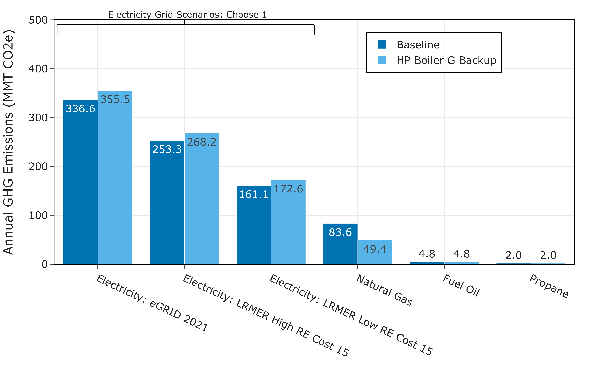{:width="700"}
{:refdef}

{:refdef: style="text-align: center;"}
Figure 19. Annual greenhouse gas emission comparison
{:refdef}

## 6.9. Comparison of Measure Upgrade with Gas and Electric Backup 

Figure 20 presents a comparison of end-use energy consumption after implementing a measure with gas and electric backup for relevant buildings. As anticipated, the electric heating option completely replaced 100% of the natural gas consumption for heating. For the gas backup case, 97.5% of the natural gas heating was replaced with electricity while the rest was used for backup. Consequently, the measure with electric backup exhibits higher electric consumption than the gas backup option, with the electric backup option consuming 3.5% more.

{:refdef: style="text-align: center;"}
{:width="700"} 
{:refdef}  

{:refdef: style="text-align: center;"}
(a)
{:refdef}

{:refdef: style="text-align: center;"}
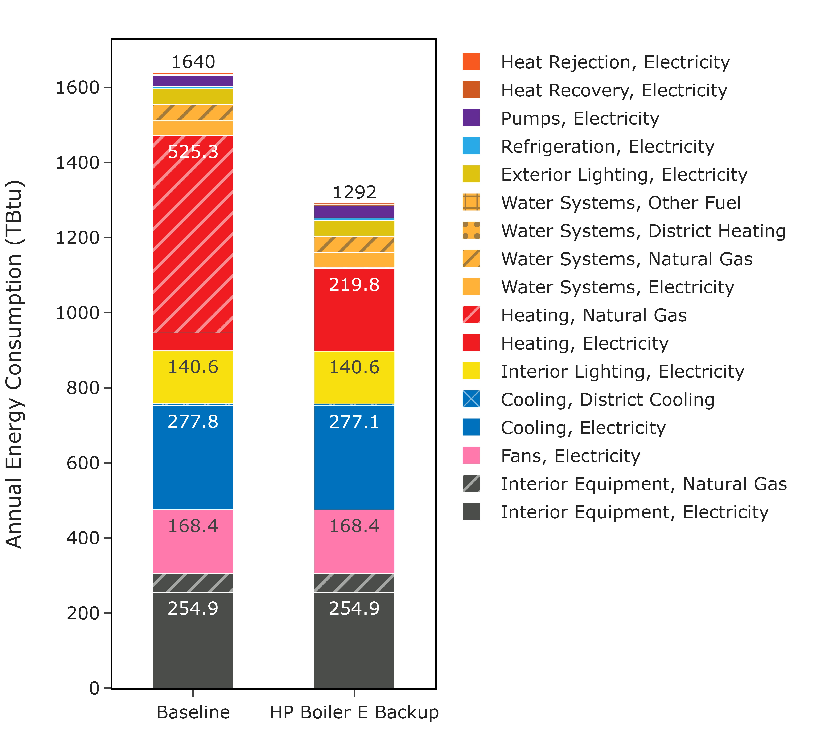{:width="700"}
{:refdef}

{:refdef: style="text-align: center;"}
(b)
{:refdef}

{:refdef: style="text-align: center;"}
Figure 20. End-use annual energy consumption comparison for (a) gas and (b) electric backup options
{:refdef}

As illustrated in Figure 21, no significant difference was observed between the gas and electric backup options in terms of their impact on peak demand. However, it is observed that there is a considerable increase in peak demands compared to the baseline scenarios in subarctic and very cold regions. This is expected because these regions have a higher need for heating, and electrifying the boiler using a heat pump boiler would significantly increase the electricity demand.

{:refdef: style="text-align: center;"}
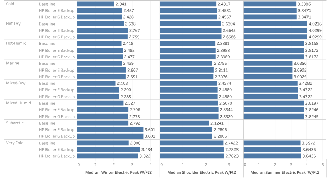{:width="700"}
{:refdef}

{:refdef: style="text-align: center;"}
Figure 21. Comparison of impact on peak demand for gas and electric backup options
{:refdef}

Like the peak demand observation, no considerable difference in net annual emission savings was observed between the two backup options. Figure 22 illustrates net greenhouse gas emission savings from the electricity grid scenarios and on-site combustion fuels (natural gas, propane, and other fuels). The preferred backup fuel type may vary based on the specific priorities for a project and should collectively consider energy costs, peak demand implications, prevalence of on-site combustion of fossil fuels, and other design constraints.

{:refdef: style="text-align: center;"}
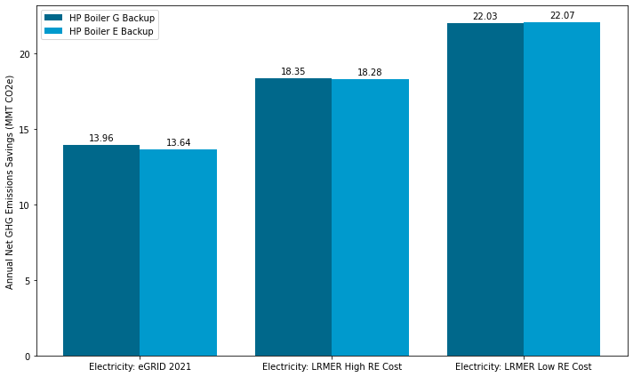{:width="700"}
{:refdef}

{:refdef: style="text-align: center;"}
Figure 22. Annual net greenhouse gas (GHG) emission saving comparison between gas and electric backup options
{:refdef}

# References

\[1\] "Product Info," *Eco2systems*. [https://www.eco2waterheater.com/product-info](https://www.eco2waterheater.com/product-info) (accessed Feb. 21, 2023).

\[2\] "Application Guide ACX comprehensive Chiller Heater System," TRANE. \[Online\]. Available: [https://www.trane.com/content/dam/Trane/Commercial/global/products-systems/equipment/chillers/air-cooled/ascend/SYS-APG003A-EN_04252022.pdf](https://www.trane.com/content/dam/Trane/Commercial/global/products-systems/equipment/chillers/air-cooled/ascend/SYS-APG003A-EN_04252022.pdf)

\[3\] A. Parker *et al.*, "ComStock Documentation," National Renewable Energy Laboratory.

\[4\] "2018 Commercial Buildings Energy Consumption Survey, Consumption and Expenditures Highlights".

\[5\] "Ascend® air-to-water heat pump model ACX." [https://www.trane.com/commercial/north-america/us/en/products-systems/chillers/air-cooled-chillers/ascend-air-to-water-heat-pump.html](https://www.trane.com/commercial/north-america/us/en/products-systems/chillers/air-cooled-chillers/ascend-air-to-water-heat-pump.html) (accessed Feb. 21, 2023).

\[6\] "Air-source Heat Pump Sizing and Selection Guide.pdf." Accessed: Feb. 21, 2023. \[Online\]. Available: [https://natural-resources.canada.ca/sites/nrcan/files/canmetenergy/pdf/ASHP%20Sizing%20and%20Selection%20Guide%20(EN).pdf](https://natural-resources.canada.ca/sites/nrcan/files/canmetenergy/pdf/ASHP%20Sizing%20and%20Selection%20Guide%20(EN).pdf)

\[7\] "ASHRAE climatic design conditions 2009/2013/2017/2021." [http://ashrae-meteo.info/v2.0/places.php?continent=North%20America](http://ashrae-meteo.info/v2.0/places.php?continent=North%20America) (accessed Mar. 15, 2023).

\[8\] N. Bellen, "5 ways to a successful heat pump deployment - #1 Optimal Sizing \| Article," *Hysopt*, Sep. 22, 2021. [https://hysopt.com/resource-center/articles/5-ways-to-a-successful-heat-pump-deployment-1-optimal-sizing](https://hysopt.com/resource-center/articles/5-ways-to-a-successful-heat-pump-deployment-1-optimal-sizing) (accessed Feb. 22, 2023).

\[9\] "engineeringreference.pdf." Accessed: Feb. 22, 2023. \[Online\]. Available: [https://facades.lbl.gov/sites/all/files/engineeringreference.pdf](https://facades.lbl.gov/sites/all/files/engineeringreference.pdf)

\[10\] "Ecodan CAHV-R450YA-HPB Product Information Sheet - Document Library - Mitsubishi Electric." [https://library.mitsubishielectric.co.uk/pdf/book/Ecodan_CAHV-R450YA-HPB_Product_Information_Sheet](https://library.mitsubishielectric.co.uk/pdf/book/Ecodan_CAHV-R450YA-HPB_Product_Information_Sheet) (accessed Feb. 22, 2023).

\[11\] "Aegis A \| Lync." [https://lyncbywatts.com/products/hvac-hot-water-solutions/engineered-solutions/heat-pumps/aegis-a](https://lyncbywatts.com/products/hvac-hot-water-solutions/engineered-solutions/heat-pumps/aegis-a) (accessed Feb. 22, 2023).

\[12\] *Energy Standard for Buildings Except Low-Rise Residential Buildings ANSI/ASHRAE/IES 90.1-2019*. ASHRAE.

\[13\] "Commercial Heat Pump Water Heaters," *Colmac WaterHeat*. [https://colmacwaterheat.com/](https://colmacwaterheat.com/) (accessed Feb. 23, 2023).

\[14\] "CxV Air Source Heat Pump Water Heater." \[Online\]. Available: [https://ftp-llc.com/wp-content/uploads/2019/02/CxV-Air-Source-One-Page.pdf](https://ftp-llc.com/wp-content/uploads/2019/02/CxV-Air-Source-One-Page.pdf)

# Appendix A 

## 1. Appendix ASHP Boiler Performance Curve Generation

As discussed in Section 4.3, the heat pump model used in this measure has three performance curves for capturing the dependency of the heat pump performance on the operating conditions. Two of the curves, capacity as a function of temperature (CapFTemp) and energy input ratio (EIR) as a function of temperature (EIRFTemp), capture the dependency of heat pump capacity and efficiency on outdoor air temperature and hot water supply temperature. EIR as a function of part load ratio (EIRPLR) captures the dependency of the heat pump efficiency on heat pump loading and cycling.

QAvailable = QReference x CapFTemp

P = PReference \* EIRFTemp \* EIRPLR

CapFTemp = a1 + b1 (Tcond,out) + c1(Tcond,out)2 + d1(Tair,in) + e1(Tair,in)2 +f1(Tair,in)(Tcond,out)

EIRFTemp = a2 + b2 (Tcond,out) + c2(Tcond,out)2 + d2(Tair,in) + e2(Tair,in)2 +f2(Tair,in)(Tcond,out)

EIRPLR = a3 + b3PLR + c3PLR2

Where Q~Reference~ is the design heating capacity of the heat pump, P~Reference~ is the design power demand of the heat pump, Q~Available~ is the adjusted heating capacity, P is the adjusted power demand, Tcond,out is the condenser outlet water temperature, Tair,in is the ambient air temperature, PLR is heat pump part load ratio, and a1, b1, c1, d1, e1 ... c3 are performance curve coefficients that need to be extracted from operational data.

The two temperature-dependent performance curves, CapFTemp and EIRFTemp, were generated using performance data provided by Colmac. It is important to note that the efficiency of the heat pump is influenced not only by the operating temperature conditions but also by factors such as the load on the heat pump and its cycling frequency. During the development of the measurement, we encountered a challenge in obtaining manufacturer data to account for this dependency. As a result, we assumed a linear variation between EIR and PLR. According to this assumption, there is no reduction in efficiency when the PLR is one (indicating full load), and a 25% reduction in efficiency when the PLR is close to zero (indicating low load).\
\
In order to evaluate the accuracy of the Colmac performance data, we compared data from Trane and Mitsubishi. Unfortunately, detailed data for the two units from Trane and Mitsubishi were not available. However, the capacity drop with outdoor air temperature observed in the Colmac unit appeared to be consistent with the data from Trane and Mitsubishi.\
\
The results of the comparison are summarized in Table A-1 and Table A-2. According to the data, the capacity reductions for the Trane and Colmac units were found to be 44% and 50%, respectively, as the temperature decreased from 47°F to 0°F. On the other hand, the Mitsubishi data indicates a 31% capacity reduction as the outdoor air temperature decreases from 45°F to 20°F, while the Colmac unit shows a slightly lower reduction of 25% within the same temperature range.

Table A-1. Capacity Reduction With OAT for Trane and Colmac Units

|| Capacity at 50°F (Btu/hr) | Capacity at 0°F (Btu/hr) | % Capacity Reduction From 50°F to 0°F | COP         |
|-|---------------------------|--------------------------|---------------------------------------|-------------|
| Colmac [14]               |57,600                    | 31,500                   | 45%                                   | 2.70 @ 50°F |
| Trane [2]                 |-                         | -                        | 50%                                   | 2.70 @ 47°F |

Table A-2. Capacity Reduction Comparison Between Mitsubishi and Colmac Units

|| Capacity at 45°F (Btu/hr) | Capacity at 20°F (Btu/hr) | % Capacity Reduction From 50°F to 20°F | COP         |
|-|---------------------------|---------------------------|----------------------------------------|-------------|
| Colmac [14]               |54,750                    | 42,200                    | 23%                                    | 2.70 @ 50°F |
| Mitsubishi [10]           |140,400                   | 117,234                   | 25%                                    | 2.85 @ 45°F |

Table A-3 summarizes the performance curve coefficients that are estimated using the Colmac data. The curve outputs for different combinations of condenser water leaving temperature and outdoor air temperature are indicated in Figure A-1 and Figure A-2.

Table A-3. Performance Curve Coefficients

|| CAPFT | EIRFT      | EIRPLR     |
|-|-------|------------|------------|
| a     | 0.88302749 | 0.84177647 | 1.25  |
| b     | −0.0016513 | 0.00648504 | −0.25 |
| c     | 1.44E−05   | −8.68E−06  | 0     |
| d     | 0.01833385 | −0.0273677 | -     |
| e     | 3.6396E−05 | 0.00018754 | -     |
| f     | −2.04E−05  | 0.0001082  | -     |

{:refdef: style="text-align: center;"}
{:width="500"}
{:refdef}

{:refdef: style="text-align: center;"}
Figure A-*1. CAPFT performance curve output*
{:refdef}

{:refdef: style="text-align: center;"}
{:width="500"}
{:refdef}

{:refdef: style="text-align: center;"}
Figure A-*2. EIRFT performance curve output*
{:refdef}

{:refdef: style="text-align: center;"}
Figure A-3 illustrates the comparison between the actual heating capacity and EIR with the estimated values obtained using the performance curves for various combinations of outdoor air temperature and condenser water leaving temperature (CWLT). The figure demonstrates a satisfactory agreement between the two, providing assurance that we can confidently utilize the performance curves for modeling ASHP boilers.
{:refdef}

{:refdef: style="text-align: center;"}
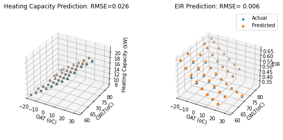{:width="700"}
{:refdef}

{:refdef: style="text-align: center;"}
Figure A-3. Comparisons of predicted and actual capacity and EIR
{:refdef}
