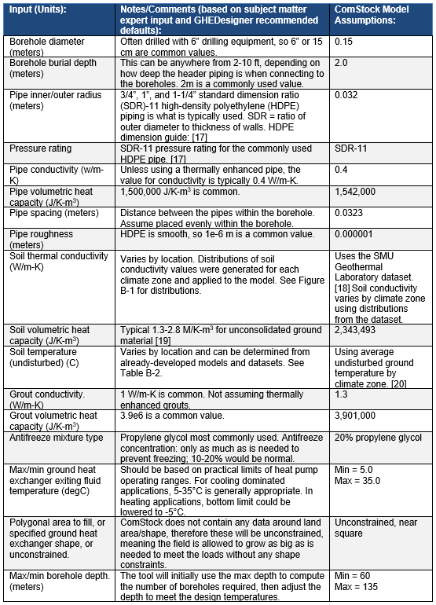

# Ground-Coupled Console Water-to-Air Heat Pump 
{: .fw-500 }
Author: Marlena Praprost, Amy Allen, Andrew Parker and Matt Leach

# Executive Summary

Building on the successfully completed effort to calibrate and validate the U.S. Department of Energy's ResStock™ and ComStock™ models over the past several years, the objective of this work is to produce national datasets that empower analysts working for federal, state, utility, city, and manufacturer stakeholders to answer a broad range of analysis questions.

The goal of this work is to develop energy efficiency, electrification, and demand flexibility end-use load shapes (electricity, gas, propane, or fuel oil) that cover most of the high-impact, market-ready (or nearly market-ready) measures.

An *end-use savings shape* is the difference in energy consumption between a baseline building and a building with an energy efficiency, electrification, or demand flexibility measure applied. It results in a time series profile that is broken down by end use and fuel (electricity or on-site gas, propane, or fuel oil use) at each time step.

ComStock is a highly granular, bottom-up model that uses multiple data sources, statistical sampling methods, and advanced building energy simulations to estimate the annual sub-hourly energy consumption of the commercial building stock across the United States. The baseline model intends to represent the U.S. commercial building stock as it existed in 2018.

This measure models the conversion of an existing heating, ventilating, and air-conditioning (HVAC) system to a series of "console" water-to-air heat pumps served by a ground heat exchanger. Console water-to-air pumps are all-in-one packages and have no or minimal ductwork. Properly designed ground heat exchanger-coupled systems can offer benefits in energy efficiency relative to "conventional" hydronic HVAC systems, as well as facilitating beneficial electrification. Console water-to-air heat pumps are not ducted (or minimally ducted) and serve individual spaces. They can be coupled to a ground loop on the source side, and can directly replace electric baseboard heaters or air-source packaged terminal heat pumps. Console water-to-air heat pumps can also bring in outdoor air for ventilation.

The Console GSHP upgrade demonstrates 1.0% total site energy savings (42 trillion British thermal units \[TBtu\]) for the U.S. commercial building stock modeled in ComStock (Figure 5). The measure was successfully applied to 11% of the ComStock floor area. The measure replaces all buildings with PTACs, PTHPs, baseboard electric, gas unit heaters, or residential furnace systems with console GSHPs, resulting in changes in several HVAC end uses:

-   **5.2%** stock **heating natural gas** savings (44.7 TBtu)

-   **14.2%** stock **heating other fuel** savings (11.0 TBtu)

-   **−26.9%** stock **heating electricity** savings (−47.2 TBtu)

-   **1.8%** stock **cooling electricity** savings (12.1 TBtu)

-   **−8.7%** stock **pump electricity** savings (−3.7 TBtu)

-   **5.0%** stock **fan electricity** savings (26.1 TBtu).

Three electricity grid scenarios are presented to compare the emissions of the ComStock baseline and the Console GSHP measure. Two scenarios---Long-Run Marginal Emissions Rate (LRMER) High Renewable Energy (RE) Cost 15-Year and LRMER Low RE Cost 15-Year---use the Cambium data set, and the last uses the Emissions & Generation Resource Integrated Database (eGRID) data set ​ \[1\], \[2\]​. Across the three electricity grid scenarios presented, electricity emissions increased by up to 1.3% (2 MMT CO2e) (Figure 6). Natural gas emissions dropped by 3.7% (3 MMT CO2e), resulting in an overall greenhouse gas reduction across all fuel types of 0.4-0.6% (1-2 MMT CO2e) depending on the grid scenario.

# Acknowledgments

The authors would like to acknowledge the valuable guidance and input provided by Garen Ewbank, Steve Hamstra, and Cary Smith of the GreyEdge Group, Zeyneb Magavi of HEET, and Kevin Kitz of KitzWorks. The authors would also like to thank the reviewers of this measure, Chris CaraDonna, Eric Bonnema, and Landan Taylor.

# 1. Introduction

## Accessing Results

This documentation covers the Ground-Coupled Console Water-to-Air Heat Pump Retrofit methodology and briefly discusses key results. Results can be accessed on the ComStock™ data lake "[end-use-load-profiles-for-us-building-stock](https://data.openei.org/s3_viewer?bucket=oedi-data-lake&prefix=nrel-pds-building-stock%2Fend-use-load-profiles-for-us-building-stock%2F)" or via the Data Viewer at [comstock.nrel.gov.](https://comstock.nrel.gov/)

## Measure Summary

| Measure Title       | Console Water-to-Air Ground-Source Heat Pump                                                                                                                                                                               |
|---------------------|----------------------------------------------------------------------------------------------------------------------------------------------------------------------------------------------------------------------------|
| Measure Definition  | This measure replaces an existing HVAC system with a ground-coupled console water-to-air heat pump.                                                                                                                        |
| Applicability       | Models with minimal or no ductwork, such as packaged terminal units, baseboard electric, gas unit heaters, or residential-style systems. This measure was applicable to 11% of the stock by floor area.                    |
| Not Applicable      | Models with ducted systems, such as packaged single-zone systems, packaged variable air volume systems (PVAVs), and variable air volume systems (VAVs). This measure was not applicable to 89% of the stock by floor area. |
| Release             | 2024 Release 1: 2024/comstock_amy2018_release_1/                                                                                                                                                                           |

# 2. Technology Summary

The carbon intensity of electricity in the United States declined by almost 40% from 2001 to 2020 \[3\], \[4\]. However, space and process heating needs continue to be met predominately by fossil fuels. Combustion of fossil fuels for space and domestic hot water heating accounts for roughly 10% of U.S. carbon emissions \[5\]. Properly designed ground heat-exchanger-coupled systems can offer benefits in energy efficiency relative to "conventional" hydronic heating, ventilating, and air-conditioning (HVAC) systems, and can facilitate beneficial electrification.

"Console" water-to-air heat pumps are not ducted (or are minimally ducted) and serve individual spaces. They are "all-in-one" units and can be coupled to a ground loop on the source side. Console water-to-air heat pumps can replace electric baseboard heaters or air-source packaged terminal heat pumps. They can also bring in outdoor air for ventilation.

Console water-to-air heat pumps are often used in multifamily buildings as well as in perimeter zones in offices and other buildings \[6\], \[7\]. Though different Air-Conditioning, Heating, and Refrigeration Institute (AHRI) standards exist to emulate different types of source loop equipment, water-to-air heat pumps sold in the United States are generally tested under all of them, and thus the same equipment can be used for water loops tied to ground heat exchangers or to cooling towers and boilers for heat rejection/addition. The AHRI standards of interest are Water Loop (AHRI 320), Ground Water (AHRI 325), and Ground Loop (AHRI 330).

Console water-to-air heat pumps consist of a refrigerant-to-water heat exchanger (which draws heat from or rejects heat to the condenser loop), an air-to-refrigerant coil (which conditions supply air), a blower, and, in some cases, limited ductwork. In the absence of ductwork, supply air is provided directly through a grille on the unit itself. These units can also incorporate hot-gas reheat coils to reheat subcooled/dehumidified air, and some have an option for supplemental electric heating . Console water-to-air heat pump coils (and coils of this nature in general) often have relatively high minimum entering air temperatures (50°F--55°F), as specified by the manufacturer; thus, if the units are providing outdoor air, gas or electric coils must be used to precondition the outdoor air in cold conditions \[8\], \[9\].

This measure is structured to allow the user to supply outdoor air through the console heat pumps, or through a separate dedicated outdoor air system (DOAS). Installation of a DOAS also presents an opportunity for implementation of other energy efficiency features, such as through implementation of energy recovery ventilation and/or demand-controlled ventilation (DCV). These features are generally not available within a console water-to-air heat pump due to the compact size of the unit.

# 3. ComStock Baseline Approach

By square footage, packaged terminal systems make up 7.2% of the ComStock™ baseline. There are four packaged terminal system types represented in the ComStock baseline, which are listed in Table 1 along with the square footage percentage that they make up.

Table 1. Breakdown of Packaged Terminal Heat Pump (PTHP) and Packaged Terminal Air Conditioner (PTAC) Systems in the ComStock Baseline by Square Footage Percentage

| HVAC System Type        | % of Baseline Square Feet |
|-------------------------|---------------------------|
| PTHP                    | 2.3                       |
| PTAC with electric coil | 2.8                       |
| PTAC with gas coil      | 1.1                       |
| PTAC with gas boiler    | 1.0                       |

The most prevalent packaged terminal systems are "PTHP" and "PTAC with electric coil," which make up roughly 2.3% and 2.8% of stock floor area, respectively. These system types are common in commercial buildings like hotels and small offices. The HVAC system type distributions are derived from Commercial Buildings Energy Consumption Survey 2012 microdata, which include data on building type, census division, heating fuel type, and HVAC system type \[10\].

# 4. Modeling Approach

Console water-to-air heat pumps are generally non-ducted or have minimal ducting and are intended to serve relatively small spaces. They are available in sizes from 0.5 to 1.5 tons \[8\], \[11\].

Some console water-to-air heat pumps offer outdoor dampers , and others do not \[8\], \[12\]. This measure will supply ventilation directly through the water-to-air heat pump, as opposed to separately through a DOAS. Console (and other) water-to-air heat pumps that are configured for providing outdoor air have relatively high minimum entering air temperature requirements. Thus, this measure will configure console units that are tempering outdoor air with an electric preheat coil.

## 4.1. Applicability

This measure is applicable to most buildings that have an existing packaged terminal system. The measure will be applicable to the four packaged terminal systems shown in Table 2 and make up 7.2% of the total baseline square footage in ComStock.

Table 2. Breakdown of Packaged Terminal HVAC Systems in the ComStock Baseline by Square Footage Percentage and Measure Applicability

| HVAC System Type        | % of Baseline Square Feet | Measure Applicable |
|-------------------------|---------------------------|--------------------|
| PTHP                    | 2.3                       | Applicable         |
| PTAC with electric coil | 2.8                       | Applicable         |
| PTAC with gas coil      | 1.1                       | Applicable         |
| PTAC with gas boiler    | 1.0                       | Applicable         |

In the case of the "PTAC with gas boiler" retrofit, the heating system in the baseline has hydronic distribution. To retrofit this system with a console ground-source heat pump (GSHP), the existing PTACs would be removed, as would the hydronic heating system, and a ground-coupled condenser water loop would be installed, serving new console water-to-air heat pumps.

In addition to packaged terminal systems, console water-to-air heat pumps are an appropriate retrofit for other non-ducted systems, such as baseboard heaters and unit heaters, or for residential-style systems. In some cases, the existing system in the baseline does not currently have cooling. Retrofitting a heating-only or cooling-only system with a GSHP could result in extreme load imbalance and negatively affect the performance of the ground heat exchanger over time \[13\]. Therefore, the heat pump will supply both heating and cooling to the building, and cooling will be added to heating-only systems via the console heat pump retrofit.

Table 3 shows the other systems that will receive the console retrofit and their corresponding percentage of the baseline stock. This brings the total percentage of the baseline stock to 12%, to which this measure is applicable.

Table 3. Breakdown of Other Non-Ducted HVAC Systems That Are Compatible With This Upgrade by Square Footage Percentage

| HVAC System Type                                   | % of Baseline Square Feet |
|----------------------------------------------------|---------------------------|
| Residential AC with residential forced air furnace | 4.1                       |
| Residential forced air furnace*                    | 0.7                       |
| Gas unit heaters*                                  | 0.2                       |
| Baseboard electric*                                | 0.1                       |

*\*Denotes no cooling in the baseline; cooling will be added via the GSHP*

This measure is focused on retrofits with ground heat exchangers serving individual buildings and is not intended to be applied to buildings tied to district thermal energy systems (described as "district chilled water" or "district hot water" in ComStock).

## 4.2. Technology Sizing, Performance, and Configuration

In this measure, the existing zone-level equipment is replaced with an air loop containing two coils intended to emulate the water-to-air heat pump and a Fan:OnOff object. The fan's nominal pressure rise is adjusted to account for the limited (or nonexistent) ductwork. The source side of the coils is tied to the common condenser water loop, which is coupled with a ground heat exchanger. The modeled heat pump configuration is shown in Figure 1. In the system configurations in which ventilation is supplied by a DOAS, the fan in the modeled heat pump cycles on and off with the heating or cooling load in the space. When ventilation is provided by the unit itself, the fan is modeled as running constantly during occupied hours to provide ventilation.

{:refdef: style="text-align: center;"}

{:refdef}

{:refdef: style="text-align: center;"}
Figure 1. Modeled heat pump configuration, with the optional cooling tower shown in a dashed-line box
{:refdef}

### 4.2.1. Configuration

The heat pump coils are represented with the Coil:Cooling:WaterToAirHeatPump:EquationFit and Coil:Heating:WaterToAirHeatPump:EquationFit component models in EnergyPlus®. The EquationFit coil models in EnergyPlus are simple curve-fit models that use coefficients generated from performance data for specific heat pump models. The models use five nondimensional curves to characterize the heat pump's performance in heating and cooling mode.

Curves will be fitted based on manufacturer data for packaged water-to-air heat pumps in several different capacities, using the generalized least squares method, which seeks to minimize differences between the model outputs and catalog data. (This process will initially be performed using data from a Trane GEC series console water-to-air heat pump, available in capacities of 0.5 to 1.5 tons.) \[8\]. The measure will select a set of appropriate curves based on the auto-sized capacity of the heat pump. This approach will leverage the single-speed equation fit model. In heating mode, curves for heat delivered and power draw are required. In cooling, curves for total heat rejection, sensible heat rejection, and power draw are required. The curves also include a scalar offset. In Appendix A, Table A-1 shows the variables used in each curve. The values of each variable are normalized by the reference conditions. Performance data are available from the manufacturer over a range of entering water temperatures and source-side flow rates that are representative of those that we would expect for this application, and for given entering air temperatures and airflow rates. Changes in capacity based on different entering airflow temperatures can be addressed through adjustment factors provided by the manufacturer \[8\].

Selected console water-to-air heat pumps available from major manufacturers have rated values of energy efficiency ratio in cooling (at 77°F entering water temperature) of 14--17 and of coefficient of performance (COP) in heating (at 32°F entering water temperature) of 3.2--3.5 \[8\], \[11\]. These test conditions assume the use of glycol in the ground loop. A 1-ton unit operating in cooling with an entering water temperature of 86°F would be expected to exhibit an energy efficiency ratio in the range of 11--15, depending on water flow, entering air temperature, and water-side pressure drop, based on manufacturer data \[8\], \[11\]. The same unit operating in heating with an entering water temperature of 45°F could be expected to operate with a COP of 3.5 to 4.0 \[8\], \[11\]. The COP and energy efficiency ratio values stated here include fan power.

### 4.2.2. Sizing

In conjunction with the ground heat exchanger sizing measure, this measure gives users the ability to specify on what load (heating or cooling) and on what fraction of load (ranging from 20% to 100%), they wish to size the ground heat exchanger. If the ground heat exchanger is sized to less than 100% of the dominant load (heating or cooling), supplemental equipment will be used (an electric heating coil, cooling tower, or both, depending on the need). An electric heating coil will be incorporated into the air loop on the building side, and a cooling tower will be connected to the ground loop. This configuration is generally based on the recommendations of Kavanaugh and Rafferty \[13\].

While the EnergyPlus model of the system uses two separate coils to represent heating and cooling operation, a water-to-air heat pump has a single refrigerant-to-air coil that performs either heating or cooling, depending on the mode. Since water-to-air heat pump coils often require relatively high minimum entering air temperatures of 50°F--55°F , an electric preheat coil to temper outdoor air is modeled as part of the heat pump air loop if the unit is providing outdoor air.

If no outdoor air is being provided, both coils are sized to the same value, based on the higher of the cooling load, excluding ventilation loads. If ventilation air is being provided, the preheat coil is sized to temper the expected mixed air flow rate, with outdoor air at design heating conditions, to 55°F, to provide a suitable entering air temperature for the heat pump coil. The heat pump coils are then sized to the same capacity based on the cooling load. This is consistent with typical practice in sizing heat pumps. If the heating load exceeds the cooling load, both excluding ventilation, the preheat coil is increased in size accordingly or a supplemental heating coil is added.

The heating and cooling capacities and load-side air and water flow rates of the heat pumps are sized based on the zone loads (including ventilation if the heat pumps are to condition outdoor air). The source-side mass flow rates are selected based on a common benchmark of 3 gallons per minute per ton .

### 4.2.3. Ground Loop Control

A pair of parallel circulation pumps on the condenser loop are controlled to maintain the temperature entering the heat pumps within a desired temperature range (with an initially suggested range of 32°F--80°F with a heating load dominant scenario and 40°F--90°F with a cooling load dominant scenario, based on manufacturer ratings). (This temperature range assumes the use of antifreeze in the ground loop.) The loop temperature set point range can be adjusted by the user. Adjusting this temperature set point range enables trade-offs to be optimized between circulation pump and heat pump energy use. If a cooling tower is present, it is activated only if the ground heat exchanger is unable to meet the set point at a user-adjustable fraction of maximum flow (80% is suggested as an initial value). Control of the cooling tower to a leaving water temperature is consistent with the approach outlined in the American Society of Heating, Refrigeration, and Air-Conditioning Engineers (ASHRAE) *HVAC Applications* Handbook .

A variable-speed circulation pump on the ground loop is controlled to a temperature differential across the ground-loop side of the water-to-water heat exchanger, with the set point value configurable by the user at a recommended value of 5°F to 10°F. Installed pump power of less than 75 watts/ton is a common benchmark for energy efficiency for ground-coupled heat pump systems. A small circulation pump serving each heat pump is engaged to operate only when its heat pump is on. The configuration of a constant-flow loop with bypasses at each heat pump is consistent with an approach proposed by Mescher (2009) and recommended for controls simplicity and energy performance \[14\].

## 4.3. Additional Energy Efficiency Features 

If the user elects to model a DOAS to supply ventilation, several additional options for energy efficiency features are available: demand-controlled ventilation and energy recovery ventilation. These options are not generally available on console water-to-air heat pumps (due to their compact configuration) but could be implemented through a DOAS.

DCV controls ventilation levels based on occupancy and is typically applied in spaces that have varying occupancy, such as conference rooms. DCV generally uses carbon dioxide (CO2) levels measured in a zone to control ventilation levels. A DOAS can be equipped to control supply fans based on CO2 sensors. Implementation of DCV based on occupancy levels is an option in this measure. Implementation of economizers will be included in this measure.

## 4.4. GHEDesigner Workflow

GHEDesigner is a Python package for designing ground heat exchangers used with ground-source heat pump systems \[15\]. The GSHP upgrade measures leverage GHEDesigner for sizing the vertical ground heat exchangers used in the ComStock models. GHEDesigner is called and run within the GSHP measures. Figure 2 shows the full ComStock GSHP measure workflow. First, the GSHP measure is applied which replaces the existing system with one of the GSHP configurations. An initial sizing run determines the annual loads the ground heat exchanger needs to supply. The ground loads are exported to GHEDesigner in the form of a JavaScript Object Notation (JSON) file. GHEDesigner runs calculations to determine the g-function, which is used to size the ground heat exchanger in the model. A final simulation is run with the ground heat exchanger sized to the full building load. Each step is described in more detail below.  

{:refdef: style="text-align: center;"}

{:refdef}

{:refdef: style="text-align: center;"}
Figure 2. ComStock GHEDesigner workflow
{:refdef}

First, the GSHP measure is applied. As part of the GSHP retrofit, a ground loop is added to the model where the ground heat exchanger will be installed. To properly size the ground heat exchanger, the GHEDesigner tool needs to know the building's hourly heating and cooling loads for the entire year. To achieve this, a temporary "dummy" ground heat exchanger is added to the ground loop in the form of a PlantComponent:TemperatureSource object.

The temperature source object regulates the water supply temperature to meet the building demand for every hour of the annual simulation. In turn, this object outputs the hourly heating and cooling loads to be met by the ground heat exchanger. By passing the ground loads directly from the ComStock initial sizing run, we are inherently sizing the ground heat exchanger to meet the entire building load with the GSHP. In other words, we are sizing to the larger of the heating or cooling loads. Other sizing approaches, such as sizing to the smaller load and providing supplemental heating or cooling, could be used to attempt to minimize the size of the borefield. However, this workflow currently sizes the heat pumps to meet the full building load. The hourly loads are exported to a JSON file, and the GHEDesigner Python package is called within the measure. 

In addition to the hourly ground loads, the JSON file contains assumptions related to borefield and soil properties. Table B-1 in Appendix B summarizes the GHEDesigner input assumptions used by the ComStock model and gives a brief description or justification of why that assumption was selected. Some of the inputs are GHEDesigner recommended defaults while others are modified from the default values for this application. Internal and external subject matter experts were consulted to ensure reasonable assumptions. In addition, the ComStock team worked closely with other ongoing GSHP projects to align assumptions where possible across modeling efforts.

One important reminder is that ComStock is a representative model of the U.S. commercial building stock, not a model of specific buildings. GSHP and borefield design can be site-specific and include soil properties, land constraints, etc. However, the ComStock model has limited geographic integrity below the county level and does not have site-specific data for every location to inform custom design choices. Therefore, some assumptions must be made more broadly across climate zones or nationally.

When the GHEDesigner tool receives the JSON file, it uses the properties and hourly loads to size the borefield and generate a g-function. Temperature response functions, known as g-functions, are a computationally efficient method for simulating ground heat exchangers, used with GSHP systems, either as part of a whole-building energy simulation or as part of a dedicated ground heat exchanger design tool \[16\]. GHEDesigner sends a JSON file back to the ComStock simulation containing the key parameters such as number of boreholes, borehole length and radius, ground properties, and g-function values. The ComStock measure then replaces the temporary "dummy" ground heat exchanger object with an actual vertical ground heat exchanger object. The measure parses the information from the JSON and inputs it into the GroundHeatExchanger:Vertical object. The annual simulation is then rerun with the new configuration. This second annual run generates the results that are used for analysis. An example illustration of the full workflow is illustrated in Figure 3. 

{:refdef: style="text-align: center;"}

{:refdef}

{:refdef: style="text-align: center;"}
Figure 3. Example plant loop configuration showing location of ground loop and temperature source/vertical ground heat exchanger object
{:refdef}

## 4.5. Limitations and Concerns

The representation of heat pump performance in EnergyPlus relies on data obtained by manufacturers. These data do not fully represent all heat pumps of this type available in the United States.

# 5. Output Variables

Table 4 includes a list of output variables that are calculated in ComStock. These variables are important in terms of understanding the differences between buildings with and without the Console Water-to-Air Ground-Source Heat Pump measure applied. Additionally, these output variables can also be used for understanding the economics (e.g., return on investment) of the upgrade if cost information (i.e., material, labor, and maintenance cost for technology implementation) is available.

Table 4. Output Variables Calculated From the Measure Application

| Variable Name                                | Description                                             |
|----------------------------------------------|---------------------------------------------------------|
| com_report_ghx_borehole_depth_ft             | Borehole depth calculated from GHEDesigner (feet)       |
| com_report_ghx_design_flow_rate_ft_3_per_min | Ground heat exchanger flow rate (cubic feet per minute) |
| com_report_ghx_num_boreholes                 | Number of boreholes calculated from GHEDesigner         |

# 6. Results

In this section, results are presented both at the stock level and for individual buildings through savings distributions. Stock-level results include the combined impact of all the analyzed buildings in ComStock, including buildings that are not applicable to this upgrade. Therefore, they do not necessarily represent the energy savings of a particular or average building. Stock-level results should not be interpreted as the savings that a building might realize by implementing the Console GSHP upgrade measure.

Total site energy savings are also presented in this section. Total site energy savings can be a useful metric, especially for quality assurance/quality control, but this metric on its own can have limitations for drawing conclusions. Further context should be considered, as site energy savings alone do not necessarily translate proportionally to savings for a particular fuel type (e.g., gas or electricity), source energy savings, cost savings, or greenhouse gas savings. This is especially important when an upgrade impacts multiple fuel types or causes decreased consumption of one fuel type and increased consumption of another. Many factors should be considered when analyzing the impact of an energy efficiency or electrification strategy, depending on the use case.

## 6.1. Single Building Example

This section will demonstrate the functionality of this measure on a single building model. The building is a 37,500-square-foot small hotel in Toole County, Montana (climate zone 6B). This building starts with a PTAC system with electric coils. After retrofitting this system with a packaged ground-source heat pump system, the resulting borefield contained 56 boreholes, each with a depth of 125 meters. The default borehole spacing is 5 meters and the borefield shape is set to "near-square", therefore this is a 7-by-8 borefield with an area of approximately 1050 square meters. The existing packaged single-zone system had an average direct-expansion cooling COP of 3.45, and the new water-to-air GSHPs have an average cooling COP of 6.2. The existing gas coils had an efficiency of 1.0, and the new water-to-air GSHPs have an average heating COP of 3.8. The vertical ground heat exchanger object was sized using the GHEDesigner tool \[15\].

The energy consumption of the building broken out by end use is plotted in Figure 4 before and after the GSHP measure was applied. This building experienced total site energy savings of 6%, which includes a 52% decrease in cooling and a 55% increase in electric heating. Pumps also had an increase in consumption and fans had a decrease in consumption as a result of the heat pump installation. When the GSHP is installed, an additional pump is added to the loop, so we expect and increase in pump energy. Fan energy saw a decrease because the new GSHP system allows for more outdoor air compared with the PTACs in the baseline, which can reduce the demands on cooling and fans during advantageous times of year.

{:refdef: style="text-align: center;"}

{:refdef}

{:refdef: style="text-align: center;"}
Figure 4. Energy consumption by end use in kilowatt-hours (kWh) for baseline vs. Console GSHP upgrade scenarios; all loads and HVAC-only loads shown side by side.
{:refdef}

The peak load of the building was reduced by 8.9% as result of the GSHP installation. The estimated total emissions from the building decreased by 6.3% as a result of nearly full electrification of the upgrade. While the heating was already electric in the baseline, the energy savings as a result of the heat pump reduced the total emissions of the building. Typical utility bills for the building are calculated via ComStock for a variety of rate structures available in the utility region of this building. No electricity rate structures were in the utility rate database for this rural Montana building, so the average electricity price of \$0.09/kWh for the state was used for the utility bill calculation. After the Console GSHP upgrade was applied to this building, the annual electricity bill is estimated to decrease by 9.0% (\$5,433 USD).

## 6.2. Stock Energy Impacts

The Console GSHP upgrade demonstrates 1.0% total site energy savings (42 trillion British thermal units \[TBtu\]) for the U.S. commercial building stock modeled in ComStock (Figure 5). The measure was successfully applied to 11% of the ComStock floor area. The measure replaces all buildings with PTACs, PTHPs, baseboard electric, gas unit heaters, or residential furnace systems with console GSHPs, resulting in changes in several HVAC end uses:

-   **5.2%** stock **heating natural gas** savings (44.7 TBtu)

-   **14.2%** stock **heating other fuel** savings (11.0 TBtu)

-   **−26.9%** stock **heating electricity** savings (−47.2 TBtu)

-   **1.8%** stock **cooling electricity** savings (12.1 TBtu)

-   **−8.7%** stock **pump electricity** savings (−3.7 TBtu)

-   **5.0%** stock **fan electricity** savings (26.1 TBtu).

{:refdef: style="text-align: center;"}

{:refdef}

{:refdef: style="text-align: center;"}
Figure 5. Comparison of annual site energy consumption between the ComStock baseline and the Console GSHP scenarios. Energy consumption is categorized both by fuel type and end use.
{:refdef}

The Console GSHP measure has relatively low applicability compared to the other two GSHP configurations, with 11% of the stock floor area receiving the upgrade. This measure reduces stock-level natural gas heating by 5.2% and stock-level other fuel heating by 14.2%, as implementation of the Console GSHP results in nearly full electrification of space heating in buildings for which it is applicable. HVAC systems that use "other fuel" for heating for which this measure is applicable primarily include residential furnace systems that run on propane or fuel oil. For applicable buildings, natural gas heating and other fuel heating were completely electrified by this upgrade.

There is a 27% increase in electric heating, which is to be expected when transitioning from gas heating to electric heating. The magnitude of the gas and other fuel heating savings (55.7 TBtu) is slightly higher than the magnitude of the electric heating increase (47.2 TBtu), resulting in a 0.7% savings in stock-level heating across all fuels. For applicable buildings only, the total heating savings across all fuels is 11.9%. The heating savings appear slightly low considering the heating COP of the new heat pumps is 3--4 times the efficiency of the existing heating systems. It is worth noting that some of the systems in the baseline already had heat pumps (e.g. PTHP) or electric resistance heating (e.g. PTAC with electric coil, baseboard electric) so there is lower opportunity for savings when replacing these system types due to their starting efficiency. In addition, outdoor air in the upgrade scenario is coming through the console heat pump units, which is how these units typically operate in practice. However, many of the HVAC systems for which this upgrade is applicable had minimal or no outdoor air in the baseline. Therefore, when the heat pumps were added, the addition of outdoor air can negatively affect the heating load, especially in cold climates. It was important to include outdoor air in the upgraded system because this is how they normally operate; however, it may be muting some of the savings attributed to the GSHPs.

The cooling end use saw 2% savings at the stock level and 22% savings for applicable buildings only. It is important to note that some systems that received this upgrade (e.g. baseboard electric, gas unit heaters, residential furnace) did not have cooling in the baseline. Therefore, cooling load was added to these buildings when receiving the Console GSHP upgrade, as operating a GSHP system on a building without cooling would result in an unbalanced load and thus unstable ground temperatures over time. The added cooling load offsets some of the cooling savings realized by the heat pump COP; therefore, the total cooling savings is not quite as high as expected. However, the addition of outdoor air could be showing additional cooling savings in some climates. Once again, because some systems are undergoing more substantial changes to their HVAC features (such as the addition of cooling or outdoor air), it is more difficult to isolate the savings solely attributed to the GSHPs. However, it was important to model the Console GSHP system as it would operate in practice.

The pump end use, while making up a small portion of the total stock energy, realized an 8.8% stock-level increase due to the pumping demands of the ground and condenser loops of the GSHP system. Fan energy experienced a large energy reduction compared to the baseline. The Console GSHP upgrade assumed a low static pressure rise for fans, as these units are meant to represent non-ducted systems. This has had a substantial impact on fan energy in applicable buildings and will be further investigated.

## 6.3. Stock Greenhouse Gas Emissions Impact

ComStock simulation results show greenhouse gas emissions avoided across all electricity grid scenarios for all on-site combustion fuel types (Figure 6). Across all fuels, greenhouse gas emissions avoided are 1 to 2 million tons of CO2 equivalent (0.4-0.5%), depending on the grid scenario chosen. Because this upgrade is only applicable to 11% of the stock floor area, stock-level emissions impacts are rather minimal. In addition, cooling and outdoor air were added to some buildings via the console GSHP upgrade, so energy savings potential can be muted by the inclusion of these feature upgrades. Electricity greenhouse gas emissions increased by 2 MMT (0.6% to 1.3%) across the three scenarios. Because this upgrade involves electrifying the space heating load in applicable buildings, an increase in electricity emissions is to be expected.

Natural gas emissions avoided by this upgrade equate to 3 million tons of CO2, or 3.7%. This is driven by transitioning natural gas heating systems in applicable buildings. The natural gas results remain consistent across all three grid scenarios, as these scenarios exclusively pertain to modifications within the electricity grid without affecting natural gas outcomes.

{:refdef: style="text-align: center;"}

{:refdef}

{:refdef: style="text-align: center;"}
Figure 6. Greenhouse gas emissions comparison of the ComStock baseline and the Console GSHP scenarios.
{:refdef}

{:refdef: style="text-align: center;"}
Three electricity grid scenarios are presented: Cambium Long-Run Marginal Emissions Rate (LRMER) High Renewable Energy (RE) Cost 15-Year, Cambium LRMER Low RE Cost 15-Year, and eGrid. MMT stands for million metric tons, and GHG stands for greenhouse gas.
{:refdef}

## 6.4. Site Energy Savings Distributions

This section discusses site energy consumption for quality assurance/quality control purposes. Note that site energy savings can be useful for these purposes, but other factors should be considered when drawing conclusions, as they do not necessarily translate proportionally to source energy savings, greenhouse gas emissions avoided, or energy cost.

Figure 7 shows the percent savings distributions of the baseline ComStock models versus the Console GSHP upgrade by end use and fuel type for applicable models. In other words, each data point in the distribution represents the percent energy savings between a baseline ComStock model and the corresponding upgrade model with measures applied.

Natural gas heating and other fuel heating show nearly 100% savings in most buildings. A few buildings showed less than 100% natural gas savings. This was found to be mostly warehouse buildings that began with gas heating. Some warehouse spaces can have such low heating requirements that installing a heat pump in those spaces would not be realistic. In those zones, the existing natural gas heating system was maintained so the gas heating savings were not 100%. In general, these loads make up a negligible part of the full stock consumption.

For the electric heating end use, some buildings experienced an increase while others experienced a decrease. It is important to note that this plot only shows buildings that started out with some amount of electric heating, most commonly buildings with "PTAC with electric coil," "PTHP," or "baseboard electric" systems. Buildings that started with 100% natural gas heating would have an infinite increase in electric heating and are therefore not shown on this plot. As discussed previously, this measure added outdoor air through the console heat pumps, which is not present in the baseline for baseboard electric systems. PTAC units typically have some outdoor air through the unit, but the flow rate and fraction is relatively low. Therefore, the addition of more substantial outdoor air in the upgrade resulted in heating penalties in some buildings. We also expect PTHP systems to realize lower savings since the baseline system already has a heat pump. The median building had approximately 10% electric heating savings compared to the baseline, which is attributed to the COP improvements of the heat pumps compared to the baseline heating efficiency, but which is offset by implications of the outdoor air changes.

Cooling energy in applicable buildings decreased by an average of 10% as a result of replacing existing direct-expansion cooling systems with more efficient heat pumps. Some buildings experienced cooling penalties, which is a result of adding a new cooling load to buildings that did not have any cooling in the baseline (e.g. baseboard electric, gas unit heater, residential furnace). However, the average and median building in the stock did experience cooling savings as a result of the upgrade.

Most buildings that received the upgrade experienced substantial fan savings. As previously mentioned, this is a result of the low static pressure assumptions for fans in the upgrade scenario. This is an area for further investigation. Pump energy increased in some buildings and decreased in others, with the median building having \<5% change in pump energy. Pumps represent a relatively small percentage of the overall stock energy (\<2%), so changes in this end use have minimal effects at the stock level. However, we can primarily attribute large changes in pump energy to the addition of the ground and condenser loops for the heat pump.

Minimal or no differences were observed for service water heating systems, refrigeration, interior lighting, and interior equipment, as these systems are not directly impacted by the upgrade. However, some buildings show minor changes due only to subtle differences in ambient air temperature that affect the operation of these systems.

{:refdef: style="text-align: center;"}

{:refdef}

{:refdef: style="text-align: center;"}
Figure 7. Percent site energy savings distribution for ComStock models with the Console GSHP upgrade applied by end use and fuel type.
{:refdef}

{:refdef: style="text-align: center;"}
The data points that appear above some of the distributions indicate outliers in the distribution, meaning they fall outside 1.5 times the interquartile range. The value for *n* indicates the number of ComStock models that were applicable for energy savings for the fuel type category.
{:refdef}

## 6.5. Peak Impacts

Figure 8 shows the impact of the Console GSHP upgrade on seasonal peak hours. The winter peak is shifted slightly earlier in the day as morning electric heating now has more influence on peak load in winter. The shoulder peak and summer peak moved slightly later in the day. Because the efficiency of the new GSHP system is no longer dependent on outdoor air temperature, as is the case with the direct-expansion cooling systems in the baseline, we may expect the cooling dominated peaks to change timing slightly with the new systems.

{:refdef: style="text-align: center;"}

{:refdef}

{:refdef: style="text-align: center;"}
Figure 8. Maximum daily peak timing by season between the baseline and the Console GSHP scenarios
{:refdef}

Figure 9 shows the impact of the Console GSHP upgrade on seasonal peak intensity for the median building. Summer peaks are reduced across all climate zones due to cooling savings from the GSHP. The summer peak intensity was reduced by 3--8% in all climate zones. The subarctic climate zone does not have any days in the year that are considered "summer," which is why this part of the graph is blank.

Winter peaks in heating-dominated climates (Cold, Very Cold) experienced a 5--7% increase due to the increase in electric heating load. The median peak intensity in the subarctic climate did not change because there were a very small sample size for this climate zone. In the remaining cooling-dominated and moderate climates, the peak intensity was reduced by 0--4%. This is because heating is not as big a driver of the winter peak in these climates, so the HVAC efficiency improvements outweighed the added heating load. In shoulder seasons, the peak intensity was reduced across all climates by 0%--4% due to the HVAC efficiency improvements of the GSHPs.

{:refdef: style="text-align: center;"}

{:refdef}

{:refdef: style="text-align: center;"}
Figure 9. Maximum daily peak intensity by season between the baseline and Console GSHP scenarios
{:refdef}

# 7. References

\[1\] National Renewable Energy Laboratory, \"Cambium,\" \[Online\]. Available: <https://www.nrel.gov/analysis/cambium.html>. \[Accessed 2 September 2022\].

\[2\] United States Environmental Protection Agency, \"Emissions & Generation Resource Integrated Database (eGRID),\" 30 January 2024. \[Online\]. Available: <https://www.epa.gov/egrid>.

\[3\] G. Schivley, I. Azevedo and C. Samaras, \"Assessing the evolution of power sector carbon intensity in the United States,\" *Environmental Research Letters,* 2018.

\[4\] US EIA , \"In 2020, the United States produced the least CO2 emissions from energy in nearly 40 years,\" 26 July 2021. \[Online\]. Available: <https://www.eia.gov/todayinenergy/detail.php?id=48856>.

\[5\] S. Billimoria, M. Henchen, L. Guccione and L. Louis-Prescott, \"The Economics of Electrifying Buildings: How Electric Space and Water Heaitng Supports Decarbonization of Residential Buildings,\" Rocky Mountain Institute, 2018.

\[6\] TRANE, \"Product Catalog: Water Source Heat Pump Axiom Rooftop\--GWS\*,\" Trane Technologies, Dublin, Ireland, 2021.

\[7\] Steven Winter Associates, \"HEAT PUMP RETROFIT STRATEGIES,\" Natural Resources Defense Council, 2019.

\[8\] TRANE, \"Water-Source Heat Pump Axiom High Efficiency Console GEC,\" Trane Technologies, Dublin, Ireland, 2021.

\[9\] United Techologies, \"Water-Cooled and Condenserless Liquid Chillers/Water-Sourced Heat Pumps: 61WG/30WG/30WGA,\" Carrier, N.D..

\[10\] A. e. a. Parker, \""ComStock Reference Documentation: Version 1,",\" NREL, Golden, CO, 2023.

\[11\] Daikin, \"Enfinity™ Console Water Source Heat Pumps,\" Daikin Industries, 2020.

\[12\] Bosch, \"Bosch Water-Source Heat Pump CA Model,\" Bosch, Watertown, MA., 2021.

\[13\] S. Kavanaugh and K. Rafferty, \"Ground-source heat pumps : design of geothermal systems for commercial and institutional buildings,\" ASHRAE, Atlanta, GA, 1997.

\[14\] K. Mescher, \"One-Pipe Geothermal Design: Simplified GCHP System,\" *ASHRAE Journal,* pp. 24-40, 2009. 

\[15\] United States Department of Energy, \"GHEDesigner 1.5,\" 3 April 2024. \[Online\]. Available: <https://pypi.org/project/GHEDesigner/>.

\[16\] J. Spitler, J. Cook and X. Liu, \"Recent Experiences Calculating g-functions for Use in Simulation of Ground Heat Exchangers,\" Oklahoma State University; Oak Ridge National Laboratory, 2020.

\[17\] PVC Plus, \"PE 3608/3408 IPS HDPE PIPE SIZES,\" \[Online\]. Available: <http://www.pvcplus.com/media/website_product.pdfSpecs/en-CA/HDPE%20pipe.pdf>. \[Accessed 15 December 2023\].

\[18\] Dedman College of Humanities and Sciences; Roy M Huffington Department of Earth Sciences, \"SMU Geothermal Lab \| Data and Maps \| Temperature Maps,\" \[Online\]. Available: <https://www.smu.edu/dedman/academics/departments/earth-sciences/research/geothermallab/datamaps/temperaturemaps>. \[Accessed 15 December 2023\].

\[19\] C. Temizel, T. Tuna, M. M. Oskay and L. A. Saputelli, \"Reservoir engineering formulas and calculations,\" in *Formulas and Calculations for Petroleum Engineering*, Oxford, UK, Elsevier Inc., 2019, pp. 1-70.

\[20\] L. Xing, \"Estimations of undisturbed ground temperatures using numerical and analytical modeling,\" Oklahoma State University, Stillwater, Oklahoma, 2014.

\[21\] American Society of Heating, Refrigeration, and Air-Conditioning Engineers, \"HVAC Applications,\" ASHRAE, Atlanta, Georiga. , 2019.

\[22\] TRANE, \"The Impact of Variable-Speed Drives,\" Trane, Dublin, Ireland , 2013.

\[23\] TRANE, \"\"Engineers\' Newsletter: Energy-Saving Strategies for Water-Source Heat Pump Systems.\",\" TRANE, Dublin, Ireland, 2007.

# A. Heat Pump Performance Curves

Table A-1. Variables Used in Heat Pump Performance Curves

| Curve                  | Mode     | Variables                                                                                                                                                         |
|------------------------|----------|-------------------------------------------------------------------------------------------------------------------------------------------------------------------|
| Total heat transfer    | Cooling  | Entering air wet bulb temperature, entering water temperature, load side volumetric airflow, source-side volumetric water flow                                    |
| Sensible heat transfer | Cooling  | Entering air dry bulb temperature, entering air wet bulb temperature, entering water temperature, load side volumetric airflow, source-side volumetric water flow |
| Total power draw       | Cooling  | Entering air wet bulb temperature, entering water temperature, load side volumetric airflow, source-side volumetric water flow                                    |
| Total heat transfer    | Heating  | Entering air dry bulb temperature, entering water temperature, load-side volumetric airflow, source-side volumetric water flow                                    |
| Total power draw       | Heating  | Entering air dry bulb temperature, entering water temperature, load-side volumetric airflow, source-side volumetric water flow                                    |

# B. Ground Temperatures and Soil Conductivity Assumptions

Table B-1. Summary of GHEDesigner Input Assumptions

{:refdef: style="text-align: center;"}

{:refdef}

Table B-2. Average Undisturbed Ground Temperatures by IECC 2012 Climate Zone According to the Simplified Design Model and Site Locations​ \[20\]​

| 2012 IECC Climate zone | Annual average undisturbed ground temperature (C) |
|------------------------|---------------------------------------------------|
| 1A                     | 25.9                                              |
| 2A                     | 20.9                                              |
| 2B                     | 25.0                                              |
| 3A                     | 17.9                                              |
| 3B                     | 19.7                                              |
| 3C                     | 17.0                                              |
| 4A                     | 14.7                                              |
| 4B                     | 16.3                                              |
| 4C                     | 13.3                                              |
| 5A                     | 11.5                                              |
| 5B                     | 12.9                                              |
| 6A                     | 9.0                                               |
| 6B                     | 9.3                                               |
| 7A                     | 7.0                                               |
| 7AK                    | 5.4                                               |
| 7B                     | 6.5                                               |
| 8AK                    | 2.3                                               |

{:refdef: style="text-align: center;"}

{:refdef}

{:refdef: style="text-align: center;"}
Figure B-1. Soil Conductivity Distributions by Climate Zone (W/m-K)
{:refdef}