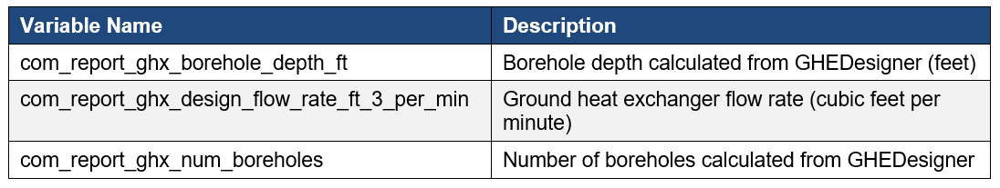

# Ground-Coupled Packaged Water-to-Air Heat Pump
{: .fw-500 }

Author: Marlena Praprost, Amy Allen, Andrew Parker, and Matthew Leach

# Executive Summary

Building on the successfully completed effort to calibrate and validate the U.S. Department of Energy's ResStock™ and ComStock™ models over the past 3 years, the objective of this work is to produce national datasets that empower analysts working for federal, state, utility, city, and manufacturer stakeholders to answer a broad range of analysis questions.

The goal of this work is to develop energy efficiency, electrification, and demand flexibility end-use load shapes (electricity, gas, propane, or fuel oil) that cover a majority of the high-impact, market-ready (or nearly market-ready) measures.

An *end-use savings shape* is the difference in energy consumption between a baseline building and a building with an energy efficiency, electrification, or demand flexibility measure applied. It results in a time series profile that is broken down by end use and fuel (electricity or on-site gas, propane, or fuel oil use) at each time step.

ComStock is a highly granular, bottom-up model that uses multiple data sources, statistical sampling methods, and advanced building energy simulations to estimate the annual sub-hourly energy consumption of the commercial building stock across the United States. The baseline model intends to represent the U.S. commercial building stock as it existed in 2018.

This documentation focuses on a single measure, involving the retrofit of single-zone packaged rooftop units with packaged rooftop water-to-air heat pumps, tied to a common condenser loop coupled with a ground heat exchanger. Rooftop units are the most prominent commercial building heating, ventilating, and air-conditioning system type and therefore should be prioritized for decarbonization solutions. Additional energy efficiency measures, including the enhancement of air-side economizing, demand-controlled ventilation, and the implementation of energy recovery ventilators, can also be considered in conjunction with this retrofit. This measure is applicable to approximately 45% of the ComStock floor area.

The Packaged GSHP upgrade demonstrates 11.7% total site energy savings (507 trillion British thermal units \[TBtu\]) for the U.S. commercial building stock modeled in ComStock (Figure 7). The measure was successfully applied to 56% of the ComStock floor area. The measure replaces all PSZ and packaged VAV systems with packaged GSHPs, resulting in changes to several HVAC end uses:

-   **53.2%** stock **heating natural gas** savings (455.2 TBtu)

-   **−43.2%** stock **heating electricity** savings (−75.6 TBtu)

-   **19.9%** stock **cooling electricity** savings (132.6 TBtu)

-   **−58.9%** stock **pump electricity** savings (−25.1 TBtu)

-   **−4.3%** stock **fan electricity** savings (−22.4 TBtu).

Three electricity grid scenarios are presented to compare the emissions of the ComStock baseline and the Packaged GSHP measure. Two scenarios---Long-Run Marginal Emissions Rate (LRMER) High Renewable Energy (RE) Cost 15-Year and LRMER Low RE Cost 15-Year---use the Cambium data set, and the last uses the Emissions & Generation Resource Integrated Database (eGRID) data set​ \[1\], \[2\]​. Across the three electricity grid scenarios presented, electricity emissions increased by 0.6-5.9% (2-9 MMT CO2e). Natural gas emissions dropped by 38.3% (31 MMT CO2e), resulting in an overall greenhouse gas reduction across all fuel types of 8-10% (25-32 MMT CO2e) depending on the grid scenario.

# Acknowledgements 

The authors would like to acknowledge the valuable guidance and input provided by Garen Ewbank, Steve Hamstra, and Cary Smith of the GreyEdge Group, Zeyneb Magavi of HEET, and Kevin Kitz of KitzWorks.

# 1. Introduction  

This documentation covers the Packaged Water-to-Air Ground Source Heat Pump Retrofit upgrade methodology and briefly discusses key results. Results can be accessed on the ComStock™ data lake "[end-use-load-profiles-for-us-building-stock](https://data.openei.org/s3_viewer?bucket=oedi-data-lake&prefix=nrel-pds-building-stock%2Fend-use-load-profiles-for-us-building-stock%2F)" or via the Data Viewer at [comstock.nrel.gov](https://comstock.nrel.gov/).

| **Measure Title**      | Packaged Water-to-Air Ground Source Heat Pump                                                                                                                                                                                  |
| **Measure Definition** | This measure replaces existing packaged rooftop systems with packaged rooftop water-to-air heat pumps tied to a ground-coupled loop. |
| **Applicability**      | Models with gas-fired or electric resistance packaged rooftop systems.                                                                   |
| **Not Applicable**     | Models that do not contain gas-fired or electric resistance packaged rooftop units or packaged VAV systems.                                                                                          |
| **Release**            | 2024 Release 1: 2024/comstock_amy2018_release_1/                                                                                                                                                                |

# 2. Technology Summary

Many technologies are used to provide space heating in commercial building heating, ventilating, and air conditioning (HVAC) systems. Twenty percent of the U.S. commercial building sector's energy usage is from on-site combustion of fossil fuels for heating \[3\]. Decarbonization will require electrification of these systems to meet climate goals. Rooftop units (RTUs) are the most prominent commercial building HVAC system type \[3\], and therefore should be prioritized for decarbonization solutions. This measure explores the effects of transitioning all conventional RTUs to high-performance packaged water-to-air ground source heat pumps (GSHPs) for the U.S. commercial building stock.

Water-to-air heat pumps are tied on the "source" side to a water loop and condition air through a refrigerant-to-air heat exchanger, which transfers heat between air and the water loop. In the configuration considered in this measure, the source side of the heat pumps is tied to a loop that circulates a water-based heat transfer fluid through a ground heat exchanger. Water-to-air heat pumps are the most common form of ground-coupled heat pump and are commonly available as packaged options in capacities ranging from 0.5 to 30 ton \[4\], \[5\], though custom equipment may be available in larger sizes. Although different Air-Conditioning, Heating, and Refrigeration Institute (AHRI) standards exist to emulate different types of source loop equipment, water-to-air heat pumps sold in the United States are generally tested under all of them, and thus the same equipment can be used for water loops tied to ground heat exchangers or to cooling towers and boilers for heat rejection/addition. The relevant AHRI standards are Water Loop (AHRI 320), Ground Water (AHRI 325), and Ground Loop (AHRI 330) \[4\].

Packaged water-to-air heat pumps consist of a refrigerant-to-water heat exchanger (which draws heat from or rejects heat to the condenser, or source-side loop), an air-to-refrigerant coil (which conditions supply air), a supply fan, and ductwork connections. (Note that the source-side loop is sometimes referred to as the ground loop but will be referred to here as the condenser loop to account for the potential of a heat exchanger separating the two loops.) Packaged water-to-air heat pumps can have variable-speed supply fans and can incorporate air- or water-side economizing and demand-controlled ventilation (DCV). These units can also incorporate hot-gas reheat coils (which use heat recovered from the refrigeration cycle) to reheat dehumidified air. Because water-source heat pump coils often have relatively high minimum entering air temperatures (50°F--55°F), as specified by the manufacturers, gas or electric coils must be used to precondition outdoor air in cold conditions if the units are providing outdoor air \[4\], \[5\].[^1] Packaged water-to-air heat pumps are connected both to ductwork (for air distribution) and to condenser water serving the heat pumps.

Replacing existing HVAC equipment with packaged water-to-air heat pumps also presents an opportunity to implement other energy efficiency features, such as energy recovery ventilation (ERV) and/or DCV. In addition to air-side economizing, these are options for implementation as part of this measure.

# 3. ComStock Baseline Approach 

By square footage, packaged single-zone systems make up 42% of the ComStock™ baseline. There are seven packaged single-zone system types represented in the ComStock baseline, which are listed in Table 1 along with the square footage percentage that they make up.

This measure is focused on retrofits with ground heat exchangers serving individual buildings, and is not intended to be applied to buildings tied to district thermal energy systems (described as "district chilled water" or "district hot water" in ComStock).

Table 1. Breakdown of Packaged Single Zone HVAC Systems in the ComStock Baseline by Square Footage Percentage

{:refdef: style="text-align: center;"}

{:refdef}

The most prevalent PSZ systems are "PSZ-AC with gas coil" and "PSZ-AC with electric coil" system types, which make up roughly 27.4% and 8.3% of stock floor area, respectively \[6\]. The HVAC system type distributions are derived from Commercial Buildings Energy Consumption Survey 2012 microdata, which include data on building type, census division, heating fuel type, and HVAC system \[6\].

# 4. Modeling Approach 

This measure replaces the existing applicable HVAC equipment with a new Packaged GSHP system. The measure requires an existing system to be in place, as some inputs from the existing system are recycled for use with the new system. Specifically, this measure implements single-zone water-to-air heat pump systems with the source-side loop connected to a ground heat exchanger.

## 4.1 Applicability

This measure is applicable to most buildings that have an existing PSZ system. The exception is PSZ systems that operate using district chilled water or district hot water. Therefore, the GSHP retrofit is not applied to the following baseline system types: "PSZ-AC district chilled water with electric coil," and "PSZ-AC with district hot water," These two systems make up less than 0.5% of the total baseline stock.

The measure will be applicable to the remaining four PSZ systems, which make up 41.7% of the total baseline square footage in ComStock: "PSZ-AC with gas coil", "PSZ-AC with electric coil", "PSZ-AC with gas boiler", and "PSZ-HP". A summary of the packaged singe zone systems and their applicability is given in Table 2.

Table 2. Breakdown of Packaged Single Zone HVAC Systems in ComStock Baseline by Square Footage Percentage and Measure Applicability.

{:refdef: style="text-align: center;"}

{:refdef}

In the case of the "PSZ-AC with gas boiler" retrofit, the heating system in the baseline has hydronic distribution for heating. If this system were to be retrofitted with a Packaged GSHP, the hydronic heating system would be removed, and condenser water piping would be run to each of the newly added water-to-air heat pumps.

In addition to PSZ systems, packaged water-to-air heat pumps serve as an appropriate retrofit for other types of systems that have existing ductwork that can be reused. For example, there are two air-based packaged variable air volume (PVAV) systems that would make good candidates for this packaged retrofit. In addition, there are several hydronic PVAV systems in the baseline to which the packaged water-to-air heat pump retrofit could be applied. In the case of the hydronic PVAV systems, the water-to-air hydronic coils and associated piping would be removed and replaced with water-to-air heat pumps and associated condenser water piping. Table 3 lists the PVAV system types modeled in ComStock and their associated square footage. As with the PSZ systems, the Packaged GSHP retrofit will not be applied to PVAV systems that use district hot water.

Table 3. Breakdown of PVAV HVAC Systems That Are Compatible With This Upgrade by Square Footage Percentage and Measure Applicability

{:refdef: style="text-align: center;"}

{:refdef}

The three PVAV systems that are applicable to the Packaged GSHP measure make up 19% of the baseline square footage, bringing the total square footage applicable to this measure to 61%.

### 4.1.1 Space Types Excluded From Upgrade

There are some space types in the set of ComStock models that do not follow traditional HVAC system configuration. This includes storage spaces in warehouse models and entry spaces in retail models. If the baseline system is a PSZ system, these spaces are not connected to rooftop units and instead are given either electric baseboard heaters or gas unit heaters. These spaces typically have low load requirements and are therefore considered "heated-only," meaning they do not have any cooling mechanisms. The Packaged GSHP measure was not applied to these heated-only spaces but instead maintained the existing heating system. Therefore, buildings that started with gas unit heaters in these spaces were not fully electrified by the GSHP upgrade. For this reason, the results section may show buildings that did not have 100% natural gas heating electrification. In addition, if the entire building is made up of these "heated-only" spaces, which is the case in some warehouses, the Packaged GSHP measure will not be applicable to that building. Therefore, the final measure applicability percentage may be slightly lower than 61%.

## 4.2 Technology Specifics Such As Sizing, Performance, Configuration

As part of this measure, existing heating and cooling coils are replaced with, respectively, Coil:Cooling:WaterToAirHeatPump:EquationFit and Coil:Heating:WaterToAirHeatPump:EquationFit component models in EnergyPlus^®^. The EquationFit coil models in EnergyPlus are simple curve-fit models that use coefficients generated from performance data for specific heat pump models. The models use five nondimensional curves to characterize the heat pump's performance in heating and cooling mode.

Curves will be fitted based on manufacturer data for packaged water-to-air heat pumps in several different capacities using the generalized least squares method, which seeks to minimize differences between the model outputs and catalog data. This process will initially be performed using data from a Trane GWS series water-to-air packaged heat pump, available in capacities of up to 20 tons \[4\]. (Note that limited manufacturer data were available in a format suitable for implementation as part of the performance curves used in EnergyPlus.) The measure will select a set of appropriate curves based on the auto-sized capacity of the heat pump. Initially, this approach will leverage the single-speed equation fit model. This may be extended to variable-speed compressors in the future. In heating mode, curves for heat delivered and power draw are required. In cooling, curves for total heat rejection, sensible heat rejection, and power draw are required. The curves also include a scalar offset. Table in the appendix shows the variables used in each curve. The values of each variable are normalized by the reference conditions. Performance data are available from the manufacturer over a range of entering water temperatures and source-side flow rates that are representative of those that we would expect for this application and for given entering air temperatures and airflow rates. Changes in capacity based on different entering airflow temperatures can be addressed through adjustment factors provided by the manufacturer \[4\].

Table 4 shows the ranges of rated values of energy efficiency ratio in cooling and coefficient of performance (COP) in heating for selected 20-ton packaged water-to-air heat pumps available from major manufacturers in the United States at AHRI rating conditions, and at conditions expected to be representative of typical operation. Variation at non-AHRI rating conditions also reflects difference in performance at the range of acceptable water- and air-side flow rates \[4\], \[5\]. These rated energy efficiency ratio and COP values do not account for pressure losses through the air- and water-side distribution systems, which are application-specific. Adjustments to these values could be made to predict performance in a particular application for which air- and water-side pressure losses are known \[7\]. This realistic accounting of the magnitude fan power will increase energy use in both heating and cooling; it will also increase capacity in heating while decreasing capacity in cooling \[7\].

Table 4. Ranges of Rated Performance of Selected Water-to-Air Heat Pumps Available From Major Manufacturers in the United States

{:refdef: style="text-align: center;"}

{:refdef}

The heat pump coils are configured with their load side as part of the existing air handling units, and their source side tied to a condenser loop that is configured to draw heat from and reject heat to the ground heat exchanger loop. This configuration is shown in Figure 1, in which two heat pumps and their associated air loops shown for illustration. Note that each zone is configured with a water-to-air heat pump. Although separate coils are used to model the heat pump's heating and cooling functions, they are configured to not operate simultaneously. This approach maintains an accurate representation of a water-to-air heat pump's operation. Zone thermostat set points are preserved from the baseline model and used to control the water-to-air heat pumps. (Note that other system configurations are possible in practice that do not separate the ground loop from the condenser side of the heat pumps. In this case, the heat exchanger between the two loops was modeled as ideal.)

{:refdef: style="text-align: center;"}

{:refdef}

{:refdef: style="text-align: center;"}
Figure 1. Modeled system configuration, with optional equipment shown in dashed-line boxes
{:refdef}

### 4.2.1 Sizing

While the EnergyPlus model of the system uses two separate coils to represent heating and cooling operation, in reality, a water-to-air heat pump has a single refrigerant-to-air coil that performs either heating or cooling, depending on the mode. Because water-to-air heat pump coils often require relatively high minimum entering air temperatures of 50°F--55°F \[4\], \[5\], an electric preheat coil to temper outdoor air is modeled in the packaged unit.

The preheat coil is sized to temper the expected mixed air flow rate, with outdoor air at design heating conditions (to 55°F) to provide a suitable entering air temperature for the heat pump coil. The heat pump coils are then sized for the design cooling load, with a supplemental electric coil providing additional heating if the design heating load exceeds the design cooling load. This is consistent with common heat pump sizing practices in industry.

The capacity of the ground loop is sized based on a common benchmark assumption of flow rate per unit load (3 gallons per minute per ton) \[8\].

### 4.2.2 Single-Zone Variable Air Volume Fan Operation

Some packaged water-to-air heat pump models offer single-zone variable air volume (VAV) operation, which will be available as an option in this measure. A variable-speed supply fan is modeled in units larger than 8 tons in capacity. Based on the nature of commercially available water-to-air heat pumps, constant-speed fans are modeled in units smaller than 8 tons in capacity \[4\], \[9\].

The VAV operation varies the supply airflow and discharge air temperature to efficiently maintain zone thermostat set points. As loads increase during heating operation, the supply air temperature is gradually raised until it hits a maximum threshold, and then supply airflow is increased until loads are met. As loads increase during cooling operation, supply air temperature is gradually lowered until it meets a minimum threshold, and the supply airflow is increased until loads are met (Figure 2) \[10\]. This is generally expected to provide fan energy savings during periods of reduced loads. The minimum supply airflow ratio modeled is 40%, which is common for single-zone RTUs \[11\]. The exception to the 40% minimum is when higher outdoor airflow rates are required to maintain American Society of Heating, Refrigeration, and Air-Conditioning Engineers (ASHRAE) Standard-62.1 minimum outdoor airflow rates.

{:refdef: style="text-align: center;"}

{:refdef}

{:refdef: style="text-align: center;"}
Figure 2. Visual representation of single-zone VAV operation.
{:refdef}

*Image from Rheem (ND)*

### 4.2.3 Auxiliary Equipment

This measure gives users the option to size ground heat exchangers on a load less than either the full heating or cooling load, in the interest of reducing capital cost. In this measure, if auxiliary heat rejection is required, a cooling tower is modeled on the condenser loop, consistent with the recommendations of Kavanaugh and Rafferty \[7\]. If auxiliary heating is required, it is provided with a preheat coil in the water-to-air-heat pump. Placement of auxiliary heating equipment on the building side is consistent with the recommendations of Kavanaugh and Rafferty \[7\].

Auxiliary equipment is sized based on annual cooling or heating load (respectively) and temperature requirements \[12\]. If the user elects to size the system on a load less than the full cooling load, a cooling tower will be sized to provide the balance of heat rejection required \[12\]. If a user elects to size the system on a load less than the full heating load, an electric preheat coil will be added to the modeled heat pumps if one is not already present. The coil will then be sized to the larger of the requirements for tempering ventilation air (if required for that purpose) and the balance of heating load that is not served by the ground heat exchanger.

### 4.2.4 Ground Loop and Condenser Loop Controls

A pair of parallel circulation pumps on the condenser loop are controlled to maintain the temperature entering the heat pumps within a desired temperature range (with an initially suggested range of 32°F--80°F with a heating load dominant scenario and 40°F--90°F with a cooling load dominant scenario, based on manufacturer ratings). (This temperature range assumes the use of antifreeze in the ground loop.) The loop temperature set point range can be adjusted by the user. Adjusting this temperature set point range enables trade-offs to be optimized between circulation pump and heat pump energy use. If a cooling tower is present, it is activated only if the ground heat exchanger is unable to meet the set point at a user-adjustable fraction of maximum flow (80% is suggested as an initial value). Control of the cooling tower to a leaving water temperature is consistent with the approach outlined in the ASHRAE *HVAC Applications* handbook \[12\].

A variable-speed circulation pump on the ground loop is controlled to a temperature differential across the ground-loop side of the water-to-water heat exchanger, with the set point value configurable by the user at a recommended value of 5°F to 10°F. Installed pump power of less than 75 watts/ton is a common benchmark for energy efficiency for ground-coupled heat pump systems \[8\]. A small circulation pump serving each heat pump is engaged to operate only when its heat pump is on. The configuration of a constant-flow loop with bypasses at each heat pump is consistent with an approach proposed by Mescher \[8\] and recommended for controls simplicity and energy performance.

## 4.3 Additional Energy Efficiency Features

The measure provides users the option to model additional energy efficiency features, including DCV and ERV.

### 4.3.1 Air-Side Economizing

Air-side economizing permits increased outdoor airflow beyond the minimum required for ventilation when outdoor air conditions are favorable for cooling. An "integrated" air-side economizer allows for increased outdoor air use in conjunction with the cooling coil when outdoor air temperatures are cooler than return air temperatures but warmer than supply air temperatures. Integrated economizers require more complex controls, but generally offer the greatest potential for energy savings.

Air-side economizers are available on some, but not all, packaged water-to-air heat pumps. (Some water-to-air heat pump models offer water-side economizing instead). Implementation of economizers will be included in this measure.

### 4.3.2 Demand-Controlled Ventilation

DCV controls ventilation levels based on occupancy and is typically applied in spaces that have varying occupancy, such as conference rooms. DCV generally uses carbon dioxide (CO~2~) levels measured in a zone to control ventilation levels. Some water-source heat pump RTU models come equipped with the ability to control supply fans based on CO~2~ sensors. DCV implementation will be included in this measure.

### 4.3.3 Energy Recovery Ventilation

ERV uses a heat exchanger to precondition outdoor air by exchanging heat (and/or moisture) with return air. The use of ERV has a particularly high potential for energy savings in applications with high ventilation requirements. Implementation of ERV is an option in this measure. ERV is not a common feature in packaged water-to-air heat pumps, so implementation of this retrofit would require field installation of a separate ERV unit integrated with the return air ducts and outdoor air intake. Implementation of ERV *will not* be included in this measure.

## 4.4 Greenhouse Gas Emissions

Three electricity grid scenarios are presented to compare the emissions of the ComStock baseline and the window replacement scenario. The choice of grid scenario will impact the grid emissions factors used in the simulation, which determines the corresponding emissions produced per kilowatt-hour. Two scenarios---Long-Run Marginal Emissions Rate (LRMER) High Renewable Energy (RE) Cost 15-Year and LRMER Low RE Cost 15-Year---use the Cambium dataset, and the last uses the eGrid data set \[1\], \[2\]. All three scenarios vary the emissions factors geospatially to reflect the variation in grid resources used to produce electricity across the United States. The Cambium datasets also vary emissions factors seasonally and by time of day. This study does not imply a preference for any particular grid emissions scenario, but other analysis suggests that the choice of grid emissions scenario can impact results \[13\]. Emissions due to on-site combustion of fossil fuels use the emissions factors shown in Table 5, which are from Table 7.1.2(1) of the draft American National Standards Institute/Residential Energy Services Network/International Code Council 301 \[14\]. To compare total emissions due to both on-site fossil fuel consumption and grid electricity generation, the emissions from a single electricity grid scenario should be combined with all three on-site fossil fuel emissions. 

Table 5. On-Site Fossil Fuel Emissions Factors 

{:refdef: style="text-align: center;"}

{:refdef}

## 4.5 GHEDesigner Workflow

GHEDesigner is a Python package for designing ground heat exchangers used with ground-source heat pump systems \[15\]. The GSHP upgrade measures leverage GHEDesigner for sizing the vertical ground heat exchangers used in the ComStock models. GHEDesigner is called and run within the GSHP measures. Figure 3 shows the full ComStock GSHP measure workflow. First, the GSHP measure is applied[, ]{.ul} which replaces the existing system with one of the GSHP configurations. An initial sizing run determines the annual loads the ground heat exchanger needs to supply. The ground loads are exported to GHEDesigner in the form of a JavaScript Object Notation (JSON) file. GHEDesigner runs calculations to determine the g-function, which is used to size the ground heat exchanger in the model. A final simulation is run with the ground heat exchanger sized to the full building load. Each step is described in more detail below.  

{:refdef: style="text-align: center;"}

{:refdef}

{:refdef: style="text-align: center;"}
Figure 3: ComStock GHEDesigner workflow
{:refdef}

First, the GSHP measure is applied. As part of the GSHP retrofit, a ground loop is added to the model where the ground heat exchanger will be installed. To properly size the ground heat exchanger, the GHEDesigner tool needs to know the building's hourly heating and cooling loads for the entire year. To achieve this, a temporary "dummy" ground heat exchanger is added to the ground loop in the form of a PlantComponent:TemperatureSource object.

The temperature source object regulates the water supply temperature to meet the building demand for every hour of the annual simulation. In turn, this object outputs the hourly heating and cooling loads to be met by the ground heat exchanger. By passing the ground loads directly from the ComStock initial sizing run, we are inherently sizing the ground heat exchanger to meet the entire building load with the GSHP. In other words, we are sizing to the larger of the heating or cooling loads. Other sizing approaches, such as sizing to the smaller load and providing supplemental heating or cooling, could be used to attempt to minimize the size of the borefield. However, this workflow currently sizes the heat pumps to meet the full building load. The hourly loads are exported to a JSON file, and the GHEDesigner Python package is called within the measure. 

In addition to the hourly ground loads, the JSON file contains assumptions related to borefield and soil properties. Table B in Appendix B summarizes the GHEDesigner input assumptions used by the ComStock model and gives a brief description or justification of why that assumption was selected. Some of the inputs are GHEDesigner recommended defaults while others are modified from the default values for this application. Internal and external subject matter experts were consulted to ensure reasonable assumptions. In addition, the ComStock team worked closely with other ongoing GSHP projects to align assumptions where possible across modeling efforts.

One important reminder is that ComStock is a representative model of the U.S. commercial building stock, not a model of specific buildings. GSHP and borefield design can be site-specific and include soil properties, land constraints, etc. However, the ComStock model has limited geographic integrity below the county level and does not have site-specific data for every location to inform custom design choices. Therefore, some assumptions must be made more broadly across climate zones or nationally.

When the GHEDesigner tool receives the JSON file, it uses the properties and hourly loads to size the borefield and generate a g-function. Temperature response functions, known as g-functions, are a computationally efficient method for simulating ground heat exchangers, used with GSHP systems, either as part of a whole-building energy simulation or as part of a dedicated ground heat exchanger design tool \[16\]. GHEDesigner sends a JSON file back to the ComStock simulation containing the key parameters such as number of boreholes, borehole length and radius, ground properties, and g-function values. The ComStock measure then replaces the temporary "dummy" ground heat exchanger object with an actual vertical ground heat exchanger object. The measure parses the information from the JSON and inputs it into the GroundHeatExchanger:Vertical object. The annual simulation is then rerun with the new configuration. This second annual run generates the results that are used for analysis. An example illustration of the full workflow is illustrated in Figure 4. 

{:refdef: style="text-align: center;"}

{:refdef}

{:refdef: style="text-align: center;"}
Figure 4: Example plant loop configuration showing location of ground loop and temperature source/vertical ground heat exchanger object
{:refdef}

## 4.6 Limitations and Concerns

Available space is a consideration in the feasibility of a retrofit. Newer RTUs, and heat pumps in particular, may require a larger footprint than older models with direct-expansion cooling and gas or electric heating \[17\].

This measure does not currently allow for the analysis of a water-side economizer. In the future, it could be refactored to allow for the analysis of that use case.

The representation of heat pump performance in EnergyPlus relies on data obtained by manufacturers. These data are not fully representative of all heat pumps of this type available in the United States. Field demonstrations to document reasonableness of the performance curves will not have been performed.

# 5. Output Variables 

Table 6 includes a list of output variables that are calculated in ComStock. These variables are important to understand the differences between buildings with and without the Packaged Water-to-Air Ground Source Heat Pump measure applied. Additionally, these output variables can also be used for understanding the economics (e.g., return on investment) of the upgrade if cost information (i.e., material, labor, and maintenance cost for technology implementation) is available.

Table 6. Output Variables Calculated From the Measure Application

{:refdef: style="text-align: center;"}

{:refdef}

# 6. Results 

In this section, results are presented both at the stock level and for individual buildings through savings distributions. Stock-level results include the combined impact of all the analyzed buildings in ComStock, including buildings that are not applicable to this upgrade. Therefore, they do not necessarily represent the energy savings of a particular or average building. Stock-level results should not be interpreted as the savings that a building might realize by implementing the Packaged Ground Source Heat Pump upgrade measure.

Total site energy savings are also presented in this section. Total site energy savings can be a useful metric, especially for quality assurance/quality control, but this metric on its own can have limitations for drawing conclusions. Further context should be considered, as site energy savings alone do not necessarily translate proportionally to savings for a particular fuel type (e.g., gas or electricity), source energy savings, cost savings, or greenhouse gas savings. This is especially important when an upgrade impacts multiple fuel types or causes decreased consumption of one fuel type and increased consumption of another. Many factors should be considered when analyzing the impact of an energy efficiency or electrification strategy, depending on the use case.

## 6.1 Single Building Example

This section will demonstrate the functionality of this measure on a single building model. The building is a 17,500-square-foot office building in Kansas City, Kansas (climate zone 4A). This building starts with a PSZ RTU with gas coils. After retrofitting this system with a Packaged GSHP, the resulting borefield contained 56 boreholes, each with a depth of 427 feet (130 meters). The ground heat exchanger was sized using the GHEDesigner workflow described earlier. The existing PSZ system had an average direct-expansion cooling COP of 4.3, and the new water-to-air GSHPs have an average cooling COP of 6.7. The existing gas coils had an efficiency of 0.8, while the new water-to-air GSHPs have an average heating COP of 3.84.

The energy consumption of the building broken out by end use is plotted in Figure 5 before and after the GSHP measure was applied. This building experienced total site energy savings of 22%, which includes a 94% decrease in natural gas and a 25% decrease in electricity. Because the water heating load is natural gas, the building was not completely electrified as a result of the upgrade. However, the natural gas heating load was completely eliminated and replaced with a smaller electric heat pump load, which is due to the heating efficiency improvements of switching to the GSHPs. The cooling load also decreased due to the higher COP of the heat pump, but fan and pump energy increased by a nontrivial amount. These increases are due to the additional equipment added to the loop, as well as reduced supply temperatures resulting in higher flow rates and thus increasing fan and pumping requirements.

{:refdef: style="text-align: center;"}

{:refdef}

{:refdef: style="text-align: center;"}
Figure 5. Total energy consumption by end use in kilowatt-hours (kWh) for Baseline vs. Packaged GSHP upgrade scenarios
{:refdef}

The peak load of the building was reduced by 14.7% as result of the GSHP installation. The estimated total emissions from the building decreased by 4.5% because of nearly complete electrification of the building. In addition, typical utility bills for the building were calculated via ComStock for a variety of electricity rate structures available in the utility region of this building. After the Packaged GSHP upgrade was applied to this building, the median annual electricity bill increased by 24.5% (\$7,697 USD) while the average increased by 19.8% (\$6,254 USD). The natural gas bill, however, experienced a 95.0% reduction (\$8,051 USD). As a result, the total estimated annual energy bill across all fuels for this building is expected to decrease slightly, despite the increased electric load, as can be seen in Figure 6. However, this could vary based on the actual electricity rate structure used by the building.

{:refdef: style="text-align: center;"}

{:refdef}

{:refdef: style="text-align: center;"}
Figure 6. Total estimated utility bill by fuel for baseline vs. Packaged GSHP upgrade scenarios
{:refdef}

## 6.2 Stock Energy Impacts

The Packaged GSHP upgrade demonstrates 11.7% total site energy savings (507 trillion British thermal units \[TBtu\]) for the U.S. commercial building stock modeled in ComStock (Figure 7). The measure was successfully applied to 56% of the ComStock floor area. The measure replaces all PSZ and packaged VAV systems with packaged GSHPs, resulting in changes to several HVAC end uses:

-   **53.2%** stock **heating natural gas** savings (455.2 TBtu)

-   **−43.2%** stock **heating electricity** savings (−75.6 TBtu)

-   **19.9%** stock **cooling electricity** savings (132.6 TBtu)

-   **−58.9%** stock **pump electricity** savings (−25.1 TBtu)

-   **−4.3%** stock **fan electricity** savings (−22.4 TBtu).

{:refdef: style="text-align: center;"}

{:refdef}

{:refdef: style="text-align: center;"}
Figure 7. Comparison of annual site energy consumption between the ComStock baseline and the Packaged GSHP scenarios
{:refdef}

Energy consumption is categorized both by fuel type and end use.

The Packaged GSHP measure has the highest applicability of the three GSHP configurations, with 56% of the stock floor area receiving the upgrade. This measure reduces stock-level natural gas heating by 53%, as to be expected since implementation of the Packaged GSHP results in nearly full electrification of space heating in buildings for which it is applicable. The only exception to this is with warehouse spaces and retail entry spaces, which in the baseline PSZ systems do not get RTUs. Instead, they have either electric baseboard heating or gas unit heaters because they have small loads, are partially conditioned, and therefore do not require an RTU. This upgrade measure maintained the existing heating type in these spaces; therefore, space heating may not be 100% electrified if the existing building had gas unit heaters.

There is a 43% increase in electric heating, which is also to be expected when transitioning from gas heating to electric heating. Note that the magnitude of the site's gas space heating savings is much larger than the magnitude of the site's electric space heating increase. This is due to the same space heating load being met more efficiently with a heat pump (heating COP between 3.4 and 4.6) relative to the existing gas or electric coils (efficiency 0.8--1). As a result, the total heating load across all heating fuels decreased by 37%. However, note that site energy savings is not a comprehensive assessment of other notable considerations such as source energy savings, energy costs, greenhouse gas emissions, or peak demand.

We also notice cooling savings of 20% as a result of the higher efficiency performance of heat pump RTUs compared with traditional RTUs. The pumps end use, while they make up a small portion of the total stock energy, experienced a 59% increase due to the pumping demands of the ground and condenser loops of the GSHP system. Fan energy experienced a slight increase in energy as well. This could be explained by the fact that the average number of unmet cooling hours across the stock decreased by approximately 50% from the baseline to the Packaged GSHP upgrade. Therefore, the fans could be operating more because they are meeting the cooling load better in the upgrade scenario. In addition, the reduced supply temperatures of the GSHP system can result in higher flow rates and thus, increased fan and pumping requirements.

## 6.3 Stock Greenhouse Gas Emissions Impact

ComStock simulation results show greenhouse gas emissions avoided across all electricity grid scenarios for all on-site combustion fuel types (Figure 8). Across all fuels, greenhouse gas emissions avoided are 25 to 32 million tons of CO~2~-equivalent (8% to 10%) depending on the grid scenario chosen. Electricity greenhouse gas emissions increased by 2 to 9 million tons (0.6% to 5.9%). Because this upgrade involves electrifying a large portion of the space heating load, an increase in electricity emissions is not unexpected.

Natural gas emissions avoided by this upgrade equate to 31 million tons of CO~2~, or 38.3%. This is driven by transitioning natural gas heating systems in over half of the stock. The natural gas results remain consistent across all three grid scenarios, as these scenarios exclusively pertain to modifications within the electricity grid, without affecting natural gas outcomes.

{:refdef: style="text-align: center;"}

{:refdef}

{:refdef: style="text-align: center;"}
Figure 8. Greenhouse gas emissions comparison of the ComStock baseline and the Packaged GSHP scenarios
{:refdef}

Three electricity grid scenarios are presented: Cambium Long-Run Marginal Emissions Rate (LRMER) High Renewable Energy (RE) Cost 15-Year, Cambium LRMER Low RE Cost 15-Year, and eGrid. MMT stands for million metric tons.

## 6.4 Site Energy Savings Distributions

This section discusses site energy consumption for quality assurance/quality control purposes. Note that site energy savings can be useful for these purposes, but other factors should be considered when drawing conclusions, as they do not necessarily translate proportionally to source energy savings, greenhouse gas emissions avoided, or energy cost.

Figure 9 shows the percent savings distributions of the baseline ComStock models versus the Packaged GSHP upgrade by end use and fuel type for applicable models. In other words, each data point in the distribution represents the percent energy savings between a baseline ComStock model and the corresponding upgrade model with measures applied.

Natural gas heating and other fuel heating show nearly 100% savings in most buildings. However, as discussed previously, warehouse storage and retail entry spaces with baseline gas unit heaters were not impacted by this upgrade, resulting in less than 100% natural gas savings in some buildings. Some buildings show low natural gas savings (\<50%). Upon further investigation, it was found that these were exclusively warehouse models, in which the storage spaces that were not applicable by the upgrade can take up a large portion of the building area and load. Therefore, if the Packaged GSHP upgrade was only applied to spaces representing 20% of the floor area, and the remaining 80% of the building remained with gas unit heaters, the percentage of natural gas heating savings will appear low.

Electric heating savings are in the range of 30%--70% for most buildings. It is important to note that this plot only shows buildings that started out with some amount of electric heating, most commonly buildings with "PSC-AC with electric coil" systems. Buildings that started with 100% natural gas heating would have an infinite increase in electric heating and are not shown on this plot. Therefore, the 30%--70% electric heating savings can be attributed to swapping out electric resistance heating with heat pumps with a heating COP of 3--5. Some buildings show very negative electric heating savings. This represents buildings that started out with mostly gas heating but a small portion of electric baseboards; they therefore show a large increase in electric heating when electrifying the majority of the heating load.

Cooling energy in applicable buildings decreased by an average of 30%--40% as a result of replacing existing direct-expansion cooling systems with more efficient heat pumps. A small number of buildings experienced cooling penalties, and upon investigation, it was determined to be mainly warehouses again. Because warehouses typically have low cooling loads to begin with, the percentage savings is very sensitive to small changes in magnitude.

Pump energy increased by more than 40% in most buildings due to the added pumping demands of a vertical GSHP system. Pumps represent a relatively small percentage of the overall stock energy (\<2%), so the high percent savings can be misleading. Fan electricity increased in some buildings and decreased in others, but the average change across all buildings was less than 1%. Upon investigation, the buildings with very positive or negative changes in fan energy were warehouses. Once again, this is because warehouses have small fan loads to begin with, so a small change in magnitude results in very high percentage changes.

The heat recovery end use showed nontrivial percentage changes. However, this is solely based on the changes causing existing heat recovery systems to run more or less. The magnitude of this end use is minimal compared to total building energy usage.

Minimal or no differences are observed for service water heating systems, refrigeration, interior lighting, and interior equipment, as these systems are not directly impacted by the upgrade package. However, some buildings show minor changes due only to subtle differences in ambient air temperature that affect the operation of these systems.

{:refdef: style="text-align: center;"}

{:refdef}

{:refdef: style="text-align: center;"}
Figure 9. Percent site energy savings distribution for ComStock models with the Packaged GSHP scenario applied by end use and fuel type
{:refdef}

The data points that appear above some of the distributions indicate outliers in the distribution, meaning they fall outside 1.5 times the interquartile range. The value for n indicates the number of ComStock models that were applicable for energy savings for the fuel type category.

## 6.5 Peak Impacts

Figure 10 shows the impact of the Packaged GSHP upgrade on seasonal peak hours. The winter peak is shifted earlier in the day as morning electric heating now has more influence on peak load in winter. The summer and shoulder peaks move slightly later in the day. Because the efficiency of the new GSHP system is no longer dependent on outdoor air temperature, as is the case with the direct-expansion cooling systems in the baseline, we may expect the cooling-dominated peaks to change timing slightly with the new systems.

{:refdef: style="text-align: center;"}

{:refdef}

{:refdef: style="text-align: center;"}
Figure 10. Maximum daily peak timing by season between the baseline and the Packaged GSHP scenarios
{:refdef}

Figure 11 shows the impact of the Packaged GSHP upgrade on seasonal peak intensity for the median building. As shown, summer peaks are reduced across all climate zones due to the reductions in cooling as a result of the more efficient heat pump. In most climate zones except Subarctic, the median summer peak intensity was reduced by 19%--27%. Winter peaks in heating-dominated climates (Cold, Very Cold) experienced a 17%-22% increase due to the electrification of the heating load. In cooling-dominated and moderate climates, the peak intensity was reduced by up to 12%. This is because heating is generally not as big a driver of the winter peak in these climates, so the HVAC efficiency improvements outweighed the added heating load.

In shoulder seasons, the peak intensity was reduced across all climates by 9%--17% due to the HVAC efficiency improvements of the GSHPs. In the Subarctic climate zone, there was no change in winter or shoulder peak in the median building, but there was a very small sample size for this climate. In addition, the subarctic climate does not have any days in the year that are considered "summer," which is why this part of the graph is blank.

{:refdef: style="text-align: center;"}

{:refdef}

{:refdef: style="text-align: center;"}
Figure 11. Maximum daily peak intensity by season between the baseline and Packaged GSHP scenarios
{:refdef}

## 6.6 Climate Zone Impacts

Figure 12 shows the percentage of total site energy savings by climate zone. There is a clear trend of increased savings as we move from the hottest climate zone (1A -- Hot Humid) to the coldest climate zone (8 - Subarctic). In warmest climate zones (1A through 3A), the Packaged GSHP upgrade results in 10% savings or less on average, whereas in colder climate zones (5 through 7) we notice average energy savings up to 15%--40%. The lower quartile (25%) of buildings in climate zones 1A--3A show an increase in site energy with the upgrade applied. Further investigation of these buildings revealed that large increases in fan and pump energy were the driving end uses behind the increased site energy consumption.

In hot climates, cooling tends to dominate the building load, meaning heat is rejected to the ground for much of the year and ground temperatures increase over time. This imbalanced load can result in increased pumping energy to maintain temperatures within a desired range on the main heat pump condenser loop. Compressor heat can also exacerbate imbalanced loads. In climates with a more balanced heating and cooling load, the ground temperatures remain more stable through the year, and over the course of many years of operation. As such, in climate zones 6 and 7, very few buildings show an increase in site energy.

Despite cold climates experiencing more significant air temperature swings throughout the year, the ground temperature stays relatively stable, resulting in consistent and efficient performance of ground-source heat pumps year-round. Due to the fact that cooling loads are present during at most parts of the year in commercial buildings, cold climates tend to exhibit more balanced load profiles. Ground-source heat pumps can be more advantageous in climates with more balanced heating and cooling loads because of the long-term ground temperature implications on the borefield size. For this reason, the warm climates might require more costly installation and realize lower savings compared to a building of similar size in a cold climate.

{:refdef: style="text-align: center;"}

{:refdef}

{:refdef: style="text-align: center;"}
Figure 12. Percent site energy savings by climate zone between the baseline and Packaged GSHP scenarios
{:refdef}

# References  

\[1\] National Renewable Energy Laboratory, \"Cambium,\" \[Online\]. Available: https://www.nrel.gov/analysis/cambium.html. \[Accessed 2 September 2022\].

\[2\] United States Environmental Protection Agency, \"Emissions & Generation Resource Integrated Database (eGRID),\" 30 January 2024. \[Online\]. Available: https://www.epa.gov/egrid.

\[3\] US EIA, \"COMMERCIAL BUILDINGS ENERGY CONSUMPTION SURVEY (CBECS).",\" US Energy Information Administration, 2018.

\[4\] TRANE, \"Water-Source Heat Pump Axiom High Efficiency Console GEC,\" Trane Technologies, Dublin, Ireland, 2021.

\[5\] Carrier, \"Product Data: Aquazone Large Capacity Water Source Heat Pumps,\" Carrier Corporation, Syracuse, New York. , 2021.

\[6\] A. e. a. Parker, \""ComStock Reference Documentation: Version 1,",\" NREL, Golden, CO, 2023.

\[7\] S. a. R. K. Kavanaugh, \"Geothermal Heating and Cooling: Design of Ground Source Heat Pump Systems,\" ASHRAE, Atlanta, Georgia. , 2014.

\[8\] K. Mescher, \"One-Pipe Geothermal Design: Simplified GCHP System,\" *ASHRAE Journal,* pp. 24-40, 2009. 

\[9\] Johnson Controls, \"JC Series: Engineering Guide,\" Johnson Controls, 2023.

\[10\] TRANE, \"The Impact of Variable-Speed Drives,\" Trane, Dublin, Ireland , 2013.

\[11\] Daikin, \""Installation and Maintenance Manual OM 1141-3 MicroTech ® III Unit Controller for Rebel ® Commercial Packaged Rooftop Systems,",\" Daikin, 2014.

\[12\] American Society of Heating, Refrigeration, and Air-Conditioning Engineers, \"HVAC Applications,\" ASHRAE, Atlanta, Georiga. , 2019.

\[13\] E. Present, P. Gagnon, E. J. Wilson, N. Merket, P. R. White and S. Horowitz, \"Choosing the Best Carbon Factor for the Job: Exploring Available Carbon Emissions Factors and the Impact of Factor Selection,\" 2022. \[Online\]. Available: https://www.osti.gov/biblio/1891472.

\[14\] G. V. e. al., \"ANSI/RESNET/ICC 301-2022 - Standard for the Calculation and Labeling of the Energy Performance of Dwelling and Sleeping Units using an Energy Rating Index,\" Oceanside, CA, 2022.

\[15\] United States Department of Energy, \"GHEDesigner 1.5,\" 3 April 2024. \[Online\]. Available: https://pypi.org/project/GHEDesigner/.

\[16\] J. Spitler, J. Cook and X. Liu, \"Recent Experiences Calculating g-functions for Use in Simulation of Ground Heat Exchangers,\" Oklahoma State University; Oak Ridge National Laboratory, 2020.

\[17\] U.S. Department of Energy, \"Decarbonizing HVAC and Water Heating in Commercial Buildings,\" Washington, DC., 2021.

\[18\] PVC Plus, \"PE 3608/3408 IPS HDPE PIPE SIZES,\" \[Online\]. Available: http://www.pvcplus.com/media/website_product.pdfSpecs/en-CA/HDPE%20pipe.pdf. \[Accessed 15 December 2023\].

\[19\] Dedman College of Humanities and Sciences; Roy M Huffington Department of Earth Sciences, \"SMU Geothermal Lab \| Data and Maps \| Temperature Maps,\" \[Online\]. Available: https://www.smu.edu/dedman/academics/departments/earth-sciences/research/geothermallab/datamaps/temperaturemaps. \[Accessed 15 December 2023\].

\[20\] C. Temizel, T. Tuna, M. M. Oskay and L. A. Saputelli, \"Reservoir engineering formulas and calculations,\" in *Formulas and Calculations for Petroleum Engineering*, Oxford, UK, Elsevier Inc., 2019, pp. 1-70.

\[21\] L. Xing, \"Estimations of undisturbed ground temperatures using numerical and analytical modeling,\" Oklahoma State University, Stillwater, Oklahoma, 2014.

# Appendix. Heat Pump Performance Curves  

Table A-1. Variables Used in Heat Pump Performance Curves

{:refdef: style="text-align: center;"}

{:refdef}

B.  Ground Temperatures and Soil Conductivity Assumptions

Table B-1. Summary of GHEDesigner Input Assumptions

| **Input (Units):**                                                                  | **Notes/Comments (based on subject matter expert input and GHEDesigner recommended defaults):**                                                                                                             | **ComStock Model Assumptions:**                                                                                                 |
| ----------------------------------------------------------------------------------- | ----------------------------------------------------------------------------------------------------------------------------------------------------------------------------------------------------------- | ------------------------------------------------------------------------------------------------------------------------------- |
| Borehole diameter (meters)                                                          | Often drilled with 6” drilling equipment, so 6” or 15 cm are common values.                                                                                                                                 | 0.15                                                                                                                            |
| Borehole burial depth (meters)                                                      | This can be anywhere from 2-10 ft, depending on how deep the header piping is when connecting to the boreholes. 2m is a commonly used value.                                                                | 2.0                                                                                                                             |
| Pipe inner/outer radius (meters)                                                    | 3/4”, 1”, and 1-1/4” standard dimension ratio (SDR)-11 high-density polyethylene (HDPE) piping is what is typically used. SDR = ratio of outer diameter to thickness of walls. HDPE dimension guide: [18]   | 0.032                                                                                                                           |
| Pressure rating                                                                     | SDR-11 pressure rating for the commonly used HDPE pipe. [18]                                                                                                                                                | SDR-11                                                                                                                          |
| Pipe conductivity (w/m-K)                                                           | Unless using a thermally enhanced pipe, the value for conductivity is typically 0.4 W/m-K.                                                                                                                  | 0.4                                                                                                                             |
| Pipe volumetric heat capacity (J/K-m3)                                   | 1,500,000 J/K-m3 is common.                                                                                                                                                                      | 1,542,000                                                                                                                       |
| Pipe spacing (meters)                                                               | Distance between the pipes within the borehole. Assume placed evenly within the borehole.                                                                                                                   | 0.0323                                                                                                                          |
| Pipe roughness (meters)                                                             | HDPE is smooth, so 1e-6 m is a common value.                                                                                                                                                                | 0.000001                                                                                                                        |
| Soil thermal conductivity (W/m-K)                                                   | Varies by location. Distributions of soil conductivity values were generated for each climate zone and applied to the model. See Figure B-1 for distributions.                                              | Uses the SMU Geothermal Laboratory dataset. [19] Soil conductivity varies by climate zone using distributions from the dataset. |
| Soil volumetric heat capacity (J/K-m3)                                   | Typical 1.3-2.8 M/K-m3 for unconsolidated ground material [20]                                                                                                                                   | 2,343,493                                                                                                                       |
| Soil temperature (undisturbed) (C)                                                  | Varies by location and can be determined from already-developed models and datasets. See Table B-2.                                                                                                         | Using average undisturbed ground temperature by climate zone. [21]                                                              |
| Grout conductivity. (W/m-K)                                                         | 1 W/m-K is common. Not assuming thermally enhanced grouts.                                                                                                                                                  | 1.3                                                                                                                             |
| Grout volumetric heat capacity (J/K-m3)                                  | 3.9e6 is a common value.                                                                                                                                                                                    | 3,901,000                                                                                                                       |
| Antifreeze mixture type                                                             | Propylene glycol most commonly used. Antifreeze concentration: only as much as is needed to prevent freezing; 10-20% would be normal.                                                                       | 20% propylene glycol                                                                                                            |
| Max/min ground heat exchanger exiting fluid temperature (degC)                      | Should be based on practical limits of heat pump operating ranges. For cooling dominated applications, 5-35°C is generally appropriate. In heating applications, bottom limit could be lowered to -5°C.     | Min = 5.0, Max = 35.0                                                                                                          |
| Polygonal area to fill, or specified ground heat exchanger shape, or unconstrained. | ComStock does not contain any data around land area/shape, therefore these will be unconstrained, meaning the field is allowed to grow as big as is needed to meet the loads without any shape constraints. | Unconstrained, near square                                                                                                      |
| Max/min borehole depth. (meters)                                                    | The tool will initially use the max depth to compute the number of boreholes required, then adjust the depth to meet the design temperatures.                                                               | Min = 60, Max = 135                                                                                                            |

Table B-2. Average Undisturbed Ground Temperatures by IECC 2012 Climate Zone According to the Simplified Design Model and Site Locations​ \[21\]​

{:refdef: style="text-align: center;"}

{:refdef}

{:refdef: style="text-align: center;"}

{:refdef}

{:refdef: style="text-align: center;"}
Figure B-1. Soil Conductivity Distributions by Climate Zone (W/m-K)
{:refdef}

[^1]: For example, an outdoor air fraction of 30% at an outdoor air temperature of 10°F would produce a mixed air temperature below this level.
