# Heat Pump RTU With Original Fuel Backup
{: .fw-500 }
Author: Chris CaraDonna

# Executive Summary 

Building on the successfully completed effort to calibrate and validate the U.S. Department of Energy's ResStock™ and ComStock™ models over the past 3 years, the objective of this work is to produce national data sets that empower analysts working for federal, state, utility, city, and manufacturer stakeholders to answer a broad range of analysis questions.

The goal of this work is to develop energy efficiency, electrification, and demand flexibility end-use load shapes (electricity, gas, propane, or fuel oil) that cover a majority of the high-impact, market-ready (or nearly market-ready) measures. "Measures" refers to energy efficiency variables that can be applied to buildings during modeling.

An *end-use savings shape* is the difference in energy consumption between a baseline building and a building with an energy efficiency, electrification, or demand flexibility measure applied. It results in a time-series profile that is broken down by end use and fuel (electricity or on-site gas, propane, or fuel oil use) at each time step.

ComStock is a highly granular, bottom-up model that uses multiple data sources, statistical sampling methods, and advanced building energy simulations to estimate the annual subhourly energy consumption of the commercial building stock across the United States. The baseline model intends to represent the U.S. commercial building stock as it existed in 2018. The methodology and results of the baseline model are discussed in the final technical report of the [End-Use Load Profiles](https://www.nrel.gov/buildings/end-use-load-profiles.html) project.

This documentation focuses on a single end-use savings shape measure---heat pump rooftop units (HP-RTUs) with supplemental heat that matches the original fuel type of the replaced system. If the existing system used electric resistance heating, the supplemental heating source is electric resistance. If the existing system used a natural gas furnace, the supplemental system is modeled as natural gas. This is a modification to the "HP-RTU With Electric Supplemental Heat" measure from the Commercial End-Use Savings Shapes 2023 Release 1 data set. This document will primarily discuss the supplemental heating change for the HP-RTU measure. For a comprehensive overview of the fundamental modeling methodology and background of the HP-RTU measure, including performance curves and other key assumptions, please review the documentation for the original [HP-RTU With Electric Supplemental Heat]({{site.baseurl}}).

The HP-RTU measure replaces gas furnace and electric resistance rooftop units (RTUs) with high-efficiency HP-RTUs. The HP-RTUs are intended to be top-of-the-line, including high-efficiency fans and heat pump systems. The fans are variable speed, allowing the HP-RTUs to operate as single-zone variable air volume systems. The heat pumps are also variable speed, allowing for high part load performance. The minimum temperature for heat pump operation is set to 0°F, and the units are sized based on the design cooling load, with supplemental heating addressing any remaining heating loads. For this version of the measure, the supplemental heating fuel type matches the fuel type of the system being replaced (electric resistance or gas furnace). All schedules in the existing RTUs are transferred to the new HP-RTUs for consistency. Furthermore, any energy efficiency features in the existing baseline RTUs, such as energy recovery or economizers, are also transferred to the new HP-RTUs for consistency. This measure is applicable to approximately 36% of the ComStock floor area.

The HP-RTU measure with original fuel supplemental heat demonstrates 8.5% total site energy savings (396 trillion British thermal units \[TBtu\]) for the U.S. commercial building stock modeled in ComStock (Figure 4). The savings are primarily attributed to:

-   **27%** stock **heating gas** savings (226 TBtu)

-   **−22%** stock **heating electricity** savings (−43 TBtu)

-   **11%** stock **cooling electricity** savings (81 TBtu)

-   **19%** stock **fan electricity** savings (112 TBtu).

The HP-RTU measure demonstrates between 3.5 and 14.3 million metric tons (MMT) CO2 equivalent (CO2e) of greenhouse gas emissions avoided for the three grid electricity scenarios presented, as well as 15.1 MMT of greenhouse gas emissions avoided for on-site natural gas consumption.

# Acknowledgments 

The authors would like to acknowledge the valuable guidance and input provided by Ryan Meyer, Jon Winkler, and Shanti Pless (National Laboratory of the Rockies), as well as LONG Building Technologies. 

# 1. Introduction 

This documentation covers the "Heat Pump Rooftop Unit With Original Fuel Backup" upgrade methodology and briefly discusses key results. Results can be accessed via the ComStock™ [Published Datasets]({{site.baseurl}}) page.

| **Measure Title**      | Heat Pump Rooftop Units|
| **Measure Definition** | This measure replaces gas-fired and electric resistance rooftop units (RTUs) with high-efficiency heat pump rooftop units (HP-RTUs). The HP-RTUs are assumed to be top-of-the-line with variable-speed compressors and fans allowing for high-performance part load operation. The heat pump is sized to the design cooling load and uses a compressor lockout temperature of 0°F. Supplemental heating coils are used to address any additional load. Supplemental heating is electric resistance if the original system type used electric heating or gas if the original system used gas heating. All energy efficiency features in the existing RTUs (energy recovery, demand control ventilation, etc.) and the operating schedule are transferred to the new HP-RTU system for consistency. |
| **Applicability**      | Buildings that contain gas-fired or electric resistance RTUs (~36% of stock floor area). |
| **Not Applicable**     | Buildings that do not contain gas-fired or electric resistance RTUs. Also not applicable to kitchen spaces.|
| **Release**            | 2023 Release 2: 2023/comstock_amy2018_release_2/|

# 2. Technology Summary

Many technologies are used to provide space heating in commercial building heating, ventilating, and air conditioning (HVAC) systems. Packaged rooftop units (RTUs) are currently used to heat 37% of commercial buildings in the United States (representing 50% of the total commercial floor space) \[2\]. Heat pumps currently provide space heating for only approximately 11% of commercial buildings (representing 15% of the total floor area) \[2\].

Heat pumps offer a high-performance electric option for commercial building space heating. Their use of electricity for heating enables pathways toward decarbonization, as they deliver space heating 2--4 times more efficiently than electric resistance options. Based on the 2018 Commercial Buildings Energy Consumption Survey (CBECS) data estimates, fewer than 15% of commercial buildings utilize heat pumps for space heating equipment, and when they are in use, they are more commonly found in the warmer southern region of the United States \[2\].

Heat pump technologies are available on the market today to replace existing gas-fired or electric resistance RTU systems. Most manufacturers offer heat pump rooftop units (HP-RTUs) with compressors capable of providing 105 kilowatts (kW) or less of cooling capacity (30 tons). There is a remarkable opportunity for the growth and widespread adoption of this technology, and expansion of the field will have an extensive impact on electrification efforts.

Heat pumps sometimes require the use of supplemental (or backup) heating systems, depending on the heating design conditions where they must operate and the sizing scheme chosen. Supplemental heating types can vary, but electric resistance is a common choice for many applications. However, gas supplemental heating is also an option that may alleviate some concerns about increased winter peak demand and/or electrical panel upgrades. Gas supplemental heating may be attractive for buildings that already have natural gas lines to existing RTUs that can be repurposed for this application. Buildings that do not currently have natural gas lines would have to consider the infrastructure costs and implications of adding them, which may make this option less attractive. Buildings that already use electric resistance heating may not be as concerned about peak demand increases or electrical panel upgrades when transitioning to HP-RTUs because the new units would likely be an improvement to their current equipment.

# 3. ComStock Baseline Approach 

The state of the existing RTUs in ComStock™, the U.S. Department of Energy's (DOE's) commercial building stock model, is based on a combination of when the buildings were built and how the equipment has been updated over time. This is described in detail in the ComStock Documentation report by the National Renewable Energy Laboratory (NREL) \[3\]. Equipment performance is assumed to meet the energy code requirements in force at the time and place of installation. For this reason, most of the existing RTUs are modeled as constant air volume with single-speed compressors. This impacts the results in this analysis because energy savings are calculated by comparing the energy performance of the ComStock baseline models to an updated version of the ComStock baseline that uses the proposed HP-RTUs.

The in-force energy code for the ComStock baseline is shown as a percentage of applicable floor area in Figure 1. Applicable floor area for this analysis includes ComStock buildings with "PSZ-AC with gas coil" and "PSZ-AC with electric coil" HVAC system types (where PSZ-AC stands for packaged single-zone air conditioner). Most ComStock baseline RTUs follow energy code requirements from the early 2000s. Other energy efficiency features, such as demand control ventilation, energy recovery, and economizer control, are only applied to baseline ComStock RTUs if required by the in-force energy code for the particular model. The ComStock workflow checks the necessary characteristics of each RTU to determine whether the feature is required. Similarly, heating, cooling, and fan efficiencies are set based on the in-force code year. For models with the "PSZ-AC with electric coil" HVAC system type, the ComStock baseline will use electric resistance coils with a coefficient of performance (COP) of 1. For models with the "PSZ-AC with gas coil" HVAC system type, the ComStock baseline will generally use a gas furnace efficiency of around 80%.

{:refdef: style="text-align: center;"}
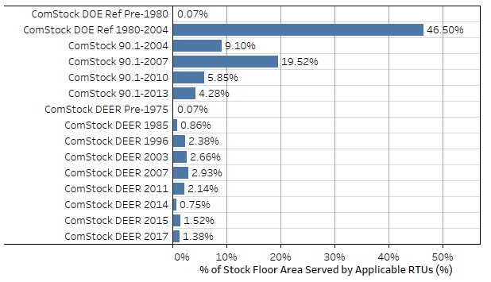{:width="700"}
{:refdef}

{:refdef: style="text-align: center;"}
Figure 1. ComStock baseline in-force energy code followed as a percentage of applicable floor area. Applicable floor area includes ComStock buildings with "PSZ-AC with gas coil" and "PSZ-AC with electric coil" HVAC system types. DEER stands for Database for Energy Efficiency Resources which represents building characteristics for California models following Title 24.
{:refdef}

# 4.  Modeling Approach 

## 4.1. Applicability 

The HP-RTU measure is applicable to ComStock models with either gas furnace RTUs ("PSZ-AC with gas coil") or electric resistance RTUs ("PSZ-AC with electric coil"). This accounts for about 36% of the ComStock floor area (Figure 2). ComStock HVAC distributions are informed by the 2012 CBECS. The methodology for interpreting CBECS data to create HVAC probability distributions for ComStock is discussed in the ComStock documentation \[3\]. The measure is not applicable to space types that directly serve kitchens, spaces that are unconditioned, or RTUs with outdoor air ratios above 65% (due to an EnergyPlus® bug with cycling operation).

{:refdef: style="text-align: center;"}
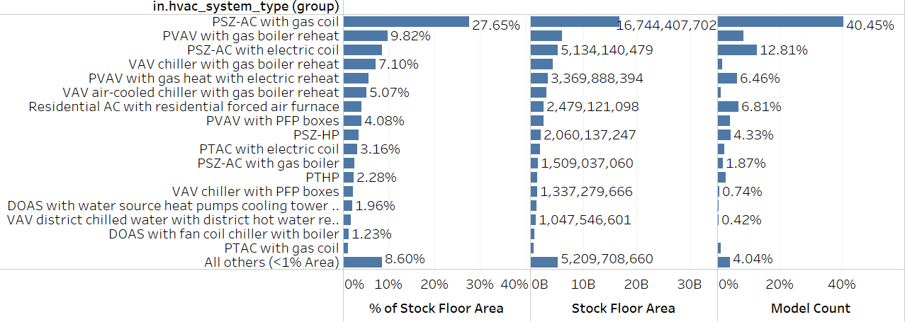{:width="700"}
{:refdef}

{:refdef: style="text-align: center;"}
Figure 2. ComStock HVAC system type prevalence by stock floor area*.*
{:refdef}

PTHP stands for packaged terminal heat pump, PTAC stands for packaged terminal air conditioner, PVAV stands for packaged variable air volume, DOAS stands for dedicated outdoor air system, and PFP stands for parallel fan-power.

## 4.2. Technology Specifics  

This report is a slight modification to the [HP-RTU with electric backup heat measure]({{site.baseurl}}) from Commercial End-Use Savings Shapes 2023 Release 1. The only difference is the fuel type of the supplemental heating. The original measure uses exclusively electric supplemental heating, but this study adds supplemental heating that matches the fuel type of the original HVAC system. If the original system used electric heating, the supplemental heating coil will be electric resistance with a COP of 1. If the original system used gas heating, the supplemental heating coil will use gas with a COP of 0.8. Therefore, this document will only minimally discuss core modeling assumptions and details. For a more comprehensive overview of the HP-RTU modeling, such as performance curves, data sources, controls, etc., please refer to the [documentation]({{site.baseurl}}) for the original measure.

Key assumption include:

-   The new HP-RTUs are modeled with top-of-the-line variable-speed compressors and fans. Performance curves are used to determine how efficiency and capacity vary with indoor and outdoor temperature and part load ratio, including cycling losses. At full compressor speed, the performance curves yield 56% and 46% COP and capacity retention at 0°F, respectively.

-   The heat pump system is sized to the design cooling load, with supplemental heating used to address any additional loads.

-   The supplemental heating coil matches the fuel type of the original heating system. If the original RTU used gas heating, a new gas supplemental heating coil with a COP of 0.8 is used in the new HP-RTU. If the original RTU used electric heating, an electric resistance supplemental heating coil with a COP of 1 is used.

-   The minimum operating temperature for the heat pumps is modeled at 0°F, which is the default setting for some manufacturers. The compressor will lock out below this temperature, and only supplemental heat will be available.

## 4.3. Greenhouse Gas Emissions 

Three electricity grid scenarios are presented to compare the emissions of the ComStock baseline and the HP-RTU scenario. The choice of grid scenario will impact the grid emissions factors used in the simulation, which determine the corresponding emissions produced per kilowatt-hour. Two scenarios---Long-Run Marginal Emissions Rate (LRMER) High Renewable Energy (RE) Cost 15-Year and LRMER Low RE Cost 15-Year---use the Cambium data set, and the third uses the Emissions & Generation Resource Integrated Database (eGRID) data set \[14\], \[15\]. All three scenarios vary the emissions factors geospatially to reflect the variation in grid resources used to produce electricity across the United States. The Cambium data sets also vary emissions factors seasonally and by time of day. This study does not imply a preference for any particular grid emissions scenario, but other analysis suggests that the choice of grid emissions scenario can impact results \[16\]. Emissions due to on-site combustion of fossil fuels use the emissions factors shown in Table 1, which are from Table 7.1.2(1) of draft American National Standards Institute/Residential Energy Services Network/International Code Council 301 \[17\]. To compare total emissions due to both on-site fossil fuel consumption and grid electricity generation, the emissions from a single electricity grid scenario should be combined with all three on-site fossil fuel emissions.

 Table 1. On-Site Fossil Fuel Emissions Factors 

| **Natural gas** | 147.3 lb/MMBtu (228.0 kg/MWh)a  |
| **Propane**     | 177.8 lb/MMBtu (182.3 kg/MWh)   |
| **Fuel oil**    | 195.9 lb/MMBtu (303.2 kg/MWh)   |

a lb = pound; MMBtu = million British thermal units; kg = kilogram; MWh = megawatt-hour

## 4.4. Limitations and Concerns 

Limited comprehensive heat pump performance maps exist, which are required for detailed energy modeling. Consequently, understanding of heat pump performance and operation in this work is also limited. Heat pump modeling is sensitive to performance assumptions due to the strong relationship between efficiency and capacity with outdoor air temperature. This impacts both annual energy consumption and peak demand. This work attempts to use the most informative data available and makes documented assumptions about heat pump operation and performance. These will notably impact results. Please consider these assumptions.

Stock savings are sensitive to ComStock baseline assumptions. Compared to CBECS 2012, which is another prominent data source for commercial building stock energy usage, ComStock currently shows lower gas heating consumption and higher electric heating consumption \[18\]. This can affect the net impact of converting both gas furnace and electric resistance RTUs to HP-RTUs.

There is a known EnergyPlus bug regarding cycling operation for multispeed coil objects. This can cause the modeled HP-RTU systems to cycle at higher part load fractions than the baseline single-speed RTU systems. Many units are only minimally impacted by this since the HP-RTU systems are variable speed and can turn down to lower part load fractions. There is another known bug in the measure that caused 7 models to show greater than 100% cooling savings. This is because the performance curves used in the measure do not currently have realistic limit boundaries. There were some odd conditions that caused the performance curve to produce a negative COP in the EnergyPlus simulation for these few models, causing the negative cooling consumption and therefore greater than 100% cooling savings. However, the limited prevalence is not expected to have a notable impact on results.

# 5. Output Variables 

Table 2 includes a list of output variables that are calculated in ComStock. These variables are important in terms of understanding the differences between buildings with and without the "HP-RTU with original fuel supplemental heating" measure applied. These output variables can also be used for understanding the economics of the upgrade (e.g., return on investment) if cost information (i.e., material, labor, and maintenance costs for technology implementation) is available.

Table 2. Output Variables Calculated From the Measure Application

| Variable Name                                               | Description                                                                                                    |
|-------------------------------------------------------------|----------------------------------------------------------------------------------------------------------------|
| stat.hvac_count_dx_cooling_XX_to_XX_kbtuh                   | Total number of direct expansion (DX) cooling units within a size bin.                                         |
| stat.hvac_count_dx_heating_XX_to_XX_kbtuh                   | Total number of DX heating units within a size bin.                                                            |
| stat.hvac_count_heat_pumps_XX_to_XX_kbtuh                   | Total number of heat pump units within a size bin.                                                             |
| stat.dx_cooling_average_cop..COP                            | Average operational COP (compressor only) of DX cooling models during simulation.                              |
| stat.dx_cooling_capacity_tons..tons                         | Total tons of DX cooling modeled.                                                                              |
| stat.dx_cooling_design_cop..COP                             | Average rated (compressor only) COP of DX cooling units at rated conditions.                                   |
| stat.dx_heating_average_cop..COP                            | Average operational COP (compressor only) of DX cooling models during simulation.                              |
| stat.dx_heating_average_minimum_operating_temperature..C    | Average compressor minimum heating lockout temperature, below which the heat pump heating will be disabled.    |
| stat.dx_heating_average_total_cop..COP                      | Average effective COP of DX heating. This includes energy from the defrost cycle and any supplemental heating. |
| stat.dx_heating_capacity_at_XXF..kBtu_per_hr                | Average available heat pump capacity at a given temperature.                                                   |
| stat.dx_heating_capacity_at_rated..kBtu_per_hr              | Average available heat pump capacity at rated temperature (47°F).                                              |
| stat.dx_heating_design_cop..COP                             | Average design COP of heat pumps.                                                                              |
| stat.dx_heating_design_cop_XXf..COP                         | Heat pump COP at given temperature, or rated conditions (47°F).                                                |
| stat.dx_heating_fraction_electric_defrost                   | Fraction of heat pump electric defrost energy to DX heating energy.                                            |
| stat.dx_heating_fraction_electric_supplemental              | Fraction of heat pump electric supplemental heating energy to DX heating energy.                               |
| stat.dx_heating_supplemental_capacity_electric..kBtu_per_hr | Electric coil supplemental heating capacity.                                                                   |
| stat.dx_heating_supplemental_capacity_gas..kBtu_per_hr      | Gas coil supplemental heating capacity.                                                                        |
| stat.dx_heating_supplemental_capacity..kBtu_per_hr          | Total (gas or electric) supplemental heating capacity.                                                         |
| stat.dx_heating_fraction_supplemental                       | Fraction of heat pump heating energy from supplemental heating.                                                |
| stat.dx_heating_total_dx_electric..J                        | Total heat pump heating electric load.                                                                         |
| stat.dx_heating_total_dx_load..J                            | Total heat pump heating load.                                                                                  |
| stat.dx_heating_total_load..J                               | Total heat pump system heating load.                                                                           |
| stat.dx_heating_total_supplemental_load_gas..J              | Total heating output energy from gas supplemental coil.                                                        |
| stat.dx_heating_total_supplemental_load_electric..J         | Total heating output energy from electric supplemental coil.                                                   |
| stat.dx_heating_defrost_energy..kBtu                        | Total heat pump electricity energy for defrost.                                                                |
| stat.dx_heating_ratio_defrost                               | Ratio of heat pump defrost electricity to heat pump heating energy.                                            |
| stat.hours_below_XXF..hr                                    | Number of hours below given outdoor air temperature during simulation.                                         |

# 6. Results 

In this section, results are presented both at the stock level and for individual buildings through savings distributions. Stock-level results reflect the combined impact of all the analyzed buildings in ComStock, including buildings that are not applicable to this measure. Therefore, they do not necessarily represent the energy savings of a particular or average building. Stock-level results should not be interpreted as the savings that a building might realize by implementing the HP-RTU with original fuel supplemental heating measure applied.

Total site energy savings are also presented in this section. Total site energy savings can be a useful metric, especially for quality assurance/quality control, but this metric on its own can have limitations for drawing conclusions. Further context should be considered, as site energy savings alone do not necessarily translate proportionally to savings for a particular fuel type (e.g., gas or electricity), source energy savings, cost savings, or greenhouse gas savings. This is especially important when a measure impacts multiple fuel types or causes decreased consumption of one fuel type and increased consumption of another. Many factors should be considered when analyzing the impact of an energy efficiency or electrification strategy, depending on the use case.

## 6.1. Single Building Example 

In this section, we analyze the operation behavior of an example small office building in Gunnison, Colorado, with the HP-RTU measure applied. The model was simulated with both gas and electric supplemental heat to compare the differences.

Figure 3 compares the behavior of the two models for two winter days. In the upper plot, the heating rates of the heat pump (green line) and the supplemental heating coil (pink line) are displayed for both scenarios, illustrating a perfect overlap of these parameters, as anticipated. This alignment is due to the fact that the sole variable differing between the models is the fuel type of the supplemental heating coil. This change should not impact the required heating rates.

The lower plot shows the site's outdoor air temperature (blue line) alongside the site electricity use for the gas backup (yellow line) and electricity backup (dark green line) alternatives. Notably, the electricity usage diverges around the start of January 3, coinciding with the utilization of supplemental heating indicated in the upper plot. As anticipated, whenever supplemental heating is needed, the scenario employing electric supplemental heat exhibits higher electricity consumption.

In the specific example presented, a considerable peak in electric demand becomes evident for the electric backup option from 4 a.m. to 8 a.m. Meanwhile, the gas supplemental heating option shows a reduction in site electricity consumption during this time. This discrepancy stems from the outdoor temperature falling below the compressor lockout threshold of 0°F, resulting in zero heat pump heating output in both models (green line). To address this, the supplemental heating coils shoulder the entire heating load (pink line). In the electric option, electric resistance addresses the complete load, whereas the gas option uses a gas coil. As expected, the electric backup option reflects markedly higher site electricity consumption during this period, while the gas backup option shows a drop in site electricity during this same period because the model uses no electric heating below the compressor lockout temperature. Notably, the gas alternative would elevate gas consumption, a facet not illustrated in this plot.

{:refdef: style="text-align: center;"}
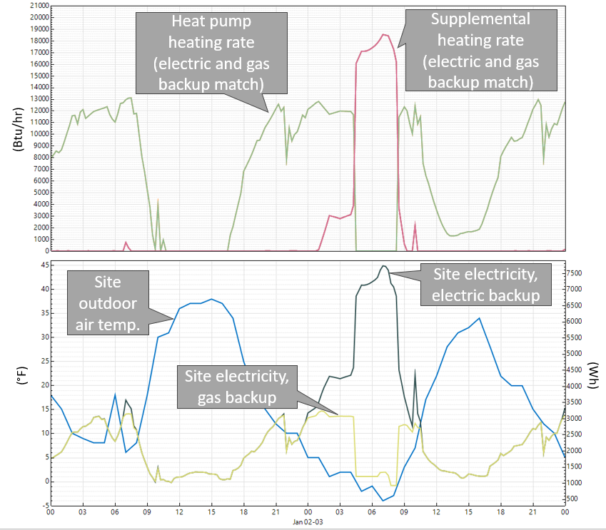{:width="700"}
{:refdef}

{:refdef: style="text-align: center;"}
Figure 3. Operation comparison of HP-RTU measure applied with gas vs. electric supplemental heating for an example small office model in Gunnison, Colorado. Note that the compressor lockout temperature is 0°F, below which the heat pump coils will not operate. Also note that the heating rates shown are for one of several RTUs in the building (top plot), whereas the site electricity is for the entire building (bottom plot).
{:refdef}

Table 3 compares energy by end use for the HP-RTU measure applied with electric vs. gas supplemental heating for the example small office in Gunnison, Colorado. The gas backup option reduces the electric heating consumption from 72 (Gigajoules) GJ to 45 GJ. However, the gas backup option adds 34 GJ of gas heating compared to the electric backup option. Overall, the gas option uses more site energy than the electric option because the electric backup heating is 100% efficient at the site, whereas the gas backup option is 80% efficient at the site.

In conclusion, the electric backup option shows high electricity usage and demand, whereas the gas backup option shows higher total consumption of site energy and combustion fuels. Energy cost and greenhouse gas emissions are also considerations that were not discussed in this example. Therefore, deciding on the best-performing system would likely come down to balancing these factors, and others, with the priorities of the use case.

Table 3. End Use Comparison of the HP-RTU Measure Applied With Electric vs. Gas Backup Heating for an Example Small Office in Gunnison, Colorado

|| Electric Backup [GJ] | Gas Backup [GJ] |
|----------------------|-----------------|
| **Gas Heat**             | 0               | 34  |
| **Electric Heat**        | 72              | 45  |
| **Cooling**              | 3               | 3   |
| **Fans**                 | 20              | 20  |
| **All Other**            | 77              | 77  |
| **Total**                | 172             | 179 |

## 6.2. Stock Site Energy Impacts 

The HP-RTU measure with original fuel supplemental heat demonstrates 8.5% total site energy savings (396 trillion British thermal units \[TBtu\]) for the U.S. commercial building stock modeled in ComStock (Figure 4). The measure is applicable to about 36% of the Comstock floor area. The savings are primarily attributed to:

-   **27%** stock **heating gas** savings (226 TBtu)

-   **−22%** stock **heating electricity** savings (−43 TBtu)

-   **11%** stock **cooling electricity** savings (81 TBtu)

-   **19%** stock **fan electricity** savings (112 TBtu).

The site gas heating savings are attributed to switching gas-heated systems in the ComStock baseline to electric HP-RTU systems. This substantially reduces gas heating in these buildings, but some still rely on gas supplemental heating when the heat pump alone can\'t meet the entire heating demand. Note that some gas heating will remain in spaces deemed not applicable for this measure (e.g., kitchens).

Site electricity for heating exhibits net negative energy savings, with factors leading to both savings and penalties in this category. The HP-RTU measure transitions buildings from gas-fired RTUs to electric HP-RTUs, increasing stock electric heating. However, the HP-RTU measure also replaces electric resistance RTUs with higher-efficiency HP-RTUs, causing some reduction in stock electric heating. However, as mentioned, the combined impact of these two factors yields an increase in stock electricity for heating.

The cooling savings are from using a high-efficiency, variable-speed compressor in the HP-RTUs, which generally exceeds the performance of the existing RTU systems. As discussed previously, many of the ComStock baseline systems are assumed to follow the required performance of older energy code years, which the new HP-RTU systems usually outperform (Figure 4).

{:refdef: style="text-align: center;"}
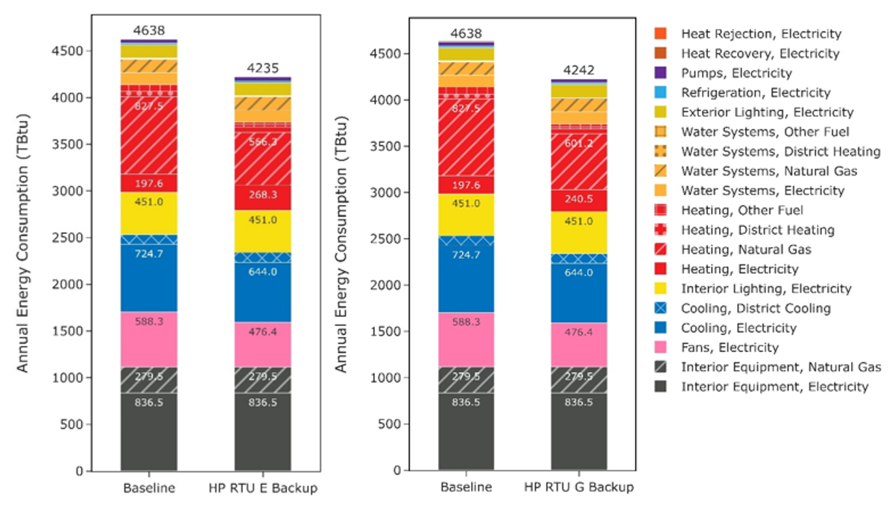{:width="700"}
{:refdef}

{:refdef: style="text-align: center;"}
Figure 4. Comparison of stock annual site energy consumption between the ComStock baseline and the HP-RTU measure for the electric backup heat scenario (left; "HP RTU E Backup") and the original fuel backup measure scenario (right; "HP RTU G Backup"). Energy consumption is categorized both by fuel type and end use.
{:refdef}

Fan energy savings are from using high-efficiency, variable-speed fans in the HP-RTU systems. The high-efficiency fans require less energy to move the same amount of air, while the variable-speed fan controls allow the system to use less airflow during periods of lower loads.

Figure 4 compares two iterations of the HP-RTU measure: electric resistance supplemental heat (left) and original fuel supplemental heat (right). First, note that gas and electric heating are the only end uses that show any difference between these two scenarios. This is because the supplemental heating fuel type is the only change between scenarios, which does not impact the savings of cooling, fans, etc.

For the heating end uses, the original fuel backup HP-RTU scenario uses 10% less stock electricity heating and 6% more stock natural gas heating than the electric backup HP-RTU scenario. This behavior is expected because using gas supplemental heat instead of electric resistance will decrease electricity heating consumption but increase natural gas heating consumption. Lastly, Figure 4 shows slightly higher total site energy usage for the original fuel backup scenario. This is due to efficiency differences between gas and electric supplemental heating, where the electric supplemental heating is modeled with a COP of 1 while the gas supplemental heating is modeled with a COP of 0.8.

It is important to weigh multiple considerations when determining the preferred supplemental heating fuel type for a use case. So far, this discussion has only focused on site energy consumption, but projects also may want to consider source energy consumption, greenhouse gas emissions, energy cost, and peak demand implications to determine what is most appropriate for a particular application. Aside from energy cost implications, these factors are discussed to some extent in later sections of this report.

## 6.3. Stock Greenhouse Gas Emissions Impact 

ComStock simulation results show greenhouse gas emissions avoided across all presented electricity grid scenarios and on-site combustion fuel types (Figure 5). For the combined impact across all sources, a single electricity grid scenario should be chosen and combined with all three on-site combustion fuel scenarios. The HP-RTU measure, when paired with original fuel type supplemental heat, results in greenhouse gas emissions reductions for the electricity grid ranging from 2.2% to 4.2%, depending on the selected grid scenario. These savings are due to reduced electricity consumption from the fans and cooling end use, but also include the additional heating electricity from electrifying gas-furnace systems. The emissions avoided from on-site combustion fuels are attributable to replacing applicable combustion fuel RTUs with HP-RTUs.

{:refdef: style="text-align: center;"}
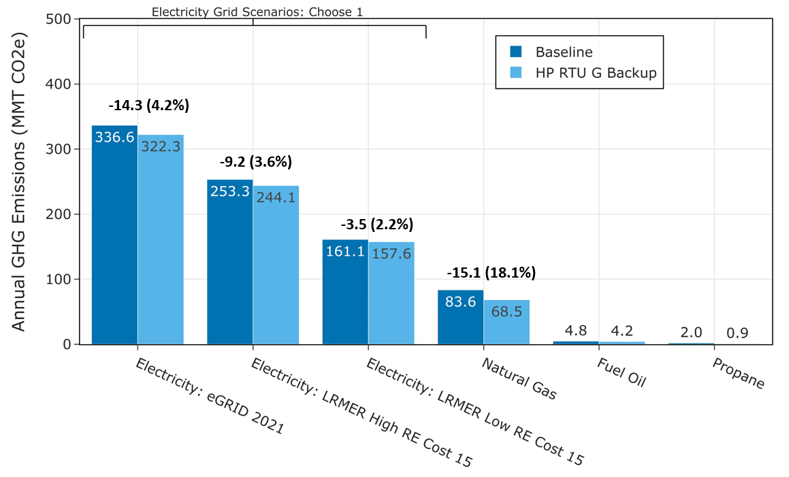{:width="700"}
{:refdef}

{:refdef: style="text-align: center;"}
Figure 5. Greenhouse gas (GHG) emissions comparison of the ComStock baseline and the HP-RTU with original fuel supplemental heat scenario ("HP RTU G Backup"). Three electricity grid scenarios are presented: Cambium Long-Run Marginal Emissions Rate (LRMER) High Renewable Energy (RE) Cost 15-Year, Cambium LRMER Low RE Cost 15-Year, and eGRID. MMT stands for million metric tons.
{:refdef}

Table 4 compares greenhouse gas emissions for the HP-RTU measure applied with electric resistance vs. original fuel type supplemental heating. As expected, the electric supplemental heating option shows slightly higher emissions for the electricity grid scenarios, whereas the original fuel supplemental heating option (employing gas supplemental heat when replacing gas RTUs) shows higher emissions induced for on-site combustion fuels. However, the two HP-RTU scenarios show minimal difference for total combined (grid scenario + on-site fuels) emissions for the grid scenarios shown.

Table 4. Greenhouse Gas Emissions Comparison of HP-RTU Measure With Electric Resistance vs. Original Fuel Supplemental Heat

|| HP-RTU With Electric Backup           | HP-RTU With Original Fuel Backup | % Reduction  (Relative to Electric Backup) |
|---------------------------------------|----------------------------------|--------------------------------------------|
| **Electricity Grid Scenarios (MMT CO2e)** |
| eGRID                                 | 325.8                            | 322.3                                      | 1.1%  |
| LRMER High RE                         | 246.7                            | 244.1                                      | 1.1%  |
| LRMER Low RE                          | 159.9                            | 157.6                                      | 1.4%  |
| **On-Site Combustion Fuels (MMT CO2e)**   |
| Natural Gas                           | 66.1                             | 68.5                                       | -3.6% |
| Fuel Oil                              | 4.2                              | 4.2                                        | 0.0%  |
| Propane                               | 0.9                              | 0.9                                        | 0.0%  |
| **Combined (MMT CO2e)**                   |
| eGRID + Fuels                         | 397.0                            | 395.9                                      | 0.3%  |
| LRMER High RE + Fuels                 | 317.9                            | 317.7                                      | 0.1%  |
| LRMER Low RE + Fuels                  | 231.1                            | 231.2                                      | 0.0%  |

## 6.4. Site Energy Savings Distributions 

This section discusses site energy consumption for quality assurance/quality control purposes. Specifically, it focuses on analyzing the distribution of energy savings across different characteristics (e.g., end use, fuel type) to better understand how the measure is affecting the building stock. Note that site energy savings can be useful for these purposes, but other factors should be considered when drawing conclusions, as these do not necessarily translate proportionally to source energy savings, greenhouse gas emissions avoided, or energy cost.

Figure 6 shows the percent savings distributions of the baseline ComStock models vs. the HP-RTU with original fuel supplemental heating scenario by end use and fuel type for applicable models. The biggest differences are observed for the heating, cooling, and fan end uses.

The combustion fuel heating end uses show some of the highest savings. The median applicable building shows over 90% savings for both the natural gas and other fuels heating groups. These savings are attributable to replacing gas RTUs with electric HP-RTUs. Models that show 100% savings remove all combustion fuel heating and do not require the use of gas supplemental heating. Models that show less than 100% savings for the combustion fuel heating end uses either have some nonapplicable RTUs (e.g., kitchens) or have some prevalence of gas supplemental heating usage in the HP-RTUs. Note that these distributions only include models if they consume energy for the end use and fuel type combination in the baseline. In other words, models that use no combustion fuels in the baseline do not show up in these plots. Also note that these plots only include models applicable to the HP-RTU scenario, and do not include nonapplicable models. A small subset of models (12 of out 135,378) show negative gas heating savings. This behavior is not generally expected, as it represents the gas backup heating using more gas than the original gas RTU. The issue seems to be stemming from the beforementioned EnergyPlus bug regarding night cycling behavior with the multispeed coil object resulting in more outdoor ventilation air at nighttime for these models. However, this is expected to have very minimal impact on the dataset at large.

{:refdef: style="text-align: center;"}
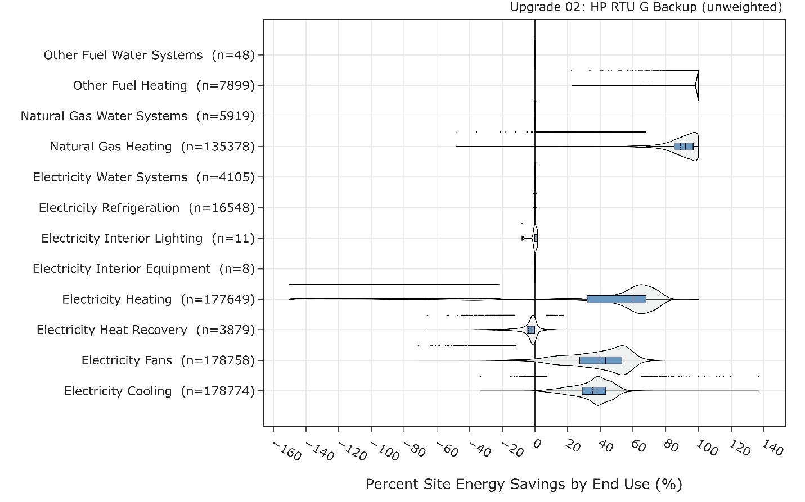{:width="700"}
{:refdef}

{:refdef: style="text-align: center;"}
Figure 6. Percent site energy savings distribution for ComStock models with the HP-RTU original fuel backup measure applied by end use and fuel type. The data points that appear above some of the distributions indicate outliers in the distribution, meaning they fall outside 1.5 times the interquartile range. The value for n indicates the number of ComStock models that were applicable for energy savings for the fuel type category.
{:refdef}

The electricity heating end use primarily shows savings, with the median building demonstrating site energy savings around 60%. This is due to replacing electric resistance RTUs with higher-efficiency HP-RTUs. A small subset of buildings shows negative electricity heating savings. Many of these samples are primarily gas-heated buildings with a small amount of electric heating in the baseline (for example, a zone may have an electric baseboard). Transitioning to an electric HP-RTU adds much more electric heating and therefore causes a high percent savings penalty. These models generally save energy at the site level through the gas end use. It is important to note that this distribution excludes buildings that initially had no electric heating (e.g., those that relied solely on gas RTUs). Consequently, it doesn\'t provide a complete overview of the potential increase in electric consumption when transitioning from gas heating to HP-RTUs.

Some models show negative heat recovery savings, noting that the heat recovery end use is for electricity used to operate enthalpy wheels. These negative energy savings are due to the increased prevalence of wheel operation caused by increased cycling operation with the HP-RTUs compared to the baseline RTUs. In other words, increased run time for the air handler can cause increased run time for the enthalpy wheel. This is in part due to the previously mentioned EnergyPlus bug that causes longer cycling operation with the multispeed coil objects used for modeling the HP-RTU. However, the heat recovery end use makes up a very small portion of building stock energy usage, so negative percentage savings in this end use has minimal impact.

The median fan and cooling energy savings are both roughly 40%, which aligns with the results from a lab testing and modeling study performed by Pacific Northwest National Laboratory on variable-speed RTUs \[9\]. These savings are due to the high-efficiency, variable-speed fan and compressor systems. Notably, these savings could also be achieved with a high-performance non-HP-RTU system. A small set of outliers show negative cooling savings. These are generally attributed to the beforementioned EnergyPlus night cycling issue with the multispeed coil objects used in this study. However, we expect this to have very minimal impact on the results due to the small prevalence of this issue.

Minimal variations are noted in water systems and refrigeration. The variations that do occur stem from slight fluctuations in ambient air temperature due to HVAC changes that influence their operation. Additionally, there are 11 models that show variation in the interior lighting end use, attributed to a recognized issue in ComStock. Given that this issue affects only a small number of models and has a negligible overall impact, it is not anticipated to significantly affect the data set.

Figure 7 shows the site energy savings distributions between the ComStock baseline and the HP-RTU scenario by fuel type and total site energy. The total site energy savings distribution shows savings values generally between 18% and 38% for the 25th and 75th percentiles, respectively, with the median model showing \~28% savings. As mentioned previously, combined site energy savings alone is not a comprehensive assessment of electrification measures, so other factors should be considered based on the priorities of the individual use case.

The electricity savings distribution shows some degree of site energy penalties. These are mostly buildings that changed from gas heat to electric heat, so the penalties are expected. Some of the electricity penalties are reduced or mitigated through savings for cooling, fans, and heat recovery, as discussed. Many of the buildings, however, show electricity savings. Some of these are buildings that had electric heating in the baseline; in these cases, the higher-efficiency HP-RTU system reduces electricity usage across multiple end uses. Others may have had gas heating in the baseline, but the savings from cooling and fans outweighed the increase in electric heating from electrifying the end use. These occurrences will be specific to the building and climate zone because of the complicated interactions involved.

The distribution of site electricity savings shows some buildings with site energy penalties. These penalties are primarily seen in buildings that switch from gas heating to electric heating, which is expected when electrifying an end use. In some cases, electricity penalties are reduced or completely offset by savings in cooling and fans, as discussed earlier. On the other hand, many buildings show site electricity savings. Some of these buildings originally used electric resistance heating where the higher-efficiency HP-RTU saves electricity for heating. Others may have had gas heating initially, but the savings from cooling and fans outweigh the increase in electric heating when they transitioned. These situations depend on the specific building and climate zone due to the complex interactions involved.

The combustion fuels show many models with near 100% savings. These are buildings that are completely electrified from this measure (because all gas-heated systems in the baseline were applicable) and where gas is not used for other end uses. Models that show less than 100% gas or other fuel savings generally use some backup gas heat or have some nonapplicable gas HVAC system in the baseline. Furthermore, other combustion fuel end uses, such as water heating and cooking equipment are not electrified though this measure and therefore may require multiple solutions to achieve total building electrification.

{:refdef: style="text-align: center;"}
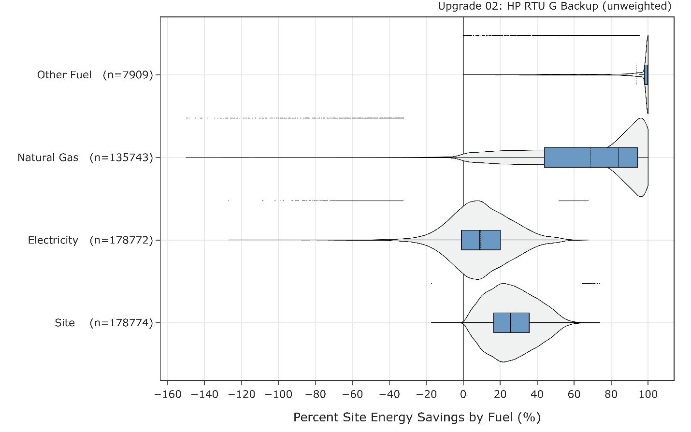{:width="700"}
{:refdef}

{:refdef: style="text-align: center;"}
Figure 7. Percent site energy savings distribution for ComStock models with the applied HP-RTU original fuel backup measure by fuel type. The data points that appear above some of the distributions indicate outliers in the distribution, meaning they fall outside 1.5 times the interquartile range. The value for n indicates the number of ComStock models that were applicable for energy savings for the fuel type category.
{:refdef}

Figure 8 shows the distribution of site energy savings by building type. For many building types, the majority of the savings distribution falls between 20% and 40%. Some building types show less savings. Food service building types are generally very high on process loads, so changes to HVAC have less impact on whole building site energy savings for these models. Furthermore, the HP-RTU measure is not applicable to kitchen spaces, which means these building types are always only partially applicable to the measure. Strip malls in ComStock contain some fraction of food service, so these factors apply to them as well. Warehouses also show lower savings. This is in part due to warehouses being minimally conditioned, which reduces the impact of HVAC on site energy consumption.

{:refdef: style="text-align: center;"}
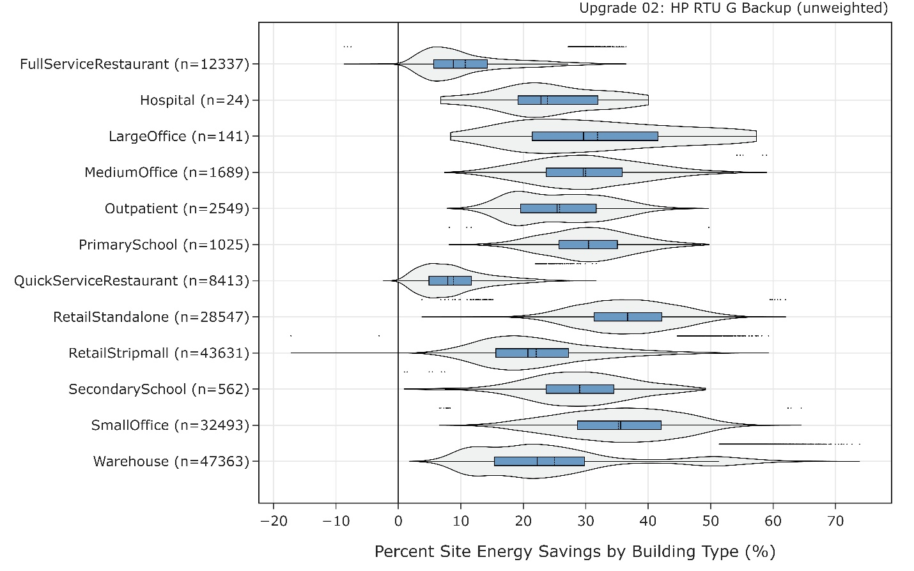{:width="700"}
{:refdef}

{:refdef: style="text-align: center;"}
Figure 8. Percent site energy savings distribution for ComStock models with the applied HP-RTU original fuel backup measure by building type. The data points that appear above some of the distributions indicate outliers in the distribution, meaning they fall outside 1.5 times the interquartile range. The value for n indicates the number of ComStock models that were applicable for energy savings for the fuel type category.
{:refdef}

## 6.5. Winter Peak Demand 

Figure 9 illustrates the distribution of noncoincident peak demand, normalized per area, for the existing building stock (Baseline), the stock with the HP-RTU measure applied with original fuel backup (G Backup), and the stock with the HP-RTU measure applied with electric backup (E Backup). For simplicity, this plot only looks at buildings with a gas RTU in the baseline, because these are the models more likely to experience increased winter peak demand. This analysis uses a 15-minute window for peak demand.

The median peak intensity shows a reduction for the shoulder and summer seasons. This is primarily due to electricity reductions from fans and cooling. The impact during the winter months varies. For warmer climate zones, the median peak demand intensity is very similar between the three scenarios. This is likely caused by a trade-off between adding minimal electric heat, which would increase the peak demand, but also reducing fan energy and subsequently peak demand. The colder months show an increasing disparity between the three scenarios, with the gas RTU baseline models showing the lowest median peak, followed by the original fuel backup scenario (which in this context is gas backup only, as we are only looking at models that started with gas RTUs), and finally, the electric backup scenario. The exception to this is the subarctic climate zone; however, this stock segment has a very small sample size compared to the other climate zones, and therefore conclusions drawn from this segment should be limited.

The median peak increase is greater in the original fuel backup scenario than in the baseline. This is because, in this scenario, electric heat pump heating is used, whereas the baseline relies exclusively on gas heating for this stock segment. On the other hand, the electric backup scenario exhibits the highest median peak demand intensity among these scenarios. This is because all heating in this scenario is provided by either the electric heat pump or an electric resistance backup coil when necessary. In contrast, the gas backup option experiences a less significant increase in median peak demand. This is because some of the heating during winter peak conditions is addressed by the gas backup coil.

{:refdef: style="text-align: center;"}
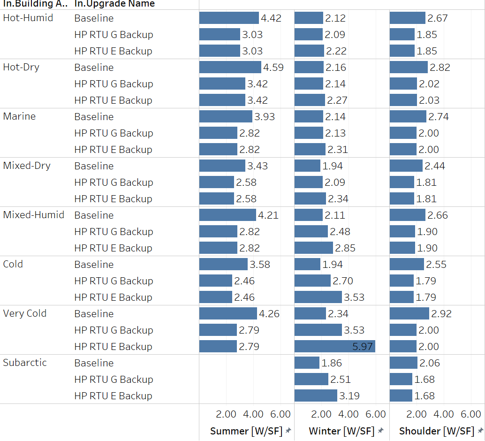{:width="700"}
{:refdef}

{:refdef: style="text-align: center;"}
Figure 9*.* Comparison of the median noncoincident peak demand for models with gas RTUs between the baseline (representing the building stock of today), the HP-RTU original fuel backup scenario ("HP RTU G Backup"; backup fuel type matches that of original system), and the HP-RTU electric backup scenario ("HP RTU E Backup"; backup fuel type is electric resistance). Results shown by Building America climate zone.
{:refdef}

# References  

\[1\] Leung, Jessica. 2018. "Decarbonizing U.S. Buildings." Arlington, VA: Center for Climate and Energy Solutions. [https://www.c2es.org/document/decarbonizing-u-s-buildings/](https://www.c2es.org/document/decarbonizing-u-s-buildings/).

\[2\] EIA. 2020. *2018 Commercial Buildings Energy Consumption Survey (CBECS)*. Washington, D.C.: U.S. Energy Information Administration (EIA). [https://www.eia.gov/consumption/commercial/](https://www.eia.gov/consumption/commercial/).

\[3\] Parker, A. et al. 2023. *ComStock Reference Documentation: Version 1*. Golden, CO: National Renewable Energy Laboratory. NREL/TP-5500-83819. [https://www.nrel.gov/docs/fy23osti/83819.pdf](https://www.nrel.gov/docs/fy23osti/83819.pdf).

\[4\] EnergyPlus. 2022. "EnergyPlus™ Version 22.1.0 Documentation Engineering Reference." [https://energyplus.net/documentation](https://energyplus.net/documentation).

\[5\] EnergyPlus. 2022. "EnergyPlus™ Version 22.1.0 Documentation Input Output Reference." [https://energyplus.net/documentation](https://energyplus.net/documentation).

\[6\] TRANE. 2013. "Understanding Single-Zone VAV Systems." pp. 1--10. [https://www.trane.com/content/dam/Trane/Commercial/global/products-systems/education-training/engineers-newsletters/airside-design/admapn047en_0413.pdf](https://www.trane.com/content/dam/Trane/Commercial/global/products-systems/education-training/engineers-newsletters/airside-design/admapn047en_0413.pdf).

\[7\] Daikin. 2014. "Installation and Maintenance Manual OM 1141-3 MicroTech ® III Unit Controller for Rebel ® Commercial Packaged Rooftop Systems." no. October, 2014.

\[8\] ANSI/ASHRAE. 2019. "ANSI/ASHRAE Standard 62.1-2019: Ventilation for Acceptable Indoor Air Quality."

\[9\] Wang. W. and S. Katipamula. 2013. *Part-Load Performance Characterization and Energy Savings Potential of the RTU Challenge Unit : Daikin Rebel*. Richland, WA: Pacific Northwest National Laboratory. PNNL-22720. [https://www.pnnl.gov/main/publications/external/technical_reports/PNNL-22720.pdf](https://www.pnnl.gov/main/publications/external/technical_reports/PNNL-22720.pdf).

\[10\] Rheem. n.d. "Commercial 7.5-10 Ton Renaissance ™ Line Package Heat Pump RHPDZT Commercial Prestige ® Series RHPDZS Commercial Classic Plus ® Series Compliant Models Air Package Heat Pump RHPD Series." [https://s3.amazonaws.com/WebPartners/ProductGroupDocuments/dfc6d652-743e-4ac1-ad80-e9b640935b9c.pdf](https://s3.amazonaws.com/WebPartners/ProductGroupDocuments/dfc6d652-743e-4ac1-ad80-e9b640935b9c.pdf).

\[11\] Cogswell, Frederick and D. A. Mahmoud. 2020. *High-Performance Air-Source Cold Climate Heat Pump ( CCHP )*. Department of Defense Environmental Security Technology Certification Program. [https://apps.dtic.mil/sti/trecms/pdf/AD1154507.pdf](https://apps.dtic.mil/sti/trecms/pdf/AD1154507.pdf).

\[12\] ASHRAE. 2015. *2015 Ashrae Handbook HVAC applications*.

\[13\] Natural Resources Canada. 2020. *Air-Source Heat Pump Sizing and Selection Guide*. Ottawa, ON: Natural Resources Canada. [https://natural-resources.canada.ca/sites/nrcan/files/canmetenergy/pdf/ASHP%20Sizing%20and%20Selection%20Guide%20(EN).pdf](https://natural-resources.canada.ca/sites/nrcan/files/canmetenergy/pdf/ASHP%20Sizing%20and%20Selection%20Guide%20(EN).pdf).

\[14\] NREL. n.d. "Cambium \| Energy Analysis \| NREL." \[Online\]. Available: [https://www.nrel.gov/analysis/cambium.html](https://www.nrel.gov/analysis/cambium.html). \[Accessed: 02-Sep-2022\].

\[15\] U.S. EPA. "Emissions & Generation Resource Integrated Database (eGRID) \| US EPA." \[Online\]. Available: [https://www.epa.gov/egrid](https://www.epa.gov/egrid). \[Accessed: 02-Sep-2022\].

\[16\] Present, Elaina, Pieter Gagnon, Eric J.H. Wilson, Noel Merket, Philip R. White, and Scott Horowitz. 2022. "Choosing the Best Carbon Factor for the Job: Exploring Available Carbon Emissions Factors and the Impact of Factor Selection." NREL/CP-5500-82241. [https://www.osti.gov/biblio/1891472](https://www.osti.gov/biblio/1891472).

\[17\] Vijayakumar, G. et al. 2022. "ANSI/RESNET/ICC 301-2022 - Standard for the Calculation and Labeling of the Energy Performance of Dwelling and Sleeping Units using an Energy Rating Index." Oceanside, CA.

\[18\] EIA. 2016. *2012 Commercial Buildings Energy Consumption Survey (CBECS)*. Washington, D.C.: U.S. Energy Information Administration (EIA). [https://www.eia.gov/consumption/commercial/data/2012/](https://www.eia.gov/consumption/commercial/data/2012/).

# Appendix A.  

{:refdef: style="text-align: center;"}
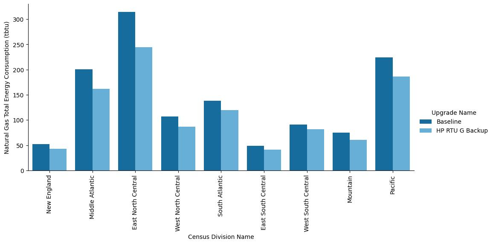{:width="700"}
{:refdef}

{:refdef: style="text-align: center;"}
Figure A-1. Site annual natural gas consumption of the ComStock baseline and the measure scenario by census division.
{:refdef}

{:refdef: style="text-align: center;"}
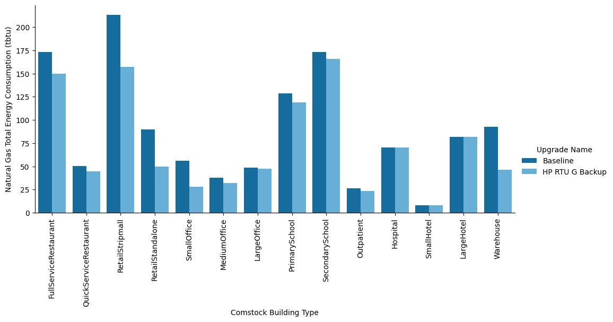{:width="700"}
{:refdef}

{:refdef: style="text-align: center;"}
Figure A-2. Site annual natural gas consumption of the ComStock baseline and the measure scenario by building type.
{:refdef}

{:refdef: style="text-align: center;"}
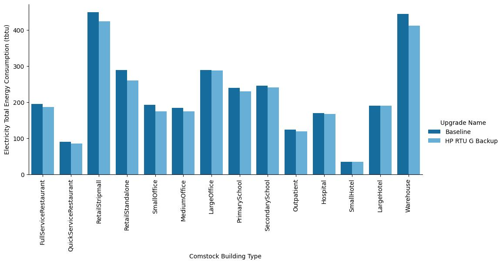{:width="700"}
{:refdef}

{:refdef: style="text-align: center;"}
Figure A-3. Site annual electricity consumption of the ComStock baseline and the measure scenario by building type.
{:refdef}

{:refdef: style="text-align: center;"}
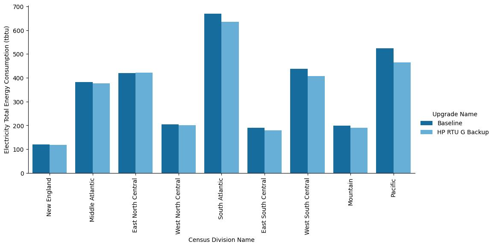{:width="700"}
{:refdef}

{:refdef: style="text-align: center;"}
Figure A-4. Site annual electricity consumption of the ComStock baseline and the measure scenario by census division.
{:refdef}
