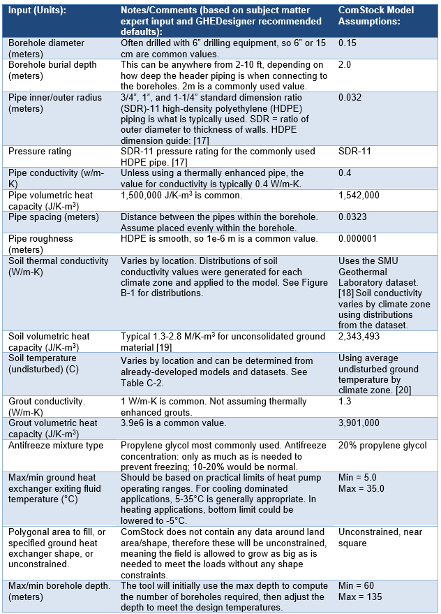

# Ground-Coupled Central Water-to-Water Heat Pump
{: .fw-500 }
Author: Amy Allen, Marley Praprost, Matt Leach, Matt Mitchell and Andrew Parker 

# Executive Summary

Building on the successfully completed effort to calibrate and validate the U.S. Department of Energy's ResStock™ and ComStock™ models over the past 3 years, the objective of this work is to produce national datasets that empower analysts working for federal, state, utility, city, and manufacturer stakeholders to answer a broad range of analysis questions.

The goal of this work is to develop energy efficiency, electrification, and demand flexibility end-use load shapes (electricity, gas, propane, or fuel oil) that cover a majority of the high-impact, market-ready (or nearly market-ready) measures. "Measures" refers to energy efficiency variables that can be applied to buildings during modeling.

An *end-use savings shape* is the difference in energy consumption between a baseline building and a building with an energy efficiency, electrification, or demand flexibility measure applied. It results in a time-series profile that is broken down by end use and fuel (electricity or on-site gas, propane, or fuel oil use) at each time step.

ComStock is a highly granular, bottom-up model that uses multiple data sources, statistical sampling methods, and advanced building energy simulations to estimate the annual sub-hourly energy consumption of the commercial building stock across the United States. The baseline model intends to represent the U.S. commercial building stock as it existed in 2018.

This documentation focuses on a single measure---Central Ground-Source Water-to-Water Heat Pumps.

Hydronic heating, ventilating, and air-conditioning (HVAC) systems are common in commercial buildings, and often use boilers and chillers as the primary equipment for heating and cooling. This measure focuses on the retrofit of hydronic HVAC systems to use ground-coupled, water-to-water heat pumps as primary equipment. The measure also allows for the use of supplemental systems to meet heating and/or cooling loads in excess of what the ground heat exchanger is sized to deliver, such as for a scenario in which ground heat exchangers are sized for less than either the peak heating or cooling loads to reduce capital cost. This measure is applicable to 16.7% of the floor area represented in ComStock (buildings that currently have hydronic systems supplying heating or cooling, or both). As part of this retrofit measure, partially hydronic systems (serving heating or cooling, but not both) are converted to fully hydronic systems.

The effects of building load reduction measures on ground heat exchanger sizing is a potential area for future work.

The Central Hydronic Ground-Source Heat Pump measure demonstrates 5.3% total site energy savings (232 trillion British thermal units \[TBtu\]) for the U.S. commercial building stock modeled in ComStock (Figure 8). The savings are primarily attributed to:

-   **25%** stock **heating gas** savings (211 TBtu)

-   **−26%** stock heating electricity savings (−46.3 TBtu)

-   **7.7%** stock **cooling** savings (51.7 TBtu).

The Central Hydronic Ground-Source Heat Pump (GSHP) measure demonstrates fourteen million metric tons of greenhouse gas emissions avoided for on-site natural gas consumption. There is no net change in electricity-related emissions from implementing this measure because electricity savings from cooling are offset by the increase in heating electricity use through the electrification of space heating.

# Acknowledgments
The authors would like to acknowledge the valuable guidance and input provided by Garen Ewbank, Steve Hamstra, and Cary Smith of the GreyEdge Group, Zeyneb Magavi of HEET, and Kevin Kitz of KitzWorks.

# 1. Technology Summary

The carbon intensity of electricity in the United States declined by almost 40% from 2001 to 2020 \[1\], \[2\]. However, space and process heating needs continue to be met predominately by fossil fuels, and the combustion of fossil fuels for space and domestic hot water heating accounts for roughly 10% of U.S. carbon emissions \[3\]. Properly designed ground heat exchanger coupled heating and cooling systems can offer benefits in energy efficiency relative to "conventional" hydronic heating, ventilating, and air-conditioning (HVAC) systems and facilitate beneficial electrification. A detailed study of 36 buildings in the United States that are fully or partially served by HVAC systems tied to ground heat exchangers found the potential for very efficient energy performance (with one-third having EnergyStar® ratings above 90). The results of the study, while limited, also highlighted the potential pitfalls of poor design practices \[4\].

Hydronic HVAC systems are common in commercial buildings, and often use boilers and chillers as the primary equipment for heating and cooling. This measure focuses on the retrofit of hydronic HVAC systems to use central, ground-coupled, water-to-water heat pumps as primary equipment. Separate heat pumps are used for heating and cooling in this configuration. The "source" side of the heat pumps is tied to a loop that circulates a water-based heat transfer fluid through the ground heat exchanger. The "load" side of each heat pump circulates water through the building's existing hydronic systems for hot water and chilled water. Water-to-water heat pumps are particularly efficient when delivering water at "moderate" temperatures (for example, below 115°F in heating), and are now available in multistage and variable-speed configurations \[4\]. Commercial water-to-water heat pumps are available in capacities ranging from 5 tons to 100 tons, and some models are compatible with variable flow on the source side \[5\]. Most water-to-water heat pumps can generate hot water at temperatures up to around 130°F--150°F (DOE, 2021). Other variables, including source- and load-side flow rates, also affect water-to-water heat pump performance, increasing supply water temperature from 100°F to 135°F, and can reduce heating coefficient of performance (COP) by as much as 35% \[6\]. The nature of existing heating system configurations limits the range of temperatures that are allowable. For example, heating systems using coils in air handlers can potentially be adapted to allow for supply temperatures in heating in the range of 130°F--140°F, either by using the full coil capacity (if existing coils are oversized for building loads) or by replacing the coil \[7\]. Buildings that have had envelope retrofits without replacing the HVAC system may have heating systems that are now oversized. If additional heating capacity is needed, retrofits to facilitate "coil twinning" (use of cooling coils during the heating season for additional heating capacity) is another possible approach \[7\]. Heating supply temperatures of 115°F, however, usually require low-temperature radiant hydronic configurations that leverage very large heat-transfer surfaces.

The measure allows for the use of supplemental systems (a cooling tower and/or electric boiler) if the user wishes to design the ground heat exchanger to serve a load less than either the maximum heating or cooling loads. Sizing the ground heat exchanger to less than the design heating or cooling loads reduces capital cost and may still deliver much of the potential energy efficiency benefit. Other measures, including Packaged Water-to-Air Heat Pump Retrofit, and Console Water-to-Air Heat Pump Retrofit, can be used to replace existing hydronic HVAC systems with ground-coupled heat pumps in other configurations.

# 2. ComStock Baseline Approach

Of the buildings represented in ComStock™, about 17% are served by hydronic HVAC systems (excluding buildings served by district thermal energy systems, which are not in the scope of this measure). These system types are listed in Table 1, along with a classification of whether the hydronic systems provide heating only, cooling only, or both heating and cooling. This measure modifies the existing HVAC system to create a system served by central water-to-water heat pumps with a ground loop serving as the source.

This measure is not intended to apply to buildings served by district energy (heating hot water or chilled water) systems, as this retrofit is intended to represent the installation of a ground heat exchanger to serve a single building's load. This measure is also not intended to apply to buildings that are heated (or cooled) only, since the resulting extreme load imbalance would negatively affect the performance of a ground heat exchanger over time \[4\]. However, as long as a given heating or cooling capability exists in the baseline, it will be replaced with a hydronic system in this measure. This measure sizes the ground heat exchanger in a way that seeks to avoid the potential for a significant (greater than 20%) load imbalance. Additionally, this measure does not apply to systems with hot water baseboard radiators, which are generally not suited to the reduction in supply water temperature for compatibility with water-source heat pumps currently available in the United States.

In ComStock, buildings with hydronic systems providing only cooling usually consist of an air handler or fan coil unit equipped with chilled water coils, and heating is supplied through gas or electric coils. Buildings with hydronic systems providing only heating generally have direct expansion cooling and hot water coils in radiators, fan coils, or air handling units. Systems modeled with hydronic heating and cooling use hydronic coils in air handling units, sometimes with a separate dedicated outdoor air system (DOAS). In ComStock, all hydronic heating systems are currently configured with a set point of 180°F, and hydronic cooling systems are configured with a set point of 44°F.

Table 1. Classification of Building-Level Hydronic HVAC System Types in ComStock

| System                                                                  | Hydronic System Classification |
|-------------------------------------------------------------------------|--------------------------------|
| Variable air volume (VAV) chiller with packaged fan-powered (PFP) boxes | Cooling only                   |
| VAV air-cooled chiller with PFP boxes                                   | Cooling only                   |
| DOAS with fan coil chiller with baseboard electric                      | Cooling only                   |
| DOAS with fan coil chiller with baseboard electric                      | Cooling only                   |
| Packaged variable air volume (PVAV) with gas boiler reheat              | Heating only                   |
| Packaged single-zone air conditioner (PSZ-AC) with gas boiler           | Heating only                   |
| Packaged terminal air conditioner (PTAC) with gas boiler                | Heating only                   |
| PVAV with gas heat with electric reheat                                 | Heating only                   |
| Baseboard gas boiler                                                    | Heating only                   |
| Direct evap coolers with baseboard gas boiler1                          | Heating only                   |
| DOAS with water-source heat pumps with cooling tower and boiler         | Both                           |
| DOAS with fan coil chiller with boiler                                  | Both                           |
| DOAS with fan coil air-cooled chiller with boiler                       | Both                           |
| VAV chiller with gas boiler reheat                                      | Both                           |
| VAV air-cooled chiller with gas boiler reheat                           | Both                           |

# 3. Modeling Approach

For each hydronic HVAC loop that currently exists in the building, the measure removes the existing primary equipment from the loop and replaces it with a water-source heat pump. For the heating loop, the measure uses the HeatPump:PlantLoop:EIR:Heating object (where EIR stands for energy input ratio), and for the cooling loop, the HeatPump:PlantLoop:EIR:Cooling object is used; both are configured to operate with a water source and with the appropriate plant loop (heating or cooling) on the load side. The source side of each water-source heat pump is tied to a common ground loop.

In air handlers performing space conditioning (as opposed to tempering ventilation air), the measure will replace any direct expansion cooling or gas or electric resistance heating coils with hydronic coils, and create new plant loops served by water-source heat pumps to condition these loops as necessary. Existing electric baseboard systems will be replaced with hot water fan coils. Existing hot water baseboard systems are not addressed by this measure.

This measure will replace any natural gas coils in DOASs with electric coils, to obtain a fully electric heating and cooling system. Existing electric resistance heating coils in DOAS units will be left as is. Air-side distribution systems (fans, dampers, etc.) are not affected by this measure. Existing systems for providing outdoor air will be preserved. This approach was selected to reflect practical constraints in existing buildings and isolate the effects of this retrofit measure. Details of the sizing approach for this measure are discussed in a subsequent section.

## 3.1. Applicability

This measure is applicable to buildings with hydronic HVAC systems supplying heating or cooling or both, with the exception of (1) buildings served by hydronic baseboards (due to their high temperature requirements) and (2) district thermal energy systems. This includes central VAV systems with chilled water coils, and fan coil-based systems, among other system types. Table 1 lists the systems in the ComStock baseline to which this measure is applicable. Figure 1 shows the fraction of the total floor area in the weighted ComStock sample for the hydronic HVAC systems to which this measure is applicable. (The "PTAC with gas boiler," "baseboard gas boiler," and "DOAS with fan coil air-cooled chiller and baseboard electric" system types are not shown here due to their very small associated floor area.)

Hydronic heating systems are often designed for a supply water temperature of 180°F, though this water temperature may be necessary only in peak conditions, and heating hot water supply temperatures are often reset based on load or outdoor air temperature (A Better City and Cadmus Group, 2020). In principle, hydronic HVAC systems currently served by a boiler and chiller can be retrofit to be served by water-to-water heat pumps, including those tied to a ground loop. This may require a coil replacement. The cost-effectiveness and practicality of such a retrofit are highly dependent on the existing HVAC system's configuration and design conditions and the building's thermal loads, as well as the extent of any concurrent retrofit being performed on non-HVAC systems.

Most water-to-water heat pumps can generate hot water at temperatures up to around 140°F--150°F (DOE, 2021). Existing HVAC systems designed for hotter water temperatures in heating may not be able to meet peak heating loads with water supply temperatures in this range, given the limitations of the existing coil capacity. Additionally, some types of hydronic HVAC systems, such as hot water baseboards, are generally not compatible with lower supply temperatures (due to their compact footprint) and are thus excluded from the scope of this measure (Steven Winter Associates, 2019). However, in the context of hydronic systems with air distribution, if load reduction measures have been implemented in the building or coils are somewhat oversized, it may be possible to meet the loads effectively with lower water temperatures, or to do so at all but peak conditions, without coil replacement (DOE, 2021).

{:refdef: style="text-align: center;"}

{:refdef}

{:refdef: style="text-align: center;"}
Figure 1. Fraction of ComStock weighted floor area for hydronic HVAC system types
{:refdef}

## 3.2. Sizing, Performance, and System Configuration

Entering loop temperature on the source side is often the most important variable in influencing the performance of water-to-water heat pumps \[4\]. Entering temperatures on the load side and source- and load-side mass flow rates also affect performance of water-to-water heat pumps \[4\]. As an example, Table 2 shows rated energy efficiency ratio and COP for a 20-ton Trane Axiom EXW water-to-water heat pump at Air-Conditioning, Heating, and Refrigeration Institute (AHRI) rating conditions for ground-loop heat pumps, and the range of rated EER and COP values for another set of entering loop temperatures \[6\]. The range of rated performance values at the non-AHRI conditions represents variations in performance due to load- and source-side mass flow rate and variation in load-side entering water temperatures.

Table 2. Rated Performance of a Selected Water-to-Water Heat Pump Model Available in the United States

{:refdef: style="text-align: center;"}

{:refdef}

Based on discussions with design practitioners who have experience in retrofits with ground heat exchangers, in buildings with hydronic HVAC systems, existing air-side ductwork is generally sufficient for a reduction in hydronic supply temperatures in heating, while hydronic pipes and coils are more likely to be the limiting factor.

This measure will implement a lower set point based on the typical operating range of water-source heat pumps (135°F) \[8\]. Components such as coils will be resized for the lower supply temperatures. If the change is significant, this would correspond in a real building to the need for a coil replacement or the use of a novel solution such as coil twinning. Resizing the coils reduces the likelihood of an excessive number of time steps in which the zone-level set points are not met. The measure will report coil sizes before and after the supply temperature change. These values can be used to assess the cost associated with any required coil retrofit. Additionally, users will have the option to limit the increase in design system mass flow rates to a specified proportion, and instead resize heating coils for a larger temperature differential, which could emulate replacing coils while maintaining the same hydronic distribution infrastructure (pipes). Per discussions with design professionals, hydronic distribution infrastructure is often sufficiently oversized to allow for an increase in flow rate of around 20% (GreyEdge Group, 2023).

The centralized heating and cooling heat pumps will be controlled to an outlet temperature set point. This measure will also implement a reset of the chilled water temperature based on outdoor air temperature, as presented in Table 3. The chilled water supply temperature reset scheme is based on a reset described in Appendix G of ASHRAE 90.1 2022, which is intended to represent industry standard practice \[9\].

The modeled hydronic loop configuration is shown in Figure 2. Tying the heating and cooling heat pumps to the same ground loop allows for potential heat recovery if the two are operating simultaneously. The separation of the ground heat exchanger from the source-side heat pump loop allows for the ground heat exchanger to be bypassed when the heating and heat-rejection loads from the heat pumps are close to balanced, which can reduce circulation pump energy use on the ground loop. This configuration is a modified version of one proposed by Mescher (2009).

Table 3. Chilled Water Supply Temperature Reset Implemented in This Measure

(Consistent with ASHRAE 90.1 2022)

| Outdoor Air Temperature | Chilled Water Supply Temperature       |
|-------------------------|----------------------------------------|
| 80°F and above          | 44°F                                   |
| Between 60°F and 80°F   | Linearly varying between 44°F and 54°F |
| 60°F and below          | 54°F                                   |

In conjunction with the ground heat exchanger sizing measure, this measure gives users the ability to specify on what load (heating or cooling) and on what fraction of load (ranging from 20% to 100%), they wish to size the ground heat exchanger. If the ground heat exchanger is sized to less than 100% of the dominant load (heating or cooling), supplemental equipment will be used (a cooling tower, boiler, or both, depending on the need). A boiler will be electric and will be connected in parallel to the water-source heat pump supplying heating, and a cooling tower will be connected to the ground loop. This configuration is generally based on the recommendations of Kavanaugh and Rafferty (2014). The boiler is configured in parallel with the heat pumps, rather than in series, for consistency with a lower hydronic supply temperature, facilitating operation of the heat pumps alone in lower-load conditions. The placement of the boiler on the building loop, rather than on the ground loop, in the context of "sharing" heating load, permits the ground loop to operate at lower temperatures, reducing the penalty on the cooling heat pump during simultaneous heating and cooling.

{:refdef: style="text-align: center;"}

{:refdef}

{:refdef: style="text-align: center;"}
Figure 2. Modeled hydronic loop configuration, with optional equipment shown in dashed-line boxes
{:refdef}

### 3.2.1. Heat pump sizing

Key parameters in sizing the water-source heat pumps are the source- and load-side mass flow rates and the maximum heating or cooling capacity. Initial sizing of the source-side mass flow rate is calculated based on an accepted range of 2.5 to 3 gallons per minute per ton \[10\]. A water-glycol mix will be assumed as the source-side loop fluid in climates where a risk of freezing is present. The capacity and load-side mass flow rate of the heat pumps are auto-sized. The cooling heat pump is sized based on the design cooling load of the building. The heating heat pump is sized based on the fraction of the design heating load that the user wishes to address with the ground heat exchanger. This is a result of the placement of the supplemental boiler on the building loop, while the supplemental source of heat rejection (the cooling tower) is on the condenser loop.

### 3.2.2. Auxiliary equipment sizing

This measure gives users the option to size ground heat exchangers on a load less than either the full heating or cooling load in the interest of reducing capital cost. If the user elects to size the system on a load less than the full cooling load, a cooling tower will be sized to provide the balance of heat rejection required \[11\]. Similarly, if a user elects to size the system on a load less than the full heating load, an electric boiler will be sized to provide the balance of heating required.

Auxiliary equipment such as cooling towers and boilers are sized based on annual cooling or heating load (respectively) and temperature requirements \[11\]. The ground heat exchanger sizing tool leveraged by this measure sizes ground heat exchangers to ensure that a supply temperature requirement is met over the full duration of the system's design life, so the auxiliary equipment is not required to address thermal load imbalance.

### 3.2.3. Ground loop control

A pair of parallel circulation pumps on the condenser loop are controlled to maintain the temperature entering the heat pumps within a desired temperature range (with an initially suggested range of 32°F--80°F with a heating load dominant scenario and 40°F--90°F with a cooling load dominant scenario, based on manufacturer ratings). This temperature range assumes the use of antifreeze in the ground loop. The loop temperature set point range can be adjusted by the user. Adjusting this temperature set point range can allow one to optimize trade-offs between circulation pump and heat pump energy use. If a cooling tower is present, it is activated only if the ground heat exchanger is unable to meet the set point at a user-adjustable fraction of maximum flow (80% is suggested as an initial value). Control of the cooling tower to a leaving water temperature is consistent with the approach outlined in the ASHRAE *HVAC Applications* handbook \[11\].

A variable-speed circulation pump on the ground loop is controlled to a temperature differential across the ground-loop side of the water-to-water heat exchanger, with the set point value configurable by the user, with a recommended value of 5°F to 10°F. Installed pump power of less than 75 watts/ton is a common benchmark for energy efficiency for ground-coupled heat pump systems \[10\]. A small circulation pump serving each heat pump is engaged to operate only when its heat pump is on. The configuration of a constant-flow loop with bypasses at each heat pump is consistent with an approach proposed by Mescher (2009) and recommended for controls simplicity and energy performance.

### 3.2.4. Heat pump performance

The performance of each of the HeatPump:PlantLoop:EIR objects is characterized by three curves: a capacity modifier as a function of condenser water temperature and supply water temperature, an EIR modifier as a function of supply water temperature and condenser water temperature, and an EIR modifier as a function of part-load ratio. The part-load ratio is defined as the ratio of cooling load to steady-state capacity. These curves account for the effect of the condenser water supply temperature, supply water temperature set point, and part-load ratio on the heat pump's capacity and energy consumption. These performance curves are set based on the capacity of the heat pump selected.

The sizing approach for the ground heat exchanger is discussed in the Ground Loop and GHEDesigner Workflow documentation.

Performance curve values were evaluated based on tabular performance data available from Carrier's 61WG/30WG series for a water-to-water heat pump model sold in Europe \[12\]. The selected performance data reflect the use of glycol in the source side of the heat pump loop, consistent with our modeled scenario.

The required performance data were not available for water-to-water heat pumps in this size range (30--90 tons) currently sold in the United States. The Carrier model was selected because it falls in the desired capacity range, and performance data for our desired range of source- and load-side temperatures were available. While the 61WG/30WG models are representative of a commercially available water-to-water heat pump, refining the performance data is a potential area for future work.

## 3.3. GHEDesigner Workflow

GHEDesigner is a Python package for designing ground heat exchangers used with ground-source heat pump systems \[13\]. The ground-source heat pump upgrade measures leverage GHEDesigner for sizing the vertical ground heat exchangers used in the ComStock models. GHEDesigner is called and run within the GSHP measures. Figure 3 shows the full ComStock GSHP measure workflow. First, the GSHP measure is applied[, ]{.ul} which replaces the existing system with one of the GSHP configurations. An initial sizing run determines the annual loads the ground heat exchanger needs to supply. The ground loads are exported to GHEDesigner in the form of a JavaScript Object Notation (JSON) file. GHEDesigner runs calculations to determine the g-function, which is used to size the ground heat exchanger in the model. A final simulation is run with the ground heat exchanger sized to the full building load. Each step is described in more detail below.  

{:refdef: style="text-align: center;"}

{:refdef}

{:refdef: style="text-align: center;"}
Figure 3. ComStock GHEDesigner workflow
{:refdef}

First, the GSHP measure is applied. As part of the GSHP retrofit, a ground loop is added to the model where the ground heat exchanger will be installed. To properly size the ground heat exchanger, the GHEDesigner tool needs to know the building's hourly heating and cooling loads for the entire year. To achieve this, a temporary "dummy" ground heat exchanger is added to the ground loop in the form of a PlantComponent:TemperatureSource object.

The temperature source object regulates the water supply temperature to meet the building demand for every hour of the annual simulation. In turn, this object outputs the hourly heating and cooling loads to be met by the ground heat exchanger. By passing the ground loads directly from the ComStock initial sizing run, we are inherently sizing the ground heat exchanger to meet the entire building load with the GSHP. In other words, we are sizing to the larger of the heating or cooling loads. Other sizing approaches, such as sizing to the smaller load and providing supplemental heating or cooling, could be used to attempt to minimize the size of the borefield. However, this workflow currently sizes the heat pumps to meet the full building load. The hourly loads are exported to a JSON file, and the GHEDesigner Python package is called within the measure. 

In addition to the hourly ground loads, the JSON file contains assumptions related to borefield and soil properties. Table C-1 in Appendix C summarizes the GHEDesigner input assumptions used by the ComStock model and gives a brief description or justification of why that assumption was selected. Some of the inputs are GHEDesigner recommended defaults while others are modified from the default values for this application. Internal and external subject matter experts were consulted to ensure reasonable assumptions. In addition, the ComStock team worked closely with other ongoing GSHP projects to align assumptions where possible across modeling efforts.

One important reminder is that ComStock is a representative model of the U.S. commercial building stock, not a model of specific buildings. GSHP and borefield design can be site-specific and include soil properties, land constraints, etc. However, the ComStock model has limited geographic integrity below the county level and does not have site-specific data for every location to inform custom design choices. Therefore, some assumptions must be made more broadly across climate zones or nationally. The assumptions for undisturbed ground temperatures and soil conductivity are summarized in Table C-2 and Figure C-1 in Appendix C.

When the GHEDesigner tool receives the JSON file, it uses the properties and hourly loads to size the borefield and generate a g-function. Temperature response functions, known as g-functions, are a computationally efficient method for simulating ground heat exchangers, used with GSHP systems, either as part of a whole-building energy simulation or as part of a dedicated ground heat exchanger design tool \[14\]. GHEDesigner sends a JSON file back to the ComStock simulation containing the key parameters such as number of boreholes, borehole length and radius, ground properties, and g-function values. The ComStock measure then replaces the temporary "dummy" ground heat exchanger object with an actual vertical ground heat exchanger object. The measure parses the information from the JSON and inputs it into the GroundHeatExchanger:Vertical object. The annual simulation is then rerun with the new configuration. This second annual run generates the results that are used for analysis. Figure 4 shows an example illustration of the full workflow. 

{:refdef: style="text-align: center;"}

{:refdef}

{:refdef: style="text-align: center;"}
Figure 4. Example plant loop configuration showing location of ground loop and temperature source/vertical ground heat exchanger object
{:refdef}

## 3.4. Limitations and Concerns

The representation of heat pump performance in EnergyPlus relies on data obtained by manufacturers. These data are not fully representative of all heat pumps of this type available in the United States. Field demonstrations to document the reasonableness of the curves will not have been performed.

# 4. Output Variables

Table 4 includes a list of output variables that are calculated in ComStock. These variables are important in terms of understanding the differences between buildings with and without the Central Water-to-Water Ground-Source Heat Pump measure applied. Additionally, these output variables can also be used for understanding the economics (e.g., return on investment) of the upgrade if cost information (i.e., material, labor, and maintenance cost for technology implementation) is available.

Table 4. Output Variables Calculated From the Measure Application

| Variable Name                                | Description                                             |
|----------------------------------------------|---------------------------------------------------------|
| com_report_ghx_borehole_depth_ft             | Borehole depth calculated from GHEDesigner (feet)       |
| com_report_ghx_design_flow_rate_ft_3_per_min | Ground heat exchanger flow rate (cubic feet per minute) |
| com_report_ghx_num_boreholes                 | Number of boreholes calculated from GHEDesigner         |

# 5. Results

In this section, results are presented both at the stock level and for individual buildings through savings distributions. Stock-level results include the combined impact of all the analyzed buildings in ComStock, including buildings that are not applicable to this upgrade. Therefore they do not necessarily represent the energy savings of a particular or average building. Stock-level results should not be interpreted as the savings that a building might realize by implementing the Hydronic Ground-Source Heat Pump upgrade measure.

Total site energy savings are also presented in this section. Total site energy savings can be a useful metric, especially for quality assurance/quality control, but this metric on its own can have limitations for drawing conclusions. Further context should be considered, as site energy savings alone do not necessarily translate proportionally to savings for a particular fuel type (e.g., gas or electricity), source energy savings, cost savings, or greenhouse gas savings. This is especially important when an upgrade impacts multiple fuel types or causes decreased consumption of one fuel type and increased consumption of another. Many factors should be considered when analyzing the impact of an energy efficiency or electrification strategy, depending on the use case.

## 5.1. Single Building Example

This Central Hydronic Ground-Source Heat Pump measure was applied to a hospital building in the Portland, Oregon, area as an illustrative example. In the baseline, the building was conditioned by a fuel-oil fired boiler and an air-cooled chiller, with heating hot water and chilled water coils in central air handling units. Figure 5 and Figure 6 show the configuration of the ground loop, condenser loop, and intermediate condenser loops that connect the ground heat exchanger to the heat pumps and the heat pumps to the load.

{:refdef: style="text-align: center;"}

{:refdef}

{:refdef: style="text-align: center;"}

{:refdef}

{:refdef: style="text-align: center;"}
Figure 5. Schematic of ground loop (top), and condenser loop (bottom) in modeled building
{:refdef}

{:refdef: style="text-align: center;"}

{:refdef}

{:refdef: style="text-align: center;"}

{:refdef}

{:refdef: style="text-align: center;"}
Figure 6. Schematic diagram of intermediate heating loop (top) and main heating loop (bottom) in modeled building, with additional heating coils not shown
{:refdef}

The distribution of heat pump COPs across operating conditions is key to interpreting the significant energy savings from implementing the Central Hydronic GSHP measure in this building. Figure 7 (left) shows the distribution of COP during operation for a "base load" heating heat pump in the building. The comparatively poor COP in heating (\<3) is largely due to the relatively high (for supply by water-to-water heat pumps) heating hot water supply temperature considered (135°F), intended for maximal compatibility with existing hydronic building systems. Figure 7 (right) shows the distribution of cooling COPs for a "base load" cooling heat pump. This heat pump operates consistently at a COP of 5.17. This higher COP reflects the relatively lower "lift" of the heat pump in operating in cooling mode than in heating mode at these temperatures, given the temperatures of the source-side loop (operating at an average temperature of around 55°F). Both COPs are consistent with the performance data used to characterize the heat pump.

{:refdef: style="text-align: center;"}

{:refdef}

{:refdef: style="text-align: center;"}

{:refdef}

{:refdef: style="text-align: center;"}
Figure 7. Distribution of COP for a heating heat pump (left) and cooling heat pump (right)
{:refdef}

Figure 8 (left) shows the distribution of COP for the air-cooled chiller serving the building in the baseline case, excluding condenser fan energy (consistent with the presentation of the heat pump COP without distribution pump energy). Note that the baseline chiller COP is generally less than 2. The plot at right in Figure 8 shows the annual distribution of boiler efficiency in the baseline case. The boiler efficiency is consistently 79%.

{:refdef: style="text-align: center;"}

{:refdef}

{:refdef: style="text-align: center;"}

{:refdef}

{:refdef: style="text-align: center;"}
Figure 8. Distribution of baseline chiller COPs (left) and boiler efficiency (right) for the baseline case
{:refdef}

Figure 9 shows the disaggregation of site energy consumption by end use for this building for the base case and with the Central Hydronic GSHP measure applied. In this building, application of the measure results in 62% cooling energy savings, 100% fuel oil savings for space heating, and a 13% increase in pump energy use. The pump energy use increase is expected due to the increased pump head and load associated with the ground loop. The cooling energy savings results from the increase in COP associated with the cooling equipment. Elimination of fuel oil use for heating is expected, due to the full electrification of heating. The increase in electricity use for heating and for circulation pumps, while somewhat offset by cooling energy savings, results in a net increase of 9% in electricity use at the building level. Implementation of the measure results in a 40% reduction in site energy use overall in this building.

{:refdef: style="text-align: center;"}

{:refdef}

{:refdef: style="text-align: center;"}
Figure 9. Disaggregation of site energy consumption by end use for base case and with Central Hydronic GSHP measure applied
{:refdef}

## 5.2. Stock Energy Impacts

The Central Hydronic GSHP measure demonstrates 5.3% total site energy savings (232 trillion British thermal units \[TBtu\]) for the U.S. commercial building stock modeled in ComStock (Figure 10). The savings are primarily attributed to:

-   **25%** stock **heating gas** savings (211 TBtu)

-   **−26%** stock heating electricity savings (−46.3 TBtu)

-   **7.7%** stock **cooling** savings (51.7 TBtu).

{:refdef: style="text-align: center;"}

{:refdef}

{:refdef: style="text-align: center;"}
Figure 10. Comparison of annual site energy consumption between the ComStock baseline and the Central Hydronic GSHP measure scenario across the building stock. Energy consumption is categorized both by fuel type and end use.
{:refdef}

The significant stock-level natural gas heating savings is expected because implementation of the Central Hydronic GSHP measure results in full electrification of space heating in buildings to which it is applicable. (This heating electrification includes the use of electric resistance coils in DOAS units.) Correspondingly, the significant increase in electric heating energy use is also expected. The magnitude (in energy units) of the natural gas space heating savings is much larger than the magnitude of the increase in electricity for space heating, due to the same space heating load being met more efficiently with a heat pump with a COP between 2 and 6, as opposed to a gas boiler or heating coil with an efficiency of around 80%.

The cooling energy savings results from the greater efficiency of water-source heat pumps in cooling when operating with moderate temperature source water (around 56°F in this case) than many of baseline cooling systems. At these conditions, the water-to-water heat pump for which performance data were used in this analysis operates with a COP of around 5.2, compared with between 2.0 and 3.0 for an air-cooled chiller \[15\].

A circulation pump energy penalty is expected due to the greater hydraulic head associated with circulating a working fluid through a ground loop in addition to building-level loops. Given the limited fraction of the building stock to which this measure is applicable, this penalty is not significant enough to register at a noticeable level in the energy use of the entire building stock.

Figure 11 shows the disaggregation of annual site energy consumption by end use between the baseline and Central Hydronic GSHP measure scenario for applicable buildings only. In applicable buildings, implementation of this measure resulted in 51% energy savings across HVAC end uses (heating, cooling, fans, and pumps) in aggregate. Studies quantifying the energy savings associated with water-to-water heat pumps tied to an "environmental" heat source (as opposed to an actively conditioned loop) compared with conventional hydronic systems (boilers and chillers) at the commercial building level are limited. Environmental heat sources and sinks (such as the ground, groundwater, or wastewater) share commonalities in their moderate temperatures, and obviating the need for additional primary equipment to condition the loop itself. Im and Liu (2015) performed an M&V evaluation of a graywater-coupled heat pump conditioning a museum and found a 64% site HVAC energy savings by comparing the actual system's energy performance to a modeled "conventional" hydronic system with a boiler and chiller minimally meeting ASHRAE 90.1 -- 2010 . In this analysis, a 48% site energy savings for HVAC was identified in applicable buildings through the implementation of groundwater heat pumps. Note that the baseline systems in this case included chillers and boilers of varying efficiencies as well as systems with combinations of hydronic and air-based distribution.

{:refdef: style="text-align: center;"}

{:refdef}

{:refdef: style="text-align: center;"}
Figure 11. Comparison of annual site energy consumption between the ComStock baseline and the Central Hydronic GSHP measure scenario for applicable buildings only. Energy consumption is categorized both by fuel type and end use.
{:refdef}

Im, Liu, and Henderson (2016) performed a measurement and verification analysis of a district ground-coupled water-to-water heat pump system implemented at a university campus. The university's system used heat recovery chillers to provide hot water and chilled water simultaneously. (Note that the system configuration represented in this analysis used separate heat pumps to provide heating and cooling.) The analysis found that the district ground-coupled system reduced site energy use for HVAC by almost 70% relative to the modeled performance of a system served by chillers and gas boilers, minimally compliant with 2010 American Society of Heating, Refrigeration and Air Conditioning Engineers (ASHRAE) Standard 90.1 \[16\]. While the systems considered by Im and Liu (2015) and Im, Liu, and Henderson(2016) differ somewhat from the one presented here, their analysis confirms that savings of a significant portion of the site energy use for HVAC can be expected by implementing a water-to-water ground-source heat pump system.

## 5.3. Stock Greenhouse Gas Emissions Impact

Figure 12 shows a comparison of aggregate greenhouse gas emissions under several different scenarios reflecting different levels of carbon intensity of electricity. Under the three scenarios shown here, implementing this measure results in a reduction of carbon emissions of 4%--6% relative to the base case. Note that these scenarios are presented for illustrative purposes. Since this measure involves improved space conditioning efficiency and fuel switching, the carbon emissions effects are sensitive to the carbon intensity of electricity. On the stock level, this measure results in a slight net decrease in site electricity use, and a larger decrease in natural gas use.

{:refdef: style="text-align: center;"}

{:refdef}

{:refdef: style="text-align: center;"}
Figure 12. Greenhouse gas (GHG) emissions comparison of the ComStock baseline and the Central Hydronic GSHP measure
{:refdef}

Three electricity grid scenarios are presented: Cambium Long-Run Marginal Emissions Rate (LRMER) High Renewable Energy (RE) Cost 15-Year, Cambium LRMER Low RE Cost 15-Year, and eGrid. MMT stands for million metric tons.

## 5.4. Site Energy Savings Distributions

Figure 13 shows the distribution of energy savings by end use for the Central Hydronic GSHP measure. The elimination of natural gas space heating and other fuel-fired heating (shown by the distributions concentrated at a 100% reduction) in applicable buildings is expected because the measure involves full space heating electrification. The distribution concentrated at 100% for reduction in heat rejection energy use is also expected because the implementation of this measure eliminates the use of cooling towers in applicable buildings.

An increase in circulation pump energy use is also expected due to the increased pump head associated with the ground loop. (This is widely variable as a percent of existing pump energy use, since the head associated with the ground loop is fixed as an input to the measure, and flow through the ground loop is variable with the building loads, leading to the wide distribution of the proportionate pump energy savings.) Note that pump energy use on the ground and condenser loops is influenced by the condenser loop temperature set points, and the condenser loop temperature range influences the performance of the connected heat pumps. In the application of this measure, the condenser loop set point range was constant across all buildings, but in a particular application, the set point range could be optimized for trade-offs with space conditioning energy. As illustrated in Figure 11, in this case, the overall pump energy penalty in applicable buildings was small in magnitude in comparison with the space conditioning energy saved, confirming that the range of set points selected was generally effective.

In buildings with existing electric heating, electric heating energy savings is expected due to the replacement of electric resistance coils with more efficient heat pump heating as part of the primary heating system (any electric resistance coils in DOAS units were retained). Buildings without existing electric heating experienced a large increase in electric heating energy use, but this effect is not shown in Figure 13 because electric heating was not an existing end use in the building. Cooling energy use savings can be expected in cases in which the water-source heat pump's cooling efficiency is higher than that of the existing direct expansion coils or chilled water system. The heat pump loop configuration also allows for simultaneous heating and cooling loads to offset each other on the source-side loop.

Note that the small fluctuations in refrigeration and water heating energy use are due to small changes in zone conditions resulting from the implementation of this measure.

{:refdef: style="text-align: center;"}

{:refdef}

{:refdef: style="text-align: center;"}
Figure 13. Percent site energy savings distribution for ComStock models with the Central Hydronic GSHP measure applied by end use and fuel type
{:refdef}

The data points that appear above some of the distributions indicate outliers in the distribution, meaning they fall outside 1.5 times the interquartile range. The value for n indicates the number of ComStock models that were applicable for energy savings for the fuel type category.

Figure 14 shows the distributions of site energy savings by baseline HVAC system type to which this measure was applicable. The chiller with gas boiler reheat-based systems had the highest (75th percentile) level of site energy savings from this measure. Systems with packaged fan-powered (PFP) boxes had lower ranges of savings, including with a 25th percentile savings level less than zero in the case of the VAV water-cooled chiller with PFP boxes. Note that VAV chiller with PFP boxes and VAV air-cooled chiller with PFP boxes systems have electric reheat coils. As part of this measure, these coils are replaced with hydronic coils, further increasing pump energy use. The partial use of electric heat in the baseline also reduces the potential for site energy savings through the implementation of the GSHP measure, as the electric coils are more efficient, on a site energy basis, than hydronic coils coupled to a gas-fired boiler, or gas-fired coils.

{:refdef: style="text-align: center;"}

{:refdef}

{:refdef: style="text-align: center;"}
Figure 14. Percent site energy savings distribution for ComStock models with the applied Hydronic GSHP measure by HVAC system type
{:refdef}

The data points that appear above some of the distributions indicate outliers in the distribution, meaning they fall outside 1.5 times the interquartile range. The value for n indicates the number of ComStock models that were applicable for energy savings for the HVAC system type category.

As part of this measure, in buildings with existing hydronic heating systems, heating supply water temperatures were reduced from 180°F to 140°F, to reflect the water temperatures that can be supplied by existing water-to-water heat pumps. In EnergyPlus, heating coils were allowed to "re-auto-size" after implementing this measure to account for the reduction in supply temperature. In a review of a sample of models, it was observed that water flow and the temperature differential through the re-sized coils generally remained comparable before and after the implementation of the measure, and that the coil resizing did not result in significantly higher water flows. (Fans were not resized in the implementation of this measure.) It was confirmed through a sample of models that the hours in which set points were not met remained comparable before and after the measure implementation, demonstrating that desired zone conditions were being met as effectively as before.

Figure 15 shows the distribution of percent site energy savings by climate zone for buildings to which this measure was applicable. These results do not show a strong climate-zone-related dependency in the range of energy savings, though for some climate zones (1A, 7A, 7B), the sample sizes are quite small (fewer than 200 buildings). The considered central hydronic GSHP generally improved efficiency in both heating and cooling, at the expense of increased pump energy, which is generally small compared to the heating and cooling savings.

{:refdef: style="text-align: center;"}

{:refdef}

{:refdef: style="text-align: center;"}
Figure 15. Percent site energy savings distribution for ComStock models with the applied Hydronic GSHP measure by climate zone
{:refdef}

The data points that appear above some of the distributions indicate outliers in the distribution, meaning they fall outside 1.5 times the interquartile range. The value for n indicates the number of ComStock models that were applicable for the climate zone.

In this measure, the considered ground heat exchangers are sized to meet the full loads of the building over a 20-year period, accounting for the potential for long-term ground temperature shifts due to imbalanced loads. (Since these results are based on an analysis period of 1-year, long-term effects of unbalanced loads on ground heat exchanger performance do not arise within the analysis period.) Note that this potential for long-term temperature imbalance is an important consideration in field installations of ground heat exchangers. Often this can be mitigated by installing taps for fluid coolers or air-water heat pumps to maintain condenser loop temperatures if needed.

Figure 16 shows distributions of site energy savings by building type for buildings to which this measure was applicable. Primary and secondary schools and stand-alone retail buildings had the highest ranges (25th to 75th percentile) of site energy savings, within the range of 40%--60%. Note that the proportional overall site energy savings from this measure in a particular building is also a function of the relative share of HVAC-related end uses of the overall building energy use. Improved energy savings from this measure would be expected in buildings with a higher degree of load diversity at a given point in time, for long periods of the year, given that the water-source heat pumps providing heating and cooling share a common condenser loop, and the extent to which their return temperatures moderate each other's effects on the condenser loop reduces the flow rate through the ground loop required to provide the net level of heat or heat rejection necessary. The degree of load balance throughout the year is a function both of climate and building type. Note the small sample sizes for individual building types, given the relatively small proportion of buildings to which this measure was applicable, and the 10,000-building sample size. This disaggregation can be explored in more detail when full results are available.

{:refdef: style="text-align: center;"}

{:refdef}

{:refdef: style="text-align: center;"}
Figure 16. Percent site energy savings distribution for ComStock models with the applied Hydronic GSHP measure by building type
{:refdef}

The data points that appear above some of the distributions indicate outliers in the distribution, meaning they fall outside 1.5 times the interquartile range. The value for n indicates the number of ComStock models that were applicable for the building type.

## 5.5. Site Energy Savings As a Function of Degree Days

Heating degree days (HDD) and cooling degree days (CDD) are a useful proxy for aggregate weather conditions throughout the year at a particular site. Figure 17 and Figure 18 show distributions of site energy savings binned by "HDD 50" (indexed to outdoor air temperature of 50°F) and "CDD 65" (indexed to outdoor air temperature of 65°F), respectively. These are intended as proxies for envelope- and outdoor-air-based heating and cooling demands in the buildings. Note the limited size of the bins, especially the highest bin for each. The heating degree day bin for fewer than 1,500 HDD 50 has lower 25% and 75% site energy savings proportions than the two higher bins of HDD 50 (greater than 1,500 HDD 50). In the case of cooling degree days, the 25% and 75% values of site energy savings decrease slightly with increasing bin size of CDD 65. While it is difficult to draw conclusions based on the limited sample size (reflecting the 10,000 building run) and lack of a highly definitive trend, this may suggest that more balanced weather-based heating and cooling loads contribute to higher potential site energy savings, as a notable subset of the sample has fewer than 1,500 CDD 65, or has both CDD 65 and HDD 50 between 1,500 and 3,000. Benefits from balanced loads would accrue in reduced pumping energy to maintain temperatures within a desired range on the main heat pump condenser loop (with both the heating and cooling heat pumps coupled to it) and would be reflected in more stable ground temperatures. Figure 19 shows a scatterplot of HDD 50 as a function of CDD 65 for the buildings in this sample to which this measure was applicable. This trend can be further explored when the full run output is available.

{:refdef: style="text-align: center;"}

{:refdef}

{:refdef: style="text-align: center;"}
Figure 17. Percent site energy savings distribution by range of HDD 50°F (n=153, n=136, n=97, respectively)
{:refdef}

{:refdef: style="text-align: center;"}

{:refdef}

{:refdef: style="text-align: center;"}
Figure 18. Percent site energy savings distribution by range of CDD 65°F (n=183, n=152, n=51, respectively)
{:refdef}

{:refdef: style="text-align: center;"}

{:refdef}

{:refdef: style="text-align: center;"}
Figure 19. HDD 50°F as a function of CDD 65°F for buildings in this sample
{:refdef}

# 6. References

\[1\] G. Schivley, I. Azevedo and C. Samaras, \"Assessing the evolution of power sector carbon intensity in the United States,\" *Environmental Research Letters,* 2018.

\[2\] US EIA , \"In 2020, the United States produced the least CO2 emissions from energy in nearly 40 years,\" 26 July 2021. \[Online\]. Available: <https://www.eia.gov/todayinenergy/detail.php?id=48856>.

\[3\] S. Billimoria, M. Henchen, L. Guccione and L. Louis-Prescott, \"The Economics of Electrifying Buildings: How Electric Space and Water Heaitng Supports Decarbonization of Residential Buildings,\" Rocky Mountain Institute, 2018.

\[4\] S. a. R. K. Kavanaugh, \"Geothermal Heating and Cooling: Design of Ground Source Heat Pump Systems,\" ASHRAE, Atlanta, Georgia. , 2014.

\[5\] Trane, \"Water-Cooled Modular Chillers,\" TRANE Technologies, 2021.

\[6\] Trane, \"Water Source Heat Pump Axiom™ Water-to-Water --- EXW,\" Trane Technologies, Dublin, Ireland, 2023.

\[7\] GreyEdge Group, *Personal communication,* 2023.

\[8\] U.S. Department of Energy, \"Decarbonizing HVAC and Water Heating in Commercial Buildings,\" Washington, DC., 2021.

\[9\] American Society of Heating, Refrigeration, and Air Conditioning Engineers, \"Energy Standard for Sites and Buildings Except Low-Rise Residential Buildings (I-P Edition),\" ASHRAE, Atlanta, Georgia, 2022.

\[10\] K. Mescher, \"One-Pipe Geothermal Design: Simplified GCHP System,\" *ASHRAE Journal,* pp. 24-40, 2009.

\[11\] American Society of Heating, Refrigeration, and Air-Conditioning Engineers, \"HVAC Applications,\" ASHRAE, Atlanta, Georiga. , 2019.

\[12\] Carrier, \"Water-Cooled and Condenserless Liquid Chillers/Water-Sourced Heat Pumps,\" Carrier/United Technologies, ND.

\[13\] United States Department of Energy, \"GHEDesigner 1.5,\" 3 April 2024. \[Online\]. Available: <https://pypi.org/project/GHEDesigner/>.

\[14\] J. Spitler, J. Cook and X. Liu, \"Recent Experiences Calculating g-functions for Use in Simulation of Ground Heat Exchangers,\" Oklahoma State University; Oak Ridge National Laboratory, 2020.

\[15\] United Techologies, \"Water-Cooled and Condenserless Liquid Chillers/Water-Sourced Heat Pumps: 61WG/30WG/30WGA,\" Carrier, N.D.

\[16\] P. Im, Liu and X., \"Case Study for the ARRA-funded Ground Source Heat Pump Demonstration at the Denver Museum of Nature and Science,\" Oak Ridge National Lab, Oak Ridge, Tennessee, 2015.

\[17\] PVC Plus, \"PE 3608/3408 IPS HDPE PIPE SIZES,\" \[Online\]. Available: <http://www.pvcplus.com/media/website_product.pdfSpecs/en-CA/HDPE%20pipe.pdf>. \[Accessed 15 December 2023\].

\[18\] Dedman College of Humanities and Sciences; Roy M Huffington Department of Earth Sciences, \"SMU Geothermal Lab \| Data and Maps \| Temperature Maps,\" \[Online\]. Available: <https://www.smu.edu/dedman/academics/departments/earth-sciences/research/geothermallab/datamaps/temperaturemaps>. \[Accessed 15 December 2023\].

\[19\] C. Temizel, T. Tuna, M. M. Oskay and L. A. Saputelli, \"Reservoir engineering formulas and calculations,\" in *Formulas and Calculations for Petroleum Engineering*, Oxford, UK, Elsevier Inc., 2019, pp. 1-70.

\[20\] L. Xing, \"Estimations of undisturbed ground temperatures using numerical and analytical modeling,\" Oklahoma State University, Stillwater, Oklahoma, 2014.

\[21\] P. L. X. a. H. H. Im, \"Final Report: Case Study for the ARRA-Funded Ground-Source Heat Pump Demonstration at Ball State University,\" Oak Ridge National Lab, Oak Ridge, TN., 2016.

\[22\] A. B. City and C. Group, \"Thermal Electrification of Large Buildings in the Commonwealth,\" Boston Green Ribbon Commission, Boston, MA, 2020.

\[23\] Steven Winter Associates, \"HEAT PUMP RETROFIT STRATEGIES,\" Natural Resources Defense Council, 2019.\[24\] GreyEdge Group, *Personal communication,* 2023.

\[25\] S. Kavanaugh and K. Rafferty, \"Ground-source heat pumps : design of geothermal systems for commercial and institutional buildings,\" ASHRAE, Atlanta, GA, 1997.

# A. Additional Figures

{:refdef: style="text-align: center;"}

{:refdef}

{:refdef: style="text-align: center;"}
Figure A-1. Site annual natural gas consumption of the ComStock baseline and the measure scenario by census division
{:refdef}

{:refdef: style="text-align: center;"}

{:refdef}

{:refdef: style="text-align: center;"}
Figure A-2. Site annual natural gas consumption of the ComStock baseline and the measure scenario by building type
{:refdef}

{:refdef: style="text-align: center;"}

{:refdef}

{:refdef: style="text-align: center;"}
Figure A-3. Site annual electricity consumption of the ComStock baseline and the measure scenario by building type
{:refdef}

{:refdef: style="text-align: center;"}

{:refdef}

{:refdef: style="text-align: center;"}
Figure A-4. Site annual electricity consumption of the ComStock baseline and the measure scenario by census division
{:refdef}

# B. Heat Pump Performance Curves

Table B-1. Variables Used in Heat Pump Performance Curves

  | Curve                  | Mode     | Variables                                                                                                                                                         |
|------------------------|----------|-------------------------------------------------------------------------------------------------------------------------------------------------------------------|
| Total heat transfer    | Cooling  | Entering air wet bulb temperature, entering water temperature, load side volumetric airflow, source-side volumetric water flow                                    |
| Sensible heat transfer | Cooling  | Entering air dry bulb temperature, entering air wet bulb temperature, entering water temperature, load side volumetric airflow, source-side volumetric water flow |
| Total power draw       | Cooling  | Entering air wet bulb temperature, entering water temperature, load side volumetric airflow, source-side volumetric water flow                                    |
| Total heat transfer    | Heating  | Entering air dry bulb temperature, entering water temperature, load-side volumetric airflow, source-side volumetric water flow                                    |
| Total power draw       | Heating  | Entering air dry bulb temperature, entering water temperature, load-side volumetric airflow, source-side volumetric water flow                                    |

# C. Ground Temperatures and Soil Conductivity Assumptions

Table C-1. Summary of GHEDesigner Input Assumptions

{:refdef: style="text-align: center;"}

{:refdef}

Table C-2. Average Undisturbed Ground Temperatures by IECC 2012 Climate Zone According to the Simplified Design Model and Site Locations \[20\]​.

|     2012 IECC Climate zone    |     Annual average undisturbed ground temperature (C)    |
|-------------------------------|----------------------------------------------------------|
|     1A                        |     25.9                                                 |
|     2A                        |     20.9                                                 |
|     2B                        |     25.0                                                 |
|     3A                        |     17.9                                                 |
|     3B                        |     19.7                                                 |
|     3C                        |     17.0                                                 |
|     4A                        |     14.7                                                 |
|     4B                        |     16.3                                                 |
|     4C                        |     13.3                                                 |
|     5A                        |     11.5                                                 |
|     5B                        |     12.9                                                 |
|     6A                        |     9.0                                                  |
|     6B                        |     9.3                                                  |
|     7A                        |     7.0                                                  |
|     7AK                       |     5.4                                                  |
|     7B                        |     6.5                                                  |
|     8AK                       |     2.3                                                  |

{:refdef: style="text-align: center;"}

{:refdef}

{:refdef: style="text-align: center;"}
Figure C-1. Soil Conductivity Distributions by Climate Zone (W/m-K)
{:refdef}

[^1]: Note that baseboard systems are not in the scope of systems retrofit by this measure due to their requirements for high-temperature hot water.
