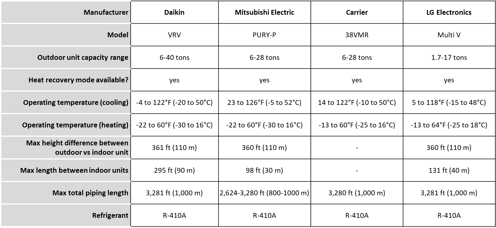
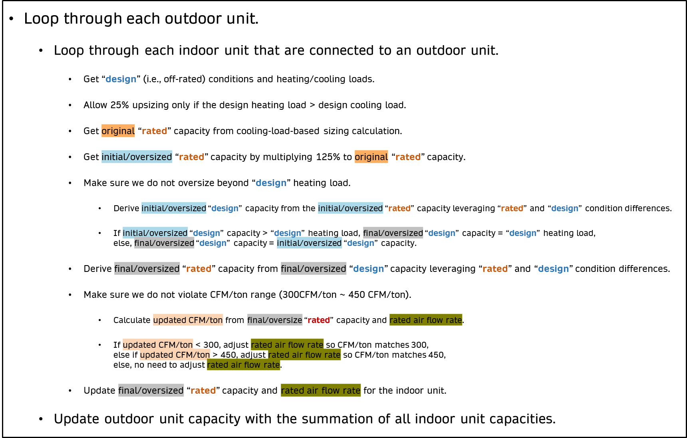
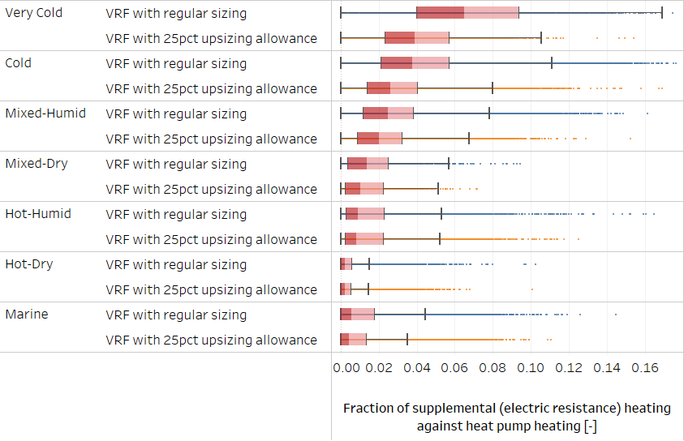

# Variable Refrigerant Flow With 25% Upsizing Allowance for Heating

Author: Janghyun Kim, Chris CaraDonna, and Andrew Parker

## Executive Summary

Building on the successfully completed effort to calibrate and validate the U.S. Department of Energy's ResStock™ and ComStock™ models over the past several years, the objective of this work is to produce national datasets that empower analysts working for federal, state, utility, city, and manufacturer stakeholders to answer a broad range of analysis questions.

The goal of this work is to develop energy efficiency, electrification, and demand flexibility end-use load shapes (electricity, gas, propane, or fuel oil) that cover most of the high-impact, market-ready (or nearly market-ready) measures. "Measures" refer to energy efficiency variables that can be applied to buildings during modeling.

An *end-use savings shape* is the difference in energy consumption between a baseline building and a building with an energy efficiency, electrification, or demand flexibility measure applied. It results in a time-series profile that is broken down by end use and fuel (electricity or on-site gas, propane, or fuel oil use) at each time step.

ComStock is a highly granular, bottom-up model that uses multiple data sources, statistical sampling methods, and advanced building energy simulations to estimate the annual subhourly energy consumption of the commercial building stock across the United States. The baseline model intends to represent the U.S. commercial building stock as it existed in 2018. The methodology and results of the baseline model are discussed in the final technical report of the [End-Use Load Profiles](https://www.nrel.gov/buildings/end-use-load-profiles.html) project.

This documentation focuses on a single end-use savings shape upgrade---a variable refrigerant flow (VRF) with heat recovery (HR) heating and cooling system coupled with a dedicated outdoor air system (DOAS) for ventilation, where 25% upsizing (or 125% of the original size) is allowed for heating in colder climates (i.e., heating-dominant regions). This document primarily discusses the additional changes to the sizing algorithm and modeling approach; a comprehensive overview of the fundamental modeling methodology and background of the VRF (HR) DOAS upgrade, including applicability and other key assumptions, can be found in the original documentation: [Variable Refrigerant Flow with Heat Recovery and Dedicated Outdoor Air System](https://www.nrel.gov/docs/fy24osti/86103.pdf).

To provide high-level context on the 25% upsizing algorithm, if a thermal zone is cooling dominant, the indoor unit capacity of the VRF heat pump is sized based on the design cooling load. However, if the thermal zone is heating dominant, it is allowed for the 25% upsizing allowance. Once the 25% upsizing is allowed, if the 25% upsized capacity (or 125% from the original size) represented with the design condition exceeds the design heating load, the design heating load is used to calculate the rated capacity of the indoor unit. If the 25% upsized capacity represented with the design condition does not exceed the design heating load, the 25% upsized capacity represented with the rated condition is used for the capacity of the indoor unit, while the remaining heating load is handled with the supplemental/backup electric resistance coil. The outdoor unit capacity is calculated by summing all indoor unit capacities. More detailed description of the upsizing algorithm is presented in Section 3.2.2.

The VRF DOAS with 25% upsizing allowance upgrade demonstrates 13% total site energy savings (576 trillion British thermal units \[TBtu\]) for the U.S. commercial building stock modeled in ComStock (Figure 7). It also demonstrates between 33 and 44 million metric tons of greenhouse gas emissions avoided for the three grid electricity scenarios presented, as well as 23 million metric tons of greenhouse gas emissions avoided for on-site natural gas consumption. The savings are primarily attributed to:

-   **41%** stock **heating natural gas** savings (348 TBtu)

-   **27%** stock **fan electricity** savings (139 TBtu)

-   **16%** stock **cooling electricity** savings (109 TBtu)

-   **46%** stock **heating other fuel** savings (36 TBtu)

-   **19%** stock **pump electricity** savings (8 TBtu)

-   **13%** stock **district heating** savings (6 TBtu)

-   **−274%** stock **heat recovery electricity** savings (−17 TBtu)

-   **−31%** stock **heating electricity** savings (−54 TBtu).

Compared to the [VRF DOAS analysis with original sizing](https://www.nrel.gov/docs/fy24osti/86103.pdf) we performed previously, the 25% upsizing allowance did not perform noticeably better. While the upsized unit handled more heating load with heat pumps and resulted in less usage of backup electric resistance heating (compared to the original sizing scenario), the upsized units also suffered with slightly decreased rated coefficients of performance (COP) based on the regression fittings we extracted from the products as shown in Figure 12 of the previous report. We acknowledge that there can be a better design practice to avoid "lower COP for larger units" as described in Section 2.4, and future analysis can explore this aspect. To assess the impact of this upgrade more comprehensively, other factors such as return on investment and utility bill cost reflecting demand charges should also be considered.

## 1. Introduction

This documentation covers the upgrade methodology for variable refrigerant flow (VRF) with 25% upsizing allowance for heating and briefly discusses key results. Results can be accessed on the ComStock data lake at "[end-use-load-profiles-for-us-building-stock](https://data.openei.org/s3_viewer?bucket=oedi-data-lake&prefix=nrel-pds-building-stock%2Fend-use-load-profiles-for-us-building-stock%2F2023%2F)" or via the Data Viewer at [comstock.nrel.gov](https://comstock.nrel.gov/).

| **Measure Title**  | Variable Refrigerant Flow With 25% Upsizing Allowance for Heating                 |
| **Measure Definition** | Replace variable air volume (VAV) or rooftop unit (RTU) systems with VRF (HR) dedicated outdoor air system (DOAS) and allow up to 25% upsizing (or up to 125% of original size) from cooling design load applied to a heating-dominant building. |
| **Applicability**      | Applicable to all spaces served by VAV and RTU systems that are not served by district heating or cooling. May apply to a portion of the building. The total number of indoor units per outdoor unit is also limited to 41. Applicable to 49% of total floor area of existing commercial building stock. |
| **Not Applicable**     | Not applicable to spaces (kitchen or dining) where a VRF (HR) with DOAS may be less appropriate. Buildings that are too large (\>200,000 ft2) or have large exhaust air are excluded as well. |
| **Release**            | 2024 Release 1: 2024/comstock_amy2018_release_1/   |

The upgrade described in this document concerns replacing an existing heating, ventilating, and air-conditioning (HVAC) system. The upgraded system decouples ventilation from space conditioning, with ventilation handled by a DOAS and the remaining space conditioning handled by a VRF air-source heat pump system. An additional consideration in this study compared to the [previous work](https://www.nrel.gov/docs/fy24osti/86103.pdf) on VRF (HR) DOAS upgrade is the allowance of up to 25% upsizing (or 125% of the original size) from equipment sized to the design cooling load for heating-dominant buildings.

Figure 1 shows the key features of the VRF system considered in this modeling work. VRF heat pump systems use direct expansion to transfer heat between indoor and outdoor air for use in both heating and cooling operation. Thermodynamically, VRF systems have many of the same components as (conventional) heat pumps such as compressors, expansion devices, and heat exchangers. VRF systems transfer heat between one or, more commonly, multiple indoor units, often called "heads" or "terminal units," with a shared common outdoor unit. Some features that differentiate VRF systems from other types of heat pump systems are the scalability (multiple indoor units can be served by one outdoor unit), prevalence of variable speed compressors, distributed control of the refrigerant network, and in some cases the ability to utilize simultaneous heating and cooling between heads of the same system. According to the *2020 ASHRAE Handbook: HVAC Systems and Equipment* \[1\], a VRF system requires the ability to vary the system capacity by three or more steps with one or more indoor units individually controlled through an interconnected piping and communications network.

{:refdef: style="text-align: center;"}

{:refdef}

{:refdef: style="text-align: center;"}
Figure 1. Highlights of a VRF heat pump system with heat recovery \[2\]
{:refdef}

There are two distinctive types of VRF systems: (1) multi-split VRF without simultaneous heating and cooling, and (2) VRF with heat recovery (HR) capable of simultaneous heating and cooling. As shown in Figure 1, the VRF (HR) system that allows a single outdoor unit connected to multiple indoor units can provide heating and cooling simultaneously between different zones as needed. This ability to heat and cool simultaneously is made possible by (1) controlling and regulating the refrigerant flow differently between different indoor units and the outdoor unit, and (2) recovering heat from the cooling zones and repurposing the energy for the heating zones. This is advantageous in buildings with varying space conditions that have different heating and cooling requirements. For example, a conference room in the core of a building may require cooling year-round, while perimeter offices may require heating in the winter and cooling in the summer.

Within the category of VRF (HR), the system can be designed as either a two-pipe or three-pipe system, and manufacturers tend to select one option for their model lineup. The selection depends more on the layout of the floor plan and budget than on system heating and cooling demands. The main difference between the two systems is the number of pipes used to connect the outdoor unit to the branch controller (two pipes versus three). Depending on whether the system is a two- or three-pipe system, the piping layout can vary significantly, resulting in a different overall piping length. This in turn affects the performance of the VRF system (Figure 2). Additionally, while the three-pipe system requires a special Y-branch copper pipe fitting (also known as REFNET fitting), it is not required for the two-pipe system. The three-pipe system is known to provide better heating capacity at lower temperatures (compared to two-pipe systems) through less refrigerant line heat losses when designed properly \[3\].

{:refdef: style="text-align: center;"}

{:refdef}

{:refdef: style="text-align: center;"}
Figure 2. Different piping layouts between two- and three-pipe systems on the same building design \[3\]
{:refdef}

VRF systems are highly versatile and scalable. Typical capacities range from 1.5 to 63 tons for outdoor units and 0.4 to 10 tons for indoor units \[1\]. Multiple outdoor units can be connected together to serve larger demands. Some (not all manufacturers' outdoor units) VRF systems allow more than 60 indoor units to be connected to a single outdoor unit, which allows them to be applied to many building designs. Table 1 includes specifications of some VRF (HR) products in the market.

Table 1. Specifications of Available VRF (HR) Systems on the Market

{:refdef: style="text-align: center;"}

{:refdef}

VRF systems, like many heat pumps, have several sizing options. One of the options is to size the system to meet the design cooling load. If the associated heating capacity for that equipment cannot meet the full design heating load, supplemental heating is then used to address any unmet load from the VRF system. Supplemental heat can be sourced from various options, including an existing system, electric resistance baseboards, or electric resistance elements integrated within ducted systems \[4\]. This option may be attractive in very cold climates to avoid oversized equipment for the cooling load and to limit additional upfront costs from upsizing to larger VRF systems.

They can also be sized such that the available heat pump capacity at the design heating temperature matches the design heating load, accounting for the decreased heat pump capacity at temperatures lower than the rating point. This avoids the need for any supplemental heating system and can maximize efficiency, but may require "upsizing" to a larger VRF system, which adds cost \[4, 5\]. However, Trane recommends limiting VRF oversizing to a maximum of 125% of the design cooling load, so the system does not end up being too oversized for the cooling load \[6\]. Daikin has similar recommendations for limiting oversizing, citing that oversized equipment can lead to control issues. This suggests that it may not be advisable to size for the full heating load at the heating design temperature in some climates. Furthermore, the compressor lockout temperature, which specifies the minimum operating temperature for the heat pump, needs to be considered. If the design heating conditions are below that temperature, a supplemental heating source will need to meet the full design heating load.

For this study, we allow up to 25% upsizing (or 125% of the original size) from the design cooling load only for heating-dominant buildings. To provide high-level context on the 25% upsizing algorithm, if a thermal zone is cooling dominant, the indoor unit capacity of the VRF heat pump is sized based on the design cooling load. However, if the thermal zone is heating dominant, it is allowed for the 25% upsizing allowance. Once the 25% upsizing is allowed, if the 25% upsized capacity (or 125% from the original size) represented with the design condition exceeds the design heating load, the design heating load is used to calculate the rated capacity of the indoor unit. If the 25% upsized capacity represented with the design condition does not exceed the design heating load, the 25% upsized capacity represented with the rated condition is used for the capacity of the indoor unit, while the remaining heating load is handled with the supplemental/backup electric resistance coil. The outdoor unit capacity is calculated by summing all indoor unit capacities. More detailed description of the upsizing algorithm is presented in Section 3.2.2 and details on the DOAS and additional background on the technology can be found in the [Variable Refrigerant Flow with Heat Recovery and Dedicated Outdoor Air System](https://www.nrel.gov/docs/fy24osti/86103.pdf) measure from Commercial End-Use Savings Shapes 2023 Release 2.

## 2. ComStock Baseline Approach

The state (e.g., type, efficiency, configuration) of the existing HVAC systems in ComStock is based on a combination of the year a building was built and how the equipment has been updated over time. Equipment performance and features are assumed to meet the energy code requirements at the time and location of installation. The ComStock workflow checks the necessary characteristics of each HVAC system to determine if a feature is required. Similarly, heating, cooling, and fan efficiencies are set based on the presiding code year. The baseline assumptions are important, as they will influence the estimations of savings from a certain upgrade.

Figure 3 shows the distribution of different HVAC system types in these baseline models. Packaged single-zone units (PSZ in Figure 3) cover a large amount of floor area and consume a large amount of site energy. VAV systems, either packaged VAV (PVAV in Figure 3) or built-up VAV (VAV in Figure 3), are the next most prevalent system type in the building stock. More details around HVAC system distribution and modeling are included in the *ComStock Reference Documentation* \[7\].

{:refdef: style="text-align: center;"}

{:refdef}

{:refdef: style="text-align: center;"}
Figure 3. Distribution of different HVAC system types in baseline models
{:refdef}

As shown in Figure 3, VRF DOAS exist in a very small portion of the baseline models. As mentioned previously, the distribution of baseline buildings with VRF DOAS is based on the HVAC system type distribution estimated from the 2012 Commercial Buildings Energy Consumption Survey. Also, the specification and performance of the VRF DOAS in the baseline models reflect requirements based on the energy code in force during the most recent HVAC update. Some of these specifications are also highlighted in Figure 3.

One of the outcomes of this upgrade implementation is to determine reasonable buildings and HVAC systems that could be retrofitted with a VRF DOAS; therefore, understanding the distribution of potential HVAC systems is important. More details regarding the applicability criteria for the upgrade can be found in Section 2.1.

## 3. Modeling Approach

### 3.1 Applicability

In the 2021 Slipstream report \[8\], representatives from the major manufacturers (Daikin, Mitsubishi, LG, and Fujitsu) shared thoughts on favorable candidates for VRF retrofit projects based on their experiences: old buildings with tight spaces, buildings using a significant amount of electric heating, and buildings no larger than 200,000 ft2 of floor area. For the larger buildings, because the VRF system is modular, the implementation cost increases linearly with increasing floor area. Because the unit cost (per ton) of traditional systems (including boilers and chillers) decreases with increasing floor area, the report mentions that it usually makes VRF systems less attractive for larger buildings in terms of economics. Additionally, if an existing building has a VAV system with features like ductwork, piping, and wiring already in place, it is often more economical to upgrade the existing system rather than switching to a VRF DOAS. Buildings that have high ventilation rates (either high outdoor air or high exhaust air rates) were also not considered good candidates by manufacturer representatives. If a building brings in a large amount of outdoor air (e.g., a hospital), more mechanical air-conditioning effort will be geared toward the DOAS. This means that the VRF---which has a higher coefficient of performance (COP)---will be used less, decreasing the return on investment.

The applicability of the upgrade for this modeling implementation includes criteria for building/space type, building size, and HVAC system type: (1) buildings (restaurants and hospitals) or spaces (kitchen or dining) that have a relatively large amount of natural or forced exhaust air or large ventilation air are excluded; (2) buildings that have total floor area larger than 200,000 ft2 are excluded; (3) VRF indoor unit count is limited to 41 based on manufacturer's data sheet \[9\]; and (4) RTUs or VAV systems that use district heating or cooling are excluded.

The HVAC system type criteria is mostly for repurposing the existing air duct system for the DOAS, which is why residential systems, packaged terminal units, and existing systems with DOAS are not included. The building and space type criteria exclude buildings and spaces that minimize the effectiveness of the DOAS. Several building types have relatively large amounts of exhaust air based on the nature of the building operation. Restaurants using exhaust fans to push air from the kitchen to the outdoors is one example. The loss of air through these other channels reduces the amount of exhaust air that goes to the DOAS, resulting in less effectiveness of heat or energy recovery. Hospitals are excluded as well due to large amounts of ventilation air.

Because of the space type criteria, there are buildings (after the upgrade) where existing HVAC systems (e.g., VAV, chiller, and cooling tower) can still serve a portion of the entire building. The floor area criteria are based on the cost-prohibitive nature mentioned previously (i.e., it is cheaper to retrofit with boilers and chillers).

We also apply VRF DOAS upgrades to retail strip malls. In practice, each tenant in a strip mall will have their own separate meter, which will also make each tenant (and served space) have a separate and stand-alone HVAC system. Thus, a more realistic upgrade path is to install separate VRF DOAS for each tenant (i.e., multiple VRF DOAS if there are multiple tenants). However, our current VRF DOAS implementation is a single system per floor to minimize the burden on modeling implementation and computing resources. While this implementation method is not exactly aligning with reality, it will not be impacted much in terms of energy analysis in the stock level.

Figure 4 shows the coverage of applicable buildings for this upgrade in terms of percent total floor area. Applicable buildings for this upgrade cover 49% of the total floor area. While RTUs and VAV systems are applicable system types, RTUs and VAV systems marked as "not applicable" in the figure represent either (1) such systems using district heating or cooling or (2) total number of indoor units exceeding 41 per outdoor unit. System types that are not applicable to the upgrade are also highlighted in the figure, as well as building types that include relatively large amounts of exhaust air or buildings with relatively large floor area.

{:refdef: style="text-align: center;"}

{:refdef}

{:refdef: style="text-align: center;"}
Figure 4. Coverage of applicable buildings for the upgrade
{:refdef}

### 3.2 Technology Specifics

This report is a slight modification to the [Variable Refrigerant Flow with Heat Recovery and Dedicated Outdoor Air System](https://www.nrel.gov/docs/fy24osti/86103.pdf) measure from Commercial End-Use Savings Shapes 2023 Release 2, allowing 25% upsizing (or 125% from the original size) for buildings in heating-dominant regions. Because it shares much of the same information described in the previous documentation, the following sections highlight major differences and some key information that are worth repeating for VRF systems. All details regarding the DOAS can be found in the previous documentation.

#### 3.2.1 Clear Definitions of COP Metrics

COP is a well-known metric within the HVAC industry; however, it can often have different definitions, and calculation methods can be different. We use and differentiate between the three COP metrics shown below throughout this document:

-   **COPcomp&fan,design** refers to a COP that only includes power consumed by the compressor and outdoor unit fan, which is useful for comparing against the manufacturer's performance map. The operating conditions (e.g., indoor/outdoor temperature, part-load ratio) for calculating this COP are mostly fixed to the design conditions (e.g., indoor/outdoor air temperatures vary in manufacturer performance maps, while all other conditions are constant).

-   **COPcomp&fan,operating** refers to a COP that only includes power consumed by the compressor and outdoor unit fan, which is useful for comparing against the manufacturer's performance map. The operating conditions (e.g., indoor/outdoor temperature, part-load ratio) for calculating this COP reflect actual/varying operating conditions.

-   **COPsystem,operating** is the overall system COP including not only the compressor and outdoor unit fan powers, but also electricity used for backup/supplemental heating when VRF heating capacity cannot meet the heating demand. Compressor power in this metric also includes electricity used for reverse cycling for defrosting operation and miscellaneous power such as crankcase and basin heater powers. The fan power used in indoor unit fans is not included in this metric, and operating conditions (e.g., indoor/outdoor temperature, part-load ratio) for calculating this COP reflect actual/varying operating conditions.

#### 3.2.2 Sizing

The only change in this study from [previous documentation](https://www.nrel.gov/docs/fy24osti/86103.pdf) (other than fixes described in Section 2.2.3 that were resolved from the previous documentation) is the sizing algorithm for the VRF system: originally from cooling-design-load-based sizing to allowing up to 25% upsizing (or 125% from original sizing) from the cooling design load when the design heating load surpasses the design cooling load. Upsizing is intended to enable the VRF heat pump to address more of the heating load, minimizing the use of relatively less efficient electric resistance backup heat. The custom sizing algorithm applied in this study is depicted in Figure 5. To note, because the sizing algorithm in the EnergyPlus calculates the appropriate design airflow rate (based on design load conditions) for each indoor unit, the upsizing algorithm implemented in this study does not change the airflow unless it violates the cfm/ton bound that is warned from the EnergyPlus. This is a difference compared to a realistic upsizing scenario where, in reality, the upsizing unit will involve upsized airflow as well.

{:refdef: style="text-align: center;"}

{:refdef}

{:refdef: style="text-align: center;"}
Figure 5. Narrative description of upsizing algorithm in measure implementation
{:refdef}

#### 3.2.3 Other Modeling Updates

There are several fixes we made that did not happen in the previous work. These are listed below, which are from simple mistakes to EnergyPlus® source code limitations:

-   The implementation of maximum operating temperature for heat pump heating was overlooked in the previous implementation. While manufacturer data showed that heat pump heating gets locked out when the outdoor air temperature is above 86°F (30°C), the actual value that was implemented in previous simulations was 61°F (16°C). The maximum operating temperature for heat pump heating is now corrected to 86°F (30°C).

-   There are many output variables shown in Section 3 that are being reported after a ComStock run. While the design COP of a VRF heat pump at −22°F was initially implemented in the workflow to provide performance indicators of the cold climate heat pump, it was discovered that this output was never reported after the actual ComStock run. This output is fixed in this iteration.

### 3.3 Greenhouse Gas Emissions

Three electricity grid scenarios are presented to compare the emissions of the ComStock baseline and the window replacement scenario. The choice of grid scenario will impact the grid emissions factors used in the simulation, which determines the corresponding emissions produced per kilowatt-hour. Two scenarios---Long-Run Marginal Emissions Rate (LRMER) High Renewable Energy Cost 15-Year and LRMER Low Renewable Energy Cost 15-Year---use the Cambium dataset, and the third scenario uses the Emissions & Generation Resource Integrated Database (eGRID) dataset \[9, 10\]. All three scenarios vary the emissions factors geospatially to reflect the variation in grid resources used to produce electricity across the United States. The Cambium datasets also vary emissions factors seasonally and by time of day. This study does not imply a preference for any particular grid emissions scenario, but other analysis suggests that the choice of grid emissions scenario can impact results \[12\]. Emissions due to on-site combustion of fossil fuels use the emissions factors shown in Table 2, which are from Table 7.1.2(1) of the draft Standard 301 from the American National Standards Institute/Residential Energy Services Network/International Code Council \[13\]. To compare total emissions due to both on-site fossil fuel consumption and grid electricity generation, the emissions from a single electricity grid scenario should be combined with all three on-site fossil fuel emissions.

Table 2. On-Site Fossil Fuel Emissions Factors

{:refdef: style="text-align: center;"}

{:refdef}

### 3.4 Limitations and Concerns

There are several limitations not captured in this analysis that could result in unrealistic representations of some buildings. Below are those limitations, which can be further improved in future analysis:

-   Based on EnergyPlus source code, the VRF supplemental heating coil cannot operate below the heat pump's minimum outdoor air operating temperature. This issue was discovered after running the full ComStock simulations and seeing increased hours of heating set point unmet hours. The manufacturer claims that the supplemental electric resistance coil can operate below the heat pump lockout temperature; thus, we have created an issue in the EnergyPlus code repository: [github.com/NREL/EnergyPlus/issues/10246](https://github.com/NREL/EnergyPlus/issues/10246).

-   There are many criteria applied for determining the applicability of the upgrade as described in Section 4.1. However, while the total number of indoor units of 41 per outdoor unit is applied as one of the applicability criteria, a more specific limit on refrigerant configuration such as maximum piping length between indoor to indoor/outdoor unit and maximum vertical piping height between indoor to outdoor unit is not applied as the applicability criteria. Total counts of indoor/outdoor units per building, as well as maximum piping length and maximum vertical height, are all included in the dataset.

-   As reflected in Figure 5, our current approach adjusts capacity (only when the upsizing is allowed) and adjusts the rated airflow rate only if the new cfm/ton from the upsized rated capacity violates EnergyPlus's cfm/ton range that is bounded between 300 and 450 cfm/ton. To provide more context on this bound, the lower limit of 300 cfm/ton is what EnergyPlus considers to avoid frost formation on the heat exchanger. The upper limit of 450 cfm/ton is what EnergyPlus considers to avoid blow-off of condensates that might cause rust on metal ducts downstream of the heat exchanger. These limits are mostly for when the heat exchanger is in cooling mode. Because EnergyPlus cannot model frost formation and condensate blow-off, this is rather implemented as a warning to users so they are not modeling unrealistic heat exchanger configurations. More detailed discussion on this topic is described in a past [EnergyPlus issue](https://github.com/NREL/EnergyPlus/issues/6115). This information is added to provide more context on the cfm/ton limits forced in the EnergyPlus simulations.

-   If an existing HVAC system gets replaced with a new HVAC system, there are many considerations for a designer. For a VRF DOAS, this gets even more complicated because the configuration (e.g., zoning, refrigerant piping layout) can affect the performance, resilience, and cost of the overall system. Additionally, if the designer needs to consider two options between regular sizing (based on design cooling load) and upsizing, this might change (1) zoning with indoor units, (2) layout of refrigerant piping, and (3) how many outdoor units to install. For example, if the original sizing resulted in one 8-ton outdoor unit, the 25% upsizing option for a total 10-ton capacity might be better with two 5-ton outdoor units rather than one 10-ton outdoor unit considering smaller-size units perform better in COPs. While these design decisions can involve more diverse configurations between regular and upsizing options, our current modeling approach simplifies the upsizing option to have the same exact configuration as the regular sizing option and just replacing the existing unit to a larger-size unit. This assumption has an implication of rated COP penalties in both heating and cooling for upsized units.

-   Based on a review from the reviewer before publishing the report, it has been revealed that, in some cases, zones that would benefit from the upsizing may be overlooked with the upsizing algorithm applied in this analysis. Just comparing design condition loads (based on the algorithm described in Figure 5) does not account for the change in cooling/heating capacity between design conditions and rated conditions. Thus, it is possible for a zone (or zones) in a building to have a lower design heating load than cooling load, but still require a larger rated capacity heat pump to meet the design heating load than the design cooling load. We suspect that the impact of this issue will not make a noticeable change in the results we are presenting but the issue will be reviewed and revised in the future analysis.

## 4. Output Variables

Table 3 includes a list of output variables calculated in ComStock. These variables are important in terms of understanding the differences between buildings with and without the VRF (HR) with 25% upsizing allowance measure applied. These output variables can also be used to understand the economics of the upgrade (e.g., return on investment) if cost information (i.e., material, labor, and maintenance costs for technology implementation) is available.

Table 3. Output Variables Calculated from the Measure Application

| **Name** | **Description / Notes** |
| vrf_indoor_unit_count | Number of VRF indoor units |
| vrf_outdoor_unit_count | Number of VRF outdoor units |
| vrf_average_num_compressors | Average number of compressors per outdoor unit, weighted by area served |
| vrf_average_line_length | Maximum piping length of VRF systems weighted by area served |
| vrf_average_line_height | Maximum piping vertical height of VRF systems weighted by area served |
| vrf_total_indoor_unit_cooling_capacity | Combined cooling capacity of VRF indoor units |
| vrf_total_indoor_unit_heating_capacity | Combined heating capacity of VRF indoor units |
| vrf_area_average_indoor_unit_cooling_capacity | Average cooling capacity of VRF indoor units weighted by area served |
| vrf_area_average_indoor_unit_heating_capacity | Average heating capacity of VRF indoor units, weighted by area served |
| vrf_total_outdoor_unit_cooling_capacity | Combined cooling capacity of VRF outdoor units |
| vrf_total_outdoor_unit_heating_capacity | Combined heating capacity of VRF outdoor units |
| vrf_average_outdoor_unit_cooling_capacity | Average cooling capacity of VRF outdoor units weighted by area served |
| vrf_average_outdoor_unit_heating_capacity | Average heating capacity of VRF outdoor units weighted by area served |
| vrf_total_cooling_load | Total cooling load served by VRF equipment |
| vrf_total_heating_load | Total heating load served by VRF equipment |
| vrf_total_heat_recovery | Total heat recovery of VRF equipment |
| vrf_heating_fraction_supplemental | Fraction of total heating load supplied by VRF supplemental/backup/auxiliary heating coils against total heating load supplied by VRF heat pump heating |
| vrf_heating_total_supplemental_load | Total heating load supplied by VRF supplemental/backup/auxiliary heating coils |
| vrf_heating_total_supplemental_load_electric | Total heating load supplied by VRF supplemental/backup/auxiliary heating electric coils |
| vrf_heating_total_supplemental_load_gas | Total heating load supplied by VRF supplemental/backup/auxiliary heating gas coils |
| vrf_heating_total_supplemental_electric | Total VRF supplemental/backup/auxiliary heating coil electric use |
| vrf_heating_total_supplemental_gas | Total VRF supplemental/backup/auxiliary heating coil gas use |
| vrf_cooling_average_cop | Annual average COP of VRF cooling equipment weighted by load |
| vrf_heating_average_cop | Annual average COP of VRF heating equipment weighted by load |
| vrf_heating_average_total_cop | Annual average COP of VRF heating equipment including defrost energy and crankcase heating weighted by total VRF heating load |
| vrf_cooling_design_cop | Design COP of VRF cooling equipment weighted by load |
| vrf_cooling_design_cop_35f | Design COP of VRF cooling equipment at 35°F weighted by load |
| vrf_cooling_design_cop_60f | Design COP of VRF cooling equipment at 60°F weighted by load |
| vrf_cooling_design_cop_85f | Design COP of VRF cooling equipment at 185°F weighted by load |
| vrf_cooling_design_cop_110f | Design COP of VRF cooling equipment at 110°F weighted by load |
| vrf_heating_design_cop | Design COP of VRF heating equipment weighted by load |
| vrf_heating_design_cop_minus22f | Design COP of VRF heating equipment at −22°F weighted by load |
| vrf_heating_design_cop_0f | Design COP of VRF heating equipment at 0°F weighted by load |
| vrf_heating_design_cop_20f | Design COP of VRF heating equipment at 20°F weighted by load |
| vrf_heating_design_cop_40f | Design COP of VRF heating equipment at 40°F weighted by load |
| vrf_temperature_type | Outdoor temperature type used for VRF heating energy input ratio performance curves, either dry bulb or wet bulb |

## 5. Results

This section presents results both at the stock level and for individual buildings through savings distributions. Stock-level results include the combined impact of all the analyzed buildings in ComStock, including buildings that are not applicable to this upgrade. Therefore, they do not necessarily represent the energy savings of a particular or average building. Stock-level results should not be interpreted as the savings that a building might realize by implementing the upgrade.

Total site energy savings are also presented in this section. Total site energy savings can be a useful metric, especially for quality assurance/quality control, but this metric on its own can have limitations for drawing conclusions. Further context should be considered, as site energy savings alone do not necessarily translate proportionally to savings for a particular fuel type (e.g., gas or electricity), source energy savings, cost savings, or greenhouse gas savings. This is especially important when an upgrade impacts multiple fuel types or causes decreased consumption of one fuel type and increased consumption of another. Many factors should be considered when analyzing the impact of an energy efficiency or electrification strategy, depending on the use case.

Figures in this section, including distributions that highlight the entire stock model data points, are visualized to highlight most of the stock (i.e., mostly the interquartile range of the entire models), meaning the outliers (i.e., models with less impact on energy) might not have been included in the scales applied in figures.

### 5.1 Single Building Upgrade Tests

Table 4 shows the sizing comparison of a sample model with and without upsizing allowance. A weather file that represents Helena, Montana (ASHRAE climate zone 6B), is applied to this sample model to highlight upsizing implementation under a relatively colder region. As shown in the table, this sample building model includes nine indoor units where each indoor unit contains three types of coil models: backup electric resistance coil, cooling coil, and heating coil. Based on the upsizing algorithm shown in Figure 5, the upsizing is applied to eight indoor units where seven out of those eight units received the full 25% upsizing while one of them received 17% upsizing. The reason for the 17% upsizing instead of the full 25% is because 17% upsizing matches 100% with the design heating load (6,595 W), so additional capacity is not necessary. The only indoor unit (i.e., indoor unit 4 in Table 4) that did not receive the upsizing is because the indoor unit's design cooling load (14,787 W) is larger than the design heating load (10,261 W), meaning it is not a heating-dominant zone and upsizing for heating is not necessary. The original sizing based on the design cooling load violated the maximum allowable 450 cfm/ton; thus, the design capacities before the upsizing do not match with the reference design load. While the upsizing allowance was set to 25% initially, the actual upsizing resulted in an average 21.3% increase across all indoor units, as well as for the corresponding outdoor unit. As shown in the table, the size of the backup electric resistance coil matches the design heating load.

Table 4. Single Building Model Results: Sizing Results Before and After Upsizing Allowance

{:refdef: style="text-align: center;"}

{:refdef}

Figure 6 shows time-series results (covering 1 week) highlighting the difference with and without upsizing allowance for a sample model. The weather applied to this model represents the subarctic region, and the figure shows the outdoor air temperature reaching down to −20°F for this simulated week. Because the minimum operating temperature for VRF heating is set as −22°F, heat pump heating is kept operated during this simulation period. Because of the upsized coils, a heat pump provides a higher heating rate to the building, as shown in the second graph in Figure 6. Because of this additional heating power with an upsized unit, the backup heating rate (with an electric resistance coil) decreases, as shown in the third graph in Figure 6.

{:refdef: style="text-align: center;"}

{:refdef}

{:refdef: style="text-align: center;"}
Figure 6. Single building model results: time-series sample results before and after upsizing allowance
{:refdef}

Table 5 shows the annual summary results of the same sample simulations shown in Figure 6. While the upsized VRF unit provides benefits by leveraging a more efficient heating mechanism (i.e., heat pump heating) compared to electric resistance heating, there are downsides as well. Based on the product research conducted in the [previous analysis](https://www.nrel.gov/docs/fy24osti/86103.pdf), the rated COP of a VRF heat pump unit typically decreases with larger capacity. Thus, in our modeling, the upsized unit is assigned with slightly lower-rated COPs (compared to the unit without upsizing) for both heating and cooling, which will also result in lower operating COPs, as shown in Table 5. We also described about this limitation and what can be done in real designing in Section 3.4. The overall impact of the upsizing allowance implementation can be a combined result of benefits and drawback as summarized below:

-   Benefits:

    -   Relying more on higher-efficiency heating (i.e., heat pump heating) than lower-efficiency heating (i.e., electric resistance heating).

    -   Reduced fan runtime due to upsized coil capacity.

-   Drawback: Reduced COPs on both VRF heating and cooling.

Table 5. Single Building Model Results: Annual Results Before and After Upsizing Allowance

{:refdef: style="text-align: center;"}

{:refdef}

One more thing to note that is not reflected in this example result is that the oversized heat pump can run in lower part-load conditions compared to the originally sized equipment if operated on the same building. Because of leveraging variable speed compressors, this translates to more efficient operation (i.e., positive impact) in oversized VRF heat pumps. However, because the oversized heat pump also gets a lower rated COP (i.e., negative impact) compared to the originally sized heat pump, based on the regression fitting we use, the overall impact (i.e., operating COP) will vary depend on variety of buildings with different weather and load conditions. The stock level impact and piece-wise comparisons of electricity used for cooling (and other end uses) can be found in the following sections. It should be noted that other factors should also be considered (such as utility cost reflecting peak demand charges, greenhouse gas emissions, and return of investment) to comprehensively assess the impact of this upgrade.

###  5.2 Stock Energy Impacts

The VRF DOAS measure with 25% upsizing allowance that is applicable to 49% of the total building stock floor area demonstrates 13% total site energy savings (576 trillion British thermal units \[TBtu\]) for the U.S. commercial building stock modeled in ComStock, as shown in Figure 7 and Figure 8. The figure also shows the same plot with regular sized VRF as a comparison. The improvement from regular sizing to a 25% upsizing allowance is not noticeable in terms of overall site energy consumption. While more detailed breakdown findings can be found in Section 4.5, the small difference between regular and upsizing scenarios is the combined effect of (1) the positive impact of leveraging more heat pump heating and (2) the negative impact of decreased COP with upsized units (also described as a limitation in Section 2.4). The savings of the VRF DOAS with 25% upsizing allowance relative to the baseline are primarily attributed to:

-   **41%** stock **heating natural gas** savings (348 TBtu)

-   **27%** stock **fan electricity** savings (139 TBtu)

-   **16%** stock **cooling electricity** savings (109 TBtu)

-   **46%** stock **heating other fuel** savings (36 TBtu)

-   **19%** stock **pump electricity** savings (8 TBtu)

-   **13%** stock **district heating** savings (6 TBtu)

-   **−274%** stock **heat recovery electricity** savings (−17 TBtu)

-   **−31%** stock **heating electricity** savings (−54 TBtu).

{:refdef: style="text-align: center;"}

{:refdef}

{:refdef: style="text-align: center;"}
Figure 7. Comparison of annual site energy consumption between the ComStock baseline and the two VRF DOAS upgrade scenarios for the entire building stock
{:refdef}

{:refdef: style="text-align: center;"}

{:refdef}

{:refdef: style="text-align: center;"}
Figure 8. Comparison of annual site energy consumption between the ComStock baseline and the two VRF DOAS upgrade scenarios for only buildings that are applicable to the upgrade
{:refdef}

In terms of site energy, major energy savings come from converting natural-gas-fired heating to electric heat pump heating, and cooling electricity savings are from the higher-efficiency (compared to the existing building stock) COP performance of the VRF system. Electric heating is reduced in some buildings by this upgrade from the baseline by swapping relatively less efficient electric resistance air-handling units with a higher-efficiency VRF DOAS. However, electricity heating is generally increased in some buildings by electrifying air-handling units that were previously natural gas. Removing fans from the central air system and replacing those with VRF indoor unit fans and DOAS fans saves energy by decoupling ventilation and space conditioning. Overall, electricity heating energy increases. Although not as significant as savings described above, 1.3 TBtu (17% decrease) of electric energy ("Heat Rejection, Electricity" in the figure) is saved by removing existing cooling towers, and 17.9 TBtu (437% increase) of electric energy ("Heat Recovery, Electricity" in the figure) is additionally used by adding more DOAS (increased power with increased static pressure) to the building stock.

### 5.3 Stock Greenhouse Gas Emissions Impact

ComStock simulation results show greenhouse gas emissions avoided across all electricity grid scenarios and on-site combustion fuel types (Figure 9). Overall, the VRF (HR) with 25% upsizing allowance demonstrates between 33 million metric tons (14% reduction for LRMER Low Renewable Energy Cost 15 scenario) and 44 million metric tons (11% reduction for eGRID 2021 scenario) of greenhouse gas emissions avoided (from all fuel types) for the three grid electricity scenarios presented. This is due to reduced electricity consumption from the fans and cooling end use, but also includes the increase in electricity from electrifying gas heating systems. The emissions avoided from on-site combustion fuels (28%) are attributable to electrifying some of these combustion-based heating systems.

{:refdef: style="text-align: center;"}

{:refdef}

{:refdef: style="text-align: center;"}
Figure 9. Greenhouse gas emissions comparison of the ComStock baseline and the VRF DOAS
{:refdef}

### 5.4 Site Energy Savings Distributions

This section discusses site energy consumption for quality assurance/quality control purposes. Note that site energy savings can be useful for these purposes, but other factors should be considered when drawing conclusions, as these do not necessarily translate proportionally to source energy savings, greenhouse gas emissions avoided, or energy cost.

Figure 10 and Figure 11 show the percent and site end-use intensity savings distributions, respectively, of the baseline ComStock models versus the upgrade scenario by end use and fuel type for applicable models. Percent savings provide relative impact of the measure at the individual building level, while site end-use intensity savings provide absolute (or aggregated) scale of impact. Also, the data points that appear above some of the distributions indicate outliers in the distribution, meaning they fall outside 1.5 times the interquartile range. The value for *n* indicates the number of ComStock models that were applicable for energy savings for the fuel type category.

{:refdef: style="text-align: center;"}

{:refdef}

{:refdef: style="text-align: center;"}
Figure 10. Percent site energy savings distribution for ComStock models with the VRF DOAS upgrade applied by end use and fuel type
{:refdef}

{:refdef: style="text-align: center;"}

{:refdef}

{:refdef: style="text-align: center;"}
Figure 11. Site end-use intensity (EUI) savings distribution for ComStock models with the VRF DOAS upgrade applied by end use and fuel type
{:refdef}

Similar conclusions from the [previous VRF DOAS analysis](https://www.nrel.gov/docs/fy24osti/86103.pdf) can be drawn from Figure 10 and Figure 11. Highlights of the savings reflected in the two figures include:

-   Electrification of combustion fuel-based heating:

    -   Up to 100% savings on combustion fuel used for heating. Data points showing savings less than 100% are buildings with multiple HVAC systems and where the upgrade is only applicable to some of those systems.

-   Conversion of electric resistance heating to VRF heating:

    -   Positive savings on electricity used for heating.

-   Higher cooling COP of VRF (compared to baseline direct expansion systems):

    -   Positive savings on electricity used for cooling.

-   Converting hydronic system (e.g., chiller) to VRF:

    -   Positive savings on electricity used for pumps.

    -   Positive savings on electricity used for heat rejection (i.e., removal of cooling towers). Not always 100% savings because the applicability criteria with space type can result in buildings (after the upgrade) with existing HVAC system (e.g., VAV, chiller, and cooling tower) still serving a portion of the building.

-   Decoupling of ventilation with DOAS:

    -   Positive savings on electricity used for fans due to VRF indoor fans only operating on sensible cooling needs.

    -   Negative electricity cooling savings in moderate climate zones (e.g., California). This is due to the cooling coil in the DOAS operating based on outdoor air temperature reset control; thus, when the cooling load is less for a building, it can still provide conditioned air while the baseline system will only operate based on the load (i.e., controlled by space thermostat set point). However, these data points are mostly outliers and the overall impact is small, as shown in Figure 11.

-   DOAS with heat or energy recovery ventilator (H/ERV) :

    -   Negative savings on electricity used for heat recovery. These are buildings that originally included heat recovery and where the DOAS upgrade added a bigger heat recovery system; thus, bigger fans and higher static pressure.

-   Others:

    -   The change in electricity used for refrigeration is due to a new HVAC system affecting the space condition (e.g., temperature/humidity) that affects the refrigeration system's performance. The absolute impact is small, as shown in Figure 11.

    -   Data points showing extreme (e.g., −150% electricity cooling savings) positive/negative savings are (1) buildings either in very hot or very cold climates, (2) where absolute heating or cooling demand is small, and (3) even small changes (due to upgrade) in heating or cooling demand (e.g., megawatt-hours) resulting in large relative (e.g., percent) savings. The absolute impact of these data points is small, as shown in Figure 11.

    -   More detailed findings related to H/ERV can be found in the measure documentation of [H/ERV upgrade](https://www.nrel.gov/docs/fy24osti/87542.pdf).

Figure 12 shows the comparison of the ComStock baseline and the two upgrade scenarios (regular sizing and 25% upsizing allowance) in terms of the peak demand and timing changes. The differences between the two upgrade scenarios are not noticeable in terms of peak demands. The winter peak demand (in kilowatts per building floor area) increases in the colder regions in both sizing scenarios, and the peak timings of the heating demand shift to earlier in the day due to morning heating demands (covered by the VRF electric heating) in the winter season. The peak demand for cooling is reduced (from baseline) across all regions due to higher cooling COP used in VRF and energy recovery and the peak timing remaining similar.

{:refdef: style="text-align: center;"}

{:refdef}

{:refdef: style="text-align: center;"}
Figure 12. Comparison of the ComStock baseline and the upgrade scenario in terms of peak demand change
{:refdef}

### 5.5 More Detailed Findings

Detailed findings in the [previous VRF DOAS analysis](https://www.nrel.gov/docs/fy24osti/86103.pdf) mostly show the same trends and provide similar insights compared to this 25% upsizing allowance analysis. As discussed previously, the major difference of the 25% upsizing allowance versus the regular sizing comes from (1) the amount of backup heating triggered by the VRF system (and the corresponding heat pump heating) and (2) rated and operating COPs affected by the upsizing.

{:refdef: style="text-align: center;"}

{:refdef}

{:refdef: style="text-align: center;"}
Figure 13. Distribution of VRF annual average COPcomp&fan,operating
{:refdef}

Figure 13 shows annual average operating COP comparisons between two sizing scenarios. Because the upsizing is geared toward the colder region, the upsizing in those regions reduces the rated COP (i.e., bigger units tend to have lower-rated COP), resulting in decreased operating COPs. Also, installing larger units (to handle heating demand) also means lower part load ratios when handling cooling demand during cooling season and this will result in more cycling losses at mild conditions.

{:refdef: style="text-align: center;"}

{:refdef}

{:refdef: style="text-align: center;"}
Figure 14. Distribution of fraction of VRF supplemental heating with electric resistance heating
{:refdef}

Figure 14 shows the comparison of supplemental (or backup) heating fraction between two sizing scenarios. As can be expected, the 25% upsizing allowance provides more heat pump heating capacity toward colder regions and results in less usage of electric resistance backup heating. For the very cold region, the median backup heating fraction decreased from 5.8% to 3.4%.

{:refdef: style="text-align: center;"}

{:refdef}

{:refdef: style="text-align: center;"}
Figure 15. Distribution of annual average heating COPsystem,operating
{:refdef}

Figure 15 shows the overall/system (including backup heating energy) operating heating COP and how much shift (as a percent) happens from the COP based on compressor and outdoor unit fan power (i.e., how much COP we lose when including backup heating energy). As shown in the figure, most of the overall heating COP remains higher than 1 (i.e., better than electric resistance heating) even in the very cold regions. The impact of backup heating energy on the overall COP also shows less in the upsizing scenario compared to the regular sizing scenario in colder regions. The impact of upsizing is less in warmer regions.

{:refdef: style="text-align: center;"}

{:refdef}

{:refdef: style="text-align: center;"}
Figure 16. Median annual operating cooling COP (**COPsystem,operating)**
{:refdef}

{:refdef: style="text-align: center;"}

{:refdef}

{:refdef: style="text-align: center;"}
Figure 17. Median annual operating heating COP (**COPsystem,operating)**
{:refdef}

Figure 16 and Figure 17 shows median annual operating COPs for cooling and heating, respectively, across the contiguous United States. COPs shown in these figures are based on the 25% upsizing allowance scenario and illustrate median performance expectations of VRF DOAS across different regions under different weather conditions.

## References

\[1\] ASHRAE, *2020 ASHRAE Handbook: HVAC Systems and Equipment*. Atlanta, GA, 2020.

\[2\] Consortium for Energy Efficiency, "High Efficiency Commercial Air Conditioning and Heat Pumps Initiative," 2018.

\[3\] Insight Partners HVAC TV, VRF Heat Recovery 2 Pipe vs 3 Pipe?, (2020). Accessed: Jun. 06, 2023. \[Online Video\]. Available: https://www.youtube.com/watch?v=JsYtHBQXL-0

\[4\] "VRV Applications in Extreme Cold Climates," Daikin, 2017. \[Online\]. Available: https://www.daikinac.com/content/assets/DOC/White-papers-/BPG-EXTAMB.pdf

\[5\] Midwest Energy Efficiency Alliance (MEEA), *Cold Climate VRF: Best Practices*. Accessed: Sep. 14, 2023. \[Online Video\]. Available: https://us06web.zoom.us/rec/share/EgTFo5Wfjn08BX0hm9smP1rdxpICpRElujN91AWsLRvA5o5fvUGoUKNcwcGCIyaa.zTDa1uvt9NFwNuWd?startTime=1694615955000

\[6\] Trane, "APPLYING VRF SYSTEMS IN COLD-CLIMATE," 2020.

\[7\] A. Parker *et al.*, "ComStock Reference Documentation: Version 1," National Renewable Energy Laboratory, Golden, CO, NREL/TP-5500-83819. \[Online\]. Available: https://www.nrel.gov/docs/fy23osti/83819.pdf

\[8\] "MECA Air Source Variable Refrigerant Flow Field Study," Slipstream, 2021. Accessed: Jun. 07, 2023. \[Online\]. Available: https://slipstreaminc.org/publications/meca-air-source-variable-refrigerant-flow-field-study

\[9\] "Daikin Engineering Data: Design Manual," Daikin, 2020. \[Online\]. Available: https://backend.daikincomfort.com/docs/default-source/product-documents/commercial/manual/engineering-manuals/em-relq_ta-(edus371705d-d).pdf

\[10\] "Cambium \| Energy Analysis \| NREL." Accessed: Sep. 02, 2022. \[Online\]. Available: https://www.nrel.gov/analysis/cambium.html

\[11\] "Emissions & Generation Resource Integrated Database (eGRID) \| US EPA." Accessed: Sep. 02, 2022. \[Online\]. Available: https://www.epa.gov/egrid

\[12\] E. Present, Pieter Gagnon, Eric J.H. Wilson, Noel Merket, Philip R. White, and Scott Horowitz, "Choosing the Best Carbon Factor for the Job: Exploring Available Carbon Emissions Factors and the Impact of Factor Selection," 2022.

\[13\] G. Vijayakumar *et al.*, "ANSI/RESNET/ICC 301-2022 - Standard for the Calculation and Labeling of the Energy Performance of Dwelling and Sleeping Units using an Energy Rating Index," Oceanside, CA, 2022.

A.  Additional Figures

{:refdef: style="text-align: center;"}

{:refdef}

{:refdef: style="text-align: center;"}
Figure A-1. Site annual natural gas consumption of the ComStock baseline and the upgrade scenario by census division
{:refdef}

{:refdef: style="text-align: center;"}

{:refdef}

{:refdef: style="text-align: center;"}
Figure A-2. Site annual natural gas consumption of the ComStock baseline and the upgrade scenario by building type
{:refdef}

{:refdef: style="text-align: center;"}

{:refdef}

{:refdef: style="text-align: center;"}
Figure A-3. Site annual electricity consumption of the ComStock baseline and the upgrade scenario by building type
{:refdef}

{:refdef: style="text-align: center;"}

{:refdef}

{:refdef: style="text-align: center;"}
Figure A-4. Site annual electricity consumption of the ComStock baseline and the upgrade scenario by census division
{:refdef}
