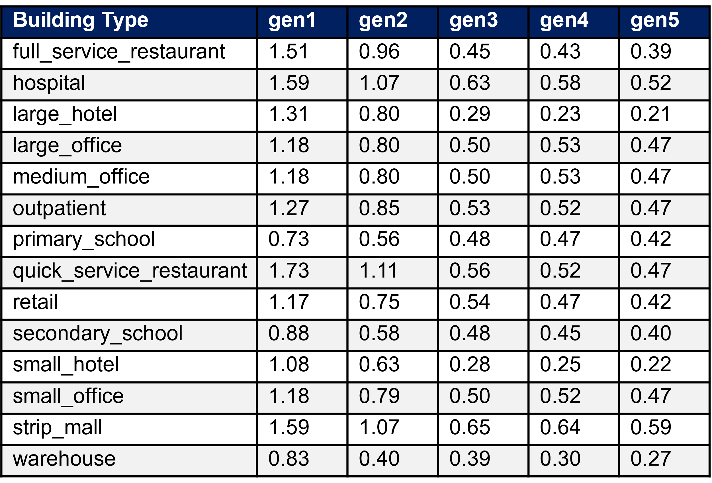
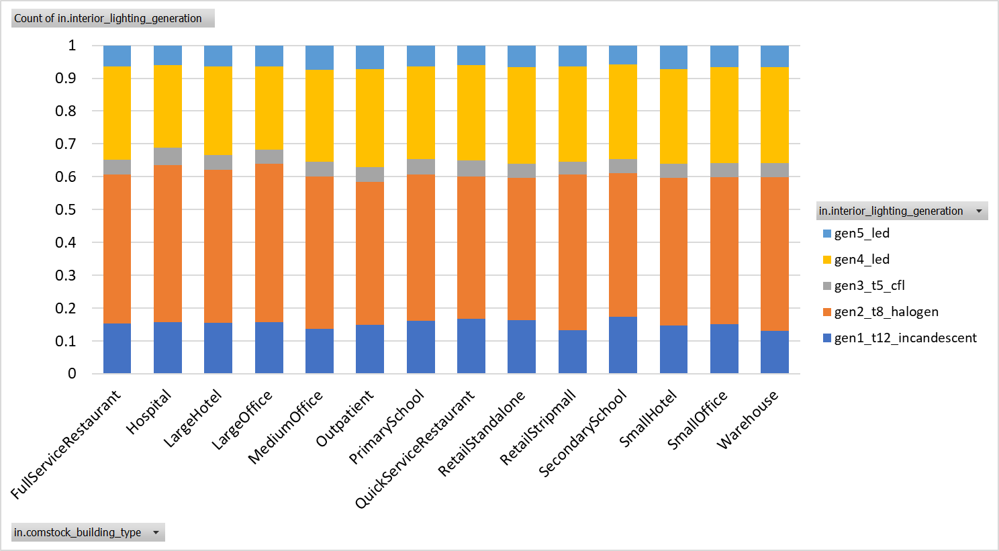
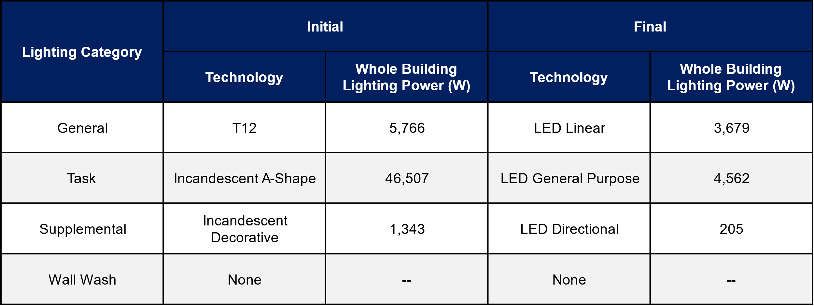
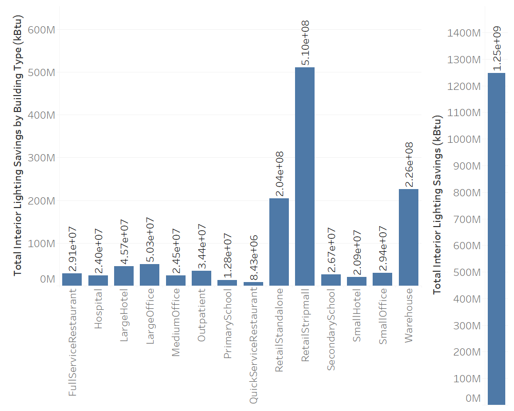
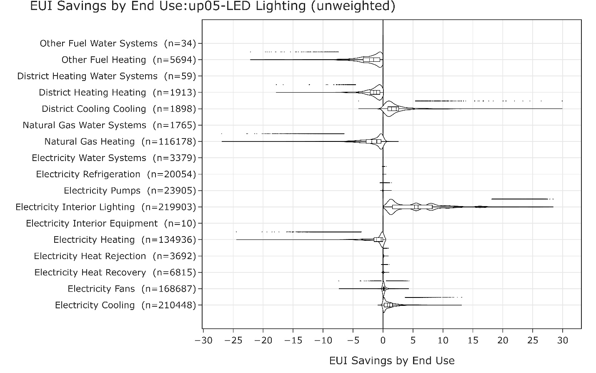
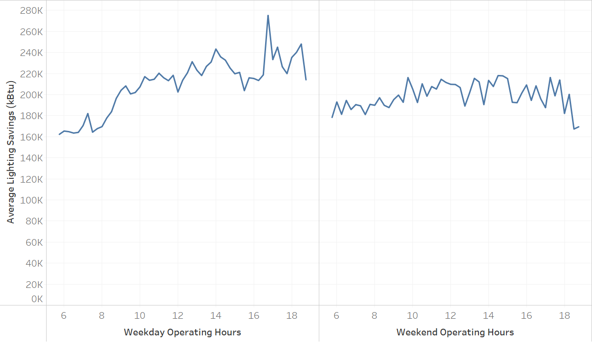
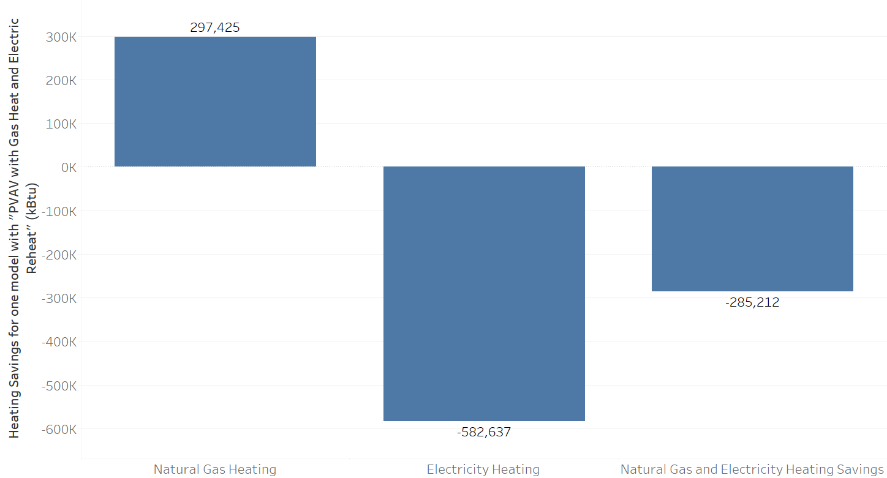

# LED Lighting
{: .fw-500 }
Authors: Amy LeBar, Chris CaraDonna and Andrew Parker

# Executive Summary

Building on the successfully completed effort to calibrate and validate the U.S. Department of Energy’s ResStock™ and ComStock™ models over the past three years, the objective of this work is to produce national data sets that empower analysts working for federal, state, utility, city, and manufacturer stakeholders to answer a broad range of analysis questions.

The goal of this work is to develop energy efficiency, electrification, and demand flexibility end-use load shapes (electricity, gas, propane, or fuel oil) that cover a majority of the high-impact, market-ready (or nearly market-ready) measures. “Measures” refers to energy efficiency variables that can be applied to buildings during modeling.

An *end-use savings shape* is the difference in energy consumption between a baseline building and a building with an energy efficiency, electrification, or demand flexibility measure applied. It results in a timeseries profile that is broken down by end use and fuel (electricity or on-site gas, propane, or fuel oil use) at each timestep.

ComStock is a highly granular, bottom-up model that uses multiple data sources, statistical sampling methods, and advanced building energy simulations to estimate the annual subhourly energy consumption of the commercial building stock across the United States. The baseline model intends to represent the U.S. commercial building stock as it existed in 2018. The methodology and results of the baseline model are discussed in the final technical report of the [End-Use Load Profiles](https://www.nrel.gov/buildings/end-use-load-profiles.html) project.

This documentation focuses on a single end-use savings shape measure—LED lighting. The LED lighting measure replaces interior lights with LEDs where applicable. The measure resulted in 1.25 TBtu energy savings across the building stock, with the majority of savings occurring in retail and warehouse buildings.

# 1. Introduction

This documentation covers LED Lighting upgrade methodology and briefly discusses key results. Results can be accessed on the ComStock data lake “[end-use-load-profiles-for-us-building-stock](https://data.openei.org/s3_viewer?bucket=oedi-data-lake&prefix=nrel-pds-building-stock%2Fend-use-load-profiles-for-us-building-stock%2F)” or via the Data Viewer at comstock.nrel.gov.

| **Measure Title**  | LED Lighting                                                                                         |
| **Measure Definition** | This measure replaces model interior lighting with ComStock Generation 5 LED lighting, where applicable. |
| **Applicability**      | Models without LED lighting installed.  65% of stock floor area.                                         |
| **Not Applicable**     | Models with LED lighting already installed.                                                              |
| **Release**            | EUSS 2023 Release 1                                                                                      |

# 2.  Technology Summary

Light-emitting diode (LED) lighting is now the most common technology in new and retrofit interior lighting systems. Lamps are devices that are generally replaceable and produce light. Examples include incandescent bulbs, compact fluorescent bulbs, T8 and T5 linear fluorescent bulbs, and LED bulbs. “Luminaires” refers to the complete lighting unit that has one or more sockets for lamp connection. Luminaires include all components, such as lamp, power supply, reflector, lens, ballast, and diffuser. Most lighting in commercial buildings presently is in the form of linear fluorescents and fluorescent troffer-style luminaires. There are direct one-to-one LED linear lamp replacements, as well as LED troffers. LED high bay, supplemental, task, and wall wash lighting systems are available to replace halogen and fluorescent lighting common in those applications. Lighting replacements may consist of simple lamp replacements or full luminaire replacements and rewiring to improve space lighting. This measure does not distinguish between lamp and luminaire replacements. Additionally, this measure does not make any changes to the lighting controls in a building.

# 3.  ComStock Baseline Approach

ComStock interior lighting is determined using a lighting generation approach, with each generation representing a collection of lighting technologies typically installed during a given time period. ComStock assumes four categories of lighting: General (overhead lighting), Task (lights focused on specific areas), Supplemental (supplemental lighting), and Wall Wash (illuminates vertical surface). The lighting technologies used in each category across the ComStock lighting generations are listed in Table 1. Generations 4–8 represent varying efficacy levels of LEDs, with Generation 4 being the first LED technology to market, and Generation 8 being the estimated technology level in 2035.

Table 1. Lighting Generations and Associated Technologies for Each Category

{:refdef: style="text-align: center;"}
{:width="650"}
{:refdef}

ComStock uses a similar approach to the ASHRAE 90.1 Lighting Subcommittee for determining the lighting power density (LPD) allowance for a given space type. Equation below calculates the LPD for a space using target illuminance levels as defined by the ASHRAE 90.1 Lighting Subcommittee, and lighting technology properties. Table 2 provides the average installed building-level LPDs in ComStock by building type and lighting generation.

Table 2. Average Building-Level Lighting Power Densities (W/ft2) by Lighting Generation and Building Type

{:refdef: style="text-align: center;"}
{:width="500"}
{:refdef}

Lighting generations are assigned to each building model during sampling based on the year of last interior lighting replacement and the energy code in force during that year. Probability distributions were generated using a Gaussian distribution based on an approximate start and end year for each lighting generation. The probability distributions were duplicated for each energy code in force and further modified to ensure they were realistic (i.e., not let Generation 1 be installed in a ComStock 90.1-2019 building), using a cutoff generation for each energy code in force. Each of the lighting generations were also assigned an arbitrary weight to scale the distributions to represent realistic installation trends. For example, while the installation years of Generation 2 and Generation 3 overlapped, Generation 2 was far more popular and was therefore assigned a higher weight than Generation 3 in the model.

Additionally, small commercial buildings (\<50,000 ft2) tend to retrofit their lighting technology less frequently than large commercial buildings (\>50,000 ft2). To capture this, the interior lighting lifespan values were changed so that large buildings updated their lighting every seven years on average, with small buildings updating their lighting on average every 13 years.

These distributions were validated using data from the *2015 U.S. Lighting Market Characterization* study [1] and the 2019 *Solid-State Lighting* report [2]. The 2018 distribution of lighting generations by building type is given in Figure 1.

{:refdef: style="text-align: center;"}

{:refdef}

{:refdef: style="text-align: center;"}
Figure 1. Installed lighting generation by building type for 2018 simulation year (count-based distribution)
{:refdef}

# 4.  Modeling Approach

This measure replaces model interior lighting with Generation 5 LED lighting, where applicable. The measure will first identify whether the upgrade is applicable to the model. If applicable, it will cycle through each of the spaces in the model, changing the lighting to the appropriate technology based on the space type’s lighting category (as defined in the resource files).

## 4.1  Applicability

The purpose of this measure is to model the energy impact of 100% LEDs in the commercial building stock. To capture this, in all models without LEDs (Generation 1–3), all interior lighting categories will be retrofitted with Generation 5 lighting. Models with Generation 4 will remain unchanged, as there is not a significant change in efficacy (12%) between Generations 4 and 5. Additionally, LEDs have long lifespans (10+ years), and it is not realistic to replace Generation 4 LEDs with a newer technology if the lamps still have many years of usable life left. Models with Generation 5 will also remain unchanged.

In the measure, applicability will be determined by accessing a model’s existing lighting technologies and determining whether the names of the technologies include “LED.” If true, the measure will be registered as not applicable.

# 5.  Output Variables

Table 3 includes a list of output variables that are calculated in ComStock. These variables are important in terms of understanding the differences between buildings with and without the LED lighting measure applied. Additionally, these output variables can be used for understanding the economics (e.g., return of investment) of the upgrade if cost information (i.e., material, labor, and maintenance cost for technology implementation) is available.

Table 3. Output Variables Calculated From the Measure Application

| **Variable Name**         | **Description**                                                                                |
|---------------------------|------------------------------------------------------------------------------------------------|
| Initial Lighting Power    | Initial power by lighting technology (W)                                                       |
| Initial LPD               | Average building LPD (W/ft2)                                                                   |
| Final Lighting Generation | Lighting generation after measure is applied (should be Generation 5 if measure is applicable) |
| Final Lighting Power      | Final lighting power by technology (W)                                                         |
| Final LPD                 | Average building LPD (W/ft2)                                                                   |

# 6.  Results
## 6.1.  Single Building Example

A 37,500-ft2 small hotel in Los Angeles with Generation 1 lighting was selected as a test example. The measure installed Generation 5 lighting. The model initially had T12s and incandescent lights installed, with whole-building powers listed in Table 3. After the measure was applied, all lighting technologies were replaced with LEDs. Building lighting started with 53,616 W (average LPD 1.43 W/ft2) and ended with 8,446 W (average LPD 0.23 W/ft2), which aligns with average LPDs for small hotels in Table 2.

Table 4. Whole-Building Lighting Power by Technology

## 6.2.  Energy Impacts

In general, the measure resulted in savings: both electricity and site energy consumption were reduced across the building stock (Figure 2 and Figure 3). Isolating the interior lighting energy savings in Figure 4, the measure resulted in over 1 million kBtu savings, with the majority of the savings coming from strip mall and warehouse buildings as these building types constitute the highest square footage in the stock. Figure 5 shows the baseline total stock energy consumption versus after the LED measure is applied by end use. The energy consumption of most end uses was affected by the measure, with the exception of interior equipment and exterior lighting.

{:refdef: style="text-align: center;"}
{:width="600"}
{:refdef}

{:refdef: style="text-align: center;"}
Figure 2. Comparison of total electricity consumption between baseline and LED upgrade
{:refdef}

{:refdef: style="text-align: center;"}
{:width="600"}
{:refdef}

{:refdef: style="text-align: center;"}
Figure 3. Comparison of total site energy consumption between baseline and LED upgrade
{:refdef}

{:refdef: style="text-align: center;"}
{:width="600"}
{:refdef}

{:refdef: style="text-align: center;"}
Figure 4. Total interior lighting savings and by building type
{:refdef}

{:refdef: style="text-align: center;"}

{:refdef}

{:refdef: style="text-align: center;"}
Figure 5. Baseline stock energy consumption versus upgrade stock energy consumption by end use
{:refdef}

The majority of the savings came from models with Generation 1 lighting installed originally, which is expected since Generation 1 lighting is the least efficient, sometimes with an LPD several times higher than the proposed Generation 5 lighting (Table 2). Figure 6 shows the average site energy use intensity (EUI) savings by building type and original lighting generation installed. Quick-service restaurants, hospitals, and small hotels saw the highest savings on average. This is driven by the percent LPD savings for the respective building types by switching from the various lighting generations to Generation 5 (Table 2) coupled with the prevalence of the various lighting generations for the building type (Figure 1).

{:refdef: style="text-align: center;"}

{:refdef}

{:refdef: style="text-align: center;"}
Figure 6. Average site EUI savings by building type and original lighting generation
{:refdef}

The measure also accurately followed the applicability criteria and was only applied to models with non-LED lighting generations (Generations 1, 2 and 3), as shown in Figure 7.

{:refdef: style="text-align: center;"}

{:refdef}

{:refdef: style="text-align: center;"}
Figure 7. Measure applicability by lighting generation, demonstrating that the measure was applied to the appropriate models. As expected, the measure did not apply to models that already included LED lighting.
{:refdef}

Figure 8 breaks down the savings by end use. The majority of savings are in the interior lighting category, as expected. Some models saw very low interior lighting savings. This is due to (1) higher efficiency in the original lighting generations (e.g., Generation 3 lighting is only marginally less efficient compared to Generation 5), and (2) shorter operating hours, which resulted in less opportunity for savings (Figure 9).

Some models also saw savings from heat rejection, heat recovery, refrigeration electricity, pump electricity, fan electricity, and electric cooling. LEDs generate less heat during normal operation compared to older lighting technologies, and models that had their interior lighting replaced with LEDs will have lower internal loads which can affect HVAC operation. This explains the savings for electric and cooling, and heat rejection end uses. In a similar vein, we see primarily negative energy savings for heating end uses (natural gas, electric, district and other) because there is less heat being generated by the interior lighting.

{:refdef: style="text-align: center;"}

{:refdef}

{:refdef: style="text-align: center;"}
Figure 8. Distribution of savings (kBtu/ft2) by end use and fuel
{:refdef}

{:refdef: style="text-align: center;"}

{:refdef}

{:refdef: style="text-align: center;"}
Figure 9. Average lighting savings by operating hours
{:refdef}

Some models also produced savings in these end uses: natural gas heating and electricity heating. After closer examination, many models with savings in these heating end uses had reheat HVAC systems. For these systems, all fuels involved in the heating system need to be considered when looking at energy savings. For example, Figure 10 shows the total natural gas and electricity heating consumption savings for models with a “PVAV [packaged variable air volume] with gas heat and electric reheat” HVAC system. When considering only natural gas, the model appears to have lower heating consumption after the interior lights are replaced with LEDs. However, combining natural gas and electricity heating savings shows that the heating system does consume more energy after the LED measure is applied, which is the expected behavior.

Models without reheat HVAC systems seeing positive natural gas and electricity heating savings represent 0.7% and 0.05% of the total stock square footage, respectively. A very small portion of ComStock models demonstrate heating savings due to nuanced load difference caused by reduced lighting. ComStock includes 350,000 models nationally. Within these, there are bound to be some anomalies that result in unanticipated energy consumption trends. Some examples of these anomalies are as follows:

HVAC systems for models with natural gas heating savings:

- PVAV with gas heat with electric reheat

- VAV chiller with gas boiler reheat

- Packaged single zone air conditioner (PSZ-AC) with gas coil

- Residential AC with residential forced air furnace

- Dedicated outdoor air system (DOAS) with water source heat pumps cooling tower with boiler

- Direct evaporative coolers with forced air furnace.

HVAC systems for models with electricity heating savings:

- PVAV with gas heat with electric reheat

- PSZ-AC with electric coil

- DOAS with variable refrigerant flow (VRF)

- DOAS with water source heat pumps and ground source heat pumps.

{:refdef: style="text-align: center;"}

{:refdef}

{:refdef: style="text-align: center;"}
Figure 10. Natural gas and electricity heating consumption savings for a model with “PVAV with gas heat and electric reheat” HVAC system type
{:refdef}

# References

[1] N. Buccitelli, C. Elliott, S. Schober, and M. Yamada. 2017. *2015 U.S. Lighting Market Characterization.* U.S. Department of Energy. doi: [https://doi.org/10.2172/1413883](https://doi.org/10.2172/1413883).

[2] M. Yamada, J. Penning, S. Schober, K. Lee, and C. Elliott. 2019. *Energy Savings Forecast of Solid-State Lighting in General Illumination Applications.* Navigant Consulting for the U.S. Department of Energy. doi: [https://doi.org/10.2172/1607661](https://doi.org/10.2172/1607661).
