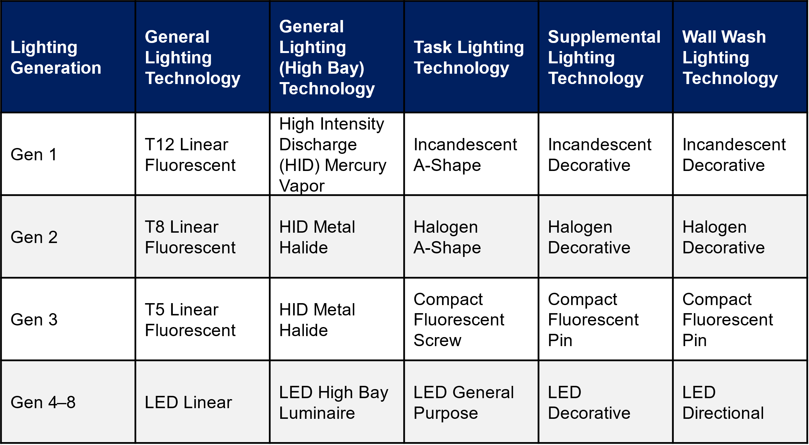

# Window Replacement + Exterior Wall Insulation + Roof Insulation + LED Lighting + HP-RTU + HP-Boiler
{: .fw-500 }
Author: Amy LeBar

#  Executive Summary

Building on the successfully completed effort to calibrate and validate the U.S. Department of Energy's ResStock™ and ComStock™ models over the past 3 years, the objective of this work is to produce national data sets that empower analysts working for federal, state, utility, city, and manufacturer stakeholders to answer a broad range of analysis questions.

The goal of this work is to develop energy efficiency, electrification, and demand flexibility end-use load shapes (electricity, gas, propane, or fuel oil) that cover a majority of the high-impact, market-ready (or nearly market-ready) upgrade measures, or upgrades. "Measures" refers to energy efficiency variables that can be applied to buildings during modeling.

An *end-use savings shape* is the difference in energy consumption between a baseline building and a building with an energy efficiency, electrification, or demand flexibility upgrade applied. It results in a time-series profile that is broken down by end use and fuel (electricity or on-site gas, propane, or fuel oil use) at each time step.

ComStock is a highly granular, bottom-up model that uses multiple data sources, statistical sampling methods, and advanced building energy simulations to estimate the annual subhourly energy consumption of the commercial building stock across the United States. The baseline model intends to represent the U.S. commercial building stock as it existed in 2018. The methodology and results of the baseline model are discussed in the final technical report of the [End-Use Load Profiles](https://www.nrel.gov/buildings/end-use-load-profiles.html) project.

An upgrade package applies one or more End-Use Savings Shapes upgrades to a single building model simulation. Since ComStock is a bottom-up physics-based model, an upgrade package will go beyond aggregating or summing the individual upgrade results and produce novel results by simulating interactions between the upgrades. For example, pairing an envelope upgrade with an electrification upgrade would likely result in higher savings results than the sum of these upgrades individually, and the size of the heating, ventilating, and air conditioning (HVAC) equipment may be reduced if the envelope upgrade reduces the loads significantly.

This documentation focuses on an upgrade package of six End-Use Savings Shapes upgrades---[Window Replacement]({{site.baseurl}}), [Exterior Wall Insulation]({{site.baseurl}}), [Roof Insulation]({{site.baseurl}}), [Light Emitting Diode (LED) Lighting](https://www.nrel.gov/docs/fy24osti/86100.pdf), [Heat Pump Rooftop Unit (HP-RTU)]({{site.baseurl}}), and [Air-Source Heat Pump (ASHP) Boiler]({{site.baseurl}}), which we will refer to collectively as the "High Efficiency Envelope, Interior Lighting, and Heat Pump" package. Depending on applicability criteria, this package will upgrade window, wall, and roof thermal properties to align with those specified in ASHRAE's *Advanced Energy Design Guide* (AEDG), respective of the model's particular climate zone, replace interior lighting with LEDs, and replace RTUs or boiler systems with HPs. It is important to note that HP-RTUs are applied to buildings with gas or electric RTUs, while the HP Boiler measure is applied to buildings with existing boilers systems. They are not applied together in this study. This package is a combination of two other End-Use Savings Shapes upgrade packages: [High Efficiency Envelope]({{site.baseurl}}), and [Interior Lighting and Heat Pump]({{site.baseurl}}). This documentation will cover the same ComStock baseline and measure approach information as in the documentation of those packages. However, package results will be unique as they include interactions between the individual measures. More details on the individual upgrades can be found on the [ComStock Measures Documentation]({{site.baseurl}}) page.

The Window Replacement, Exterior Wall Insulation, Roof Insulation, LED Lighting, HP-RTU, and HP Boiler measures were applicable to 99%, 98%, 99%, 65%, 36%, and 33% of stock floor area, respectively, resulting in the High Efficiency Envelope, Interior Lighting and Heat Pump package being applicable to 100% of the total stock floor area. This package demonstrates 25.0% total site energy savings (1,159 trillion British thermal units \[TBtu\]) for the U.S. commercial building stock modeled in ComStock (Figure 3). The savings are primarily attributed to electrification of gas-furnace and boiler systems, LED installation, and natural gas heating and electricity cooling due to wall and roof insulation improvements and reduced heat gain through windows:

-   **96.3%** stock **heating gas** savings (795.6 TBtu)

-   **-88.4%** stock **heating electricity** savings (-174.7 TBtu)

-   **36.5%** stock **interior lighting electricity** savings (164.9 TBtu)

-   **25.2%** stock **fan electricity** savings (148.5 TBtu)

-   **24.9%** stock **cooling electricity** savings (180.4 TBtu).

The HP-RTU measure demonstrates between 10 and 33 million metric tons (MMT CO2e) of greenhouse gas emissions avoided for the three grid electricity scenarios presented, as well as 53 MMT of greenhouse gas emissions avoided for on-site natural gas consumption.

## Acknowledgments

The authors would like to acknowledge the authors of the original measures in the High Efficiency Envelope, Interior Lighting and Heat Pump package, Lauren Adams, Chris CaraDonna, Amy LeBar, Ryan Meyer, Andrew Parker, and Korbaga Woldekidan. Thank you also to the reviewers of this package, Eric Ringold and Shanti Pless (National Renewable Energy Laboratory).

# 1. Introduction

This documentation covers the High Efficiency Envelope, Interior Lighting and Heat Pump upgrade package methodology and briefly discusses key results. Results can be accessed via the ComStock™ [Published Datasets]({{site.baseurl}}) page.

#  2. Technology Summary

The building envelope refers to the physical barrier between the external environment and the conditioned spaces of a building. It includes a building's windows, walls, roofs, doors, insulation, exterior cladding systems, and air, vapor, and moisture barriers. Envelope technologies affect the energy consumption of several different end uses in a building, such as interior lighting, ventilation, heating, and cooling. According to Better Buildings, these technologies are responsible for 30% of primary energy consumed in residential and commercial buildings \[1\]. Improving the performance of the building envelope can therefore have a substantial impact on whole-building energy consumption.

Additionally, many technologies are used to provide space heating in commercial building HVAC systems. Packaged RTUs are currently used to heat 37% of commercial buildings in the United States (representing 50% of the total commercial floor space) \[2\]. Heat pumps currently provide space heating for only approximately 11% of commercial buildings (representing 15% of the total floor area) \[2\]. Heat pumps offer a high-performance electric option for commercial building space heating. Their use of electricity for heating enables pathways toward decarbonization, as they deliver space heating 2--4 times more efficiently than electric resistance options.

Natural gas used by boilers and furnaces accounts for 73% of space heating end-use energy consumption in the United States \[2\]. Retrofitting natural gas boilers with ASHP boilers offers a decarbonization solution for this equipment.

This upgrade package focuses on three elements of the building envelope: windows, walls, and roofs, and applies LEDs for interior lighting, and also heat pump technologies. The upgrade package applies the Window Replacement, Exterior Wall Insulation, Roof Insulation, LED Lighting, HP-RTU, and/or ASHP Boiler upgrades based on the applicability criteria of each individual upgrade. A model will have all, some, or none of the upgrades applied depending on how the model's characteristics align with each upgrade's applicability criteria.

For details about each of the three technologies, reference their individual upgrade documentation: [Window Replacement]({{site.baseurl}}), [Exterior Wall Insulation]({{site.baseurl}}), [Roof Insulation]({{site.baseurl}}), [LED Lighting](https://www.nrel.gov/docs/fy24osti/86100.pdf), [Heat Pump Rooftop Unit (HP-RTU)]({{site.baseurl}}), and [Air-Source Heat Pump (ASHP) Boiler]({{site.baseurl}}).

# 3. ComStock Baseline Approach

The following sections provide high-level summaries of the ComStock baseline approach for interior lighting, RTUs, and boilers. For more detail about how these systems are modeled in the ComStock baseline, including data sources, reference the ComStock Documentation \[3\].

## 3.1. Windows

The ComStock baseline uses a mix of wood-framed and aluminum-framed windows with or without a thermal break. They range from single-pane to triple-pane and can be clear/tinted or low-emissivity (low-e). The properties were informed by a variety of data sources, described in the ComStock Documentation, and shown in Table 1 \[3\].

Table 1. ComStock Baseline Window Properties

  |**Number of Panes** |  **Glazing Type**  |  **Frame Material**           | **Low-E Coating** |  **Assembly U-Factor IP (Btu/****h ft2 F)** |  **SHGC**  | **VLT\*** |
  |---------------------| -------------------| -----------------------------| ------------------|- ---------------------------------------------- |----------| -----------
  |Single                |Clear              | Aluminum                     | No                |  1.178                                         | 0.744     | 0.754 |
  |Single                |Tinted/Reflective  | Aluminum                     | No                |  1.178                                         | 0.579     | 0.455 |
  |Single                |Clear              | Wood                         | No                |  0.910                                         | 0.683     | 0.723 |
  |Single                |Tinted/Reflective  | Wood                         | No                |  0.910                                         | 0.525     | 0.436 |
  |Double                |Clear              | Aluminum                     | No                 | 0.746                                         | 0.646     | 0.671 |
  |Double                |Tinted/Reflective  | Aluminum                     | No                 | 0.749                                         | 0.484     | 0.411 |
  |Double                |Clear              | Aluminum                     | Yes               |  0.559                                         | 0.386     | 0.591 |
  |Double                |Clear              | Aluminum With Thermal Break  | Yes               |  0.499                                         | 0.378     | 0.591 |
  |Double                |Tinted/Reflective  | Aluminum                     | Yes               |  0.557                                         | 0.274     | 0.359 |
  |Double                |Tinted/Reflective  | Aluminum                     | Yes               |  0.496                                         | 0.266     | 0.359 |
  |Triple                |Clear              | Aluminum                     | Yes               |  0.300                                         | 0.328     | 0.527 |
  |Triple                |Tinted/Reflective  | Aluminum                     | Yes               |  0.299                                         | 0.224     | 0.320 |

\*VLT stands for visible light transmission

## 3.2. Walls

The ComStock baseline uses a mix of mass, metal building, steel-framed, and wood-framed or other walls. The properties and distribution of the wall types were informed by a variety of data sources described in the ComStock Documentation \[3\]. R-value values by climate zone and wall type are shown in Table 2.

Table 2. Wall Assembly Thermal Performance (Outside California)

## 3.3. Roofs

Roofs in ComStock are modeled as flat roofs. For buildings outside of California, we chose a single roof construction type for each building type. As shown in Table 3, most buildings are assumed to use insulation-entirely-above-deck (IEAD) roofs, which is consistent with the assumption of flat roofs. For buildings in California, we used the construction types from the California Public Utilities Commission's Database of Energy Efficiency Resources (DEER) prototype buildings.

Table 3. Roof Construction Types

  |Building Type              |U.S. Department of Energy Ref and 90.1 Construction Type                        |U.S. Department of Energy Ref and 90.1 Building Category for Exterior Roofs   |DEER (CA ONLY) Construction Type   |DEER (CA ONLY) Building Category for Exterior Roofs|
  |-------------------------- |----------------------------------------| --------------------------------------| -------------------| --------------------------------------|
  |Full-Service Restaurant    |IEAD                                     |Nonresidential                         |Wood Framed         |Nonresidential|
  |Hospital                   |IEAD                                     |Nonresidential                         |Mass                |Nonresidential|
  |Large Hotel                |IEAD                                     |Residential                            |IEAD                |Residential|
  |Large Office               |IEAD                                     |Nonresidential                         |Mass                |Nonresidential|
  |Medium Office              |IEAD                                     |Nonresidential                         |Mass                |Nonresidential|
  |Outpatient                 |IEAD                                     |Nonresidential                         |Mass                |Nonresidential|
  |Primary School             |IEAD                                     |Nonresidential                         |Wood Framed         |Nonresidential|
  |Quick-Service Restaurant   |IEAD                                     |Nonresidential                         |Wood Framed         |Nonresidential|
  |Retail                     |IEAD                                     |Nonresidential                         |IEAD                |Nonresidential|
  |Secondary School           |IEAD                                     |Nonresidential                         |Wood Framed         |Nonresidential|
  |Small Hotel                |IEAD                                     |Residential                            |Wood Framed         |Residential|
  |Small Office               |IEAD                                     |Nonresidential                         |Wood Framed         |Nonresidential|
  |Strip Mall                 |IEAD                                     |Nonresidential                         |Wood Framed         |Nonresidential|
  |Warehouse                  |Metal\*                                  |Semiheated\*                           |Wood Framed         |Nonresidential

\*Except pre-1980, which assumes IEAD and nonresidential for all years

## 3.4. Interior Lighting

ComStock interior lighting is determined using a lighting generation approach, with each generation representing a collection of lighting technologies typically installed during a given time period. ComStock assumes four categories of lighting: General (overhead lighting), Task (lights focused on specific areas), Supplemental (supplemental lighting), and Wall Wash (illuminates vertical surface). The lighting technologies used in each category across the ComStock lighting generations are listed in Table 4. Generations 4--8 represent varying efficacy levels of LEDs, with Generation 4 being the first LED technology to market, and Generation 8 being the estimated technology level in 2035.

Table 4. Lighting Generations and Associated Technologies for Each Category

{:refdef: style="text-align: center;"}
{:width="650"}
{:refdef}

ComStock uses a similar approach to the ASHRAE 90.1 Lighting Subcommittee for determining the lighting power density (LPD) allowance for a given space type. Table 5 provides the average installed building-level LPDs in ComStock by building type and lighting generation.

Table 5. Average Building-Level Lighting Power Densities (W/ft2) by Lighting Generation and Building Type

  |**building type**          |**gen1**   |**gen2**   |**gen3**   |**gen4**   |**gen5**|
  |-------------------------- |---------- |---------- |---------- |---------- |--------|
  |full_service_restaurant    |1.51       |0.96       |0.45       |0.43       |0.39 |
  |hospital                   |1.59       |1.07       |0.63       |0.58       |0.52 |
  |large_hotel                |1.31       |0.80       |0.29       |0.23       |0.21 |
  |large_office               |1.18       |0.80       |0.50       |0.53       |0.47 |
  |medium_office              |1.18       |0.80       |0.50       |0.53       |0.47 |
  |outpatient                 |1.27       |0.85       |0.53       |0.52       |0.47 |
  |primary_school             |0.73       |0.56       |0.48       |0.47       |0.42 |
  |quick_service_restaurant   |1.73       |1.11       |0.56       |0.52       |0.47 |
  |retail                     |1.17       |0.75       |0.54       |0.47       |0.42 |
  |secondary_school           |0.88       |0.58       |0.48       |0.45       |0.40 |
  |small_hotel                |1.08       |0.63       |0.28       |0.25       |0.22 |
  |small_office               |1.18       |0.79       |0.50       |0.52       |0.47 |
  |strip_mall                 |1.59       |1.07       |0.65       |0.64       |0.59 |
  |warehouse                  |0.83       |0.40       |0.39       |0.30       |0.27 |

## 3.5. Rooftop Units

The state of the existing RTUs in ComStock is based on a combination of when the buildings were built and how the equipment has been updated over time, described in detail in the "ComStock Documentation" report by the National Renewable Energy Laboratory \[3\]. Equipment performance is assumed to meet the energy code requirements in force at the time and place of installation. For this reason, most of the existing RTUs are modeled as constant air volume with single-speed compressors. This is influential to the results in this analysis because energy savings will be calculated by comparing the energy performance of the ComStock baseline models to an updated version of the ComStock models that use the proposed HP-RTUs.

The in-force energy code for the ComStock baseline is shown as a percentage of applicable floor area in Figure 1. Applicable floor area for this analysis includes ComStock buildings with "PSZ-AC with gas coil" and "PSZ-AC with electric coil" HVAC system types (where PSZ-AC stands for packaged single-zone air conditioner). Most ComStock baseline RTUs follow energy code requirements from the early 2000s. Other energy efficiency features such as demand control ventilation, energy recovery, and economizer control are only applied to baseline ComStock RTUs if required by the in-force energy code for the particular model. The ComStock workflow checks the necessary characteristics of each RTU to determine if the feature is required. Similarly, heating, cooling, and fan efficiencies are set based on the in-force code year. For models with the "PSZ-AC with electric coil" HVAC system type, the ComStock baseline will use electric resistance coils with a coefficient of performance (COP) of 1. For models with the "PSZ-AC with gas coil" HVAC system type, the ComStock baseline will use a gas furnace efficiency of generally around 80%.

{:refdef: style="text-align: center;"}

{:refdef}

{:refdef: style="text-align: center;"}
Figure 1. ComStock baseline in-force energy code followed as a percentage of applicable floor area. Applicable floor area includes ComStock buildings with "PSZ-AC with gas coil" and "PSZ-AC with electric coil" HVAC system types.
{:refdef}

## 3.6. Boilers

The current version of boilers in ComStock are gas-fired, noncondensing boilers. The efficiencies of the boilers are assigned based on the U.S. Department of Energy's reference buildings templates and capacities; Table 6 summarizes the values \[3\]. As indicated in Table 6, three different performance curves were used to adjust the efficiency of the boiler based on part load ratio. All ComStock boilers have a heating set point of 180°F with a capacity to modulate flow.

Table 6. Boiler Efficiency and Performance Curve Assignment

# 4.  Modeling Approach

The following sections summarize the modeling approach and applicability for the High Efficiency Envelope, Interior Lighting and Heat Pump upgrades included in this upgrade package. For more detailed descriptions, reference the individual upgrade documentations.

## 4.1. Window Replacement

The [Window Replacement upgrade]({{site.baseurl}}), replaces the windows of a model with new windows with thermal and tinting properties that align with the properties specified in the *Zero Energy Small/Medium Office* AEDG (Table 7). The upgrade measure will first identify the existing window properties for each ComStock baseline model. In cases where the U-value (thermal transmittance) and SHGC underperform those specified in the AEDG, the windows will be replaced with AEDG-compliant windows.

Table 7*.* AEDG Target Properties for Window Replacements \[4\]

|                                                 |**0**                     |**1**             |**2**   |**3**   |**4**   |**5**   |**6**   |**7**   |**8**|
|**Number of Panes**                              |Double                    | Double         |  Double         | Double         |Double         |Double         |     Double         | Triple | Triple |                                             
|**Fill**                                         |Air                       | Air                       | Air                      | Air                       |Argon or vacuum  | Argon or vacuum  | Argon or vacuum  | Argon or vacuum  | Argon or vacuum  |                                              
|**Thermal Breaks**                               |\~1                       | \~1                       | \~1                       | \~1                       |\>1    | \>1    | \>1    | \>1    | \>1    |                                                           
|**Maximum Assembly U-Factor (Btu/hr ft2 F)**   |0.48             |0.48              |0.43    |0.40    |0.34    |0.34    |0.32    |0.28    |0.25|
|**Maximum SHGC**                                 |0.21                      |0.22              |0.24    |0.24    |0.34    |0.36    |0.36    |0.38    |0.38|

### 4.1.1. Applicability

This upgrade is applicable to models of all building types with existing windows. Triple-pane windows are excluded from this analysis because they are already high performing. However, triple-pane windows are a very low percentage of windows in the commercial building stock. This upgrade effectively replaces windows in over 99% of ComStock floor area.

## 4.2. Exterior Wall Insulation

The [Exterior Wall Insulation upgrade]({{site.baseurl}}) applies extruded polystyrene (XPS) insulation to applicable building models. First, the upgrade determines the thickness of XPS required to meet the specified R-value, determined from the *Zero Energy Small/Medium Office* AEDG target assembly performance for each climate zone (Table 8). Second, it finds all the constructions used by exterior walls in the model, clones them, adds a layer of insulation to the cloned constructions, and then assigns the construction back to the wall. Based on the baseline, the updated wall properties may be close to the target values, but exact target values may not be achieved.

Table . AEDG Overall Wall Assembly Performance Characteristics by Climate Zone \[4\]

  | ASHRAE Climate Zone     |   1 |   2  |  3  |  4  |  5  |  6  |  7  |  8  |
  |--------------------------| ---- |----| ----| ----| ----| ----| ---- |----|
  |  R-Value (hr ft2 F/Btu)  | 13 |  13 |  16 |  16 |  19 |  21 |  21 |  29 |

### 4.2.1. Applicability

Based on the many examples readily identified through a cursory search, it appears that exterior insulation is readily applied to mass, wood-framed, and steel-framed walls. For metal buildings, interior insulation is a more practical and likely retrofit---this upgrade is therefore not applicable to metal buildings.

For modeling purposes, we calculate the thickness of XPS insulation necessary to bring the wall assembly up to the AEDG recommendation for each climate zone. When the existing walls already meet or exceed the AEDG recommendations, this upgrade is not applicable. When the required insulation thickness is less than 0.5 in., this upgrade is not applicable. For required thicknesses greater than 0.5 in., the selected thickness is rounded to the nearest inch using standard rounding to reflect commonly available products.

This upgrade is applicable to 98% of the ComStock floor area.

## 4.3. Roof Insulation

The [Roof Insulation upgrade]({{site.baseurl}}) increases the insulation value of roof surfaces in the models such that the final applied insulation value meets the specified R-value, determined from the *Zero Energy Small/Medium Office* AEDG target assembly performance for each climate zone (Table 9), skipping roof surfaces that already meet or exceed these values. To better align with how insulation is often sold, the applied thickness of additional insulation is rounded up to the nearest inch, which may cause some buildings to slightly exceed the AEDG values. The upgrade assumes XPS insulation with a thermal resistance of R-5/inch.

Table 9. AEDG Overall Target Roof Assembly Performance Characteristics by Climate Zone \[4\]

  | ASHRAE Climate Zone     |   1 |   2  |  3  |  4  |  5  |  6  |  7  |  8 |
  --------------------------| ----| ----| ----| ----| ----| ----| ----| ----|
  | R-Value (hr ft2 F/Btu) |  21 |  26 |  26 |  33 |  33 |  33 |  37 |  37 |

### 4.3.1. Applicability

The roof insulation upgrade is applicable to all roof surfaces with R-values below the target AEDG R-values. For ComStock, only roofs that follow the ComStock 90.1-2013 energy code during the last roof replacement (or installation) have R-values that meet or exceed the AEDG suggestions.

This upgrade is applicable to over 99% of the ComStock floor area.

## 4.4.  Interior Lighting

The [LED Lighting upgrade]({{site.baseurl}}) replaces model interior lighting with Generation 5 LED lighting, where applicable. The upgrade will first identify whether the upgrade is applicable to the model. If applicable, it will cycle through each of the spaces in the model, changing the lighting to the appropriate technology based on the space type's lighting category (as defined in the resource files).

### 4.4.1. Applicability

The purpose of this upgrade is to model the energy impact of 100% LEDs in the commercial building stock. To capture this, in all models without LEDs (Generation 1--3), all interior lighting categories will be retrofitted with Generation 5 lighting. Models with Generation 4 will remain unchanged, as there is not a significant change in efficacy (12%) between Generations 4 and 5. Additionally, LEDs have long lifespans (10+ years), and it is not realistic to replace Generation 4 LEDs with a newer technology if the lamps still have many years of usable life left. Models with Generation 5 will also remain unchanged.

This upgrade is applicable to 65% of the ComStock floor area.

## 4.5.  Heat Pump Rooftop Unit

The [Heat Pump Rooftop Unit (HP-RTU) upgrade]({{site.baseurl}}) replaces RTUs with HP-RTUs where applicable. The HP-RTUs are modeled using the EnergyPlus® "AirloopHVAC:UnitarySystem" object \[5\], \[6\]. An OpenStudio upgrade is used in conjunction with the ComStock workflow to modify/remove any applicable RTUs in the ComStock baseline models ("PSZ-AC with gas coil" and "PSZ-AC with electric coil") and articulate the appropriate HP-RTU objects and settings. Nonapplicable systems are not affected, nor are core operational parameters of systems such as schedules, thermostat set points, unoccupied operation behavior, and design outdoor airflow rates. Furthermore, energy-saving features found in applicable baseline RTUs such as airside heat/energy recovery, economizers, or demand control ventilation are preserved as-is for the new HP-RTU systems. This enables comparability, noting that these features are feasible and available in HP-RTU systems. The modeling details of the HP-RTU system are described further in the individual upgrade documentation.

Heat pumps in cold climates usually require a source of supplemental heat, which today is often sized to meet the entirety of the heating load. This is because with current technology, heat pump capacity generally decreases as outdoor ambient temperatures decrease, which usually corresponds to the highest heating loads for the building. The supplemental heat source is often electric resistance, which has an effective site COP of 1, whereas the heat pump system will often demonstrate a site COP much higher than this even at temperatures down to −17.8°C. Sizing heat pump systems to address more of the heating load is sometimes suggested because the heat pump heating is more efficient than electric resistance, so long as the sizing of the heat pump system still enables effective operation for both heating and cooling \[5\], \[6\]. However, this analysis simply sizes the heat pumps based on cooling load, and reserves studying the impact of other sizing approaches for future analyses.

### 4.5.1. Applicability

The HP-RTU upgrade is applicable to ComStock models with either gas furnace RTUs ("PSZ-AC with gas coil") or electric resistance RTUs ("PSZ-AC with electric coil"). ComStock HVAC distributions are informed by the 2012 Commercial Building Energy Consumption Survey (CBECS). The methodology for interpreting CBECS data to create HVAC probability distributions for ComStock is discussed in the ComStock documentation \[3\]. The upgrade is also not applicable to space types that directly serve kitchens, spaces that are unconditioned, or RTUs with outdoor air ratios above 65% (due to an EnergyPlus bug with cycling operation).

This upgrade is applicable to about 36% of the ComStock floor area.

## 4.6. Air-Source Heat Pump Boiler

The [Air-Source Heat Pump (ASHP) Boiler upgrade]({{site.baseurl}}) replaces natural gas boilers for space heating with ASHP boilers. Outputs from the simulation runs could be used to quantify the carbon reduction and energy impact of the electrification.

The upgrade provides multiple options for the natural gas boiler replacement. Table 10 summarizes the upgrade inputs and their default values used in the simulation run.

Table 10. Upgrade Measure Input Summary

| **Measure Inputs** | **Unit/Value** | **Description**                                                                                                                               | **Default Value**          |
|--------------------|----------------|-----------------------------------------------------------------------------------------------------------------------------------------------|----------------------------|
| Keep_setpoint      | True/False     | Provides an option to keep the original hot water set point.                                                                                  | False                      |
| hw_setpoint        | °F             | Provides a new hot water set point if user chooses to change the original value.                                                              | 140                        |
| autosize_hc        | True/False     | Provides an opportunity to auto-size heating coils when a user provides a new hot water set point.                                            | True                       |
| Sizing_method      |     --           | Provides an option for sizing the heat pump. The two options are sizing based on “percentage of peak load” and on “outdoor air temperature.”  | Outdoor air temperature    |
| hp_sizing_temp     | °F             | Provides the outdoor air temperature on which to base ASHP sizing if user chooses the sizing method as “outdoor air temperature.”             | 17                         |
| hp_sizing_per      | %              | Provides the percentage of the peak heating load on which to base the sizing if user chooses the sizing method as “percentage of peak load.”  | 70                         |
| hp_des_cap         | kW             | Maximum design heat pump heating capacity per unit. If the model requires a higher capacity, multiple units will be added in the loop.        | 40                         |
| bu_type            |   --             | Provides two options for backup heater: keeping the existing boiler or adding an electric resistance heater.                                  | Electric resistance heater |
| hpwh_cutoff_Temp   | °F             | Provides the cutoff temperature for the heat pump boiler.                                                                                     | −5                         |
| hpwh_Design_OAT    | °F             | Provides design outdoor air temperature for the heat pump boiler.                                                                             | 47                         |
| COP                |                | Provides the design coefficient of performance (COP) at the design outdoor air temperature.                                                   | 2.85                       |

### 4.6.1. Applicability

This upgrade is applicable to the ComStock OpenStudio® models with the following HVAC system types: dedicated outdoor air system (DOAS) with fan coil air-cooled chiller with boiler, DOAS with fan coil chiller with boiler, DOAS with fan coil district chilled water with boiler, DOAS with water-source heat pump cooling tower with boiler, packaged single zone air conditioner (PSZ-AC) with gas boiler, packaged variable air volume (PVAV) with gas boiler, PVAV with gas heat with electric reheat, variable air volume (VAV) air-cooled chiller with gas boiler reheat, VAV chiller with gas boiler reheat, and VAV district chilled water with gas boiler reheat.

This upgrade is applicable to about 33% of the ComStock floor area.

## 4.7.  Greenhouse Gas Emissions

Three electricity grid scenarios are presented to compare the emissions of the ComStock baseline and the High Efficiency Envelope, Interior Lighting and Heat Pump scenario. The choice of grid scenario will impact the grid emissions factors used in the simulation, which determines the corresponding emissions produced per kilowatt-hour. Two scenarios---Long-Run Marginal Emissions Rate (LRMER) High Renewable Energy (RE) Cost 15-Year and LRMER Low RE Cost 15-Year---use the Cambium data set, and the last uses the eGrid data set \[7\], \[8\]. All three scenarios vary the emissions factors geospatially to reflect the variation in grid resources used to produce electricity across the United States. The Cambium data sets also vary emissions factors seasonally and by time of day. This study does not imply a preference for any particular grid emissions scenario, but other analysis suggests that the choice of grid emissions scenario can impact results \[9\]. Emissions due to on-site combustion of fossil fuels use the emissions factors shown in Table 11, which are from Table 7.1.2(1) of draft American National Standards Institute/Residential Energy Services Network/International Code Council 301 \[10\]. To compare total emissions due to both on-site fossil fuel consumption and grid electricity generation, the emissions from a single electricity grid scenario should be combined with all three on-site fossil fuel emissions.

Table 11. On-Site Fossil Fuel Emissions Factors 

| **Natural gas **                                                                         |   147.3 lb/MMBtu (228.0 kg/MWh)a |
| **Propane **                                                                             |   177.8 lb/MMBtu (182.3 kg/MWh)    |
| **Fuel oil **                                                                            |   195.9 lb/MMBtu (303.2 kg/MWh)    |

a lb = pound; MMBtu = million British thermal units; kg = kilogram; MWh = megawatt-hour     

## 4.8.  Limitations and Concerns

In general, real buildings may have limitations beyond what has been included in the upgrades' applicability criteria that could affect the upgrade results. The following subsections detail the limitations and concerns for the window replacement and two heat pump upgrades.

### 4.8.1.  Window Replacement

Window assembly U-value is often a function of the ratio of frame area to glass area. ComStock currently uses the simple glazing object, which accepts a constant U-value input regardless of window size and therefore does not capture U-value differences with window size. Furthermore, ComStock does not differentiate between punched windows, curtainwall, storefront, etc., which can have different performance characteristics. Neither of these limitations are expected to impact stock-level analysis in a substantial way.

### 4.8.2.  Heat Pump Rooftop Unit

Limited comprehensive heat pump performance maps exist, which are required for detailed energy modeling. Consequently, understanding of heat pump performance and operation in this work is also limited. Heat pump modeling is sensitive to performance assumptions due to the strong relationship between efficiency and capacity with outdoor air temperature. This impacts both annual energy consumption and peak demand. This work attempts to use the most informative data available and makes documented assumptions about heat pump operation and performance. These will notably impact results. Please consider these assumptions.

Stock savings are sensitive to ComStock baseline assumptions. Compared to CBECS 2012, which is another prominent data source for commercial building stock energy usage, ComStock currently shows lower gas heating consumption and higher electric heating consumption \[11\]. This can affect the net impact of converting both gas furnace and electric resistance RTUs to HP-RTUs.

Lastly, there is a known EnergyPlus bug regarding cycling operation for multispeed coil objects. This can cause the modeled HP-RTU systems to cycle at higher part load fractions than the baseline single-speed RTU systems. Many units are only minimally impacted by this since the HP-RTU systems are variable speed and can turn down to lower part load fractions.

### 4.8.3.  Air-Source Heat Pump Boiler

Some of the boilers in the baseline ComStock models do not have minimum load turndown control. This allows a small flow with insignificant heating in the hot water loop. This had a negative impact during the application of this upgrade, as the upgrade introduces a heat pump loop that is triggered by a nonzero flow in the hot water loop. The small flow in the hot water loop forces the heat pump to cycle frequently and eventually affects the expected savings from the application of this upgrade. This issue should be addressed in the next version of the ComStock models.

Another limitation is regarding the current version of the heat pump object used in this upgrade, the plant loop energy input ratio (EIR) heating heat pump. This object is a constant flow model that requests full design flow from the plant. This limits the ability to model variable speed heat pumps and forces the heat pump to cycle more. This upgrade should be updated in the future once the updated version of the heat pump object with a variable speed option is available.

# 5. Output Variables

Table 12 includes a list of output variables that are calculated in ComStock by the upgrades included in this upgrade package. These variables are important in terms of understanding the differences between buildings with and without the High Efficiency Envelope, Interior Lighting and Heat Pump upgrade package applied. These output variables can also be used for understanding the economics of the upgrades (e.g., return on investment) if cost information (i.e., material, labor, and maintenance costs for technology implementation) is available.

Table 12. Output Variables Calculated From the Upgrade Applications

| **Upgrade**                | **Variable Name**                                 | **Description**                                                                                                                                                                    |
| Window Replacement       | Window-to-Wall Ratio                              | Ratio of window area to exterior wall area for the building model.                                                                                                                 |
|                            | Window Type                                       | Name of window type, as described in Table 1.                                                                                                                                      |
|                            | Average Window SHGC                               | Average SHGC of all the windows in the building model.                                                                                                                             |
|                            | Average Window U-Value                            | Average thermal conductance of all the windows in the building model (Btu/hr ft2 F).                                                                                             |
|                            | Window Area                                       | Total window area replaced by the upgrade (ft2).                                                                                                                                 |
| Exterior Wall Insulation | Target R-value                                    | Target insulation R-value based on climate zone (ft2-hr-R/Btu).                                                                                                                  |
|                            | Insulation R-value per Inch                       | XPS R-value per inch (hr ft2 R/Btu per inch).                                                                                                                                    |
|                            | Required Insulation Thickness                     | Insulation thickness required to meet target R-value (in.).                                                                                                                        |
|                            | Exterior Wall Insulation Area                     | Area of insulation added (ft2).                                                                                                                                                  |
| Roof Insulation          | Energy Code Followed During Last Roof Replacement | The energy code followed during the last roof replacement (or installation) for a building model, which dictates the roof performance properties for the ComStock baseline models. |
|                            | Average Roof Absorptance                          | The average absorptance of all roof surfaces for a building model.                                                                                                                 |
|                            | Average Roof U-Value                              | The average thermal conductivity of all roof surfaces for a building model (Btu/hr ft2 F).                                                                                       |
|                            | Roof Area                                         | The exterior roof area for a building model (ft2).                                                                                                                               |
| LED Lighting| Initial Lighting Power    | Initial power by lighting technology (W)                                                       |
|             | Initial LPD               | Average building LPD (W/ft2)                                                                   |
|             | Final Lighting Generation | Lighting generation after measure is applied (should be Generation 5 if measure is applicable) |
|             | Final Lighting Power      | Final lighting power by technology (W)                                                         |
|             | Final LPD                 | Average building LPD (W/ft2)                                                                   |
| HP-RTU      |stat.hvac\_count\_dx\_cooling\_XX\_to\_XX\_kbtuh|Total number of DX cooling units within a size bin.|
|             |stat.hvac\_count\_dx\_heating\_XX\_to\_XX\_kbtuh|Total number of DX heating units within a size bin.|
|             |stat.hvac\_count\_heat\_pumps\_XX\_to\_XX\_kbtuh|Total number of heat pump units within a size bin.|
|             |stat.dx\_cooling\_average\_cop..COP|Average operational COP (compressor only) of DX cooling models during simulation.|
|             |stat.dx\_cooling\_capacity\_tons..tons|Total tons of DX cooling modeled.|
|             |stat.dx\_cooling\_design\_cop..COP|Average rated (compressor only) COP of DX cooling units at rated conditions.|
|             |stat.dx\_heating\_average\_cop..COP|Average operational COP (compressor only) of DX cooling models during simulation.|
|             |stat.dx\_heating\_average\_minimum\_operating\_temperature..C|Average compressor minimum heating lockout temperature, below which the heat pump heating will be disabled.|
|             |stat.dx\_heating\_average\_total\_cop..COP|Average effective COP of DX heating. This includes energy from the defrost cycle and any supplemental heating.|
|             |stat.dx\_heating\_capacity\_at\_XXF..kBtu\_per\_hr|Average available heat pump capacity at a given temperature.|
|             |stat.dx\_heating\_capacity\_at\_rated..kBtu\_per\_hr|Average available heat pump capacity at rated temperature (47°F).|
|             |stat.dx\_heating\_design\_cop..COP|Average design COP of heat pumps.|
|             |stat.dx\_heating\_design\_cop\_XXf..COP|Heat pump COP at given temperature, or rated conditions (47°F).|
|             |stat.dx\_heating\_fraction\_electric\_defrost|Fraction of heat pump electric defrost energy to DX heating energy.|
|             |stat.dx\_heating\_fraction\_electric\_supplemental|Fraction of heat pump electric supplemental heating energy to DX heating energy.|
|             |stat.dx\_heating\_supplemental\_capacity\_electric..kBtu\_per\_hr|Electric coil supplemental heating capacity.|
|             |stat.dx\_heating\_supplemental\_capacity\_gas..kBtu\_per\_hr|Gas coil supplemental heating capacity.|
|             |stat.dx\_heating\_supplemental\_capacity..kBtu\_per\_hr|Total (gas or electric) supplemental heating capacity.|
|             |stat.dx\_heating\_fraction\_supplemental|Fraction of heat pump heating energy from supplemental heating.|
|             |stat.dx\_heating\_total\_dx\_electric..J|Total heat pump heating electric load.|
|             |stat.dx\_heating\_total\_dx\_load..J|Total heat pump heating load.|
|             |stat.dx\_heating\_total\_load..J|Total heat pump system heating load.|
|             |stat.dx\_heating\_total\_supplemental\_load\_gas..J|Total heating output energy from gas supplemental coil.|
|             |stat.dx\_heating\_total\_supplemental\_load\_electric..J|Total heating output energy from electric supplemental coil.|
|             |stat.dx\_heating\_defrost\_energy..kBtu|Total heat pump electricity energy for defrost.|
|             |stat.dx\_heating\_ratio\_defrost|Ratio of heat pump defrost electricity to heat pump heating energy.|
|             |stat.hours\_below\_XXF..hr|Number of hours below given outdoor air temperature during simulation.|
| ASHP Boiler | Heat pump capacity weighted design COP | COP of the heat pump at the rated design conditions         |
|             | Heat pump average COP                  | Average heat pump COP                                       |
|             | Heat pump total load                   | Total heating provided by heat pump                         |
|             | Boiler total load                      | Total heating provided by boiler                            |
|             | Heat pump total electricity            | Total electricity consumption by heat pump                  |
|             | Boiler total electricity               | Total electricity consumption by boiler                     |
|             | Heat pump capacity kbtuh               | Heat pump capacity                                          |
|             | Count heat pumps                       | Count of heat pumps                                         |
|             | Count heat pumps 0-300 kbtuh           | Count of heat pumps in the range of 0–300 kbtuh capacity    |
|             | Count heat pumps 300-2500 kbtuh        | Count of heat pumps in the range of 300–2500 kbtuh capacity |
|             | Count heat pumps 2500 plus kbtuh       | Count of heat pumps with more than 2500 kbtuh capacity      |
|             | Hot water loop total load              | Total heating load in the hot water loop                    |
|             | Hot water loop boiler fraction         | Fraction of heating load provided by boiler                 |
|             | Hot water loop heat pump fraction      | Fraction of heating load provided by heat pump              |

# 6. Results

In this section, results are presented both at the stock level and for individual buildings through savings distributions. Stock-level results include the combined impact of all the analyzed buildings in ComStock, including buildings that are not applicable to this upgrade. Therefore, they do not necessarily represent the energy savings of a particular or average building. Stock-level results should not be interpreted as the savings that a building might realize by implementing the High Efficiency Envelope, Interior Lighting and Heat Pump package.

Total site energy savings are also presented in this section. Total site energy savings can be a useful metric, especially for quality assurance/quality control, but this metric on its own can have limitations for drawing conclusions. Further context should be considered, as site energy savings alone do not necessarily translate proportionally to savings for a particular fuel type (e.g., gas or electricity), source energy savings, cost savings, or greenhouse gas savings. This is especially important when an upgrade impacts multiple fuel types or causes decreased consumption of one fuel type and increased consumption of another. Many factors should be considered when analyzing the impact of an energy efficiency or electrification strategy, depending on the use case.

## 6.1. Realized Applicability

Figure 2 provides a breakdown of the applicability of the High Efficiency Envelope, Interior Lighting and Heat Pump package by individual measure. The individual component measures were applicable to between 33% and 99% of the stock floor area, and the package was applicable to 100% of the stock floor area.

{:refdef: style="text-align: center;"}

{:refdef}

{:refdef: style="text-align: center;"}
Figure 2. Applicability for the High Efficiency Envelope, Interior Lighting and Heat Pump package and by individual measure
{:refdef}

## 6.2. Stock Energy Impacts

The High Efficiency Envelope, Interior Lighting and Heat Pump package demonstrates 25.0% total site energy savings (1,159 trillion British thermal units \[TBtu\]) for the U.S. commercial building stock modeled in ComStock (Figure 3). The savings are primarily attributed to electrification of gas-furnace and boiler systems, LED installation, and natural gas heating and electricity cooling due to wall and roof insulation improvements and reduced heat gain through windows:

-   **96.3%** stock **heating gas** savings (795.6 TBtu)

-   **-88.4%** stock **heating electricity** savings (-174.7 TBtu)

-   **36.5%** stock **interior lighting electricity** savings (164.9 TBtu)

-   **25.2%** stock **fan electricity** savings (148.5 TBtu)

-   **24.9%** stock **cooling electricity** savings (180.4 TBtu).

{:refdef: style="text-align: center;"}

{:refdef}

{:refdef: style="text-align: center;"}
Figure 3. Comparison of annual site energy consumption between the ComStock baseline and the High Efficiency Envelope, Interior Lighting and Heat Pump scenario. Energy consumption is categorized both by fuel type and end use.
{:refdef}

## 6.3. Stock Greenhouse Gas Emissions Impact

ComStock simulation results show greenhouse gas emissions avoided across two of the three electricity grid scenarios (not LRMER Low RE Cost 15) and all on-site combustion fuel types (Figure 4). For the combined impact across all sources, a single electricity grid scenario should be chosen and combined with all three on-site combustion fuel scenarios. Greenhouse gas emissions avoided from the electricity grid are between 6.2% and 9.7% depending on the scenario chosen. This is due to reduced electricity consumption from the interior lighting, fan, and cooling end uses, but also includes the increase in electricity from electrifying gas-furnace and boiler systems. The 63.6%, 27.1%, and 60.0% emissions avoided from on-site combustion of natural gas, fuel oil, and propane, respectively, are attributable to wall and roof insulation improvements and electrifying some of these combustion-based heating systems.

{:refdef: style="text-align: center;"}

{:refdef}

{:refdef: style="text-align: center;"}
Figure 4. Greenhouse gas emissions comparison of the ComStock baseline and the High Efficiency Envelope, Interior Lighting and Heat Pump scenario
{:refdef}

{:refdef: style="text-align: center;"}
Three electricity grid scenarios are presented: Cambium Long-Run Marginal Emissions Rate (LRMER) High Renewable Energy (RE) Cost 15-Year, Cambium LRMER Low RE Cost 15-Year, and eGrid.\
Note: MMT stands for million metric tons. GHG stands for greenhouse gas.
{:refdef}

## 6.4. Site Energy Savings Distributions

This section discusses site energy consumption for quality assurance/quality control purposes. Note that site energy savings can be useful for these purposes, but other factors should be considered when drawing conclusions, as these do not necessarily translate proportionally to source energy savings, greenhouse gas emissions avoided, or energy cost.

Figure 5 shows the percent savings distributions of the baseline ComStock models versus the High Efficiency Envelope, Interior Lighting and Heat Pump scenario by end use and fuel type for applicable models. Minimal differences are observed for water systems and refrigeration, which see small changes in the baseline due only to minor changes in ambient air temperature that affect the operation of these systems.

### 6.4.1. Other Fuel and Natural Gas Heating

Most of the savings for the "Other Fuel Heating" and "Natural Gas Heating" categories are at 100% owing to replacing the combustion fuel-based system in the baseline with an all-electric heat pump system in the High Efficiency Envelope, Interior Lighting and Heat Pump scenario. Models with less than 100% savings for "Other Fuel Heating" and "Natural Gas Heating" either (1) only have the envelope measures applicable, which results in lower savings, or (2) have only a fraction of their floor area applicable for the HP measures and therefore only see partial heating electrification.

A number of models unexpectedly show "Natural Gas Heating" and "Other Fuel" heating penalties. Closer investigation shows that many of these models only have the LED lighting measure applicable and are therefore losing the internal load provided by pre-LED lighting technologies that was beneficial for heating. Many also have low heating loads, in general, because they are located in warm climates and therefore any small change between the baseline and upgrade model will result in high percentage change. When considering the site energy use intensity (EUI) savings rather than percentage savings, this second point is evident (Figure 6). Some of these models have mixed fuel HVAC systems where large increases in insulation from the envelope measures can change the heating profile of the building and cause one fuel to incur increased energy consumption while another fuel realizes savings. For this reason, a heating penalty in the savings distribution for a single fuel type does not mean the building experienced a net heating penalty when considering the impact on all heating fuels. Additionally, decreasing the SHGC via window replacement can block some beneficial solar heat gain and therefore increase heating load for a building. Whether or not annual heating savings are realized depends on a combination of factors, including the window to wall area, window orientation, thermostat set points, HVAC system, outdoor air temperatures, and amount of solar radiation affecting the window surface. Heating-only HVAC system types can be especially prone to energy penalties from lower SHGC because there is no cooling system to save energy from the decreased solar gains, although this does not reflect other potential such as thermal comfort or glare control.

{:refdef: style="text-align: center;"}

{:refdef}

{:refdef: style="text-align: center;"}
Figure 5. Percent site energy savings distribution for ComStock models with the High Efficiency Envelope, Interior Lighting and Heat Pump package applied by end use and fuel type
{:refdef}

{:refdef: style="text-align: center;"}
The data points that appear above some of the distributions indicate outliers in the distribution, meaning they fall outside 1.5 times the interquartile range. The value for *n* indicates the number of ComStock models that were applicable for energy savings for the fuel type category.
{:refdef}

{:refdef: style="text-align: center;"}

{:refdef}

{:refdef: style="text-align: center;"}
Figure 6. Site EUI savings distribution for ComStock models with the High Efficiency Envelope, Interior Lighting and Heat Pump package applied by end use and fuel type
{:refdef}

{:refdef: style="text-align: center;"}
The data points that appear above some of the distributions indicate outliers in the distribution, meaning they fall outside 1.5 times the interquartile range. The value for *n* indicates the number of ComStock models that were applicable for energy savings for the fuel type category.
{:refdef}

### 6.4.2. Pump Electricity

Pump electricity increased between the baseline and upgrade scenario, as expected, due to the addition of heat pump boilers to the models, which adds equipment to the loop and operates at a lower supply temperature than the existing gas boilers they are replacing.

### 6.4.3. Heating Electricity

A number of models saw heating electricity savings due to higher efficiency performance of HP-RTUs compared with traditional RTUs. Some models also saw heating electricity penalties. This can be attributed to the conversion of combustion-based heating to electricity-based.

### 6.4.4. Heat Recovery

Some models show negative heat recovery savings, noting that the heat recovery end use is for electricity used to operate enthalpy wheels. The negative energy savings are due to increased prevalence of wheel operation caused by increased cycling operation with the HP-RTUs compared to the baseline RTUs. In other words, increased runtime for the air handler can cause increased run time for the enthalpy wheel. This is in part due to an EnergyPlus bug that causes longer cycling operation with the multispeed coil objects used for modeling the HP-RTU. However, the heat recovery end use makes up a very small portion of building stock energy usage, so negative percentage savings in this end use has minimal impact.

### 6.4.5. Cooling Electricity

Some models experience increased "Cooling Electricity" consumption, which is often due to increased insulation holding internally generated heat within the building during cooling season, which can cause an increased cooling load. In some cases, this can cause a net site energy penalty for the building, which is most common when the building's cooling requirements are much higher than the heating requirements. This effect is mitigated with the climate zone-specific insulation targets.

Eight models show greater than 100% energy savings for the cooling end use. This is a [documented issue](https://github.com/NREL/comstock-internal/issues/240) in the HP-RTU upgrade for these models. The DX cooling coil in a fraction of zones that the HP-RTU measure are applied to incur a negative EIR at certain times throughout the year. This issue will be resolved in the next cycle of EUSS upgrade measures, likely by applying curve bounds. This affects a very small subset of the models and has minimal impact on the results.

### 6.4.6. Interior Lighting Electricity

Finally, some models saw an "Interior Lighting Electricity" penalty. This is attributed to the lower VLT from the window measure impacting models with daylight controls. These models may not be able to turn down the interior lights as much or as often with lower VLT windows, which can increase lighting equivalent full load hours (EFLH) and therefore increase lighting energy consumption. Figure 7 shows the relationship between interior lighting electricity percent savings and daylight control fraction. Models with higher daylight control fraction generally see a higher interior lighting penalty. Furthermore, the design interior lighting power density does not change between the baseline and upgrade package scenario, indicating the package is not impacting the interior lighting design. EFLH output variables also show a 1:1 relationship between EFLH percent increase and interior lighting penalty, supporting the conclusion that lower VLT windows are causing the interior lighting energy consumption increase.

{:refdef: style="text-align: center;"}

{:refdef}

{:refdef: style="text-align: center;"}
Figure 7. Daylight control fraction vs. percent savings for interior lighting electricity
{:refdef}

Figure 8 shows the site energy savings distributions between the ComStock baseline and the High Efficiency Envelope, Interior Lighting and Heat Pump scenario by fuel type and total site energy. The total site energy savings distribution shows savings values generally between 15% and 40% for the 25th and 75th percentiles, respectively. Combined site energy savings alone is not a comprehensive assessment of electrification measures, so other considerations should be made as well.

The site electricity distribution shows some energy penalties. These are mostly buildings that changed from gas heat to electric heat, so the penalties are expected. Some of this electricity penalty is reduced or mitigated through savings for cooling, fans, and heat recovery, depending on the building and its climate zone. Many of the buildings, however, show electricity savings. Many of these models had their interior replaced with LEDs, or had their envelope updated. Others are buildings that had electric heating in the baseline; in these cases, the higher-efficiency HP-RTU system reduces electricity usage across multiple end uses.

The "Natural Gas" and "Other Fuel" end uses show many models with near 100% savings. These are buildings that are completely electrified from the HP-RTU or ASHP Boiler measures and where gas is not used for other end uses. Models with less than 100% gas or other fuel savings generally have some nonapplicable gas HVAC system type in the baseline, or other end uses, such as water heating, that are not electrified through the HP-RTU or ASHP Boiler measures. Some of these models only had the envelope measures applied, which resulted in lower heating savings compared to the HP measures. Several models show negative natural gas site savings. These are primarily models that either (1) only had the LED lighting measure applicable and therefore had higher heating requirements, (2) are losing beneficial solar gain through lower SHGCs from the window measure, or (3) have low heating loads that show misleadingly high percentage change in heating consumption, as previously discussed. This is the case for district heating negative savings, as well.

{:refdef: style="text-align: center;"}

{:refdef: style="text-align: center;"}
Figure 8. Percent site energy savings distribution for ComStock models with the High Efficiency Envelope, Interior Lighting and Heat Pump package applied by fuel type
{:refdef}

{:refdef: style="text-align: center;"}
The data points that appear above some of the distributions indicate outliers in the distribution, meaning they fall outside 1.5 times the interquartile range. The value for *n* indicates the number of ComStock models that were applicable for energy savings for the fuel type category.
{:refdef}

## 6.5. Climate Zone Impacts

A building's climate zone can affect the savings from this package (Figure 9). In general, buildings in colder climates had higher site energy savings. This is attributed to higher efficiency heating and increased insulation from the package. Warmer climates had lower median savings and the majority of the models with negative savings from this package. This is likely due to the increased wall and roof insulation holding internally generated heat within the building during cooling season (most of the year in these climate zones), which can cause an increased cooling load.

{:refdef: style="text-align: center;"}

{:refdef}

{:refdef: style="text-align: center;"}
Figure 9. Site EUI savings distribution for ComStock models with the High Efficiency Envelope, Interior Lighting and Heat Pump package applied by climate zone
{:refdef}

{:refdef: style="text-align: center;"}
The data points that appear above some of the distributions indicate outliers in the distribution, meaning they fall outside 1.5 times the interquartile range. The value for *n* indicates the number of ComStock models that were applicable for energy savings for the climate zone.
{:refdef}

## 6.6. Peak Impacts

Figure 10 shows the impact of the High Efficiency Envelope, Interior Lighting and Heat Pump package on seasonal peak hours. The winter and shoulder peaks are shifted later in the day by several hours, and morning electric heating is now driving the peak in these seasons. The summer peak distribution remained relatively similar between the two cases.

{:refdef: style="text-align: center;"}

{:refdef}

{:refdef: style="text-align: center;"}
Figure 10. Maximum daily peak timing by season between the baseline and High Efficiency Envelope, Interior Lighting and Heat Pump scenario
{:refdef}

## References

\[1\] U.S. Department of Energy, \"Building Envelope \| Better Buildings Initiative,\" \[Online\]. Available: [https://betterbuildingssolutioncenter.energy.gov/alliance/technology-solution/building-envelope](https://betterbuildingssolutioncenter.energy.gov/alliance/technology-solution/building-envelope). \[Accessed 5 April 2023\].

\[2\] \"2018 COMMERICAL BUILDINGS ENERGY CONSUMPTION SURVEY (CBECS),\" \[Online\]. Available: [https://www.eia.gov/consumption/commercial](https://www.eia.gov/consumption/commercial). \[Accessed 14 November 2022\].

\[3\] A. Parker, H. Horsey, M. Dahlhausen, M. Praprost, C. CaraDonna, A. LeBar and L. Klun, \"ComStock Reference Documentation: Version 1,\" National Renewable Energy Laboratory, Golden, CO, 2022.

\[4\] ASHRAE, \"Achieving Zero Energy - Advanced Energy Design Guide for Small to Medium Office Buildings,\" ASHRAE, 2019.

\[5\] \"EnergyPlus Version 22.1.0 Documentation Engineering Reference,\" 2022. \[Online\]. Available: [https://energyplus.net/documentation](https://energyplus.net/documentation).

\[6\] \"EnergyPlus Version 22.1.0 Documentation Input Output Reference,\" 2022. \[Online\]. Available: [https://energyplus.net/documentation](https://energyplus.net/documentation).

\[7\] ASHRAE, 2015 ASHRAE Handbook HVAC Applications, 2015.

\[8\] Natural Resources Canada, \"AIR-SOURCE HEAT PUMP SIZING AND SELECTION GUIDE,\" 2020. \[Online\]. Available: [https://natural-resources.canada.ca/sites/nrcan/files/canmetenergy/pdf/ASHP%20Sizing%20and%20Selection%20Guide%20(EN).pdf](https://natural-resources.canada.ca/sites/nrcan/files/canmetenergy/pdf/ASHP%20Sizing%20and%20Selection%20Guide%20(EN).pdf).

\[9\] \"Cambium \| Energy Analysis \| NREL,\" \[Online\]. Available: [https://www.nrel.gov/analysis/cambium.html](https://www.nrel.gov/analysis/cambium.html). \[Accessed 02 September 2022\].

\[10\] \"Emissions & Generation Resource Integrated Database (eGRID) \| US EPA,\" \[Online\]. Available: [https://www.epa.gov/egrid](https://www.epa.gov/egrid). \[Accessed 02 September 2022\].

\[11\] E. Present, P. Gagnon, E. J. H. Wilson, N. Merket, P. R. White and S. Horowitz, \"Choosing the Best Carbon Factor for the Job: Exploring Available Carbon Emissions Factors and the Impact of Factor Selection,\" in *2022 ACEEE Summer Study on Energy Efficiency in Buildings*, Pacific Grove, CA, 2022.

\[12\] G. Vijayakumar, *ANSI/RESNET/ICC 301-2022 - Standard for the Calculation and Labeling of the Energy Performance of Dwelling and Sleeping Units using an Energy Rating Index,* Oceanside, CA, 2022.

\[13\] \"Commerical Buildings Energy Consumption Survey (CBECS),\" 2012. \[Online\]. Available: [https://www.eia.gov/consumption/commercial/data/2012](https://www.eia.gov/consumption/commercial/data/2012). \[Accessed 15 November 2022\].

# Appendix A.  
{:refdef: style="text-align: center;"}

{:refdef}

{:refdef: style="text-align: center;"}
Figure A-1. Site annual natural gas consumption of the ComStock baseline and the package scenario by census division
{:refdef}

{:refdef: style="text-align: center;"}

{:refdef}

{:refdef: style="text-align: center;"}
Figure A-2. Site annual natural gas consumption of the ComStock baseline and the package scenario by building type
{:refdef}

{:refdef: style="text-align: center;"}

{:refdef}

{:refdef: style="text-align: center;"}
Figure A-3. Site annual electricity consumption of the ComStock baseline and the package scenario by census division
{:refdef}

{:refdef: style="text-align: center;"}
m<
{:refdef}

{:refdef: style="text-align: center;"}
Figure A-4. Site annual electricity consumption of the ComStock baseline and the package scenario by building type
{:refdef}