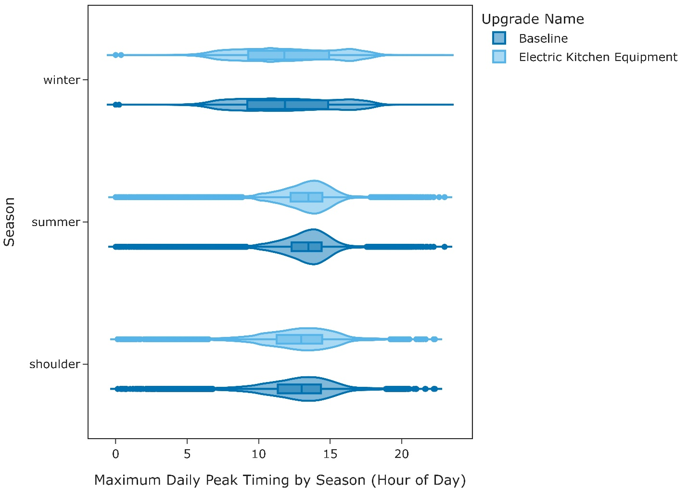

# Electric Kitchen Equipment
{: .fw-500 }

Author: Marlena Praprost

## Executive Summary
Building on the successfully completed effort to calibrate and validate the U.S. Department of Energy's ResStock™ and ComStock™ models over the
past three years, the objective of this work is to produce national datasets that empower analysts working for federal, state, utility,
city, and manufacturer stakeholders to answer a broad range of analysis questions.

The goal of this work is to develop energy efficiency, electrification, and demand flexibility end-use load shapes (electricity, gas, propane,
or fuel oil) that cover a majority of the high-impact, market-ready (or nearly market-ready) measures. "Measures" refers to energy efficiency
variables that can be applied to buildings during modeling.

An *end-use savings shape* is the difference in energy consumption between a baseline building and a building with an energy efficiency,
electrification, or demand flexibility measure applied. It results in a time series profile that is broken down by end use and fuel (electricity
or on-site gas, propane, or fuel oil use) at each time step.

ComStock is a highly granular, bottom-up model that uses multiple data sources, statistical sampling methods, and advanced building energy
simulations to estimate the annual sub-hourly energy consumption of the commercial building stock across the United States. The baseline model
intends to represent the U.S. commercial building stock as it existed in 2018. The methodology and results of the baseline model are discussed in
the final technical report of the [End-Use Load Profiles](https://www.nrel.gov/buildings/end-use-load-profiles.html) project.

This documentation focuses on a single end-use savings shape
measure---Electric Cooking Equipment. This measure replaces gas
commercial cooking equipment with electric equipment where applicable.
The commercial kitchen equipment types modified in this measure include
broilers, fryers, griddles, ovens, ranges, and steamers. Note that the
scope of this study does not include commercial dishwashing equipment.
This measure only affects ComStock building types with kitchens. This
includes hospitals, large hotels, primary schools, secondary schools,
strip malls, quick service restaurants, and full-service restaurants.

This measure was applicable to 37.5% of the ComStock floor area. This
measure demonstrates 2.0% total site energy savings (86 TBtu) for the
U.S. commercial building stock modeled in ComStock (Figure 10). The
savings are primarily attributed to:

-   **88.2%** stock **interior equipment, natural gas** savings (187.0
    TBtu)

-   **−14.1%** stock **interior equipment, electricity** savings (−104.1
    TBtu)

-   **−0.2%** stock **natural gas heating** savings (−1.7 TBtu)

-   **0.6%** stock **cooling electricity** savings (4.1 TBtu).

The Electric Cooking Equipment measure demonstrates between 2 and 8
million metric tons (MMT) of greenhouse gas emissions avoided, measured
in carbon dioxide equivalent (CO<sub>2e</sub>), added for the three grid
electricity scenarios presented, as well as 12 MMT CO<sub>2e</sub> of greenhouse
gas emissions avoided for on-site natural gas consumption.

## 1. Introduction

This documentation covers the Electric Cooking Equipment upgrade
methodology and briefly discusses key results. Results can be accessed
via the ComStock™ [Published
Datasets](https://nrel.github.io/ComStock.github.io/docs/data.html)
page.


| **Measure Title**  | **Electric Cooking Equipment**                 |
| Measure Definition | This measure replaces gas commercial cooking equipment with electric equipment where applicable. The specific equipment types modeled include broilers, fryers, griddles, ovens, ranges, and steamers. |
| Applicability      | This measure is applicable to models with kitchen space types, which include hospitals, large hotels, primary schools, secondary schools, strip malls, quick service restaurants, and full-service restaurants. This measure is applicable to 37.5% of the ComStock floor area. |
| Not Applicable     | This measure is not applicable to models that do not have kitchen space types or models that already have fully electric kitchens. |
| Release            | 2024 Release 1: 2024/comstock_amy2018_release_1/   |

## 2. Technology Summary

Cooking equipment in commercial buildings can consume high amounts of
energy and contribute substantial heat gain to spaces. The California
Commercial End-Use Survey (CEUS) estimates that cooking equipment
consumes 23% of natural gas consumption and 4% of electricity
consumption in commercial buildings \[1\]. The Commercial Buildings
Energy Consumption Survey (CBECS) estimates that cooking equipment
consumes 517 trillion British thermal units (TBtu) annually or 7% of
total commercial building energy consumption \[2\].\
\
Some of the most common types of primary commercial cooking equipment
are broilers, fryers, griddles, ovens, ranges, and steamers. All of
these equipment types have gas-fired or electric options. Gas-fired
cooking equipment has historically been more common in commercial
kitchens due to cooking preferences, cost advantages, and availability
of products. However, in recent years, electric cooking equipment has
gained more interest, sparked by concerns over the health and safety of
gas equipment, combined with a push toward electrification and
decarbonization. Beyond safety and electrification benefits, electric
cooking equipment keeps kitchens cooler and allows for more flexible
layouts by eliminating gas lines \[3\].

This measure replaces existing gas-fired cooking equipment with electric
equivalents. Each of the types of cooking equipment listed above are
modeled separately in the model using a design level in Watts derived
from several sources, primarily the American Society of Heating,
Refrigerating and Air-Conditioning Engineers (ASHRAE) Fundamentals
Handbook \[4\]. Gas equipment specifications, which are typically listed
in British thermal units (Btu)/hour, are converted to watts (W) in the
model. The baseline contains probability distributions of gas and
electric cooking equipment, based on market share estimates for each
type of the six types of modeled equipment \[5\]. In addition to the
design level in Watts, equipment loads are defined by their fractions of
radiant, latent, and lost energy. Gas and electric cooking equipment
operate differently and have their own advantages and disadvantages in
the way they heat food. Therefore, the amount of and type of excess heat
produced will change when switching from gas to electric equipment. This
measure will find all gas cooking equipment in the baseline and upgrade
it to its electric counterpart in applicable kitchen space types. The
change in power may impact internal gains, and therefore heating and
cooling energy, in addition to the equipment end use.

### 2.1 Literature Review

A literature review was performed to determine the rated input power and
fractions of radiant, latent, and lost energy for gas and electric
models for each of the six types of cooking equipment. In addition, this
section outlines the sources used to determine the prevalence of gas and
electric equipment for each of the six appliances modeled.

#### 2.1.1. Rated Input Power
The rated input power of a piece of equipment refers to the maximum
power drawn from the appliance as specified by the manufacturer. This is
different from the rated output, which is the maximum power delivered by
the appliance after its efficiency is taken into account. Because
gas-fired equipment has combustion losses, the efficiencies are lower
and therefore typically require a larger input power to deliver the same
output power as a similar electric model. A variety of sources were used
to find typical rated input values for comparable gas and electric
equipment. These values were then compared to actual equipment on the
market to verify that the rated input assumptions were reasonable. Some
ENERGY STAR<sup>®</sup> appliances list cooking efficiencies as part of their
product specifications, so these were used as an additional check when
available. The sections below walk through this process for each of the
six types of cooking equipment.

##### 2.1.1.1. Broilers

There are several types of commercial broilers, including underfired,
overfired, and salamander. According to a U.S. Department of Energy
(DOE) study, underfired broilers (pictured in Figure 1) are the most
common and versatile type \[6\]; therefore, we will assume this type of
broiler in our modeling.

{:refdef: style="text-align: center;"}

{:refdef}

{:refdef: style="text-align: center;"}
Figure 1. Typical commercial underfired broiler \[6\]
{:refdef}

Table 1 summarizes the rated input power for gas and electric broilers,
as defined by four sources: a 2015 DOE study \[6\], 2002 Food Service
Technology Center (FSTC) Appliance Technology Assessments \[7\], the
2017 ASHRAE Fundamentals Handbook \[4\], and results from a 1993 Pacific
Gas and Electric Company (PG&E) production test kitchen \[5\]. It is
important to note that the FSTC 2002 study and ASHRAE Fundamentals 2017
define these rated input values specifically for underfired broilers,
while the other two sources do not specify the type of broiler. All
rated input power values are shown in Btu/h so that the gas and electric
values can be compared more easily.

Table 1. Comparison of Broiler Rated Input Power From Four Sources

|  **Source​**                          | **Gas (Btu/h)​**  | **Electric (Btu/h)​**   |
| -------------------------------------| -----------------| ----------------------  |
|  2015 DOE Report \[6\]               |  88,000​          | 37,534​                  |
|  FSTC 2002​ \[7\]                     | 90,000--120,000​  | 21,000--46,000​          |
|  ASHRAE 2017​ \[4\]                   | 96,000​           | 36,900​                  |
|  PG&E Production Test Kitchen​ \[5\]  | 105,000​          | 37,500​                  | 

As can be seen, all four sources generally align in their rated input
power assumptions for gas and electric underfired broilers. To verify
that these values were reasonable, an online search was done on a
variety of commercial restaurant equipment websites. The image above,
taken from the DOE study, was used as a baseline when searching for
products, because there is a large range of sizes and models available.
Table 2 summarizes several comparable gas and electric products
available on the market, and their associated rated input power values.

Table 2. Specifications for Commercially Available Gas and Electric
Broilers \[8\] \[9\]


Again, the commercially available products aligned with the rated input
power from the studies. The rated input values from ASHRAE 2017 were
chosen for the model because it is a reputable source, is the most
recent source from our comparison, and contained values specific for
underfired broilers, all of which add credibility and consistency to the
modeling approach. Therefore, the final rated input power values for gas
and electric broilers are 96,000 and 36,900 Btu/h, respectively.

##### 2.1.1.2. Fryers

There are several types of commercial fryers, namely floor-mounted (also
called "open deep-fat"), countertop, and pressure fryers. Floor-mounted
fryers are the most common type \[10\], in which baskets of food are
submerged into a vat of hot oil. The oil can be heated by either fire
tubes (gas-fired) or resistance heaters (electric), as pictured below.

{:refdef: style="text-align: center;"}

{:refdef}

{:refdef: style="text-align: center;"}
Figure 2. Typical commercial open deep-fat fryer \[6\]
{:refdef}

Table 3 details the rated input power for gas and electric fryers from
four sources. Once again, only the FSTC and ASHRAE sources specifically
refer to floor-mounted deep-fat fryers; the others do not specify the
type of fryer.

Table 3. Comparison of Fryer Rated Input Power From Four Sources


\*It is suspected that this study flipped the gas and electric rate
input values, as the gas rated input being significantly lower than
electric contradicts all other studies found and products available.
Fryer data from this source will be disregarded for this reason.

There is some difference in the rated input for fryers, with the DOE
source reporting much higher numbers than ASHRAE and the PG&E study. We
researched commercially available floor-mounted fryers to determine
which data source to use for fryer rated input power. Some gas and
electric fryers and their specifications are shown in Table 4.

Table 4. Specifications for Commercially Available Gas and Electric
Fryers \[11\]


Commercial fryer vats typically range from 15--80 pounds. The fryers
shown above are for 40- and 50-pound vats. Without data to inform what
size is most common, we will assume our model represents a 40-pound
floor-mounted fryer. We once again selected the ASHRAE 2017 rated input
power values for our model, as this source is credible, recent, and
aligns with commercially available products. Therefore, the rated input
power values we model for gas and electric fryers are 80,000 and 47,800
Btu/h, respectively.

The ENERGY STAR Product Finder \[12\] contains product specifications
for commercial fryers that list cooking efficiency for various gas and
electric fryers. Five products of each fuel type were selected, and the
average cooking efficiencies were calculated. For gas fryers, the
average efficiency was 59%, whereas for electric, the average efficiency
was 86%. This means that electric fryers are about 45% more efficient on
average than gas fryers. The rated input values we selected of 80,000
Btu/h for gas and 47,800 Btu/h for electric represent an electric fryer
that is 40% more efficient than its gas counterpart. This efficiency
difference aligns closely with the ENERGY STAR products, further
validating that our rated power assumptions are reasonable.

##### 2.1.1.3. Griddles

The two main types of griddles are standard griddles (flat, one-sided
plate) and double-sided griddles (similar to a panini press). Standard
griddles, as the name suggests, are more common and will be assumed for
modeling.

{:refdef: style="text-align: center;"}

{:refdef}

{:refdef: style="text-align: center;"}
Figure 3. Typical commercial one-sided standard griddle \[6\]
{:refdef}

Table 5 shows the same four sources used previously and their
assumptions for rated input power for gas and electric griddles. ASHRAE
specifies that their values represent a flat, 3-foot griddle, but we can
safely assume that all of them refer to standard, flat griddles.

Table 5. Comparison of Griddle Rated Input Power From Four Sources


All sources are generally in the same range for gas and electric power.
To verify, Table 6 shows some commercially available standard griddles
for comparison.

Table 6. Specifications of Commercially Available Gas and Electric
Griddles \[8\]


The power levels of the griddles shown above align with our sources. The
rated input values for the two 36-inch models match very closely to
ASHRAE, so we can once again feel confident and use the rated input
values from ASHRAE as our assumptions in the model. Therefore, our gas
and electric griddles are modeled as 90,000 Btu/h and 58,400 Btu/h,
respectively.

The ENERGY STAR Product Finder \[12\] does not report cooking efficiency
for griddles, but it does give idle energy use per square foot. Three
products for each fuel type were selected, and the average idle energy
per square foot was calculated. For gas, the average was 2492
Btu/h/ft<sup>2</sup>, and for electric, the average was 869 Btu/h/ft<sup>2</sup>, meaning
the idle conditions of the electric griddle are 65% more efficient than
the gas griddle. The rated power values selected of 90,000 Btu/h and
58,400 Btu/h represent an electric griddle that is 35% more efficient
than its gas counterpart, based on their rated conditions. This is a
more conservative assumption than the ENERGY STAR idle power/ft<sup>2</sup>
values suggest, but the ENERGY STAR products do not report rated power
conditions. Therefore, it is difficult to conclude whether the rated
power and idle power efficiency differences can be extrapolated. Without
additional data to compare, we will leave our rated power assumptions as
is.

##### 2.1.1.4. Ovens

Ovens are one of the most versatile types of cooking appliances, and
therefore one of the most widely used. There are many types of ovens
that utilize different types of heat transfer, including convection,
deck, combination, rack/rotating rack, cook-and-hold, and conveyor
ovens. For the sake of ComStock modeling, our modeling assumes full-size
convection ovens (pictured below), which are common in commercial
kitchens.

{:refdef: style="text-align: center;"}

{:refdef}

{:refdef: style="text-align: center;"}
Figure 4. Typical commercial full-size convection oven \[6\]
{:refdef}

Table 7 gives rated input power estimates for commercial ovens from four
sources. Only the ASHRAE and FSTC sources specify that these numbers
represent a convection oven.

Table 7. Comparison of Oven Rated Input Power From Four Sources


Once again, these numbers were compared to several commercially
available models of full-size convection ovens, both gas and electric.

Table 8. Specifications of Commercially Available Gas and Electric Ovens
\[11\]


The power magnitudes of the products available align with the four
sources we have. We once again elected to use the ASHRAE values as our
final assumptions; therefore, the gas and electric power values used are
44,000 Btu/h and 41,300 Btu/h, respectively.

Five gas and electric convection ovens from the ENERGY STAR Product
Finder \[12\] were selected, and the average cooking efficiencies were
calculated. For gas ovens, the average efficiency was 55%, whereas for
electric, the average efficiency was 78%. The rated power values we
selected based on ASHRAE were closer together than this (only 6%
efficiency improvement); however, we felt more comfortable assuming a
more conservative efficiency improvement when swapping out gas ovens
with electric. In addition, the four sources from Table 7 suggest that
there is not a significant difference in the rated power of gas and
electric ovens; therefore, we kept our assumptions as is to avoid
overestimation of modeled savings.

##### 2.1.1.5. Ranges

Ranges are a standard appliance in most commercial kitchens. Commercial
ranges typically have six burners, as shown below. Most ranges also
contain an oven or warming shelf below the cooktop, which also
contributes to the energy consumption of the appliance.

{:refdef: style="text-align: center;"}

{:refdef}

{:refdef: style="text-align: center;"}
Figure 5. Typical commercial range \[6\]
{:refdef}

Historically, gas ranges have been the standard as long as gas service
is available to the building. However, innovations in electric-powered
ranges have resulted in increased adoption of electric alternatives. In
particular, induction ranges are a fairly new technology that increase
efficiency, safety, and heat gains in a kitchen space. Induction ranges
use copper coils that create a magnetic current when a ferrous metal pot
or pan is placed on the cooktop, heating the cookware directly and
reducing losses. \[13\] This also means that the range is only drawing
power and emitting heat when a metal pot or pan is on the cooktop, which
reduces unnecessary energy consumption and lowers the risk of fires. For
this measure, we intend to model induction cooktops as the electric
option for ranges. We believe that if commercial kitchens are going to
invest money in electrifying their appliances, they would elect for an
induction range for the reasons listed above, as opposed to a standard
electric range.

Table 9 shows the same four sources and their estimates for rated input
power for gas and electric ranges. For the gas equipment, ASHRAE has
several different options for rated input, defined by how many of the
burners are on at one time and whether the oven is on. We have opted to
use the power value corresponding to "six burners on, oven on," as this
represents the maximum potential operation of the range.

Table 9. Comparison of Range Rated Input Power From Four Sources


\*ASHRAE is the only source in this table that differentiates between
induction and electric resistance ranges, and the induction range rated
power was used above. The other sources are assumed to be electric
resistance ranges.

ASHRAE is the only source that provides values for induction ranges
specifically. For this reason, we are inclined to use ASHRAE values, but
have again done our due diligence by checking the specifications for
commercially available products.

Table 10. Specifications of Commercially Available Gas and Electric
Induction Ranges


We have decided to use the ASHRAE values for our assumptions, as ASHRAE
is the only source with values for induction ranges, and the values
match very closely to the products on the market. Therefore, the gas and
electric range rated input power values used in the model are 145,000
Btu/h and 71,700 Btu/h, respectively.

##### 2.1.1.6. Steamers

The last type of cooking equipment modeled in ComStock is commercial
steamers. There are two main types of steamers: atmospheric
(pressure-less) steamers and pressure steamers. Atmospheric steamers can
cook larger volumes of food and therefore may be more suitable for
commercial kitchens, so this is what our model assumes.

{:refdef: style="text-align: center;"}

{:refdef}

{:refdef: style="text-align: center;"}
Figure 6. Typical commercial atmospheric steamer \[6\]
{:refdef}

Table 11 shows the rated input assumptions from the four sources.
Notably, the ASHRAE values are substantially lower than the other three
sources, which has not been the case with any other appliances.

Table 11. Comparison of Steamer Rated Input Power From Four Sources


We researched commercial atmospheric steamers to determine if the power
values were more aligned with ASHRAE or the other three sources.

Table 12. Specifications of Commercially Available Gas and Electric
Steamers \[8\]


Based on the commercially available products we found, the rated input
power values align much more closely with the DOE, FSTC, and PG&E
sources than with ASHRAE. We concluded that the ASHRAE Fundamentals
source must be assuming a much smaller steamer model or a different type
of steamer product, because the values are several times lower than the
other three sources. Therefore, we have chosen for this appliance to use
the PG&E source as the basis for our rated power assumptions. While the
DOE and PG&E values were close in magnitude, the PG&E values assumed a
more conservative efficiency improvement from gas to electric, so we
selected this one to avoid overestimating savings in our results.
Therefore, the gas and electric steamer rated input power values are
assumed to be 200,000 Btu/h and 92,000 Btu/h, respectively.

The ENERGY STAR Product Finder \[12\] contains product specifications
for commercial steamers that list cooking efficiency for various gas and
electric steamers. Five products of each fuel type were selected, and
the average cooking efficiencies were calculated. For gas steamers, the
average efficiency was 46%, whereas for electric, the average efficiency
was 68%. This means that electric steamers are about 54% more efficient
on average compared to gas steamers. The rated input values we
selected---200,000 Btu/h for gas and 92,000 Btu/h for
electric---represent an electric steamer that is 48% more efficient than
its gas counterpart. This efficiency difference aligns pretty closely
with the ENERGY STAR products, further validating that our rated power
assumptions are reasonable. Once again, we feel comfortable using the
slightly more conservative efficiency assumption to avoid overestimating
savings.

#### 2.1.2. Gas and Electric Prevalence

We assume that the baseline model already has some prevalence of
electric cooking equipment. To determine the breakdown, we used
percentages from a 2015 DOE study \[6\]. This study used data from a
1993 study called "Characterization of Commercial Appliances," which
estimated market saturation of gas and electric cooking equipment. These
numbers were then extrapolated to the present day using scaling factors
based on CBECS and other sources. While these numbers may not be
perfect, in the absence of a more recent study on the prevalence of gas
and electric cooking equipment, we use the assumptions from Table 13.

Table 13. Prevalence of Gas and Electric Equipment by Appliance \[6\]


The percentages of gas and electric equipment from Table 13 were
incorporated into the ComStock baseline model through ComStock's
sampling processes \[15\]. For each type of equipment, a building is
assigned either the gas or electric version of the appliance, and the
rated input power and heat gain fractions are assigned in the model.
Buildings in the baseline can have a mixture of gas and electric
appliances.

In addition to the fuel type, the sampling process also determines the
quantity of each appliance, which is based on the building type and
kitchen square footage. [Section 2](#comstock-baseline-approach)
describes how this was done in more detail, and the ComStock Reference
Documentation provides the full explanation of this methodology \[15\].

#### 2.1.3. Fraction Latent, Radiant, and Lost

Gas and electric equipment release heat differently, which affects zone
heating and cooling loads. This heat is divided into four fractions that
must add up to one: fraction convective, fraction latent, fraction
radiant, and fraction lost. As defined by the EnergyPlus<sup>®</sup> Input Output
Reference Documentation \[16\]:

-   Fraction latent: the amount of latent heat given off by electric
    equipment in a zone

-   Fraction radiant: the amount of long-wave radiant heat being given
    off by electric equipment in a zone

-   Fraction lost: the amount of "lost" heat being given off by electric
    equipment in a zone

-   Fraction convective: the amount of heat from electric equipment
    convected to the zone air.

The user defines the fractions latent, radiant, and lost in the model,
and then the fraction convective can be calculated as follows:

```math
FractionConvective = 1 - (FractionLatent + FractionRadiant + FractionLost)
```

In other words,

```math
FractionConvective + FractionLatent + FractionRadiant + FractionLost = 1
```

ASHRAE Fundamentals defines the fraction radiant, latent, and convective
for unhooded equipment, and the fraction radiant for hooded equipment at
idle (ready to cook) conditions. The fractions for gas and electric
equipment differ and are based on a 2009 study on heat gain rates for
commercial kitchen appliances \[17\]. Latent and convective fractions
are not defined by ASHRAE for hooded equipment: "where appliances are
installed under an effective hood, only radiant gain adds to the cooling
load; convective and latent heat from cooking and combustion products
are exhausted and do not enter the kitchen." This may be an optimistic
assumption, as it seems unrealistic for the ventilation hood to remove
exactly 100% of the latent and convective heat from the space in
practice.

ASHRAE categorizes all six types of cooking equipment modeled in
ComStock as hooded \[4\]; therefore, only the radiant fraction is
defined. To be conservative, we assume that the latent and convective
fractions are 0.1 each, because we do not want to assume perfect removal
through the ventilation hood. In addition, an actual kitchen may not
have hoods located directly above the heat source for every piece of
primary cooking equipment, leading to less than optimal performance of
the ventilation hood.

With the latent, radiant, and convective fractions determined, we can
then calculate the fraction lost, which is a required model input. Table
14 shows the final fractions used for each type of gas and electric
equipment.

Table 14. Fraction Latent, Radiant, Convective, and Lost by Appliance


Although the radiant fraction for electric equipment is higher than gas,
the absolute heat gain to the space when switching to electric is often
still lower. This is because the magnitude of the load for the gas
equipment is much higher than the electric counterpart. Therefore, when
multiplying the power by the fractions of latent, radiant, and
convective energy to the space, the gas equipment will still result in
more total heat gain to the space in most cases. The fraction lost is
the fraction of heat removed from the space, and therefore does not
impact zone loads.

## 3. ComStock Baseline Approach

This measure replaces existing gas-fired cooking equipment in kitchen
space types with comparable electric equipment. The measure only applies
to building types in ComStock that already have kitchens:

-   Hospital

-   Large hotel

-   Primary school

-   Secondary school

-   Strip mall

-   Quick service restaurant

-   Full-service restaurant.

Figure 7 shows the fraction of buildings by type that include various
food service types according to CBECS 2012 \[2\]. This data suggests
that medium/large offices and outpatient buildings may have some
prevalence of cooking equipment; however, these models do not currently
contain "kitchen" space types and are therefore not modeled with cooking
equipment. Cooking equipment may be added to these building types in
future ComStock work. Note that food service building types in CBECS do
not use these metrics, so they show 0%, when in reality they are 100%.

{:refdef: style="text-align: center;"}

{:refdef}

{:refdef: style="text-align: center;"}
Figure 7. Weighted fraction of stock floor area with food service by
building type. Data is from CBECS 2012 \[2\]. CBECS samples can include
more than one food service type, so total stock percentage may exceed
100%.
{:refdef}

The ComStock baseline uses building-type-specific probability
distributions of commercial cooking equipment. Multiple data sources
were used to derive these distributions, which include both gas and
electric equipment. The prevalence of gas versus electric fuel types for
each equipment type and the rated power for each gas and electric
appliance are shown in Table 15, and the derivation of these values was
described in [Section 1](#technology-summary).

Table 15. Gas Versus Electric Prevalence and Rated Power for Each
Cooking Appliance


The breakdown of equipment types and quantities for each ComStock
building type was done using a dataset of equipment counts per
restaurant type \[5\]. While this data source is from 1996, there is
limited literature on this topic, and it is not expected that counts of
equipment types in a restaurant would have changed drastically over the
past few decades. The restaurant types were mapped to ComStock building
types, and probability distributions and equipment quantities for each
restaurant type were generated for sampling. In addition, the breakdowns
of gas versus electric equipment were also added via the sampling
process based on the percentages in Table 1.

Figure 8 shows the final sampled breakdowns of equipment type fractions
for each restaurant type. Note that the percentages shown in the
breakdown represent the percent of the total *count* of equipment, not
the percent of energy consumed. As can be seen, some restaurant types
assume vastly different breakdowns of equipment than others based on
what type of food is served in each establishment. In addition, not
every restaurant type has all six types of cooking equipment. This
methodology adds realistic and data-driven diversity to kitchen space
types in ComStock modeling, as opposed to modeling all kitchens in all
building types exactly the same way. Scaling factors are added in the
ComStock workflow to scale equipment counts based on kitchen floor area.
The specific methods and probability distributions used to generate the
cooking equipment quantities for each building type are discussed in the
ComStock Reference Documentation \[15\].

{:refdef: style="text-align: center;"}

{:refdef}

{:refdef: style="text-align: center;"}
Figure 8. Fraction (by equipment count) of cooking equipment types by
restaurant type
{:refdef}

The ComStock workflow then uses the equipment quantities and equipment
fuels from the sample, and the rated power values from Table 15, to
generate equipment objects in the model. Each type of equipment is
modeled as its own object using a design level value in watts (gas
equipment Btu/h values are converted to W). Note that there are separate
object types for gas and electric equipment, but the inputs are the
same. The quantity of equipment is included in the name of the object,
and the design level is calculated by multiplying the quantity by the
rated input power for that appliance from Table 15.

In addition, a "Miscellaneous Electric Kitchen Equipment" object is
included in each kitchen space type to account for non-major electrical
appliances found in kitchens, such as microwaves, heating lamps,
toasters, coffee machines, electric kettles, etc. This miscellaneous
load is calculated such that it represents 10% of the total kitchen
electric load.

An example screenshot of a gas equipment object from a model is shown in
Figure 9. As can be seen, the quantity of the equipment is found in the
object name. The design level field represents the rated input power of
the appliance multiplied by the quantity. Note that the quantities in
the models can be fractional, which is a result of the equipment
quantity calculations based on kitchen size.

{:refdef: style="text-align: center;"}

{:refdef}

{:refdef: style="text-align: center;"}
Figure 9. Example of gas equipment object from OpenStudio<sup>®</sup>
{:refdef}

## 4. Modeling Approach

This measure replaces gas commercial cooking equipment with electric
equipment where applicable.

### 4.1. Applicability

This measure is applicable to models that contain kitchen space types.
This includes the following building types:

-   Hospital

-   Large hotel

-   Primary school

-   Secondary school

-   Strip mall

-   Quick service restaurant

-   Full-service restaurant.

Buildings with kitchens represent approximately 32% of ComStock by
building count and 37% by floor area. A very small fraction (\<0.1%) of
kitchen space types in ComStock are already all-electric; therefore, the
measure will not be applicable to this small subset of buildings. The
vast majority of kitchens have at least one type of gas-fired cooking
equipment in the model.

### 4.2. Methodology

This measure replaces gas commercial cooking equipment with electric
equipment where applicable. More specifically, the measure loops through
the space types in the model to find any kitchen space types. If a
building does not have a kitchen space type, the measure is deemed not
applicable. Next, the measure loops through the equipment objects in the
kitchen space types to find gas equipment objects. If none are found,
this means the kitchen is already all electric, and the model is deemed
not applicable.

There may be up to six gas equipment objects, each representing one of
the six types of modeled cooking equipment (broilers, fryers, griddles,
ovens, ranges, and steamers). The gas equipment object will contain the
quantity of that type of equipment, the total design level (in watts),
and fractions of latent, radiant, and lost heat. All gas equipment
objects found in the model are replaced with the comparable electric
equipment using the rated power values in the rightmost column of Table
16.

Table 16. Equipment Power of Existing Gas Equipment Converted to kW,
Compared With Equipment Power of New Electric Equipment


The measure will extract the equipment quantity from the original gas
equipment object and use this to calculate the design level for the new
electric equipment object. For example, if the original model had a
quantity of two fryers, the new object will have a design level of
26,400 \* 2 = 52.800 watts (equivalent to two electric fryers). This
same methodology is repeated for each of the gas cooking appliances in
the baseline model.

In addition to changing the design level, the measure will replace the
fractions of latent, radiant, and lost heat with the electric equipment
fractions from Table 14. The schedules for the kitchen equipment will
not be altered, as we want to represent a direct replacement of
equipment with no change to operation. Hence, minor differences in
standby operation of gas versus electric equipment is not captured by
this measure as schedules remain the same before and after the swap out.

One important note is that this measure does not touch water heating
equipment in kitchens. For this reason, the measure is called "Electric
Cooking Equipment" as opposed to "All-Electric Kitchens" (or something
that implies that the entire kitchen is electricity-powered). There
could still be gas-powered water heating equipment in the building after
the measure is applied. "All-Electric Kitchens" could be a future
measure developed in a later cycle.

In addition, a "Miscellaneous Electric Kitchen Equipment" object is
included in each kitchen space type to account for non-major electrical
appliances found in kitchens, such as microwaves, heating lamps,
toasters, coffee machines, electric kettles, etc. This miscellaneous
load is calculated in the baseline such that it represents 10% of the
total kitchen electric load. This miscellaneous electric load object in
kitchens is not altered by the Electric Cooking Equipment measure.
However, because the total kitchen load changes as a result of the
measure, the miscellaneous load will no longer represent 10% of the
total kitchen electric load in the final model. The kitchen's electric
load increases substantially as a result of the Electric Cooking
Equipment measure, therefore the miscellaneous electric kitchen
equipment object will represent less than 10% of the kitchen's electric
load in the final model.

## 5. Output Variables

Table 17 includes a list of output variables that are calculated in
ComStock. These variables are important in terms of understanding the
differences between buildings with and without the Electric Cooking
Equipment measure applied. Additionally, these output variables can be
used for understanding the economics (e.g., return on investment) of the
upgrade if cost information (i.e., material, labor, and maintenance
costs for technology implementation) is available.

Table 17. Output Variables Calculated From the Measure Application

{:refdef: style="text-align: center;"}

{:refdef}

\* Note that annual energy consumption fields for electric and natural
gas interior equipment are for the entire building. Energy consumption
attributed to kitchen space types is not broken out in the published
output variables.

## 6. Results

In this section, results are presented both at the stock level and for
individual buildings through savings distributions. Stock-level results
include the combined impact of all the analyzed buildings in ComStock,
including buildings that are not applicable to this upgrade. Therefore,
they do not necessarily represent the energy savings of a particular or
average building. Stock-level results should not be interpreted as the
savings that a building might realize by implementing the Electric
Cooking Equipment upgrade.

Total site energy savings are also presented in this section. Total site
energy savings can be a useful metric, especially for quality
assurance/quality control, but this metric on its own can have
limitations for drawing conclusions. Further context should be
considered, as site energy savings alone do not necessarily translate
proportionally to savings for a particular fuel type (e.g., gas or
electricity), source energy savings, cost savings, or greenhouse gas
savings. This is especially important when an upgrade impacts multiple
fuel types or causes decreased consumption of one fuel type and
increased consumption of another. Many factors should be considered when
analyzing the impact of an energy efficiency or electrification
strategy, depending on the use case.

### 6.1. Single Building Example

This section demonstrates the measure application on a 3,000-ft<sup>2</sup>
full-service restaurant test model in Detroit, Michigan. The measure
installed replaced 1 broiler, 2 griddles, 1 fryer, 3 ovens, and 2 ranges
with electric appliances in the kitchen space type. Steamers in the
existing building were already electric, so they were not affected by
the measure. In addition to swapping fuels and adjusting the design
levels, the measure also replaced the fractions of radiant, latent, and
lost heat in the equipment objects with the corresponding electric
equipment fractions.

The kitchen space type started with 228,019 W of gas cooking equipment
and 26,964 W of electric cooking equipment for a total of 254,983 W. The
model ended with 164,360 W of all-electric cooking equipment, a 36%
reduction in installed power of cooking equipment. The electric
equipment load increased by 3.6x, while the gas equipment load was
eliminated. Other end uses that saw changes were cooling (13% reduction)
and heating (3% increase) because of the changes in internal gains given
off by the new electric cooking equipment. The total site energy of the
existing building was 628 MWh, and the upgraded building had total site
energy of 517 MWh, an 18% reduction.

Table 18. Cooking Equipment Count, Fuel, and Power Before and After
Upgrade Was Applied

{:refdef: style="text-align: center;"}

{:refdef}

### 6.2. Stock Energy Impacts

This measure was applicable to 37.5% of the ComStock floor area. This
measure demonstrates 2.0% total site energy savings (86 TBtu) for the
U.S. commercial building stock modeled in ComStock (Figure 10). The
savings are primarily attributed to:

-   **88.2%** stock **interior equipment, natural gas** savings (187.0
    TBtu)

-   **−14.1%** stock **interior equipment, electricity** savings (−104.1
    TBtu)

-   **−0.2%** stock **natural gas heating** savings (−1.7 TBtu)

-   **0.6%** stock **cooling electricity** savings (4.1 TBtu).

{:refdef: style="text-align: center;"}

{:refdef}

{:refdef: style="text-align: center;"}
Figure 10. Comparison of annual site energy consumption between the
ComStock baseline and the Electric Cooking Equipment upgrade scenario.
{:refdef}

Energy consumption is categorized both by fuel type and end use.

The largest savings are seen in natural gas interior equipment, as most
of this end use is electrified when replacing gas-fired cooking
equipment with electric. As such, there is a large increase in the
electricity interior equipment end use. The total energy consumption due
to all interior equipment is reduced from the baseline to the upgrade, a
result of the efficiency improvements of the new electric cooking
equipment compared to the gas equivalents. A small portion of natural
gas interior equipment remains after the upgrade is applied. This is
because the ComStock model includes a small portion of other natural gas
equipment that was not upgraded by this measure, including commercial
gas clothes dryers in hotels and gas-fired medical equipment in
outpatient buildings.

In addition to interior equipment end uses, this measure had minor
effects on heating and cooling. There was a 0.6% decrease in cooling
energy and a 0.2% increase in all heating end uses. This is due to the
change in internal gains given off by the new kitchen equipment. The new
electric equipment is more efficient and gives off less heat to the
space, meaning some cooling energy is saved in the summer but some
additional heating energy is required in the winter. Because kitchens
only make up a small fraction of the total stock floor area, the impact
is minimal. However, the impact on heating and cooling loads in just
kitchen spaces will be much more substantial.

Overall, the measure resulted in 2.0% total site energy savings. There
was an overall decrease in natural gas energy and an increase in
electricity, which is to be expected when electrifying all gas-fired
cooking equipment. At a stock level, the total electricity consumption
increased by 99 TBtu (3.4%), and natural gas consumption decreased by
186 TBtu (15.4%).

### 6.3. Stock Greenhouse Gas Emissions Impact

ComStock models three electricity grid scenarios to show potential
avoided greenhouse gas emissions: Cambium Long-Run Marginal Emissions
Rate (LRMER) High Renewable Energy (RE) Cost 15-Year, Cambium LRMER Low
RE Cost 15-Year, and Emissions & Generation Resource Integrated Database
(eGRID) \[18\], \[19\]. The overall emissions across all fuels saw a
decrease of 0.5%--3.3% (2--8 MMT CO<sub>2e</sub>) between the three scenarios.
Electricity greenhouse gas emissions increased across all scenarios by
approximately 2.6-3.5% (4--11 MMT CO<sub>2e</sub>), while natural gas emissions
dropped by 14.8% (12 MMT CO<sub>2e</sub>). This is driven by transitioning
natural gas cooking equipment to electric, but also includes the
efficiency improvements of the electric appliances compared to
gas-fired.

{:refdef: style="text-align: center;"}

{:refdef}

{:refdef: style="text-align: center;"}
Figure 11. Greenhouse gas emissions comparison of the ComStock baseline
and the Electric Cooking Equipment upgrade scenario.
{:refdef}

Three electricity grid scenarios are presented: Cambium Long-Run
Marginal Emissions Rate (LRMER) High Renewable Energy (RE) Cost 15-Year,
Cambium LRMER Low RE Cost 15-Year, and eGRID. MMT stands for million
metric tons.

### 6.4. Site Energy Savings Distributions

This section discusses site energy consumption for quality
assurance/quality control purposes. Note that site energy savings can be
useful for these purposes, but other factors should be considered when
drawing conclusions, as these do not necessarily translate
proportionally to source energy savings, greenhouse gas emissions
avoided, or energy cost.

Figure 12 shows the percent savings distributions of the baseline
ComStock models versus the Electric Cooking Equipment upgrade scenario
by end use and fuel type for applicable models. Interior equipment,
which includes cooking equipment, had the most noticeable change, as
expected. Natural gas interior equipment saw savings of nearly 100%.
Buildings that do not show 100% savings in natural gas equipment have
other types of natural gas equipment that were not upgraded in this
measure (e.g., commercial gas clothes dryers in hotels and gas-fired
medical equipment in outpatient buildings).

Electric interior equipment saw a large increase in energy consumption
due to the nature of electrifying all cooking appliances. However, the
change is not a 100% increase, because the building started out with
other electric equipment loads in non-kitchen space types. In addition,
the new electric cooking equipment is generally 2--3 times more
efficient (by rated input power) compared to the existing gas equipment.
Every building that received the upgrade showed a decrease in natural
gas equipment energy and an increase in electric equipment energy, which
is expected.

{:refdef: style="text-align: center;"}

{:refdef}

{:refdef: style="text-align: center;"}
Figure 12. Percent site energy savings distribution for ComStock models
with the Max Tech HVAC package applied by end use and fuel type
{:refdef}

The data points that appear above some of the distributions indicate
outliers in the distribution, meaning they fall outside 1.5 times the
interquartile range. The value for n indicates the number of ComStock
models that were applicable for energy savings for the fuel type
category.

Heating, ventilating, and air conditioning (HVAC) end uses had minor
changes caused by the changes in internal gains when swapping out
cooking equipment. In general, the new electric equipment has lower
energy consumption and lower internal gains to the space, leading to
some cooling savings and heating penalties in most cases. However, some
buildings can show the opposite result based on the climate zone and the
heating and cooling demands of the building. Upon investigation, the
buildings showing cooling penalties or heating savings are in extreme
climates that are either very heating dominated or very cooling
dominated. Therefore, a small magnitude change in these end uses makes
up a large percent change. For example, buildings showing large heating
savings are mostly Florida and Arizona buildings, which have small
heating loads to begin with.

This measure only touched kitchen space types, which make up a
relatively small portion of floor area in most building types, so the
impact on total HVAC load is usually minor. Buildings that show larger
changes in HVAC loads are buildings where the kitchen space makes up a
large portion of the floor area, such as restaurants or strip malls.
Upon investigation, the buildings with high heating penalties and
cooling savings (10% or more) are all quick service or full-service
restaurants. In these buildings, kitchen space makes up a large portion
of the building, and therefore drives the building's load, so
substantial changes to internal loads in the kitchen space can cause
high percentage changes in HVAC loads.

Minimal or no differences are observed for water systems, refrigeration,
lighting, and heat rejection/heat recovery, as these systems are not
touched by the upgrade. Some buildings have very minimal changes due
only to minor changes in ambient air temperature that affect the
operation of these systems.

### 6.5. Peak Impacts

Figure 13 shows the impact of the Electric Cooking Equipment upgrade on
seasonal peak hours. The seasonal peak times had very little change from
the baseline to the upgrade, which is to be expected, as this measure
only altered cooking equipment power, not schedules.

{:refdef: style="text-align: center;"}

{:refdef}

{:refdef: style="text-align: center;"}
Figure 13. Maximum daily peak timing by season between the baseline and
the Electric Cooking Equipment upgrade scenario
{:refdef}

Figure 14 compares the noncoincident peak electricity demand intensity
for the median building between the ComStock baseline and the Electric
Cooking Equipment upgrade scenario. Results are presented by ComStock
building type. All building types with kitchens (full-service
restaurant, hospital, large hotel, primary school, quick service
restaurant, retail strip mall, and secondary school) saw an increase in
electric peak load intensity for all three seasons (summer, winter, and
shoulder). The added electric equipment load in these building types
caused the peak to increase. The magnitude of the change depends on the
density of kitchen equipment in the building. The peak increases were
rather uniform across seasons; however, the winter peaks had a slightly
higher change because the new, more efficient equipment caused a small
increase in heating loads during winter.

{:refdef: style="text-align: center;"}

{:refdef}

{:refdef: style="text-align: center;"}
Figure 14. Maximum daily peak intensity by season and building type
between the baseline and the Electric Cooking Equipment upgrade scenario
{:refdef}

Restaurants see the largest change in peak intensity (21%--37%) because
their load is dominated by cooking equipment. The other building types
with kitchens see their peak intensity increase by up to 11% due to the
addition of the new electric cooking loads. All remaining building types
do not have kitchens and therefore have no change in peak loads from
this measure.

### 6.6. Building Type Impacts

Figure 15 and Figure 16 show the impacts of the Electric Cooking
Equipment upgrade on natural gas and electricity consumption across the
building types in the stock. The largest changes occurred in restaurants
and strip malls because of their high density of cooking equipment.
Schools, hospitals, and large hotels also have some cooking equipment;
however, the kitchen space is a relatively small portion of the building
area, so the changes in energy consumption are lower. The remaining
building types do not have kitchens; therefore, they were not affected
by this measure and show no change in natural gas or electricity
consumption.

{:refdef: style="text-align: center;"}

{:refdef}

{:refdef: style="text-align: center;"}
Figure 15. Annual stock natural gas consumption by building type before
and after the Electric Cooking Equipment upgrade was applied
{:refdef}

{:refdef: style="text-align: center;"}

{:refdef}

{:refdef: style="text-align: center;"}
Figure 16. Annual stock electricity consumption by building type before
and after the Electric Cooking Equipment upgrade was applied
{:refdef}

##  References

\[1\] \"California Commercial End-Use Survey,\" California Energy Commission, 2006.

\[2\] U.S. Energy Information Administration, \"Commercial Buildings Energy Consumption Survey (CBECS),\" 2018. \[Online\]. Available: <https://www.eia.gov/consumption/commercial/>.

\[3\] Ameren, \"Gain Efficiency, Simplicity and Flexibility With Electric Commercial Kitchen and Water Heating Equipment,\" 20 March 2023. \[Online\]. Available: <https://www.ameren.com/company/resource-center/Gain-Efficiency-Simplicity-Flexibility-With-Electric-Commercial-Kitchen-Water-Heating-Equipment>.

\[4\] American Society of Heating, Refrigerating, and Air-Conditioning Engineers, Inc. , 2017 ASHRAE Handbook - Fundamentals, Atlanta, 2017.

\[5\] S. Rahbar, S. Krsikapa, D. Fisher, J. Nickel, S. Ardley, D. Zabrowski and R. F. Barker, \"Technology Review of Commercial Food Service Equipment,\" Canadian Gas Research Institute, Toronto, 1996.

\[6\] W. Goetzler, M. Guernsey, K. Foley, J. Young and G. Chung, \"Energy Savings Potential and RD&D Opportunities for Commercial Building Appliances (2015 Update),\" U.S. Department of Energy, Office of Energy Efficiency and Renewable Energy, Building Technologies Office, Burlington, MA, 2016.

\[7\] Food Service Technology Center (FSTC),\"Commercial Kitchen Appliance Assessment Report,\" 2002.

\[8\] TheWEBstaurant Store, LLM, \"WebstaurantStore,\" 2024. \[Online\]. Available: <https://www.webstaurantstore.com/>.

\[9\] GoFoodservice, \"GO!FOODSERVICE Restaurant Equipment and Supplies,\" 2024. \[Online\]. Available: <https://www.gofoodservice.com/>.

\[10\] Marietta Power and Water, \"Understanding Demand - Commercial Cooking,\" \[Online\]. Available: <https://c03.apogee.net/mvc/home/hes/land/el?utilityname=mp&spc=ud&id=1130>.

\[11\] KaTom Restaurant Supply, Inc., \"Restaurant Equipment,\" 2024. \[Online\]. Available: <https://www.katom.com/cat/restaurant-equipment.html>.

\[12\] United States Environmental Protection Agency (U.S. EPA), \"ENERGY STAR Product Finder,\" \[Online\]. Available: <https://www.energystar.gov/productfinder/>.

\[13\] U.S. Department of Energy, \"Making the Switch to Induction Stoves or Cooktops,\" 11 May 2023. \[Online\]. Available: <https://www.energy.gov/articles/making-switch-induction-stoves-or-cooktops>.

\[14\] Chef\'s Deal Restaurant Equipment Company, \"Cooking Equipment,\" 2024. \[Online\]. Available: <https://www.chefsdeal.com/cooking-equipment.html>.

\[15\] A. Parker, H. Horsey, M. Dahlhausen, M. Praprost, C. CaraDonna, A. LeBar and L. Klun, \"ComStock Reference Documentation: Version 1,\" National Renewable Energy Laboratory, Golden, 2023.

\[16\] U.S. Department of Energy, \"EnergyPlus Version 9.6.0 Documentation - Input Output Reference,\" 2021.

\[17\] R. Swierczyna, P. Sobiski and P. Don Fisher, \"Revised Heat Gain Rates from Typical Commercial Cooking Appliances from RP-1362,\" in *ASHRAE*, 2009.

\[18\] National Renewable Energy Laboratory, \"Cambium,\" \[Online\]. Available: <https://www.nrel.gov/analysis/cambium.html>. \[Accessed 2 September 2022\].

\[19\] United States Environmental Protection Agency, \"Emissions & Generation Resource Integrated Database (eGRID),\" 30 January 2024. \[Online\]. Available: <https://www.epa.gov/egrid>.
